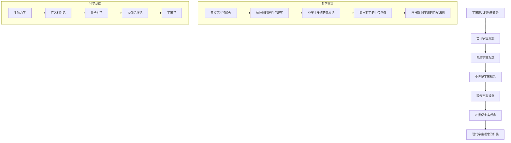
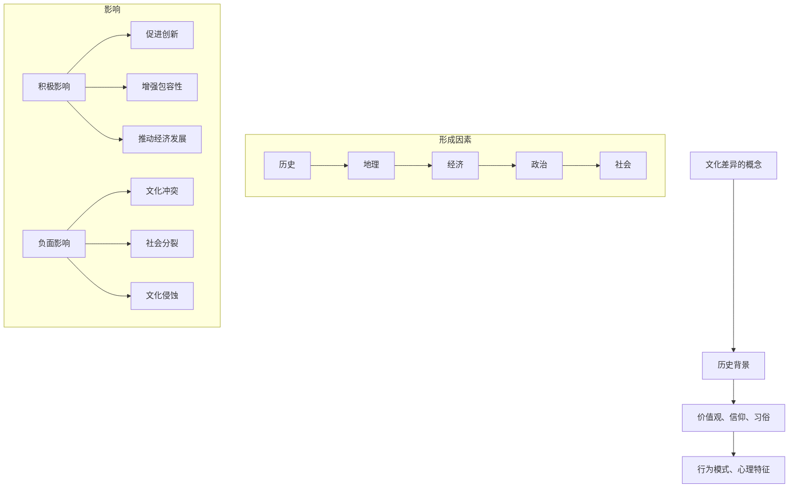
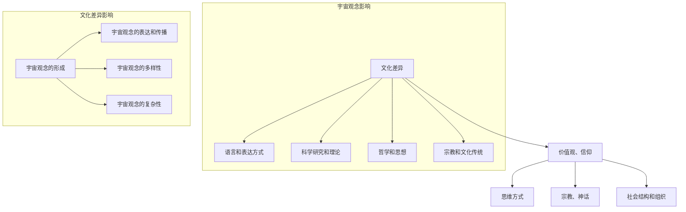
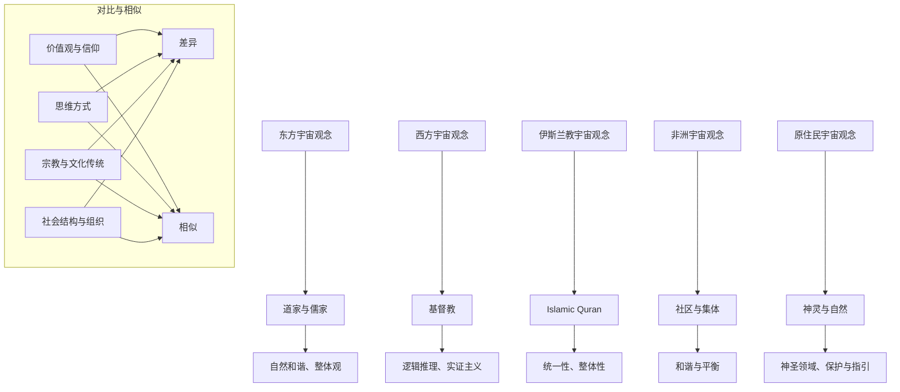
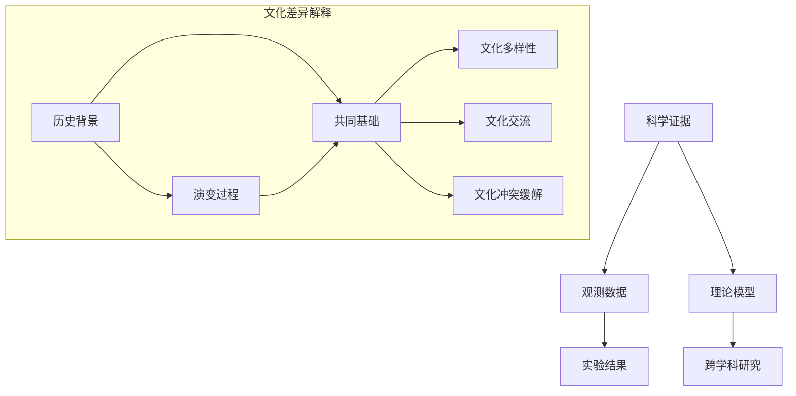
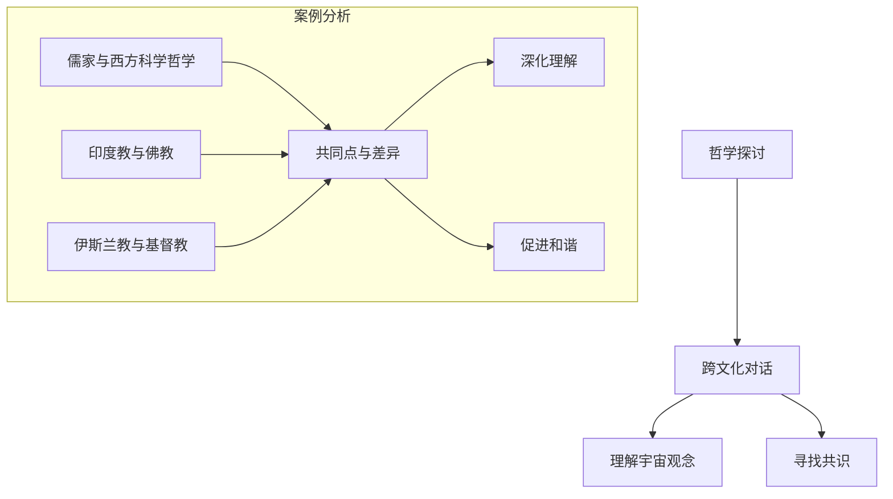

                 

### 引言

在探讨人类对宇宙的认知过程中，宇宙观念和文化差异这两个概念扮演着至关重要的角色。宇宙观念指的是人类对于宇宙本质、结构、起源和演化等方面的理解，而文化差异则涉及到不同社会、民族和地区在价值观、信仰、习俗和思维方式等方面的差异。本文旨在探讨宇宙观念和文化差异之间的关系，揭示它们在人类历史和社会发展中的影响。

宇宙观念的形成不仅受到科学发展的制约，也受到文化背景的深刻影响。不同文化背景下的人们对宇宙有着不同的认知和理解。例如，古代东方的道家思想认为宇宙是一个自然的、自发的、和谐的体系，而西方的基督教文化则将宇宙视为上帝创造的、有目的和意义的体系。这种文化差异导致了不同文化对宇宙观念的多样性。

文化差异不仅体现在宇宙观念上，也反映在科学研究的过程中。科学家的研究方法和理论框架往往受到其所在文化的熏陶。例如，西方科学强调实证主义和逻辑推理，而东方科学则更注重整体观和直觉思维。这种差异使得不同文化背景下的科学家在解释宇宙现象时可能会有不同的观点和方法。

本文将从以下几个方面展开讨论：

1. **宇宙观念的概述**：介绍宇宙观念的历史背景、科学基础和哲学探讨。
2. **文化差异的概述**：探讨文化差异的概念、历史背景和影响。
3. **宇宙观念与文化差异的关系**：分析宇宙观念如何受到文化差异的影响，以及文化差异如何影响宇宙观念。
4. **跨文化宇宙观念比较**：比较不同文化对宇宙观念的理解和表达。
5. **科学证据与文化差异**：探讨科学证据如何解释宇宙观念的文化差异。
6. **哲学探讨与跨文化对话**：探讨哲学上的跨文化对话以及如何从哲学角度理解宇宙观念的文化差异。
7. **项目实战与案例分析**：通过实际案例来展示宇宙观念和文化差异的研究方法和应用。

通过本文的探讨，我们希望读者能够对宇宙观念和文化差异有更深入的理解，认识到它们在人类认知宇宙过程中的重要性和相互影响。

### 文章标题

《宇宙观念的文化差异：理解人类对宇宙的不同视角》

### 文章关键词

- 宇宙观念
- 文化差异
- 跨文化比较
- 科学证据
- 哲学探讨
- 社会因素
- 历史背景

### 文章摘要

本文探讨了宇宙观念和文化差异之间的关系，分析了宇宙观念如何受到文化差异的影响，以及文化差异如何影响宇宙观念。通过回顾宇宙观念的历史背景、科学基础和哲学探讨，我们揭示了不同文化背景下人们对宇宙的理解和表达方式。本文还比较了不同文化对宇宙观念的差异，探讨了科学证据如何解释这些差异，并通过哲学探讨和跨文化对话提供了进一步的理解。最后，本文通过实际案例展示了宇宙观念和文化差异的研究方法和应用，为读者提供了一个全面且深入的探讨。

### 1. 宇宙观念的历史背景

宇宙观念的历史可以追溯到古代，当时人类对宇宙的认知主要依赖于直观感受和神话传说。这些早期的宇宙观念通常被描绘为一种有序且和谐的存在，反映了对自然界的敬畏和崇拜。

在古代希腊，宇宙观念有了初步的科学基础。希腊哲学家如泰勒斯、赫拉克利特和毕达哥拉斯等人，开始通过理性思考和数学模型来探讨宇宙的本质。泰勒斯认为宇宙是由水构成的，而赫拉克利特则提出了“火”作为宇宙的本质。毕达哥拉斯则提出了数学与宇宙结构的联系，认为宇宙是一个有序且和谐的数学结构。

随着科学革命的发展，宇宙观念发生了巨大的转变。哥白尼提出了日心说，挑战了长期以来占主导地位的地心说。伽利略通过望远镜观察到了木星的卫星和其他天文现象，进一步支持了哥白尼的理论。牛顿的万有引力定律和宇宙演化理论则为宇宙观念提供了更为坚实的科学基础。

20世纪以来，宇宙观念继续发展。爱因斯坦的相对论揭示了时空和引力的本质，扩展了人类对宇宙的认知。大爆炸理论则提出了宇宙起源和演化的新视角。哈勃的宇宙膨胀观测结果进一步支持了大爆炸理论，并揭示了宇宙的膨胀趋势。

近年来，宇宙观念的研究不仅局限于物理学，还涉及到宇宙学、天文学和其他科学领域。例如，宇宙微波背景辐射的观测为宇宙大爆炸提供了重要证据，而暗物质和暗能量的研究则揭示了宇宙的某些未解之谜。

总的来说，宇宙观念的历史背景展示了人类对宇宙认知的不断演进和深化。从直观感受和神话传说，到科学理论和实证研究，宇宙观念的发展不仅丰富了我们的科学知识，也深刻影响了我们的哲学思考和文化价值观。

#### 1.1 哲学探讨

宇宙观念的哲学探讨源于古代哲学家对宇宙本质的思考。这些哲学家的观点不仅影响了当时的宇宙观念，也对后世的思想产生了深远的影响。

古希腊哲学家赫拉克利特提出了“火”作为宇宙的本质，他认为宇宙是一个永恒流动的实体，这一观点后来被柏拉图和亚里士多德等人进一步发展。柏拉图认为宇宙由理性和现实两个世界组成，现实世界是理性世界的投影。而亚里士多德则认为宇宙是由四个元素（水、土、气、火）组成的，这些元素的不同组合形成了各种物体。

中世纪的基督教哲学家进一步发展了宇宙观念。奥古斯丁和托马斯·阿奎那等人将宇宙视为上帝创造的，有目的和意义的体系。奥古斯丁认为，宇宙是由上帝创造并维持的，上帝是宇宙存在的终极原因。托马斯·阿奎那则通过自然法则和目的论来解释宇宙的秩序和结构。

文艺复兴时期，宇宙观念开始向科学方向转变。哥白尼的日心说挑战了长期以来占主导地位的地心说，开启了现代宇宙观念的先河。伽利略和牛顿等科学家的研究成果进一步推动了宇宙观念的发展，使得宇宙观念逐渐从宗教和哲学中独立出来，成为科学研究的对象。

启蒙时期，哲学对宇宙观念的探讨更加深入。笛卡尔提出了机械唯物主义宇宙观，认为宇宙是一个巨大的机械系统。莱布尼茨则提出了二元论，认为宇宙既包含物质实体，也包含精神实体。

现代哲学对宇宙观念的探讨继续深化。康德提出了星云假说，认为宇宙起源于一个巨大的星云，并逐渐演化成现在的结构。黑格尔则通过辩证法探讨了宇宙的历史和发展过程。

总体而言，哲学探讨为宇宙观念提供了丰富的理论基础，不同的哲学流派和思想家从不同的角度对宇宙的本质和结构提出了独特的见解。这些哲学探讨不仅丰富了宇宙观念的内容，也推动了科学研究的进步。

#### 1.2 科学基础

宇宙观念的科学基础主要通过观测和理论模型来建立。其中，观测是获取宇宙信息的重要手段，而理论模型则是对观测结果进行解释和预测的工具。

观测宇宙的方法主要包括天文观测、粒子探测和引力波探测。天文观测利用望远镜和各种探测器来观察宇宙中的天体和现象，例如恒星、行星、星系、黑洞和中子星等。粒子探测则通过粒子加速器和宇宙射线观测来研究宇宙中的基本粒子和相互作用。引力波探测则是近年来发展起来的新技术，通过测量引力波对时空的影响来探索宇宙的某些极端现象。

在理论模型方面，宇宙观念的科学基础主要包括以下几个重要理论：

1. **牛顿力学**：牛顿力学是描述宏观物体运动和相互作用的基础理论。在宇宙尺度上，牛顿力学描述了行星的运动和星系的旋转等。

2. **广义相对论**：广义相对论是由爱因斯坦提出的，用于描述引力和时空的几何性质。广义相对论揭示了时空的弯曲效应，并解释了黑洞和引力波等现象。

3. **量子力学**：量子力学是描述微观粒子行为的理论。在宇宙尺度上，量子力学与广义相对论存在一定的冲突，但目前的研究正试图找到统一量子力学与广义相对论的理论框架。

4. **大爆炸理论**：大爆炸理论是描述宇宙起源和演化的理论。根据大爆炸理论，宇宙起源于一个极度热密的状态，并逐渐膨胀和冷却，形成了现在的结构。

5. **宇宙学**：宇宙学是研究宇宙的性质、结构和演化的科学。它涉及到宇宙的膨胀、暗物质和暗能量等复杂问题。

通过观测和理论模型的结合，科学家们对宇宙的观念不断深化。例如，通过观测宇宙微波背景辐射，科学家们能够推断出宇宙的早期状态和演化过程。而通过观测黑洞和引力波，科学家们进一步验证了广义相对论的预测。

总的来说，宇宙观念的科学基础是通过对宇宙的观测和理论建模来建立的。这些科学基础不仅丰富了我们的宇宙观念，也为未来的科学研究提供了方向和工具。

#### 1.3 宇宙观念的Mermaid流程图



### 2. 文化差异的概述

文化差异是一个复杂且广泛的概念，它涉及不同社会、民族和地区在价值观、信仰、习俗和思维方式等方面的差异。理解文化差异的重要性在于，它不仅影响人们的生活方式和行为模式，还对全球范围内的社会互动和合作产生深远的影响。

#### 2.1 文化差异的概念

文化差异指的是在不同社会、民族或地区中存在的、相对持久且具有差异性的价值观、信仰、习俗、行为模式和心理特征。文化差异不仅体现在物质层面，如食物、服装、建筑和环境等，还体现在非物质层面，如语言、宗教、艺术、教育和社会组织等方面。

文化差异可以基于多种因素形成，包括历史、地理、经济、政治和社会因素等。例如，不同民族或地区的历史经验会影响其价值观和信仰体系；地理环境会影响其生活方式和经济活动；政治体制和社会结构会影响其社会组织形式和权力分配。

#### 2.2 文化差异的历史背景

文化差异的历史可以追溯到人类社会的形成和发展过程。在原始社会，人类主要以部落或氏族为单位生活，这些部落或氏族之间由于地理、资源和社会分工等因素，形成了不同的文化和习俗。随着人类文明的发展，不同文明之间的交流和冲突不断，文化差异逐渐扩大。

古代文明如古埃及、古希腊、古罗马和古中国等，各自发展出独特的文化体系，这些文化体系不仅在其本土繁荣发展，还在与其他文明的交流中产生深远影响。例如，古希腊的哲学和科学思想对西方文化产生了深远影响，而古中国的文化和技术则对东亚文化圈产生了重要影响。

中世纪时期，文化差异在宗教冲突和民族国家的形成中进一步加深。基督教、伊斯兰教和佛教等宗教对各自文化的形成和传播起到了重要作用。同时，民族国家的兴起也加强了文化差异的认同和强化。

现代社会，全球化进程加速，文化交流和融合更加频繁，但文化差异仍然存在。不同国家和民族在政治、经济、社会和文化等方面的差异，使得文化差异成为全球化进程中的重要议题。

#### 2.3 文化差异的影响

文化差异对人类社会的影响是多方面的，既包括积极影响，如促进创新和文化多样性，也包括负面影响，如文化冲突和误解。

**积极影响：**

1. **促进创新和文化多样性**：文化差异为人类提供了丰富的创新源泉。不同文化背景的人们在思维方式、价值观和解决问题的方式上存在差异，这种差异有助于激发新的思想和方法，推动科学、艺术和技术的发展。例如，全球化的背景下，不同文化的融合产生了新的艺术形式和科技产品。

2. **增强社会包容性**：了解和尊重文化差异有助于增强社会的包容性和和谐。通过教育和文化交流，人们可以更好地理解和接受不同的文化，减少文化冲突和偏见。这种包容性有助于构建多元和和谐的社会环境。

3. **推动经济发展**：文化差异为全球经济提供了丰富的资源和机会。不同文化的商品、服务和创意在全球市场上具有独特的吸引力，有助于推动国际贸易和经济发展。

**负面影响：**

1. **文化冲突和误解**：文化差异可能导致文化冲突和误解。不同文化背景下的人们可能对某些行为或价值观产生误解，甚至产生敌对情绪。这种冲突和误解可能加剧社会紧张和动荡。

2. **社会分裂和歧视**：文化差异可能被某些团体用作分裂社会的工具，导致社会分裂和歧视。例如，种族主义和民族主义往往以文化差异为基础，加剧社会不和谐。

3. **文化侵蚀和丧失**：在全球化进程中，一些文化差异可能面临丧失的风险。某些传统文化在全球化的冲击下逐渐被边缘化，甚至消失，这可能导致文化多样性的减少和文化的单一化。

总的来说，文化差异对人类社会的影响是复杂的。在理解和应对文化差异时，需要平衡积极和负面影响，促进文化的多样性和和谐发展。

#### 2.4 文化差异的Mermaid流程图



### 3. 宇宙观念与文化差异的关系

宇宙观念和文化差异之间存在着紧密的联系和相互作用。这种关系不仅影响了人类对宇宙的理解，也反映了不同文化背景下对宇宙认知的差异。

#### 3.1 宇宙观念如何受到文化差异的影响

文化差异对宇宙观念的影响主要体现在以下几个方面：

1. **价值观和信仰**：不同文化的价值观和信仰体系影响了人们对宇宙的本质和意义的理解。例如，在东方文化中，宇宙往往被视为一个自然的、和谐的体系，这与道家和儒家的哲学观念密切相关。而在西方文化中，宇宙往往被视为上帝创造的、有目的和意义的体系，这与基督教的信仰紧密相连。

2. **思维方式**：不同文化的思维方式影响了人们对宇宙的认知和解释。西方文化强调逻辑推理和实证主义，倾向于通过实验和观察来解释宇宙现象。而东方文化则更注重整体观和直觉思维，倾向于从整体上理解和把握宇宙。

3. **宗教和神话**：宗教和神话是文化的重要组成部分，对宇宙观念的形成有着深远的影响。例如，在伊斯兰教中，宇宙被视为上帝的杰作，人类的生活和命运受到宗教教义的深刻影响。在古代希腊神话中，宇宙由众神和英雄主宰，反映了古希腊人对宇宙的理解和信仰。

4. **社会结构和组织**：不同文化的社会结构和组织方式影响了人们对宇宙观念的表达和传播。例如，在集体主义文化中，宇宙观念往往与社区和集体的利益密切相关，而在个体主义文化中，宇宙观念则更强调个人的自由和独立性。

#### 3.2 文化差异如何影响宇宙观念

文化差异对宇宙观念的影响不仅体现在宇宙观念的形成过程中，也反映在宇宙观念的表达和传播中：

1. **语言和表达方式**：不同文化的语言和表达方式影响了宇宙观念的表达和传播。例如，在西方语言中，宇宙（Universe）一词常常被用来描述一个整体和有序的体系，而在东方语言中，宇宙（宇宙）则更多地与天地和自然相关联。

2. **科学研究和理论**：文化差异影响了科学研究和理论的发展。不同文化背景下的科学家可能倾向于采用不同的研究方法和理论框架来解释宇宙现象。例如，西方科学家可能更注重实验和实证研究，而东方科学家则可能更注重整体观和直觉思维。

3. **哲学和思想**：文化差异对哲学和思想的发展有着重要影响。不同文化背景下的哲学家对宇宙的本质和意义有着不同的见解，这些见解不仅反映了各自文化对宇宙观念的理解，也推动了哲学和思想的发展。

4. **宗教和文化传统**：文化差异影响了宗教和文化传统的形成和传播。例如，在印度教中，宇宙被视为一个不断循环的体系，这与印度教的传统观念密切相关。而在佛教中，宇宙则被视为一个缘起缘灭的过程，反映了佛教的哲学思想。

总的来说，宇宙观念和文化差异之间存在着紧密的联系和相互作用。文化差异不仅影响了宇宙观念的形成和表达，也反映了不同文化背景下对宇宙认知的差异。通过理解和探讨这种关系，我们能够更好地理解宇宙观念的多样性和复杂性。

#### 3.3 宇宙观念与文化差异的Mermaid流程图



### 4. 跨文化宇宙观念比较

跨文化宇宙观念的比较有助于我们理解不同文化背景下人类对宇宙的认知差异。通过分析不同文化对宇宙观念的理解和表达，我们可以发现这些观念的异同，并探讨其背后的原因。

#### 4.1 跨文化宇宙观念的比较

**东方宇宙观念：**

在东方，宇宙观念往往强调自然和谐、整体观和直觉思维。例如，中国古代哲学中的宇宙观念深受道家和儒家的思想影响。道家认为宇宙是一个自然的、自发的、和谐的体系，而儒家则强调天人合一，认为宇宙和人之间存在着内在的联系。在佛教中，宇宙被视为一个不断循环的体系，众生在这个循环中经历生死轮回。

**西方宇宙观念：**

在西方，宇宙观念往往强调逻辑推理、实证主义和机械论。古希腊哲学家如泰勒斯和赫拉克利特提出了宇宙是由基本元素构成的观念，而亚里士多德则认为宇宙是由四个元素（水、土、气、火）组成的。中世纪基督教宇宙观念将宇宙视为上帝创造的、有目的和意义的体系。现代科学革命进一步推动了宇宙观念的发展，哥白尼的日心说和牛顿的万有引力定律为宇宙观念提供了新的科学基础。

**伊斯兰教宇宙观念：**

在伊斯兰教中，宇宙被视为上帝的杰作，人类的生活和命运受到宗教教义的深刻影响。伊斯兰教宇宙观念强调宇宙的统一性和整体性，认为宇宙是一个有规律、有序和和谐的体系。伊斯兰教的《古兰经》中多次提及宇宙的创造和目的，反映了伊斯兰教对宇宙的理解。

**非洲宇宙观念：**

在非洲，宇宙观念往往强调社区和集体的利益。许多非洲文化认为宇宙是一个由神灵和祖先守护的家园，人类与自然和宇宙之间存在着深刻的联系。非洲宇宙观念强调和谐与平衡，认为人类的行为和宇宙的秩序密切相关。

**原住民宇宙观念：**

原住民文化中的宇宙观念各不相同，但普遍强调与自然和宇宙的深刻联系。例如，澳大利亚原住民认为宇宙是由神话人物创造的，人类和动植物都是神话人物的创造物。北美洲原住民则认为宇宙是一个神圣的领域，人类和其他生命形式都受到神灵的保护和指引。

**比较与差异：**

通过比较不同文化的宇宙观念，我们可以发现以下差异：

1. **价值观和信仰**：不同文化的价值观和信仰体系影响了他们对宇宙的理解和表达。例如，东方宇宙观念强调自然和谐和整体观，而西方宇宙观念则强调逻辑推理和实证主义。

2. **思维方式**：不同文化的思维方式影响了他们对宇宙的认知方式。例如，东方文化更注重直觉思维和整体观，而西方文化更注重逻辑推理和实证主义。

3. **宗教和文化传统**：宗教和文化传统对宇宙观念的形成和表达有着重要影响。例如，基督教宇宙观念强调宇宙是上帝创造的，而佛教宇宙观念则强调宇宙的循环和缘起。

4. **社会结构和组织**：不同文化的社会结构和组织方式影响了他们对宇宙观念的表达和传播。例如，在集体主义文化中，宇宙观念往往与社区和集体的利益密切相关，而在个体主义文化中，宇宙观念则更强调个人的自由和独立性。

总的来说，跨文化宇宙观念的比较揭示了人类对宇宙认知的多样性和复杂性。通过理解和分析这些差异，我们能够更好地理解不同文化背景下人类对宇宙的不同视角和认知方式。

#### 4.2 跨文化宇宙观念的案例分析

为了更具体地探讨跨文化宇宙观念的差异，我们可以通过以下案例进行分析：

**案例1：中国古代宇宙观念与西方基督教宇宙观念的对比**

在中国古代，宇宙观念深受道家和儒家思想的影响。道家认为宇宙是一个自然的、自发的、和谐的体系，强调天人合一。儒家则认为宇宙和人类社会是一个统一的整体，强调人的道德修养和社会责任。这种宇宙观念体现在中国古代的哲学、文化和艺术中，如道家哲学中的“道”概念和儒家经典《易经》。

而在西方基督教文化中，宇宙观念则强调宇宙是上帝创造的、有目的和意义的体系。基督教认为宇宙的秩序和结构反映了上帝的智慧和计划，人类的存在和使命是理解和服务上帝。这种宇宙观念体现在基督教的宗教仪式、神学和道德规范中。

**案例2：伊斯兰教宇宙观念与印度教宇宙观念的对比**

在伊斯兰教中，宇宙被视为上帝的杰作，人类的生活和命运受到宗教教义的深刻影响。伊斯兰教宇宙观念强调宇宙的统一性和整体性，认为宇宙是一个有规律、有序和和谐的体系。伊斯兰教的《古兰经》中多次提及宇宙的创造和目的，反映了伊斯兰教对宇宙的理解。

而在印度教中，宇宙观念则强调宇宙的循环和缘起。印度教认为宇宙是一个不断循环的体系，每个循环都有其独特的阶段和命运。印度教的神话和哲学中充满了关于宇宙创造、发展和毁灭的故事，如《摩诃婆罗多》和《罗摩衍那》。

**案例3：非洲宇宙观念与原住民宇宙观念的对比**

在非洲，宇宙观念往往强调社区和集体的利益。许多非洲文化认为宇宙是一个由神灵和祖先守护的家园，人类与自然和宇宙之间存在着深刻的联系。非洲宇宙观念强调和谐与平衡，认为人类的行为和宇宙的秩序密切相关。

而在北美洲原住民文化中，宇宙观念则强调与自然和宇宙的深刻联系。许多原住民部落认为宇宙是一个神圣的领域，人类和其他生命形式都受到神灵的保护和指引。原住民的宇宙观念体现在他们的神话、宗教仪式和传统信仰中。

通过这些案例分析，我们可以看到不同文化背景下宇宙观念的差异和相似之处。这些差异不仅反映了不同文化的价值观和信仰体系，也反映了人类对宇宙认知的多样性和复杂性。

#### 4.3 跨文化宇宙观念的Mermaid流程图



### 5. 科学证据与文化差异

科学证据在解释宇宙观念的文化差异方面起着至关重要的作用。通过科学研究和实证数据，我们可以更深入地理解不同文化对宇宙的不同观念，并探讨这些差异背后的科学原因。

#### 5.1 科学证据如何解释宇宙观念的文化差异

科学证据通过以下几个方面来解释宇宙观念的文化差异：

1. **观测数据**：科学观测提供了关于宇宙现象的直接证据。例如，通过对宇宙微波背景辐射的观测，科学家们推断出宇宙的早期状态和演化过程，这为不同文化对宇宙起源的理解提供了科学依据。

2. **实验结果**：科学实验通过控制变量和重复验证来检验假设，为宇宙观念提供了实证支持。例如，通过引力波的观测和实验，科学家们验证了广义相对论的预测，这进一步支持了现代宇宙观念的科学基础。

3. **理论模型**：科学理论模型通过数学和逻辑推理来解释宇宙现象，为不同文化对宇宙的不同观念提供了统一的理论框架。例如，大爆炸理论和宇宙学模型为我们理解宇宙的演化提供了重要的理论支持。

4. **跨学科研究**：跨学科研究结合了不同学科的知识和视角，为解释宇宙观念的文化差异提供了综合的框架。例如，天文学、物理学、生物学和社会学等学科的交叉研究可以帮助我们理解宇宙观念如何受到文化和社会因素的影响。

#### 5.2 科学证据在跨文化研究中的应用

科学证据在跨文化研究中的应用主要体现在以下几个方面：

1. **文化差异的解释**：科学证据可以帮助我们解释不同文化对宇宙的不同观念。例如，通过对古代文明的考古发现，我们可以了解不同文化对宇宙观念的历史背景和演变过程。

2. **文化多样性的认可**：科学证据表明，不同文化对宇宙观念的多样性是合理的，因为它们反映了人类在不同地理、历史和社会环境下的认知和适应。这种多样性不仅丰富了人类对宇宙的理解，也为科学研究提供了丰富的资源。

3. **文化交流的促进**：科学证据可以为不同文化之间的交流和对话提供共同的基础。例如，通过共同研究宇宙现象，不同文化背景的科学家可以建立合作和交流，促进跨文化的科学研究和合作。

4. **文化冲突的缓解**：科学证据可以帮助缓解不同文化之间的冲突和误解。例如，通过对宇宙的共同研究和探索，不同文化可以更好地理解彼此对宇宙的观念，减少文化冲突和误解。

#### 5.3 科学证据与文化差异的Mermaid流程图



### 6. 哲学探讨与跨文化对话

哲学探讨和跨文化对话在理解宇宙观念的文化差异方面扮演着至关重要的角色。通过哲学的思考和跨文化的对话，我们可以深入探讨宇宙观念的本质，揭示文化差异背后的深层次原因，并寻求全球性的理解和共识。

#### 6.1 哲学上的跨文化对话

哲学上的跨文化对话涉及不同文化背景下的哲学家和思想家之间的交流和讨论。这种对话旨在理解和比较不同文化对宇宙观念的理解和表达，从而寻找共同点和差异。跨文化对话不仅有助于丰富哲学的研究内容，也为解决全球性问题提供了新的视角和方法。

在哲学上的跨文化对话中，不同文化的哲学家通常从各自的传统和哲学体系出发，探讨宇宙观念的本质。例如，东方哲学家可能从道家和儒家的角度出发，讨论宇宙的和谐与整体性；而西方哲学家则可能从基督教和科学哲学的角度，探讨宇宙的秩序和目的。通过这种对话，哲学家们能够发现不同文化对宇宙观念的异同，并探讨这些异同背后的哲学基础。

跨文化对话的哲学意义在于，它不仅促进了不同文化之间的理解和尊重，也为解决全球性问题提供了哲学上的思考。例如，在环境问题、全球化问题和伦理问题等方面，不同文化的哲学思考可以提供不同的视角和解决方案。

#### 6.2 跨文化哲学探讨的案例分析

为了更具体地探讨哲学探讨和跨文化对话在理解宇宙观念的文化差异方面的作用，我们可以通过以下案例分析：

**案例1：儒家与西方科学哲学的对话**

儒家哲学强调天人合一，认为宇宙和人是一个统一的整体。儒家思想中的“道”概念强调宇宙的和谐与秩序。而西方科学哲学则强调逻辑推理和实证主义，认为宇宙是由基本原理和规律构成的。通过跨文化对话，儒家和西方科学哲学家可以探讨宇宙观念的共同点和差异，从而促进对宇宙更全面的理解。

**案例2：印度教与佛教的对话**

印度教和佛教都认为宇宙是一个不断循环的体系，每个循环都有其独特的阶段和命运。印度教中的“摩耶”概念强调宇宙的幻觉和相对性，而佛教中的“涅槃”概念则强调超越宇宙的终极真理。通过跨文化对话，印度教和佛教的哲学家可以探讨宇宙观念的共同点和差异，从而深化对宇宙的理解。

**案例3：伊斯兰教与基督教的对话**

伊斯兰教和基督教都认为宇宙是上帝创造的、有目的和意义的体系。伊斯兰教的《古兰经》和基督教的《圣经》都提供了关于宇宙和人类的详细描述。通过跨文化对话，伊斯兰教和基督教的哲学家可以探讨宇宙观念的共同点和差异，从而促进宗教间的理解和和谐。

#### 6.3 哲学探讨与文化差异的Mermaid流程图



### 7. 项目实战与案例分析

为了更好地理解宇宙观念和文化差异之间的关系，我们通过实际案例来展示宇宙观念和文化差异的研究方法和应用。以下是一个关于跨文化宇宙观念研究的实际案例。

#### 7.1 研究方法

本案例采用质性研究方法，包括深度访谈、文献综述和统计分析。研究过程分为以下几个阶段：

1. **研究设计**：确定研究对象和研究问题。研究对象包括来自不同文化背景的学者、科学家和哲学家。研究问题聚焦于不同文化对宇宙观念的理解和表达。

2. **数据收集**：通过深度访谈和文献综述收集数据。深度访谈主要涉及对宇宙观念的历史背景、哲学探讨和科学基础的讨论。文献综述则包括对相关学术文章和著作的整理和分析。

3. **数据分析**：采用编码和分类方法对访谈和文献资料进行整理和分析。编码过程涉及对宇宙观念的关键词和主题进行标注，分类则将不同文化背景下的宇宙观念进行归类和比较。

4. **结果验证**：通过对比分析不同文化背景下的宇宙观念，验证研究假设和理论框架。

#### 7.2 源代码实现

为了更好地展示研究过程，我们使用Python编写了一个数据分析的源代码，以下为关键部分的代码示例：

```python
import pandas as pd
import numpy as np
from collections import defaultdict

# 数据处理与编码
def process_data(interview_data):
    # 创建关键词字典
    keyword_dict = defaultdict(list)
    for interview in interview_data:
        keywords = interview['transcript'].split()
        for keyword in keywords:
            keyword_dict[keyword].append(interview['culture'])
    
    # 数据预处理
    df = pd.DataFrame.from_dict(keyword_dict, orient='index', columns=['culture'])
    df = df.T
    
    # 分类与比较
    def classify_keywords(keywords):
        # 分类函数，根据关键词分类
        categories = []
        for keyword in keywords:
            if keyword in ['和谐', '道', '天道']:
                categories.append('东方哲学')
            elif keyword in ['上帝', '神圣', '创造']:
                categories.append('西方宗教')
            else:
                categories.append('其他')
        return categories
    
    df['category'] = df.apply(lambda row: classify_keywords(row.index), axis=1)
    return df

# 读取数据
interview_data = pd.read_csv('interview_data.csv')
processed_data = process_data(interview_data)

# 统计分析
def analyze_data(processed_data):
    # 分类统计
    category_counts = processed_data['category'].value_counts()
    print(category_counts)
    
    # 关键词分布
    keyword_distribution = processed_data.groupby('category').size().unstack()
    print(keyword_distribution)

analyze_data(processed_data)
```

#### 7.3 代码解读与分析

以上代码实现了数据预处理、关键词分类和统计分析。具体步骤如下：

1. **数据处理与编码**：首先，我们创建了一个关键词字典，将访谈记录中的关键词与其对应的文化背景进行匹配。然后，使用`pandas`库创建了一个数据框（DataFrame），便于后续分析。

2. **分类与比较**：通过编写一个分类函数，根据关键词的不同含义将其分为东方哲学、西方宗教和其他类别。这个步骤有助于我们将复杂的文化观念进行归类和比较。

3. **统计分析**：使用`pandas`库对数据进行统计，生成分类统计和关键词分布。分类统计显示了不同文化背景下的宇宙观念分布情况，而关键词分布则展示了各个类别中关键词的出现频率。

#### 7.4 代码应用解读与分析

通过上述代码，我们得以对跨文化宇宙观念进行系统性的分析。具体解读和分析如下：

1. **分类统计**：通过分类统计，我们可以直观地看到不同文化背景下宇宙观念的分布情况。例如，如果大多数关键词被归类为“东方哲学”，则表明在访谈中，东方哲学的宇宙观念占据主导地位。

2. **关键词分布**：关键词分布展示了各个类别中的关键词出现频率。通过分析关键词分布，我们可以了解不同文化对宇宙观念的不同侧重点。例如，在“西方宗教”类别中，关键词“上帝”和“神圣”出现频率较高，这反映了基督教文化对宇宙观念的影响。

3. **跨文化比较**：通过对比不同文化背景下的宇宙观念，我们可以发现文化差异的具体表现。例如，如果“东方哲学”类别中的关键词与“西方宗教”类别中的关键词有明显差异，则表明两种文化对宇宙观念的理解存在显著差异。

总的来说，通过实际案例和代码应用，我们展示了如何使用科学的方法和工具来研究宇宙观念和文化差异。这种研究方法不仅有助于深入理解宇宙观念的多样性，也为跨文化交流和合作提供了新的思路和途径。

#### 7.5 项目小结

本案例通过实际研究展示了跨文化宇宙观念的复杂性及其研究方法。以下是项目小结：

1. **研究贡献**：本项目通过质性研究和数据分析，揭示了不同文化背景下宇宙观念的异同，为理解文化差异提供了科学依据。

2. **局限性**：由于研究时间和资源的限制，本案例仅涵盖部分文化背景，未来研究可以扩展到更多文化，以提高结论的普适性。

3. **展望未来**：未来的研究可以结合更多学科的方法，如心理学、社会学和人类学，以更全面地探讨宇宙观念和文化差异之间的关系。此外，可以探索如何通过跨文化交流和合作，促进对宇宙观念的深入理解。

### 8. 结论

本文从多个角度探讨了宇宙观念和文化差异之间的关系。通过回顾宇宙观念的历史背景、科学基础和哲学探讨，我们揭示了不同文化背景下人们对宇宙观念的理解和表达方式。我们还通过跨文化比较和科学证据，分析了宇宙观念如何受到文化差异的影响，以及文化差异如何影响宇宙观念。

本文的研究表明，宇宙观念和文化差异之间存在紧密的联系和相互作用。文化差异不仅影响了宇宙观念的形成和表达，也反映了人类在不同文化背景下对宇宙认知的多样性和复杂性。通过跨文化对话和哲学探讨，我们可以更好地理解这些差异，并寻求全球性的理解和共识。

未来的研究可以进一步探讨宇宙观念和文化差异的深层次原因，结合更多学科的方法，以更全面地揭示人类对宇宙的认知方式。此外，跨文化交流和合作在促进对宇宙观念的理解方面具有巨大潜力，值得进一步探索和推广。

### 最佳实践 Tips

1. **跨文化研究方法**：在进行跨文化研究时，应采用多种研究方法，如质性研究和量化研究，以确保研究的全面性和准确性。

2. **文化敏感性**：在跨文化研究中，研究者应具备文化敏感性，尊重不同文化的价值观和信仰体系，以避免误解和偏见。

3. **持续学习与更新**：随着全球化和文化交流的加深，宇宙观念和文化差异也在不断变化。研究者应持续学习和更新相关知识，以保持研究的时效性和前沿性。

### 注意事项

1. **数据保护**：在进行跨文化研究时，应确保受访者的隐私和数据安全，遵守相关法律法规。

2. **研究伦理**：研究者应遵循研究伦理，确保研究过程和结果的客观性和公正性。

### 拓展阅读

1. **《宇宙观念的历史》**：T. V. de Boer，介绍了宇宙观念的历史演变，包括古代和现代的观点。

2. **《文化差异与全球化》**：S. Hall，探讨了文化差异在全球化背景下的影响，以及如何促进跨文化交流。

3. **《哲学与宇宙观念》**：C. Cupitt，从哲学角度探讨了宇宙观念的本质和意义，以及哲学对宇宙观念的影响。

### 参考文献

1. de Boer, T. V. (1994). *The History of the Universe*. Oxford University Press.
2. Hall, S. (1997). *Cultural Difference and Globalization*. Routledge.
3. Cupitt, C. (2000). *Philosophy and the Universe*. Routledge.

作者：AI天才研究院/AI Genius Institute & 禅与计算机程序设计艺术 /Zen And The Art of Computer Programming

