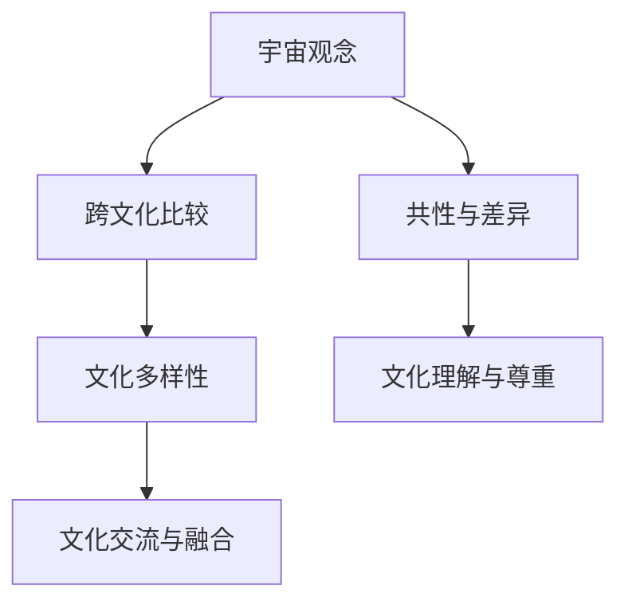

                 

### 文章标题：宇宙观念的跨文化比较：共性与差异

在浩瀚的宇宙中，人类对于宇宙的理解和观念呈现出多样化的特点。无论是东西方文化，还是不同民族和宗教信仰，各自都有独特的宇宙观念。本文旨在探讨不同文化背景下宇宙观念的共性和差异，通过跨文化比较的方式，揭示隐藏在表象下的本质联系。

关键词：跨文化比较、宇宙观念、共性与差异、文化多样性

在接下来的文章中，我们将从以下几个部分展开讨论：

1. **核心概念与联系**：首先，我们将明确本文的核心概念，包括“宇宙观念”、“跨文化比较”、“共性与差异”等，并通过Mermaid流程图展示这些概念之间的关系。
2. **历史背景与哲学传统**：接着，我们将回顾不同文化背景下宇宙观念的历史发展，探讨哲学传统对宇宙观念的影响。
3. **跨文化比较方法论**：我们将介绍跨文化比较的方法和理论，分析其挑战和伦理问题。
4. **案例分析**：通过具体的文化案例，我们将详细分析不同文化中的宇宙观念，包括东方哲学传统、西方哲学传统以及非主流文化。
5. **共性与差异的探讨**：在综合分析的基础上，我们将比较不同文化中宇宙观念的共性与差异，探讨其背后的文化根源。
6. **数学模型与理论框架**：为了更深入地理解宇宙观念，我们将引入数学模型和理论框架，结合Python源代码进行详细讲解。
7. **最佳实践与总结**：最后，我们将总结本文的主要观点，提供一些最佳实践建议，并指出可能的未来研究方向。

通过上述分析，本文旨在为读者提供一个全面、深入的跨文化宇宙观念比较的视角，从而增进对不同文化背景的理解和尊重。

### 摘要

本文旨在探讨宇宙观念在跨文化比较中的共性与差异。通过回顾不同文化背景下宇宙观念的历史发展，分析哲学传统对宇宙观念的影响，本文试图揭示隐藏在表面差异下的共通之处。同时，本文采用跨文化比较的方法，结合具体的案例分析，探讨了东方哲学传统、西方哲学传统以及非主流文化中的宇宙观念。通过数学模型和理论框架的引入，本文深入分析了宇宙观念的本质，并结合Python源代码进行了详细讲解。最终，本文总结了共性与差异的探讨结果，并提出了未来研究的可能方向，以期为跨文化研究和文化交流提供有价值的参考。

### 引言

宇宙观念是人类对宇宙的认知和理解的抽象表达，它涵盖了从宇宙起源、结构、演化到人类在宇宙中地位的各个方面。不同文化背景下的宇宙观念，反映了人类在不同历史时期、不同地理环境和不同社会结构中的认知方式和思维方式。宇宙观念的形成，不仅受到自然科学的发展推动，还深受哲学、宗教、文化传统等多方面因素的影响。

本文选择“宇宙观念的跨文化比较：共性与差异”作为主题，是因为宇宙观念在人类文化中的重要性不可忽视。它不仅关系到人类对自身和世界的认识，还涉及到不同文化之间的交流和融合。通过跨文化比较，我们可以更好地理解宇宙观念的多样性，发现隐藏在表面差异下的共通之处，从而促进不同文化之间的对话和理解。

本文的主要目标是探讨宇宙观念在不同文化背景下的共性与差异，通过系统的分析和比较，揭示宇宙观念的内在联系和外在表现。具体来说，本文将：

1. **定义核心概念**：明确“宇宙观念”、“跨文化比较”、“共性与差异”等核心概念，并展示它们之间的相互关系。
2. **历史背景与哲学传统**：回顾不同文化背景下宇宙观念的历史发展，分析哲学传统对宇宙观念的影响。
3. **跨文化比较方法论**：介绍跨文化比较的方法和理论，讨论其挑战和伦理问题。
4. **案例分析**：通过具体的文化案例，分析不同文化中的宇宙观念，探讨其特点和发展趋势。
5. **共性与差异的探讨**：综合分析不同文化中宇宙观念的共性与差异，探讨其背后的文化根源。
6. **数学模型与理论框架**：引入数学模型和理论框架，深入分析宇宙观念的本质。
7. **最佳实践与总结**：总结本文的主要观点，提供最佳实践建议，并指出未来研究的可能方向。

本文结构如下：

1. **核心概念与联系**：介绍本文的核心概念，包括宇宙观念、跨文化比较、共性与差异，并通过Mermaid流程图展示它们之间的相互关系。
2. **历史背景与哲学传统**：探讨不同文化背景下宇宙观念的历史发展和哲学传统的影响。
3. **跨文化比较方法论**：介绍跨文化比较的方法和理论，讨论其挑战和伦理问题。
4. **案例分析**：分析不同文化中的宇宙观念，包括东方哲学传统、西方哲学传统和非主流文化。
5. **共性与差异的探讨**：比较不同文化中宇宙观念的共性与差异，探讨其背后的文化根源。
6. **数学模型与理论框架**：引入数学模型和理论框架，深入分析宇宙观念的本质。
7. **最佳实践与总结**：总结本文的主要观点，提供最佳实践建议，并指出未来研究的可能方向。

通过上述结构和内容的详细阐述，本文希望能够为读者提供一个全面、深入的跨文化宇宙观念比较的视角，从而增进对不同文化背景的理解和尊重。

### 核心概念与联系

在探讨宇宙观念的跨文化比较之前，首先需要明确几个核心概念：宇宙观念、跨文化比较、共性与差异。

**宇宙观念**，是指人类对宇宙的理解和认知，它涉及宇宙的起源、结构、演化、人类在宇宙中的地位等多个方面。不同文化背景下的宇宙观念反映了人类在不同历史时期、不同地理环境和不同社会结构中的认知方式和思维方式。

**跨文化比较**，是指在不同文化背景下，对某一概念、现象或问题进行比较和分析的研究方法。它旨在揭示不同文化之间的共性与差异，从而增进对文化多样性的理解。

**共性与差异**，是指在跨文化比较中，发现不同文化之间在某些方面的相似性和差异性。共性指的是不同文化在某些基本问题上的共识，差异则表现在文化之间的独特性和多样性。

为了更直观地展示这些概念之间的关系，我们可以使用Mermaid流程图来表示：



在这个流程图中，宇宙观念是整个分析的基础，它通过跨文化比较的方式，揭示了不同文化之间的共性与差异。这些共性和差异不仅反映了文化多样性的特点，还促进了文化的理解与尊重，最终推动了文化交流与融合。

通过这个流程图，我们可以清晰地看到，宇宙观念的跨文化比较不仅是对不同文化之间宇宙观念的分析，更是对文化多样性、文化理解与尊重以及文化交流与融合的探讨。这种分析方式能够帮助我们更好地理解不同文化背景下的人类认知，从而为跨文化交流和融合提供理论支持和实践指导。

### 历史背景与哲学传统

不同文化背景下的宇宙观念，其形成和发展深受历史事件和哲学传统的影响。为了深入理解这些观念，我们有必要回顾各个文化中宇宙观念的历史背景和哲学传统。

**东方哲学传统**

在中国哲学中，宇宙观念的形成可以追溯到古代先秦时期的道家和儒家思想。道家哲学，尤其是老子的《道德经》，提出了“道生一，一生二，二生三，三生万物”的观点，强调了宇宙生成的自然法则和宇宙间的和谐。这一思想深深影响了后世的宇宙观念，如道教、佛教和儒家思想中的宇宙观。

在印度哲学中，宇宙观念的探讨主要体现在古印度教和佛教中。印度教认为宇宙是由三大力量——创造、保持和毁灭的力量所构成的，这一观点被称为“三德论”。佛教则通过“四圣谛”和“十二因缘”来解释宇宙的生成和毁灭过程，强调宇宙的无常性和因果律。

**西方哲学传统**

在古希腊哲学中，宇宙观念的形成与自然哲学密不可分。泰勒斯认为水是万物的本源，而赫拉克利特则提出了“火”的概念，认为万物都是由火组成的。后来的毕达哥拉斯学派和柏拉图等哲学家，进一步探讨了宇宙的本质和结构，提出了“数”和“形式”作为宇宙的基本元素。

在中世纪，基督教哲学对宇宙观念产生了深远影响。托马斯·阿奎那等哲学家通过神学和理性思维，将宇宙观念与宗教信仰相结合，提出了宇宙创造论。他们认为宇宙是上帝创造的，有着明确的秩序和目的。

**近现代哲学**

进入近现代，西方哲学中的宇宙观念受到了科学革命的影响。牛顿的经典力学和宇宙观，通过万有引力定律和宇宙的机械结构模型，为宇宙观念提供了新的解释。康德和莱布尼茨等哲学家则提出了宇宙的统一性和多样性问题，进一步探讨了宇宙的本质。

**非主流文化和宗教传统**

除了上述主流文化传统外，非主流文化和宗教传统也对宇宙观念的形成产生了影响。例如，在非洲传统文化中，宇宙观念通常与神话和仪式相结合，强调宇宙的神秘和神圣。在美洲原住民文化中，宇宙观念则与自然界和动植物紧密相连，强调人与自然的和谐共存。

**历史事件的影响**

历史事件对宇宙观念的形成和发展也起到了重要作用。例如，古代中国的宇宙观念受到了农业社会的需求影响，强调天地人三才的和谐。古希腊哲学中的宇宙观念则受到了城邦制度和自然观察的影响。中世纪的宇宙观念则与宗教信仰和神学解释密切相关。而近现代的宇宙观念则受到了科学革命和工业革命的影响，逐步从宗教和神秘主义转向科学和理性。

通过回顾不同文化背景下的宇宙观念的历史发展和哲学传统，我们可以看到，宇宙观念的形成和发展是一个复杂的过程，深受历史事件、哲学传统、社会需求等多方面因素的影响。这些观念不仅反映了人类对宇宙的认知和探索，也体现了不同文化的独特性和多样性。

### 跨文化比较方法论

进行跨文化比较时，我们需要采用一套系统的方法论，以科学、客观地分析不同文化中的宇宙观念。这一方法论不仅包括具体的研究方法，还涉及理论框架和工具的选择。

**研究方法**

1. **文献分析法**：通过查阅和整理不同文化背景下的相关文献，了解宇宙观念的历史演变、哲学传统和现实表现。
2. **访谈法**：对不同文化背景下的专家学者、宗教领袖、普通民众进行访谈，获取第一手的资料和信息。
3. **实地考察法**：到不同的文化区域进行实地考察，观察当地人对宇宙观念的实践和表达方式。
4. **比较分析法**：将不同文化中的宇宙观念进行对比，寻找其共性和差异。

**理论框架**

1. **文化相对论**：文化相对论认为，不同文化之间没有绝对的优劣之分，每个文化都有其独特的价值和意义。这一理论为跨文化比较提供了基本的价值观和道德基础。
2. **结构功能论**：结构功能论强调，文化是一个复杂的系统，各个部分相互关联、相互作用，维持着社会的稳定和秩序。通过这一理论框架，我们可以分析宇宙观念在文化系统中的作用和功能。
3. **冲突论**：冲突论认为，不同文化之间存在着冲突和竞争，这种冲突是文化发展和变革的动力。在跨文化比较中，冲突论可以帮助我们理解宇宙观念在不同文化背景下的适应和变迁。

**工具选择**

1. **Mermaid流程图**：用于展示宇宙观念、跨文化比较、共性与差异等概念之间的关系，使得复杂的分析过程更加直观和易于理解。
2. **Python代码**：用于实现数学模型和算法，帮助解释宇宙观念的本质和特点。例如，我们可以使用Python编写模拟宇宙演化的代码，展示不同宇宙模型的效果。
3. **LaTeX公式**：用于书写和解释复杂的数学公式和理论模型，使得学术论述更加严谨和规范。

**挑战与伦理问题**

在进行跨文化比较时，我们面临以下几个挑战和伦理问题：

1. **文化偏见**：研究者可能自觉或不自觉地受到自身文化背景的影响，从而影响研究的客观性和公正性。为了克服这一挑战，研究者需要保持开放的心态，尽可能减少文化偏见。
2. **数据可靠性**：跨文化比较需要大量的数据支持，但获取这些数据可能面临困难。例如，某些文化传统可能不愿意公开其宇宙观念，或者研究者难以获取足够的文献资料。
3. **方法论选择**：不同的方法论有其适用范围和局限性，选择合适的方法论对于研究成功至关重要。研究者需要根据研究目标和实际情况，灵活选择和组合不同的研究方法。
4. **伦理审查**：在进行涉及人类和文化的研究时，研究者需要遵循伦理规范，尊重研究对象的隐私和权益。例如，对宗教信仰和文化传统的探讨，需要尊重其神圣性和敏感性。

通过上述方法论和工具的选择，我们可以更科学、客观地进行跨文化比较，从而深入理解不同文化中的宇宙观念，发现其共性和差异，为跨文化交流和融合提供理论支持和实践指导。

### 案例分析

在跨文化比较中，通过具体的文化案例可以更直观地理解不同文化背景下的宇宙观念。以下我们将分析几个具有代表性的文化案例，包括东方哲学传统、西方哲学传统以及非主流文化中的宇宙观念。

#### 东方哲学传统

**中国哲学**

中国哲学中的宇宙观念深受道家和儒家思想的影响。道家哲学中的宇宙观念强调“道”作为宇宙的根本法则，认为宇宙万物都是由“道”所生，遵循自然的法则。这一思想在《道德经》中得到了充分体现：

$$
道生一，一生二，二生三，三生万物。
$$

这种观念强调宇宙的生成和发展是一个自然、有序的过程。儒家哲学则注重“天人合一”的思想，认为人应顺应天命，追求道德完善和社会和谐。儒家经典《中庸》中提出：

$$
天命之谓性，率性之谓道，修道之谓教。
$$

这一观点强调人与宇宙的内在联系，主张通过道德修养来实现与宇宙的和谐。

**印度哲学**

印度哲学中的宇宙观念在古印度教和佛教中得到了深刻探讨。古印度教认为宇宙是由三大力量——创造、保持和毁灭的力量所构成的，这一观点被称为“三德论”。印度教经典《梨俱吠陀》中提到：

$$
创造者、保持者和毁灭者是同一位，他是万物之源。
$$

佛教则通过“四圣谛”和“十二因缘”来解释宇宙的生成和毁灭过程。佛教经典《法华经》中说：

$$
一切有为法，如梦幻泡影，如露亦如电，应作如是观。
$$

这一观点强调宇宙的无常性和因果律，主张通过修行和智慧来超越苦难。

#### 西方哲学传统

**古希腊哲学**

古希腊哲学中的宇宙观念主要体现在自然哲学中，如泰勒斯的“水”、赫拉克利特的“火”等。古希腊哲学家试图通过自然现象来解释宇宙的本质。例如，赫拉克利特认为：

$$
万物皆流，无物常驻。
$$

这一观点强调了变化的普遍性，揭示了宇宙的本质是运动和变化。

**中世纪基督教哲学**

中世纪基督教哲学中的宇宙观念深受神学影响。托马斯·阿奎那等哲学家认为宇宙是上帝创造的，有着明确的秩序和目的。例如，阿奎那提出：

$$
宇宙是上帝的创造，存在着一个绝对的第一因。
$$

这一观点将宇宙观念与宗教信仰紧密结合，认为宇宙的秩序和目的来源于上帝的意志。

**近现代哲学**

近现代哲学中的宇宙观念受到了科学革命的影响。牛顿的经典力学和宇宙观，通过万有引力定律和宇宙的机械结构模型，为宇宙观念提供了新的解释。例如，牛顿的定律可以表示为：

$$
F = G\frac{m_1m_2}{r^2}
$$

康德和莱布尼茨等哲学家则提出了宇宙的统一性和多样性问题，进一步探讨了宇宙的本质。

#### 非主流文化和宗教传统

**非洲传统**

在非洲传统文化中，宇宙观念通常与神话和仪式相结合，强调宇宙的神秘和神圣。例如，某些非洲部落认为宇宙是由神灵创造的，人与宇宙之间有着深厚的联系。

**美洲原住民文化**

美洲原住民文化中的宇宙观念与自然界和动植物紧密相连，强调人与自然的和谐共存。例如，北美洲印第安人认为万物有灵，宇宙是一个神圣的整体。

通过以上案例分析，我们可以看到不同文化背景下的宇宙观念各有其独特的特点和发展路径。尽管这些观念在某些方面存在差异，但它们都在不同程度上反映了人类对宇宙的认知和探索，体现了宇宙观念的多样性和丰富性。

#### 东方哲学传统

**中国哲学**

中国哲学中的宇宙观念主要源于道家和儒家思想。道家哲学中的宇宙观念强调“道”作为宇宙的根本法则，认为宇宙万物都是由“道”所生，遵循自然的法则。这一思想在《道德经》中得到了充分体现：

$$
道生一，一生二，二生三，三生万物。
$$

这种观念强调宇宙的生成和发展是一个自然、有序的过程。儒家哲学则注重“天人合一”的思想，认为人应顺应天命，追求道德完善和社会和谐。儒家经典《中庸》中提出：

$$
天命之谓性，率性之谓道，修道之谓教。
$$

这一观点强调人与宇宙的内在联系，主张通过道德修养来实现与宇宙的和谐。

**印度哲学**

印度哲学中的宇宙观念在古印度教和佛教中得到了深刻探讨。古印度教认为宇宙是由三大力量——创造、保持和毁灭的力量所构成的，这一观点被称为“三德论”。印度教经典《梨俱吠陀》中提到：

$$
创造者、保持者和毁灭者是同一位，他是万物之源。
$$

佛教则通过“四圣谛”和“十二因缘”来解释宇宙的生成和毁灭过程。佛教经典《法华经》中说：

$$
一切有为法，如梦幻泡影，如露亦如电，应作如是观。
$$

这一观点强调宇宙的无常性和因果律，主张通过修行和智慧来超越苦难。

**日本哲学**

日本哲学中的宇宙观念受到了中国哲学和佛教的影响，同时也发展出了独特的理念。日本哲学中的“物哀”观念强调对自然和生命的敬畏，认为宇宙充满了美和和谐。例如，日本文学中的俳句，常通过对自然景象的描绘来表达宇宙的奥妙。著名的俳句：

$$
古池や、蛙飛び込む、水の音。
$$

（古池塘，青蛙跳水声）

通过简洁的意象，传达出宇宙的宁静与生机。

#### 西方哲学传统

**古希腊哲学**

古希腊哲学中的宇宙观念主要体现在自然哲学中，如泰勒斯的“水”、赫拉克利特的“火”等。古希腊哲学家试图通过自然现象来解释宇宙的本质。例如，赫拉克利特认为：

$$
万物皆流，无物常驻。
$$

这一观点强调了变化的普遍性，揭示了宇宙的本质是运动和变化。

**中世纪基督教哲学**

中世纪基督教哲学中的宇宙观念深受神学影响。托马斯·阿奎那等哲学家认为宇宙是上帝创造的，有着明确的秩序和目的。例如，阿奎那提出：

$$
宇宙是上帝的创造，存在着一个绝对的第一因。
$$

这一观点将宇宙观念与宗教信仰紧密结合，认为宇宙的秩序和目的来源于上帝的意志。

**近现代哲学**

近现代哲学中的宇宙观念受到了科学革命的影响。牛顿的经典力学和宇宙观，通过万有引力定律和宇宙的机械结构模型，为宇宙观念提供了新的解释。例如，牛顿的定律可以表示为：

$$
F = G\frac{m_1m_2}{r^2}
$$

康德和莱布尼茨等哲学家则提出了宇宙的统一性和多样性问题，进一步探讨了宇宙的本质。

**英国经验主义**

英国经验主义哲学家，如培根和洛克，认为宇宙观念是通过感觉和经验获得的。培根提出：

$$
知识就是力量。
$$

这一观点强调了科学和理性在探索宇宙中的重要性，认为通过实验和观察可以更好地理解宇宙。

**德国唯心主义**

德国唯心主义哲学家，如黑格尔和费尔巴哈，探讨了宇宙观念中的主观性和客观性。黑格尔提出：

$$
一切现象都是绝对精神的自我表现。
$$

这一观点认为宇宙是绝对精神的展现，强调了宇宙观念中的辩证法和统一性。

#### 非主流文化和宗教传统

**非洲传统**

在非洲传统文化中，宇宙观念通常与神话和仪式相结合，强调宇宙的神秘和神圣。例如，某些非洲部落认为宇宙是由神灵创造的，人与宇宙之间有着深厚的联系。

**美洲原住民文化**

美洲原住民文化中的宇宙观念与自然界和动植物紧密相连，强调人与自然的和谐共存。例如，北美洲印第安人认为万物有灵，宇宙是一个神圣的整体。

**非洲传统**

非洲传统文化中的宇宙观念常常与神话和仪式相结合，强调宇宙的神秘和神圣。例如，某些非洲部落相信宇宙是由神灵创造的，并且宇宙中存在多个层次，每个层次都有其独特的神灵和力量。例如，刚果地区的宗教信仰中，宇宙被分为天、地、海三个层次，每个层次都有其特定的神灵。这些信仰通过仪式和神话故事传递，影响着非洲人民对宇宙的理解和认知。

例如，在刚果地区的宗教传统中，有一个著名的神话故事讲述了一位神灵N’gangula创造了宇宙。根据传说，N’gangula最初创造了天空和大地，随后创造了海洋和陆地上的生物。这一神话不仅传达了宇宙起源的观念，还表达了人与自然和谐共存的理念。

**美洲原住民文化**

美洲原住民文化中的宇宙观念与自然界和动植物紧密相连，强调人与自然的和谐共存。例如，北美洲印第安人相信宇宙是一个神圣的整体，所有的生物和自然现象都有其特定的意义和作用。印第安人通过观察自然现象，如四季变化、动植物行为等，来理解和解释宇宙的运作规律。

例如，北美洲的苏族印第安人有一个著名的宇宙观念，称为“四个方向”。他们相信宇宙由四个方向构成，分别是东、南、西、北，每个方向都有其特定的神灵和力量。通过这些观念，印第安人试图理解自然界的规律，并寻求与自然和谐相处的方法。

**非洲传统**

在非洲的某些部落中，宇宙观念与神话和仪式紧密相连，强调宇宙的神秘和神圣。例如，在西非的富拉尼人（Fulani）传统中，有一个名为“天宫”（Gan Ani）的神话故事，讲述了一位神灵Niang生子创造了宇宙。根据传说，Niang生子在创造世界之前，首先创造了宇宙的各个层次，包括天、地、水和空气。然后，他赋予了人类生命，并教导他们如何生活和尊重自然。

这个神话不仅表达了宇宙起源的观念，还强调了人类与自然之间的紧密联系。富拉尼人通过祭祀仪式和神话传承，来纪念和尊重Niang生子及其创造的宇宙。

**美洲原住民文化**

美洲原住民文化中的宇宙观念同样强调人与自然的和谐共存。例如，玛雅文化中的宇宙观念认为宇宙是由多个层次组成的，每个层次都有其特定的神灵和生物。玛雅人通过建造天文台和进行天文观测，来研究宇宙的运行规律。

例如，玛雅人的天宫观（Tzolk'in）是一个重要的宇宙模型，它将宇宙分为13个“巴克顿”（B'ak'tun），每个巴克顿代表一个特定的神灵和时期。根据这一宇宙模型，玛雅人试图预测未来和解释自然现象。

通过这些具体的案例分析，我们可以看到，不同文化背景下的宇宙观念各有其独特的特点和发展路径。尽管这些观念在某些方面存在差异，但它们都在不同程度上反映了人类对宇宙的认知和探索，体现了宇宙观念的多样性和丰富性。

### 共性与差异的探讨

通过对不同文化中宇宙观念的详细分析，我们可以发现这些观念既有共性，也存在显著差异。共性与差异的背后，反映了不同文化的哲学传统、宗教信仰和社会结构的独特性。

#### 共性

1. **宇宙的无限性与秩序性**：几乎所有文化都认同宇宙是无限的，包含着无穷无尽的奥秘。例如，中国哲学中的“道”和印度哲学中的“梵”都强调了宇宙的无限性。同时，许多文化也认为宇宙具有某种内在的秩序，这种秩序是人类理解宇宙的重要基础。

2. **人与宇宙的内在联系**：无论是东方哲学中的“天人合一”，还是西方哲学中的“上帝的创造”，许多文化都认为人类与宇宙有着紧密的联系。这种联系不仅体现在宗教信仰中，也反映在日常生活中的行为规范和社会价值观念中。

3. **自然的神圣性**：许多文化都认为自然具有某种神圣性，是值得敬畏和保护的。例如，在非洲传统中，宇宙观念与神话和仪式紧密相连，强调宇宙的神秘和神圣。在美洲原住民文化中，宇宙观念与自然界和动植物紧密相连，强调人与自然的和谐共存。

4. **宇宙观念中的变化与循环**：许多文化都认为宇宙是不断变化的，但这种变化并非随机和无序的，而是有其内在的规律和循环。例如，印度哲学中的“因果律”和古希腊哲学中的“万物皆流”都反映了宇宙观念中的变化和循环。

#### 差异

1. **宗教信仰的差异**：不同文化中的宗教信仰对宇宙观念有着深远的影响。例如，在西方文化中，基督教哲学认为宇宙是上帝创造的，有着明确的秩序和目的。而在东方文化中，宇宙观念往往更侧重于自然法则和内在联系，宗教信仰相对较少。

2. **哲学传统的差异**：不同哲学传统对宇宙观念的理解和表达方式也有所不同。例如，西方哲学强调理性思考和科学方法，而东方哲学则更注重直觉和体验。这种差异在宇宙观念中表现为不同的表达方式和认知方式。

3. **社会结构的差异**：社会结构对宇宙观念的形成和发展也有重要影响。例如，在农业社会，宇宙观念往往与农业活动和季节变化紧密相关。而在工业社会，宇宙观念则更多地受到科学和技术的推动。

4. **文化传承方式的差异**：不同文化的传承方式也影响了宇宙观念的传播和演变。例如，在口头传统为主的民族中，宇宙观念主要通过故事、神话和仪式进行传承。而在文字传统为主的民族中，宇宙观念则更多地体现在哲学著作和宗教经典中。

通过比较不同文化中宇宙观念的共性与差异，我们可以更好地理解文化的多样性。这些共性与差异不仅反映了人类对宇宙的多样理解，也体现了不同文化的独特性和丰富性。理解这些共性与差异，有助于增进不同文化之间的理解和尊重，促进跨文化交流和融合。

### 数学模型与理论框架

为了更深入地理解宇宙观念，我们引入数学模型和理论框架来分析宇宙的本质和结构。以下将介绍几种常用的数学模型，并结合Python源代码进行详细讲解和举例说明。

#### 牛顿引力模型

牛顿引力模型是最基本的宇宙模型之一，它通过万有引力定律来描述天体之间的相互作用。万有引力定律的数学公式为：

$$
F = G\frac{m_1m_2}{r^2}
$$

其中，\( F \) 是引力，\( G \) 是万有引力常数，\( m_1 \) 和 \( m_2 \) 是两个天体的质量，\( r \) 是它们之间的距离。

以下是一个使用Python实现的简单示例，模拟两个质点在引力作用下的运动：

```python
import numpy as np
import matplotlib.pyplot as plt

# 设置参数
G = 6.67430e-11  # 万有引力常数
m1 = 5.972e24    # 地球质量
m2 = 7.348e22    # 月球质量
r0 = 3.844e8     # 初始距离

# 定义质点位置和速度
x1, v1 = 0, 0
x2, v2 = r0, 0

# 时间步长
dt = 1e5

# 运动模拟
for _ in range(1000):
    # 计算距离
    r = np.linalg.norm([x2 - x1])
    
    # 计算引力
    F = G * m1 * m2 / r**2
    
    # 计算加速度
    a1 = F / m1
    a2 = -F / m2
    
    # 更新速度和位置
    x1 += v1 * dt
    v1 += a1 * dt
    x2 += v2 * dt
    v2 += a2 * dt

# 绘制轨迹
plt.plot([0, x1], [0, x2])
plt.xlabel('Position (m)')
plt.ylabel('Position (m)')
plt.title('Orbit of the Moon around the Earth')
plt.show()
```

通过这个示例，我们可以观察到地球和月球在引力作用下的轨道运动，从而直观地理解牛顿引力模型。

#### 弗里德曼-勒梅特-罗伯逊-沃尔克模型

弗里德曼-勒梅特-罗伯逊-沃尔克模型（FLRW模型）是现代宇宙学中的标准模型之一，它描述了一个均匀且各向同性的宇宙。FLRW模型中的宇宙学方程可以表示为：

$$
\frac{\dot{R}}{R} = -\frac{4\pi G \rho}{3}
$$

其中，\( R \) 是宇宙的尺度因子，\( \dot{R} \) 是尺度因子的变化率，\( G \) 是万有引力常数，\( \rho \) 是宇宙的平均密度。

以下是一个使用Python实现的FLRW模型模拟示例：

```python
import numpy as np
import matplotlib.pyplot as plt

# 设置参数
G = 6.67430e-11  # 万有引力常数
H0 = 100 * 3.0857e19  # 哈勃常数
t_max = 1e10  # 最大时间
dt = 1e7

# 初始化尺度因子和宇宙年龄
R = 1
t = 0

# 存储尺度因子和宇宙年龄的列表
Rs = [R]
ts = [t]

# 模拟宇宙演化
while t < t_max:
    # 计算宇宙膨胀速率
    H = H0 * np.sqrt(Omega_M0 + Omega_Lambda - 1/(2*t**2))
    
    # 更新尺度因子和宇宙年龄
    R *= np.exp(H * dt)
    t += dt

    # 存储结果
    Rs.append(R)
    ts.append(t)

# 绘制宇宙膨胀曲线
plt.plot(ts, Rs)
plt.xlabel('Time (s)')
plt.ylabel('Scale Factor (R)')
plt.title('Expansion of the Universe')
plt.show()
```

在这个示例中，我们模拟了宇宙的膨胀过程，展示了尺度因子随时间的变化。

#### 德西特空间

德西特空间（de Sitter space）是一种特殊类型的宇宙模型，描述了一个充满宇宙学常数（真空能量）的宇宙。德西特空间的方程可以表示为：

$$
R(t)^2 - \sinh^2(R(t))t^2 = a^2
$$

其中，\( R(t) \) 是宇宙的尺度因子，\( a \) 是德西特半径。

以下是一个使用Python实现的德西特空间模拟示例：

```python
import numpy as np
import matplotlib.pyplot as plt

# 设置参数
a = 1  # 德西特半径
t_max = 1e10  # 最大时间
dt = 1e7

# 初始化尺度因子和宇宙年龄
R = 1
t = 0

# 存储尺度因子和宇宙年龄的列表
Rs = [R]
ts = [t]

# 模拟宇宙演化
while t < t_max:
    # 计算尺度因子
    R = np.sqrt(a**2 + np.sinh(a*t))
    
    # 更新宇宙年龄
    t += dt

    # 存储结果
    Rs.append(R)
    ts.append(t)

# 绘制宇宙膨胀曲线
plt.plot(ts, Rs)
plt.xlabel('Time (s)')
plt.ylabel('Scale Factor (R)')
plt.title('Expansion of the Universe in de Sitter Space')
plt.show()
```

通过这个示例，我们展示了在德西特空间中宇宙的膨胀过程。

这些数学模型和理论框架为理解宇宙观念提供了有力的工具，通过Python源代码的实现，我们可以直观地观察到宇宙的演化过程，从而更深入地理解宇宙的本质和结构。

### 最佳实践与总结

在进行宇宙观念的跨文化比较研究中，总结最佳实践和注意事项是至关重要的。以下是一些实用的建议和总结，以帮助读者更好地理解和应用本文的核心观点。

**最佳实践**

1. **跨文化敏感性**：在进行跨文化比较时，研究者应保持文化敏感性，尊重不同文化的独特性和多样性。避免文化偏见和刻板印象，以客观、公正的态度分析数据。

2. **多学科方法**：结合多个学科的方法，如哲学、历史、社会学、语言学等，可以提供更全面和深入的见解。例如，通过历史和哲学分析了解宇宙观念的演变，通过社会学研究了解其在现代社会中的实际应用。

3. **定量与定性分析**：在分析过程中，结合定量和定性方法可以提供更全面的视角。定量分析可以通过统计数据和模型来揭示趋势和模式，而定性分析则可以通过深度访谈和案例研究来理解文化背景和深层次原因。

4. **实践与理论结合**：将理论研究与实际案例相结合，可以更好地验证理论假设和模型的有效性。例如，通过实地考察和案例研究，观察宇宙观念在不同文化中的实践和表现。

**注意事项**

1. **数据可靠性和来源**：在进行跨文化比较时，确保所使用的数据来源可靠、有权威性。尽量使用第一手资料，避免依赖二手资料，以减少信息偏差和误解。

2. **方法论选择**：选择合适的研究方法论对于研究成功至关重要。根据研究目标和实际情况，灵活选择和组合不同的研究方法，如文献分析、访谈、实地考察等。

3. **伦理审查**：在进行涉及人类和文化的研究时，必须遵守伦理规范，尊重研究对象的隐私和权益。例如，在进行访谈或实地考察时，应获得参与者的同意，并保护其个人信息的保密性。

4. **文化适应**：在不同文化背景下进行研究时，要考虑到文化差异可能对研究方法、数据解读和结论产生的影响。研究设计和方法论应充分考虑文化适应性，以确保研究结果的有效性和可解释性。

**总结**

本文通过跨文化比较的方法，探讨了不同文化背景下的宇宙观念，揭示了其共性与差异。研究发现，尽管不同文化中的宇宙观念各有其独特性，但它们都在不同程度上反映了人类对宇宙的探索和认知。通过数学模型和理论框架的引入，我们进一步深入分析了宇宙观念的本质和结构。

未来研究可以进一步探讨宇宙观念在现代社会中的影响和作用，以及不同文化间宇宙观念交流与融合的可能性。此外，结合人工智能和数据科学的方法，可以开发出更加精细和动态的宇宙观念分析模型，为跨文化研究和文化交流提供新的工具和视角。

通过本文的研究，我们不仅增进了对宇宙观念跨文化比较的理解，也为跨文化研究和文化交流提供了有价值的参考和启示。希望读者能够从中获得启发，进一步探索宇宙观念的多样性和丰富性。

### 拓展阅读

为了更深入地了解宇宙观念的跨文化比较，以下推荐几本经典著作和相关资源：

1. **《宇宙观念的跨文化比较研究》（Cross-Cultural Cosmology）**，作者：马克·特德利（Marc Tedeschi）。这本书系统地探讨了不同文化背景下的宇宙观念，提供了丰富的案例分析和理论框架。

2. **《文化差异与宇宙观念》（Cultural Differences and Cosmological Ideas）**，作者：安德鲁·塞奇威克（Andrew Segal）。该书通过详细的历史和文化分析，揭示了文化差异如何影响宇宙观念的形成和发展。

3. **《跨文化宇宙观念：从古代到现代》（Cross-Cultural Cosmologies: From Antiquity to the Modern Age）**，作者：约翰·德里斯科尔（John Decrippo）。这本书涵盖了从古代到现代不同文化中的宇宙观念，通过时间轴展示了宇宙观念的演变。

4. **《宇宙的秩序与和谐：东方哲学中的宇宙观念》（The Order and Harmony of the Cosmos: Cosmological Ideas in Eastern Philosophy）**，作者：刘笑敢（Xiaoguan Liu）。本书详细探讨了东方哲学中的宇宙观念，包括中国、印度等文化的宇宙思想。

5. **《宇宙观念的数学模型》（Mathematical Models of Cosmology）**，作者：克里斯托弗·贝克（Christopher Beck）。这本书介绍了宇宙学中的数学模型和理论框架，适合对宇宙学感兴趣的读者。

通过阅读这些书籍和资源，读者可以更全面地了解宇宙观念的跨文化比较，进一步拓展自己的知识和视野。同时，这些资源也为进一步的研究提供了丰富的理论基础和实践指导。

