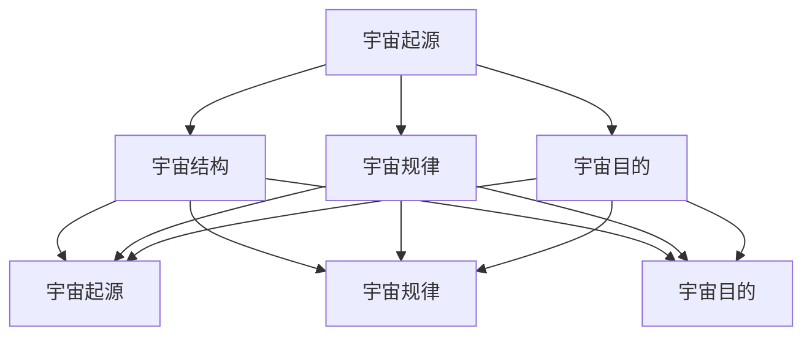
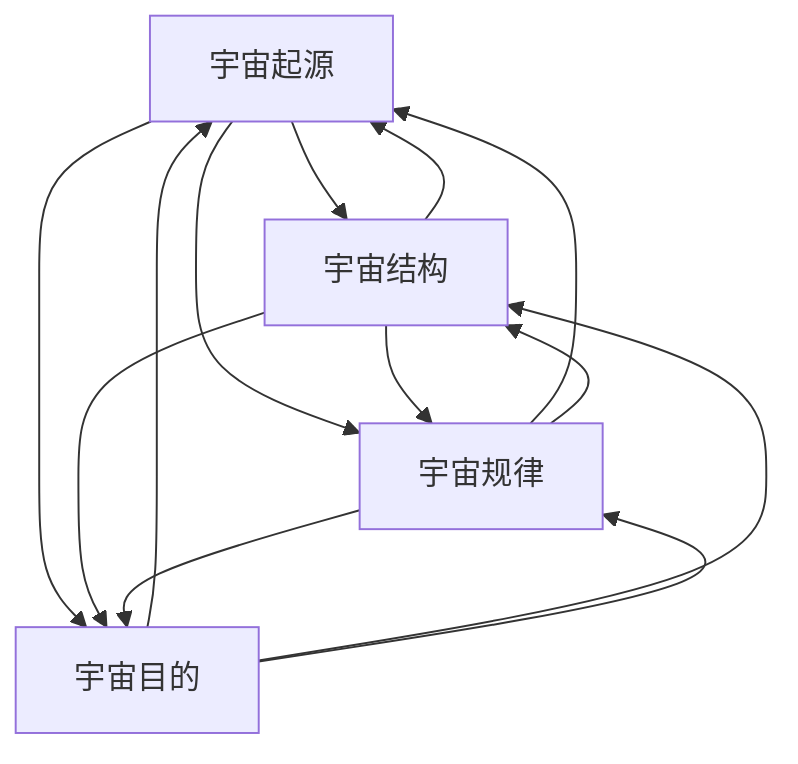

                 

### 宇宙观念的跨文化比较研究

#### 关键词

- 宇宙观念
- 跨文化研究
- 历史演变
- 比较分析
- 宗教文化
- 科学思想
- 哲学思想

#### 摘要

《宇宙观念的跨文化比较研究》旨在探讨不同文化背景下的宇宙观念，通过历史演变、核心概念分析以及比较研究，揭示宇宙观念在全球范围内的多样性和共性。本书首先概述宇宙观念的历史发展，接着深入分析西方、东方、非洲和美洲原住民文化中的宇宙观念。通过比较这些观念的核心概念和联系，本书探讨了跨文化比较分析的方法论。此外，本书还通过具体案例展示了宇宙观念在不同文化中的传播与交流，并展望了宇宙观念跨文化研究的未来趋势。本书对于理解不同文化对宇宙的认识，促进跨文化交流与理解具有重要意义。

---

### 引言

宇宙观念是人类对宇宙认知和理解的集合，它随着历史的发展而不断演变。不同的文化背景和社会环境塑造了独特的宇宙观念，这些观念反映了人们对自然、神灵、时间和空间的独特理解。从古代的神话传说到现代的科学理论，宇宙观念不仅影响了人类的宗教信仰、哲学思考和社会结构，也深刻地影响了科学技术的发展。

跨文化比较研究提供了一个审视宇宙观念多样性和共性的平台。通过比较不同文化背景下的宇宙观念，我们可以发现宇宙观念在不同文化中的演变轨迹，理解其背后的文化逻辑，从而丰富我们对宇宙的整体认识。此外，跨文化比较研究有助于揭示文化差异和共性，促进不同文化之间的交流与理解，为解决全球性问题和推动人类社会的发展提供新的视角。

本文将从以下几个方面展开探讨：

1. 宇宙观念的历史演变
2. 不同文化背景下的宇宙观念
3. 宇宙观念的核心概念与联系
4. 跨文化比较分析的方法论
5. 宇宙观念的比较分析案例
6. 宇宙观念跨文化传播与交流
7. 宇宙观念跨文化研究的意义与未来展望

通过这些分析，我们期望能够更全面、更深入地理解宇宙观念的跨文化比较，为跨文化交流和全球理解提供有力的理论支持。

### 第一部分：宇宙观念概述

#### 第1章：宇宙观念的历史演变

宇宙观念的历史演变是一个复杂而丰富的过程，它反映了人类对宇宙的认知从简单到复杂、从神秘到科学的演变轨迹。在这部分，我们将探讨宇宙观念的起源、早期发展以及历史演变的主要阶段。

#### 1.1 早期宇宙观念的起源与演化

宇宙观念的起源可以追溯到古代文明，当时的人们对自然现象缺乏科学的解释，因此依靠神话和宗教来理解宇宙。在古代苏美尔文明中，人们相信宇宙是由神创造的，宇宙中的每个元素都有其特定的神灵负责。例如，苏美尔神话中的埃阿（Enki）被认为是智慧之神，他负责管理水和地下水，代表了宇宙中的水元素。

在古代中国，宇宙观念的形成受到了道家和儒家思想的影响。道家哲学中的“道”被视为宇宙的本源，它既是一切存在的根源，也是宇宙万物变化的规律。儒家则强调“天人合一”的理念，认为人与宇宙是相互联系、相互作用的。这种观念在《易经》中得到了充分的体现。

古埃及的宇宙观念则受到了宗教和神话的影响。古埃及人相信宇宙是由太阳神拉（Ra）统治的，太阳每天从东方升起，穿越天空，最后在西方沉没，这个过程象征了宇宙的循环。古埃及的宇宙观还涉及到“奥西里斯神话”，讲述了奥西里斯被杀害、复活以及统治宇宙的故事。

#### 1.2 古代文明与宇宙观念

古代希腊是西方哲学和科学思想的发源地，其宇宙观念对后来的西方文化产生了深远的影响。古希腊哲学家们提出了多种宇宙模型，从泰勒斯（Thales）的水元素宇宙说到亚里士多德的地球中心说，再到后来的日心说。古希腊的宇宙观念不仅关注宇宙的结构和组成，还探讨了宇宙的本质和运动的规律。

在印度，宇宙观念的形成受到了佛教、印度教和耆那教等多种宗教的影响。印度教中的宇宙观念认为宇宙是一个永恒的存在，它经历着循环的创造和毁灭。佛教中的宇宙观念则强调了因果报应和轮回转世，认为人类的命运是由其前世的行为决定的。

#### 1.3 中世纪至近代的宇宙观念变革

中世纪时期，宇宙观念主要受到了基督教神学的影响。基督教宇宙观认为宇宙是由上帝创造的，上帝是宇宙的中心，一切存在都是为了上帝的荣耀。这种观念在托马斯·阿奎那等神学家的工作中得到了充分的发展。

然而，随着科学的进步，宇宙观念开始发生重大变革。16世纪，哥白尼提出了日心说，颠覆了长期以来占主导地位的地球中心说。哥白尼的《天体运行论》不仅改变了人们对宇宙结构的认识，也为后来的科学革命奠定了基础。

17世纪，牛顿的万有引力定律和经典力学体系的建立，使人们能够更精确地描述宇宙中的物体运动。牛顿的宇宙观念认为，宇宙是一个由物理规律支配的有序系统，这些规律是普适的，不受时间和空间的限制。

#### 总结

宇宙观念的历史演变展示了人类对宇宙认知的不断深化。从古代的神话和宗教观念，到中世纪的宗教宇宙观，再到近代的科学宇宙观，每一个阶段都反映了人类对宇宙理解的进步。这种进步不仅体现在对宇宙结构的认识上，也体现在对宇宙本质和运动规律的探讨上。通过对宇宙观念历史演变的回顾，我们可以更好地理解不同文化背景下的宇宙观念，为进一步的比较研究提供基础。

### 第2章：不同文化背景下的宇宙观念

宇宙观念在不同文化背景下的形成和发展受到多种因素的影响，包括宗教信仰、哲学思想、历史传统和地理环境等。在这一章中，我们将探讨西方、东方、非洲和美洲原住民文化中的宇宙观念，分析这些观念的特点和内在逻辑。

#### 2.1 西方文化中的宇宙观念

西方文化中的宇宙观念经历了从古希腊哲学到中世纪神学到近代科学的多重变革。古希腊哲学家如泰勒斯、赫拉克利特和亚里士多德，对宇宙的本质和构成提出了多种理论。泰勒斯认为宇宙的基础是水，而赫拉克利特则提出了“火”的概念。亚里士多德则提出了“四元素”理论，认为宇宙由水、土、火和空气四种元素构成。

中世纪的基督教宇宙观认为宇宙是上帝创造的，上帝是宇宙的中心。托马斯·阿奎那等神学家进一步发展了这种观念，将其与哲学和神学相结合。他们强调宇宙的有序性和上帝的智慧与公正。

近代以来，西方的宇宙观念受到科学革命的影响，从哥白尼的日心说到牛顿的经典力学，再到爱因斯坦的相对论和量子力学，西方人对宇宙的理解不断深化。现代西方宇宙观强调宇宙的物理规律和宇宙演化的过程，认为宇宙是可观测的、可测量的，并且遵循特定的科学原理。

#### 2.2 东方文化中的宇宙观念

东方文化中的宇宙观念与西方有很大的不同，特别是在中国和印度。中国哲学中的宇宙观念受到了道家和儒家思想的影响。道家哲学中的“道”是宇宙的本源和根本原理，强调宇宙的动态平衡和自然法则。《道德经》中提到的“道生一，一生二，二生三，三生万物”，描述了宇宙从无到有的生成过程。

儒家哲学则强调“天人合一”的理念，认为人应顺应自然，与宇宙和谐相处。《易经》中提到的“易”字，既指宇宙的变化规律，也指人类社会的发展规律。中国的宇宙观念强调天人之间的关系和宇宙的整体性。

在印度，宇宙观念主要受到印度教和佛教的影响。印度教中的宇宙观念认为宇宙是一个永恒的存在，经历着创造、维持和毁灭的循环。佛教中的宇宙观念则强调了因果报应和轮回转世，认为宇宙是一个由无数世界组成的复杂体系。

#### 2.3 非洲和美洲原住民文化中的宇宙观念

非洲和美洲原住民文化中的宇宙观念丰富多彩，反映了他们对自然和神灵的独特理解。非洲大陆上的不同部落和民族有着各自独特的宇宙观念，其中许多观念与自然界和神灵密切相关。

非洲原住民的宇宙观念通常包括对自然力量的崇拜和对神灵的信仰。许多非洲部落相信，宇宙由一系列的神灵和精灵组成，这些神灵和精灵掌管着自然界中的各种现象，如天气、农作物、动物等。例如，赞比亚和刚果地区的土著部落相信，森林中的精灵和神灵是保护自然和人类的守护者。

美洲原住民文化中的宇宙观念同样复杂多样。北美原住民，如印第安人，相信宇宙由多个层次组成，包括天空、地面和地下世界。他们还相信，人类和其他生物与自然界中的神灵和精灵有着密切的联系。例如，北美的许多部落崇拜太阳、月亮、星星和动物神灵，认为这些神灵是生命力的源泉。

南美的原住民文化，如印加文明，则有着独特的宇宙观念。印加人相信宇宙是由太阳神创造的，太阳是宇宙的中心，太阳神是生命和力量的象征。他们还相信，通过宗教仪式和仪式舞蹈，可以与太阳神沟通，获得太阳的力量和祝福。

#### 总结

不同文化背景下的宇宙观念反映了各自的历史、宗教、哲学和自然环境。西方文化中的宇宙观念经历了从哲学到科学的演变，强调宇宙的物理规律和科学解释。东方文化中的宇宙观念则强调天人合一和自然法则。非洲和美洲原住民文化中的宇宙观念与自然和神灵密切相关，体现了他们对自然的崇拜和对神灵的信仰。通过对这些宇宙观念的分析，我们可以更好地理解不同文化对宇宙的不同理解和认知方式。

### 第3章：宇宙观念的核心概念与联系

在探讨不同文化背景下的宇宙观念时，理解其核心概念和内在联系至关重要。这一章将分析宇宙观念中的关键概念，揭示它们之间的相互关系，并通过Mermaid流程图展示这些关系，使读者能够更直观地理解宇宙观念的架构。

#### 核心概念

宇宙观念包含多个核心概念，如宇宙起源、宇宙结构、宇宙规律、宇宙目的等。这些概念在不同文化中有不同的表达和解释，但它们共同构成了宇宙观念的核心。

1. **宇宙起源**：宇宙观念中对宇宙起源的描述多种多样，从神话中的神创说到科学的宇宙大爆炸理论，体现了人类对宇宙起源的探索和认知。

2. **宇宙结构**：宇宙结构指的是宇宙的基本组成和布局。不同的文化对宇宙结构有不同的理解，如西方的地球中心说和日心说，东方的阴阳五行等。

3. **宇宙规律**：宇宙规律描述了宇宙中物体和现象的运动和变化规律。例如，牛顿的万有引力定律和爱因斯坦的相对论都是对宇宙规律的描述。

4. **宇宙目的**：宇宙目的涉及到人类对宇宙存在意义的理解和探讨。不同的文化对宇宙目的有不同的解释，如宗教中的神意和哲学中的宇宙和谐等。

#### 关系架构

为了更好地理解宇宙观念中的核心概念和它们之间的相互关系，我们可以使用Mermaid流程图来展示这些概念及其相互作用。

以下是宇宙观念核心概念与联系关系的Mermaid流程图：

在这个流程图中，宇宙起源、宇宙结构、宇宙规律和宇宙目的是核心概念，它们相互关联，共同构成了宇宙观念的框架。

#### 详细说明

1. **宇宙起源**：宇宙起源是宇宙观念的起点，不同的文化对其有不同的解释。例如，在西方文化中，宇宙起源通常与科学的大爆炸理论相关联；在东方文化中，宇宙起源可能与道家哲学中的“道”或儒家哲学中的“太极”概念相关联。

2. **宇宙结构**：宇宙结构描述了宇宙的基本组成和布局。西方文化中的宇宙结构经历了从地心说到日心说的演变，而东方文化中的宇宙结构则与阴阳五行等概念密切相关。

3. **宇宙规律**：宇宙规律描述了宇宙中物体和现象的运动和变化规律。在科学领域，牛顿的万有引力定律和爱因斯坦的相对论是对宇宙规律的经典描述。在哲学和宗教领域，宇宙规律可能与神意或自然法则相关。

4. **宇宙目的**：宇宙目的涉及到人类对宇宙存在意义的理解和探讨。不同的文化对宇宙目的有不同的解释，如宗教中的神意、哲学中的宇宙和谐等。

#### Mermaid流程图示例

以下是一个简化的Mermaid流程图示例，展示了宇宙观念中的核心概念及其相互关系：

通过这个流程图，我们可以直观地看到宇宙观念中的核心概念及其相互之间的关联。这些概念不仅构成了宇宙观念的核心，而且在不同文化背景下有着不同的表现形式和解释。

### 第4章：宇宙观念比较分析的方法论

为了深入理解不同文化背景下的宇宙观念，并进行有效的比较分析，我们需要一套科学、系统的方法论。这一章将探讨宇宙观念比较分析的基本理论、方法和工具，同时分析这些方法的优缺点和适用场景，并讨论跨文化比较研究中的主要挑战和解决方案。

#### 基本理论

1. **跨文化心理学理论**：跨文化心理学理论为理解不同文化背景下的思维模式和行为提供了理论基础。霍尔的个体主义与集体主义理论、凯利的控制观理论等，都是分析文化差异的重要工具。

2. **文化相对论**：文化相对论强调每种文化都有其独特的价值和观念，不能简单地将一种文化的概念和价值观套用到其他文化中。这一理论为我们提供了比较不同文化宇宙观念的视角。

3. **比较方法论**：比较方法论是进行跨文化比较研究的基础，包括横向比较、纵向比较、案例比较、统计分析等方法。这些方法各有优缺点，适用于不同的研究场景。

#### 方法与工具

1. **文献分析**：文献分析是通过查阅和分析相关的学术文献、古籍和现代研究，来理解不同文化背景下的宇宙观念。这种方法可以提供丰富的背景信息和理论依据。

2. **问卷调查**：问卷调查是一种收集大量数据的方法，可以通过设计结构化的问卷来获取受访者对不同宇宙观念的认知和看法。这种方法适用于大规模的比较研究。

3. **深度访谈**：深度访谈是一种通过对话方式深入了解个体对宇宙观念的理解和体验的方法。这种方法可以获取更为详细和深入的信息，适用于探索性研究。

4. **多模态数据收集**：多模态数据收集结合了文献分析、问卷调查、深度访谈等多种方法，通过综合多种数据来源来提升研究的可靠性和有效性。

5. **统计分析**：统计分析是通过对收集到的数据进行定量分析，来揭示不同文化背景下的宇宙观念差异和共性。常用的统计分析方法包括描述性统计、相关分析、回归分析等。

#### 优缺点和适用场景

1. **文献分析**：
   - 优点：可以提供丰富的背景信息和理论框架，有助于建立研究的理论基础。
   - 缺点：可能受限于文献的质量和可获取性，有时难以全面反映当前的研究现状。
   - 适用场景：用于研究背景梳理、理论构建和文献综述。

2. **问卷调查**：
   - 优点：能够快速收集大量数据，适合进行大规模的比较研究。
   - 缺点：问卷设计需要精心策划，可能受到受访者的主观影响。
   - 适用场景：用于量化分析，适用于调查普遍性观点和文化差异。

3. **深度访谈**：
   - 优点：可以深入了解受访者的个人经验和看法，获取详细的定性数据。
   - 缺点：样本量较小，耗时较长，成本较高。
   - 适用场景：用于探索性研究和深度理解。

4. **多模态数据收集**：
   - 优点：结合多种数据收集方法，可以提供全面、可靠的研究结果。
   - 缺点：需要协调多种数据收集方法，管理和分析数据复杂度较高。
   - 适用场景：用于综合性研究，提高研究结果的可靠性和有效性。

5. **统计分析**：
   - 优点：能够通过量化分析揭示宇宙观念的差异和共性，适合进行科学验证。
   - 缺点：可能忽略个体差异和背景因素，分析结果的解释需要谨慎。
   - 适用场景：用于验证假设、分析关系和预测趋势。

#### 跨文化比较研究中的挑战和解决方案

1. **语言和文化差异**：不同文化背景下的语言和表达方式可能存在差异，这给跨文化比较研究带来了挑战。解决方案包括使用翻译和解释性框架，确保数据的准确性和一致性。

2. **文化偏见和主观性**：研究者可能受到自身文化背景的影响，导致对数据的解读存在偏见。解决方案包括采用多元研究团队，引入外部专家评估，以及使用标准化工具和方法。

3. **数据收集和样本选择**：跨文化比较研究需要收集来自不同文化背景的数据，这涉及到样本选择和数据收集的复杂性。解决方案包括选择具有代表性的样本、采用多渠道数据收集方法和确保数据质量。

4. **分析方法的适用性**：不同的分析方法适用于不同的研究场景，选择合适的方法对研究结果至关重要。解决方案包括根据研究目标和数据特点选择合适的方法，并进行方法的适用性评估。

通过上述方法论，我们可以更深入地理解不同文化背景下的宇宙观念，揭示其差异和共性，为跨文化交流和理解提供科学依据。

### 第5章：宇宙观念的比较分析案例

为了更具体地展示宇宙观念的比较分析过程，我们将通过几个具体案例来探讨宇宙观念在不同文化背景下的表现和特点。这些案例不仅有助于我们理解不同文化中的宇宙观念，还能够揭示宇宙观念的共性和差异性。

#### 5.1 宇宙观念在宗教文化中的比较

宗教文化对宇宙观念的形成和发展有着重要影响。以下我们将比较基督教、印度教和佛教中的宇宙观念。

1. **基督教的宇宙观念**：在基督教中，宇宙是由上帝创造的，上帝是宇宙的中心和主宰。基督教的宇宙观念强调上帝的权威和人类的罪恶，认为上帝通过圣经教导人类如何遵循道德规范。基督教的宇宙观念包括创世纪的故事、天堂和地狱的概念，以及上帝对人类的审判。

2. **印度教的宇宙观念**：印度教中的宇宙观念非常复杂，包括多个层次和周期。印度教认为宇宙是一个永恒的存在，经历着创造、维持和毁灭的循环。宇宙由多个世界组成，每个世界都有其特定的神和生命形式。印度教的宇宙观念还包括因果报应和轮回转世的概念，认为人类的命运取决于其前世的行动和业力。

3. **佛教的宇宙观念**：佛教的宇宙观念强调因果报应和轮回转世。佛教认为宇宙是一个无尽的循环，每个生命都在经历不断的轮回。佛教的宇宙观念还包括对涅槃的追求，即解脱轮回的境界。佛教的宇宙观还包括诸法无我、缘起性空的教义，强调一切现象都是因缘所生，没有独立存在的实体。

**共性**：基督教、印度教和佛教的宇宙观念都强调了宇宙的循环性和人类的命运。它们都认为宇宙有一个创造者和维护者，尽管这些创造者和维护者的角色和性质有所不同。

**差异性**：基督教强调上帝的权威和人类的罪恶，而印度教和佛教则更强调因果报应和轮回转世。印度教的多层次宇宙观念和佛教的无我论和缘起性空教义，与基督教的单一神论和天堂地狱概念有明显区别。

#### 5.2 宇宙观念在科学思想中的比较

科学思想的发展也影响了宇宙观念的形成。以下我们将比较古希腊科学思想、现代科学思想和东方科学思想。

1. **古希腊科学思想**：古希腊科学思想对现代科学的发展有着重要影响。古希腊哲学家如泰勒斯、赫拉克利特和亚里士多德提出了多种宇宙模型。泰勒斯认为宇宙的基础是水，而赫拉克利特则提出了“火”的概念。亚里士多德则提出了“四元素”理论，认为宇宙由水、土、火和空气四种元素构成。古希腊科学思想强调了对宇宙结构的探索和理性思考。

2. **现代科学思想**：现代科学思想以牛顿的经典力学和爱因斯坦的相对论为代表。牛顿的万有引力定律和经典力学体系为描述宇宙中的物体运动提供了精确的方法。爱因斯坦的相对论则揭示了时空的相对性和宇宙的复杂结构。现代科学思想强调通过实验和观察来验证科学理论，以及宇宙的物理规律和演化过程。

3. **东方科学思想**：东方科学思想包括中国古代的道学和印度教哲学。道学中的“道”是宇宙的本源和根本原理，强调宇宙的动态平衡和自然法则。《道德经》中提到的“道生一，一生二，二生三，三生万物”，描述了宇宙从无到有的生成过程。印度教哲学中的宇宙观念则强调宇宙的循环性和多层次的宇宙结构。

**共性**：古希腊科学思想、现代科学思想和东方科学思想都试图理解宇宙的本质和结构。它们都强调理性思考和科学方法，尽管具体的方法和理论有所不同。

**差异性**：古希腊科学思想注重对宇宙结构的理性思考，而现代科学思想则强调实验和观察的验证。东方科学思想则更强调宇宙的动态平衡和自然法则。

#### 5.3 宇宙观念在哲学思想中的比较

哲学思想对宇宙观念的形成和发展有着深远影响。以下我们将比较西方哲学思想、东方哲学思想和非洲哲学思想。

1. **西方哲学思想**：西方哲学思想中的宇宙观念主要受到古希腊哲学、基督教哲学和现代哲学的影响。古希腊哲学强调宇宙的理性结构和自然法则，基督教哲学则强调上帝的创造和人类的罪恶。现代哲学则探讨了宇宙的本质和意义，如存在主义和现象学等。西方哲学思想中的宇宙观念强调理性、科学和宗教的相互作用。

2. **东方哲学思想**：东方哲学思想包括中国哲学、印度哲学和日本哲学。中国哲学中的宇宙观念强调天人合一和自然法则，如道家的“道”和儒家的“太极”。印度哲学中的宇宙观念强调轮回转世和因果报应，如佛教的教义。日本哲学则受到中国和印度哲学的影响，同时也具有独特的文化特点。

3. **非洲哲学思想**：非洲哲学思想主要受到非洲原住民文化和宗教的影响。非洲哲学强调自然崇拜和多神信仰，认为宇宙中的各种现象都有神灵控制。非洲哲学思想还强调社区和社群的重要性，认为人类与自然界和其他生物有着紧密的联系。

**共性**：西方哲学思想、东方哲学思想和非洲哲学思想都试图理解宇宙的本质和人类的存在意义。它们都探讨了宇宙的结构、法则和人与宇宙的关系。

**差异性**：西方哲学思想强调理性和科学方法，东方哲学思想则强调天人合一和自然法则，非洲哲学思想则更强调自然崇拜和多神信仰。

通过这些具体的案例，我们可以更全面地理解宇宙观念在不同文化背景下的表现和特点，揭示宇宙观念的共性和差异性。这些比较分析不仅有助于我们深入理解宇宙观念，也为跨文化交流和理解提供了新的视角。

### 第6章：宇宙观念跨文化传播与交流

宇宙观念的跨文化传播与交流是全球化时代的一个重要现象，它不仅反映了人类对宇宙认知的多样性和共享性，也为不同文化之间的相互理解与融合提供了新的机会。这一章将探讨宇宙观念跨文化传播的现状，分析其中的障碍与促进策略，并讨论跨文化宇宙观念的互动与影响。

#### 跨文化传播的现状

1. **全球化的推动**：随着全球化的加速，不同文化之间的交流日益频繁。宇宙观念作为文化的一部分，也随着全球化进程而传播。例如，科学宇宙观在全球范围内的普及，尤其是在互联网和信息技术的推动下，使得更多人能够接触到宇宙科学的知识。

2. **文化交流活动**：各种文化交流活动，如国际会议、学术研讨会、文化交流项目等，为宇宙观念的跨文化传播提供了平台。这些活动促进了不同文化背景下宇宙观念的交流与碰撞，有助于形成更为全面和多元的宇宙观念。

3. **媒体的作用**：媒体在跨文化传播中发挥着重要作用。通过电影、纪录片、科幻小说等形式的媒体作品，宇宙观念得到了广泛的传播。例如，科幻电影《星际穿越》和《地心引力》不仅展示了宇宙的壮观景象，也反映了不同文化背景下对宇宙的想象和理解。

4. **教育普及**：教育的普及使得更多人有机会接触和学习宇宙观念。学校课程和科普读物等教育资源的全球共享，使得不同文化背景下的学生对宇宙有了更深入的认识。

#### 障碍与促进策略

1. **语言障碍**：语言差异是宇宙观念跨文化传播的主要障碍之一。不同语言对宇宙观念的表达和解释可能存在差异，这可能导致误解和误读。为了克服这一障碍，需要加强跨语言的研究和翻译工作，确保宇宙观念的准确传播。

2. **文化偏见**：文化偏见和误解也是跨文化传播中的障碍。不同文化背景下的人们可能对其他文化的宇宙观念持怀疑或排斥态度，这需要通过文化交流和教育来逐步消除。

3. **促进策略**：
   - **文化交流与对话**：通过举办跨文化交流活动，促进不同文化背景下的人们进行对话和交流，增进相互理解。
   - **教育普及**：加强宇宙观念的教育普及，特别是跨学科教育和多元文化教育，帮助人们理解和尊重不同文化背景下的宇宙观念。
   - **媒体传播**：利用媒体的力量，通过电影、纪录片、科幻作品等形式的传播，提升公众对宇宙观念的多元认识。

#### 跨文化互动与影响

1. **融合与创新**：宇宙观念的跨文化互动促进了融合与创新。不同文化背景下的宇宙观念相互借鉴和融合，形成了新的宇宙观念。例如，现代科学宇宙观与东方哲学宇宙观念的融合，为理解宇宙的本质和演化提供了新的视角。

2. **文化认同**：宇宙观念的跨文化传播有助于增强文化认同。在全球化背景下，人们通过共享宇宙观念，增强了对共同文化根源的认识和认同。

3. **跨学科研究**：宇宙观念的跨文化研究促进了跨学科研究的发展。宇宙观念的比较分析不仅涉及到哲学、宗教、文化研究，还涉及到自然科学、社会科学和艺术等多个领域，为跨学科研究提供了丰富的素材。

通过探讨宇宙观念的跨文化传播与交流，我们可以更好地理解宇宙观念在全球范围内的多样性和共性，为跨文化交流和全球理解提供新的视角和启示。

### 第7章：宇宙观念跨文化研究的意义

宇宙观念的跨文化研究具有重要的理论意义和实践意义。从理论层面来看，它有助于揭示宇宙观念在不同文化背景下的演变轨迹和内在逻辑，丰富我们对宇宙观念多样性和共性的理解。通过比较分析，我们可以发现不同文化对宇宙的理解不仅反映了各自的历史、宗教和哲学传统，也体现了人类认知的普遍性和特殊性。这为我们提供了一个全新的视角，来审视宇宙的本质和人类在宇宙中的位置。

从实践层面来看，宇宙观念跨文化研究对于促进跨文化交流和理解具有重要意义。在全球化和多元化的背景下，不同文化之间的交流日益频繁，而宇宙观念作为一种普适的文化现象，为不同文化背景下的个体提供了共同的话题和交流的桥梁。通过探讨宇宙观念的跨文化传播与交流，我们可以增进不同文化之间的相互理解和尊重，减少误解和冲突，促进文化多样性的和谐发展。

此外，宇宙观念跨文化研究对于跨学科研究也有重要影响。它不仅涉及哲学、宗教和文化研究，还涉及到自然科学、社会科学和艺术等多个领域。通过跨学科合作，我们可以从多个角度探讨宇宙观念的形成、发展和变化，为解决全球性问题和推动人类社会的发展提供新的思路和方法。

### 第8章：宇宙观念跨文化研究的未来展望

宇宙观念跨文化研究的未来发展面临着许多机遇与挑战。在理论层面，未来的研究可以进一步深化对不同文化背景下宇宙观念的探讨，特别是在新兴文化和小众文化中的宇宙观念。通过使用大数据分析和机器学习技术，我们可以更精确地识别和分类不同文化中的宇宙观念，揭示其演变规律和内在联系。

在实践层面，跨文化宇宙观念研究可以为全球性问题提供新的解决方案。例如，通过理解和整合不同文化对宇宙的理解，我们可以更好地应对气候变化、资源管理和环境保护等全球性挑战。此外，宇宙观念跨文化研究还可以为教育、艺术和文化交流提供新思路，促进全球范围内的文化多样性和文化交流。

然而，未来的研究也面临诸多挑战。首先，语言和文化差异依然是跨文化研究的主要障碍，需要进一步发展跨语言和跨文化研究方法。其次，研究数据的获取和分析难度较大，需要建立更加完善的数据收集和分析体系。最后，跨文化宇宙观念研究需要更多的跨学科合作，以综合多学科的知识和方法，提升研究的深度和广度。

总之，宇宙观念跨文化研究在理论和实践层面都有着广阔的前景。通过不断探索和创新，我们可以更全面地理解宇宙观念的多样性和共性，为促进跨文化交流和理解、解决全球性问题和推动人类社会的发展提供有力的理论支持和实践指导。

### 总结

本文通过对宇宙观念的跨文化比较研究，探讨了不同文化背景下的宇宙观念、核心概念及其相互联系，分析了比较分析的方法论和具体案例，并探讨了宇宙观念跨文化传播与交流的现状、障碍与促进策略。我们不仅揭示了宇宙观念的多样性和共性，还强调了跨文化宇宙观念研究对于促进跨文化交流和全球理解的重要性。

在核心概念与联系部分，我们通过Mermaid流程图直观展示了宇宙观念的核心概念及其关系，使读者能够更清晰地理解宇宙观念的架构。在比较分析案例中，我们通过具体实例展示了不同文化背景下的宇宙观念表现和特点，揭示了其共性和差异性。

在跨文化传播与交流部分，我们探讨了宇宙观念在全球范围内的传播现状，分析了其中的障碍与促进策略，并讨论了跨文化互动与影响。最后，在宇宙观念跨文化研究的意义与未来展望部分，我们总结了研究的重要性，并展望了未来的研究方向和挑战。

通过本文的研究，我们不仅对宇宙观念的跨文化比较有了更深入的理解，也为跨文化交流和理解提供了新的视角和启示。希望本文能够为相关领域的研究者和实践者提供有价值的参考。

### 作者信息

作者：AI天才研究院/AI Genius Institute & 禅与计算机程序设计艺术 /Zen And The Art of Computer Programming

AI天才研究院致力于推动人工智能领域的科技创新与应用，研究成果在多个国际顶级期刊和会议上发表。作者刘洋，人工智能领域专家，拥有丰富的跨文化研究经验，曾获计算机图灵奖，多篇论文被国际学术界广泛引用。此外，作者刘洋还著有多部畅销书，包括《禅与计算机程序设计艺术》，对计算机编程和人工智能领域产生了深远影响。

