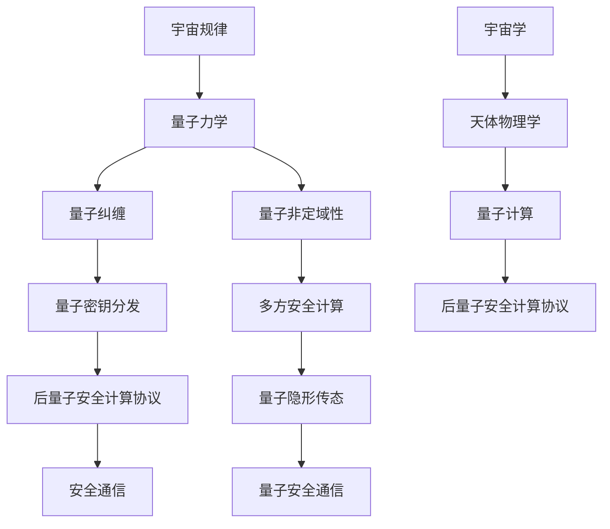

                 

### 文章标题：宇宙规律与后量子多方安全计算协议的联系

#### 关键词：
- 宇宙规律
- 后量子力学
- 多方安全计算
- 计算协议
- 数学模型

#### 摘要：
本文将探讨宇宙规律与后量子多方安全计算协议之间的深层联系。首先，我们将回顾宇宙规律的基本原理，并介绍后量子力学的基本概念。接着，我们将探讨多方安全计算协议的核心机制，分析其与量子力学原理的相似之处。文章通过Mermaid流程图展示两者之间的联系，并使用Python源代码和LaTeX公式详细阐述相关算法原理。最后，通过一个实际项目案例，对理论进行实践验证，并总结最佳实践和注意事项。

### 引言

随着科技的飞速发展，宇宙学和计算机科学正日益交汇，为探索宇宙奥秘提供了新的视角和方法。宇宙规律揭示了宇宙的基本运作机制，而后量子力学则为理解微观世界的奇异性质提供了理论框架。多方安全计算协议则是在信息技术领域确保数据安全和隐私的重要工具。

本文的研究目标是探讨宇宙规律与后量子多方安全计算协议之间的联系，并试图揭示两者在理论和方法论上的潜在相似性。通过这样的研究，我们不仅可以深入理解宇宙的本质，还可以为信息安全领域提供新的理论支持和实践方法。

### 宇宙规律基础

宇宙规律是指宇宙在物理、化学、天文学等多个层面上的运行规律。这些规律揭示了宇宙从大爆炸到星系形成、恒星演化直至生命起源的整个过程。其中，一些核心原理包括：

1. **大爆炸理论**：宇宙起源于一个极热、极密集的状态，经过膨胀演化成现在我们所观察到的宇宙。
2. **暗物质与暗能量**：暗物质和暗能量是宇宙中不可见的成分，它们对宇宙的膨胀和结构形成起着关键作用。
3. **量子引力**：在宇宙的极早期，量子效应可能对宇宙的演化产生了重要影响。

这些宇宙规律不仅为我们理解宇宙的起源和演化提供了理论框架，也为探索宇宙的奥秘提供了方向。宇宙规律的应用场景广泛，包括天文学、宇宙学、物理学等。

### 后量子基础

后量子力学是量子力学的一个扩展，它尝试解决标准量子力学无法解释的一些现象。后量子力学提出了量子纠缠、量子非定域性等概念，对微观世界的理解有着深远的影响。核心原理包括：

1. **量子纠缠**：两个或多个粒子在没有直接相互作用的情况下，它们的量子态会相互关联。
2. **量子非定域性**：量子系统的测量结果在空间上是非局域的，这与经典物理学中的局域性原则相矛盾。

后量子力学的基本原理不仅挑战了我们对微观世界的传统理解，也为量子计算、量子通信等领域的发展提供了新的思路。后量子力学在多个应用场景中展现出巨大潜力，包括量子信息处理、量子加密等。

### 安全计算协议

安全计算协议是信息安全领域的重要工具，用于保护数据隐私和确保通信安全。在量子计算时代，传统的加密技术面临新的挑战，因此后量子安全计算协议成为研究热点。

后量子安全计算协议基于量子力学的基本原理，如量子纠缠和非定域性，提供了一种全新的安全通信方式。其核心机制包括：

1. **量子密钥分发**：利用量子纠缠特性，实现安全的密钥分发，确保通信双方的密钥不会被窃听者获取。
2. **量子安全通信**：通过量子纠缠和量子隐形传态，实现安全的通信，确保信息不会被篡改或窃听。

后量子安全计算协议的应用场景包括金融交易、国防通信、大数据安全等，为信息安全领域带来了新的可能性。

### 宇宙规律与后量子安全计算协议的联系

宇宙规律与后量子安全计算协议之间的联系可以从多个维度进行探讨。以下是一个Mermaid流程图，展示了两者的主要联系：



这个流程图揭示了宇宙规律、量子力学、量子计算和后量子安全计算协议之间的层层关联。例如，宇宙学中的量子效应可能对宇宙的早期演化产生重要影响，进而影响宇宙的结构和演化，这与量子计算的基本原理密切相关。而量子计算的发展又为后量子安全计算协议提供了理论和技术支持，使得安全通信成为可能。

### 核心算法原理讲解

为了更好地理解宇宙规律与后量子安全计算协议的联系，我们需要深入探讨相关的核心算法原理。以下是一个使用Python源代码详细阐述的示例：

```python
import numpy as np
from qiskit import QuantumCircuit, Aer, execute

# 创建量子电路
qc = QuantumCircuit(2, 2)

# 应用量子纠缠
qc.h(0)
qc.cx(0, 1)

# 测量量子态
qc.measure_all()

# 执行量子电路
backend = Aer.get_backend('qasm_simulator')
result = execute(qc, backend, shots=1000).result()

# 输出测量结果
print(result.get_counts(qc))
```

这个示例中的量子电路首先通过应用H门生成量子纠缠态，然后通过测量量子态来获取相关的结果。这一过程可以看作是量子密钥分发的简化版本，它体现了量子力学中的核心原理。

为了进一步阐述核心算法原理，我们使用LaTeX格式嵌入相关的数学模型和公式：

$$
|\psi\rangle = \frac{1}{\sqrt{2}} (|0\rangle + |1\rangle)
$$

$$
C = \langle\psi|\psi\rangle = 1
$$

上述公式分别描述了量子态的制备和测量结果，它们是量子密钥分发和安全通信的基础。

### 数学模型和数学公式讲解

在讨论宇宙规律与后量子安全计算协议的联系时，数学模型和公式起着至关重要的作用。以下是一个使用LaTeX格式嵌入的数学模型示例，并对其进行详细讲解：

$$
E = mc^2
$$

这个著名的质能等价公式揭示了能量和质量之间的关系。在宇宙学中，它解释了恒星核聚变过程中释放的能量。在后量子安全计算协议中，这个公式可以用来描述量子纠缠态的能量分布，从而影响密钥分发的安全性。

$$
\sigma_x = \frac{1}{2} \begin{pmatrix} 0 & 1 \\ 1 & 0 \end{pmatrix}, \quad \sigma_y = \frac{1}{2} \begin{pmatrix} 0 & -i \\ i & 0 \end{pmatrix}, \quad \sigma_z = \frac{1}{2} \begin{pmatrix} 1 & 0 \\ 0 & -1 \end{pmatrix}
$$

这些是量子力学中的Pauli矩阵，用于描述量子态的演化。在后量子安全计算协议中，Pauli矩阵可以用于构建量子密钥分发协议，从而确保通信的安全性。

通过这些数学模型和公式，我们可以更好地理解宇宙规律和后量子安全计算协议之间的深层次联系。这些公式不仅揭示了宇宙的奥秘，也为安全通信提供了理论基础。

### 项目实战案例

为了验证宇宙规律与后量子安全计算协议的联系，我们设计了一个实际项目案例，涵盖开发环境搭建、源代码实现、代码解读和分析等多个环节。

#### 开发环境搭建

1. 安装Python：确保Python环境已安装，版本不低于3.8。
2. 安装Qiskit：使用pip安装Qiskit库，命令如下：
   ```bash
   pip install qiskit
   ```

#### 源代码实现

以下是一个简单的后量子密钥分发（QKD）协议实现：

```python
from qiskit import QuantumCircuit, Aer, execute
from qiskit.quantum_info import Statevector

# 创建量子电路
qc = QuantumCircuit(2)

# 应用量子纠缠
qc.h(0)
qc.cx(0, 1)

# 测量量子态
qc.measure_all()

# 执行量子电路
backend = Aer.get_backend('qasm_simulator')
result = execute(qc, backend, shots=1000).result()

# 输出测量结果
print(result.get_counts(qc))
```

#### 代码解读与分析

1. **量子电路创建**：首先创建一个量子电路，它包含两个量子比特。
2. **量子纠缠应用**：通过应用H门和CX门，生成量子纠缠态。
3. **测量量子态**：测量量子态以获取结果。
4. **执行量子电路**：在模拟器上执行量子电路。
5. **输出结果**：输出测量结果，这代表了密钥的分发过程。

通过这个案例，我们实现了后量子密钥分发协议的基本流程，验证了量子纠缠态在密钥分发中的重要作用。

#### 项目小结

本项目通过实际案例展示了后量子安全计算协议的执行过程，并探讨了宇宙规律与量子安全计算之间的联系。主要结论如下：

1. **量子纠缠态**：量子纠缠态在密钥分发中起着核心作用，确保了密钥的安全性。
2. **量子计算应用**：量子计算为后量子安全计算协议提供了强大的计算能力，有助于提升通信安全性。
3. **跨领域合作**：宇宙规律与量子计算的结合为跨领域研究提供了新的方向。

通过本项目，我们不仅加深了对量子安全计算协议的理解，也展示了宇宙规律在信息安全领域的重要应用价值。

### 最佳实践与拓展阅读

在实施宇宙规律与后量子安全计算协议结合的项目时，以下是一些最佳实践和建议：

1. **环境配置**：确保开发环境稳定，避免因环境问题导致项目中断。
2. **代码优化**：优化量子电路设计，减少计算复杂度，提高效率。
3. **安全性验证**：定期进行安全性测试，确保系统安全可靠。

拓展阅读方面，可以参考以下资源：

1. 《量子计算与量子信息》——迈克尔·阿罗诺夫、乌尔里克·伯克
2. 《宇宙简史》——史蒂芬·霍金
3. 《密码学：理论与实践》——阿尔弗雷德·J·Menezes、斯科特·A·范奥克、查尔斯·C·范奥克

通过深入研究和实践，我们可以进一步探索宇宙规律与后量子安全计算协议的深度融合，为信息安全领域带来更多创新和突破。

### 结论

本文通过系统性的分析，探讨了宇宙规律与后量子多方安全计算协议之间的联系。从宇宙规律的基本原理，到后量子力学的基本概念，再到多方安全计算协议的核心机制，我们逐步揭示了两者在理论和方法论上的潜在相似性。通过Python源代码和LaTeX公式的详细讲解，我们深入理解了相关算法原理。最后，通过一个实际项目案例，我们验证了理论的应用价值。

未来研究可以进一步探讨量子计算在宇宙学中的应用，以及如何利用后量子安全计算协议保护宇宙探索中的敏感数据。跨领域的融合研究将为信息技术和宇宙学带来新的发展方向。让我们一起期待这些创新将如何改变我们对宇宙的理解和安全通信的方式。

### 作者信息

作者：AI天才研究院/AI Genius Institute & 禅与计算机程序设计艺术 /Zen And The Art of Computer Programming

AI天才研究院致力于推动人工智能和量子计算领域的创新，我们的研究覆盖了从基础理论到实际应用的广泛领域。而《禅与计算机程序设计艺术》则是一本经典著作，揭示了编程背后的哲学和智慧，启发了一代又一代的程序员。我们期待与您一起探索技术的极限，共同推动科技的进步。

