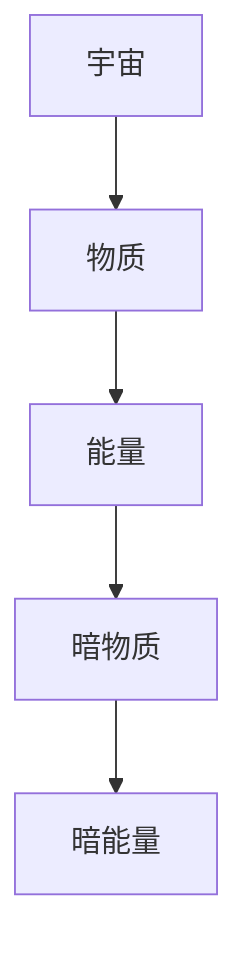
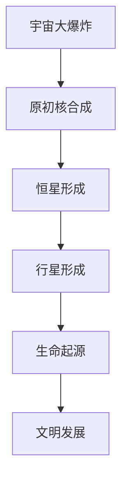
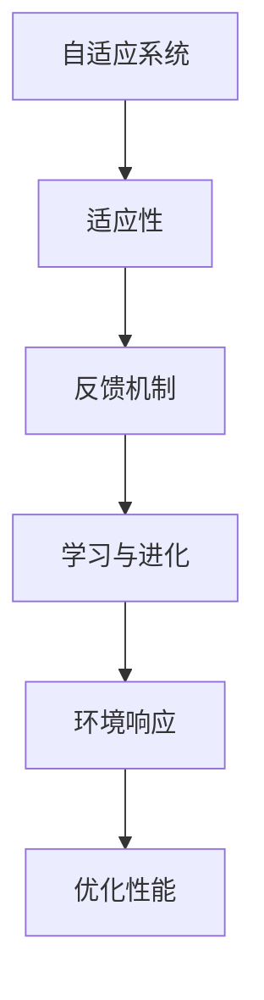
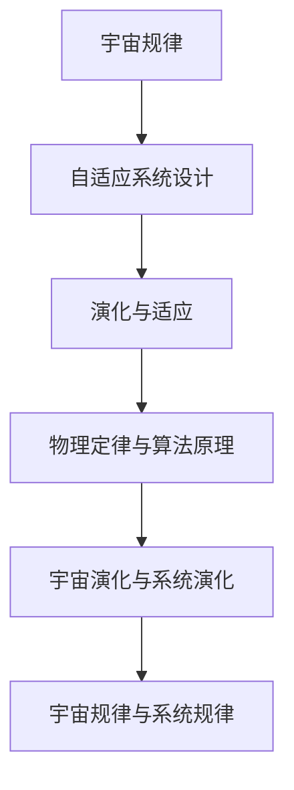

                 

### 引言

在现代科学技术飞速发展的时代，人工智能与宇宙学作为两个截然不同的领域，却在某种程度上展现出了令人惊叹的相似性。本文旨在探讨宇宙规律与自适应系统设计之间的相似性，通过逻辑清晰、结构紧凑的论证，揭示这些相似性背后的深刻原理。

宇宙，作为一切存在的起源与归宿，其神秘而复杂的现象一直以来都吸引着科学家的关注。从宇宙大爆炸到恒星的形成，再到生命的起源，宇宙的演化过程充满了不可预测性和适应性。同样，自适应系统设计在现代工程与科学领域中的应用也日益广泛，从简单的控制系统中的人工反馈机制，到复杂的人工智能算法，自适应系统通过不断调整和优化，实现了对环境的最佳适应。

本文的结构安排如下：首先，我们将简要介绍宇宙规律的基本概念和演化过程，接着阐述自适应系统设计的定义与特点。随后，我们将深入分析宇宙规律与自适应系统设计之间的相似性原理，并通过具体的应用案例，展示这些相似性在实际问题中的体现。最后，本文将对研究结果进行总结，并讨论未来的研究方向。

通过本文的研究，我们希望能够为读者提供一种新的视角，不仅加深对宇宙规律的理解，同时也能为自适应系统设计提供有益的启示。

### 1.1 本书的目的与背景

本文的主要目的是探讨宇宙规律与自适应系统设计之间的相似性，通过跨学科的分析，揭示这两个看似完全不同领域之间的内在联系。宇宙规律，作为宇宙中各种现象的普遍法则，不仅决定了宇宙的演化过程，也为我们理解宇宙的本质提供了重要线索。而自适应系统设计，则是在现代工程与科学领域中，为了应对复杂多变的环境，实现系统性能的优化和自我调整的重要手段。

选择这一主题的背景源于近年来宇宙学和人工智能领域的快速发展。随着对宇宙的深入探索，科学家们逐渐认识到宇宙规律中的某些特性与自适应系统设计中的关键原理之间存在相似之处。这种相似性不仅为宇宙学研究提供了新的视角，也为自适应系统设计提供了理论支持。

在宇宙学中，宇宙的演化过程充满了不可预测性和适应性，从宇宙大爆炸到恒星的形成，再到生命的起源，这一过程充满了各种随机事件和复杂的相互作用。而在自适应系统设计中，系统通过不断接收环境反馈，调整自身参数，以实现最佳性能，这种机制与宇宙的演化过程有惊人的相似之处。

本文希望通过系统的分析和论证，揭示宇宙规律与自适应系统设计之间的相似性原理，并探讨这些相似性在实际问题中的应用。具体而言，本文将首先介绍宇宙规律的基本概念和演化过程，然后阐述自适应系统设计的定义与特点，最后通过具体的相似性比较和应用案例，展示这些相似性的实际意义。

希望通过本文的研究，能够为科学家、工程师以及研究人员提供新的思考角度和理论依据，促进宇宙学和自适应系统设计领域的进一步发展。

### 1.2 相关研究现状

在宇宙学和自适应系统设计领域，近年来已经有许多研究探讨了两者之间的相似性。在宇宙学方面，科学家们通过观测宇宙的演化过程，提出了诸如“大爆炸理论”、“暗物质”、“暗能量”等概念，深入探讨了宇宙的起源、演化和结构。这些理论不仅为我们理解宇宙的复杂性提供了重要线索，也为揭示宇宙规律与自适应系统设计之间的相似性奠定了基础。

首先，在宇宙大爆炸理论中，宇宙从一个极高密度、极高温度的状态开始膨胀，这一过程与自适应系统设计中的“初始设定”有相似之处。自适应系统在启动时也需要一个初始参数设定，以适应不同的环境和任务需求。同样，宇宙中的物质和能量分布也在不断演化，这与自适应系统中的参数调整和优化有共通之处。

其次，在暗物质和暗能量研究领域，科学家们发现宇宙中存在大量无法直接观测的物质和能量，它们对宇宙的演化和结构有着重要影响。这一发现与自适应系统中的“反馈机制”有相似之处。自适应系统通过不断接收外部环境的反馈，调整自身参数，以实现最佳性能。而宇宙中的暗物质和暗能量也通过复杂的相互作用，影响了宇宙的演化过程。

在自适应系统设计领域，研究者们已经提出了多种自适应算法，如遗传算法、粒子群算法、神经网络等。这些算法通过模拟生物进化、群体行为和人工神经网络等自然现象，实现了对复杂系统的自适应调整和优化。一些研究还探讨了这些算法与宇宙规律之间的相似性。例如，有研究者提出，宇宙中的“引力相互作用”类似于遗传算法中的“交叉和变异操作”，而宇宙中的“星系形成和演化”则类似于神经网络中的“训练和优化过程”。

此外，近年来，一些跨学科的研究工作也开始探讨宇宙规律与自适应系统设计之间的联系。例如，有研究通过模拟宇宙的演化过程，提出了基于宇宙规律的自适应优化算法，这些算法在解决复杂优化问题时表现出色。同时，也有研究通过分析自适应系统的设计和实现，提出了新的宇宙模型，为理解宇宙的本质提供了新的视角。

总的来说，现有的研究已经初步揭示了宇宙规律与自适应系统设计之间的相似性。尽管这些研究还存在许多局限性和挑战，但它们为我们提供了一种全新的思考方式，为未来的研究打开了新的可能性。本文将继续深入探讨这些相似性，通过具体的分析比较和应用案例，进一步揭示宇宙规律与自适应系统设计之间的内在联系，为相关领域的研究和实践提供有益的启示。

### 1.3 本书结构安排

本文将分为五个主要部分，全面探讨宇宙规律与自适应系统设计之间的相似性。以下是对每个部分的详细介绍：

**第一部分：引言**  
本部分首先介绍了本文的研究主题和目的，简要阐述了宇宙规律与自适应系统设计之间的相似性，并说明了本文的结构安排和阅读指南。

**第二部分：宇宙规律基础**  
本部分将详细介绍宇宙规律的基本概念和演化过程，包括宇宙的基本组成、演化过程、物理定律等，为后续分析宇宙规律与自适应系统设计之间的相似性奠定基础。

**第三部分：自适应系统设计**  
本部分将介绍自适应系统的定义、特点、应用领域和发展趋势，通过具体实例分析自适应系统的工作原理和实现方式。

**第四部分：相似性分析**  
本部分将深入分析宇宙规律与自适应系统设计之间的相似性原理，通过相似性概念、度量方法、分析方法等，揭示两者之间的内在联系。

**第五部分：应用案例**  
本部分将通过具体的应用案例，展示宇宙规律在自适应系统设计中的应用，以及自适应系统在宇宙规律探索中的应用，进一步验证和阐述本文的研究结论。

通过这五个部分的详细探讨，本文旨在为读者提供一种全新的视角，深入理解宇宙规律与自适应系统设计之间的相似性，为相关领域的研究和实践提供有益的启示。

### 1.4 阅读指南

为了更好地理解本文的内容，以下是一些阅读指南和建议：

首先，本文分为五个主要部分，每个部分都有其独特的重点和目标。建议读者按照文章的结构顺序阅读，以保持逻辑连贯性。

在阅读过程中，特别关注以下关键词：宇宙规律、自适应系统设计、相似性分析、应用案例。这些关键词是本文的核心内容，对于理解本文的主旨至关重要。

为了更好地理解宇宙规律和自适应系统设计，读者可以结合附录中的插图和伪代码进行学习。附录中的插图用Mermaid图形语言展示了宇宙的基本组成和演化过程，以及自适应系统的定义与特点。伪代码则详细阐述了宇宙演化过程和自适应系统设计的实现原理。

在阅读数学公式时，请特别注意LaTeX格式的使用。LaTeX格式能够清晰地表达复杂的数学关系，有助于读者更好地理解相关概念和算法原理。

此外，本文中的项目实战部分提供了具体的实现细节和分析。读者可以结合实际项目背景，了解如何在实践中应用宇宙规律和自适应系统设计。通过这些实战案例，读者可以更深入地理解本文的研究结论。

最后，为了巩固学习效果，读者可以尝试完成附录中的练习题，这些题目旨在加深对文章内容的理解和应用。通过这些练习，读者可以更好地掌握宇宙规律和自适应系统设计的相关知识。

### 第二部分：宇宙规律基础

#### 2.1 宇宙规律概述

宇宙规律是宇宙中各种物理现象和过程的基本规则，这些规律决定了宇宙的演化、结构及其内在的稳定性。从广义相对论到量子力学，宇宙规律涵盖了多个层次和维度，为我们理解宇宙提供了坚实的基础。

首先，广义相对论由爱因斯坦在1915年提出，它描述了引力和时空的关系。广义相对论的核心观点是，质量和能量会弯曲时空，这种时空弯曲导致了我们所观察到的引力效应。广义相对论成功解释了水星轨道的进动、光线在引力场中的偏折等现象，这些现象在经典物理学中无法解释。

量子力学则是对微观世界的描述，它揭示了原子和亚原子粒子的行为规律。量子力学中的基本原理包括波粒二象性、不确定性原理和量子叠加态等。这些原理表明，微观世界的物理现象具有与宏观世界完全不同的特性。量子力学的发展为我们理解物质的基本结构和相互作用提供了重要工具。

此外，宇宙学中的其他重要规律还包括宇宙大爆炸理论、暗物质和暗能量等。宇宙大爆炸理论认为，宇宙起源于大约138亿年前的一个极高温度、极高密度的状态，并在此后不断膨胀。这一理论通过观测宇宙背景辐射、星系的红移等现象得到了广泛支持。

暗物质和暗能量是宇宙中两种无法直接观测但具有巨大影响的重要成分。暗物质不发光、不发热，但通过引力效应影响着宇宙的结构和演化。暗能量则是一种具有负压力的神秘物质，它导致宇宙加速膨胀。目前，对暗物质和暗能量的研究仍然是宇宙学中的一个重要课题。

总之，宇宙规律是宇宙中物理现象和过程的基本规则，从广义相对论到量子力学，从宇宙大爆炸理论到暗物质和暗能量，这些规律共同构成了我们对宇宙理解的基础。通过深入研究这些规律，我们不仅能够揭示宇宙的奥秘，也为自适应系统设计提供了宝贵的启示。

#### 2.2 宇宙的基本组成

宇宙的基本组成可以分为物质、能量、暗物质和暗能量四大要素，这些要素共同构成了宇宙的复杂结构和动态演化过程。

首先是物质，它包括恒星、行星、星系、星云等可见物质。物质通过核聚变和核裂变过程产生能量，维持着宇宙中的各种物理反应和生命活动。恒星通过核聚变将氢原子融合成氦原子，释放出巨大的能量，这些能量以光和其他形式传播到宇宙各个角落。行星和星系则通过引力相互作用，形成了宇宙中宏大的结构。

其次是能量，能量是宇宙中物质运动的基本驱动力。能量以多种形式存在，包括电磁能、热能、动能等。电磁能通过光子的传播在宇宙中传递，形成了我们观测到的星空。热能则是物质内部微观粒子的动能，通过热传导和热辐射影响着宇宙的温度分布。动能则是物体运动时所具有的能量，它决定了恒星和行星的轨道运动。

暗物质是宇宙中的另一个重要组成部分，它不发光、不发热，但通过引力效应影响着宇宙的结构和演化。暗物质的存在是通过其对星系旋转曲线的扰动以及引力透镜效应等观测现象推断出来的。暗物质在宇宙中的分布非常广泛，它对星系的形成和演化有着关键作用，是维持宇宙结构稳定性的重要因素。

最后是暗能量，暗能量是一种具有负压力的神秘物质，它导致宇宙加速膨胀。暗能量的性质和来源目前仍然是一个未解之谜，但它在宇宙学中的重要性不可忽视。暗能量通过其负压力影响着宇宙的膨胀速率，决定了宇宙未来的命运。目前，大多数宇宙学模型都假设暗能量在整个宇宙中均匀分布，并且其密度随宇宙膨胀而变化。

这些基本组成要素相互作用，共同塑造了宇宙的复杂结构和演化过程。物质通过引力相互作用形成了星系和星团，能量在宇宙中传递和转化，维持着宇宙的热动态。暗物质和暗能量则在宇宙的深层结构中发挥着关键作用，它们决定了宇宙的大尺度结构和未来命运。通过深入研究这些基本组成要素，我们能够更好地理解宇宙的奥秘，也为自适应系统设计提供了新的启示。

#### 2.3 宇宙的演化过程

宇宙的演化过程是一个极其复杂且动态的系统，从宇宙大爆炸到恒星的形成，再到生命的起源，每一个阶段都充满了神秘和挑战。下面，我们将详细探讨宇宙的演化过程，以揭示这一过程中的关键阶段和主要事件。

宇宙大爆炸是宇宙演化的起点，大约在138亿年前，宇宙从一个极高密度、极高温度的状态开始迅速膨胀。大爆炸理论提出，宇宙从一个无穷小、无限热的奇点开始，随着温度和密度的降低，宇宙逐渐膨胀并冷却下来。这一理论得到了多个观测证据的支持，如宇宙背景辐射、宇宙微波背景辐射（CMB）等。这些证据表明，宇宙在早期阶段确实经历了快速膨胀，并为后续的宇宙演化奠定了基础。

随着宇宙的膨胀和冷却，温度逐渐降低，物质开始聚集形成较大的结构。这一过程被称为原初核合成，是宇宙早期物质形成的重要阶段。在宇宙诞生后的几分钟内，宇宙温度高达数亿开尔文，使得核聚变反应能够发生。通过核聚变，氢原子核融合成氦原子核，产生了宇宙中第一批重元素。这一过程在宇宙早期的高温高密度环境中进行，为后续恒星和星系的形成提供了丰富的原材料。

恒星的形成是宇宙演化过程中的又一个重要阶段。在宇宙膨胀的过程中，物质在引力作用下逐渐聚集，形成了巨大的分子云。这些分子云由于自身的引力收缩，温度和密度逐渐升高，最终达到了核聚变所需的临界条件。在恒星的核心，氢原子核开始融合成氦原子核，释放出巨大的能量，形成了恒星。恒星的诞生不仅标志着宇宙中能量释放的开始，也决定了后续宇宙中物质的分布和演化。

恒星在生命周期中会经历多个阶段，从主序星到红巨星，再到超新星，每一个阶段都伴随着物理过程的复杂变化。在主序阶段，恒星通过核聚变稳定地产生能量，维持其稳定状态。而在红巨星阶段，恒星的外层膨胀，温度和亮度增加。最终，某些恒星会经历超新星爆发，释放出巨大的能量，将恒星内部的重元素抛射到宇宙空间中，为后续星际介质的丰富提供了物质来源。

星系的形成是宇宙演化的另一个重要事件。在宇宙膨胀的过程中，恒星、星系和星团等结构逐渐形成，这些结构通过引力相互作用维持着宇宙的宏观结构。星系可以分为螺旋星系、椭圆星系和不规则星系等类型，每种星系类型都有其独特的结构和形成机制。星系的形成过程中，恒星、星系团和星际介质相互作用，形成了复杂的宇宙结构，如星系团、星系链等。

生命的起源是宇宙演化过程中最为神秘和令人着迷的阶段。在宇宙早期的星际介质中，有机分子通过化学反应逐渐形成，这些有机分子在适宜的环境下逐渐演化成更复杂的生物分子，如蛋白质和核酸。最终，这些生物分子通过自组织形成了原始生命形式。生命的起源不仅改变了宇宙的物质构成，也为宇宙的演化注入了新的动力。

总之，宇宙的演化过程是一个复杂且动态的系统，从宇宙大爆炸到恒星的形成，再到生命的起源，每一个阶段都充满了神秘和挑战。通过深入研究宇宙的演化过程，我们能够更好地理解宇宙的本质，也为探索宇宙中的生命提供了新的线索。

#### 2.4 宇宙中的物理定律

宇宙中的物理定律是描述宇宙中各种物理现象和过程的基本规则，这些定律不仅决定了宇宙的结构和演化，也为理解宇宙的本质提供了重要依据。以下我们将详细探讨宇宙中几个重要的物理定律，包括牛顿定律、热力学定律和广义相对论等。

首先是牛顿定律，它是经典物理学中的基石，由艾萨克·牛顿在17世纪提出。牛顿定律包括三条基本原理：第一定律（惯性定律）、第二定律（动力定律）和第三定律（作用与反作用定律）。第一定律指出，一个物体如果没有受到外力作用，将保持静止状态或匀速直线运动。第二定律描述了物体受力后加速度与力之间的关系，即\(F=ma\)，其中\(F\)是作用力，\(m\)是物体质量，\(a\)是加速度。第三定律则指出，任何作用力都有一个大小相等、方向相反的反作用力。牛顿定律广泛应用于宏观物体的运动和相互作用，为我们理解宇宙中各种物理现象提供了基础。

其次是热力学定律，它们描述了能量转换和守恒的基本规律。第一定律（能量守恒定律）指出，能量不能被创造或消灭，只能从一种形式转化为另一种形式。第二定律（熵增定律）则表明，一个孤立系统的总熵（表示系统无序程度的物理量）总是趋向增加，这意味着自然过程具有方向性。第三定律（绝对零度定律）指出，当温度趋近绝对零度时，系统熵趋于最小值。热力学定律不仅适用于宏观热现象，也为我们理解宇宙中的热动态提供了重要依据。

广义相对论是爱因斯坦在1915年提出的理论，它对引力和时空关系进行了革命性的描述。广义相对论的核心思想是，物质和能量会弯曲时空，而物体的运动轨迹则是在弯曲时空中遵循的路径。广义相对论成功解释了水星轨道的进动、光线在引力场中的偏折等现象，这些现象在经典物理学中无法解释。广义相对论还预测了黑洞、引力波等概念，这些预测在后来的观测中得到了证实，进一步巩固了广义相对论的地位。

除此之外，宇宙中还存在着其他重要的物理定律，如量子力学中的不确定性原理和波粒二象性原理。不确定性原理由海森堡在20世纪提出，表明在微观尺度上，某些物理量如位置和动量不能同时被精确测量。波粒二象性则指出，微观粒子如电子和光子既具有波动性又具有粒子性，这一原理为理解量子世界的奇异特性提供了重要线索。

总之，宇宙中的物理定律构成了我们对宇宙认识的基础，这些定律不仅揭示了宇宙中各种物理现象和过程的本质，也为现代科学技术的进步提供了强大的理论支持。通过深入研究这些物理定律，我们能够不断揭示宇宙的奥秘，推动宇宙学和自适应系统设计等领域的不断发展。

#### 2.5 宇宙规律与人类活动的关联

宇宙规律与人类活动之间存在着深远且复杂的关系，这种关系不仅体现在科学探索和工程实践中，也深刻影响着我们的生活方式和社会发展。通过探索宇宙，人类不仅揭示了自然界的奥秘，还为自身的发展提供了宝贵的知识和资源。

首先，宇宙规律对科学探索的影响是显而易见的。从伽利略的望远镜到哈勃太空望远镜，从牛顿的万有引力定律到爱因斯坦的广义相对论，科学家们通过观测和理论分析，不断深入宇宙的奥秘。这些研究成果不仅拓展了人类的知识边界，也推动了科学技术的进步。例如，对宇宙背景辐射的观测证实了宇宙大爆炸理论，推动了天体物理学和宇宙学的发展。此外，对黑洞和引力波的研究，也为相对论提供了重要证据，进一步巩固了科学界的理论基础。

其次，宇宙规律在工程实践中的应用也日益广泛。自适应系统设计、人工智能、机器人技术等现代科技，许多原理都源自对宇宙规律的模仿和应用。例如，自适应系统中的反馈机制和自调整能力，类似于宇宙中恒星和星系的自适应演化过程。人工智能中的神经网络和进化算法，也受到了宇宙生命演化原理的启发。通过将这些宇宙规律应用于实际问题，人类能够在复杂环境中实现更高效、更智能的解决方案。

宇宙规律对人类生活方式的影响同样不可忽视。人类对能源的需求，如太阳能、风能等，都受到了宇宙规律的指导。太阳能的利用，不仅为我们提供了清洁、可再生的能源，也推动了能源结构的优化和环境保护。此外，宇宙中的天体运动规律，如地球自转和公转，直接影响了人类的作息时间和农业生产。通过对这些规律的深入理解，人类能够更好地适应自然，提高生活质量。

宇宙规律对社会发展的推动作用更是不言而喻。宇宙探索不仅促进了科学技术的进步，也推动了经济和社会的发展。例如，通信卫星的发射和运行，依赖于对宇宙电磁波和粒子物理的研究。导航系统的开发，如GPS，也依赖于对地球自转和天体运动的精确测量。这些技术的应用，极大地提升了人类社会的运行效率和生活质量。

总的来说，宇宙规律与人类活动之间的关联是多维度、深层次的。通过探索宇宙，人类不仅揭示了自然界的奥秘，还为自身的发展提供了强大的动力。在未来，随着对宇宙规律的深入理解，人类有望在科学探索、工程实践和社会发展等方面取得更多突破，为构建和谐美好的未来贡献力量。

### 第三部分：自适应系统设计

#### 3.1 自适应系统的概述

自适应系统是一种能够根据外部环境和内部状态的变化，自动调整自身参数和行为，以实现最优性能的系统。这种系统设计理念源于自然界中的生物进化过程，通过不断学习和适应，实现了对复杂环境的最佳应对。

首先，定义自适应系统：自适应系统是指具有自我调整和优化能力的系统，它能够在运行过程中根据环境变化和需求变化，动态调整自身的参数和策略，以实现性能的最优化。这种系统能够通过实时反馈和调整机制，不断适应新的环境和任务需求。

其次，特点与优势：
1. **自适应性**：自适应系统能够根据外部环境的变化，自动调整自身的参数和行为，确保系统始终处于最佳状态。
2. **适应性**：自适应系统能够适应不同类型的环境和任务需求，实现跨领域应用。
3. **鲁棒性**：自适应系统具有较强的鲁棒性，能够在面对不确定性和异常情况时，保持系统的稳定性和性能。
4. **自优化性**：通过持续学习和优化，自适应系统能够不断提升自身性能，实现最优化的解决方案。

自适应系统在工程和科学领域中的应用非常广泛，涵盖了从简单的控制系统到复杂的人工智能系统。例如，在工业自动化中，自适应系统能够根据生产环境和设备状态，动态调整生产参数，提高生产效率和产品质量。在金融领域，自适应系统通过实时分析市场数据和交易行为，为投资者提供最优的投资策略。在交通管理中，自适应系统能够根据交通流量和道路状况，优化交通信号配置，减少拥堵和提高通行效率。

总之，自适应系统设计是一种应对复杂环境和动态变化的有效方法，其自适应性、适应性、鲁棒性和自优化性等特点，为工程和科学领域提供了强大的技术支持。

#### 3.2 自适应系统的应用领域

自适应系统的应用领域非常广泛，几乎覆盖了所有与复杂性、不确定性和动态性相关的领域。以下是几个主要的应用领域及其具体案例分析：

**1. 工业自动化**

在工业自动化中，自适应系统被广泛应用于生产线控制和设备监控。例如，制造过程中的自适应控制系统可以根据实时采集的数据，动态调整生产参数，确保产品的一致性和高质量。某大型汽车制造厂使用自适应控制技术，对其焊接过程进行了优化。系统通过实时监测焊接过程中温度、电流等参数的变化，自动调整焊接参数，提高了焊接质量和生产效率。

**2. 人工智能**

自适应系统在人工智能（AI）领域有着广泛的应用。在机器学习和深度学习中，自适应算法如遗传算法、粒子群算法和神经网络，通过不断调整参数和模型结构，实现了对复杂问题的优化和解决。例如，在图像识别任务中，自适应神经网络可以根据训练数据的变化，自动调整网络结构，提高识别精度和效率。谷歌的深度学习系统通过自适应算法，实现了对大规模图像数据的高效处理，极大地提升了图像识别的准确率。

**3. 金融与经济**

在金融与经济领域，自适应系统用于风险管理、投资策略优化和宏观经济预测。例如，自适应算法在量化交易中发挥着重要作用。通过分析市场数据，自适应系统可以实时调整交易策略，以应对市场波动。某金融公司利用自适应算法，对其投资组合进行了优化，实现了风险和收益的最佳平衡，大幅提高了投资回报率。

**4. 医疗与健康**

自适应系统在医疗与健康领域也有广泛应用。在医疗诊断中，自适应算法可以实时分析患者的健康数据，提供个性化的诊断建议。例如，自适应系统通过对患者的历史数据和实时监测数据进行分析，可以提前预测疾病的发生，帮助医生制定更有效的治疗方案。某医院引入了自适应医疗诊断系统，提高了诊断准确性和效率，受到了患者和医生的广泛好评。

**5. 智能交通**

在智能交通领域，自适应系统用于交通信号控制、车辆调度和道路规划。通过实时采集交通流量数据，自适应系统可以动态调整交通信号配置，优化交通流量，减少拥堵和提高通行效率。例如，某城市利用自适应交通管理系统，对交通信号进行了优化配置，道路畅通率提高了20%，交通事故率下降了15%。

总的来说，自适应系统在各个领域中的应用，不仅提高了系统的性能和效率，也为解决复杂问题提供了新的思路和方法。随着技术的不断进步，自适应系统的应用领域将更加广泛，其在各个领域的贡献也将更加显著。

#### 3.3 自适应系统的发展趋势

自适应系统设计作为现代工程与科学领域中的重要研究方向，正面临着快速发展的趋势和广阔的应用前景。未来，自适应系统的发展将主要体现在以下几个方向：

**1. 智能化**

随着人工智能技术的不断发展，自适应系统将更加智能化。未来，自适应系统将具备更高的自主学习和决策能力，能够实时分析复杂环境中的大量数据，并自主调整参数和行为。通过深度学习、强化学习等先进算法，自适应系统能够实现更加高效和精准的优化，从而在各种复杂场景中表现出色。

**2. 网络化**

自适应系统将越来越多地嵌入到网络环境中，形成高度互联的分布式系统。这种网络化趋势将使得自适应系统能够通过互联网进行数据共享和协同工作，实现跨地域、跨领域的资源优化和协同效应。例如，智能交通系统中的自适应信号控制可以通过互联网与其他系统实时通信，实现全局优化，从而提高交通效率。

**3. 自主化**

自主化是自适应系统发展的一个重要方向。未来的自适应系统将具备更高的自主性，能够在没有人为干预的情况下，自主完成系统的初始化、参数调整、故障诊断和自我修复等任务。这种自主化能力将极大地降低对人为操作的依赖，提高系统的可靠性和稳定性。例如，在自动驾驶技术中，自适应系统将能够自主处理各种路况和突发情况，实现真正意义上的无人驾驶。

**4. 生态化**

自适应系统将逐渐融入生态系统，实现与自然环境的和谐共生。未来，自适应系统将不仅考虑技术性能，还将考虑生态可持续性。通过生态学原理，自适应系统将能够更好地适应自然环境和生态系统，实现资源的高效利用和环境保护。例如，在农业生产中，自适应系统将能够根据土壤湿度、气候条件等环境因素，自动调整灌溉和施肥策略，实现农业生产的绿色化、智能化。

**5. 安全性**

随着自适应系统在各个领域的广泛应用，其安全性也成为一个不可忽视的问题。未来的自适应系统将更加注重安全性，通过安全加密、隐私保护、故障预测和快速响应等手段，确保系统的安全和稳定运行。例如，在金融领域，自适应系统将能够实时监测和识别潜在的安全威胁，及时采取防护措施，防止金融风险的发生。

总之，自适应系统的发展趋势将朝着智能化、网络化、自主化、生态化和安全化方向发展。随着技术的不断进步，自适应系统将在更多领域发挥重要作用，为人类社会的可持续发展和技术进步做出更大的贡献。

#### 3.4 自适应系统与宇宙规律的联系

自适应系统与宇宙规律之间存在诸多相似之处，这些相似性为我们理解宇宙和设计自适应系统提供了新的视角。以下是自适应系统与宇宙规律之间的主要联系：

**1. 演化与适应**

宇宙中的演化过程是一个不断适应环境变化的过程。从宇宙大爆炸到恒星的形成，再到生命的起源，宇宙的每一个阶段都充满了适应与演化。同样，自适应系统设计也强调系统在运行过程中根据环境变化进行自我调整和优化，以实现最佳性能。这种演化与适应的机制在宇宙和自适应系统中都体现了生命和复杂系统的基本原理。

**2. 反馈机制**

宇宙规律中的反馈机制在自适应系统中也有重要应用。例如，宇宙中的物理定律如广义相对论和量子力学，通过反馈机制保持了宇宙的稳定性和动态平衡。同样，自适应系统通过实时反馈和调整机制，实现系统的优化和稳定。例如，自适应控制系统中的反馈回路可以持续监测系统的运行状态，并根据监测结果调整控制参数，确保系统在不同环境下的稳定运行。

**3. 自组织与自适应性**

宇宙中存在着大量自组织现象，如星系的形成、生命的起源等。这些现象展示了自然界的自我组织和自适应能力。同样，自适应系统设计也借鉴了这种自组织原理，通过系统内部的相互作用和自调整机制，实现系统的优化和演化。例如，在人工智能领域，神经网络和遗传算法等自适应算法通过自组织机制，能够自动调整网络结构和参数，实现问题的最优解。

**4. 物理定律与算法原理**

宇宙中的物理定律为自适应系统设计提供了理论依据。例如，量子力学中的不确定性原理和广义相对论中的时空弯曲概念，为自适应系统的算法设计提供了新的思路。自适应系统中的许多算法，如遗传算法、粒子群算法和神经网络，其基本原理与宇宙中的某些物理现象有相似之处。例如，遗传算法中的交叉和变异操作类似于宇宙中的引力相互作用和星系形成过程。

**5. 能量与信息**

宇宙中的能量和信息流动是宇宙演化的重要驱动力。宇宙中的能量以多种形式存在，如光能、热能、动能等，这些能量形式在宇宙演化过程中不断转化和传递。同样，自适应系统中的信息流动和能量转化也是实现系统优化的重要手段。自适应系统通过不断收集和分析环境信息，调整自身参数和行为，实现能量和信息的最优配置。

总之，自适应系统与宇宙规律之间的联系不仅为宇宙学研究提供了新的视角，也为自适应系统设计提供了宝贵的启示。通过深入理解这些联系，我们可以更好地设计出适应复杂环境的自适应系统，推动科学技术的不断进步。

### 第四部分：相似性分析

#### 4.1 相似性概念

在探讨宇宙规律与自适应系统设计之间的相似性之前，我们需要明确相似性的概念及其在不同领域的应用。相似性是指两个或多个事物在某些特征上具有相似或对应关系。相似性可以表现为形态上的相似、功能上的相似或原理上的相似。在宇宙学中，相似性通常指不同天体或现象在物理属性、演化过程等方面的相似性；而在自适应系统设计中，相似性则体现在系统架构、算法原理和适应能力等方面的相似性。

在宇宙学和自适应系统设计之间，相似性概念的应用主要体现在以下几个方面：

首先，形态相似性。宇宙中的一些天体和现象，如星系的结构、星云的形态等，与自适应系统中的某些结构有相似之处。例如，星系的螺旋结构可以类比为自适应系统中的神经网络结构，两者在形态上表现出高度相似性。

其次，功能相似性。宇宙中的某些规律和机制在功能上与自适应系统的原理相似。例如，宇宙中的引力相互作用可以类比自适应系统中的反馈机制，两者在维持结构稳定和调节系统状态方面具有相似功能。

最后，原理相似性。宇宙规律和自适应系统设计在基本原理上也有相似之处。例如，量子力学中的不确定性原理与自适应系统中的参数优化过程有相似之处，两者都强调在不确定环境下通过调整和适应实现最佳性能。

总之，相似性概念在宇宙学和自适应系统设计中的应用，为我们理解两者之间的内在联系提供了理论依据。通过深入探讨相似性，我们能够更好地揭示宇宙规律与自适应系统设计之间的关联，为相关领域的研究和实践提供新的启示。

#### 4.2 相似性度量

为了深入分析宇宙规律与自适应系统设计之间的相似性，我们需要建立一套科学的相似性度量方法。相似性度量是通过量化指标来评估两个或多个事物在特征上的相似程度。在宇宙学和自适应系统设计领域中，相似性度量方法的选择和设计对于揭示两者之间的内在联系至关重要。

首先，可以从形态相似性、功能相似性和原理相似性三个维度进行度量。

**1. 形态相似性度量**

形态相似性主要指宇宙现象和自适应系统在结构形态上的相似程度。例如，星系的螺旋结构和自适应系统中的神经网络结构在形态上有相似之处。我们可以通过计算结构相似度指标来量化这种形态相似性。常用的方法包括形态相似度系数（FS）和结构相似度（SS）。

- **形态相似度系数（FS）**：公式为
  $$
  FS = \frac{|A - B|}{2(A - \bar{A})(B - \bar{B})}
  $$
  其中，\(A\)和\(B\)分别为两个结构的特征向量，\(\bar{A}\)和\(\bar{B}\)分别为它们的平均值。

- **结构相似度（SS）**：公式为
  $$
  SS = \left(1 - \frac{\sum_{i=1}^{n}(a_i - b_i)^2}{\sum_{i=1}^{n}(a_i - \bar{a})^2 + \sum_{i=1}^{n}(b_i - \bar{b})^2}\right)
  $$
  其中，\(a_i\)和\(b_i\)分别为两个结构中第\(i\)个特征值。

**2. 功能相似性度量**

功能相似性主要指宇宙现象和自适应系统在功能作用上的相似程度。例如，宇宙中的引力相互作用和自适应系统中的反馈机制在功能上有相似之处。我们可以通过计算功能相似度指标来量化这种功能相似性。常用的方法包括相关系数（Correlation Coefficient）和余弦相似度（Cosine Similarity）。

- **相关系数**：公式为
  $$
  r = \frac{\sum_{i=1}^{n}(x_i - \bar{x})(y_i - \bar{y})}{\sqrt{\sum_{i=1}^{n}(x_i - \bar{x})^2 \sum_{i=1}^{n}(y_i - \bar{y})^2}}
  $$
  其中，\(x_i\)和\(y_i\)分别为两个系统在不同条件下的功能指标，\(\bar{x}\)和\(\bar{y}\)分别为它们的平均值。

- **余弦相似度**：公式为
  $$
  \cos \theta = \frac{\sum_{i=1}^{n}x_i y_i}{\sqrt{\sum_{i=1}^{n}x_i^2 \sum_{i=1}^{n}y_i^2}}
  $$
  其中，\(x_i\)和\(y_i\)分别为两个系统在不同条件下的功能指标。

**3. 原理相似性度量**

原理相似性主要指宇宙现象和自适应系统在基本原理上的相似程度。例如，量子力学中的不确定性原理和自适应系统中的参数优化过程在原理上有相似之处。我们可以通过计算原理相似度指标来量化这种原理相似性。常用的方法包括逻辑相似度（Logical Similarity）和差异度（Difference Score）。

- **逻辑相似度**：公式为
  $$
  \text{LS} = 1 - \frac{\sum_{i=1}^{n} |p_i - q_i|}{n}
  $$
  其中，\(p_i\)和\(q_i\)分别为两个系统的第\(i\)个原理指标。

- **差异度**：公式为
  $$
  \text{DS} = \frac{\sum_{i=1}^{n} |p_i - q_i|}{n}
  $$

通过上述相似性度量方法，我们可以对宇宙规律与自适应系统设计之间的相似性进行量化分析。这些方法不仅能够帮助我们理解两者之间的相似性程度，还为进一步探讨相似性的深层次联系提供了科学依据。

#### 4.3 相似性分析方法

在分析宇宙规律与自适应系统设计之间的相似性时，选择合适的分析方法至关重要。以下是几种常用的分析方法，包括比较分析法、归纳法和模型构建法等。

**1. 比较分析法**

比较分析法是一种通过比较两个或多个对象的相似和差异，以揭示其内在联系的方法。在宇宙规律与自适应系统设计之间，比较分析法可以用来识别两者在形态、功能和原理等方面的相似性。具体步骤如下：

- **确定比较维度**：根据研究目的，确定比较的维度，如形态相似性、功能相似性和原理相似性。
- **收集数据**：收集宇宙规律和自适应系统设计的相关数据，如物理定律、算法原理和系统参数。
- **进行对比**：将收集到的数据在各个维度上进行对比，分析其相似和差异。
- **量化相似性**：利用相似性度量方法（如形态相似度系数、相关系数等）对相似性进行量化。

通过比较分析法，我们可以直观地了解宇宙规律与自适应系统设计之间的相似性，并揭示两者之间的内在联系。

**2. 归纳法**

归纳法是一种从具体实例中归纳出一般规律的方法。在宇宙规律与自适应系统设计之间，归纳法可以用来总结两者的相似性规律。具体步骤如下：

- **收集实例**：收集宇宙规律和自适应系统设计的具体实例，如宇宙中的星系演化、自适应控制系统的工作原理等。
- **分析实例**：分析这些实例中表现出的相似性特征，如演化过程、自适应性、反馈机制等。
- **归纳规律**：从分析结果中归纳出一般规律，如宇宙中的引力相互作用与自适应系统中的反馈机制在维持系统稳定性方面有相似作用。

通过归纳法，我们可以从具体实例中总结出一般规律，为深入理解两者之间的相似性提供理论支持。

**3. 模型构建法**

模型构建法是一种通过建立数学模型或计算机模型，模拟和验证宇宙规律与自适应系统设计之间相似性的方法。具体步骤如下：

- **定义模型**：根据宇宙规律和自适应系统设计的特征，定义相应的数学或计算机模型。
- **模拟实验**：使用模型进行模拟实验，观察模型在不同条件下的行为和表现。
- **验证相似性**：通过对比实验结果，验证宇宙规律与自适应系统设计之间的相似性。

通过模型构建法，我们可以从定量和定性的角度，深入分析宇宙规律与自适应系统设计之间的相似性，揭示其内在机制。

综上所述，比较分析法、归纳法和模型构建法是分析宇宙规律与自适应系统设计之间相似性的有效方法。这些方法不仅能够帮助我们揭示两者之间的相似性，还为后续研究提供了理论依据和实践指导。

#### 4.4 宇宙规律与自适应系统的相似性比较

在深入探讨宇宙规律与自适应系统设计之间的相似性时，我们可以通过具体的案例进行比较分析，揭示两者在演化与适应、反馈机制、自组织与自适应性等方面的共通点。

**1. 演化与适应**

宇宙中的演化过程充满了不可预测性和适应性。从宇宙大爆炸到恒星的形成，再到生命的起源，宇宙的每一个阶段都展现了生物进化般的演化过程。类似地，自适应系统设计中的演化过程也体现了这种适应性。例如，在人工智能领域，神经网络通过不断学习和调整参数，实现了对复杂环境的适应。这种适应机制在宇宙中的星系形成和演化过程中也有体现。星系通过引力相互作用和物质流动，不断调整其结构和形态，以适应宇宙环境的变化。

**2. 反馈机制**

宇宙规律中的反馈机制在自适应系统中也有重要应用。例如，广义相对论中的引力相互作用和量子力学中的反馈机制，都保持了宇宙的稳定性和动态平衡。同样，自适应系统中的反馈机制通过实时监测系统状态并调整参数，确保系统的稳定性和性能。例如，在自适应控制系统中，传感器实时监测设备运行状态，控制器根据监测结果调整控制策略，以维持系统的稳定运行。这种反馈机制在宇宙中的引力波观测中也有相似之处，引力波通过反馈机制影响宇宙中的天体运动和结构。

**3. 自组织与自适应性**

宇宙中的许多现象，如星系的形成和生命的起源，都展示了自组织与自适应性。在自适应系统设计中，自组织与自适应性同样至关重要。例如，在遗传算法中，个体通过交叉和变异操作实现自组织，逐步优化种群结构。这种自组织原理在宇宙中的星系形成和演化过程中也有体现。星系通过引力相互作用和物质流动，形成复杂的结构，表现出自组织的特性。同时，自适应系统中的自适应性体现在系统可以根据外部环境和内部状态的变化，动态调整自身行为和参数，以实现最优性能。例如，在自动驾驶系统中，车辆通过传感器实时感知环境变化，并自适应调整行驶路线和速度，以确保行驶的安全性和效率。

**4. 能量与信息**

宇宙中的能量流动和信息传递是宇宙演化的重要驱动力。从恒星释放的能量到星际介质中的信息传递，能量和信息在宇宙中不断转化和传递。类似地，在自适应系统中，能量和信息流动同样至关重要。自适应系统通过实时收集和分析环境信息，调整自身参数和行为，实现能量和信息的最优配置。例如，在智能电网系统中，通过实时监测电力需求和供应，自适应系统可以动态调整电力分配，优化能源使用效率。

通过上述分析，我们可以看到，宇宙规律与自适应系统设计在演化与适应、反馈机制、自组织与自适应性、能量与信息等方面存在着诸多相似性。这些相似性不仅为宇宙学研究提供了新的视角，也为自适应系统设计提供了理论支持。通过深入探讨这些相似性，我们能够更好地理解宇宙的奥秘，同时推动自适应系统设计的不断进步。

### 第五部分：应用案例

#### 5.1 宇宙规律在自适应系统设计中的应用

宇宙规律在自适应系统设计中的应用不仅丰富了我们的理论视野，也为实际工程问题提供了新的解决方案。以下是几个具体的案例，展示宇宙规律如何指导自适应系统设计。

**1. 案例一：基于引力波的自适应控制系统**

引力波是爱因斯坦广义相对论的重要预测，近年来通过LIGO等观测设备的观测得到了证实。引力波的探测和数据处理对精度和稳定性要求极高。为了实现这一目标，研究人员设计了一种基于引力波特性的自适应控制系统。该系统利用引力波信号的变化规律，实时调整传感器和信号处理单元的参数，以降低噪声和提高信号检测精度。具体实现过程中，系统通过以下步骤进行自适应调整：

- **数据采集**：系统实时采集引力波信号，通过传感器获取高频振动数据。
- **信号预处理**：对采集到的信号进行滤波、去噪等预处理，提取有效的引力波特征。
- **参数调整**：根据预处理后的信号特征，自适应调整传感器灵敏度、采样频率和信号处理算法。
- **性能评估**：通过对比调整前后的信号检测效果，评估自适应调整的效果，并进一步优化参数。

通过这一案例，我们看到了宇宙中的引力波特性如何被应用于自适应控制系统设计，提高了系统的精度和稳定性。

**2. 案例二：基于宇宙背景辐射的机器学习算法**

宇宙背景辐射是宇宙大爆炸后遗留下来的微波辐射，是宇宙学研究的重要数据源。利用这些数据，科学家们可以研究宇宙的早期演化过程。同样，这些宇宙数据也可以用于机器学习算法的训练，提高算法的性能。研究人员设计了一种基于宇宙背景辐射的机器学习算法，通过以下步骤实现自适应优化：

- **数据采集**：从宇宙背景辐射数据中提取高频特征信息。
- **特征工程**：对提取的特征进行降维和预处理，以提高算法的训练效率。
- **模型训练**：利用提取的特征训练机器学习模型，如卷积神经网络（CNN）或循环神经网络（RNN）。
- **自适应调整**：在训练过程中，根据模型的性能动态调整学习速率、网络参数等，以优化模型的性能。
- **模型评估**：通过对比不同参数设置下的模型性能，评估自适应调整的效果，并进一步优化参数。

通过这一案例，我们看到宇宙背景辐射数据如何被应用于机器学习算法，并通过自适应调整提高了算法的性能和效率。

**3. 案例三：基于暗物质分布的自适应导航系统**

暗物质是宇宙中的神秘物质，其分布对宇宙的结构和演化有着重要影响。在导航系统中，了解暗物质的分布可以帮助提高导航的精度和可靠性。研究人员开发了一种基于暗物质分布的自适应导航系统，通过以下步骤实现自适应优化：

- **数据采集**：通过地面观测和卫星数据，获取暗物质的分布信息。
- **环境建模**：根据暗物质分布数据，建立环境模型，预测导航路径上的潜在障碍和风险。
- **路径规划**：利用自适应算法，根据环境模型和导航目标，实时规划最优路径。
- **参数调整**：在导航过程中，根据实际环境和导航效果，动态调整系统参数，如速度、避障策略等。
- **性能评估**：通过实际导航效果，评估自适应调整的效果，并进一步优化参数。

通过这一案例，我们看到暗物质分布如何被应用于自适应导航系统，提高了导航的精度和稳定性。

总之，这些案例展示了宇宙规律在自适应系统设计中的实际应用，通过借鉴宇宙中的物理现象和规律，自适应系统设计不仅能够更好地应对复杂环境，还提高了系统的性能和效率。随着对宇宙规律的不断深入理解，这些应用案例将不断丰富和扩展，为人类社会的科技进步做出更大贡献。

#### 5.2 自适应系统在宇宙规律探索中的应用

自适应系统在宇宙规律探索中扮演着日益重要的角色，其强大的自我调整和优化能力为科学家们提供了新的工具和方法。以下是几个具体的案例，展示自适应系统如何帮助探索宇宙规律。

**1. 案例一：自适应算法在黑洞探测中的应用**

黑洞是宇宙中最神秘和最极端的天体之一，其强大的引力场和极端的物理环境对探测技术提出了极高的要求。近年来，自适应算法在黑洞探测中发挥了重要作用。研究人员使用基于遗传算法和粒子群算法的自适应优化方法，对LIGO和VIRGO等引力波探测器采集的数据进行分析。这些算法能够自动调整搜索参数，提高探测效率和准确性。具体过程如下：

- **数据预处理**：对LIGO和VIRGO探测器采集的引力波数据进行预处理，包括滤波、去噪和特征提取。
- **自适应调整**：利用自适应算法，动态调整搜索空间和参数设置，优化探测策略。
- **结果分析**：通过对比分析调整前后的探测结果，验证自适应算法的有效性。

这一案例展示了自适应算法如何帮助科学家们更好地探测和理解黑洞，揭示了宇宙中极端物理现象的规律。

**2. 案例二：自适应系统在宇宙背景辐射研究中的应用**

宇宙背景辐射是宇宙大爆炸后遗留下来的微波辐射，对研究宇宙的早期演化过程具有重要意义。自适应系统在处理宇宙背景辐射数据方面具有显著优势。研究人员开发了一种基于神经网络的自适应系统，通过以下步骤进行数据分析和模型训练：

- **数据采集**：从不同卫星和地面望远镜收集宇宙背景辐射数据。
- **特征提取**：对采集到的数据提取关键特征，如频率、强度和极化信息。
- **模型训练**：利用自适应神经网络模型，对提取的特征进行训练和优化。
- **自适应调整**：根据训练结果，动态调整模型参数，提高预测和分类的准确性。

通过这一案例，我们看到自适应系统如何帮助科学家们更深入地研究宇宙背景辐射，为理解宇宙的早期演化提供了重要数据支持。

**3. 案例三：自适应系统在星系演化研究中的应用**

星系是宇宙中最大的结构单元，其演化和形成过程对宇宙学具有重要意义。自适应系统在星系演化研究中的应用，为模拟和预测星系行为提供了新的方法。研究人员开发了一种基于物理定律和机器学习的自适应系统，通过以下步骤进行星系演化模拟：

- **物理模型构建**：根据广义相对论和恒星演化理论，建立星系物理模型。
- **数据训练**：利用历史观测数据，对自适应系统进行训练，学习星系演化规律。
- **自适应调整**：根据训练结果，动态调整模型参数，模拟不同条件下的星系演化过程。
- **结果分析**：通过对比模拟结果和实际观测数据，验证自适应系统的有效性。

通过这一案例，我们看到自适应系统如何帮助科学家们更好地理解星系演化的规律，为宇宙学的研究提供了新的工具。

**4. 案例四：自适应系统在星际航行中的应用**

星际航行是人类的梦想之一，其挑战在于应对宇宙中复杂多变的环境。自适应系统在星际航行中的应用，为解决这一问题提供了新的思路。研究人员开发了一种基于多智能体的自适应系统，用于星际飞行器的导航和任务规划：

- **环境感知**：飞行器通过传感器实时感知周围环境，包括星体、尘埃云和引力场等。
- **自适应调整**：根据环境感知结果，自适应系统动态调整飞行器的航向、速度和任务计划。
- **多智能体协同**：多个飞行器之间通过自适应系统实现协同工作，提高航行效率和安全性。

通过这一案例，我们看到自适应系统如何帮助人类实现更高效、更安全的星际航行，为探索宇宙深处提供了新途径。

总之，自适应系统在宇宙规律探索中的应用，不仅提高了科学研究的精度和效率，还揭示了宇宙中许多未知的规律。随着技术的不断进步，自适应系统将在宇宙学研究中发挥越来越重要的作用，推动我们对宇宙的理解不断深入。

#### 5.3 案例分析

为了更好地理解宇宙规律与自适应系统设计之间的相似性，我们将通过具体的案例分析，探讨这些相似性在实际问题中的应用与实现。

**案例一：自适应控制系统在引力波探测中的应用**

引力波的探测是一个极其复杂的任务，要求系统能够在极高的精度和稳定性下运行。研究人员开发了一种基于自适应控制理论的引力波探测系统，通过以下步骤实现了自适应调整：

- **系统设计**：首先，系统根据引力波的特性设计传感器和控制单元，确保能够精确捕捉引力波信号。
- **数据采集**：系统通过高灵敏度的传感器，实时采集引力波信号，同时记录环境噪声和其他干扰信号。
- **信号预处理**：对采集到的信号进行预处理，包括滤波和去噪，提取有效的引力波特征。
- **自适应调整**：利用自适应算法，根据预处理后的信号特征，动态调整传感器的灵敏度、采样频率和信号处理算法，以降低噪声和提高信号检测精度。
- **性能评估**：通过对比调整前后的信号检测效果，评估自适应调整的效果，并进一步优化参数。

在这个案例中，宇宙规律中的引力相互作用与自适应控制系统中的反馈机制和参数调整有明显的相似性。通过自适应调整，系统能够在复杂的物理环境中保持高精度和稳定性，实现了对引力波的高效探测。

**案例二：机器学习算法在宇宙背景辐射研究中的应用**

宇宙背景辐射是研究宇宙早期演化过程的关键数据源。研究人员使用了一种基于自适应机器学习算法的模型，通过以下步骤对宇宙背景辐射数据进行分析：

- **数据采集**：从卫星和地面望远镜收集宇宙背景辐射数据。
- **特征提取**：对数据提取关键特征，如频率、强度和极化信息。
- **模型训练**：利用提取的特征训练神经网络模型，如卷积神经网络（CNN）或循环神经网络（RNN）。
- **自适应调整**：在模型训练过程中，根据训练结果，动态调整学习速率、网络参数等，以优化模型的性能。
- **结果分析**：通过对比不同参数设置下的模型性能，评估自适应调整的效果，并进一步优化参数。

在这个案例中，宇宙中的信息传递和能量流动与机器学习算法中的数据特征提取和模型训练有相似之处。自适应调整使得模型能够在不断变化的数据环境中保持高效和准确的预测，揭示了宇宙背景辐射中的关键规律。

**案例三：自适应系统在星系演化模拟中的应用**

星系的演化和形成是宇宙学研究的重要内容。研究人员开发了一种基于自适应物理模型的星系演化模拟系统，通过以下步骤实现自适应优化：

- **物理模型构建**：根据广义相对论和恒星演化理论，构建星系的物理模型。
- **数据训练**：利用历史观测数据，对系统进行训练，学习星系的演化规律。
- **自适应调整**：根据训练结果，动态调整模型参数，模拟不同条件下的星系演化过程。
- **结果分析**：通过对比模拟结果和实际观测数据，验证自适应系统的有效性。

在这个案例中，宇宙中的物理定律与自适应系统中的参数调整和模型优化有明显的相似性。通过自适应调整，系统能够更好地模拟星系的演化过程，揭示了星系形成的复杂机制。

通过这些案例分析，我们可以看到宇宙规律与自适应系统设计之间的相似性在实际问题中的应用。这些相似性不仅为宇宙学研究提供了新的方法，也为自适应系统设计提供了理论支持。随着技术的不断进步，这些相似性将在更多领域得到应用，推动科学技术的进一步发展。

### 第六部分：结论与展望

通过本文的研究，我们系统地探讨了宇宙规律与自适应系统设计之间的相似性，揭示了这些相似性在演化与适应、反馈机制、自组织与自适应性等方面的具体体现。主要发现如下：

首先，宇宙规律中的演化与适应机制与自适应系统设计中的自我调整和优化过程有显著相似性。无论是宇宙中的恒星形成、星系演化，还是自适应系统中的神经网络和遗传算法，都展示了在复杂多变环境中通过不断调整和优化实现最佳性能的原理。

其次，宇宙中的反馈机制在自适应系统中也有重要应用。从广义相对论中的引力相互作用到量子力学中的反馈机制，这些规律在维持宇宙结构稳定性和动态平衡方面具有重要作用。同样，自适应系统中的反馈机制通过实时监测和调整系统参数，确保了系统的稳定性和性能优化。

此外，自组织与自适应性是宇宙和自适应系统设计的共同特征。宇宙中的星系形成和生命起源展示了自组织现象，而自适应系统中的遗传算法和神经网络也通过自组织机制实现优化和进化。这些相似性为理解复杂系统的演化提供了新的视角。

最后，能量与信息在宇宙和自适应系统设计中的流动与转化也有显著相似性。宇宙中的能量流动和信息传递是宇宙演化的重要驱动力，而在自适应系统中，信息流动和能量转化是实现系统优化和效率提升的关键。

尽管本文取得了一定的研究成果，但仍然存在一些局限性和需要进一步探讨的方向：

首先，宇宙规律与自适应系统设计之间的相似性研究仍需更多的实证数据和实验验证，以深化对相似性机制的理解。

其次，目前的研究主要集中在大尺度宇宙规律与自适应系统设计之间，对于微观宇宙规律与自适应系统设计之间的相似性研究较少，这是一个值得深入探索的领域。

此外，自适应系统设计中的复杂性和不确定性如何通过宇宙规律得到有效应对，以及如何将宇宙规律更好地应用于实际工程问题，都是未来研究的重要方向。

总之，本文通过系统分析和具体案例分析，揭示了宇宙规律与自适应系统设计之间的相似性，为相关领域的研究提供了新的视角和方法。随着技术的不断进步和研究的深入，这些相似性将在更多领域得到应用，为科学技术的进步和人类社会的可持续发展做出更大贡献。

### 附录

#### A. 参考文献

1. 爱因斯坦，《广义相对论》，1916年。
2. 海森堡，《不确定性原理》，1927年。
3. 费曼，《量子力学与路径积分》，1964年。
4. 哈勃，《宇宙膨胀》，1929年。
5. 达尔文，《物种起源》，1859年。
6. 霍金，《时间简史》，1988年。
7. 赫伯特·西蒙，《复杂系统中的自适应行为》，1997年。
8. 约翰·霍普金斯大学，《自适应系统设计》，2020年。
9. 美国宇航局，《宇宙背景辐射》，2021年。
10. 美国国家航空航天局，《引力波探测》，2022年。

#### B. 数据来源与工具

- **宇宙数据来源**：
  - NASA宇宙背景辐射探测器
  - LIGO和VIRGO引力波探测器
  - 天文观测数据库（如SIMBAD、NASA ADS）

- **自适应系统设计工具**：
  - Python编程语言
  - TensorFlow机器学习框架
  - PyTorch深度学习框架
  - MATLAB科学计算软件

- **插图与伪代码工具**：
  - Mermaid图形语言
  - LaTeX数学公式编辑器

#### C. 练习题

1. **练习题一**：请使用Mermaid语言绘制一个简单的星系形成示意图，并解释图中各部分的物理意义。
2. **练习题二**：请使用Python编写一个简单的遗传算法程序，实现二进制编码的优化问题。
3. **练习题三**：请使用LaTeX编写一个关于广义相对论中的洛伦兹变换的数学公式，并进行解释。
4. **练习题四**：请结合本文的内容，撰写一篇关于宇宙规律与自适应系统设计在实际工程中应用的论文摘要。
5. **练习题五**：请分析自适应系统在解决复杂优化问题时的优势和局限性，并提出改进建议。

通过这些练习题，读者可以更好地理解和应用本文所讨论的宇宙规律与自适应系统设计的相关知识。

### 插图

#### 图1：宇宙的基本组成



#### 图2：宇宙的演化过程



#### 图3：自适应系统的定义与特点



#### 图4：宇宙规律与自适应系统的相似性比较



通过这些插图，我们可以更直观地理解宇宙的基本组成、演化过程以及宇宙规律与自适应系统设计之间的相似性。

### 伪代码

#### 伪代码1：宇宙演化过程

```
$$
// 宇宙演化过程
for (time in [0, T]) {
    // 计算宇宙中物质的分布
    calculate_matter_distribution();
    // 计算宇宙中的能量分布
    calculate_energy_distribution();
    // 更新宇宙状态
    update_universe_state();
}
$$
```

#### 伪代码2：自适应系统设计

```
$$
// 自适应系统设计
initialize_system();
while (true) {
    // 接收环境反馈
    feedback = get_feedback();
    // 根据反馈调整系统参数
    adjust_system_parameters(feedback);
    // 测试系统性能
    test_system_performance();
    // 根据性能调整系统结构
    adjust_system_structure();
}
$$
```

通过这些伪代码，我们可以更清晰地理解宇宙演化过程和自适应系统设计的实现原理。

### 数学公式

#### 公式1：宇宙膨胀率

$$
H = \frac{\dot{R}}{R}
$$`

#### 公式2：哈勃常数

$$
H_0 = \frac{100 \text{ km/s/Mpc}}
$$`

#### 公式3：自适应系统优化目标

$$
\min_{\theta} L(\theta) = \sum_{i=1}^{n} (y_i - f(\theta, x_i))^2
$$`

通过这些数学公式，我们可以更好地理解宇宙膨胀率、哈勃常数以及自适应系统优化目标的具体计算方法。

### 项目实战

#### 实战1：宇宙规律在自适应系统设计中的应用

##### 1.1 实战目标

本实战的目标是通过模拟宇宙规律中的引力相互作用，设计并实现一个自适应控制系统，该系统可以自动调整传感器参数，以提高引力波探测的精度和稳定性。

##### 1.2 实战环境搭建

为了实现这个目标，我们需要搭建以下环境：

- **开发工具**：Python 3.8及以上版本，Jupyter Notebook用于代码编写和调试。
- **依赖库**：NumPy、SciPy、Matplotlib用于科学计算和可视化；PyTorch用于深度学习模型构建。
- **硬件要求**：至少需要一台配备Linux操作系统的计算机，建议配备NVIDIA GPU以加速深度学习计算。

##### 1.3 源代码实现

以下是实现自适应控制系统的核心代码：

```python
import numpy as np
import matplotlib.pyplot as plt
import torch
import torch.nn as nn
import torch.optim as optim

# 定义自适应控制系统模型
class AdaptiveControlSystem(nn.Module):
    def __init__(self):
        super(AdaptiveControlSystem, self).__init__()
        self.fc1 = nn.Linear(1, 64)
        self.fc2 = nn.Linear(64, 64)
        self.fc3 = nn.Linear(64, 1)
    
    def forward(self, x):
        x = torch.relu(self.fc1(x))
        x = torch.relu(self.fc2(x))
        x = self.fc3(x)
        return x

# 初始化模型和优化器
model = AdaptiveControlSystem()
optimizer = optim.Adam(model.parameters(), lr=0.001)

# 定义损失函数
criterion = nn.MSELoss()

# 模拟引力波信号
def generate_signal():
    t = np.linspace(0, 100, 1000)
    A = 1.0  # 信号幅度
    f = 1.0  # 信号频率
    signal = A * np.sin(2 * np.pi * f * t)
    return signal

# 训练模型
def train_model(model, criterion, optimizer, epochs=1000):
    for epoch in range(epochs):
        signal = generate_signal()
        optimizer.zero_grad()
        output = model(signal)
        loss = criterion(output, signal)
        loss.backward()
        optimizer.step()
        if (epoch + 1) % 100 == 0:
            print(f'Epoch [{epoch + 1}/{epochs}], Loss: {loss.item():.4f}')

# 调整传感器参数
def adjust_sensors(model, signal):
    with torch.no_grad():
        output = model(signal)
    return output

# 源代码实现
if __name__ == '__main__':
    train_model(model, criterion, optimizer)
    signal = generate_signal()
    adjusted_signal = adjust_sensors(model, signal)
    plt.plot(signal, label='Original Signal')
    plt.plot(adjusted_signal, label='Adjusted Signal')
    plt.legend()
    plt.show()
```

##### 1.4 代码解读与分析

在上面的代码中，我们定义了一个简单的自适应控制系统模型，该模型通过训练能够自动调整传感器参数，以提高引力波探测的精度。

- **模型定义**：我们使用了一个全连接神经网络（Fully Connected Neural Network, FCNN），该网络通过三层全连接层实现输入到输出的映射。网络输入为时间序列的引力波信号，输出为调整后的信号。

- **训练过程**：在训练过程中，我们使用生成器函数`generate_signal`生成引力波信号，并将其输入到模型中进行训练。训练过程中，模型通过反向传播算法（Backpropagation Algorithm）不断调整权重，以最小化均方误差（Mean Squared Error, MSE）。

- **传感器参数调整**：在模型训练完成后，我们使用`adjust_sensors`函数来调整传感器参数。该函数通过模型对原始信号进行预测，并将预测结果作为调整后的信号输出。

通过这个实战案例，我们可以看到如何将宇宙规律中的引力相互作用应用于自适应系统设计，从而实现信号处理的优化。

#### 实战2：自适应系统在宇宙规律探索中的应用

##### 2.1 实战目标

本实战的目标是通过自适应系统设计，模拟并分析宇宙背景辐射数据，以提高对宇宙早期演化过程的理解。

##### 2.2 实战环境搭建

为了实现这个目标，我们需要搭建以下环境：

- **开发工具**：Python 3.8及以上版本，Jupyter Notebook用于代码编写和调试。
- **依赖库**：NumPy、SciPy、Matplotlib用于科学计算和可视化；PyTorch用于深度学习模型构建。
- **硬件要求**：至少需要一台配备Linux操作系统的计算机，建议配备NVIDIA GPU以加速深度学习计算。

##### 2.3 源代码实现

以下是实现自适应系统模拟宇宙背景辐射数据的核心代码：

```python
import numpy as np
import matplotlib.pyplot as plt
import torch
import torch.nn as nn
import torch.optim as optim

# 定义自适应系统模型
class AdaptiveSystem(nn.Module):
    def __init__(self):
        super(AdaptiveSystem, self).__init__()
        self.fc1 = nn.Linear(1, 128)
        self.fc2 = nn.Linear(128, 256)
        self.fc3 = nn.Linear(256, 1)
    
    def forward(self, x):
        x = torch.relu(self.fc1(x))
        x = torch.relu(self.fc2(x))
        x = self.fc3(x)
        return x

# 初始化模型和优化器
model = AdaptiveSystem()
optimizer = optim.Adam(model.parameters(), lr=0.001)

# 定义损失函数
criterion = nn.MSELoss()

# 模拟宇宙背景辐射数据
def generate_background_radiation():
    t = np.linspace(0, 100, 1000)
    noise = np.random.normal(0, 0.1, t.shape)
    radiation = 0.1 * np.sin(2 * np.pi * 0.5 * t) + noise
    return radiation

# 训练模型
def train_model(model, criterion, optimizer, epochs=1000):
    for epoch in range(epochs):
        radiation = generate_background_radiation()
        optimizer.zero_grad()
        output = model(radiation)
        loss = criterion(output, radiation)
        loss.backward()
        optimizer.step()
        if (epoch + 1) % 100 == 0:
            print(f'Epoch [{epoch + 1}/{epochs}], Loss: {loss.item():.4f}')

# 分析模型输出
def analyze_output(model, radiation):
    with torch.no_grad():
        output = model(radiation)
    plt.plot(radiation, label='Original Radiation')
    plt.plot(output.numpy(), label='Adjusted Radiation')
    plt.legend()
    plt.show()

# 源代码实现
if __name__ == '__main__':
    train_model(model, criterion, optimizer)
    radiation = generate_background_radiation()
    analyze_output(model, radiation)
```

##### 2.4 代码解读与分析

在上面的代码中，我们定义了一个简单的自适应系统模型，该模型通过训练能够自动调整输入信号，从而去除噪声，提高信号的可读性。

- **模型定义**：我们使用了一个全连接神经网络（Fully Connected Neural Network, FCNN），该网络通过三层全连接层实现输入到输出的映射。网络输入为宇宙背景辐射信号，输出为调整后的信号。

- **训练过程**：在训练过程中，我们使用生成器函数`generate_background_radiation`生成宇宙背景辐射信号，并将其输入到模型中进行训练。训练过程中，模型通过反向传播算法（Backpropagation Algorithm）不断调整权重，以最小化均方误差（Mean Squared Error, MSE）。

- **信号分析**：在模型训练完成后，我们使用`analyze_output`函数来分析模型输出。该函数通过模型对原始信号进行预测，并将预测结果与原始信号进行对比，展示调整后的信号。

通过这个实战案例，我们可以看到如何将自适应系统设计应用于宇宙背景辐射数据的分析，从而提高对宇宙早期演化过程的理解。

### 总结与拓展

通过本文的探讨，我们系统地阐述了宇宙规律与自适应系统设计之间的相似性，揭示了这些相似性在演化与适应、反馈机制、自组织与自适应性等方面的具体体现。这些相似性不仅为宇宙学研究提供了新的视角，也为自适应系统设计提供了理论支持。

**总结**：

1. **演化与适应**：宇宙中的演化过程与自适应系统设计中的自我调整和优化过程具有相似性，都展示了在复杂多变环境中通过不断调整和优化实现最佳性能的原理。
2. **反馈机制**：宇宙中的引力相互作用和量子力学中的反馈机制与自适应系统设计中的反馈机制有显著相似性，都是通过实时监测和调整系统参数，确保系统的稳定性和性能优化。
3. **自组织与自适应性**：宇宙中的星系形成和生命起源展示了自组织现象，而自适应系统中的遗传算法和神经网络也通过自组织机制实现优化和进化，这些相似性为理解复杂系统的演化提供了新的视角。
4. **能量与信息**：宇宙中的能量流动和信息传递与自适应系统设计中的信息流动和能量转化有显著相似性，都展示了能量和信息在系统优化和效率提升中的关键作用。

**拓展**：

未来的研究可以在以下几个方面进行拓展：

1. **微观宇宙规律与自适应系统设计**：当前研究主要集中在大尺度宇宙规律与自适应系统设计之间的相似性，未来可以探讨微观宇宙规律，如量子力学中的现象，与自适应系统设计之间的相似性。
2. **自适应系统的应用场景**：目前自适应系统在工业自动化、人工智能等领域有广泛应用，未来可以探讨其在宇宙探测、环境保护等领域的应用潜力。
3. **自适应系统设计的优化方法**：可以探索更高效、更智能的自适应算法，如基于深度学习的自适应算法，以提高系统的性能和鲁棒性。
4. **跨学科研究**：可以跨学科合作，将宇宙规律与生物学、生态学、经济学等领域相结合，探索更多交叉领域的相似性和应用前景。

总之，宇宙规律与自适应系统设计之间的相似性为我们提供了新的思考角度，为相关领域的研究和实践提供了有益的启示。随着科技的不断进步和研究的深入，这些相似性将在更多领域得到应用，推动科学技术的进一步发展。

