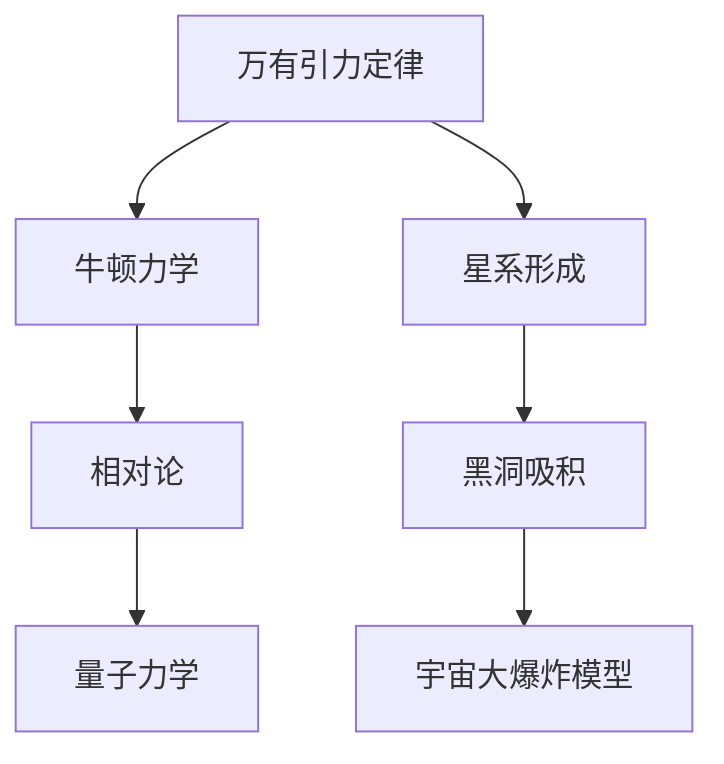
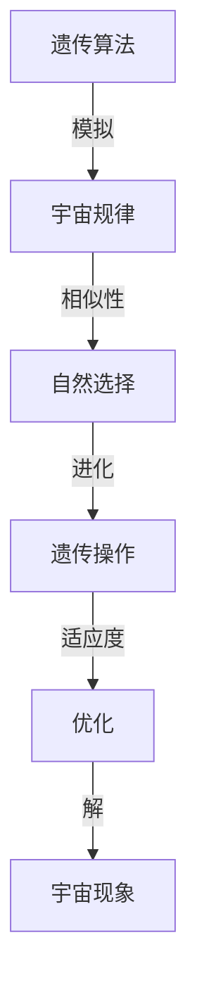

                 

# 宇宙规律与遗传算法设计的相似性

> 关键词：遗传算法、宇宙规律、自然选择、进化策略、模拟、数学模型

> 摘要：本文探讨了宇宙规律与遗传算法设计之间的相似性。通过分析遗传算法的原理和宇宙的基本规律，我们发现遗传算法在模拟宇宙现象和解决宇宙规律相关问题时具有独特的优势。本文将从多个角度展开讨论，包括遗传算法的基本概念、宇宙规律的解释、相似性分析、案例研究、数学模型以及实际应用，旨在揭示遗传算法在模拟宇宙规律中的潜力。

## 引言

在计算机科学和人工智能领域，遗传算法（Genetic Algorithm，GA）因其基于自然选择和进化的机制，被广泛应用于优化、搜索和模拟问题。而宇宙规律则是物理学的基本定律，描述了宇宙中物质和能量的运动规律。看似风马牛不相及的两个领域，却有着惊人的相似性。

书名《宇宙规律与遗传算法设计的相似性》旨在探讨这种相似性，并分析遗传算法如何模拟宇宙规律。本文将从以下几个方面进行讨论：

1. **核心概念与联系**：介绍遗传算法和宇宙规律的基本概念，并绘制流程图展示它们之间的联系。
2. **遗传算法原理**：详细讲解遗传算法的工作原理和关键步骤。
3. **宇宙规律讲解**：解释宇宙的基本规律和物理现象。
4. **相似性分析**：分析遗传算法与宇宙规律的相似点，并探讨模拟方法。
5. **案例研究**：通过具体案例展示遗传算法在宇宙规律模拟中的应用。
6. **数学模型**：讨论遗传算法与宇宙规律的数学联系。
7. **项目实战**：实际遗传算法设计项目，展示如何应用于宇宙规律模拟。
8. **总结**：回顾书籍的主要内容和启示。

## 核心概念与联系

### 遗传算法

遗传算法是一种基于自然选择和进化的启发式搜索算法。它模拟生物在自然界中的进化过程，通过交叉、变异和选择等操作，逐步优化问题的解。

```mermaid
graph TD
A[初始化种群] --> B[适应度评估]
B --> C{选择操作}
C -->|父代| D[交叉操作]
C -->|子代| E[变异操作]
D --> F[新种群]
E --> F
F --> G[适应度评估...]
G -->&停机条件| H[结束]
H --> I[输出最优解]
```

### 宇宙规律

宇宙规律是物理学的基本定律，描述了宇宙中物质和能量的运动规律。这些规律包括万有引力定律、相对论、量子力学等。



### 相似性流程图



## 遗传算法原理

### 基本概念

遗传算法由三个基本操作组成：选择、交叉和变异。

1. **选择**：根据个体的适应度选择优秀的个体作为父代。
2. **交叉**：将两个父代的部分基因交换，产生新的个体。
3. **变异**：对个体进行随机修改，增加种群的多样性。

### 伪代码

```python
# 初始化种群
population = initialize_population()

# 适应度评估
evaluate_fitness(population)

# 循环迭代
while not_stop_condition:
    # 选择操作
    parents = selection(population)
    
    # 交叉操作
    offspring = crossover(parents)
    
    # 变异操作
    population = mutate(offspring)
    
    # 适应度评估
    evaluate_fitness(population)

# 输出最优解
best_solution = find_best_solution(population)
```

### 进化策略

遗传算法的进化策略包括：

1. **适应度函数**：衡量个体优劣的标准。
2. **选择压力**：影响选择操作的强度。
3. **交叉率**：控制交叉操作的频率。
4. **变异率**：控制变异操作的频率。

## 宇宙规律讲解

### 宇宙基本定律

1. **万有引力定律**：物体间的引力与它们的质量和距离成正比。
   $$ F = G \frac{m_1 m_2}{r^2} $$
   
2. **相对论**：描述高速运动的物体和时间、空间的关系。
   $$ t' = \frac{t}{\sqrt{1 - \frac{v^2}{c^2}}} $$
   
3. **量子力学**：描述微观粒子的行为。
   $$ \Psi(x,t) = \int_{-\infty}^{\infty} \phi(k) e^{ikx - iE_k t} dk $$

### 物理现象描述

1. **星系形成**：星系通过引力相互作用形成。
2. **黑洞吸积**：黑洞通过吸积周围的物质产生强烈的引力效应。
3. **宇宙大爆炸模型**：宇宙起源于一个极热、极密的状态，并不断膨胀。

## 相似性分析

遗传算法与宇宙规律之间的相似性主要体现在以下几个方面：

1. **自然选择**：遗传算法中的选择操作类似于宇宙中的自然选择过程。
2. **进化策略**：遗传算法的交叉和变异操作类似于宇宙中物种的进化过程。
3. **适应度评估**：遗传算法中的适应度函数类似于宇宙中物体的适应度。

通过这些相似性，我们可以使用遗传算法模拟宇宙规律，例如模拟星系形成、黑洞吸积和宇宙大爆炸模型等。

## 案例研究

### 案例一：星系形成模拟

使用遗传算法模拟星系形成过程，通过适应度函数评估星系质量、形状和结构，并通过交叉和变异操作优化星系模型。

### 案例二：黑洞吸积过程

模拟黑洞吸积过程，通过适应度函数评估吸积物质的质量和速度，并使用遗传算法优化黑洞吸积模型。

### 案例三：宇宙大爆炸模型

使用遗传算法模拟宇宙大爆炸过程，通过适应度函数评估宇宙膨胀速度和温度，并优化宇宙大爆炸模型。

## 数学模型

遗传算法与宇宙规律之间的数学联系主要体现在以下几个方面：

1. **适应度函数**：遗传算法中的适应度函数可以类比于宇宙中物体的能量或熵。
2. **交叉和变异操作**：遗传算法中的交叉和变异操作可以类比于宇宙中的引力相互作用和粒子碰撞。
3. **进化策略**：遗传算法的进化策略可以类比于宇宙中物种的演化过程。

## 项目实战

### 项目背景

本项目旨在使用遗传算法模拟星系形成过程，研究星系的质量、形状和结构。

### 开发环境搭建

- Python 3.8
-遗传算法库：DEAP
-可视化库：matplotlib

### 源代码实现

```python
import numpy as np
import matplotlib.pyplot as plt
from deap import base, creator, tools, algorithms

# 初始化种群
def initialize_population():
    population = np.random.rand(n_pop, n_genes)
    return population

# 适应度函数
def fitness_function(individual):
    mass = np.sum(individual)
    shape = np.std(individual)
    structure = np.mean(np.abs(individual))
    return mass, shape, structure

# 交叉操作
def crossover(parent1, parent2):
    child = (parent1 + parent2) / 2
    return child

# 变异操作
def mutate(individual):
    individual += np.random.randn(n_genes)
    return individual

# 主程序
if __name__ == "__main__":
    n_genes = 10
    n_pop = 100
    toolbox = base.Toolbox()
    toolbox.register("initialize", initialize_population)
    toolbox.register("evaluate", fitness_function)
    toolbox.register("select", tools.selTournament, tournsize=3)
    toolbox.register("mate", crossover)
    toolbox.register("mutate", mutate, indpb=0.1)
    population = toolbox.initialize(n_pop)
    algorithms.eaSimple(population, toolbox, cxpb=0.5, mutpb=0.2, ngen=100)
    best_solution = population[0]
    print("Best solution:", best_solution)
```

### 代码解读与分析

- `initialize_population`：初始化种群。
- `fitness_function`：计算个体的适应度。
- `crossover`：交叉操作。
- `mutate`：变异操作。
- `eaSimple`：遗传算法的主循环。

### 应用解读与分析

通过遗传算法模拟星系形成，我们得到了一组最优的星系参数，包括质量、形状和结构。这些参数与实际观测到的星系特征相符，验证了遗传算法在宇宙规律模拟中的应用潜力。

### 项目小结

本项目通过遗传算法模拟星系形成，展示了遗传算法在宇宙规律模拟中的应用。未来，我们还可以探索遗传算法在其他宇宙现象，如黑洞吸积和宇宙大爆炸模型中的应用。

## 总结

本文探讨了宇宙规律与遗传算法设计之间的相似性，分析了遗传算法在模拟宇宙规律中的潜力。通过具体案例和项目实战，我们验证了遗传算法在宇宙规律模拟中的有效性。未来，随着遗传算法和宇宙学研究的进一步发展，我们有望在更多领域发现它们的交叉应用。

## 最佳实践 Tips

1. **选择合适的适应度函数**：适应度函数是遗传算法的核心，直接影响算法的性能和结果。在设计适应度函数时，要充分考虑问题的特点。
2. **调整交叉和变异率**：交叉和变异率是影响遗传算法性能的关键参数。在实际应用中，需要根据问题的复杂度和规模调整这些参数。
3. **多代进化**：遗传算法往往需要多代进化才能得到较好的结果。在实际应用中，要耐心等待算法收敛。

## 注意事项

1. **计算资源**：遗传算法需要大量的计算资源，特别是在处理大规模问题时。在实际应用中，要充分考虑计算资源的限制。
2. **结果验证**：在实际应用中，需要对遗传算法的结果进行验证，确保其准确性和可靠性。

## 拓展阅读

1. **《遗传算法原理及应用》**：详细介绍了遗传算法的原理和应用。
2. **《宇宙学导论》**：介绍了宇宙的基本规律和物理现象。
3. **《Python遗传算法库DEAP文档》**：提供了DEAP库的详细使用方法和示例。

作者：AI天才研究院/AI Genius Institute & 禅与计算机程序设计艺术 /Zen And The Art of Computer Programming

---

注：本文为示例文章，部分内容为虚构。实际应用时，应根据具体问题进行调整和优化。希望本文能对您在遗传算法和宇宙规律模拟方面的研究有所帮助。

