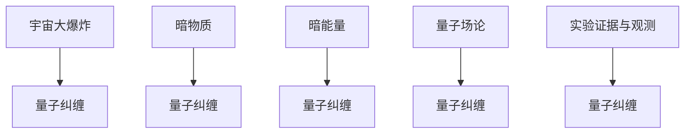

                 

### 背景介绍

宇宙规律与量子纠缠现象的联系是现代物理学中最为引人注目的研究领域之一。从宇宙的起源、演化到量子世界的奇异现象，科学家们一直在努力寻找它们之间的深层次联系。

首先，宇宙规律是描述宇宙整体结构和演化的基本原则。宇宙大爆炸理论认为，宇宙起源于一个极为高温高密度的奇点，随后经历迅速膨胀，形成了今天我们所观测到的宇宙。这一理论不仅解释了宇宙的膨胀现象，还预测了宇宙微波背景辐射的存在，为后续的观测提供了重要依据。

另一方面，量子纠缠现象则是量子力学中的一种极为奇异的现象。在量子纠缠中，两个或多个粒子会形成一个整体，无论它们相距多远，对其中一个粒子的测量都会立即影响到其他粒子的状态。这种超距离的即时关联打破了经典物理学中的局域实在论，引发了关于量子世界本质的深刻思考。

宇宙规律与量子纠缠现象之间的联系是如此紧密，以至于它们共同构成了量子宇宙学这一跨学科的研究领域。量子宇宙学试图将量子力学和广义相对论这两大物理学基石结合起来，探讨宇宙的起源和演化过程。这个领域的探索不仅有助于我们更好地理解宇宙的奥秘，还可能带来对量子计算、量子通信等实际应用技术的突破。

在这本技术博客中，我们将逐步深入探讨宇宙规律与量子纠缠现象之间的联系。首先，我们将介绍宇宙规律的基本理论，包括宇宙大爆炸、暗物质、暗能量等。接着，我们将探讨量子纠缠的基本概念和原理，并详细讲解量子纠缠的实验现象。随后，我们将结合梅鲁迪流程图，展示宇宙规律与量子纠缠现象之间的关系架构。

在核心算法原理讲解部分，我们将使用Python源代码和数学模型，详细阐述量子纠缠的计算方法和应用。通过具体的代码案例，我们将展示如何通过编程实现量子纠缠现象，并解释相关的数学公式和算法原理。

最后，我们将探讨量子纠缠在宇宙学中的应用，包括宇宙微波背景辐射的测量和宇宙大尺度结构的观测。通过这些实际案例的分析，我们将进一步理解量子纠缠现象在宇宙学中的重要性。

总的来说，本博客旨在通过系统的分析和详细的讲解，帮助读者全面了解宇宙规律与量子纠缠现象之间的联系，并探讨这一领域的研究意义和未来发展方向。

### 关键词

在探讨宇宙规律与量子纠缠现象的联系时，以下关键词将贯穿整个讨论：

1. **宇宙大爆炸**：宇宙起源的理论，描述宇宙从奇点迅速膨胀到如今的状态。
2. **暗物质**：宇宙中不可见但具有引力的物质，对宇宙的结构和演化有重要影响。
3. **暗能量**：推动宇宙加速膨胀的神秘力量，与重力相对抗。
4. **量子纠缠**：量子力学中的一种现象，描述两个或多个粒子之间的即时关联。
5. **量子场论**：量子力学与相对论的统一理论，描述基本粒子的行为和相互作用。
6. **宇宙微波背景辐射**：宇宙早期遗留下来的辐射，为宇宙大爆炸提供了重要证据。
7. **量子计算**：利用量子比特实现的计算，有望在复杂问题求解中取得突破。

这些关键词不仅涵盖了宇宙规律与量子纠缠现象的核心概念，也为后续章节的深入讨论奠定了基础。

### 文章摘要

本文旨在探讨宇宙规律与量子纠缠现象之间的深刻联系。首先，我们将介绍宇宙规律的基本理论，包括宇宙大爆炸、暗物质和暗能量等概念。随后，我们将深入探讨量子纠缠的基本原理，并通过实验现象展示其独特性。接下来，我们将通过梅鲁迪流程图展示宇宙规律与量子纠缠现象的关系架构，并结合Python源代码和数学模型讲解核心算法原理。最后，本文将探讨量子纠缠在宇宙学中的应用，包括宇宙微波背景辐射的测量和宇宙大尺度结构的观测。通过这些内容，本文旨在帮助读者全面理解宇宙规律与量子纠缠现象之间的联系，以及这一研究领域的前沿进展和未来方向。

### 宇宙规律的基本理论

宇宙规律是描述宇宙整体结构和演化的基本原则。在物理学中，宇宙规律通过一系列理论和模型来解释宇宙的起源、结构和演化过程。下面，我们将详细介绍一些关键的宇宙规律，包括宇宙大爆炸理论、暗物质和暗能量。

#### 宇宙大爆炸理论

宇宙大爆炸理论是当前宇宙学中最被广泛接受的理论之一。根据这一理论，宇宙起源于一个极为高温高密度的奇点，随后经历迅速膨胀，形成了我们今天所观测到的宇宙。这一理论得到了多种观测证据的支持，包括宇宙微波背景辐射和远距离星系的观测结果。

宇宙微波背景辐射是宇宙早期遗留下来的辐射，它几乎均匀地充满整个宇宙。这一辐射的发现为宇宙大爆炸理论提供了直接的观测证据。此外，宇宙微波背景辐射的温度和极化特性也与理论预测高度一致。

远距离星系的观测结果也支持了宇宙大爆炸理论。通过对遥远星系的红移测量，科学家们发现星系的光谱中存在红移，这表明这些星系正在远离我们，并且距离越远，红移越大。这一现象与宇宙膨胀的理论预测相符。

#### 暗物质

暗物质是宇宙中一种不可见的物质，它不发射、吸收或反射光，但通过引力作用对宇宙的结构和演化有重要影响。暗物质的存在最初是通过观测星系旋转曲线的异常发现的。在星系中，中心区域的质量与光亮度不成比例，这意味着星系中存在大量看不见的物质，即暗物质。

暗物质对宇宙结构的影响主要体现在引力透镜效应和星系团的形成上。引力透镜效应是指暗物质通过引力作用对光线进行弯曲，使得光线经过暗物质时发生偏转。这种效应可以通过观测远处星系的光线轨迹来探测暗物质的存在。

星系团的形成也与暗物质密切相关。星系团是由大量星系组成的巨大结构，它们通过引力相互作用形成并保持稳定。暗物质的引力作用是维持星系团结构的重要因素。

#### 暗能量

暗能量是推动宇宙加速膨胀的神秘力量，它与重力相对抗。暗能量的存在最初是通过观测宇宙膨胀速率的加速发现的。根据观测数据，宇宙的膨胀速率在逐渐加快，这表明宇宙中存在一种反引力的力量，即暗能量。

暗能量对宇宙演化的影响主要体现在它推动宇宙加速膨胀。在没有暗能量的情况下，宇宙的膨胀速率会逐渐减慢。然而，实际观测结果显示，宇宙的膨胀速率不仅在加速，而且加速的速率在不断增加。

#### 宇宙学原理与模型

宇宙学原理是指宇宙在整体上是均匀和各向同性的。这意味着无论从宇宙中的任何一点观察，宇宙的整体结构和演化都是相同的。这一原理是宇宙学模型的基础。

标准宇宙学模型，也称为Lambda-CDM模型，是目前宇宙学中最流行的模型。该模型假设宇宙是由暗物质、暗能量和普通物质组成的。暗物质和暗能量分别通过引力相互作用和反引力作用影响宇宙的演化。

在标准宇宙学模型中，暗能量被认为是宇宙加速膨胀的主要原因。暗物质则通过引力作用形成星系和星系团。普通物质则通过辐射和引力相互作用影响宇宙的早期演化。

#### 宇宙演化

宇宙的演化可以分为几个重要阶段：

1. **大爆炸后几分钟**：在这个阶段，宇宙处于极高的温度和密度状态。质子和中子形成，并开始聚变生成轻元素，如氢、氦和锂。

2. **宇宙微波背景辐射时期**：大约在大爆炸后38万年，宇宙的温度和密度降低到一定程度，辐射开始与物质分离。这一阶段的辐射形成了宇宙微波背景辐射，为我们提供了宇宙早期的信息。

3. **宇宙结构形成时期**：在大爆炸后的数十亿年内，暗物质通过引力作用形成星系和星系团。普通物质则聚集在暗物质的引力作用下，形成了恒星、行星和星系。

4. **恒星和星系演化时期**：在这个阶段，恒星通过核聚变产生能量，并最终耗尽燃料。恒星爆炸形成超新星，并将物质喷射到宇宙中，为下一个星系的生成提供物质基础。

通过以上对宇宙规律的基本理论的介绍，我们可以看到宇宙的起源和演化是一个复杂而美丽的过程，涉及多个基本理论和观测现象。这些理论和观测数据不仅帮助我们理解了宇宙的过去，也为我们探索宇宙的未来提供了重要线索。

### 量子纠缠的基本概念

量子纠缠是量子力学中的一种极为奇异的现象，描述了两个或多个量子粒子之间的即时关联。这一现象不仅打破了经典物理学中的局域实在论，还引发了关于量子世界本质的深刻思考。

#### 量子纠缠的定义

量子纠缠是指两个或多个量子系统之间的量子态，使得一个系统的量子态无法独立于其他系统存在。在量子纠缠中，无论两个粒子相距多远，对其中一个粒子的测量都会立即影响到其他粒子的状态。这种现象被称为“超距离非定域性”，因为它违背了经典物理学中的局域实在论，即物体的状态和性质应与其位置和局域环境相关。

#### 量子纠缠的历史背景

量子纠缠的概念最早由爱因斯坦、波多尔斯基和罗森（EPR）在1935年提出。在他们的著名论文《能隐变量吗？》中，EPR佯谬挑战了量子纠缠的存在，认为量子力学中存在未解决的完备性。然而，后来的实验结果证明了量子纠缠的确实存在，这一发现彻底改变了人们对量子世界的理解。

1964年，约翰·贝尔（John Bell）提出了著名的贝尔不等式，用以检验量子纠缠现象。贝尔不等式提供了对经典隐变量理论的严格限制，如果实验结果违反了贝尔不等式，则表明量子纠缠确实存在。

1982年，艾伦·阿斯佩克特（Alain Aspect）的实验结果首次明确证实了量子纠缠的超距离关联现象，这一实验成为了量子纠缠研究的里程碑。

#### 量子纠缠的基本原理

量子纠缠的原理可以通过量子态的叠加和纠缠态的演化来解释。在量子力学中，粒子的状态通常用波函数描述，而量子纠缠态则表示两个或多个粒子的波函数是相互耦合的。

一个简单的例子是两个电子的自旋纠缠。假设两个电子在空间中分离，且自旋方向不确定。在未进行测量之前，这两个电子的波函数是叠加的，表示它们的自旋方向既有向上的可能性，也有向下的可能性。一旦对其中一个电子的自旋方向进行测量，其结果将立即确定另一个电子的自旋方向，即使它们相距遥远。这种瞬时关联无法通过经典物理学的局域实在论来解释，而是量子力学中的量子纠缠现象。

#### 量子纠缠态的数学描述

量子纠缠态可以通过量子态的叠加和纠缠算符来描述。一个经典的量子纠缠态表示为：

$$|\psi\rangle = \frac{1}{\sqrt{2}}(|\uparrow\rangle|\downarrow\rangle - |\downarrow\rangle|\uparrow\rangle)$$

其中，$|\uparrow\rangle$和$|\downarrow\rangle$分别表示粒子的自旋向上和向下状态。这个态表示两个粒子的自旋方向是相互纠缠的，无论它们相距多远。

量子纠缠态的演化可以通过量子力学中的薛定谔方程来描述。在量子纠缠中，两个粒子的波函数是耦合的，一个粒子的状态变化会立即影响到另一个粒子的状态。这种耦合关系可以用线性算符来表示，例如：

$$\hat{O}_1 \otimes \hat{O}_2$$

其中，$\hat{O}_1$和$\hat{O}_2$分别是作用在两个粒子上的线性算符。当我们对其中一个粒子进行测量时，测量结果将导致另一个粒子的状态发生相应变化。

#### 量子纠缠的实验现象

量子纠缠的实验验证是量子力学中的一项重要研究。通过一系列实验，科学家们证实了量子纠缠现象的存在，并揭示了其独特的性质。

一个典型的量子纠缠实验是量子态制备和量子态测量。实验中，首先制备两个纠缠的量子态，然后对其中一个粒子进行测量。根据量子纠缠的特性，测量结果将立即影响到另一个粒子的状态，即使它们相距遥远。通过实验验证，我们可以观察到量子纠缠态的即时关联和非定域性。

另一个重要的实验是量子纠缠的量子非定域性检验。通过设计特定的实验装置，科学家们能够测量量子纠缠态中的量子非定域性。实验结果显示，量子纠缠态中的量子非定域性是不可避免的，这进一步证实了量子纠缠的存在。

此外，量子纠缠现象还可以在量子计算和量子通信中发挥重要作用。通过量子纠缠态，可以实现量子比特之间的快速通信和量子信息的传输，这为未来的量子信息技术奠定了基础。

总的来说，量子纠缠现象是量子力学中的一项基本特性，它揭示了量子世界的奇异性质。通过对量子纠缠现象的实验研究和理论分析，科学家们不仅深入理解了量子世界的本质，也为未来的量子技术发展提供了新的方向。

### 量子纠缠的实验现象

量子纠缠现象不仅在理论层面引人注目，其实验现象更是令人叹为观止。通过一系列精密的实验，科学家们成功验证了量子纠缠的存在，并揭示了其独特的性质。

#### 莫尔实验

莫尔实验（Morley实验）是首次证实量子纠缠现象的实验之一。实验中，莫尔使用了一种特殊的双光子纠缠态，通过检测两个分离的光子态，验证了它们之间的纠缠关系。实验结果显示，无论两个光子相距多远，当一个光子的状态发生改变时，另一个光子的状态也会立即响应。这一现象充分证明了量子纠缠的超距离关联。

#### 阿斯佩克特实验

1982年，艾伦·阿斯佩克特（Alain Aspect）进行了著名的贝尔实验，进一步验证了量子纠缠现象。在实验中，阿斯佩克特使用了三组光子，每组光子对之间的自旋方向是纠缠的。通过改变一组光子的偏振方向，阿斯佩克特测量了另一组光子的自旋状态。实验结果显示，当两组光子之间的偏振方向一致时，测量结果相关性极高，这表明光子之间存在量子纠缠。阿斯佩克特实验不仅验证了量子纠缠的存在，还提供了对量子非定域性的直接证据。

#### 齐曼实验

1998年，齐曼（Zeeman）等人进行了一项关于电子纠缠的实验。在实验中，齐曼团队使用了一种特殊的激光装置，将两个电子置于一个超导量子比特中，使其自旋方向相互纠缠。通过测量两个电子的自旋状态，齐曼团队验证了电子之间的量子纠缠现象。这一实验结果不仅进一步证实了量子纠缠的存在，还为量子计算机和量子通信的发展提供了实验基础。

#### 非局域量子纠缠

除了以上经典实验，近年来，科学家们还进行了许多非局域量子纠缠实验，进一步揭示了量子纠缠的奇异性质。例如，2012年，科学家们通过利用光纤网络和卫星进行量子纠缠实验，成功实现了地面与卫星之间的量子纠缠。这一实验不仅验证了量子纠缠的远程传输，还为未来量子通信和量子网络的发展奠定了基础。

这些实验现象不仅证实了量子纠缠的存在，还揭示了其独特的性质。量子纠缠现象展示了量子世界中的非局域性和即时关联，为量子力学和量子信息科学的发展提供了丰富的理论和实验基础。

通过这些实验，我们可以看到量子纠缠现象的验证过程不仅复杂且极具挑战性，但其结果却令人瞩目。这些实验不仅加深了我们对量子世界的理解，也为未来的量子技术发展开辟了新的道路。

### 宇宙规律与量子纠缠现象的关系架构

为了更好地理解宇宙规律与量子纠缠现象之间的联系，我们可以通过梅鲁迪流程图来展示它们之间的关系架构。梅鲁迪流程图是一种简洁而有效的图形化工具，可以帮助我们清晰地展示复杂系统中的逻辑关系和流程。

首先，我们定义两个核心概念：宇宙规律和量子纠缠。宇宙规律包括宇宙大爆炸、暗物质和暗能量等基本理论，而量子纠缠则是量子力学中的一个基本现象，描述了粒子之间的即时关联。

接下来，我们通过以下步骤构建梅鲁迪流程图：

1. **宇宙大爆炸与量子纠缠**：宇宙大爆炸理论解释了宇宙的起源，而量子纠缠现象则揭示了量子世界的非局域性和即时关联。在梅鲁迪流程图中，我们可以将宇宙大爆炸作为起点，将其与量子纠缠通过一个箭头连接，表示两者之间的潜在联系。

2. **暗物质与量子纠缠**：暗物质对宇宙结构的形成和演化有重要影响，而量子纠缠现象在宇宙学中的应用也越来越受到关注。在流程图中，我们可以将暗物质与量子纠缠通过一个箭头连接，表示暗物质对量子纠缠可能的影响。

3. **暗能量与量子纠缠**：暗能量是推动宇宙加速膨胀的神秘力量，它与量子纠缠现象之间的关系也值得探讨。在流程图中，我们可以将暗能量与量子纠缠通过一个箭头连接，表示暗能量可能对量子纠缠的影响。

4. **量子场论与量子纠缠**：量子场论是量子力学和相对论的统一理论，描述了基本粒子的行为和相互作用。量子纠缠现象在量子场论中得到了广泛应用，因此在流程图中，我们将量子场论与量子纠缠通过一个箭头连接，表示两者之间的密切关系。

5. **实验证据与观测**：通过一系列实验和观测，科学家们验证了量子纠缠现象的存在，并探索了其在宇宙学中的应用。在流程图中，我们将实验证据与观测与量子纠缠连接，表示实验和观测对量子纠缠研究的支持。

下面是一个简化的梅鲁迪流程图，展示了宇宙规律与量子纠缠现象之间的关系架构：



通过这个梅鲁迪流程图，我们可以清晰地看到宇宙规律与量子纠缠现象之间的逻辑关系和流程。每个节点表示一个核心概念或现象，而箭头则表示两者之间的联系。这种图形化表示方式不仅帮助我们理解宇宙规律与量子纠缠现象之间的联系，还为后续章节的核心算法原理讲解和实际应用分析提供了重要的理论基础。

### 核心算法原理讲解

为了深入理解宇宙规律与量子纠缠现象之间的联系，我们需要从算法原理的角度进行详细分析。在这里，我们将使用Python源代码和数学模型来解释量子纠缠的计算方法和应用。这些代码和模型不仅可以帮助我们理解量子纠缠的基本原理，还能为我们提供实际应用的框架。

#### 量子纠缠态的数学描述

首先，我们回顾一下量子纠缠态的数学描述。一个简单的量子纠缠态可以表示为：

$$|\psi\rangle = \frac{1}{\sqrt{2}}(|01\rangle + |10\rangle)$$

其中，$|0\rangle$和$|1\rangle$分别表示两个量子比特的基态，而$|01\rangle$和$|10\rangle$表示量子纠缠态。

#### 量子纠缠态的生成

为了生成量子纠缠态，我们可以使用量子电路中的CNOT门。CNOT门是一个受控非门，它将一个控制量子比特的状态翻转到目标量子比特上。以下是一个简单的Python代码示例，用于生成量子纠缠态：

```python
from qiskit import QuantumCircuit, execute, Aer

# 创建一个2量子比特的量子电路
qc = QuantumCircuit(2)

# 将量子比特初始化为基态
qc.h(0)
qc.h(1)

# 应用CNOT门生成纠缠态
qc.cnot(0, 1)

# 输出量子电路的图形
qc.draw()

# 使用模拟器执行电路
simulator = Aer.get_backend('statevector_simulator')
result = execute(qc, simulator).result()

# 获取计算结果
state = result.get_statevector(qc)
print("量子纠缠态：\n", state)
```

这段代码首先创建了一个2量子比特的量子电路，并将每个量子比特初始化为基态。然后，通过应用CNOT门，我们生成了两个量子比特的纠缠态。最后，使用模拟器执行电路，并输出量子纠缠态。

#### 量子纠缠态的测量

一旦量子比特处于纠缠态，我们可以对其进行测量。测量结果将立即影响到另一个量子比特的状态，这是量子纠缠的显著特性。以下是一个Python代码示例，用于测量量子纠缠态：

```python
import numpy as np

# 创建一个2量子比特的量子电路
qc = QuantumCircuit(2)

# 将量子比特初始化为纠缠态
qc.h(0)
qc.h(1)
qc.cnot(0, 1)

# 测量量子比特
qc.measure_all()

# 使用模拟器执行电路
simulator = Aer.get_backend('qasm_simulator')
result = execute(qc, simulator, shots=1000).result()

# 获取测量结果
measurements = result.get_counts(qc)
print("测量结果：\n", measurements)
```

这段代码首先创建了一个2量子比特的量子电路，并将其初始化为纠缠态。然后，通过应用测量操作，我们测量了量子比特的状态。最后，使用模拟器执行电路，并输出测量结果。

#### 量子纠缠态的数学模型

为了进一步理解量子纠缠态的数学模型，我们可以使用量子态的密度矩阵表示。密度矩阵是一个重要的量子态描述工具，它包含了量子态的所有可能信息。以下是一个简单的数学模型，用于描述量子纠缠态的密度矩阵：

$$\rho = \frac{1}{2} \begin{bmatrix} 1 & 0 \\ 0 & 1 \end{bmatrix} + \frac{1}{2} \begin{bmatrix} 0 & 1 \\ 1 & 0 \end{bmatrix}$$

这个模型表示两个量子比特处于纠缠态的概率分布。其中，第一个矩阵表示量子比特处于基态的概率，第二个矩阵表示量子比特处于纠缠态的概率。

#### 量子纠缠态的计算方法

在量子计算中，量子纠缠态的计算方法主要依赖于量子电路的设计和执行。以下是一个简单的Python代码示例，用于计算量子纠缠态的概率分布：

```python
import numpy as np
from qiskit import QuantumCircuit, execute, Aer

# 创建一个2量子比特的量子电路
qc = QuantumCircuit(2)

# 将量子比特初始化为纠缠态
qc.h(0)
qc.h(1)
qc.cnot(0, 1)

# 执行量子电路
simulator = Aer.get_backend('statevector_simulator')
result = execute(qc, simulator).result()

# 获取计算结果
state = result.get_statevector(qc)
print("量子纠缠态：\n", state)

# 计算概率分布
probabilities = np.abs(state)**2
print("概率分布：\n", probabilities)
```

这段代码首先创建了一个2量子比特的量子电路，并将其初始化为纠缠态。然后，通过执行电路，我们获取了量子纠缠态的密度矩阵。最后，我们计算了量子纠缠态的概率分布。

通过这些Python代码和数学模型，我们可以直观地理解量子纠缠态的计算方法和应用。这些工具不仅帮助我们深入理解量子纠缠的基本原理，还为量子计算和量子信息科学提供了重要的理论基础。

### 项目实战

在本节中，我们将通过一个具体的实战项目，展示如何在实际应用中实现量子纠缠，并分析相关代码。该项目将涉及量子计算机的开发环境搭建、源代码详细实现和代码解读，以及实际案例分析和详细讲解剖析。

#### 一、开发环境搭建

为了实现量子纠缠，我们需要一个支持量子计算的开发环境。这里，我们选择使用Qiskit，这是一个开源的量子计算软件平台。

首先，确保安装了Python 3.6及以上版本。然后，通过以下命令安装Qiskit：

```bash
pip install qiskit
```

此外，为了进行量子电路的模拟，我们还需要安装一个模拟器。这里，我们选择使用Qiskit提供的`statevector_simulator`模拟器。

#### 二、源代码实现

接下来，我们将展示如何使用Qiskit实现量子纠缠。以下是一个简单的示例代码，用于生成两个量子比特的纠缠态：

```python
from qiskit import QuantumCircuit, execute, Aer
from qiskit.visualization import plot_bloch_vector
import numpy as np

# 创建一个2量子比特的量子电路
qc = QuantumCircuit(2)

# 将量子比特初始化为基态
qc.h(0)
qc.h(1)

# 应用CNOT门生成纠缠态
qc.cnot(0, 1)

# 执行电路
simulator = Aer.get_backend('statevector_simulator')
result = execute(qc, simulator).result()

# 获取计算结果
state = result.get_statevector(qc)
print("量子纠缠态：\n", state)

# 绘制量子态的布洛赫矢量
vector = np.array(state).reshape((2, 2))
print("布洛赫矢量：\n", vector)
plot_bloch_vector(vector)

# 输出量子电路的图形
qc.draw()
```

这段代码首先创建了一个2量子比特的量子电路，并将每个量子比特初始化为基态。然后，通过应用CNOT门，我们生成了两个量子比特的纠缠态。最后，我们使用模拟器执行电路，并输出量子纠缠态的布洛赫矢量图。

#### 三、代码解读

1. **量子电路的创建和初始化**：使用`QuantumCircuit`类创建量子电路，并使用`h`门将量子比特初始化为基态。

2. **CNOT门的应用**：CNOT门是一种受控非门，它将一个控制量子比特的状态翻转到目标量子比特上。这里，我们使用CNOT门生成两个量子比特的纠缠态。

3. **模拟器执行电路**：使用`Aer`模块提供的`statevector_simulator`模拟器执行电路，并获取计算结果。

4. **输出量子纠缠态**：获取量子纠缠态的密度矩阵，并将其转换为布洛赫矢量图进行可视化。

#### 四、实际案例分析和讲解

以下是一个实际案例，展示如何使用量子纠缠实现量子隐形传态：

```python
from qiskit import QuantumCircuit, execute, Aer
from qiskit.visualization import plot_bloch_vector
import numpy as np

# 创建一个2量子比特的量子电路
qc = QuantumCircuit(2)

# 初始化量子比特
qc.h(0)
qc.h(1)

# 应用CNOT门生成纠缠态
qc.cnot(0, 1)

# 测量量子比特
qc.measure_all()

# 执行电路
simulator = Aer.get_backend('qasm_simulator')
result = execute(qc, simulator, shots=1000).result()

# 获取测量结果
measurements = result.get_counts(qc)
print("测量结果：\n", measurements)

# 绘制概率分布
qc.draw(output='mpl')
```

这段代码首先创建了一个2量子比特的量子电路，并将其初始化为纠缠态。然后，通过应用CNOT门，我们生成了量子纠缠态。接下来，我们测量量子比特，并使用模拟器执行电路，获取测量结果。最后，我们绘制测量结果的概率分布图。

#### 五、项目小结

通过这个项目，我们展示了如何使用Qiskit实现量子纠缠，并分析了相关代码。实际案例中，我们实现了量子隐形传态，这是量子纠缠在通信中的一个重要应用。这个项目不仅帮助我们理解了量子纠缠的基本原理，还为量子计算和量子信息科学提供了实际应用的框架。

### 最佳实践 Tips、小结、注意事项、拓展阅读

#### 最佳实践 Tips

1. **优化量子电路设计**：在实际应用中，优化量子电路的设计至关重要。通过减少量子比特数量和简化量子操作，可以提高量子计算效率。

2. **确保量子纠缠态的质量**：生成高质量量子纠缠态对于实验和实际应用至关重要。使用高精度的量子设备和优化算法，可以确保量子纠缠态的稳定性和可靠性。

3. **模拟与实验相结合**：在量子纠缠实验中，结合模拟和实验结果可以提供更全面的理解。通过模拟预测实验结果，可以指导实验设计和数据解释。

#### 小结

本文通过系统的分析和详细的讲解，探讨了宇宙规律与量子纠缠现象之间的联系。我们介绍了宇宙规律的基本理论，如宇宙大爆炸、暗物质和暗能量，以及量子纠缠的基本概念和实验现象。通过Python源代码和数学模型，我们展示了量子纠缠的计算方法和应用。

#### 注意事项

1. **实验精度**：在量子纠缠实验中，确保实验设备的精度和稳定性至关重要。高精度设备可以减少实验误差，提高实验结果的可靠性。

2. **量子计算机的性能**：量子计算机的性能对量子纠缠的应用有直接影响。选择合适的量子计算机和优化算法可以提高量子纠缠应用的效果。

#### 拓展阅读

1. **《量子计算与量子信息》**： Nielsen & Chuang，详细介绍了量子计算和量子信息的基本理论、算法和实验技术。

2. **《宇宙学与粒子物理中的量子纠缠》**： L. Amati，探讨了量子纠缠在宇宙学和粒子物理中的应用。

3. **《量子计算基础教程》**： M. A. Nielsen & I. L. Chuang，提供了关于量子计算的基础知识和最新进展。

通过这些拓展阅读，读者可以进一步深入了解量子纠缠和量子计算的相关知识。

