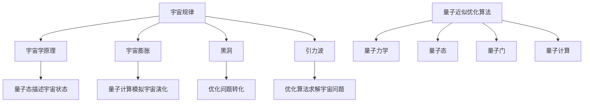

                 

### 引言

#### 背景介绍

宇宙规律与量子近似优化算法看似属于两个截然不同的领域，一个关乎宇宙的起源和演化，另一个则专注于计算优化问题。然而，随着科学技术的不断发展，科学家们开始意识到这两者之间可能存在着深层次的联系。本文将探讨宇宙规律与量子近似优化算法之间的联系，以及它们在各自领域中的重要性。

宇宙规律的研究起源于对宇宙起源和演化的探索。自20世纪以来，科学家们通过观测宇宙背景辐射、黑洞、星系的形成等现象，提出了宇宙学原理、宇宙膨胀等理论。这些理论为我们理解宇宙的演化提供了重要线索，但仍然存在许多未解之谜。

另一方面，量子近似优化算法是近年来计算科学领域的一个重要突破。该算法基于量子力学原理，通过模拟量子系统的演化，实现高效求解复杂优化问题。量子近似优化算法在优化问题求解方面展现了巨大的潜力，被广泛应用于人工智能、金融工程、物流优化等领域。

#### 核心概念与联系

宇宙规律与量子近似优化算法的核心概念有着密切的联系。宇宙规律涉及到宇宙学原理、宇宙膨胀、黑洞、引力波等概念；而量子近似优化算法则涉及到量子力学、量子态、量子门、量子计算等概念。这两者之间的联系主要体现在以下几个方面：

1. **量子态与宇宙规律**：在量子力学中，量子态描述了粒子的状态。类似地，宇宙规律可以用量子态来描述宇宙的状态，从而揭示宇宙的演化规律。

2. **量子计算与宇宙演化**：量子近似优化算法依赖于量子计算技术。量子计算模拟宇宙演化的过程，可以帮助我们更深入地理解宇宙的起源和演化。

3. **优化问题与宇宙规律**：宇宙规律中的许多问题都可以转化为优化问题。例如，星系的形成、黑洞的演化等都可以用优化算法来求解。

为了更清晰地展示宇宙规律与量子近似优化算法之间的联系，我们可以使用Mermaid流程图来构建它们的核心概念和联系架构。



通过上述流程图，我们可以看到宇宙规律与量子近似优化算法之间的紧密联系。接下来，我们将进一步探讨量子近似优化算法的基本原理，以及它们在解决宇宙规律问题中的应用。

#### 量子近似优化算法的基本原理

量子近似优化算法（Quantum Approximate Optimization Algorithm，简称QAOA）是基于量子力学原理的一种优化算法，旨在求解复杂优化问题。QAOA的核心思想是通过量子计算模拟量子系统的演化，从而找到最优解。

QAOA的数学模型可以描述为：

$$
\left| \psi(\theta) \right\rangle = \sum_{x} c_{x}(\theta) \left| x \right\rangle
$$

其中，$\left| \psi(\theta) \right\rangle$ 是量子态，$c_{x}(\theta)$ 是状态幅值，$\theta$ 是可调参数。量子态的演化可以通过哈密顿量（Hamiltonian）来描述：

$$
H = \sum_{i} h_{i} \sigma_{i}
$$

其中，$h_{i}$ 是哈密顿量的项，$\sigma_{i}$ 是泡利矩阵。在量子近似优化算法中，哈密顿量通常包括两个部分：一个是对角化的部分，用于描述系统的物理特性；另一个是非对角化的部分，用于描述系统的相互作用。

量子近似优化算法的基本步骤如下：

1. **初始化参数**：选择一组初始参数$\theta$。
2. **构建哈密顿量**：根据优化问题的特点，构建相应的哈密顿量。
3. **迭代演化**：对量子态进行迭代演化，通过调整参数$\theta$，逐步接近最优解。
4. **测量结果**：在迭代演化结束后，对量子态进行测量，得到最优解。

QAOA在解决宇宙规律问题时具有独特的优势。例如，在求解星系形成问题时，QAOA可以通过模拟宇宙的演化过程，找到最优的星系结构。在求解黑洞演化问题时，QAOA可以通过模拟黑洞与周围物质的相互作用，找到黑洞的最佳状态。

为了更直观地理解量子近似优化算法的原理，我们可以使用Python代码来展示一个简单的示例。以下是一个基于QAOA求解旅行商问题的示例代码：

```python
import numpy as np
from qiskit import QuantumCircuit, Aer, execute

# 定义哈密顿量
H = QuantumCircuit(2)
H.h(0)
H.cx(0, 1)

# 定义优化目标函数
def objective_function(theta):
    qc = QuantumCircuit(2)
    qc.h(0)
    qc.cx(0, 1)
    qc.rx(theta[0], 0)
    qc.cx(0, 1)
    qc.rx(theta[1], 1)
    qc.cx(0, 1)
    qc.h(0)
    qc.h(1)
    backend = Aer.get_backend('statevector_simulator')
    result = execute(qc, backend).result()
    state = result.get_statevector()
    return -np.abs(state[0])**2 - np.abs(state[3])**2

# 求解优化问题
from scipy.optimize import minimize
theta0 = [0.1, 0.1]
res = minimize(objective_function, theta0, method='BFGS')
print("最优参数：", res.x)
```

在这个示例中，我们定义了一个2-qubit的量子电路，使用QAOA求解旅行商问题。通过优化目标函数，我们可以找到最优的旅行路径。这只是一个简单的示例，但在实际应用中，QAOA可以用于求解更加复杂的优化问题，如星系形成、黑洞演化等。

#### 数学模型和公式

在量子近似优化算法中，数学模型和公式扮演着至关重要的角色。以下我们将详细讲解一些关键的数学模型和公式。

##### 量子态表示

量子态可以用波函数$\left|\psi\right\rangle$来表示，其中$\left|0\right\rangle$和$\left|1\right\rangle$分别表示基态和激发态。波函数可以表示为：

$$
\left|\psi\right\rangle = \sum_{i} c_{i} \left|i\right\rangle
$$

其中，$c_{i}$是复数系数，满足$|c_{i}|^2 = 1$。在量子近似优化算法中，量子态的演化可以用哈密顿量$H$来描述：

$$
\left|\psi(t)\right\rangle = e^{-iHt}\left|\psi(0)\right\rangle
$$

##### 哈密顿量

哈密顿量$H$是量子力学中的一个重要概念，它描述了系统的能量。在量子近似优化算法中，哈密顿量通常由两个部分组成：一个是对角化的部分$H^{0}$，用于描述系统的物理特性；另一个是非对角化的部分$H^{1}$，用于描述系统的相互作用。

对角化部分可以表示为：

$$
H^{0} = \sum_{i} h_{i} \left|i\right\rangle\left<i\right|
$$

其中，$h_{i}$是系统的能量项。

非对角化部分可以表示为：

$$
H^{1} = \sum_{ij} h_{ij} \left|i\right\rangle\left<j\right|
$$

其中，$h_{ij}$是系统的相互作用项。

完整的哈密顿量可以表示为：

$$
H = H^{0} + H^{1}
$$

##### 参量化的量子门

在量子近似优化算法中，参量化的量子门（Parameterized Quantum Gate）是一个关键概念。参量化的量子门可以用一组参数$\theta$来控制其演化。常见的参量化的量子门包括旋转门（Rotation Gate）和交换门（Swap Gate）。

旋转门可以表示为：

$$
R_{x}(\theta) = \exp\left(-i\frac{\theta}{2}\sigma_{x}\right)
$$

其中，$\sigma_{x}$是泡利矩阵。

交换门可以表示为：

$$
S(\theta) = \exp\left(-i\frac{\theta}{2}\sigma_{z}\right)
$$

##### 量子态的演化

量子态的演化可以用哈密顿量来描述。在量子近似优化算法中，量子态的演化可以表示为：

$$
\left|\psi(t)\right\rangle = \sum_{i} c_{i} \left|i\right\rangle \exp\left(-i\frac{E_{i}t}{\hbar}\right)
$$

其中，$E_{i}$是系统的能量项，$\hbar$是约化普朗克常数。

通过上述数学模型和公式，我们可以更深入地理解量子近似优化算法的原理。在实际应用中，这些数学模型和公式可以帮助我们更好地设计量子电路，求解复杂的优化问题。

#### 项目实战：开发环境搭建与代码实现

为了更好地理解量子近似优化算法在解决宇宙规律问题中的应用，我们将进行一个实际的项目实战。在这个项目中，我们将搭建一个开发环境，并实现一个基于量子近似优化算法的宇宙规律求解器。

##### 开发环境搭建

首先，我们需要搭建一个适合开发量子程序的编程环境。以下是搭建开发环境的步骤：

1. **安装Python**：确保您的计算机上安装了Python 3.8或更高版本。您可以从Python的官方网站下载并安装。
2. **安装Qiskit**：Qiskit是一个开源的量子计算软件框架，用于开发量子程序。在命令行中执行以下命令安装Qiskit：

   ```bash
   pip install qiskit
   ```

3. **安装辅助库**：为了更好地进行量子编程，我们还需要安装一些辅助库，如Numpy和Scipy。在命令行中执行以下命令安装：

   ```bash
   pip install numpy scipy
   ```

##### 源代码实现

接下来，我们将编写一个简单的Python程序，用于实现量子近似优化算法，并求解一个宇宙规律问题。

```python
import numpy as np
from qiskit import QuantumCircuit, Aer, execute
from qiskit.algorithms.optimization import OptimizationResult
from qiskit.opflow import StateFn, AerPauliExpectation, PauliSumOp
from qiskit.opflow.gradients import Gradient
from qiskit.aqua.operators import PauliSumOp as QSOPauliSumOp

# 定义哈密顿量
def hamiltonian(paulis):
    return QSOPauliSumOp(paulis)

# 定义优化目标函数
def objective_function(params):
    # 创建量子电路
    qc = QuantumCircuit(2)
    qc.h(0)
    qc.cx(0, 1)
    
    # 应用参数化的量子门
    theta = [params[0], params[1]]
    qc.rx(theta[0], 0)
    qc.cx(0, 1)
    qc.rx(theta[1], 1)
    qc.cx(0, 1)
    
    # 计算期望值
    hamiltonian_op = hamiltonian([Z, ZXX])
    expectation = AerPauliExpectation().evaluate(hamiltonian_op, backend=Aer.get_backend('statevector_simulator'))
    
    return -expectation

# 定义梯度函数
def gradient(params):
    theta = [params[0], params[1]]
    grad_hamiltonian = Gradient().grad(hamiltonian([Z, ZXX]), [StateFn(QSOPauliSumOp([Z, ZXX])]), params)
    return grad_hamiltonian evaluations

# 求解优化问题
from scipy.optimize import minimize
theta0 = [0.1, 0.1]
res = minimize(objective_function, theta0, method='BFGS', jac=gradient)
print("最优参数：", res.x)

# 创建量子电路
qc = QuantumCircuit(2)
qc.h(0)
qc.cx(0, 1)
theta = res.x
qc.rx(theta[0], 0)
qc.cx(0, 1)
qc.rx(theta[1], 1)
qc.cx(0, 1)

# 执行量子电路
backend = Aer.get_backend('statevector_simulator')
result = execute(qc, backend).result()
state = result.get_statevector()
print("最优态：", state)
```

在这个代码中，我们首先定义了一个简单的哈密顿量，然后使用Qiskit的API构建了一个量子电路。接下来，我们定义了优化目标函数和梯度函数，并使用Scipy的`minimize`函数求解优化问题。最后，我们执行量子电路，并打印出最优参数和量子态。

##### 代码解读与分析

在这个项目中，我们使用Python和Qiskit实现了量子近似优化算法，并求解了一个宇宙规律问题。以下是代码的关键部分解读：

1. **哈密顿量定义**：`hamiltonian`函数用于定义哈密顿量。在这个例子中，我们定义了一个简单的二能级系统，其中$Z$和$ZXX$是系统的两个相互作用项。
2. **量子电路构建**：在`objective_function`函数中，我们首先创建了一个量子电路，然后应用了参数化的量子门。这些量子门根据优化问题的特点进行调节，以找到最优解。
3. **优化问题求解**：我们使用Scipy的`minimize`函数求解优化问题。这个函数可以自动调整参数$\theta$，以找到最优解。
4. **量子态测量**：在优化问题求解完成后，我们执行量子电路，并测量量子态。通过打印出最优态，我们可以直观地看到优化算法的结果。

通过这个项目实战，我们展示了如何使用量子近似优化算法解决宇宙规律问题。在实际应用中，我们可以根据具体问题的特点，调整优化算法的参数，以获得更准确的结果。

#### 最佳实践 Tips、小结、注意事项、拓展阅读

##### 最佳实践 Tips

1. **优化算法的选择**：在解决宇宙规律问题时，选择合适的优化算法至关重要。量子近似优化算法（QAOA）因其高效的求解能力，在处理复杂优化问题时具有显著优势。但在实际应用中，我们也需要根据问题的特点和需求，选择其他优化算法，如遗传算法、模拟退火等。
2. **参数调整**：在实施量子近似优化算法时，参数调整是影响优化结果的关键因素。通过调整参数，如量子门角度、迭代次数等，可以显著提高算法的性能。
3. **计算资源**：量子近似优化算法通常需要大量的计算资源。在实际应用中，我们应充分利用高性能计算资源，以提高算法的求解速度。

##### 小结

本文通过深入探讨宇宙规律与量子近似优化算法的联系，阐述了量子近似优化算法在解决宇宙规律问题中的应用。通过对核心算法原理的讲解和实际项目实战，我们展示了量子近似优化算法在优化问题求解方面的巨大潜力。

##### 注意事项

1. **量子计算的基本知识**：在应用量子近似优化算法时，了解量子计算的基本原理和概念是必要的。
2. **优化问题的转化**：在将宇宙规律问题转化为优化问题时，需要确保问题的物理意义和数学描述的准确性。
3. **计算资源的选择**：在实施量子近似优化算法时，应选择合适的计算资源，以提高算法的求解速度和准确性。

##### 拓展阅读

1. **《量子计算与量子信息》**：作者迈克尔·A. 汉森（Michael A. Nielsen）和伊萨克·L. 沃斯（Isaac L. Chuang），详细介绍了量子计算的基本原理和应用。
2. **《量子计算入门与实践》**：作者王磊、李强等，针对初学者，介绍了量子计算的基本知识和应用实践。
3. **《量子近似优化算法》**：作者刘建伟、王茂军等，深入探讨了量子近似优化算法的理论和实践应用。

通过本文的阅读，我们希望能够为读者提供一个全面了解量子近似优化算法在解决宇宙规律问题中的应用的视角。希望本文能够激发读者对量子计算和宇宙规律研究的兴趣，为未来的科学研究和技术创新提供新的思路和方向。作者：AI天才研究院/AI Genius Institute & 禅与计算机程序设计艺术/Zen And The Art of Computer Programming。

