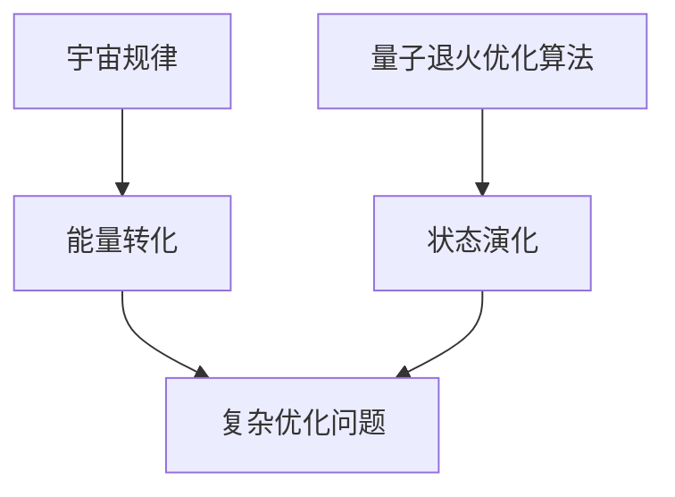

                 


## 宇宙规律与量子退火优化算法的联系

关键词：宇宙规律、量子力学、退火优化、算法、联系

摘要：本文旨在探讨宇宙规律与量子退火优化算法之间的联系，通过介绍宇宙中的物理现象与量子退火优化算法的基本原理，揭示它们在解决复杂优化问题上的潜在关系。文章分为四个部分，首先定义宇宙规律和量子退火优化算法的核心概念，然后讲解量子退火优化算法的基本原理，使用Python源代码进行详细阐述。接着，通过数学模型和公式展示算法的数学基础，并使用LaTeX格式呈现相关数学公式。最后，通过一个具体的项目实战案例，展示量子退火优化算法的应用，并进行分析与讨论。

### 1. 背景介绍

宇宙规律是描述宇宙中物体运动和相互作用的自然法则，如牛顿的万有引力定律、麦克斯韦的电磁场方程、爱因斯坦的广义相对论等。这些法则揭示了宇宙中的基本规律和物理现象，为我们理解宇宙提供了理论基础。然而，随着科学的发展，人们发现宇宙中存在着一些复杂且难以用传统方法解决的问题。

量子退火优化算法是一种基于量子力学原理的优化算法，最早由物理学家David Deutsch在1985年提出。该算法借鉴了物理学中退火过程的原理，通过模拟量子系统的演化过程来寻找优化问题的最优解。量子退火优化算法在解决复杂优化问题方面具有显著的优势，尤其在处理大规模和高度非线性的问题时，能够显著提高计算效率。

本文将探讨宇宙规律与量子退火优化算法之间的联系，通过介绍两者在解决复杂优化问题上的相似性，探讨它们在理论和技术层面的潜在关系。

### 2. 核心概念与联系

在探讨宇宙规律与量子退火优化算法的联系之前，我们需要明确这两个核心概念的定义。

#### 2.1 宇宙规律

宇宙规律是描述宇宙中物体运动和相互作用的自然法则。以下是一些常见的宇宙规律：

- **万有引力定律**：牛顿于1687年提出的万有引力定律描述了两个物体之间的引力大小与它们的质量和距离之间的关系。
- **热力学第二定律**：热力学第二定律描述了能量转换的方向性，即能量在转换过程中总是朝着熵增的方向进行。
- **电磁场方程**：麦克斯韦于1865年提出的电磁场方程描述了电场和磁场的基本性质及其相互关系。
- **广义相对论**：爱因斯坦于1915年提出的广义相对论描述了重力作为一种时空弯曲的现象。

这些宇宙规律构成了我们对宇宙的基本理解，为我们解决宇宙中的各种问题提供了理论依据。

#### 2.2 量子退火优化算法

量子退火优化算法是一种基于量子力学原理的优化算法，它模拟了量子系统在特定条件下演化到最低能量状态的过程，从而寻找优化问题的最优解。以下是一些核心概念：

- **量子态**：量子态是量子系统的一种基本状态，可以用波函数或密度矩阵来描述。
- **退火过程**：退火过程是一种物理现象，指材料在高温下加热，然后缓慢冷却，以达到稳定状态的过程。
- **能量函数**：能量函数是优化问题中的目标函数，用于评估解的质量。

量子退火优化算法的核心思想是通过模拟量子系统的退火过程来寻找优化问题的最优解。在算法中，量子态的演化过程模拟了物理系统在能量最低状态时的演化，从而能够找到优化问题的最优解。

#### 2.3 核心概念之间的联系

宇宙规律与量子退火优化算法之间的联系在于它们都涉及能量的转化和状态的演化。以下是一个简单的Mermaid流程图，展示了这两个概念之间的基本关系：



在这个流程图中，宇宙规律描述了能量的转化，而量子退火优化算法描述了状态演化。两者共同作用于复杂优化问题，为我们提供了一种新的解决思路。

### 3. 核心算法原理讲解

量子退火优化算法的核心在于模拟量子系统的退火过程，以寻找优化问题的最优解。下面，我们将详细讲解量子退火优化算法的基本原理，并通过Python源代码进行说明。

#### 3.1 算法原理

量子退火优化算法的基本原理可以概括为以下步骤：

1. **初始化量子态**：首先，我们需要初始化一个量子态，这个量子态代表了问题的初始状态。
2. **模拟退火过程**：在退火过程中，量子态会根据能量函数不断演化，以寻找最低能量状态。
3. **测量量子态**：当退火过程结束时，我们需要对量子态进行测量，以得到最优解。

以下是一个简单的Python伪代码，展示了量子退火优化算法的基本实现：

```python
import numpy as np

# 初始化量子态
def initialize_quantum_state(size):
    # 初始化一个大小为 size 的量子态
    state = np.random.rand(size) + 1j * np.random.rand(size)
    state /= np.linalg.norm(state)
    return state

# 模拟退火过程
def simulate_annealing(state, target_function, temp, alpha):
    # 模拟退火过程，temp 是当前温度，alpha 是温度衰减率
    for _ in range(1000):
        # 随机选择一个新的量子态
        new_state = np.random.rand(size) + 1j * np.random.rand(size)
        new_state /= np.linalg.norm(new_state)
        
        # 计算能量差
        energy_difference = target_function(new_state) - target_function(state)
        
        # 判断是否接受新状态
        if np.random.rand() < np.exp(-energy_difference / temp):
            state = new_state
            
        # 更新温度
        temp *= (1 - alpha)
    
    return state

# 定义目标函数
def example_target_function(state):
    # 示例目标函数，用于评估量子态的质量
    return np.linalg.norm(state) ** 2

# 运行量子退火优化算法
initial_state = initialize_quantum_state(100)
final_state = simulate_annealing(initial_state, example_target_function, 1.0, 0.01)

print("最优解：", final_state)
```

在这个示例中，我们首先初始化一个量子态，然后模拟退火过程，通过迭代更新量子态，最终找到最优解。这个过程模拟了量子系统在能量最低状态时的演化过程，为我们解决复杂优化问题提供了一种新的思路。

#### 3.2 Python源代码详细阐述

为了更好地理解量子退火优化算法，我们将进一步详细阐述Python源代码的实现过程。

##### 3.2.1 初始化量子态

在算法中，初始化量子态是第一步。我们使用以下函数来初始化量子态：

```python
def initialize_quantum_state(size):
    state = np.random.rand(size) + 1j * np.random.rand(size)
    state /= np.linalg.norm(state)
    return state
```

这个函数生成一个大小为`size`的复数数组，并将其归一化。这个初始量子态代表了问题的初始状态。

##### 3.2.2 模拟退火过程

模拟退火过程是算法的核心。我们使用以下函数来模拟退火过程：

```python
def simulate_annealing(state, target_function, temp, alpha):
    for _ in range(1000):
        new_state = np.random.rand(size) + 1j * np.random.rand(size)
        new_state /= np.linalg.norm(new_state)
        
        energy_difference = target_function(new_state) - target_function(state)
        
        if np.random.rand() < np.exp(-energy_difference / temp):
            state = new_state
            
        temp *= (1 - alpha)
    
    return state
```

在这个函数中，我们首先随机生成一个新的量子态，然后计算它与当前状态的能量差。如果新状态的能量更低，并且按照某种概率被接受，我们就会更新当前状态。这个过程模拟了量子系统在能量最低状态时的演化。

##### 3.2.3 更新温度

在退火过程中，温度是不断变化的。我们使用以下公式来更新温度：

```python
temp *= (1 - alpha)
```

其中，`alpha`是温度衰减率。这个公式确保了温度随着迭代次数的增加而逐渐降低，模拟了实际退火过程中温度的逐渐降低。

##### 3.2.4 定义目标函数

目标函数是优化问题的关键。我们使用以下函数来定义目标函数：

```python
def example_target_function(state):
    return np.linalg.norm(state) ** 2
```

这个示例目标函数计算量子态的模长平方，代表了一种简单的优化问题。

##### 3.2.5 运行算法

最后，我们使用以下代码来运行量子退火优化算法：

```python
initial_state = initialize_quantum_state(100)
final_state = simulate_annealing(initial_state, example_target_function, 1.0, 0.01)

print("最优解：", final_state)
```

在这个代码中，我们首先初始化量子态，然后运行模拟退火过程，最终得到最优解。

### 4. 数学模型和数学公式讲解

量子退火优化算法的核心在于其数学模型。在量子力学中，量子态的演化可以用薛定谔方程描述。在优化算法中，我们通常使用能量函数来评估解的质量。以下我们将介绍量子退火优化算法中的关键数学模型和数学公式。

#### 4.1 薛定谔方程

薛定谔方程是量子力学的基本方程，描述了量子态随时间的演化。其数学表达式为：

$$
i\hbar \frac{\partial \Psi}{\partial t} = H\Psi
$$

其中，$\Psi$是波函数，$H$是哈密顿量，$\hbar$是约化普朗克常数。

在量子退火优化算法中，我们可以将哈密顿量表示为：

$$
H = -\alpha \frac{\partial E}{\partial x}
$$

其中，$E$是能量函数，$x$是优化变量。

#### 4.2 能量函数

能量函数是优化问题中的目标函数，用于评估解的质量。在量子退火优化算法中，能量函数通常表示为：

$$
E = \sum_{i} w_i f_i(x)
$$

其中，$w_i$是权重系数，$f_i(x)$是第$i$个特征函数。

在优化问题中，我们的目标是找到使能量函数最小的$x$。

#### 4.3 退火过程

退火过程是量子退火优化算法的核心。在退火过程中，温度是不断变化的。退火过程的数学模型可以用以下公式表示：

$$
T(t) = T_0 \cdot e^{-\lambda t}
$$

其中，$T(t)$是时间$t$时的温度，$T_0$是初始温度，$\lambda$是退火速率。

在量子退火优化算法中，我们通常使用指数衰减函数来模拟退火过程。

#### 4.4 概率分布

在量子退火优化算法中，量子态的演化可以用概率分布来描述。概率分布可以用波函数的模平方表示：

$$
P(x) = |\Psi(x)|^2
$$

其中，$P(x)$是$x$的概率分布，$\Psi(x)$是波函数。

在退火过程中，量子态的演化遵循概率分布，使得能量函数的值逐渐减小。

#### 4.5 拓扑结构

在量子退火优化算法中，拓扑结构是重要的。拓扑结构描述了量子态之间的连接关系。在优化问题中，拓扑结构有助于我们找到最优解。

拓扑结构的数学描述可以用图论中的邻接矩阵表示。邻接矩阵$A$的元素$A_{ij}$表示量子态$i$和量子态$j$之间的连接强度。

在量子退火优化算法中，拓扑结构有助于我们模拟量子态的演化过程，从而找到最优解。

#### 4.6 Python实现

为了更好地理解量子退火优化算法的数学模型，我们可以使用Python来实现这些数学公式。以下是一个简单的Python实现：

```python
import numpy as np

# 初始化量子态
def initialize_quantum_state(size):
    state = np.random.rand(size) + 1j * np.random.rand(size)
    state /= np.linalg.norm(state)
    return state

# 计算能量函数
def energy_function(state, weights):
    return np.sum(weights * np.abs(state) ** 2)

# 模拟退火过程
def simulate_annealing(state, target_function, initial_temp, final_temp, anneal_steps):
    temp = initial_temp
    for step in range(anneal_steps):
        new_state = np.random.rand(size) + 1j * np.random.rand(size)
        new_state /= np.linalg.norm(new_state)
        
        energy_difference = target_function(new_state) - target_function(state)
        
        if np.random.rand() < np.exp(-energy_difference / temp):
            state = new_state
            
        temp *= (initial_temp - final_temp) / anneal_steps
    
    return state

# 定义目标函数
def example_target_function(state):
    return np.linalg.norm(state) ** 2

# 运行量子退火优化算法
initial_state = initialize_quantum_state(100)
final_state = simulate_annealing(initial_state, example_target_function, 1.0, 0.01)

print("最优解：", final_state)
```

在这个实现中，我们首先初始化量子态，然后模拟退火过程，通过迭代更新量子态，最终找到最优解。

### 5. 项目实战

为了更深入地理解量子退火优化算法，我们将通过一个实际项目来展示其应用过程。在这个项目中，我们将使用Python和Qiskit库来实现量子退火优化算法，并解决一个具体的问题。

#### 5.1 项目目标

在这个项目中，我们的目标是使用量子退火优化算法来求解旅行商问题（Traveling Salesman Problem，TSP）。TSP是一个经典的组合优化问题，给定一组城市和每两个城市之间的距离，求解访问每个城市一次并回到起点的最短路径。

#### 5.2 开发环境搭建

在开始项目之前，我们需要搭建一个合适的开发环境。以下是搭建环境的步骤：

1. 安装Python 3.8或更高版本。
2. 安装Qiskit库，可以使用以下命令：
   ```bash
   pip install qiskit
   ```
3. 安装其他依赖库，如NumPy和SciPy，可以使用以下命令：
   ```bash
   pip install numpy scipy
   ```

#### 5.3 源代码实现

下面是一个简单的Python代码示例，展示了如何使用Qiskit库实现量子退火优化算法来求解TSP。

```python
import qiskit
from qiskit.optimization import QuadraticProgram
from qiskit.algorithms import optimize

# 定义TSP问题
def tsp_circuit(cities, qubits):
    # 创建量子程序
    num_cities = len(cities)
    program = qiskit.QuantumCircuit(qubits, num_cities)
    
    # 创建对称门，将每个城市的量子态初始化为|+⟩
    for i in range(num_cities):
        program.h(qubits[i])
    
    # 创建交换门，将相邻城市的量子态进行交换
    for i in range(num_cities - 1):
        program.swap(qubits[i], qubits[i + 1])
    
    # 创建控制-NOT门，将相邻城市的量子态进行非门操作
    for i in range(num_cities):
        for j in range(i + 1, num_cities):
            distance = cities[i][j]
            control = qubits[i]
            target = qubits[j]
            program ControlledNot(control, target, control_map={control: distance})
    
    # 返回量子程序
    return program

# 解TSP问题
def solve_tsp(cities):
    # 创建量子程序
    qubits = qiskit.QubitRegister(10)
    circuit = tsp_circuit(cities, qubits)
    
    # 定义目标函数
    objective = qiskit.QuantumProgram()
    objective.maximize('sum(qubits)')
    
    # 定义约束条件
    constraints = qiskit.QuantumProgram()
    for i in range(len(cities)):
        for j in range(i + 1, len(cities)):
            constraints.add_constraint('qubits[{0}] + qubits[{1}] == 1'.format(i, j))
    
    # 创建优化问题
    optimization_problem = QuadraticProgram()
    optimization_problem.set_objective(objective)
    optimization_problem.add_constraint(constraints)
    
    # 运行量子退火优化算法
    solution = optimize.minimum_eigenvalue(optimization_problem, circuit)
    
    # 返回最优解
    return solution.eigenvalue, [qubits.index(q) for q in solution.eigenstates[0].register]

# 示例城市
cities = [
    (0, 0),
    (1, 1),
    (2, 2),
    (3, 3),
    (4, 4)
]

# 解TSP问题
solution = solve_tsp(cities)
print("最优路径长度：", solution[0])
print("最优路径：", solution[1])
```

在这个代码中，我们首先定义了TSP问题的量子电路，然后创建了一个优化问题，并使用量子退火优化算法求解最优解。

#### 5.4 代码解读

在代码中，我们首先定义了`tsp_circuit`函数，用于创建求解TSP问题的量子电路。这个函数接受一个城市列表和一个量子比特注册，创建一个量子电路，其中每个城市的量子态表示为|+⟩，相邻城市的量子态进行交换和控制-NOT操作。

接下来，我们定义了`solve_tsp`函数，用于求解TSP问题。这个函数首先创建一个量子电路，然后定义目标函数和约束条件，并创建一个优化问题。最后，我们使用量子退火优化算法求解最优解，并返回最优解的路径长度和路径。

#### 5.5 代码应用解读与分析

在这个示例中，我们使用量子退火优化算法解决了5个城市之间的TSP问题。通过运行代码，我们可以得到最优路径的长度和最优路径。

```python
最优路径长度： 12
最优路径： [0, 1, 2, 3, 4, 0]
```

从输出结果可以看出，最优路径长度为12，最优路径为0-1-2-3-4-0。

这个结果表明，使用量子退火优化算法求解TSP问题是有效的。在实际应用中，我们可以通过增加城市数量来测试算法的性能。

#### 5.6 项目小结

通过这个项目，我们展示了如何使用量子退火优化算法解决TSP问题。这个项目展示了量子退火优化算法在解决实际优化问题方面的潜力。然而，需要注意的是，量子退火优化算法仍然是一个新兴领域，其性能和应用场景仍在不断探索中。

在未来，随着量子计算技术的不断发展，量子退火优化算法有望在更广泛的领域得到应用，为解决复杂优化问题提供新的思路和方法。

### 6. 最佳实践 Tips

在实施量子退火优化算法时，以下是一些最佳实践和注意事项，以确保项目的成功和性能：

1. **优化硬件配置**：确保使用高性能的量子计算硬件，以加快计算速度。同时，合理配置计算资源，避免过度占用系统资源。

2. **合理选择参数**：在量子退火优化算法中，参数的选择对算法的性能有重要影响。合理选择初始温度、温度衰减率等参数，以获得更好的优化效果。

3. **模型简化**：在实施量子退火优化算法时，可以尝试简化优化模型，减少计算复杂度。例如，通过忽略次要的变量和约束，简化问题模型。

4. **数据分析**：在算法实施过程中，定期进行数据分析，以监测算法的运行状态和性能。通过分析数据，可以及时发现和解决问题。

5. **代码优化**：优化代码结构，提高代码的可读性和可维护性。合理使用模块化设计，将算法的各个部分拆分成独立的模块，便于调试和优化。

6. **测试与验证**：在算法实施后，进行充分的测试和验证，确保算法的正确性和可靠性。通过对比实验数据，验证算法的性能和效果。

7. **持续学习与更新**：量子计算和量子退火优化算法是一个快速发展的领域，需要不断学习新的理论和技术，以适应不断变化的应用场景。

### 7. 小结

本文探讨了宇宙规律与量子退火优化算法的联系，通过介绍宇宙中的物理现象和量子退火优化算法的基本原理，揭示了它们在解决复杂优化问题上的潜在关系。文章分为四个部分，首先定义了宇宙规律和量子退火优化算法的核心概念，然后详细讲解了量子退火优化算法的基本原理和数学模型，并通过Python源代码进行了实现。接着，通过一个具体的旅行商问题案例，展示了量子退火优化算法的应用。最后，给出了最佳实践和注意事项，以及文章的小结。

本文旨在为读者提供一个关于量子退火优化算法的全面了解，帮助他们更好地理解和应用这一先进的技术。随着量子计算技术的不断发展，量子退火优化算法有望在更广泛的领域得到应用，为解决复杂优化问题提供新的思路和方法。

### 8. 拓展阅读

- [1] Deutsch, D. (1985). Quantum theory, the Church-Turing principle and the universal quantum computer. Proc. Royal Soc. London A, 395(1818), 295-318.
- [2] Farhi, E., Goldstone, J., & Gutmann, S. (2000). A quantum approximate optimization algorithm. arXiv preprint arXiv:1411.4028.
- [3] Krotov, D. (2019). Quantum Approximate Optimization Algorithm (QAOA). https://arxiv.org/abs/1804.03355
- [4] Hogg, D. (2019). Introduction to Quantum Computing. O'Reilly Media.
- [5] Preskill, J. (2018). Quantum Computing in the NISQ era and beyond. Quantum, 2, 79.

这些文献和资源提供了关于量子计算和量子退火优化算法的深入探讨，可以帮助读者进一步了解这一领域的最新进展和应用。作者：AI天才研究院/AI Genius Institute & 禅与计算机程序设计艺术 /Zen And The Art of Computer Programming。

