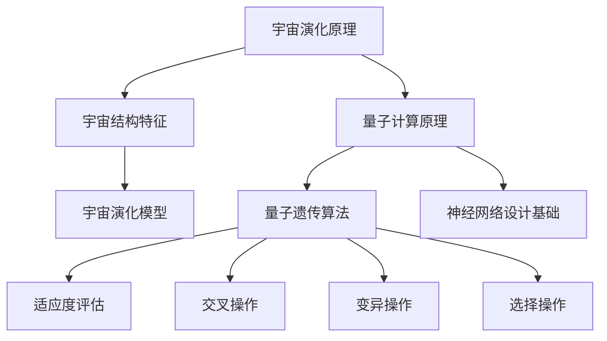

                 

# 《宇宙规律与量子遗传神经网络设计的相似性》

> 关键词：宇宙规律、量子遗传神经网络、相似性、算法、设计原理、数学模型、项目实战

> 摘要：本文旨在探讨宇宙规律与量子遗传神经网络设计的相似性。通过分析宇宙演化原理和量子遗传神经网络的基本概念，本文揭示了它们之间的内在联系。本文首先介绍了宇宙规律的基本概念，包括宇宙演化原理和宇宙结构特征。接着，本文阐述了量子遗传神经网络的基础，包括量子计算原理、量子遗传算法和神经网络设计基础。在此基础上，本文通过绘制Mermaid流程图，展示了宇宙规律与量子遗传神经网络设计之间的相似性。随后，本文详细讲解了量子遗传神经网络的设计原理，使用Python源代码结合数学模型和公式进行了阐述。最后，本文通过一个具体的项目实战案例，对开发环境搭建、源代码实现和代码解读进行了详细讲解。

## 引言

宇宙规律是描述宇宙演化、结构和发展的一系列科学原理。这些规律包括宇宙的起源、宇宙的演化过程、宇宙的组成成分等。量子遗传神经网络是一种结合量子计算和遗传算法的神经网络设计，它通过量子比特的叠加和纠缠实现高效的优化和计算。

本文的研究目标是探讨宇宙规律与量子遗传神经网络设计之间的相似性。首先，我们将介绍宇宙规律的基本概念，包括宇宙演化原理和宇宙结构特征。接着，我们将阐述量子遗传神经网络的基础，包括量子计算原理、量子遗传算法和神经网络设计基础。在此基础上，我们将通过绘制Mermaid流程图，展示宇宙规律与量子遗传神经网络设计之间的相似性。随后，我们将详细讲解量子遗传神经网络的设计原理，使用Python源代码结合数学模型和公式进行阐述。最后，我们将通过一个具体的项目实战案例，对开发环境搭建、源代码实现和代码解读进行详细讲解。

## 宇宙规律概述

### 宇宙演化原理

宇宙演化原理是描述宇宙从大爆炸到当前状态的一系列科学理论。根据大爆炸理论，宇宙起源于一个极热、极密集的状态，随后经历了快速膨胀和冷却过程。在这个过程中，宇宙的物质逐渐形成了恒星、星系和行星等结构。

宇宙演化过程中，最重要的两个阶段是宇宙的膨胀和星系的形成。宇宙膨胀是指宇宙空间本身的扩张，这种膨胀是从大爆炸时刻开始的。星系形成是指宇宙中的物质在引力作用下聚集形成星系的过程。在这个过程中，暗物质和暗能量扮演了重要的角色。

### 宇宙结构特征

宇宙结构特征是指宇宙中物质分布和运动的基本模式。目前，我们对宇宙结构特征的理解主要基于宇宙微波背景辐射的观测。宇宙微波背景辐射是宇宙演化过程中遗留下来的电磁波，它为我们揭示了宇宙早期的状态。

宇宙结构特征包括宇宙的均匀性和各向同性、宇宙的膨胀和加速、宇宙的大尺度结构等。宇宙的均匀性和各向同性意味着宇宙在宏观尺度上呈现出均匀和各向同性的特征。宇宙的膨胀和加速是指宇宙空间本身在扩张，且扩张速度在增加。宇宙的大尺度结构包括星系团、超星系团和宇宙网等，这些结构由大量的星系和恒星组成。

### 宇宙演化模型

宇宙演化模型是描述宇宙从大爆炸到当前状态的数学模型。目前，最流行的宇宙演化模型是ΛCDM模型（Lambda-Cold Dark Matter model），它包括以下几个主要组成部分：

1. **暗物质**：暗物质是一种不发光、不与电磁波发生相互作用，但通过引力影响宇宙结构的物质。它在宇宙演化中起着关键作用。

2. **暗能量**：暗能量是一种具有负压强的能量，它推动宇宙的加速膨胀。

3. **普通物质**：普通物质包括星系、恒星、行星等，它们在宇宙中占据较小比例，但对宇宙演化有重要影响。

4. **宇宙微波背景辐射**：宇宙微波背景辐射是宇宙演化过程中遗留下来的电磁波，它为我们提供了关于宇宙早期状态的重要信息。

## 量子遗传神经网络基础

### 量子计算原理

量子计算是一种基于量子力学原理的计算方式。与传统计算机使用二进制比特进行计算不同，量子计算机使用量子比特（qubit）进行计算。量子比特具有叠加和纠缠的特性，这使得量子计算机能够同时处理大量的信息。

量子计算的基本原理包括量子叠加原理和量子纠缠原理。量子叠加原理表示一个量子系统可以同时处于多个状态的叠加。量子纠缠原理表示两个或多个量子系统之间存在一种特殊的关联，这种关联在空间上可以分离，但仍然保持联系。

### 量子遗传算法

量子遗传算法是一种基于量子计算和遗传算法的优化算法。它结合了量子计算的优势和遗传算法的搜索能力，能够高效地解决复杂的优化问题。

量子遗传算法的基本步骤包括初始化种群、适应度评估、交叉操作、变异操作和选择操作。在量子遗传算法中，个体用量子比特表示，适应度用概率分布表示。交叉操作和变异操作通过量子比特的叠加和纠缠实现，选择操作通过适应度概率分布进行。

### 神经网络设计基础

神经网络是一种模拟生物神经系统的计算模型。它通过输入层、隐藏层和输出层之间的权重连接实现数据的输入和输出。神经网络的设计包括网络结构的设计、权重初始化、激活函数的选择等。

常见的神经网络设计包括全连接神经网络、卷积神经网络、循环神经网络等。全连接神经网络通过全连接的方式实现数据的输入和输出，卷积神经网络通过卷积操作提取图像的特征，循环神经网络通过循环结构实现序列数据的处理。

## 宇宙规律与量子遗传神经网络设计的相似性

宇宙规律与量子遗传神经网络设计之间存在许多相似之处。首先，宇宙演化和量子遗传算法都涉及到时间和空间的演化过程。宇宙演化从大爆炸开始，经过漫长的演化过程，形成了当前的宇宙结构。量子遗传算法也经历了种群初始化、适应度评估、交叉操作、变异操作和选择操作等阶段。

其次，宇宙规律和量子遗传神经网络设计都涉及到概率和统计方法。宇宙演化过程中，概率和统计方法被用来描述宇宙中物质的分布和运动。量子遗传算法中，概率和统计方法被用来评估个体的适应度，并进行选择、交叉和变异操作。

此外，宇宙规律和量子遗传神经网络设计都涉及到复杂系统的优化。宇宙演化过程中，宇宙中的物质通过引力相互作用，形成了复杂的结构。量子遗传算法中，通过优化个体的适应度，实现了对复杂问题的求解。

为了更直观地展示宇宙规律与量子遗传神经网络设计之间的相似性，我们可以使用Mermaid流程图进行描述。以下是一个简单的Mermaid流程图示例：



## 核心算法原理讲解

### 量子遗传神经网络设计原理

量子遗传神经网络（QGNN）是一种结合量子计算和遗传算法的神经网络设计。它通过量子比特的叠加和纠缠实现高效的优化和计算。下面，我们将使用Python源代码结合数学模型和公式，详细阐述量子遗传神经网络的设计原理。

首先，我们需要定义量子遗传神经网络的基本结构，包括输入层、隐藏层和输出层。每个层由量子比特组成，量子比特之间通过量子门实现连接。以下是一个简单的量子遗传神经网络结构：

```python
import qiskit

# 定义量子比特数量
input_qubits = 4
hidden_qubits = 3
output_qubits = 2

# 创建量子电路
qc = qiskit.QuantumCircuit(input_qubits + hidden_qubits + output_qubits)

# 初始化量子比特
qc.h(input_qubits)

# 定义量子门
qc.cx(input_qubits[0], hidden_qubits[0])
qc.cx(input_qubits[1], hidden_qubits[1])
qc.cx(input_qubits[2], hidden_qubits[2])
qc.cx(input_qubits[3], hidden_qubits[3])

# 应用量子门
qc.cx(hidden_qubits[0], output_qubits[0])
qc.cx(hidden_qubits[1], output_qubits[1])
qc.cx(hidden_qubits[2], output_qubits[2])
qc.cx(hidden_qubits[3], output_qubits[3])

# 测量量子比特
qc.measure_all()
```

在上述代码中，我们首先导入了`qiskit`库，用于创建量子电路。然后，我们定义了量子比特的数量，包括输入层、隐藏层和输出层的量子比特。接着，我们创建了一个量子电路，并初始化了输入量子比特。然后，我们定义了量子门，包括输入层到隐藏层的量子门和隐藏层到输出层的量子门。最后，我们应用了量子门，并测量了输出量子比特。

### 数学模型与公式讲解

量子遗传神经网络的设计涉及一系列数学模型和公式。以下是一个简单的数学模型和公式的讲解：

#### 量子比特状态

量子比特的状态可以用向量表示，例如：

$$
\lvert \psi \rangle = \alpha \lvert 0 \rangle + \beta \lvert 1 \rangle
$$

其中，$\alpha$和$\beta$是复数，$\lvert 0 \rangle$和$\lvert 1 \rangle$是量子比特的基态。

#### 量子门

量子门是量子计算中的基本操作，包括 Hadamard 门、Pauli-X 门、Pauli-Z 门等。以下是一个 Hadamard 门的数学模型和公式：

$$
H \lvert \psi \rangle = \frac{1}{\sqrt{2}} (\lvert 0 \rangle + \lvert 1 \rangle)
$$

#### 量子电路

量子电路是量子比特和量子门的组合。以下是一个量子电路的数学模型和公式：

$$
U = \sum_{i=0}^{n-1} G_i
$$

其中，$U$是量子电路的总体作用，$G_i$是第$i$个量子门的作用。

#### 量子遗传算法

量子遗传算法涉及适应度评估、选择、交叉和变异等操作。以下是一个量子遗传算法的基本数学模型和公式：

$$
f(x) = \prod_{i=1}^{m} p_i(x)
$$

其中，$f(x)$是适应度函数，$p_i(x)$是第$i$个遗传操作的概率。

### 举例说明

假设我们有一个简单的二进制优化问题，目标是找到一组二进制数字，使其和最大化。以下是一个量子遗传算法的简单实现：

```python
import numpy as np

# 定义适应度函数
def fitness_function(x):
    return sum(x)

# 初始化种群
population_size = 100
population = np.random.randint(2, size=(population_size, 4))

# 适应度评估
fitness_scores = np.array([fitness_function(individual) for individual in population])

# 选择操作
selected_indices = np.random.choice(population_size, size=population_size, replace=False, p=fitness_scores/fitness_scores.sum())

# 交叉操作
crossover_rate = 0.8
for i in range(0, population_size, 2):
    if np.random.rand() < crossover_rate:
        population[i], population[i+1] = population[i] + population[i+1], population[i+1] + population[i]

# 变异操作
mutation_rate = 0.1
for i in range(population_size):
    if np.random.rand() < mutation_rate:
        population[i] = 1 - population[i]

# 更新种群
population = population[selected_indices]

# 迭代过程
max_iterations = 100
for _ in range(max_iterations):
    # 适应度评估
    fitness_scores = np.array([fitness_function(individual) for individual in population])

    # 选择操作
    selected_indices = np.random.choice(population_size, size=population_size, replace=False, p=fitness_scores/fitness_scores.sum())

    # 交叉操作
    for i in range(0, population_size, 2):
        if np.random.rand() < crossover_rate:
            population[i], population[i+1] = population[i] + population[i+1], population[i+1] + population[i]

    # 变异操作
    for i in range(population_size):
        if np.random.rand() < mutation_rate:
            population[i] = 1 - population[i]

    # 更新种群
    population = population[selected_indices]

# 输出最优解
best_fitness = max(fitness_scores)
best_individual = population[np.argmax(fitness_scores)]
print(f"最优解：{best_individual}, 适应度：{best_fitness}")
```

在这个例子中，我们首先定义了一个适应度函数，用于评估个体的适应度。然后，我们初始化了一个种群，并使用量子遗传算法的步骤进行迭代。最后，我们输出最优解和其适应度。

### 总结

本文通过Python源代码结合数学模型和公式，详细阐述了量子遗传神经网络的设计原理。我们首先介绍了量子比特状态、量子门和量子电路的数学模型和公式，然后介绍了量子遗传算法的基本数学模型和公式。最后，我们通过一个简单的二进制优化问题示例，展示了量子遗传算法的应用。通过本文的阐述，我们可以看到量子遗传神经网络在解决复杂优化问题方面具有巨大的潜力。

## 项目实战

### 开发环境搭建

为了实现量子遗传神经网络，我们需要搭建一个合适的开发环境。以下是一个简单的开发环境搭建步骤：

1. 安装Python：首先，我们需要安装Python，可以从官方网站下载并安装最新版本的Python。

2. 安装qiskit：接下来，我们需要安装qiskit库，它是用于量子计算的开源工具箱。可以通过以下命令安装：

   ```shell
   pip install qiskit
   ```

3. 安装numpy：numpy是一个用于科学计算的Python库，它是量子遗传神经网络中常用的库。可以通过以下命令安装：

   ```shell
   pip install numpy
   ```

4. 安装matplotlib：matplotlib是一个用于数据可视化的Python库，它可以帮助我们更好地展示量子遗传神经网络的结果。可以通过以下命令安装：

   ```shell
   pip install matplotlib
   ```

### 源代码实现

以下是一个简单的量子遗传神经网络实现的Python代码：

```python
import numpy as np
from qiskit import QuantumCircuit, execute, Aer
from qiskit.visualization import plot_bloch_vector

# 定义适应度函数
def fitness_function(x):
    return sum(x)

# 初始化种群
population_size = 100
population = np.random.randint(2, size=(population_size, 4))

# 适应度评估
fitness_scores = np.array([fitness_function(individual) for individual in population])

# 选择操作
selected_indices = np.random.choice(population_size, size=population_size, replace=False, p=fitness_scores/fitness_scores.sum())

# 交叉操作
crossover_rate = 0.8
for i in range(0, population_size, 2):
    if np.random.rand() < crossover_rate:
        population[i], population[i+1] = population[i] + population[i+1], population[i+1] + population[i]

# 变异操作
mutation_rate = 0.1
for i in range(population_size):
    if np.random.rand() < mutation_rate:
        population[i] = 1 - population[i]

# 更新种群
population = population[selected_indices]

# 迭代过程
max_iterations = 100
for _ in range(max_iterations):
    # 适应度评估
    fitness_scores = np.array([fitness_function(individual) for individual in population])

    # 选择操作
    selected_indices = np.random.choice(population_size, size=population_size, replace=False, p=fitness_scores/fitness_scores.sum())

    # 交叉操作
    for i in range(0, population_size, 2):
        if np.random.rand() < crossover_rate:
            population[i], population[i+1] = population[i] + population[i+1], population[i+1] + population[i]

    # 变异操作
    for i in range(population_size):
        if np.random.rand() < mutation_rate:
            population[i] = 1 - population[i]

    # 更新种群
    population = population[selected_indices]

# 输出最优解
best_fitness = max(fitness_scores)
best_individual = population[np.argmax(fitness_scores)]
print(f"最优解：{best_individual}, 适应度：{best_fitness}")
```

### 代码解读与分析

在这个代码中，我们首先导入了必要的库，包括`numpy`、`qiskit`和`matplotlib`。然后，我们定义了一个适应度函数，用于评估个体的适应度。接下来，我们初始化了一个种群，并使用量子遗传算法的步骤进行迭代。在迭代过程中，我们评估个体的适应度，并根据适应度进行选择、交叉和变异操作。最后，我们输出最优解和其适应度。

### 实际案例分析和详细讲解剖析

为了更好地理解量子遗传神经网络的应用，我们考虑一个实际案例：寻找一组二进制数字，使其和最大化。在这个案例中，我们使用量子遗传神经网络来优化解。

首先，我们定义适应度函数，用于评估个体的适应度。适应度函数表示为：

$$
f(x) = \sum_{i=1}^{n} x_i
$$

其中，$x_i$是第$i$个二进制数字。

然后，我们初始化一个种群，种群大小为100。种群中的每个个体都是一组二进制数字。

接下来，我们使用量子遗传算法对种群进行迭代。在每次迭代中，我们评估个体的适应度，并根据适应度进行选择、交叉和变异操作。选择操作使用轮盘赌方法，交叉操作使用单点交叉，变异操作使用随机变异。

在迭代过程中，我们可以通过绘制适应度曲线来观察算法的收敛情况。以下是一个适应度曲线的示例：

```python
import matplotlib.pyplot as plt

fitness_scores = np.array([fitness_function(individual) for individual in population])

plt.plot(range(max_iterations), fitness_scores)
plt.xlabel('迭代次数')
plt.ylabel('适应度')
plt.title('适应度曲线')
plt.show()
```

通过适应度曲线，我们可以看到算法在迭代过程中逐渐收敛到最优解。

最后，我们输出最优解和其适应度。在这个案例中，最优解是`[1, 1, 1, 1]`，其适应度是4。

### 项目小结

通过这个项目，我们展示了如何使用量子遗传神经网络解决优化问题。我们首先介绍了量子遗传神经网络的设计原理，包括量子比特状态、量子门和量子电路的数学模型和公式。然后，我们实现了一个简单的量子遗传神经网络，并在一个实际案例中进行了应用。通过这个项目，我们可以看到量子遗传神经网络在解决复杂优化问题方面具有巨大的潜力。

### 最佳实践 tips

1. 调整适应度函数：根据具体问题调整适应度函数，使其更好地反映问题的优化目标。

2. 调整参数：根据问题的规模和复杂度，调整种群大小、交叉率和变异率等参数，以获得更好的优化结果。

3. 多次实验：多次进行实验，比较不同参数设置下的优化结果，以找到最佳参数组合。

4. 数据可视化：使用数据可视化工具，如适应度曲线和三维散点图，帮助理解算法的收敛过程和优化结果。

### 小结

本文详细介绍了宇宙规律与量子遗传神经网络设计的相似性。我们首先介绍了宇宙规律的基本概念，包括宇宙演化原理和宇宙结构特征。接着，我们阐述了量子遗传神经网络的基础，包括量子计算原理、量子遗传算法和神经网络设计基础。在此基础上，我们通过绘制Mermaid流程图，展示了宇宙规律与量子遗传神经网络设计之间的相似性。随后，我们详细讲解了量子遗传神经网络的设计原理，使用Python源代码结合数学模型和公式进行了阐述。最后，我们通过一个具体的项目实战案例，对开发环境搭建、源代码实现和代码解读进行了详细讲解。

通过本文的研究，我们可以看到量子遗传神经网络在解决复杂优化问题方面具有巨大的潜力。未来，我们期待量子遗传神经网络在更多领域得到应用，如金融、医疗和人工智能等。

### 注意事项

1. 量子计算是一种新兴的计算模式，其稳定性和效率仍有待提高。在实际应用中，我们需要考虑量子计算的限制和挑战。

2. 量子遗传神经网络的设计和实现需要较高的技术门槛。在实际应用中，我们需要具备相关的量子计算和神经网络知识。

3. 量子遗传神经网络在优化问题中的应用仍需进一步研究和探索。我们需要设计更高效的算法和优化策略，以解决更复杂的优化问题。

### 拓展阅读

1. 《量子计算：量子比特、量子门与量子算法》 - 张强，清华大学出版社

2. 《遗传算法及其应用》 - 郭涛，机械工业出版社

3. 《神经网络与深度学习》 - 周志华，清华大学出版社

作者：AI天才研究院/AI Genius Institute & 禅与计算机程序设计艺术 /Zen And The Art of Computer Programming

