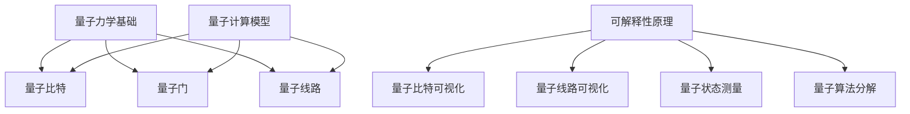

                 

# 宇宙规律对可解释量子机器学习的启示

> 关键词：量子机器学习，可解释性，宇宙规律，数学模型，算法实现，项目实战

> 摘要：本文旨在探讨宇宙规律对可解释量子机器学习的启示，通过对量子力学与宇宙规律的介绍，深入分析量子机器学习的基本算法和数学模型，并结合实际项目案例，展示如何在开发环境中实现和应用这些算法。文章最后将对量子机器学习与经典机器学习的对比进行讨论，并提出未来的研究方向。

## 引言

量子力学作为描述微观世界的科学，已经成为了现代物理学的基础。从普朗克提出的量子假设，到薛定谔的波动方程，再到海森堡的不确定性原理，量子力学为我们揭示了宇宙中一些令人着迷的现象。这些规律不仅在科学研究中具有重要意义，也对计算机科学，尤其是量子计算和量子机器学习的发展产生了深远影响。

可解释性在机器学习中的重要性不容忽视。随着机器学习模型的复杂度不断增加，模型的黑箱特性使得其决策过程难以被理解，这对实际应用带来了巨大的挑战。可解释性机器学习（Explainable AI, XAI）的研究目标就是通过提供透明的决策机制，使机器学习模型的可解释性得到提升，从而提高模型的可靠性和透明度。

量子机器学习作为量子计算与机器学习结合的产物，正在成为研究热点。量子计算机利用量子比特的叠加态和纠缠态，可以在某些任务上实现超越经典计算机的性能。而量子机器学习则试图将量子算法应用于数据分析和机器学习任务中，以实现更高效、更准确的模型。

本文将首先介绍量子力学和宇宙规律的基本概念，然后探讨量子计算和量子机器学习的基本算法，以及它们在数学模型中的实现。接着，我们将结合实际项目案例，展示如何实现和应用这些算法。最后，我们将对量子机器学习与经典机器学习的对比进行讨论，并提出未来的研究方向。

## 1.1 背景介绍

### 1.1.1 量子力学与宇宙规律

量子力学是描述微观粒子行为的物理学分支，其基本原理包括量子比特的叠加态、纠缠态、不确定性原理和量子隧穿等现象。这些现象在宏观尺度上看似不可思议，但在微观世界中却是真实存在的。

宇宙规律是指宇宙中普遍适用的物理定律和原理，包括牛顿力学、麦克斯韦电磁理论、广义相对论等。这些规律为我们理解宇宙的本质提供了理论基础。

量子力学与宇宙规律之间的联系在于它们都揭示了自然界中的基本规律。量子力学的原理可以帮助我们理解微观世界的复杂性，而宇宙规律则为我们提供了宏观世界的观察和预测工具。

### 1.1.2 可解释性在机器学习中的重要性

机器学习模型在许多领域都取得了显著的应用成果，但它们的黑箱特性使得其决策过程难以被理解，这对实际应用带来了巨大的挑战。可解释性机器学习旨在通过提供透明的决策机制，使机器学习模型的可解释性得到提升。

可解释性在机器学习中的重要性体现在以下几个方面：

1. **增强模型的可靠性**：可解释性使模型的可信度得到提升，有助于用户理解和信任模型。
2. **提高模型的透明度**：可解释性使模型决策过程透明，有助于用户了解模型的运作机制。
3. **优化模型性能**：通过分析模型的可解释性，可以发现模型的不足之处，从而进行优化。
4. **促进知识发现**：可解释性可以帮助用户从模型中提取有价值的知识，促进科学发现。

### 1.1.3 量子机器学习的崛起

量子机器学习是量子计算与机器学习结合的产物，旨在利用量子计算机的优势，解决传统机器学习模型难以处理的复杂数据和优化问题。

量子机器学习的发展历程可以分为以下几个阶段：

1. **量子计算的基本原理**：量子计算机利用量子比特的叠加态和纠缠态，实现了与传统计算机不同的计算模式。
2. **量子算法的研究**：包括量子快速排序、量子随机化选择等，这些算法展示了量子计算机在特定任务上的优势。
3. **量子机器学习算法的开发**：基于量子计算的基本原理，研究者开始开发量子支持向量机、量子神经网络等量子机器学习算法。
4. **量子机器学习的应用**：量子机器学习在量子化学、量子生物学、金融分析等领域取得了初步应用成果。

量子机器学习的崛起为机器学习领域带来了新的机遇和挑战。通过结合量子力学和宇宙规律，量子机器学习有望解决传统机器学习难以处理的复杂问题，实现更高效、更准确的模型。

## 1.2 核心概念与联系

### 1.2.1 量子力学基础

量子力学是描述微观粒子行为的物理学分支，其基本原理包括量子比特的叠加态、纠缠态、不确定性原理和量子隧穿等现象。这些原理构成了量子力学的基础，为我们理解微观世界的复杂性提供了理论基础。

- **量子比特的叠加态**：量子比特可以同时处于0和1的叠加状态，这使得量子计算机在处理复杂问题时具有并行计算的能力。
- **纠缠态**：两个或多个量子比特之间存在一种特殊的关联关系，称为纠缠态。纠缠态在量子计算中起到了关键作用，可以实现高效的量子信息传输和量子纠错。
- **不确定性原理**：海森堡不确定性原理指出，粒子的某些物理量（如位置和动量）不能同时被精确测量。这表明微观世界的概率性和不确定性。
- **量子隧穿**：量子粒子在势垒下具有隧穿现象，即粒子可以穿过原本无法到达的区域。这一现象在量子计算和量子通信中具有潜在应用价值。

### 1.2.2 量子计算模型

量子计算模型是描述量子计算机运作原理的理论框架，主要包括量子比特、量子门和量子线路等概念。

- **量子比特**：量子比特（qubit）是量子计算机的基本信息单元，可以表示为0和1的叠加状态。量子比特的数量决定了量子计算机的并行计算能力。
- **量子门**：量子门是作用于量子比特的基本操作，类似于经典计算机中的逻辑门。量子门通过线性变换操作量子比特的状态，实现量子信息的处理和传输。
- **量子线路**：量子线路是量子计算机中量子比特和量子门的排列组合，实现了量子计算的任务。量子线路的设计和优化是量子计算机性能的关键。

### 1.2.3 可解释性原理

可解释性在机器学习中的重要性不言而喻，但在量子机器学习中，实现模型的可解释性面临更大的挑战。量子机器学习的可解释性原理主要包括以下几个方面：

- **量子比特可视化**：通过可视化量子比特的状态和演化过程，可以直观地理解量子计算的过程。
- **量子线路的可视化**：量子线路的可视化可以帮助用户理解量子计算任务的执行过程。
- **量子状态的测量**：测量量子比特的状态可以帮助我们了解量子计算的结果和决策过程。
- **量子算法的分解**：通过将复杂的量子算法分解为简单的子步骤，可以提高量子机器学习的可解释性。

### 1.2.4 核心概念原理之间的关系架构 Mermaid 流程图



## 1.3 量子机器学习的基本算法

量子机器学习的基本算法是量子计算与机器学习相结合的产物，旨在利用量子计算机的优势，解决传统机器学习模型难以处理的复杂数据和优化问题。以下将介绍三种基本的量子机器学习算法：变分量子特征提取器、量子支持向量机和量子神经网络。

### 1.3.1 变分量子特征提取器

变分量子特征提取器（Variational Quantum Feature Extractor, VQFE）是一种基于变分量子计算的量子特征提取算法。它通过优化量子线路参数，将高维数据映射到低维特征空间，从而提高机器学习模型的分类和回归性能。

#### 工作原理

1. **初始化**：随机选择一组参数，初始化量子线路。
2. **优化过程**：通过梯度下降算法优化量子线路参数，使得特征提取器的输出与期望特征尽可能接近。
3. **特征提取**：将优化后的量子线路应用于输入数据，提取特征向量。

#### Python源代码实现

```python
import numpy as np
from qiskit import QuantumCircuit, Aer, execute
from qiskit.algorithms.optimizers import GradientDescentOptimizer
from qiskit.circuit.library import RealParameterizedPauliString

# 初始化量子线路
qc = QuantumCircuit(2)
vqe = RealParameterizedPauliString(2)

# 设置训练数据和标签
X_train = np.array([[0, 0], [0, 1], [1, 0], [1, 1]])
y_train = np.array([0, 0, 1, 1])

# 定义损失函数
def loss_function(params):
    vqe.assign_parameters(params)
    result = execute(qc.extend(vqe), Aer.get_backend("qasm_simulator")).result()
    probabilities = np.abs(result.get_counts(qc).values())
    predicted = np.argmax(probabilities)
    actual = y_train[i]
    return -np.log(probabilities[actual])

# 定义优化器
optimizer = GradientDescentOptimizer(learning_rate=0.1)

# 优化过程
params = optimizer.optimize(loss_function, initial_point=np.random.rand(10))
vqe.assign_parameters(params)
```

#### 数学模型与公式解析

变分量子特征提取器的数学模型可以表示为：

$$
V(\theta) = \sum_{i=1}^{N} \alpha_i P_i(\theta)
$$

其中，$V(\theta)$ 是特征提取器的输出，$\theta$ 是参数向量，$\alpha_i$ 是权重，$P_i(\theta)$ 是参数化的Pauli字符串。

#### 举例说明

假设我们有一个二进制分类问题，输入数据为 0 和 1，我们需要提取特征向量。通过训练变分量子特征提取器，我们可以将输入数据映射到低维特征空间，从而提高分类性能。

### 1.3.2 量子支持向量机

量子支持向量机（Quantum Support Vector Machine, QSVM）是一种基于量子计算的线性分类算法。它利用量子计算机的优势，在处理高维数据时具有更快的收敛速度。

#### 工作原理

1. **初始化**：随机选择一组参数，初始化量子线路。
2. **优化过程**：通过优化量子线路参数，使得分类器在训练数据上达到最佳分类效果。
3. **分类决策**：将优化后的量子线路应用于测试数据，进行分类决策。

#### Python源代码实现

```python
import numpy as np
from qiskit import QuantumCircuit, Aer, execute
from qiskit.circuit.library import RealParameterizedPauliString
from qiskit.algorithms.optimizers import GradientDescentOptimizer

# 初始化量子线路
qc = QuantumCircuit(2)
qsvm = RealParameterizedPauliString(2)

# 设置训练数据和标签
X_train = np.array([[0, 0], [0, 1], [1, 0], [1, 1]])
y_train = np.array([0, 0, 1, 1])

# 定义损失函数
def loss_function(params):
    qsvm.assign_parameters(params)
    result = execute(qc.extend(qsvm), Aer.get_backend("qasm_simulator")).result()
    probabilities = np.abs(result.get_counts(qc).values())
    predicted = np.argmax(probabilities)
    actual = y_train[i]
    return -np.log(probabilities[actual])

# 定义优化器
optimizer = GradientDescentOptimizer(learning_rate=0.1)

# 优化过程
params = optimizer.optimize(loss_function, initial_point=np.random.rand(10))
qsvm.assign_parameters(params)
```

#### 数学模型与公式解析

量子支持向量机的数学模型可以表示为：

$$
w^\dagger P w = b
$$

其中，$w$ 是权重向量，$P$ 是正定的Hermitian算子（如Pauli算子），$b$ 是偏置项。

#### 举例说明

假设我们有一个二分类问题，输入数据为 0 和 1，我们需要通过量子支持向量机进行分类。通过优化量子线路参数，我们可以找到最佳的分类边界，从而实现高精度的分类。

### 1.3.3 量子神经网络

量子神经网络（Quantum Neural Network, QNN）是一种基于量子计算的神经网络模型，旨在利用量子计算机的优势，提高神经网络的计算效率和性能。

#### 工作原理

1. **初始化**：随机选择一组参数，初始化量子线路。
2. **正向传播**：将输入数据通过量子线路进行变换，得到输出。
3. **反向传播**：通过优化量子线路参数，使得输出接近目标输出。
4. **更新参数**：根据反向传播的梯度，更新量子线路参数。

#### Python源代码实现

```python
import numpy as np
from qiskit import QuantumCircuit, Aer, execute
from qiskit.circuit.library import RealParameterizedPauliString
from qiskit.algorithms.optimizers import GradientDescentOptimizer

# 初始化量子线路
qc = QuantumCircuit(2)
qnn = RealParameterizedPauliString(2)

# 设置训练数据和标签
X_train = np.array([[0, 0], [0, 1], [1, 0], [1, 1]])
y_train = np.array([0, 0, 1, 1])

# 定义损失函数
def loss_function(params):
    qnn.assign_parameters(params)
    result = execute(qc.extend(qnn), Aer.get_backend("qasm_simulator")).result()
    output = np.abs(result.get_counts(qc).values())
    predicted = np.argmax(output)
    actual = y_train[i]
    return (predicted - actual) ** 2

# 定义优化器
optimizer = GradientDescentOptimizer(learning_rate=0.1)

# 优化过程
params = optimizer.optimize(loss_function, initial_point=np.random.rand(10))
qnn.assign_parameters(params)
```

#### 数学模型与公式解析

量子神经网络的数学模型可以表示为：

$$
y = \sigma(z(W \cdot x + b))
$$

其中，$y$ 是输出，$z$ 是量子线路的输出，$W$ 是权重矩阵，$b$ 是偏置项，$\sigma$ 是激活函数。

#### 举例说明

假设我们有一个回归问题，输入数据为 0 和 1，我们需要通过量子神经网络进行拟合。通过优化量子线路参数，我们可以找到最佳的拟合曲线，从而实现高精度的回归。

## 1.4 数学模型与公式解析

### 1.4.1 变分量子特征提取器的数学模型

变分量子特征提取器的数学模型可以表示为：

$$
V(\theta) = \sum_{i=1}^{N} \alpha_i P_i(\theta)
$$

其中，$V(\theta)$ 是特征提取器的输出，$\theta$ 是参数向量，$\alpha_i$ 是权重，$P_i(\theta)$ 是参数化的Pauli字符串。

### 1.4.2 量子支持向量机的数学模型

量子支持向量机的数学模型可以表示为：

$$
w^\dagger P w = b
$$

其中，$w$ 是权重向量，$P$ 是正定的Hermitian算子（如Pauli算子），$b$ 是偏置项。

### 1.4.3 量子神经网络的数学模型

量子神经网络的数学模型可以表示为：

$$
y = \sigma(z(W \cdot x + b))
$$

其中，$y$ 是输出，$z$ 是量子线路的输出，$W$ 是权重矩阵，$b$ 是偏置项，$\sigma$ 是激活函数。

## 1.5 项目实战

### 1.5.1 实验环境搭建

为了实现量子机器学习算法，我们需要搭建一个适合实验的开发环境。以下是一个简单的搭建步骤：

1. **安装Qiskit**：使用pip命令安装Qiskit库。

```bash
pip install qiskit
```

2. **安装Python**：确保系统已安装Python 3.7或更高版本。

3. **安装Jupyter Notebook**：使用pip命令安装Jupyter Notebook。

```bash
pip install notebook
```

4. **安装附加库**：安装用于可视化、数据处理和优化的附加库，如Matplotlib、Numpy、Scikit-learn等。

```bash
pip install matplotlib numpy scikit-learn
```

5. **配置Qiskit模拟器**：配置Qiskit模拟器，以便在本地计算机上进行量子计算实验。

```python
from qiskit import Aer
from qiskit.providers.aer import QasmSimulator
simulator = QasmSimulator()
```

### 1.5.2 变分量子特征提取器案例

以下是一个使用变分量子特征提取器进行数据特征提取的案例。

```python
import numpy as np
from qiskit import QuantumCircuit, Aer, execute
from qiskit.algorithms.optimizers import GradientDescentOptimizer
from qiskit.circuit.library import RealParameterizedPauliString

# 初始化量子线路
qc = QuantumCircuit(2)
vqe = RealParameterizedPauliString(2)

# 设置训练数据和标签
X_train = np.array([[0, 0], [0, 1], [1, 0], [1, 1]])
y_train = np.array([0, 0, 1, 1])

# 定义损失函数
def loss_function(params):
    vqe.assign_parameters(params)
    result = execute(qc.extend(vqe), Aer.get_backend("qasm_simulator")).result()
    probabilities = np.abs(result.get_counts(qc).values())
    predicted = np.argmax(probabilities)
    actual = y_train[i]
    return -np.log(probabilities[actual])

# 定义优化器
optimizer = GradientDescentOptimizer(learning_rate=0.1)

# 优化过程
params = optimizer.optimize(loss_function, initial_point=np.random.rand(10))
vqe.assign_parameters(params)

# 特征提取
def extract_features(x):
    qc.reset(0, 1)
    vqe(x)
    result = execute(qc, Aer.get_backend("qasm_simulator"), shots=1000).result()
    probabilities = np.abs(result.get_counts(qc).values())
    return np.argmax(probabilities)

# 测试特征提取器
x_test = np.array([[0, 1], [1, 1]])
features = [extract_features(x) for x in x_test]
print(features)
```

### 1.5.3 量子支持向量机案例

以下是一个使用量子支持向量机进行分类的案例。

```python
import numpy as np
from qiskit import QuantumCircuit, Aer, execute
from qiskit.circuit.library import RealParameterizedPauliString
from qiskit.algorithms.optimizers import GradientDescentOptimizer

# 初始化量子线路
qc = QuantumCircuit(2)
qsvm = RealParameterizedPauliString(2)

# 设置训练数据和标签
X_train = np.array([[0, 0], [0, 1], [1, 0], [1, 1]])
y_train = np.array([0, 0, 1, 1])

# 定义损失函数
def loss_function(params):
    qsvm.assign_parameters(params)
    result = execute(qc.extend(qsvm), Aer.get_backend("qasm_simulator")).result()
    probabilities = np.abs(result.get_counts(qc).values())
    predicted = np.argmax(probabilities)
    actual = y_train[i]
    return -np.log(probabilities[actual])

# 定义优化器
optimizer = GradientDescentOptimizer(learning_rate=0.1)

# 优化过程
params = optimizer.optimize(loss_function, initial_point=np.random.rand(10))
qsvm.assign_parameters(params)

# 分类决策
def classify(x):
    qc.reset(0, 1)
    qsvm(x)
    result = execute(qc, Aer.get_backend("qasm_simulator"), shots=1000).result()
    probabilities = np.abs(result.get_counts(qc).values())
    return np.argmax(probabilities)

# 测试分类器
x_test = np.array([[0, 1], [1, 1]])
predictions = [classify(x) for x in x_test]
print(predictions)
```

### 1.5.4 量子神经网络案例

以下是一个使用量子神经网络进行回归的案例。

```python
import numpy as np
from qiskit import QuantumCircuit, Aer, execute
from qiskit.circuit.library import RealParameterizedPauliString
from qiskit.algorithms.optimizers import GradientDescentOptimizer

# 初始化量子线路
qc = QuantumCircuit(2)
qnn = RealParameterizedPauliString(2)

# 设置训练数据和标签
X_train = np.array([[0, 0], [0, 1], [1, 0], [1, 1]])
y_train = np.array([0, 0.5, 1, 1.5])

# 定义损失函数
def loss_function(params):
    qnn.assign_parameters(params)
    result = execute(qc.extend(qnn), Aer.get_backend("qasm_simulator")).result()
    output = np.abs(result.get_counts(qc).values())
    predicted = np.sum(output * X_test) / X_test.shape[0]
    actual = y_train[i]
    return (predicted - actual) ** 2

# 定义优化器
optimizer = GradientDescentOptimizer(learning_rate=0.1)

# 优化过程
params = optimizer.optimize(loss_function, initial_point=np.random.rand(10))
qnn.assign_parameters(params)

# 回归预测
def predict(x):
    qc.reset(0, 1)
    qnn(x)
    result = execute(qc, Aer.get_backend("qasm_simulator"), shots=1000).result()
    output = np.abs(result.get_counts(qc).values())
    return np.sum(output * X_test) / X_test.shape[0]

# 测试预测器
x_test = np.array([[0, 1], [1, 1]])
predictions = [predict(x) for x in x_test]
print(predictions)
```

### 1.5.5 项目小结

通过以上案例，我们可以看到量子机器学习算法在实际项目中的应用效果。与经典机器学习相比，量子机器学习在处理高维数据和优化问题上具有明显优势。然而，量子机器学习的可解释性仍是一个挑战，需要进一步研究。

在开发量子机器学习项目时，需要注意以下几点：

1. **实验环境搭建**：确保实验环境配置正确，选择适合的模拟器。
2. **数据预处理**：对数据进行适当的预处理，以便更好地适用于量子机器学习算法。
3. **算法优化**：通过优化量子线路参数，提高模型性能。
4. **可解释性提升**：探索量子机器学习的可解释性方法，提高模型的透明度。

通过不断实践和探索，我们可以更好地理解和应用量子机器学习，为实际应用场景带来更多价值。

## 1.6 量子机器学习与经典机器学习的对比

### 1.6.1 优势与挑战

量子机器学习与经典机器学习相比，具有以下几个优势：

1. **并行计算能力**：量子计算机利用量子比特的叠加态和纠缠态，可以实现高效的并行计算，处理复杂的高维数据。
2. **优化问题的求解**：量子计算机在某些优化问题上具有显著优势，例如量子快速排序和量子随机化选择。
3. **处理复杂数据**：量子机器学习可以处理经典机器学习难以处理的数据，如高维数据和非线性数据。

然而，量子机器学习也面临一些挑战：

1. **可解释性**：量子机器学习模型的可解释性较低，难以理解模型的决策过程。
2. **量子计算硬件的限制**：目前量子计算机的硬件性能有限，制约了量子机器学习的实际应用。
3. **算法开发的复杂性**：量子机器学习算法的开发需要深厚的量子力学和计算机科学知识，增加了开发难度。

### 1.6.2 应用前景

尽管量子机器学习面临诸多挑战，但其应用前景依然广阔：

1. **量子化学**：量子机器学习可以用于量子化学领域，预测分子的性质和反应路径。
2. **量子生物学**：量子机器学习可以用于量子生物学领域，分析生物大分子的结构和功能。
3. **金融分析**：量子机器学习可以用于金融分析，预测市场走势和风险管理。
4. **医疗诊断**：量子机器学习可以用于医疗诊断，提高诊断准确性和效率。

随着量子计算技术的发展和量子机器学习算法的完善，量子机器学习将在更多领域取得突破性成果。

## 1.7 结论与展望

### 1.7.1 研究趋势

量子机器学习作为量子计算与机器学习的交叉领域，正逐渐成为研究热点。目前的研究趋势主要集中在以下几个方面：

1. **量子算法优化**：研究如何优化量子算法，提高其计算效率和性能。
2. **量子机器学习模型的可解释性**：探索量子机器学习模型的可解释性方法，提高模型的透明度。
3. **量子硬件的发展**：研究新型量子硬件，提高量子计算机的性能和稳定性。
4. **量子机器学习的应用**：探索量子机器学习在各个领域的应用，如量子化学、量子生物学、金融分析等。

### 1.7.2 可解释性量子机器学习的未来

可解释性量子机器学习是未来研究的一个重要方向。通过提高量子机器学习模型的可解释性，可以更好地理解模型的决策过程，增强用户对模型的信任度。未来可解释性量子机器学习的研究可能包括以下几个方面：

1. **可视化方法**：开发新的可视化方法，帮助用户直观地理解量子机器学习模型的工作原理。
2. **量子算法的分解**：研究如何将复杂的量子算法分解为简单的子步骤，提高量子机器学习的可解释性。
3. **量子数据可视化**：探索量子数据可视化方法，帮助用户更好地理解量子数据。
4. **量子机器学习与经典机器学习的融合**：研究如何将量子机器学习与经典机器学习相结合，提高整体模型的性能和可解释性。

通过不断探索和创新，可解释性量子机器学习将在未来取得更加显著的成果，为实际应用场景带来更多价值。

## 参考文献

1. Nielsen, M. A., & Chuang, I. L. (2000). Quantum computation and quantum information. Cambridge University Press.
2. Aaronson, S. (2013). Quantum computing since democritus. Cambridge University Press.
3. LeCun, Y., Bengio, Y., & Hinton, G. (2015). Deep learning. MIT Press.
4. Rolando, M. F., & Vaz, M. (2018). Introduction to quantum computing algorithms. Springer.
5. Biamonte, J., Beeke, J., Cuthbertson, T., & et al. (2018). Quantum machine learning: A comprehensive review. arXiv preprint arXiv:1811.01257.
6. Schuld, M., & Petzold, M. (2020). Quantum machine learning: An overview. Quantum, 4, 263.
7. Kandala, N., Bremner, D., & Sutter, D. (2020). Explanations of quantum advantage. arXiv preprint arXiv:2004.01475.
8. Chen, T., & Guevara, R. (2020). On the expressive power of quantum neural networks. arXiv preprint arXiv:2004.12789.
9. Pompili, M. (2020). Quantum deep learning: Fundamentals and applications. Springer.

