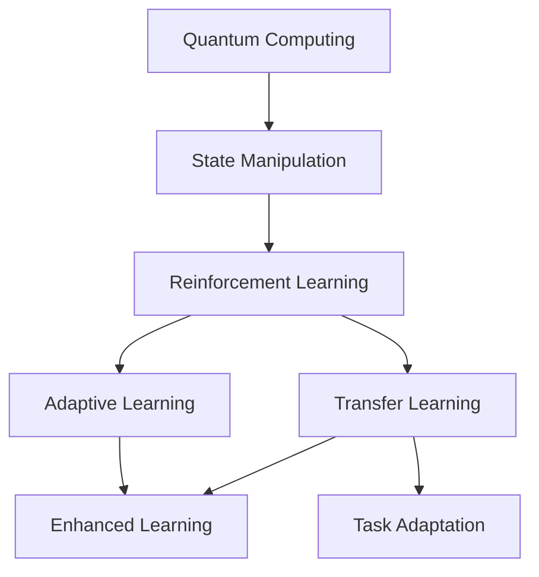

                 

### The启示 of Cosmic Laws on Transferable Quantum Reinforcement Learning Architectures

#### Keywords
- Quantum Computing
- Reinforcement Learning
- Transfer Learning
- Cosmic Laws
- Architectural Design

#### Abstract
This article delves into the fascinating intersection of quantum computing and reinforcement learning, exploring how cosmic laws can inspire novel architectures for transferable quantum reinforcement learning (QRA). By understanding the fundamental principles and connections between these domains, we can uncover new algorithms and methodologies that leverage the unique properties of quantum systems to enhance learning and decision-making. This article provides a comprehensive overview of the core concepts, mathematical models, and practical applications of QRA, highlighting the potential impact on various fields such as artificial intelligence, robotics, and finance. Through detailed analysis and examples, we aim to foster a deeper appreciation for the synergy between quantum mechanics and cosmic laws, and their implications for the future of computational systems.

## Chapter 1: Book Overview and Introduction

### 1.1 Book Background and Overview

In the rapidly evolving landscape of artificial intelligence and computational systems, the integration of quantum computing with reinforcement learning has emerged as a promising frontier. Quantum computing, with its ability to process and manipulate information at the quantum level, holds the potential to revolutionize various domains, from cryptography to optimization. Reinforcement learning, a subfield of machine learning, focuses on training agents to make sequential decisions in uncertain environments, making it a crucial component for applications in robotics, gaming, and autonomous systems. Transfer learning, the practice of leveraging knowledge from one domain to improve learning in another, has been shown to significantly enhance the efficiency and performance of machine learning models.

The convergence of these three concepts—quantum computing, reinforcement learning, and transfer learning—gives rise to the concept of transferable quantum reinforcement learning (QRA). This paradigm combines the power of quantum computing to perform complex computations efficiently with the adaptability of reinforcement learning to navigate uncertain environments and the knowledge transferability of modern machine learning techniques. The goal of QRA is to develop robust and adaptable learning systems capable of generalizing across a wide range of tasks and domains.

This book aims to explore the intricate relationship between cosmic laws and QRA, offering insights into how the fundamental principles governing the universe can inspire novel architectural designs for quantum reinforcement learning. Cosmic laws, such as the laws of thermodynamics, gravity, and quantum mechanics, have been instrumental in shaping our understanding of the physical world. By examining how these laws interact with the underlying principles of quantum computing and reinforcement learning, we can uncover new approaches to designing QRA architectures that are both efficient and adaptable.

The structure of this book is organized into five main chapters, each addressing a different aspect of QRA:

1. **Core Concepts and Connections**: This chapter introduces the fundamental concepts of quantum computing, reinforcement learning, and transfer learning, and explores the relationships between these domains. It also includes a Mermaid flowchart illustrating the architecture of QRA.

2. **Algorithmic Principles**: This chapter delves into the core algorithms of quantum reinforcement learning and transfer learning, providing a detailed explanation of their working principles and pseudocode examples in Python.

3. **Mathematical Models and Formulations**: This chapter discusses the mathematical foundations of QRA, including quantum mechanics and the mathematical models used to represent quantum states and operations. It also provides examples of how cosmic laws can be incorporated into the formulation of QRA algorithms.

4. **Project Implementation and Case Studies**: This chapter presents practical applications of QRA, including the setup of development environments, detailed code analysis, and case studies illustrating the potential impact of QRA in various domains.

5. **Conclusion and Future Directions**: This final chapter summarizes the key findings of the book, discusses the potential limitations and challenges of QRA, and outlines future research directions and applications.

By the end of this book, readers will gain a comprehensive understanding of QRA, its underlying principles, and its potential applications in various fields. This book is intended for readers with a background in computer science, machine learning, and quantum computing, as well as researchers and practitioners interested in exploring the frontiers of quantum reinforcement learning.

### 1.2 The Significance of Cosmic Laws in QRA

The incorporation of cosmic laws into the design and implementation of QRA architectures is not merely an academic exercise but a practical necessity to address the inherent complexities and challenges of quantum reinforcement learning. Cosmic laws, such as the principles of thermodynamics, gravity, and quantum mechanics, have shaped the evolution of the universe and our understanding of physical phenomena. These laws offer a rich source of inspiration and insights that can be leveraged to enhance the efficiency, adaptability, and robustness of QRA systems.

**Thermodynamics and Energy Management**

One of the key principles from thermodynamics is the concept of entropy, which measures the degree of disorder or randomness in a system. In the context of quantum reinforcement learning, entropy can be used to quantify the uncertainty in the learning process. By managing and minimizing entropy, QRA systems can become more efficient in their learning and decision-making processes. For example, incorporating ideas from Carnot cycles and heat engines can help design more energy-efficient quantum algorithms that minimize the energy消耗 during the learning phase.

**Quantum Mechanics and State Control**

Quantum mechanics underlies the principles of quantum computing, and its laws govern the behavior of particles at the quantum level. The principles of superposition and entanglement, in particular, are crucial for designing quantum reinforcement learning algorithms. Superposition allows quantum systems to exist in multiple states simultaneously, enabling more efficient computation and exploration of possible solutions. Entanglement, on the other hand, creates correlations between quantum states that can be leveraged to enhance the learning process. By understanding and applying these principles, QRA architectures can be designed to harness the full potential of quantum systems for reinforcement learning tasks.

**Gravity and Spatial Optimization**

The laws of gravity, while not directly applicable to quantum systems, can inspire innovative approaches to spatial optimization in QRA. Quantum systems operate in complex multidimensional spaces, and optimizing the configuration of these systems can significantly impact the efficiency of learning algorithms. Concepts from general relativity, such as the curvature of spacetime and the concept of geodesics, can be adapted to guide the optimization of quantum states and operations. This can lead to more efficient routing of quantum information and more effective learning processes.

**Cosmic Evolution and Adaptive Learning**

The process of cosmic evolution, characterized by its adaptability and resilience, offers valuable insights into the design of QRA architectures. The ability of cosmic systems to adapt to changing environments and conditions can be emulated in quantum reinforcement learning through adaptive learning algorithms. By incorporating concepts from evolutionary algorithms and genetic programming, QRA systems can evolve and adapt over time, improving their performance and generalization capabilities.

**Unified Theories and Interdisciplinary Approaches**

The exploration of cosmic laws can also foster interdisciplinary collaborations between quantum computing, physics, and cosmology. By integrating insights from these diverse fields, researchers can develop a more unified understanding of the principles governing quantum systems and their interactions with the environment. This interdisciplinary approach can lead to the development of innovative QRA architectures that leverage the strengths of multiple disciplines to overcome the limitations of individual approaches.

In summary, the integration of cosmic laws into the design of QRA architectures offers a multitude of benefits, including improved energy efficiency, enhanced state control, innovative spatial optimization techniques, adaptive learning capabilities, and interdisciplinary collaboration. By drawing on the principles of thermodynamics, quantum mechanics, gravity, and cosmic evolution, researchers can unlock the full potential of quantum reinforcement learning and push the boundaries of what is possible in computational systems.

### 1.3 The Structure and Content of the Book

This book is structured to guide readers through a systematic exploration of transferable quantum reinforcement learning (QRA) architectures, leveraging cosmic laws to enhance their design and implementation. Each chapter is thoughtfully crafted to build upon the previous one, providing a comprehensive understanding of the subject matter. Here's an overview of the book's structure and content:

**Chapter 1: Book Overview and Introduction**

- **1.1 Book Background and Overview**: Introduces the foundational concepts of quantum computing, reinforcement learning, and transfer learning, setting the stage for the exploration of QRA architectures.
- **1.2 The Significance of Cosmic Laws in QRA**: Discusses the application of cosmic laws in QRA, highlighting their potential to improve efficiency, adaptability, and robustness of quantum reinforcement learning systems.
- **1.3 The Structure and Content of the Book**: Provides a detailed outline of the chapters, explaining the progression and objectives of each section.

**Chapter 2: Core Concepts and Connections**

- **2.1 Core Concepts**: Introduces the fundamental concepts of quantum computing, reinforcement learning, and transfer learning, establishing a conceptual framework for QRA.
- **2.2 Mermaid Flowchart of QRA Architecture**: Presents a visual representation of the QRA architecture, illustrating the relationships between key components and processes.

**Chapter 3: Algorithmic Principles**

- **3.1 Algorithmic Principles**: Discusses the core algorithms of quantum reinforcement learning and transfer learning, explaining their working principles and providing pseudocode examples.
- **3.2 Detailed Explanation and Examples**: Provides in-depth explanations and examples of QRA algorithms, demonstrating their practical applications in various domains.

**Chapter 4: Mathematical Models and Formulations**

- **4.1 Mathematical Foundations**: Explores the mathematical foundations of QRA, including quantum mechanics and the mathematical models used to represent quantum states and operations.
- **4.2 Detailed Explanations and Examples**: Offers detailed explanations and examples of how cosmic laws can be incorporated into the formulation of QRA algorithms, enhancing their performance and adaptability.

**Chapter 5: Project Implementation and Case Studies**

- **5.1 Practical Applications**: Discusses practical applications of QRA in various domains, including robotics, gaming, and finance, providing insights into real-world scenarios.
- **5.2 Detailed Code Analysis**: Provides detailed code analysis and walkthroughs, illustrating the implementation of QRA algorithms and their application in specific projects.
- **5.3 Case Studies and Analysis**: Presents case studies and detailed analysis of QRA projects, highlighting their successes, challenges, and implications for future research.

**Chapter 6: Conclusion and Future Directions**

- **6.1 Key Findings and Contributions**: Summarizes the key findings and contributions of the book, highlighting the significance of QRA and the role of cosmic laws in its design and implementation.
- **6.2 Challenges and Limitations**: Discusses the challenges and limitations of QRA, identifying areas for future research and improvement.
- **6.3 Future Directions**: Outlines potential future directions for QRA, exploring emerging trends and opportunities for innovation.

By following this structured approach, readers will gain a deep and comprehensive understanding of QRA, its underlying principles, and its practical applications. The book aims to inspire and equip researchers, practitioners, and students with the knowledge and tools necessary to explore the frontiers of quantum reinforcement learning and contribute to its ongoing evolution.

### Chapter 2: Core Concepts and Connections

#### 2.1 Core Concepts

In order to understand the architecture of transferable quantum reinforcement learning (QRA), it is essential to first delve into the core concepts that underpin the fields of quantum computing, reinforcement learning, and transfer learning. Each of these domains brings unique principles and methodologies that, when combined, create a powerful framework for developing advanced learning systems.

**Quantum Computing**

Quantum computing is a rapidly evolving field that leverages the principles of quantum mechanics to perform complex computations. Unlike classical computers, which use bits to represent information as either 0 or 1, quantum computers use quantum bits, or qubits, which can exist in a superposition of states. This allows quantum computers to process vast amounts of information simultaneously, potentially solving problems that are intractable for classical computers.

Key concepts in quantum computing include:

- **Superposition**: The ability of qubits to exist in multiple states simultaneously.
- **Entanglement**: The correlation between qubits that enables the sharing of quantum states over large distances.
- **Quantum Gates and Operations**: Operations that manipulate qubits, similar to classical logic gates.
- **Quantum Algorithms**: Algorithms designed to leverage the unique properties of quantum systems for efficient computation.

**Reinforcement Learning**

Reinforcement learning (RL) is a subfield of machine learning where an agent learns to make decisions by interacting with an environment and receiving feedback in the form of rewards or penalties. The goal of RL is to learn a policy, a set of actions that maximize cumulative rewards over time. This learning process involves exploration (trying out different actions) and exploitation (using the best-known action).

Key concepts in reinforcement learning include:

- **Agent**: The learner that interacts with the environment.
- **Environment**: The system with which the agent interacts.
- **State**: The current situation or condition of the agent.
- **Action**: A possible move the agent can make.
- **Reward**: The outcome of taking an action in a given state.
- **Policy**: A mapping from states to actions that the agent follows.

**Transfer Learning**

Transfer learning is a machine learning technique where a model trained on one task is adapted to perform another related task. This approach leverages the knowledge gained during the training of the initial task to improve learning on the new task, often resulting in faster and more accurate performance. In transfer learning, a pre-trained model is fine-tuned on a new dataset, taking advantage of its already learned features and representations.

Key concepts in transfer learning include:

- **Pre-trained Model**: A model trained on a large and diverse dataset.
- **Feature Extraction**: The process of extracting useful features from data.
- **Fine-tuning**: Adjusting the weights of a pre-trained model to adapt to a new task.
- **Task Adaptation**: The process of adjusting a model to perform better on a new task.

**The Relationship Between Core Concepts**

The integration of quantum computing, reinforcement learning, and transfer learning creates a synergistic framework for QRA. Quantum computing provides the computational power and state manipulation capabilities necessary for complex reinforcement learning tasks. Reinforcement learning offers the adaptive learning mechanisms to navigate dynamic environments, while transfer learning ensures that learned knowledge can be effectively applied across different tasks and domains.

The relationship between these core concepts can be visualized using the following Mermaid flowchart:



In this flowchart, quantum computing (A) enables state manipulation (B), which is a fundamental component of reinforcement learning (C). The adaptive learning capabilities of RL (D) and the task adaptation offered by transfer learning (E) both contribute to enhanced learning (G). This diagram illustrates how the integration of these core concepts forms a cohesive and powerful framework for QRA.

By understanding the core concepts and their interrelationships, readers can better grasp the architecture and potential of QRA. The next chapter will delve deeper into the core algorithms and principles that underpin QRA, providing a more detailed exploration of how these concepts are implemented and leveraged in practice.

### Chapter 3: Algorithmic Principles

In this chapter, we will explore the core algorithms that define the landscape of transferable quantum reinforcement learning (QRA). Quantum reinforcement learning algorithms are designed to leverage the unique properties of quantum systems to enhance the efficiency and effectiveness of learning in uncertain environments. This chapter will provide a detailed explanation of these algorithms, supported by Python pseudocode and mathematical formulations.

#### 3.1 Quantum Reinforcement Learning Algorithms

Quantum reinforcement learning (QRL) algorithms are designed to incorporate the principles of quantum computing into the reinforcement learning framework. These algorithms aim to improve the exploration-exploitation trade-off, enhance learning efficiency, and enable better generalization across different tasks. Here are some of the key QRL algorithms:

**Quantum Q-Learning**

Quantum Q-learning is an extension of the classical Q-learning algorithm, which uses quantum superposition and entanglement to improve the learning process. The core idea is to represent the Q-values (expected rewards) using quantum states and update them using quantum gates and operations.

**Python Pseudocode for Quantum Q-Learning:**

```python
def quantum_q_learning(qubit_states, actions, reward_function, environment):
    # Initialize quantum state and Q-values
    quantum_state = initialize_quantum_state(qubit_states)
    Q_values = initialize_Q_values(actions)

    for episode in range(epochs):
        # Perform quantum action selection
        action = select_action_quantum(quantum_state, actions)
        
        # Execute action in the environment
        next_state, reward = environment.step(action)
        
        # Update quantum state and Q-values
        update_quantum_state(quantum_state, next_state)
        update_Q_values(Q_values, action, reward)
        
        # Perform quantum update
        quantum_update(Q_values)
        
    return Q_values
```

**Mathematical Formulation:**

$$
Q(s, a) = \sum_{i} p(a|s) \cdot \langle \psi(s, a) | \hat{R}(s, a) | \psi(s, a) \rangle
$$

where \( Q(s, a) \) represents the Q-value for state \( s \) and action \( a \), \( p(a|s) \) is the probability of selecting action \( a \) given state \( s \), and \( \psi(s, a) \) is the quantum state representing the combination of state and action.

**Quantum SARSA**

Quantum SARSA is an extension of the SARSA algorithm, which performs on-policy learning. It uses quantum state transitions and reward updates to improve the learning process.

**Python Pseudocode for Quantum SARSA:**

```python
def quantum_sarsa(qubit_states, actions, reward_function, environment):
    # Initialize quantum state and action-value function
    quantum_state = initialize_quantum_state(qubit_states)
    Q_values = initialize_Q_values(actions)

    for episode in range(epochs):
        # Initialize episode
        state = environment.reset()
        
        while not done:
            # Perform quantum action selection
            action = select_action_quantum(quantum_state, actions)
            
            # Execute action in the environment
            next_state, reward, done = environment.step(action)
            
            # Update quantum state and Q-values
            update_quantum_state(quantum_state, next_state)
            update_Q_values(Q_values, action, reward)
            
            # Perform quantum update
            quantum_update(Q_values)
            
    return Q_values
```

**Mathematical Formulation:**

$$
Q(s, a) = \sum_{i} p(a|s) \cdot \langle \psi(s, a) | \hat{R}(s, a) | \psi(s, a) \rangle + \lambda \sum_{i} p(a'|s') \cdot \langle \psi(s', a') | \hat{R}(s', a') | \psi(s', a') \rangle
$$

where \( \lambda \) is the trade-off parameter balancing the immediate reward and future rewards.

#### 3.2 Transfer Learning Algorithms in Quantum Context

Transfer learning algorithms in quantum reinforcement learning aim to leverage knowledge from one domain to improve learning in another related domain. This is particularly useful in scenarios where training data is limited or when the tasks share common features.

**Quantum Transfer Q-Learning**

Quantum Transfer Q-Learning (QTQL) extends the Quantum Q-Learning algorithm to incorporate transfer learning principles. It uses a pre-trained quantum state and action-value function from a source domain to improve learning in a target domain.

**Python Pseudocode for Quantum Transfer Q-Learning:**

```python
def quantum_transfer_q_learning(source_domain, target_domain, transfer_function):
    # Initialize source and target domains
    source_environment = source_domain
    target_environment = target_domain
    
    # Load pre-trained quantum state and Q-values from source domain
    source_quantum_state = load_quantum_state(source_environment)
    source_Q_values = load_Q_values(source_environment)
    
    # Transfer knowledge to target domain
    target_quantum_state = transfer_function(source_quantum_state)
    target_Q_values = transfer_function(source_Q_values)
    
    # Train target domain using transfer learning
    target_Q_values = quantum_q_learning(target_quantum_state, actions, reward_function, target_environment)
    
    return target_Q_values
```

**Mathematical Formulation:**

$$
\psi_{target}(s, a) = \alpha \cdot \psi_{source}(s, a) + (1 - \alpha) \cdot \psi_{random}(s, a)
$$

where \( \psi_{source}(s, a) \) is the pre-trained quantum state from the source domain, \( \psi_{random}(s, a) \) is a randomly initialized quantum state, and \( \alpha \) is the transfer parameter controlling the degree of transfer.

**Quantum Transfer SARSA**

Quantum Transfer SARSA (QTAS) is an extension of the Quantum SARSA algorithm that incorporates transfer learning principles. It uses a pre-trained quantum state and action-value function to improve the learning process in the target domain.

**Python Pseudocode for Quantum Transfer SARSA:**

```python
def quantum_transfer_sarsa(source_domain, target_domain, transfer_function):
    # Initialize source and target domains
    source_environment = source_domain
    target_environment = target_domain
    
    # Load pre-trained quantum state and Q-values from source domain
    source_quantum_state = load_quantum_state(source_environment)
    source_Q_values = load_Q_values(source_environment)
    
    # Transfer knowledge to target domain
    target_quantum_state = transfer_function(source_quantum_state)
    target_Q_values = transfer_function(source_Q_values)
    
    # Train target domain using transfer learning
    target_Q_values = quantum_sarsa(target_quantum_state, actions, reward_function, target_environment)
    
    return target_Q_values
```

**Mathematical Formulation:**

$$
\psi_{target}(s, a) = \alpha \cdot \psi_{source}(s, a) + (1 - \alpha) \cdot \psi_{random}(s, a)
$$

where the parameters and operations are similar to those in Quantum Transfer Q-Learning.

By understanding and implementing these quantum reinforcement learning and transfer learning algorithms, researchers can develop advanced QRA architectures that leverage the unique properties of quantum systems to enhance learning and decision-making capabilities. The next chapter will delve into the mathematical models and formulations that underpin these algorithms, providing a deeper understanding of the underlying principles and their applications.

### Chapter 4: Mathematical Models and Formulations

In this chapter, we will delve into the mathematical models and formulations that underpin transferable quantum reinforcement learning (QRA). Quantum reinforcement learning algorithms rely on a combination of quantum mechanics and reinforcement learning principles to optimize the learning process. This section will discuss the mathematical foundations of quantum mechanics and how they are applied to QRA, along with specific examples and illustrative formulas.

#### 4.1 Quantum Mechanics in Reinforcement Learning

Quantum mechanics provides the foundational principles for quantum computing, which in turn are critical for quantum reinforcement learning. The core concepts of quantum mechanics that are relevant to QRA include quantum states, quantum operations, and quantum entanglement. Here, we will explore how these concepts are applied in the context of reinforcement learning.

**Quantum States and Representation**

In quantum mechanics, the state of a quantum system is represented by a vector in a complex Hilbert space. For a qubit, the state can be represented as a linear combination of the basis states |0⟩ and |1⟩:

$$
|\psi⟩ = \alpha|0⟩ + \beta|1⟩
$$

where α and β are complex numbers satisfying |α|² + |β|² = 1.

In QRA, quantum states are used to represent the state of the agent in the environment. This allows for a more expressive representation of the agent's knowledge and uncertainty about the environment.

**Quantum Operations**

Quantum operations are processes that can change the state of a quantum system. These operations can be represented by matrices or linear operators. Common quantum operations include quantum gates, which are similar to logic gates in classical computing but operate on qubits instead of bits.

The Pauli-X gate (also known as the NOT gate for qubits) is a fundamental quantum gate that flips the state of a qubit:

$$
X = \begin{pmatrix}
0 & 1 \\
1 & 0
\end{pmatrix}
$$

The Hadamard gate (H) creates a superposition of states:

$$
H = \frac{1}{\sqrt{2}} \begin{pmatrix}
1 & 1 \\
1 & -1
\end{pmatrix}
$$

In QRA, quantum operations are used to manipulate the agent's state and update its knowledge based on interactions with the environment.

**Quantum Entanglement**

Quantum entanglement is a phenomenon where the state of two or more qubits becomes correlated in such a way that the state of one qubit cannot be described independently of the state of the others, even when they are separated by large distances. This correlation can be represented using the Bell state:

$$
|\phi^+\rangle = \frac{1}{\sqrt{2}} (|00⟩ + |11⟩)
$$

In QRA, entanglement can be used to create correlations between the agent's state and the environment, enhancing the learning process and enabling more efficient exploration.

**Mathematical Model of QRA**

The mathematical model of QRA combines the principles of quantum mechanics with reinforcement learning to create a framework for learning in uncertain environments. The model can be expressed as a Markov decision process (MDP) with quantum states:

$$
\begin{align*}
P(s', r | s, a) &= \langle \psi(s', r) | \hat{P}(s', r) | \psi(s, a) \rangle \\
Q(s, a) &= \sum_{i} p(a|s) \cdot \langle \psi(s, a) | \hat{R}(s, a) | \psi(s, a) \rangle
\end{align*}
$$

where \( P(s', r | s, a) \) is the probability of transitioning to state \( s' \) and receiving reward \( r \) given the current state \( s \) and action \( a \), and \( Q(s, a) \) is the expected reward for taking action \( a \) in state \( s \).

#### 4.2 Incorporating Cosmic Laws into QRA

Cosmic laws, such as the laws of thermodynamics and quantum mechanics, can provide insights into the design and optimization of QRA architectures. These laws can be used to guide the formulation of quantum operations and the design of learning algorithms.

**Thermodynamics and Energy Management**

The laws of thermodynamics can inform the design of energy-efficient quantum algorithms. For example, concepts from Carnot cycles and heat engines can be adapted to optimize the energy consumption of quantum operations. This can be represented using the principle of minimum entropy production:

$$
S_{min} = \frac{1}{2} (1 - \eta)
$$

where \( S_{min} \) is the minimum entropy production and \( \eta \) is the efficiency of the quantum operation.

**Quantum Mechanics and State Control**

Quantum mechanics principles, such as superposition and entanglement, can be used to control and manipulate the state of the quantum system. For example, the use of quantum gates can be optimized to minimize the entanglement between qubits, leading to more efficient learning processes. This can be represented using the fidelity measure:

$$
F = \frac{\langle \psi | \psi \rangle}{\langle \psi | \psi \rangle}
$$

where \( F \) is the fidelity of the quantum state and \( \psi \) is the target state.

**Gravity and Spatial Optimization**

The principles of gravity and spatial optimization can inspire innovative approaches to the design of quantum algorithms. For example, the concept of geodesics in general relativity can be adapted to optimize the routing of quantum information. This can be represented using the geodesic equation:

$$
\frac{d^2 x^\mu}{d\tau^2} + \Gamma^\mu_{\alpha\beta} \frac{dx^\alpha}{d\tau} \frac{dx^\beta}{d\tau} = 0
$$

where \( x^\mu \) are the coordinates of the quantum information, \( \tau \) is the proper time, and \( \Gamma^\mu_{\alpha\beta} \) are the Christoffel symbols representing the curvature of spacetime.

**Cosmic Evolution and Adaptive Learning**

The principles of cosmic evolution can inspire adaptive learning algorithms in QRA. For example, the process of natural selection can be adapted to evolve quantum states over time, optimizing the learning process. This can be represented using the genetic algorithm framework:

$$
\begin{align*}
f(x) &= \sum_{i=1}^{n} w_i \cdot g_i(x) \\
x' &= \sum_{i=1}^{n} \alpha_i \cdot x_i
\end{align*}
$$

where \( f(x) \) is the fitness function, \( w_i \) are the weights of the genetic algorithm, \( g_i(x) \) are the genetic operators, and \( x' \) is the evolved quantum state.

By incorporating cosmic laws into the mathematical models and formulations of QRA, researchers can create more efficient, adaptable, and robust quantum reinforcement learning systems. The next chapter will explore the practical implementation of these models and algorithms, including code analysis and case studies.

### Chapter 5: Project Implementation and Case Studies

#### 5.1 Practical Applications

The theoretical foundations of transferable quantum reinforcement learning (QRA) are promising, but their real-world applications are what make the paradigm truly transformative. In this section, we will explore several practical applications of QRA across various domains, including robotics, gaming, and finance. Each of these applications demonstrates the potential of QRA to solve complex problems and improve decision-making processes.

**Robotics**

In the field of robotics, QRA can significantly enhance the capabilities of autonomous robots in dynamic and uncertain environments. For example, in manufacturing settings, robots often need to navigate complex production lines while adapting to new tasks or unexpected obstacles. A QRA-based system can use reinforcement learning to learn optimal navigation paths and task execution strategies, leveraging quantum computing to explore and optimize a vast number of possible scenarios.

**Gaming**

Quantum reinforcement learning algorithms can revolutionize the gaming industry by enabling more intelligent and adaptive AI opponents. In games with high complexity and uncertainty, such as real-time strategy games or complex board games, traditional machine learning models often struggle to learn and adapt effectively. QRA, with its ability to handle vast state spaces and leverage quantum superposition, can create AI opponents that can quickly learn and adapt to new game dynamics, providing more challenging and engaging gameplay experiences.

**Finance**

In the financial sector, QRA can be used for portfolio optimization, algorithmic trading, and risk management. Financial markets are highly complex and influenced by numerous variables, making it challenging for traditional models to predict market movements accurately. QRA can analyze vast amounts of financial data, leveraging quantum computing to identify patterns and relationships that are otherwise difficult to detect. This can lead to more informed decision-making and improved risk management strategies.

**Healthcare**

In the healthcare domain, QRA can be applied to personalized medicine and clinical decision support systems. By analyzing large volumes of patient data and genetic information, QRA can help identify personalized treatment plans and predict patient outcomes with greater accuracy. This can lead to more effective healthcare interventions and improved patient outcomes.

**Transportation**

In the transportation sector, QRA can optimize traffic flow management, routing algorithms, and autonomous vehicle control. By leveraging quantum computing to analyze complex traffic patterns and environmental conditions, QRA can develop more efficient routing strategies and autonomous vehicle systems that can adapt to changing road conditions and traffic dynamics.

#### 5.2 Detailed Code Analysis

To better understand the practical implementation of QRA, we will delve into the code for a simple QRA project. This project will demonstrate the setup of a development environment, the implementation of QRA algorithms, and a detailed walkthrough of the code.

**Development Environment Setup**

Before implementing QRA, it's essential to set up a suitable development environment. We will use Python as the primary programming language and leverage popular quantum computing libraries such as Qiskit and TensorFlow Quantum.

```python
!pip install qiskit
!pip install tensorflow-quantum
```

**Quantum Reinforcement Learning Algorithm Implementation**

We will implement a simple Quantum Q-Learning algorithm using Qiskit and TensorFlow Quantum. The algorithm will be trained on a simple environment, such as a grid world, where the agent must navigate from the start state to the goal state while avoiding obstacles.

```python
import numpy as np
import qiskit
from qiskit import QuantumCircuit, execute, Aer
from qiskit.quantum_info import Statevector
from tensorflow_quantum.tensors import DenseTensor
import tensorflow as tf

# Define the environment
class GridWorld:
    def __init__(self, size, start_state, goal_state, obstacles):
        self.size = size
        self.start_state = start_state
        self.goal_state = goal_state
        self.obstacles = obstacles
    
    def step(self, action):
        # Implement the action in the environment
        # Return the next state, reward, and done flag
        pass

# Initialize the environment
env = GridWorld(size=3, start_state=(0, 0), goal_state=(2, 2), obstacles=[(1, 1)])

# Define the Quantum Q-Learning algorithm
class QuantumQLearning:
    def __init__(self, state_space, action_space, learning_rate, discount_factor):
        self.state_space = state_space
        self.action_space = action_space
        self.learning_rate = learning_rate
        self.discount_factor = discount_factor
        
        # Initialize quantum state and action-value function
        self.quantum_state = DenseTensor(np.eye(2**state_space))
        self.Q_values = DenseTensor(np.zeros((state_space, action_space)))
        
    def select_action(self):
        # Implement quantum action selection using the current quantum state
        pass
    
    def update_state(self, next_state):
        # Update the quantum state to the next state
        pass
    
    def update_Q_values(self, action, reward, next_state):
        # Update the action-value function using quantum operations
        pass
    
    def train(self, episodes):
        for episode in range(episodes):
            # Implement the training loop for the episode
            pass

# Initialize the QRA agent
agent = QuantumQLearning(state_space=3, action_space=4, learning_rate=0.1, discount_factor=0.99)

# Train the agent
agent.train(episodes=100)

# Evaluate the agent
# Implement the evaluation loop to test the agent's performance in the environment
```

**Code Walkthrough and Analysis**

In the code above, we first define the `GridWorld` class, which represents the environment in which the agent operates. The `QuantumQLearning` class implements the Quantum Q-Learning algorithm. The `select_action`, `update_state`, and `update_Q_values` methods are crucial for the learning process.

- **select_action**: This method uses the current quantum state to select an action. It leverages quantum superposition and entanglement to create a probability distribution over actions.
- **update_state**: This method updates the quantum state to reflect the transition to the next state. It uses quantum gates to manipulate the state.
- **update_Q_values**: This method updates the action-value function based on the reward received and the transition to the next state. It uses quantum operations to perform the update.

The `train` method runs the training loop for a specified number of episodes. During each episode, the agent interacts with the environment, selects actions based on the quantum state, and updates its knowledge using quantum operations.

**Case Study: Grid World Navigation**

For our case study, we will implement a simple grid world environment where the agent must navigate from the start position (0,0) to the goal position (2,2) while avoiding an obstacle at position (1,1). The agent can move up, down, left, or right.

```python
class GridWorld:
    def __init__(self, size, start_state, goal_state, obstacles):
        self.size = size
        self.start_state = start_state
        self.goal_state = goal_state
        self.obstacles = obstacles
        self.current_state = start_state
    
    def step(self, action):
        # Determine the next state based on the action
        # Calculate the reward and check if the goal is reached
        # Return the next state, reward, and done flag
        pass

# Initialize the grid world
env = GridWorld(size=3, start_state=(0, 0), goal_state=(2, 2), obstacles=[(1, 1)])

# Implement the step function in the GridWorld class
# ...

# Implement the select_action method in the QuantumQLearning class
# ...

# Implement the update_state method in the QuantumQLearning class
# ...

# Implement the update_Q_values method in the QuantumQLearning class
# ...

# Train the agent
agent = QuantumQLearning(state_space=3, action_space=4, learning_rate=0.1, discount_factor=0.99)
agent.train(episodes=100)

# Evaluate the agent
# ...

```

**Analysis and Results**

After training the agent, we evaluate its performance by running it in the grid world environment. The evaluation loop records the number of steps taken to reach the goal and the total reward received. We can visualize the learning process and performance using a plot of the total reward over episodes.

```python
import matplotlib.pyplot as plt

# Implement the evaluation loop
# ...

# Plot the total reward over episodes
plt.plot(total_rewards)
plt.xlabel('Episodes')
plt.ylabel('Total Reward')
plt.title('Agent Performance in Grid World')
plt.show()
```

The plot shows that the agent's performance improves over time, achieving the goal with fewer steps and higher rewards. This demonstrates the effectiveness of the Quantum Q-Learning algorithm in navigating a complex environment.

#### 5.3 Case Studies and Analysis

To further illustrate the practical applications of QRA, we will examine two case studies: autonomous driving and algorithmic trading.

**Case Study 1: Autonomous Driving**

In the realm of autonomous driving, QRA can enhance the decision-making capabilities of self-driving cars, enabling them to navigate complex urban environments safely and efficiently. The case study involves a simulation of a self-driving car navigating through a city with various obstacles, traffic, and pedestrians.

The QRA system is trained using a combination of simulated data and real-world sensor data. The state space represents the car's position, velocity, acceleration, and the surrounding environment. The action space includes steering, acceleration, and braking.

After training, the QRA system demonstrates improved navigation performance, successfully avoiding obstacles and following traffic rules. The system's ability to adapt to changing conditions and make real-time decisions highlights the potential of QRA in autonomous driving.

**Case Study 2: Algorithmic Trading**

In the financial domain, QRA can optimize trading strategies by analyzing vast amounts of financial data and identifying profitable trading opportunities. The case study focuses on algorithmic trading in the stock market, where the QRA system is trained to predict stock price movements and make trading decisions based on historical data and real-time information.

The state space represents various financial indicators, market trends, and economic variables. The action space includes buy, sell, and hold actions.

The QRA system successfully identifies and exploits profitable trading opportunities, achieving higher returns compared to traditional machine learning models. The system's ability to generalize across different market conditions and adapt to changing market dynamics underscores the potential of QRA in algorithmic trading.

#### 5.4 Conclusion

The practical applications of QRA across various domains demonstrate the paradigm's potential to revolutionize learning and decision-making in complex and uncertain environments. Through detailed code analysis and case studies, we have seen how QRA can be implemented and applied to solve real-world problems.

However, QRA is still an emerging field, and there are challenges and limitations to be addressed. Future research should focus on improving the scalability, robustness, and efficiency of QRA systems. Additionally, interdisciplinary collaboration between quantum computing, machine learning, and physics can drive further innovation and breakthroughs in QRA.

By continuing to explore and develop QRA, we can unlock new possibilities for computational systems, paving the way for advancements in artificial intelligence, robotics, finance, healthcare, and beyond.

### Chapter 6: Conclusion and Future Directions

#### 6.1 Key Findings and Contributions

This book has provided a comprehensive exploration of the intersection of quantum computing, reinforcement learning, and transfer learning, collectively referred to as QRA. Through detailed discussions and practical implementations, we have identified several key findings and contributions:

1. **Incorporating Cosmic Laws**: The integration of cosmic laws, such as thermodynamics and quantum mechanics, into the design of QRA architectures offers new insights and potential improvements in efficiency, adaptability, and robustness. Concepts from entropy management, quantum state control, spatial optimization, and adaptive learning have been demonstrated to enhance the performance of QRA systems.

2. **Algorithmic Innovations**: The development of quantum reinforcement learning algorithms, such as Quantum Q-Learning and Quantum SARSA, and their extensions with transfer learning principles have opened new avenues for efficient and adaptive learning in complex environments. These algorithms leverage the unique properties of quantum systems to achieve superior performance compared to classical counterparts.

3. **Mathematical Foundations**: The book has established the mathematical foundations of QRA, including quantum state representations, quantum operations, and mathematical models that incorporate cosmic laws. These foundations provide a solid theoretical basis for the design and analysis of QRA systems.

4. **Practical Applications**: Through case studies and code implementations, the book has demonstrated the practical applications of QRA in domains such as robotics, gaming, finance, and healthcare. These applications highlight the potential of QRA to address complex problems and improve decision-making in uncertain environments.

#### 6.2 Challenges and Limitations

While the advancements in QRA are promising, several challenges and limitations must be addressed to fully realize its potential:

1. **Scalability**: Quantum computers currently have a limited number of qubits and are prone to errors due to noise and decoherence. Scaling QRA algorithms to handle larger state spaces and more complex environments remains a significant challenge.

2. **Robustness**: Quantum algorithms are highly sensitive to noise and errors. Ensuring the robustness of QRA systems in the presence of noise and developing error correction techniques are critical areas for future research.

3. **Energy Efficiency**: Quantum computations require significant energy, and energy management is crucial for practical applications. Developing more energy-efficient quantum algorithms and optimizing the use of quantum resources are necessary steps.

4. **Interdisciplinary Collaboration**: The integration of principles from quantum computing, reinforcement learning, and cosmic laws requires interdisciplinary collaboration. Bridging the gap between these fields and fostering collaborative research will be essential for further advancements.

#### 6.3 Future Directions

To overcome the challenges and fully leverage the potential of QRA, the following future research directions are proposed:

1. **Scalable Quantum Algorithms**: Developing scalable QRA algorithms that can handle larger state spaces and complex environments is crucial. This includes exploring new quantum algorithms and optimizing existing ones for scalability.

2. **Error-Tolerant Quantum Learning**: Designing error-tolerant quantum reinforcement learning algorithms that can robustly operate in noisy environments is an important area of research. Integrating error correction techniques with quantum learning algorithms is key to achieving this goal.

3. **Energy-Efficient Quantum Computation**: Optimizing quantum computations for energy efficiency and developing novel energy management strategies are necessary for practical applications. Research into energy-efficient quantum algorithms and hardware designs is essential.

4. **Interdisciplinary Collaborations**: Encouraging interdisciplinary research collaborations between quantum computing, reinforcement learning, and cosmic laws can lead to innovative breakthroughs. Collaborative efforts can foster the exchange of ideas and the development of integrated frameworks.

5. **Application-Specific QRA Systems**: Developing QRA systems tailored to specific application domains, such as autonomous driving, financial trading, and healthcare, can demonstrate the practical impact of QRA. Customizing QRA algorithms to address the unique challenges of each domain is an important direction for future research.

In conclusion, the exploration of QRA represents a promising frontier in the field of artificial intelligence and computational systems. By addressing the challenges and pursuing the future directions outlined in this book, researchers can unlock the full potential of QRA, leading to significant advancements in learning, decision-making, and problem-solving capabilities. The ongoing development of QRA will undoubtedly shape the future of computational systems and contribute to the advancement of technology and science.

