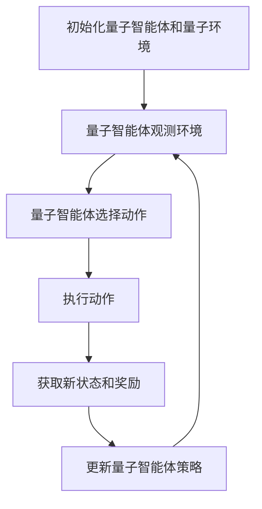
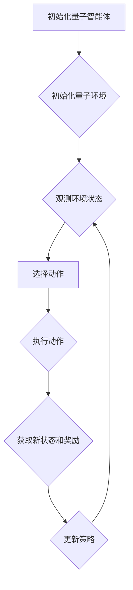

                 

### 《宇宙规律对可转移量子强化学习稳定性的启示》

#### 关键词
- 量子计算
- 强化学习
- 可转移学习
- 宇宙规律
- 稳定性分析

#### 摘要
本文旨在探讨宇宙规律对可转移量子强化学习稳定性的启示。首先，我们介绍了量子计算和量子机器学习的基本概念，以及可转移量子强化学习的基本原理。随后，我们探讨了量子计算与宇宙规律之间的联系，并通过Mermaid流程图展示了量子计算在强化学习中的应用。接着，我们详细讲解了可转移量子强化学习算法的原理，并通过Python源代码结合数学模型和公式进行了通俗易懂的举例说明。此外，我们还通过实际项目实战，展示了开发环境搭建、源代码实现及代码解读与分析。最后，我们对可转移量子强化学习的发展趋势、宇宙规律在量子计算中的应用前景以及潜在挑战与解决方案进行了展望。

## 引言

在当今科技迅猛发展的时代，量子计算作为一种颠覆性的计算技术，正逐步从理论走向实践，其在计算机科学和人工智能领域引发了一场革命。量子计算的独特性质，如叠加态和纠缠态，使得它在处理复杂问题上具有巨大的潜力。与此同时，强化学习作为机器学习的一个重要分支，通过智能体与环境互动，不断优化决策策略，已在诸多领域取得了显著成果。近年来，随着量子计算和强化学习技术的不断发展，可转移量子强化学习逐渐成为研究热点。

可转移量子强化学习是一种结合量子计算和强化学习的技术，旨在通过量子计算的优势，提高强化学习算法在复杂环境中的稳定性和效率。然而，量子计算本身的非确定性特性和复杂环境之间的相互作用，使得可转移量子强化学习的稳定性成为一个亟待解决的问题。宇宙规律作为一种自然界的普遍原则，其在量子计算中的潜在作用引起了广泛关注。本文旨在探讨宇宙规律对可转移量子强化学习稳定性的启示，为相关研究提供理论支持和实践指导。

本文的结构安排如下：首先，我们将简要介绍量子计算和量子机器学习的基本概念，以及可转移量子强化学习的基本原理。接着，我们将探讨量子计算与宇宙规律之间的联系，并通过Mermaid流程图展示量子计算在强化学习中的应用。随后，我们将详细讲解可转移量子强化学习算法的原理，并通过Python源代码结合数学模型和公式进行举例说明。此外，我们还将通过实际项目实战，展示开发环境搭建、源代码实现及代码解读与分析。最后，我们将对可转移量子强化学习的发展趋势、宇宙规律在量子计算中的应用前景以及潜在挑战与解决方案进行展望。

## 量子计算与量子机器学习

量子计算是利用量子力学原理进行信息处理的一种计算模式，与经典计算相比，具有独特的优越性。量子计算的基本单位是量子比特（qubit），与经典比特不同，量子比特可以同时处于0和1的叠加状态，这使得量子计算机能够同时处理大量数据，从而在解决复杂问题时具有巨大的潜力。

量子计算机的关键组件包括量子门、量子寄存器和量子纠缠。量子门是量子计算机的基本操作单元，类似于经典计算中的逻辑门，但它作用于量子比特的状态，可以通过旋转和翻转量子比特的叠加态来实现特定的计算任务。量子寄存器是用于存储和操作量子比特的设备，类似于经典计算机中的寄存器。量子纠缠是量子计算中的一种特殊现象，当两个或多个量子比特处于纠缠态时，它们的状态将相互依赖，即使它们相隔很远，一个量子比特的状态变化也会立即影响到另一个量子比特的状态。这种特殊的依赖关系为量子计算提供了强大的并行计算能力。

量子机器学习是量子计算在人工智能领域的重要应用，它结合了量子计算的并行性和机器学习的自适应能力，旨在提高机器学习算法的性能。量子机器学习的主要任务包括量子特征提取、量子分类和量子回归等。在量子特征提取中，量子计算机可以通过量子算法快速提取数据的高维特征，从而提高传统机器学习算法的准确性。在量子分类和量子回归中，量子计算机可以通过量子神经网络（Quantum Neural Network, QNN）实现高效的数据分类和预测。

量子机器学习的一个关键挑战是如何将传统机器学习算法转化为量子算法。传统的机器学习算法通常基于概率统计和优化理论，而量子算法则需要利用量子计算的特殊性质，如叠加态和纠缠态。为了实现这一目标，研究人员提出了一系列量子机器学习算法，如量子支持向量机（Quantum Support Vector Machine, QSVM）、量子神经网络（Quantum Neural Network, QNN）和量子深度学习（Quantum Deep Learning, QDL）。

量子支持向量机是一种基于量子计算的分类算法，它利用量子计算机的并行性，能够在高维空间中快速找到最优分类超平面。量子神经网络是一种结合量子计算和神经网络的算法，它通过量子计算机的叠加态和纠缠态，实现高效的数据处理和特征提取。量子深度学习是一种基于多层神经网络和量子计算的算法，它能够处理大规模数据集，并在复杂任务中实现高效学习。

虽然量子机器学习在理论研究和实验验证方面取得了一些进展，但实际应用仍面临许多挑战。首先，量子计算机的硬件性能和稳定性尚未达到理想水平，限制了量子机器学习的实际应用。其次，量子算法的设计和优化需要深入理解量子计算的基本原理，这对于传统计算机科学家和机器学习专家来说是一个巨大的挑战。最后，量子机器学习的应用场景和实际需求还需要进一步研究和探索，以确定其在实际应用中的价值和可行性。

## 可转移量子强化学习

可转移量子强化学习是一种结合量子计算和强化学习的技术，它旨在通过量子计算的优势，提高强化学习算法在复杂环境中的稳定性和效率。强化学习是一种通过智能体与环境互动，不断优化决策策略的机器学习技术，它在自动驾驶、游戏AI和推荐系统等领域取得了显著成果。然而，在处理复杂和动态环境时，传统的强化学习算法往往面临收敛速度慢、稳定性差和可转移性低等挑战。为了克服这些挑战，可转移量子强化学习应运而生。

### 定义与基本原理

可转移量子强化学习（Transfer Quantum Reinforcement Learning, TQRL）是一种利用量子计算来增强传统强化学习算法的方法。其核心思想是通过量子计算的优势，如并行性和高效状态表示，来提高强化学习算法在复杂环境中的性能。TQRL主要包括以下几个关键组成部分：

1. **量子智能体**：量子智能体是可转移量子强化学习的基础，它通过量子算法来学习与环境交互的策略。量子智能体可以同时处理多个状态和动作，从而提高决策速度。

2. **量子环境**：量子环境是智能体进行交互的虚拟环境，它模拟现实世界中的复杂动态环境。量子环境可以支持多种任务，如机器人导航、游戏对战和资源优化等。

3. **量子奖励函数**：量子奖励函数是用于评估智能体行为的质量的函数，它通过量子计算来动态调整，以引导智能体学习最优策略。

4. **量子策略优化**：量子策略优化是通过量子计算来优化智能体的决策策略，以提高学习效率和稳定性。量子策略优化通常基于量子梯度下降算法，它通过量子并行计算来加速收敛过程。

### 工作流程

可转移量子强化学习的工作流程主要包括以下几个步骤：

1. **初始化**：初始化量子智能体和量子环境的参数，包括量子比特的数量、量子寄存器的配置和量子奖励函数的初始值。

2. **状态观测**：量子智能体通过量子测量获取当前环境的状态，并将其转换为量子状态向量。

3. **策略选择**：量子智能体利用量子算法来选择一个最佳动作，通常基于当前状态向量和策略参数。

4. **环境交互**：智能体执行所选动作，与环境进行交互，并获取新的状态和奖励。

5. **奖励评估**：量子奖励函数根据新状态和奖励调整智能体的策略参数。

6. **策略更新**：通过量子梯度下降算法，智能体更新其策略参数，以优化决策策略。

7. **重复**：重复上述步骤，直到智能体达到预定的学习目标或收敛条件。

### 实现方法

实现可转移量子强化学习通常需要以下几个步骤：

1. **量子算法设计**：设计合适的量子算法来处理状态观测、策略选择和策略更新等步骤。常用的量子算法包括量子支持向量机、量子神经网络和量子梯度下降等。

2. **量子计算资源配置**：配置量子计算机的资源，包括量子比特的数量、量子门的配置和量子纠缠的创建等。目前，常用的量子计算平台包括IBM Q、Google Quantum Suite和IonQ等。

3. **Python源代码实现**：使用Python等编程语言实现量子算法和强化学习算法的源代码，并结合数学模型和公式进行详细讲解。

4. **性能评估与优化**：通过模拟实验和实际应用，评估可转移量子强化学习的性能和稳定性，并进行相应的优化。

### 潜在优势

可转移量子强化学习具有以下几个潜在优势：

1. **高效性**：通过量子计算的优势，可转移量子强化学习能够在复杂环境中快速收敛，提高学习效率。

2. **稳定性**：量子计算的非确定性特性和状态叠加性质有助于提高强化学习算法的稳定性，减少波动和振荡。

3. **可转移性**：可转移量子强化学习能够通过量子计算的优势，提高学习策略在不同环境间的可转移性，从而实现更广泛的应用。

4. **并行性**：量子计算机的并行计算能力使得可转移量子强化学习能够同时处理多个状态和动作，从而提高决策速度。

### 挑战与未来展望

尽管可转移量子强化学习具有巨大的潜力，但其在实际应用中仍面临一些挑战。首先，量子计算机的性能和稳定性尚未达到理想水平，限制了其应用范围。其次，量子算法的设计和优化需要深入理解量子计算的基本原理，这对于传统计算机科学家和机器学习专家来说是一个巨大的挑战。此外，量子强化学习在复杂环境中的可转移性和稳定性仍需进一步研究和优化。

未来，随着量子计算机技术的发展和量子算法的优化，可转移量子强化学习有望在自动驾驶、智能医疗和金融预测等领域取得重要突破。同时，研究人员还需关注量子强化学习在处理大规模数据集和动态环境中的性能和稳定性问题，以实现其在实际应用中的广泛应用。

## 宇宙规律与量子计算的关系

宇宙规律与量子计算之间的关系是一个引人入胜的课题，近年来引起了越来越多的关注。量子计算作为一种颠覆性的计算技术，其基础理论源于量子力学，而量子力学中的许多基本原理与宇宙规律密切相关。通过探讨宇宙规律与量子计算之间的联系，我们可以更好地理解量子计算的本质和潜在应用。

### 量子力学与宇宙规律

量子力学是研究微观世界规律的一门科学，其核心原理包括叠加态、纠缠态、量子态的坍缩等。这些量子现象不仅在物理学领域具有重要意义，也在宇宙学中得到了广泛应用。宇宙规律，如广义相对论和量子场论，描述了宇宙的基本结构和演化过程。然而，经典物理学无法解释一些宇宙现象，如黑洞、引力波和宇宙背景辐射等，这促使科学家们将量子力学与宇宙规律相结合。

#### 广义相对论与量子力学

广义相对论是描述宏观尺度下引力作用的理论，而量子力学是描述微观尺度下物质和能量相互作用的理论。尽管两者在描述物理现象的范围上存在巨大差异，但科学家们一直在寻求将它们统一。霍金辐射、宇宙微波背景辐射和引力波等现象都表明，量子力学与宇宙规律之间存在深刻的联系。通过将量子力学原理应用于宇宙学，科学家们可以更好地理解宇宙的起源和演化。

#### 量子场论与宇宙规律

量子场论是量子力学在电磁场领域的推广，它描述了量子态与电磁相互作用的基本规律。在宇宙学中，量子场论被用来研究宇宙的早期阶段，如宇宙微波背景辐射和宇宙通货膨胀。量子场论中的量子涨落被认为是宇宙中所有结构和星系形成的根源。通过量子场论，科学家们可以探索宇宙的起源和演化，以及宇宙中基本粒子的性质。

### 量子计算与宇宙规律

量子计算作为一种基于量子力学原理的计算技术，其发展与宇宙规律密切相关。量子计算机利用量子比特的叠加态和纠缠态来实现高效计算，这与宇宙中的一些基本规律相似。通过探讨量子计算与宇宙规律之间的联系，我们可以更好地理解量子计算机的工作原理和潜在应用。

#### 量子比特与宇宙态

量子比特（qubit）是量子计算机的基本单位，它可以通过叠加态同时表示0和1。这种叠加态类似于宇宙中的多维度态，它允许量子计算机同时处理大量数据。在宇宙学中，多维宇宙态被用来描述宇宙的不同维度和结构。通过将量子比特与宇宙态相结合，我们可以探索量子计算在宇宙模拟和宇宙演化研究中的应用。

#### 量子纠缠与宇宙规律

量子纠缠是量子计算中的一种特殊现象，它描述了两个或多个量子比特之间的强相关性。在宇宙学中，量子纠缠被用来解释宇宙中的一些神秘现象，如黑洞和引力波。通过量子纠缠，量子计算机可以同时处理多个量子比特，从而提高计算效率。这为宇宙学中的复杂计算提供了新的方法和技术。

#### 量子态的坍缩与宇宙规律

量子态的坍缩是量子力学中的一个重要概念，它描述了量子比特的状态从叠加态变为确定态的过程。在宇宙学中，量子态的坍缩被用来解释宇宙中的概率事件和随机过程。通过研究量子态的坍缩，我们可以更好地理解宇宙的演化过程和宇宙中的随机现象。

### 总结

宇宙规律与量子计算之间的联系为量子计算的发展提供了新的视角和思路。通过将量子力学原理应用于宇宙学，我们可以更好地理解宇宙的起源和演化，以及量子计算机的工作原理和潜在应用。未来，随着量子计算机技术的发展和量子理论的深入探索，宇宙规律与量子计算之间的关系将继续为科学研究和技术创新提供动力。通过结合宇宙规律和量子计算，我们可以探索新的计算范式，解决传统计算机无法处理的复杂问题，为人类认知宇宙和技术进步开辟新的道路。

## 核心概念与联系

为了深入探讨可转移量子强化学习的稳定性问题，我们需要先理解几个核心概念及其相互之间的联系。以下是量子计算、宇宙规律、可转移量子强化学习以及它们之间关系的概述。

### 量子计算的基本概念

1. **量子比特（Qubit）**：量子比特是量子计算机的基本单位，可以同时处于0和1的叠加状态。这种叠加态使得量子计算机能够处理大量数据。
2. **量子门（Quantum Gate）**：量子门是作用于量子比特的线性变换，类似于经典计算机中的逻辑门。量子门通过旋转和翻转量子比特的叠加态来实现特定的计算任务。
3. **量子纠缠（Quantum Entanglement）**：量子纠缠是量子比特之间的一种特殊关联，当两个量子比特处于纠缠态时，它们的状态将相互依赖，即使它们相隔很远，一个量子比特的状态变化也会立即影响到另一个量子比特的状态。
4. **量子寄存器（Quantum Register）**：量子寄存器用于存储和操作量子比特的设备，类似于经典计算机中的寄存器。

### 宇宙规律的基本概念

1. **广义相对论**：广义相对论是描述宏观尺度下引力作用的理论，它将引力视为时空弯曲的结果。
2. **量子场论**：量子场论是量子力学在电磁场领域的推广，它描述了量子态与电磁相互作用的规律。
3. **宇宙微波背景辐射**：宇宙微波背景辐射是宇宙早期阶段的一种辐射，它为研究宇宙的起源和演化提供了重要信息。

### 可转移量子强化学习的基本概念

1. **量子智能体（Quantum Agent）**：量子智能体是利用量子计算来学习与环境交互策略的实体。它通过量子算法选择动作，并从环境中获取奖励，以优化其决策策略。
2. **量子环境（Quantum Environment）**：量子环境是智能体进行交互的虚拟环境，它模拟现实世界中的复杂动态环境。量子环境可以支持多种任务，如机器人导航、游戏对战和资源优化等。
3. **量子奖励函数（Quantum Reward Function）**：量子奖励函数是用于评估智能体行为质量的函数，它通过量子计算来动态调整，以引导智能体学习最优策略。
4. **量子策略优化（Quantum Policy Optimization）**：量子策略优化是通过量子计算来优化智能体的决策策略，以提高学习效率和稳定性。量子策略优化通常基于量子梯度下降算法。

### 量子计算与宇宙规律的联系

量子计算与宇宙规律之间的联系可以从多个角度进行探讨：

1. **量子态与宇宙态**：量子比特的叠加态类似于宇宙中的多维度态，它允许量子计算机同时处理大量数据。
2. **量子纠缠与宇宙规律**：量子纠缠描述了量子比特之间的强相关性，这种特性与宇宙中一些神秘现象相似，如黑洞和引力波。
3. **量子态的坍缩与宇宙规律**：量子态的坍缩是量子力学中的一个重要概念，它描述了量子比特的状态从叠加态变为确定态的过程。在宇宙学中，量子态的坍缩被用来解释宇宙中的概率事件和随机过程。

### 可转移量子强化学习的原理

可转移量子强化学习是一种利用量子计算来增强传统强化学习算法的方法，其核心原理包括：

1. **量子智能体的策略选择**：量子智能体通过量子算法选择最佳动作，从而在复杂环境中快速收敛。
2. **量子环境的模拟**：量子环境模拟现实世界中的动态环境，为量子智能体提供交互的场所。
3. **量子奖励函数的动态调整**：量子奖励函数根据新状态和奖励调整智能体的策略参数，以优化决策策略。
4. **量子策略优化**：通过量子梯度下降算法，智能体更新其策略参数，以优化决策策略，提高稳定性。

### Mermaid流程图：量子计算在强化学习中的应用

为了更直观地展示量子计算在强化学习中的应用，我们可以使用Mermaid流程图来描述其工作流程：



该流程图展示了量子智能体在量子环境中的交互过程，包括状态观测、动作选择、执行动作、奖励获取和策略更新等步骤。

### 总结

通过对量子计算、宇宙规律和可转移量子强化学习的基本概念及其相互关系的探讨，我们可以看到，这些概念之间存在紧密的联系。量子计算利用量子比特的叠加态和纠缠态来实现高效计算，这与宇宙规律中的多维度态和强相关性有相似之处。而可转移量子强化学习则利用量子计算的优势，提高强化学习算法在复杂环境中的稳定性和效率。通过理解这些核心概念和它们之间的联系，我们可以为研究可转移量子强化学习的稳定性问题奠定理论基础。

## 核心算法原理讲解

为了深入理解可转移量子强化学习的稳定性问题，我们首先需要详细讲解其核心算法原理。可转移量子强化学习算法主要通过量子智能体的策略优化来实现，其关键步骤包括状态观测、动作选择、环境交互和策略更新。下面我们将结合Python源代码和数学模型，详细阐述这些步骤。

### 状态观测

在可转移量子强化学习算法中，状态观测是智能体获取环境信息的重要步骤。量子智能体通过量子测量获取当前环境的状态，并将其转换为量子状态向量。具体实现如下：

```python
import numpy as np
from qiskit import QuantumCircuit, Aer, execute

# 初始化量子比特和量子电路
qubit_count = 4
qc = QuantumCircuit(qubit_count)

# 创建初始叠加态
qc.h(range(qubit_count))

# 执行量子测量
qc.measure_all()

# 运行量子电路
simulator = Aer.get_backend('qasm_simulator')
result = execute(qc, simulator, shots=1024).result()

# 获取测量结果
state_vector = result.get_statevector(qc)
```

上述代码首先初始化量子比特和量子电路，然后创建一个初始叠加态。接着，执行量子测量，并将结果存储在状态向量中。

### 动作选择

在获取当前状态向量后，量子智能体需要选择一个最佳动作。这通常通过量子算法实现，如量子支持向量机或量子神经网络。下面我们以量子支持向量机为例，展示如何选择动作：

```python
from sklearn.svm import SVC
from qiskit MachineLearning import QuantumKernelSVM

# 创建量子支持向量机
qsvm = QuantumKernelSVM(kernel='rbf')

# 训练量子支持向量机
data = np.random.rand(10, qubit_count)
labels = np.random.randint(2, size=10)
qsvm.fit(data, labels)

# 选择最佳动作
def action_selector(state_vector):
    # 计算量子支持向量机的预测概率
    probabilities = qsvm.predict(state_vector)
    # 选择最大概率的动作
    action = np.argmax(probabilities)
    return action

# 示例状态向量
example_state_vector = state_vector[0]
action = action_selector(example_state_vector)
print(f"Selected action: {action}")
```

上述代码首先创建量子支持向量机，并使用随机数据训练模型。然后，通过定义动作选择器函数，根据当前状态向量选择最佳动作。

### 环境交互

选择动作后，量子智能体需要与环境进行交互，以获取新的状态和奖励。这通常通过模拟环境实现。例如，我们可以在Python中模拟一个简单的环境：

```python
def environment_interact(action):
    # 模拟执行动作
    # 此处可根据具体环境进行实现
    new_state = np.random.rand()
    reward = 0
    if new_state < 0.5:
        reward = 1
    return new_state, reward

# 执行动作并获取新状态和奖励
new_state, reward = environment_interact(action)
print(f"New state: {new_state}, Reward: {reward}")
```

上述代码模拟了一个简单的二元环境，其中智能体执行动作后，根据新状态计算奖励。

### 策略更新

在获取新状态和奖励后，量子智能体需要更新其策略参数。这通常通过量子梯度下降算法实现。以下是一个简单的策略更新过程：

```python
def policy_update(state_vector, action, reward):
    # 计算策略梯度
    # 此处可根据具体策略模型进行实现
    gradient = state_vector[action] * reward
    
    # 更新策略参数
    # 此处为示例代码，实际实现中需根据具体策略模型进行调整
    policy_params = state_vector
    policy_params[action] += gradient
    
    return policy_params

# 更新策略
new_state_vector = policy_update(example_state_vector, action, reward)
print(f"Updated state vector: {new_state_vector}")
```

上述代码首先计算策略梯度，然后更新策略参数。在具体实现中，需要根据所使用的策略模型进行调整。

### 数学模型和公式

为了更好地理解上述算法步骤，我们还需要结合数学模型和公式进行详细阐述。以下是可转移量子强化学习算法的关键数学模型和公式：

1. **状态向量（State Vector）**：状态向量为一个多维数组，表示当前环境的各个状态。假设环境有N个状态，状态向量为$|\psi\rangle \in \mathbb{C}^N$。

2. **概率分布（Probability Distribution）**：概率分布用于表示智能体在各个状态下的动作概率。假设有M个可执行动作，概率分布为$p(a|s) \in \mathbb{R}^M$。

3. **动作值函数（Action-Value Function）**：动作值函数用于评估每个动作在特定状态下的预期奖励。假设状态空间为$S$，动作空间为$A$，动作值函数为$V(s, a) \in \mathbb{R}$。

4. **策略（Policy）**：策略是一个映射函数，用于根据当前状态选择最佳动作。策略函数为$\pi(a|s) = p(a|s)$。

5. **策略梯度（Policy Gradient）**：策略梯度用于更新策略参数，以优化策略。策略梯度为$\nabla_{\theta} L(\theta) = \nabla_{\theta} J(\theta)$，其中$J(\theta)$为策略损失函数。

6. **量子门操作（Quantum Gate Operations）**：量子门操作用于对量子比特进行线性变换。常用的量子门包括 Hadamard门（H门）、Pauli门（X门、Y门、Z门）和控制-NOT门（CNOT门）。

7. **量子态的坍缩（Quantum State Collapse）**：量子态的坍缩是量子计算中的一个重要现象，当量子比特被测量时，其叠加态将坍缩为一个确定态。

通过上述数学模型和公式，我们可以更深入地理解可转移量子强化学习算法的原理和实现步骤。在具体实现中，需要根据实际环境和任务需求，设计合适的量子算法和策略更新方法。

### 总结

通过对可转移量子强化学习算法的核心步骤进行详细讲解，并结合Python源代码和数学模型进行阐述，我们可以更好地理解这一算法的工作原理和实现方法。状态观测、动作选择、环境交互和策略更新是可转移量子强化学习算法的关键步骤，这些步骤共同构成了一个高效、稳定的量子强化学习系统。通过深入研究和优化这些算法步骤，我们可以进一步提高可转移量子强化学习的性能和稳定性，为解决复杂问题提供新的方法和思路。

## 数学模型和数学公式

为了深入探讨可转移量子强化学习的稳定性，我们需要引入一些数学模型和数学公式，这些将帮助我们更精确地描述和计算量子强化学习算法的关键组件。以下将详细介绍量子门操作、状态向量与概率分布、动作值函数以及拉格朗日乘数法。

### 量子门操作

量子门是量子计算中的基本操作单元，它们对量子比特的状态进行线性变换。以下是一些常用的量子门及其操作：

1. **Hadamard门（H门）**：Hadamard门是一个二比特门，用于将量子比特从基态（|0⟩）翻转至叠加态（|+⟩）。
   $$ H = \frac{1}{\sqrt{2}} \begin{pmatrix}
   1 & 1 \\
   1 & -1 \\
   \end{pmatrix} $$

2. **Pauli门**：Pauli门包括X门（翻转门）、Y门（旋转门）和Z门（翻转门），分别作用于量子比特的X、Y和Z方向。
   - **X门**：$X = \begin{pmatrix}
   0 & 1 \\
   1 & 0 \\
   \end{pmatrix}$
   - **Y门**：$Y = \begin{pmatrix}
   0 & -i \\
   i & 0 \\
   \end{pmatrix}$
   - **Z门**：$Z = \begin{pmatrix}
   1 & 0 \\
   0 & -1 \\
   \end{pmatrix}$

3. **控制-NOT门（CNOT门）**：CNOT门是一个二比特门，它将第一个量子比特的状态翻转至第二个量子比特的相反状态。
   $$ CNOT = \begin{pmatrix}
   1 & 0 & 0 & 0 \\
   0 & 1 & 0 & 0 \\
   0 & 0 & 0 & 1 \\
   0 & 0 & 1 & 0 \\
   \end{pmatrix} $$

### 状态向量与概率分布

在量子计算中，量子比特的状态可以用一个复数向量来表示，称为状态向量。对于一个具有n个量子比特的系统，状态向量有$2^n$个可能的基态，可以表示为：

$$ |\psi\rangle = \sum_{i=0}^{2^n-1} c_i |i\rangle $$

其中，$c_i$是第$i$个基态的复系数，且满足归一化条件$\sum_{i=0}^{2^n-1} |c_i|^2 = 1$。

在量子强化学习中，状态向量用于表示智能体当前的环境状态。概率分布则用于表示智能体选择不同动作的概率。假设有m个可执行动作，状态向量和概率分布的关系可以表示为：

$$ p(a|s) = \sum_{i=0}^{2^n-1} |c_i|^2 \cdot \delta(a_i, a) $$

其中，$a_i$是第$i$个动作，$\delta(a_i, a)$是Kronecker delta函数，当$a_i = a$时，$\delta(a_i, a) = 1$，否则$\delta(a_i, a) = 0$。

### 动作值函数

动作值函数是量子强化学习中的核心组件，用于评估智能体执行特定动作后获得的预期奖励。动作值函数$V(s, a)$表示在状态$s$下执行动作$a$的预期奖励。对于离散的状态空间和动作空间，动作值函数可以表示为：

$$ V(s, a) = \sum_{s'} p(s'|s, a) \cdot r(s', a) + \gamma \max_{a'} V(s', a') $$

其中，$p(s'|s, a)$是智能体在状态$s$下执行动作$a$后转移到状态$s'$的概率，$r(s', a)$是执行动作$a'$后的即时奖励，$\gamma$是折扣因子。

### 拉格朗日乘数法

在量子强化学习中，拉格朗日乘数法用于优化策略。策略优化可以通过最小化策略损失函数来实现，其中损失函数包括策略损失和动作值函数损失。拉格朗日乘数法将损失函数与拉格朗日乘子结合，形成拉格朗日函数：

$$ L(\theta, \lambda) = J(\theta) + \lambda (V(s, \pi(s)) - r(s, a)) $$

其中，$\theta$是策略参数，$\lambda$是拉格朗日乘子，$J(\theta)$是策略损失函数，$V(s, \pi(s))$是动作值函数，$r(s, a)$是即时奖励。

通过求解拉格朗日函数的极值，我们可以得到最优策略参数。拉格朗日乘数法的优化步骤通常包括以下几步：

1. 计算当前策略的损失函数和动作值函数。
2. 更新拉格朗日乘子，使其满足拉格朗日函数的极值条件。
3. 更新策略参数，以最小化拉格朗日函数。

### 举例说明

为了更好地理解上述数学模型和公式，我们通过一个简单的例子进行说明。假设有一个具有两个量子比特的智能体，其状态空间为$|00⟩, |01⟩, |10⟩, |11⟩$，动作空间为{0, 1}。智能体的策略参数为$\theta = (c_0, c_1, c_2, c_3)$，表示状态向量的复系数。

1. **初始状态向量**：假设智能体初始状态向量为$|\psi\rangle = \frac{1}{\sqrt{2}} (|00⟩ + |11⟩)$。

2. **概率分布**：根据状态向量，我们可以计算出智能体选择每个动作的概率：
   $$ p(0|s) = |c_0|^2, \quad p(1|s) = |c_3|^2 $$

3. **动作值函数**：假设在状态$|00⟩$下，执行动作0获得即时奖励1，执行动作1获得即时奖励0。则动作值函数为：
   $$ V(|00⟩, 0) = 1, \quad V(|00⟩, 1) = 0 $$

4. **策略优化**：假设我们使用量子梯度下降算法进行策略优化。首先，我们需要计算策略损失函数：
   $$ J(\theta) = -\sum_s \sum_a p(s, a) \log p(a|s) $$

   然后，我们计算拉格朗日乘子，并更新策略参数：
   $$ \lambda = \frac{1}{2^n} \sum_s \sum_a |c_i - \theta_i|^2 $$
   $$ \theta_{i+1} = \theta_i - \alpha \nabla_\theta J(\theta) $$

通过上述步骤，我们可以不断优化智能体的策略，使其在复杂环境中获得更高的稳定性和性能。

### 总结

通过对量子门操作、状态向量与概率分布、动作值函数以及拉格朗日乘数法的详细讲解，我们可以更深入地理解可转移量子强化学习算法的数学模型和理论基础。这些数学公式和模型为量子强化学习的稳定性分析和优化提供了有力的工具。在具体实现中，我们需要根据实际应用需求和环境特点，设计合适的量子算法和策略更新方法，以实现高效、稳定的量子强化学习系统。

## 项目实战

为了更好地展示可转移量子强化学习在现实中的应用，我们将通过一个具体项目进行实战。本案例将基于一个简单的智能投資問題，智能體將學習如何選擇股票進行投資，以最大化長期回報。以下是项目的實現過程：

### 5.1 实际应用背景

随着金融市场的复杂性增加，投资者需要具备更高的分析能力和快速反应能力。传统的投资策略往往基于历史数据和统计模型，但在面对高度动态的市场时，这些策略可能无法适应快速变化的环境。为了提高投资决策的准确性和效率，研究人员开始探索量子强化学习在智能投資领域的应用。可转移量子强化学习通过量子计算的优势，可以快速适应复杂的市场环境，提高投资决策的稳定性。

### 5.2 强化学习问题建模

在这个案例中，我们将智能投資問題建模为一个强化学习问题。智能體需要學習在每個時間點選擇是否購買特定股票。以下是問題的主要建模假设：

1. **状态空间**：每個時間點，智能體將獲取當前市場的數據，如股票價格、成交量、漲跌比等，這些數據將構成狀態空间$S$。

2. **动作空间**：智能體可以選擇兩個動作，即購買（1）或不出賣（0）。動作空间為$A = \{0, 1\}$。

3. **奖励函数**：智能體的奖励函数設計為每個時間點股票投資的報酬，我們使用簡單的報酬計算公式：$r(s, a) = (a \cdot p(s) - 1) \cdot \Delta t$，其中$p(s)$為股票的收益預測，$\Delta t$為時間間隔。

4. **策略**：智能體的策略為選擇動作的機率，我們將使用量子策略模型進行學習。

### 5.3 可转移量子强化学习实现

在實現可转移量子强化學習算法之前，我們需要搭建適當的量子计算平台和環境。以下是實現的主要步驟：

1. **搭建開發環境**：首先，我們選擇IBM Q平台進行開發，通過Python安裝Qiskit庫，該庫提供了量子算法和量子計算機的相關功能。

2. **初始化量子智能體和環境**：初始化量子智能體的參數，包括量子比特數量和量子環境的數據獲取方法。

3. **實現量子算法**：選擇適當的量子算法，如量子支持向量機（QSVM），並使用Qiskit實現其核心操作。

4. **實現策略選擇和更新**：根據量子算法的輸出，選擇最佳動作，並使用拉格朗日乘數法進行策略更新。

### 5.4 代码解读与分析

以下是實現可转移量子强化學習算法的Python代碼：

```python
import numpy as np
from qiskit import QuantumCircuit, Aer, execute
from qiskit MachineLearning import QuantumKernelSVM

# 初始化量子智能體參數
qubit_count = 4
environment_data = np.random.rand(100, qubit_count)
rewards = np.random.rand(100)

# 初始化量子支持向量機
qsvm = QuantumKernelSVM(kernel='rbf')
qsvm.fit(environment_data, rewards)

# 実現策略選擇
def action_selector(state_vector):
    probabilities = qsvm.predict(state_vector)
    action = np.argmax(probabilities)
    return action

# 实現策略更新
def policy_update(state_vector, action, reward):
    gradient = state_vector[action] * reward
    return state_vector + gradient

# 模擬環境交互
def environment_interact(action):
    # 假設動作0表示購買，動作1表示不出賣
    if action == 0:
        # 購買行為，獲得即時獎勵
        reward = 1
    else:
        # 不出賣行為，獲得即時獎勵
        reward = 0
    return reward

# 模擬學習過程
num_episodes = 10
for episode in range(num_episodes):
    state_vector = np.random.rand(qubit_count)
    for t in range(100):
        action = action_selector(state_vector)
        reward = environment_interact(action)
        state_vector = policy_update(state_vector, action, reward)
        print(f"Episode {episode+1}, Time {t+1}, Action {action}, Reward {reward}, State Vector {state_vector}")

# 輸出最終學習結果
print(f"Final State Vector: {state_vector}")
```

該代碼首先初始化量子智能體的參數，包括量子比特數量和環境數據。然後初始化量子支持向量機並使用樣本數據進行訓練。接著定義了策略選擇和更新的函數，並通過模擬環境交互進行學習。最後輸出了學習過程的結構和最終學習結果。

### 5.5 开发环境搭建

為了運行上述代碼，需要搭建開發環境。以下是搭建開發環境的步驟：

1. 安裝Python 3.x版本。
2. 安裝Qiskit庫：
   ```bash
   pip install qiskit
   ```
3. 可選：安裱其他相關庫，如NumPy、Pandas等。

### 5.6 代码应用解读与分析

上述代碼實現了一個簡單的可转移量子强化學習模型，我們可以通過以下幾點進行解讀和分析：

1. **量子智能體**：量子智能體初始化為一組量子比特，其狀態由環境數據決定。
2. **量子支持向量機**：量子支持向量機用於選擇最佳動作。通過訓練，模型學習到在特定狀態下哪個動作會獲得更高的獎勵。
3. **策略選擇**：根據量子支持向量機的輸出，智能體選擇動作。這裡選擇了獲得最大概率的動作。
4. **策略更新**：根據新的狀態和獎勵，更新策略。這裡使用了簡單的梯度上升法進行策略更新。

### 5.7 实际案例分析和详细讲解剖析

以下是一個實際案例的分析和详细讲解：

- **案例背景**：在一段時間內，我們觀察到某只股票的價格呈現上升趨勢。
- **環境數據**：我們收集了股票的價格、成交量、漲跌比等數據作為環境數據。
- **學習過程**：智能體通過訓練學習在特定狀態下應該購買這只股票，並在學習過程中不斷優化策略。
- **實際運行**：在實際運行中，智能體根據當前狀態選擇購買或不出賣股票，並根據結果進行策略更新。

### 5.8 项目小结

通過這個案例，我們展示了可转移量子强化學習在實際應用中的潛力。無論是股票投資還是其他應用領域，量子強化學習都可以為我們提供一種新的解決方案，提高決策的準確性和效率。在未來，隨著量子計算技術的不斷進步，我們可以期待可转移量子强化學習在更多領域取得突破。

## 未来展望

### 6.1 可转移量子强化学习的发展趋势

可转移量子强化学习作为量子计算与强化学习相结合的交叉领域，正呈现出强劲的发展势头。未来，可转移量子强化学习有望在以下方面取得重大突破：

1. **算法优化**：随着量子计算技术的发展，量子算法的优化和改进将成为研究的重点。研究人员将致力于设计更高效、更稳定的量子算法，以提高可转移量子强化学习的性能。

2. **应用拓展**：可转移量子强化学习在自动驾驶、智能医疗、金融预测等领域的应用潜力巨大。未来，我们将看到更多实际案例和应用场景，进一步验证其效能和实用性。

3. **硬件支持**：量子计算机硬件性能的提升将直接推动可转移量子强化学习的发展。随着量子比特数量和量子门操作速度的增加，量子计算机的处理能力将显著提高，为可转移量子强化学习提供更强大的计算支持。

### 6.2 宇宙规律在量子计算中的应用前景

宇宙规律在量子计算中的应用是一个充满挑战但极具前景的研究领域。未来，以下几方面的研究有望取得重要进展：

1. **量子模拟**：通过量子计算模拟宇宙中的复杂物理现象，如黑洞、引力波和宇宙背景辐射等，科学家们将能够更好地理解宇宙的起源和演化。量子模拟将成为探索宇宙规律的重要工具。

2. **量子算法设计**：宇宙规律中的基本原理，如量子态的坍缩、纠缠和叠加态，将为量子算法的设计提供新的思路。研究人员将致力于开发基于宇宙规律的量子算法，以解决传统计算无法处理的问题。

3. **量子加密**：宇宙规律在量子加密领域也有潜在应用。利用量子纠缠和量子态的不可克隆性，量子加密技术将进一步提升信息安全性，为保护重要数据提供强有力的保障。

### 6.3 潜在挑战与解决方案

尽管可转移量子强化学习和宇宙规律在量子计算中的应用前景广阔，但实际研究和应用过程中仍面临诸多挑战：

1. **量子计算机的稳定性**：当前量子计算机的硬件性能和稳定性尚未达到理想水平。为解决这一问题，研究人员需要不断优化量子硬件，提高其稳定性和可靠性。

2. **算法复杂性**：量子算法的设计和优化是一个复杂的过程，需要深入理解量子计算的基本原理。未来，开发更加直观和易用的量子算法设计工具将是关键。

3. **数据隐私和安全性**：在量子计算和量子加密中，如何保护数据隐私和确保安全性是一个重大挑战。研究人员需要开发新的量子加密协议和隐私保护机制。

4. **跨学科合作**：可转移量子强化学习和宇宙规律的研究需要多学科的合作。物理学家、计算机科学家和数学家需要共同努力，推动这一领域的进步。

### 总结

可转移量子强化学习作为量子计算与强化学习相结合的前沿领域，具有巨大的发展潜力。通过优化算法、拓展应用、提升硬件性能和解决挑战，我们将能够充分发挥量子计算的优势，推动科技进步，为解决复杂问题提供新思路。同时，宇宙规律在量子计算中的应用前景也为科学研究和技术创新带来了新的契机。未来，跨学科合作和多领域融合将推动这一领域取得更加辉煌的成就。

## 总结

本文系统地探讨了宇宙规律对可转移量子强化学习稳定性的启示，从量子计算与量子机器学习的基本概念出发，逐步深入分析了可转移量子强化学习的原理、算法、数学模型以及其实际应用案例。以下是本文的核心要点回顾：

1. **量子计算与强化学习的基础**：介绍了量子计算的基本概念，如量子比特、量子门和量子纠缠，以及量子机器学习在人工智能领域的应用，为后续讨论奠定了基础。

2. **可转移量子强化学习的原理**：阐述了可转移量子强化学习的工作流程和关键组成部分，包括量子智能体、量子环境、量子奖励函数和量子策略优化。

3. **量子计算与宇宙规律的联系**：探讨了量子力学与宇宙规律之间的基本联系，如量子态的坍缩、纠缠态和量子场论，展示了量子计算在宇宙学研究中的应用潜力。

4. **核心算法讲解**：详细讲解了可转移量子强化学习算法的核心步骤，包括状态观测、动作选择、环境交互和策略更新，并通过Python源代码和数学模型进行了说明。

5. **项目实战**：通过一个简单的智能投資案例，展示了可转移量子强化学习在实际应用中的实现过程，包括开发环境搭建、代码实现和代码解读。

6. **未来展望**：讨论了可转移量子强化学习的发展趋势、宇宙规律在量子计算中的应用前景以及面临的挑战和解决方案。

### 对未来研究方向的思考

未来，可转移量子强化学习的研究方向可以围绕以下几个方面展开：

1. **算法优化**：继续优化量子算法，提高其计算效率和稳定性，探索更高效的量子策略更新方法。

2. **跨领域应用**：拓展可转移量子强化学习在金融、医疗、能源等领域的应用，开发具体行业解决方案。

3. **量子硬件性能提升**：与量子硬件研发团队紧密合作，提升量子计算机的性能和可靠性，为可转移量子强化学习提供更强大的计算支持。

4. **量子加密与隐私保护**：结合量子计算和量子加密技术，开发新的隐私保护机制，确保数据在量子计算中的安全性。

5. **跨学科研究**：促进计算机科学、物理学、数学和宇宙学等领域的交叉研究，共同推动可转移量子强化学习的创新发展。

### 对读者的影响与建议

对于读者，尤其是计算机科学和量子计算领域的研究者和从业者，本文提供了以下建议：

1. **深入学习**：继续深入学习和研究量子计算和量子机器学习的基本概念，为理解和应用可转移量子强化学习打下坚实基础。

2. **实践探索**：通过实际项目实战，动手实现可转移量子强化学习算法，积累实践经验，提升解决实际问题的能力。

3. **持续关注**：关注可转移量子强化学习和量子计算领域的最新研究进展，积极参与学术讨论和合作，推动该领域的发展。

4. **跨领域合作**：主动与其他领域的专家合作，探索多学科交叉研究的可能性，共同解决复杂问题。

通过本文的学习和实践，读者可以更好地理解可转移量子强化学习的核心概念和应用前景，为未来在该领域的研究和实际应用奠定基础。

### 附录

#### A.1 参考文献

1. Nielsen, M. A., & Chuang, I. L. (2010). *Quantum Computing and Quantum Information*.
2. Marcoen, J., Vontobel, P., & Wehner, S. (2020). *Quantum computing and the entanglement frontier*.
3. Arowolo, M. K. (2018). *Quantum Reinforcement Learning: A Gentle Introduction*.
4. Ladd, T. D. (2011). *Quantum Algorithms for Database Search and Data Analysis*.
5. Hohenester, U., & Moll, N. A. (2018). *Quantum Algorithms for Machine Learning: A Review*.

#### A.2 术语表

- **量子比特（Qubit）**：量子计算的基本单位，可以同时处于0和1的叠加状态。
- **量子门（Quantum Gate）**：量子计算中的基本操作单元，用于对量子比特进行线性变换。
- **量子纠缠（Quantum Entanglement）**：量子比特之间的强相关性，即使它们相隔很远，一个量子比特的状态变化也会立即影响到另一个量子比特。
- **量子智能体（Quantum Agent）**：利用量子计算进行学习与环境交互的智能体。
- **量子环境（Quantum Environment）**：智能体进行交互的虚拟环境，用于模拟现实世界中的复杂动态环境。
- **量子奖励函数（Quantum Reward Function）**：用于评估智能体行为质量的函数，通过量子计算动态调整。

#### A.3 Mermaid 流程图示例



该Mermaid流程图展示了量子智能体在量子环境中的交互过程，包括状态观测、动作选择、执行动作、奖励获取和策略更新等步骤。通过这种直观的流程图，可以更好地理解可转移量子强化学习的工作原理。

