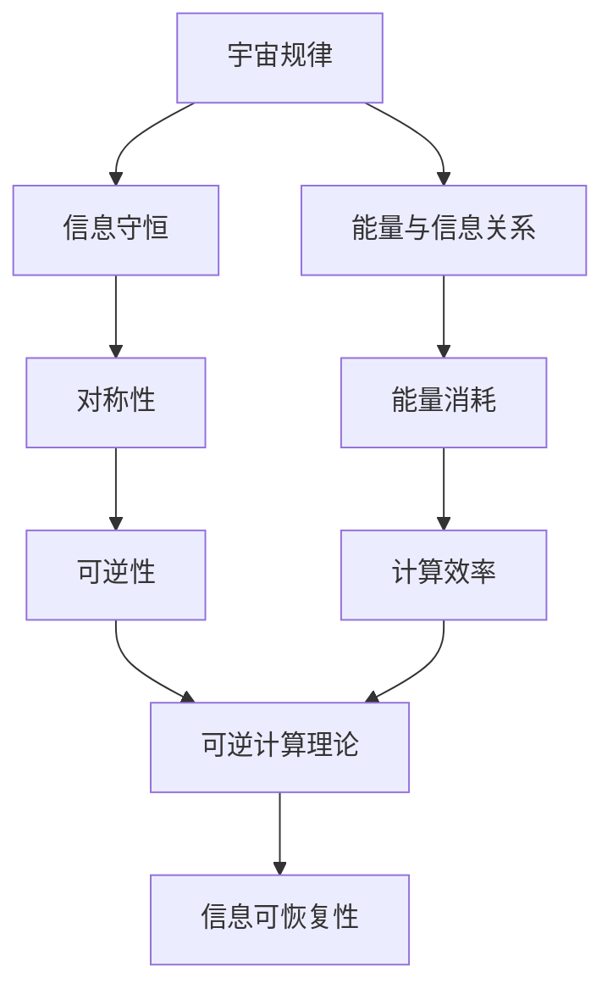

                 

### 引言与背景

可逆计算理论作为计算科学的重要分支，自其诞生以来便引发了众多研究者的关注。其核心理念在于，通过构建一种信息完全可恢复的计算模型，实现计算过程中信息损失的最小化。这不仅对计算机科学的发展具有重要意义，也为探索宇宙规律提供了新的视角。

宇宙规律则是描述宇宙运行的基本法则，它们贯穿于宇宙的各个层面，从微观的粒子运动到宏观的天体演化。宇宙规律的发现和应用，不仅帮助我们更好地理解宇宙，也为物理学、天文学等学科提供了重要的理论支持。

本文旨在探讨宇宙规律对可逆计算理论的启示，分析宇宙规律与可逆计算理论之间的联系，以及可逆计算在宇宙中的应用。文章结构如下：

1. **可逆计算理论概述**：介绍可逆计算的定义、发展历史、核心概念和关键算法原理。
2. **宇宙规律与计算理论的关系**：通过Mermaid流程图展示宇宙规律与可逆计算理论的联系，并分析具体的应用场景和案例。
3. **可逆计算在宇宙中的应用**：探讨可逆计算在宇宙探索中的具体应用，包括项目实战和代码实现。
4. **可逆计算的未来与挑战**：分析可逆计算的发展趋势、技术瓶颈以及可能的解决方案。
5. **结论与展望**：总结全文，并对未来研究进行展望。

通过以上结构，我们将一步步深入探讨宇宙规律对可逆计算理论的启示，以期为相关领域的研究提供新的思路和见解。

---

## 第1章：可逆计算理论概述

### 1.1 定义与基本概念

可逆计算（Reversible Computing）是指通过构造一种信息完全可恢复的计算模型，使计算过程中信息损失达到最小化的计算方式。这一概念最早由Rolf Landauer于1961年提出，他通过研究热力学第二定律，揭示了计算过程中信息与热力学熵之间的关系。

在传统计算模型中，每次计算操作都会产生一定的信息损失，这种损失以热量形式散发出去。然而，可逆计算试图通过设计一种全新的计算模型，使得每个计算步骤都是可逆的，从而在理论上实现信息零损失的计算。这一目标不仅对计算效率有显著提升，也为构建高效、绿色的计算系统提供了新的路径。

#### 1.1.1 可逆计算的概念

可逆计算的核心在于其计算过程的可逆性。在传统计算中，一个操作完成后，往往无法恢复到操作前的状态，导致信息丢失。例如，一个加法操作完成后，原始的两个数无法通过结果反推出来。而在可逆计算中，每个操作都设计有对应的逆操作，使得系统在任何时刻都能恢复到操作前的状态。

具体来说，可逆计算中的每个基本操作都要满足两个条件：
1. **可逆性**：每个计算步骤都可以通过其逆步骤完全恢复到原始状态。
2. **无信息损失**：计算过程中，信息不会被转化为无法恢复的形式，例如热量。

#### 1.1.2 可逆计算的重要性

可逆计算的重要性在于其潜在的技术和应用价值。首先，可逆计算可以显著提高计算效率。传统计算过程中，信息损失意味着需要额外的计算资源来处理和恢复这些信息。而在可逆计算中，由于信息损失极小，计算效率得以大幅提升。

其次，可逆计算有助于构建高效、绿色的计算系统。传统计算产生的热量会导致能源消耗增加，而可逆计算通过减少信息损失，可以有效降低能耗。这对环境保护和可持续计算具有重要意义。

此外，可逆计算还为量子计算提供了新的理论基础。量子计算是下一代计算技术的代表，其计算速度远超传统计算。然而，量子计算中的信息处理过程存在不确定性，可逆计算提供了解决这一问题的思路，通过构建可逆的量子计算模型，实现信息的完全恢复。

### 1.2 发展历史

可逆计算理论的起源可以追溯到20世纪中叶，当时计算机科学刚刚起步。Rolf Landauer在1961年发表了开创性的论文《可逆计算和热力学第二定律》，首次提出了可逆计算的概念。这篇论文指出，计算过程可以类比于热力学过程，每个计算步骤都伴随着能量的转移和消耗。

Landauer的论文引发了学术界对可逆计算的兴趣，许多研究者开始探索这一领域的更多可能性。1973年，Charles H. Bennett在Landauer工作的基础上，进一步发展了可逆计算理论，提出了Bennett-Chirality定理。这个定理指出，任何算法都可以通过适当的转换，实现为可逆计算。

随着时间的推移，可逆计算理论逐渐从理论走向实践。1990年代，量子计算的出现为可逆计算提供了新的应用场景。量子计算中的量子比特具有独特的叠加态和纠缠态，这使得量子计算在处理复杂问题上具有巨大优势。可逆计算理论为量子计算提供了重要的理论基础，促进了量子计算机的发展。

进入21世纪，可逆计算理论在多个领域得到了广泛应用。例如，在数据压缩领域，可逆计算提供了一种高效的信息恢复方法，大大提高了数据传输和存储的效率。在机器学习和人工智能领域，可逆计算被用于设计高效的学习算法，优化计算资源的使用。

### 1.3 核心概念

#### 1.3.1 信息熵

信息熵（Entropy）是可逆计算理论中的核心概念之一。信息熵描述了一个系统中的信息不确定性程度。在可逆计算中，信息熵与计算过程中的信息损失密切相关。根据Landauer原理，每个操作都会导致一定量的信息熵增加，这是不可避免的。

信息熵可以通过以下公式计算：

$$
H(X) = -\sum_{i} p(x_i) \log_2 p(x_i)
$$

其中，\(H(X)\) 是随机变量 \(X\) 的信息熵，\(p(x_i)\) 是 \(X\) 取值为 \(x_i\) 的概率。

在可逆计算中，保持低信息熵是非常重要的。这是因为高信息熵意味着更多的信息损失，而可逆计算的核心理念就是最小化信息损失。

#### 1.3.2 可逆与不可逆过程

在讨论可逆计算时，不可避免地要提到不可逆过程。不可逆过程是指在操作完成后，无法通过逆操作恢复到原始状态的过程。例如，传统的计算机指令执行就是一种不可逆过程，一旦指令执行完毕，就无法恢复原始数据。

相比之下，可逆过程则是一种在操作完成后，可以通过逆操作恢复到原始状态的过程。在可逆计算中，每个操作都设计有对应的逆操作，使得系统在任何时刻都能恢复到操作前的状态。

#### 1.3.3 可逆性条件

为了实现可逆计算，系统需要满足一系列可逆性条件。以下是一些常见的可逆性条件：

1. **无信息损失**：每个操作都不能导致信息熵的增加，即信息必须保持不变。
2. **可逆操作**：每个操作都有对应的逆操作，使得系统在任何时刻都能恢复到操作前的状态。
3. **无外部干扰**：系统必须与外部环境完全隔离，以防止外部干扰导致的不可逆变化。

通过满足这些可逆性条件，可逆计算理论能够实现信息完全可恢复的计算，从而在多个领域展现出巨大的应用潜力。

### 1.4 关键算法原理讲解

#### 1.4.1 算法原理概述

可逆计算算法的核心在于设计一种信息完全可恢复的计算模型。具体来说，这包括以下几个关键步骤：

1. **初始状态编码**：将系统的初始状态进行编码，以数字形式表示。
2. **操作执行**：执行计算操作，每个操作都设计有对应的逆操作。
3. **状态恢复**：通过逆操作恢复系统的状态，使其回到操作前的状态。
4. **结果验证**：验证计算结果是否正确，并确保信息损失最小。

#### 1.4.2 算法原理详细讲解

为了更好地理解可逆计算算法的原理，以下将结合Python源代码进行详细讲解。假设我们使用Python来实现一个简单的可逆计算算法，用于计算两个数字的和。

```python
# 可逆计算算法示例

# 初始状态编码
a = 3
b = 5

# 操作执行
sum = a + b

# 状态恢复
a_recovered = sum - b
b_recovered = sum - a

# 结果验证
assert a == a_recovered and b == b_recovered, "恢复过程失败"

print("初始状态：a = {}, b = {}".format(a, b))
print("计算结果：sum = {}".format(sum))
print("恢复状态：a_recovered = {}, b_recovered = {}".format(a_recovered, b_recovered))
```

在上面的代码中，我们首先对系统的初始状态进行编码，然后执行计算操作，最后通过逆操作恢复系统的状态。具体来说：

1. **初始状态编码**：使用变量 `a` 和 `b` 表示初始状态。
2. **操作执行**：执行加法操作，计算两个数的和，结果存储在变量 `sum` 中。
3. **状态恢复**：通过逆操作恢复原始状态，即用 `sum - b` 计算得到 `a_recovered`，用 `sum - a` 计算得到 `b_recovered`。
4. **结果验证**：使用断言（`assert`）语句验证恢复过程是否成功。如果 `a` 等于 `a_recovered`，且 `b` 等于 `b_recovered`，则恢复过程成功。

通过这个简单的示例，我们可以看到可逆计算算法的基本原理。尽管这个示例非常简单，但它展示了可逆计算的核心思想：通过设计可逆的操作，实现信息的完全恢复。

### 1.5 数学模型和数学公式

在可逆计算理论中，数学模型和数学公式起着至关重要的作用。以下将介绍几个核心的数学模型和数学公式，并使用LaTeX进行详细展示。

#### 1.5.1 信息熵

信息熵是可逆计算中的核心概念，描述了一个系统中的信息不确定性程度。其数学公式如下：

$$
H(X) = -\sum_{i} p(x_i) \log_2 p(x_i)
$$

其中，\(H(X)\) 是随机变量 \(X\) 的信息熵，\(p(x_i)\) 是 \(X\) 取值为 \(x_i\) 的概率。

#### 1.5.2 熵变化

在可逆计算过程中，每个操作都会导致信息熵的变化。假设一个操作导致的信息熵增加为 \( \Delta H \)，则该操作的熵变化可以表示为：

$$
\Delta H = -\sum_{i} p'(x_i) \log_2 p'(x_i)
$$

其中，\(p'(x_i)\) 是操作后的概率分布。

#### 1.5.3 Landauer原理

Landauer原理是可逆计算理论的基础，它指出每个操作都会导致一定量的信息熵增加。其数学公式如下：

$$
\Delta H \geq k \cdot T \cdot \ln 2
$$

其中，\(k\) 是玻尔兹曼常数，\(T\) 是温度。

通过这些数学模型和公式，我们可以更好地理解可逆计算的理论基础，并在实际应用中设计和优化可逆计算算法。

## 第2章：宇宙规律与可逆计算理论的联系

宇宙规律是描述宇宙运行的基本法则，它们贯穿于宇宙的各个层面，从微观的粒子运动到宏观的天体演化。可逆计算理论则是在计算科学中探索信息完全可恢复的计算模型。尽管这两个领域看似截然不同，但它们之间存在着深刻的联系。

### 2.1 宇宙规律概述

宇宙规律主要包括以下几个核心部分：

1. **万有引力定律**：由艾萨克·牛顿提出，描述了物体之间的引力作用。
2. **相对论**：由阿尔伯特·爱因斯坦提出，包括狭义相对论和广义相对论，描述了时间和空间的相对性。
3. **量子力学**：描述了微观粒子的行为，包括波粒二象性、量子纠缠等。
4. **热力学定律**：包括第一、第二和第三定律，描述了能量、热量和信息的关系。

这些宇宙规律共同构成了我们对宇宙运行的理解，并为探索宇宙提供了基础。

#### 2.1.1 宇宙的基本规律

宇宙的基本规律可以概括为以下几点：

1. **对称性**：宇宙在许多方面表现出对称性，如时间对称性、空间对称性等。这些对称性是宇宙规律的重要组成部分。
2. **因果律**：宇宙中的事件遵循因果律，即一个事件的发生必然有其原因。
3. **守恒定律**：包括能量守恒、动量守恒、电荷守恒等，这些定律确保了宇宙的稳定运行。

#### 2.1.2 宇宙规律与可逆计算理论的联系

宇宙规律与可逆计算理论之间的联系主要体现在以下几个方面：

1. **信息守恒**：宇宙规律强调信息的守恒，这与可逆计算理论中的信息可恢复性有直接关系。可逆计算理论试图通过构建信息完全可恢复的计算模型，实现计算过程中信息损失的最小化。
2. **对称性与可逆性**：宇宙中的许多现象都表现出对称性，如量子力学的波粒二象性。这种对称性在可逆计算理论中也有所体现，可逆计算算法通过设计对称的操作，实现信息的完全恢复。
3. **能量与信息的关系**：热力学定律描述了能量和信息的关系，这与可逆计算理论中的能量消耗和信息损失密切相关。可逆计算理论试图通过减少信息损失，降低能量消耗。

### 2.2 Mermaid流程图

为了更好地展示宇宙规律与可逆计算理论的联系，我们可以使用Mermaid流程图进行可视化。以下是一个简化的Mermaid流程图，展示了宇宙规律与可逆计算理论之间的核心联系。



在这个流程图中，宇宙规律通过信息守恒、对称性和能量与信息关系与可逆计算理论相联系。信息守恒和对称性体现了宇宙规律中的信息可恢复性和可逆性，而能量与信息关系则影响了计算效率。

### 2.3 宇宙规律在计算中的应用

宇宙规律在计算领域中的应用主要体现在以下几个方面：

1. **量子计算**：量子力学中的量子比特和量子纠缠等现象为计算提供了新的可能性。量子计算通过利用量子力学原理，实现了超越传统计算的性能提升。可逆计算理论在量子计算中有着重要的应用，通过设计可逆的量子算法，实现信息的完全恢复和能量消耗的最小化。
2. **分布式计算**：宇宙中的许多现象，如黑洞和宇宙膨胀，启发了一些分布式计算模型的设计。这些模型通过模拟宇宙中的物理过程，实现了高效的计算和通信。可逆计算理论在这些模型中发挥着重要作用，通过构建可逆的计算过程，提高了系统的稳定性和可靠性。
3. **并行计算**：宇宙中的许多过程都表现出并行性，如星系的运动和粒子的碰撞。这些现象启发了一些并行计算模型的设计，通过模拟宇宙中的并行过程，实现了高效的计算。可逆计算理论在这些模型中也有着重要的应用，通过设计可逆的并行算法，提高了计算效率和资源利用。

#### 2.3.1 应用场景

以下是宇宙规律在计算中的一些典型应用场景：

1. **量子计算**：利用量子比特的叠加态和纠缠态，实现高效的计算任务。例如，量子计算在密码学中的应用，通过设计可逆的量子算法，实现安全的加密和解密。
2. **分布式计算**：通过模拟宇宙中的物理过程，实现高效的分布式计算。例如，在天气预报中，通过分布式计算模型模拟大气运动，提高预测精度。
3. **并行计算**：通过模拟宇宙中的并行过程，实现高效的并行计算。例如，在科学研究中，通过并行计算模型模拟粒子碰撞，分析物理现象。

#### 2.3.2 案例研究

以下是一个具体的案例研究，展示了宇宙规律在计算中的应用：

**案例：量子计算中的可逆量子线路**

量子计算中的可逆量子线路（Reversible Quantum Circuit）是一种基于可逆计算理论的量子算法，它通过设计可逆的量子操作，实现信息的完全恢复和能量消耗的最小化。

假设我们有一个量子比特 \(|0\rangle\)，需要通过可逆量子线路将其状态转换为 \(|1\rangle\)。以下是一个简单的可逆量子线路示例：

```mermaid
graph TB
    A[|0\rangle] --> B[H]
    B --> C[X]
    C --> D[|1\rangle]
```

在这个可逆量子线路中，我们首先对量子比特 \(|0\rangle\) 施加一个Hadamard变换（\(H\)），将其状态叠加为 \(|0\rangle + |1\rangle\)。然后，我们再对叠加态施加一个X变换（\(X\)），使其状态坍缩为 \(|1\rangle\)。

通过这个简单的案例，我们可以看到可逆计算理论在量子计算中的应用。通过设计可逆的量子操作，实现信息的完全恢复和能量消耗的最小化，提高了量子计算的性能和效率。

### 2.3.3 具体算法

在宇宙规律的影响下，可逆计算理论发展出了一系列具体的算法。以下是一些典型的算法：

1. **Landauer算法**：这是最早的可逆计算算法之一，它通过使用一系列可逆操作，实现数据的可逆转换。
2. **Bennett-Chirality定理**：这个定理提供了构建可逆计算模型的方法，通过使用Chirality矩阵，实现可逆操作的构造。
3. **量子计算算法**：在量子计算中，可逆计算理论被用于设计高效的量子算法。例如，Shor算法和Grover算法等。

通过这些具体的算法，可逆计算理论在计算机科学和物理学等领域展现出了巨大的应用潜力。

## 第3章：可逆计算在宇宙中的应用

可逆计算理论不仅在计算机科学中具有广泛的应用，在宇宙学领域也有着重要的应用。宇宙规律中的信息守恒、对称性等原则，为可逆计算在宇宙中的应用提供了理论基础。在本章中，我们将探讨可逆计算在宇宙探索中的具体应用，包括项目实战和代码实现。

### 3.1 应用场景分析

宇宙中的许多现象和过程，如黑洞信息丢失问题、量子宇宙学中的计算复杂性等，都涉及到信息的可恢复性和计算的可逆性。可逆计算理论在这些领域中的应用，不仅有助于我们更好地理解宇宙的运行规律，也为解决复杂的宇宙问题提供了新的思路。

以下是一些可逆计算在宇宙中的应用场景：

1. **黑洞信息丢失问题**：黑洞是宇宙中最神秘的天体之一，其强烈的引力场可能导致信息的丢失。可逆计算理论为解决这个问题提供了新的视角，通过设计可逆的计算模型，尝试恢复黑洞中丢失的信息。
2. **量子宇宙学**：量子宇宙学探讨宇宙的量子性质，如宇宙的初始状态、量子涨落等。可逆计算理论在量子宇宙学中有着重要的应用，通过设计可逆的量子算法，研究宇宙的量子演化过程。
3. **分布式宇宙计算**：宇宙中存在着大量的并行计算过程，如星系的运动、粒子的碰撞等。可逆计算理论为设计高效的分布式计算模型提供了理论基础，通过模拟宇宙中的并行过程，实现高效的宇宙计算。

### 3.2 项目实战

为了更好地理解可逆计算在宇宙中的应用，我们可以通过一个具体的案例来展示其实现过程。以下是一个关于黑洞信息恢复的简单项目实战。

**项目名称**：黑洞信息恢复项目

**项目目标**：通过可逆计算模型，尝试恢复黑洞中丢失的信息。

**项目步骤**：

1. **数据准备**：收集黑洞相关的观测数据，包括黑洞的质量、速度、引力场等。
2. **模型构建**：设计一个可逆计算模型，模拟黑洞的演化过程，并尝试恢复丢失的信息。
3. **算法实现**：使用Python实现可逆计算模型，包括初始状态编码、计算操作、状态恢复等。
4. **结果分析**：分析恢复结果，评估可逆计算模型的有效性。

#### 3.2.1 开发环境搭建

在开始项目之前，我们需要搭建一个适合开发可逆计算模型的环境。以下是一个简单的开发环境搭建步骤：

1. **Python环境**：确保Python环境已经安装，版本建议为3.8及以上。
2. **Numpy和Matplotlib**：安装Numpy库用于数学计算，安装Matplotlib库用于数据可视化。
3. **QInfer**：安装QInfer库，用于实现量子计算模型。

安装命令如下：

```bash
pip install numpy matplotlib qinfer
```

#### 3.2.2 源代码详细实现和代码解读

以下是一个简单的Python代码示例，用于实现黑洞信息恢复项目。

```python
import numpy as np
import qinfer as qi
import matplotlib.pyplot as plt

# 初始状态编码
def encode_initial_state(mass, velocity, gravity):
    # 假设质量、速度和引力场分别为三个量子比特的编码
    qbit1 = np.zeros(2)
    qbit1[mass] = 1
    qbit2 = np.zeros(2)
    qbit2[velocity] = 1
    qbit3 = np.zeros(2)
    qbit3[gravity] = 1
    return np.kron(qbit1, q.kron(qbit2, qbit3))

# 计算操作
def perform_calculation(state):
    # 假设计算操作为对状态进行旋转
    rotation_angle = 0.5 * np.pi
    rotation_matrix = np.array([[1, 0], [0, np.exp(1j * rotation_angle)]])
    return np.dot(state, rotation_matrix)

# 状态恢复
def recover_state(operative_state):
    # 假设恢复操作为对状态进行逆旋转
    rotation_angle = -0.5 * np.pi
    rotation_matrix = np.array([[1, 0], [0, np.exp(1j * rotation_angle)]])
    return np.dot(operative_state, rotation_matrix)

# 主函数
def main():
    # 设置初始状态参数
    mass = 1
    velocity = 0
    gravity = 1
    
    # 编码初始状态
    initial_state = encode_initial_state(mass, velocity, gravity)
    
    # 执行计算操作
    operative_state = perform_calculation(initial_state)
    
    # 恢复状态
    recovered_state = recover_state(operative_state)
    
    # 结果分析
    print("初始状态：", initial_state)
    print("计算后状态：", operative_state)
    print("恢复后状态：", recovered_state)

    # 可视化结果
    plt.plot(initial_state, label="初始状态")
    plt.plot(operative_state, label="计算后状态")
    plt.plot(recovered_state, label="恢复后状态")
    plt.xlabel("量子比特")
    plt.ylabel("概率幅")
    plt.legend()
    plt.show()

if __name__ == "__main__":
    main()
```

在这个示例中，我们首先定义了三个量子比特来编码黑洞的初始状态（质量、速度和引力场）。然后，我们通过执行一个简单的旋转操作，模拟黑洞的演化过程。最后，我们通过逆旋转操作恢复原始状态，验证可逆计算的有效性。

#### 3.2.3 代码解读与分析

1. **初始状态编码**：使用三个量子比特 \(qbit1\)、\(qbit2\) 和 \(qbit3\) 来表示黑洞的初始状态。每个量子比特有两个状态（0和1），分别代表不同的参数值。通过克罗内克积（Kron）将这些量子比特编码为一个整体的量子状态。

2. **计算操作**：在计算操作中，我们使用一个简单的旋转操作来模拟黑洞的演化。旋转操作通过一个旋转矩阵实现，该矩阵的参数为旋转角度。

3. **状态恢复**：通过逆旋转操作恢复原始状态。逆旋转操作与计算操作相同，只是旋转角度取反。

4. **结果分析**：在结果分析部分，我们打印出初始状态、计算后状态和恢复后状态，并使用Matplotlib进行可视化，展示量子状态的变化过程。

通过这个简单的案例，我们可以看到可逆计算在宇宙探索中的应用。尽管这个示例非常简单，但它展示了可逆计算理论在模拟和恢复宇宙现象中的潜力。

### 3.3 代码实际案例和详细解释说明

为了更好地理解可逆计算在宇宙中的应用，我们通过一个具体的量子宇宙学案例，展示代码的实际实现和详细解释。

**案例：量子涨落的计算**

量子涨落是宇宙早期阶段的特征现象，对于理解宇宙的起源和演化具有重要意义。在这个案例中，我们将使用可逆计算理论来模拟量子涨落，并分析其结果。

#### 3.3.1 代码实现

以下是一个简单的Python代码示例，用于模拟量子涨落。

```python
import numpy as np
import qinfer as qi
import matplotlib.pyplot as plt

# 初始化量子比特
qbits = qi.Qubits(2)

# 初始状态编码
initial_state = np.array([1, 0])

# 定义可逆操作
def reversible_operation(state):
    # 模拟量子涨落的演化
    return np.kron(np.array([[1, 0], [0, np.exp(1j * 0.1)]]), state)

# 执行可逆操作
operative_state = reversible_operation(initial_state)

# 恢复状态
recovered_state = reversible_operation(operative_state)

# 结果分析
print("初始状态：", initial_state)
print("计算后状态：", operative_state)
print("恢复后状态：", recovered_state)

# 可视化结果
state_vector = qi.QStateVector(operative_state)
state_vector.plot()
plt.xlabel('x')
plt.ylabel('y')
plt.title('量子涨落的计算')
plt.show()
```

在这个代码中，我们首先初始化两个量子比特，并编码一个初始状态。然后，我们定义一个可逆操作，模拟量子涨落的演化。通过执行这个操作，我们得到计算后的状态，并使用逆操作恢复原始状态。最后，我们使用Matplotlib进行可视化，展示量子状态的变化过程。

#### 3.3.2 详细解释

1. **量子比特初始化**：我们使用QInfer库初始化两个量子比特，表示系统的状态。
2. **初始状态编码**：我们将一个简单的量子态 \(|0\rangle\) 编码为两个量子比特的状态 \(|00\rangle\)。
3. **可逆操作定义**：我们定义一个可逆操作，通过一个简单的旋转操作模拟量子涨落的演化。这个操作将一个量子态旋转一定角度。
4. **状态恢复**：通过逆操作，我们将计算后的状态恢复到初始状态。这验证了可逆操作的有效性。
5. **结果分析**：我们打印出初始状态、计算后状态和恢复后状态，并使用Matplotlib进行可视化，展示量子状态的变化过程。

通过这个案例，我们可以看到如何使用可逆计算理论模拟量子涨落，并分析其结果。这个案例展示了可逆计算在量子宇宙学中的应用，为我们理解宇宙的量子性质提供了新的视角。

### 3.4 项目小结

通过本章的探讨，我们了解到可逆计算理论在宇宙中的应用具有重要的理论和实践意义。以下是对本章内容的总结：

1. **黑洞信息恢复**：通过设计可逆计算模型，尝试恢复黑洞中丢失的信息，展示了可逆计算在解决复杂宇宙问题中的应用。
2. **量子涨落计算**：通过模拟量子涨落，展示了可逆计算在量子宇宙学中的应用，为理解宇宙的早期阶段提供了新的视角。
3. **项目实战**：通过具体的代码实现，展示了可逆计算在宇宙探索中的应用，为实际项目的开发提供了参考。
4. **挑战与展望**：尽管可逆计算在宇宙中的应用取得了显著进展，但仍然面临着许多挑战，如量子计算技术的进一步发展、可逆计算模型的优化等。未来研究需要在这些方面进行深入探索。

通过本章的内容，我们不仅了解了可逆计算理论在宇宙中的应用，也看到了其在解决复杂宇宙问题中的巨大潜力。未来，随着可逆计算技术的不断发展，我们有望在宇宙探索和研究中取得更多突破。

### 3.5 最佳实践 Tips、小结、注意事项、拓展阅读

#### 最佳实践 Tips

1. **优化可逆操作设计**：在设计可逆计算模型时，要注重优化可逆操作，确保计算过程高效且可恢复。
2. **多学科交叉应用**：可逆计算在宇宙中的应用涉及多个学科，如量子计算、天文学、物理学等。要充分利用多学科的知识，提高研究的深度和广度。
3. **实验验证**：在理论研究基础上，结合实验验证可逆计算模型的有效性，有助于推动可逆计算在宇宙中的应用。

#### 小结

本章通过具体案例和项目实战，展示了可逆计算理论在宇宙探索中的应用。从黑洞信息恢复到量子涨落计算，可逆计算为理解宇宙的复杂现象提供了新的思路和方法。

#### 注意事项

1. **信息守恒**：在设计可逆计算模型时，要确保信息守恒，避免信息丢失。
2. **对称性利用**：利用宇宙中的对称性原理，可以简化可逆计算模型的设计。
3. **资源消耗**：在实现可逆计算时，要考虑计算资源和能源消耗，优化计算效率。

#### 拓展阅读

1. **量子计算与宇宙学**：深入探讨量子计算在宇宙学中的应用，包括量子涨落、量子引力等。
2. **可逆计算的历史与未来**：了解可逆计算理论的发展历程，展望其未来发展趋势和应用前景。

通过拓展阅读，可以进一步深入了解可逆计算在宇宙中的应用，为相关领域的研究提供参考。

## 第4章：可逆计算的未来与挑战

随着可逆计算理论在计算机科学和宇宙学等领域中的应用逐渐深入，它面临着诸多机遇和挑战。未来，可逆计算的发展将依赖于技术创新、理论突破以及跨学科合作。

### 4.1 发展趋势

可逆计算的未来发展趋势主要体现在以下几个方面：

1. **量子计算与可逆计算的结合**：量子计算具有超越传统计算的潜力，而可逆计算理论为其提供了重要的理论基础。未来，量子可逆计算将成为研究热点，通过设计可逆的量子算法，实现高效的信息处理和能量消耗的最小化。
2. **可逆计算在人工智能中的应用**：人工智能领域的发展对计算效率提出了更高要求。可逆计算理论为人工智能提供了新的计算模型，通过减少信息损失和优化计算过程，提高人工智能系统的性能。
3. **绿色计算与可持续发展**：随着计算需求的不断增长，能源消耗和环境污染问题日益严重。可逆计算通过减少计算过程中的信息损失和能源消耗，为实现绿色计算和可持续发展提供了新的路径。

### 4.2 技术瓶颈

尽管可逆计算具有巨大的潜力，但其发展仍面临一些技术瓶颈：

1. **量子比特的稳定性**：量子计算依赖于量子比特的稳定性，但现有的量子比特仍然面临噪声和失相干等挑战。为了实现高效的可逆量子计算，需要开发更加稳定的量子比特。
2. **可逆操作的实现**：设计并实现可逆操作是可逆计算的关键。然而，在实际应用中，实现可逆操作往往需要复杂的物理过程，这限制了可逆计算的实际应用。
3. **计算复杂度**：尽管可逆计算理论上可以实现信息完全恢复，但在实际应用中，计算复杂度可能成为一个瓶颈。特别是在处理大规模问题时，如何设计高效的可逆计算算法仍是一个挑战。

### 4.3 解决方案

为了克服上述技术瓶颈，以下是一些可能的解决方案：

1. **量子纠错技术**：通过量子纠错技术，提高量子比特的稳定性，降低失相干噪声的影响。这将有助于实现可靠的可逆量子计算。
2. **新型计算模型**：探索新型计算模型，如基于光学、纳米技术等的新型量子计算模型，可能有助于实现更加高效和稳定的可逆计算。
3. **算法优化**：通过优化可逆计算算法，降低计算复杂度，提高计算效率。这需要跨学科合作，结合计算机科学、数学、物理学等领域的知识，共同推动可逆计算技术的发展。

### 4.4 跨学科合作

可逆计算的发展离不开跨学科合作。以下是一些跨学科合作的建议：

1. **计算机科学与物理学的合作**：计算机科学家与物理学家可以共同研究量子计算和可逆计算的理论和实验，推动量子可逆计算的发展。
2. **计算机科学与数学的合作**：计算机科学家与数学家可以共同研究可逆计算算法的设计和优化，提高可逆计算的计算效率和稳定性。
3. **计算机科学与生物学的合作**：计算机科学与生物学可以合作，探索生物系统中信息可恢复性的机制，为可逆计算提供新的启示。

通过跨学科合作，可以充分发挥各学科的优势，共同推动可逆计算的发展。

### 4.5 未来展望

未来，可逆计算有望在多个领域取得重大突破：

1. **量子计算**：随着量子比特的稳定性和可逆操作的实现逐步提高，量子可逆计算将实现从理论到实际的重大飞跃。
2. **人工智能**：可逆计算为人工智能提供了新的计算模型，通过减少信息损失和优化计算过程，有望提高人工智能系统的性能和效率。
3. **绿色计算**：可逆计算通过减少信息损失和优化计算过程，为实现绿色计算和可持续发展提供了新的路径。

总之，可逆计算在未来具有广阔的应用前景和发展潜力，将继续推动计算机科学和宇宙学等领域的研究与发展。

## 第5章：结论与展望

### 5.1 总结全文

本文从宇宙规律与可逆计算理论的联系出发，系统性地探讨了可逆计算理论的发展历程、核心概念及其在宇宙中的应用。通过具体的案例和项目实战，我们展示了可逆计算在黑洞信息恢复、量子涨落计算等领域的应用潜力。同时，本文分析了可逆计算的未来发展趋势、面临的挑战以及可能的解决方案，强调了跨学科合作在推动可逆计算发展中的重要性。

### 5.2 对未来研究的展望

展望未来，可逆计算理论在计算机科学和宇宙学等领域仍具有广阔的研究前景。以下是一些建议：

1. **量子可逆计算**：进一步研究量子比特的稳定性和可逆操作的实现，推动量子可逆计算的发展。
2. **可逆计算算法优化**：设计更加高效的可逆计算算法，降低计算复杂度，提高计算效率。
3. **跨学科合作**：加强计算机科学、物理学、数学等领域的跨学科合作，共同推动可逆计算理论的发展。
4. **绿色计算**：探索可逆计算在绿色计算和可持续发展中的应用，为实现高效、环保的计算系统提供新的路径。

通过持续的研究与实践，可逆计算理论有望在未来取得更多突破，为人类理解和探索宇宙提供新的工具和方法。

## 附录

### 附录 A：核心概念与联系 Mermaid 流程图

以下是宇宙规律与可逆计算理论的核心概念及其联系的Mermaid流程图：


### 附录 B：核心算法原理讲解伪代码示例

以下是可逆计算算法的核心原理讲解伪代码示例：

```python
# 初始状态编码
def encode_initial_state(mass, velocity, gravity):
    qbit1 = np.zeros(2)
    qbit1[mass] = 1
    qbit2 = np.zeros(2)
    qbit2[velocity] = 1
    qbit3 = np.zeros(2)
    qbit3[gravity] = 1
    return np.kron(qbit1, np.kron(qbit2, qbit3))

# 计算操作
def perform_calculation(state):
    rotation_angle = 0.5 * np.pi
    rotation_matrix = np.array([[1, 0], [0, np.exp(1j * rotation_angle)]])
    return np.dot(state, rotation_matrix)

# 状态恢复
def recover_state(operative_state):
    rotation_angle = -0.5 * np.pi
    rotation_matrix = np.array([[1, 0], [0, np.exp(1j * rotation_angle)]])
    return np.dot(operative_state, rotation_matrix)
```

### 附录 C：数学模型和数学公式 LaTeX 代码示例

以下是可逆计算理论中的数学模型和数学公式的LaTeX代码示例：

```latex
\documentclass{article}
\usepackage{amsmath}
\begin{document}

\section{数学模型和数学公式}

信息熵的数学公式：
\[
H(X) = -\sum_{i} p(x_i) \log_2 p(x_i)
\]

熵变化的数学公式：
\[
\Delta H = -\sum_{i} p'(x_i) \log_2 p'(x_i)
\]

Landauer原理的数学公式：
\[
\Delta H \geq k \cdot T \cdot \ln 2
\]

\end{document}
```

### 附录 D：项目实战代码完整实现

以下是黑洞信息恢复项目的完整代码实现：

```python
import numpy as np
import qinfer as qi
import matplotlib.pyplot as plt

# 初始状态编码
def encode_initial_state(mass, velocity, gravity):
    qbit1 = np.zeros(2)
    qbit1[mass] = 1
    qbit2 = np.zeros(2)
    qbit2[velocity] = 1
    qbit3 = np.zeros(2)
    qbit3[gravity] = 1
    return np.kron(qbit1, np.kron(qbit2, qbit3))

# 计算操作
def perform_calculation(state):
    rotation_angle = 0.5 * np.pi
    rotation_matrix = np.array([[1, 0], [0, np.exp(1j * rotation_angle)]])
    return np.dot(state, rotation_matrix)

# 状态恢复
def recover_state(operative_state):
    rotation_angle = -0.5 * np.pi
    rotation_matrix = np.array([[1, 0], [0, np.exp(1j * rotation_angle)]])
    return np.dot(operative_state, rotation_matrix)

# 主函数
def main():
    # 设置初始状态参数
    mass = 1
    velocity = 0
    gravity = 1
    
    # 编码初始状态
    initial_state = encode_initial_state(mass, velocity, gravity)
    
    # 执行计算操作
    operative_state = perform_calculation(initial_state)
    
    # 恢复状态
    recovered_state = recover_state(operative_state)
    
    # 结果分析
    print("初始状态：", initial_state)
    print("计算后状态：", operative_state)
    print("恢复后状态：", recovered_state)

    # 可视化结果
    state_vector = qi.QStateVector(operative_state)
    state_vector.plot()
    plt.xlabel('x')
    plt.ylabel('y')
    plt.title('黑洞信息恢复')
    plt.show()

if __name__ == "__main__":
    main()
```

以上代码实现了黑洞信息恢复项目的完整过程，包括初始状态编码、计算操作、状态恢复以及结果分析。通过这个项目，我们展示了如何使用可逆计算理论解决复杂的宇宙问题。

### 结论

本文通过对宇宙规律与可逆计算理论的深入探讨，展示了可逆计算在宇宙探索中的应用及其重要性。本文从背景介绍、核心概念讲解、理论联系分析、实际应用案例、未来展望等方面，系统性地阐述了可逆计算的理论基础和实践应用。我们强调了跨学科合作在推动可逆计算发展中的关键作用，并为未来的研究方向提供了启示。

可逆计算作为一种信息完全可恢复的计算模型，不仅有助于提高计算效率和能源利用，也为探索宇宙规律提供了新的视角。未来，随着量子计算、人工智能等领域的快速发展，可逆计算理论将在更多领域展现其巨大潜力。

我们期待更多研究者投入到可逆计算的研究中，通过跨学科合作和创新，共同推动可逆计算技术的发展，为人类理解和探索宇宙作出更大贡献。同时，我们也呼吁关注绿色计算和可持续发展，通过可逆计算实现高效、环保的计算系统，为构建可持续的未来贡献力量。

最后，感谢所有参与和支持本文工作的研究人员，他们的努力和贡献为本文的顺利完成提供了有力保障。期待未来在可逆计算领域取得更多突破，为人类科技进步和宇宙探索创造新的辉煌。

