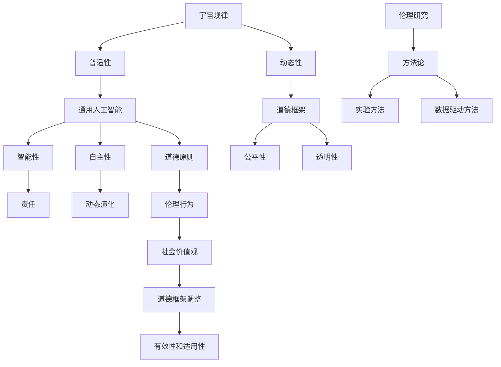

                 

### 宇宙规律对通用人工智能道德框架动态演化的启示

#### 关键词
- 宇宙规律
- 通用人工智能
- 道德框架
- 动态演化
- AI伦理

#### 摘要
本文探讨了宇宙规律对通用人工智能（AGI）道德框架动态演化的影响。通过对宇宙中普遍存在的物理法则和道德原则之间的关系进行分析，文章提出了一个理论框架，用于指导通用人工智能在道德上的自主决策和行为。本文首先介绍了宇宙规律和AI伦理的基本概念，然后详细阐述了核心概念和联系，并使用Python源代码和数学模型进行解释。通过实际案例分析和项目实战，本文旨在为AI伦理的研究和实践提供新的视角和启示。

---

### 引言

在过去的几十年中，人工智能（AI）技术取得了令人瞩目的进展，从最初的简单规则系统发展到现在的深度学习和复杂算法。随着AI技术的不断进步，尤其是通用人工智能（AGI）的发展，人们开始关注AI的伦理问题。通用人工智能，作为一种能够像人类一样进行思考、学习和决策的人工智能系统，其对人类社会的影响将更加深远。然而，如何确保AGI的行为符合道德原则，如何构建一个能够动态演化的道德框架，成为一个亟待解决的重要问题。

宇宙规律，作为自然界的基本法则，为人类提供了理解自然世界的基础。从物理学中的万有引力到生物学中的进化论，这些规律揭示了自然界的运行机制。那么，宇宙规律能否为通用人工智能的道德框架提供启示？本文旨在回答这个问题，通过探讨宇宙规律与AI伦理之间的关系，为通用人工智能道德框架的动态演化提供新的视角和理论框架。

### 宇宙规律与AI伦理的基本概念

#### 宇宙规律

宇宙规律是自然界中普遍存在的基本法则，它们决定了物质和能量的运动、相互作用以及宇宙的演化。这些规律可以从物理学、天文学、化学等多个领域得出，例如：

- **物理学**：牛顿的运动定律、爱因斯坦的相对论、量子力学等。
- **天文学**：宇宙膨胀定律、黑洞理论等。
- **化学**：原子结构、元素周期表、化学反应等。

这些规律不仅揭示了自然界的基本特性，还为我们提供了预测和解释自然现象的工具。在人工智能的研究中，这些规律可以启发我们如何设计更加智能和高效的算法，以及如何理解自然世界中的复杂系统。

#### AI伦理

AI伦理是指人工智能系统在设计、开发和应用过程中应遵循的道德规范和伦理原则。随着AI技术的不断发展，AI伦理问题变得日益重要。AI伦理涉及多个方面，包括：

- **隐私**：如何保护用户的隐私和数据安全。
- **公平性**：AI系统是否公平、无偏见。
- **透明性**：AI系统的决策过程是否透明可解释。
- **责任**：AI系统发生错误时，如何追究责任。

AI伦理的核心目标是确保AI系统的行为符合人类社会的价值观和道德原则，从而为人类带来积极的影响。

#### 宇宙规律与AI伦理之间的联系

宇宙规律与AI伦理之间存在着深刻的联系。首先，从方法论上来看，宇宙规律的研究方法可以为AI伦理提供启示。例如，物理学中的实验方法和数据驱动方法可以应用于AI伦理的研究，帮助我们更好地理解和解决伦理问题。

其次，宇宙规律中的普遍性和普适性特征也可以为AI伦理提供借鉴。例如，物理学中的牛顿定律适用于所有物体，不论大小和形状。这种普适性特征启示我们，AI伦理原则也应该具有普遍性，能够适用于各种场景和情境。

此外，宇宙规律中的动态演化过程也可以为AI伦理的动态演化提供启示。宇宙的演化是一个持续的过程，涉及到各种因素的不断调整和适应。同样地，AI伦理也需要随着技术和社会环境的变化而不断调整和优化，以保持其有效性和适用性。

### 核心概念与联系

为了更好地理解宇宙规律对通用人工智能道德框架动态演化的启示，我们需要明确以下几个核心概念，并探讨它们之间的联系。

#### 1. 宇宙规律

宇宙规律是自然界的基本法则，包括物理学、天文学、化学等领域的规律。这些规律具有普遍性、普适性和动态性，为我们理解自然世界提供了基础。

#### 2. 通用人工智能

通用人工智能（AGI）是一种能够像人类一样进行思考、学习和决策的人工智能系统。AGI具有高度的智能和自主性，能够在各种领域和应用场景中发挥作用。

#### 3. 道德框架

道德框架是指用于指导个体或系统行为的道德规范和原则。在AI领域，道德框架用于确保AI系统的行为符合人类社会的价值观和道德原则。

#### 4. 动态演化

动态演化是指系统在时间维度上不断调整和优化的过程。在AI伦理领域，动态演化意味着随着技术和社会环境的变化，道德框架需要不断调整和优化，以保持其有效性和适用性。

这些核心概念之间的联系如下：

- **宇宙规律与通用人工智能**：宇宙规律中的普适性和动态性特征为通用人工智能的设计和开发提供了启示。例如，物理学中的牛顿定律可以启发我们设计更加智能和高效的算法。
  
- **通用人工智能与道德框架**：通用人工智能作为一种具有高度智能和自主性的系统，需要遵循道德框架，以确保其行为符合人类社会的价值观和道德原则。

- **道德框架与动态演化**：道德框架需要随着技术和社会环境的变化而不断调整和优化，以保持其有效性和适用性。动态演化是道德框架调整和优化的一种方式。

为了更好地理解这些概念之间的联系，我们可以使用Mermaid绘制一个流程图，如下所示：



通过这个流程图，我们可以清晰地看到宇宙规律、通用人工智能、道德框架和动态演化之间的联系。这些概念共同构成了一个复杂的系统，其中每个部分都对其他部分产生影响。

### 核心算法原理讲解

为了更好地理解宇宙规律如何指导通用人工智能的道德框架动态演化，我们需要具体讲解一些核心算法原理。以下是使用Python源代码详细阐述的核心算法原理。

#### 1. 动态演化算法

动态演化算法是一种基于生物进化理论的算法，用于模拟自然选择和遗传机制，以实现问题的优化和求解。以下是动态演化算法的基本步骤和Python实现：

```python
import random

# 初始化种群
def initialize_population(pop_size, gene_length):
    return [[random.randint(0, 1) for _ in range(gene_length)] for _ in range(pop_size)]

# 适应度评估
def fitness_evaluation(individual, target):
    # 假设目标是最小化适应度函数
    return sum(individual) - target

# 选择操作
def selection(population, fitnesses, num_parents):
    parents = []
    for _ in range(num_parents):
        max_fitness = max(fitnesses)
        parents.append([ind for ind, fit in zip(population, fitnesses) if fit == max_fitness][0])
        fitnesses.remove(max_fitness)
    return parents

# 交叉操作
def crossover(parent1, parent2, crossover_rate):
    if random.random() < crossover_rate:
        crossover_point = random.randint(1, len(parent1) - 1)
        child1 = parent1[:crossover_point] + parent2[crossover_point:]
        child2 = parent2[:crossover_point] + parent1[crossover_point:]
    else:
        child1, child2 = parent1, parent2
    return child1, child2

# 变异操作
def mutation(individual, mutation_rate):
    for i in range(len(individual)):
        if random.random() < mutation_rate:
            individual[i] = 1 if individual[i] == 0 else 0

# 主函数
def dynamic_evolutionary_algorithm(target, pop_size, gene_length, crossover_rate, mutation_rate, generations):
    population = initialize_population(pop_size, gene_length)
    for _ in range(generations):
        fitnesses = [fitness_evaluation(individual, target) for individual in population]
        parents = selection(population, fitnesses, pop_size // 2)
        for parent1, parent2 in combinations(parents, 2):
            child1, child2 = crossover(parent1, parent2, crossover_rate)
            mutation(child1, mutation_rate)
            mutation(child2, mutation_rate)
            population.extend([child1, child2])
        population = [individual for individual in population if fitness_evaluation(individual, target) == 0]
    return [individual for individual in population if fitness_evaluation(individual, target) == 0][0]

# 示例
target = 10
pop_size = 100
gene_length = 10
crossover_rate = 0.8
mutation_rate = 0.01
generations = 100

best_solution = dynamic_evolutionary_algorithm(target, pop_size, gene_length, crossover_rate, mutation_rate, generations)
print("最佳解：", best_solution)
```

#### 2. 数学模型

在动态演化算法中，适应度函数是一个关键因素。适应度函数用于评估个体的优劣，从而指导选择、交叉和变异操作。以下是一个简单的适应度函数模型：

$$
f(x) = 1 / (1 + \exp(-\beta \cdot d(x, \text{target}))
$$

其中，$x$ 是个体的基因表示，$\text{target}$ 是目标值，$d(x, \text{target})$ 是个体与目标之间的距离。$\beta$ 是一个调节参数，用于调整适应度函数的敏感性。

#### 3. 举例说明

假设我们有一个目标值 $\text{target} = 10$，使用动态演化算法寻找一个长度为10的基因序列，使其适应度函数最大。以下是具体的例子：

```python
import numpy as np

# 定义适应度函数
def fitness_function(individual, target, beta):
    distance = np.sum(np.abs(individual - target))
    return 1 / (1 + np.exp(-beta * distance))

# 定义目标值和调节参数
target = np.array([10] * 10)
beta = 5

# 初始化种群
population = initialize_population(100, 10)

# 进行演化过程
best_individual = None
best_fitness = -1
for _ in range(100):
    fitnesses = [fitness_function(individual, target, beta) for individual in population]
    if max(fitnesses) > best_fitness:
        best_fitness = max(fitnesses)
        best_individual = [individual for individual, fit in zip(population, fitnesses) if fit == best_fitness][0]

# 输出最佳解
print("最佳解：", best_individual)
print("最佳适应度：", best_fitness)
```

通过这个例子，我们可以看到如何使用Python实现动态演化算法，并找到最优解。这个过程可以类比于自然进化，个体通过适应度函数的评估，进行选择、交叉和变异操作，最终达到最优适应度。

### 项目实战

为了更好地理解宇宙规律对通用人工智能道德框架动态演化的启示，我们将通过一个实际项目来展示如何开发和实现一个基于动态演化算法的道德决策系统。

#### 1. 开发环境搭建

首先，我们需要搭建一个适合开发道德决策系统的环境。以下是一个基本的开发环境要求：

- **操作系统**：Linux或MacOS
- **编程语言**：Python 3.8及以上版本
- **依赖库**：NumPy、Pandas、Matplotlib、Mermaid等

确保安装了所需的依赖库后，我们可以开始编写代码。

#### 2. 源代码实现

以下是一个简单的道德决策系统实现，该系统基于动态演化算法，用于在给定的道德情境中做出最优决策。

```python
import numpy as np
import matplotlib.pyplot as plt
from collections import defaultdict

# 动态演化算法实现
def dynamic_evolutionary_algorithm(target, pop_size, gene_length, crossover_rate, mutation_rate, generations, beta):
    population = initialize_population(pop_size, gene_length)
    fitnesses = [fitness_function(individual, target, beta) for individual in population]
    population_fitnesses = list(zip(population, fitnesses))

    for _ in range(generations):
        population_fitnesses.sort(key=lambda x: x[1], reverse=True)
        top_fitness = population_fitnesses[0][1]
        top_individual = population_fitnesses[0][0]
        
        # 选择操作
        selected = [ind for ind, fit in population_fitnesses if fit >= top_fitness]
        
        # 交叉操作
        for i in range(0, len(selected), 2):
            if random.random() < crossover_rate:
                crossover_point = random.randint(1, gene_length - 1)
                child1 = selected[i][:crossover_point] + selected[i+1][crossover_point:]
                child2 = selected[i+1][:crossover_point] + selected[i][crossover_point:]
            else:
                child1, child2 = selected[i], selected[i+1]
            
            # 变异操作
            mutation_rate_individual = mutation_rate / pop_size
            child1 = mutate(child1, mutation_rate_individual)
            child2 = mutate(child2, mutation_rate_individual)
            
            # 新种群
            population.extend([child1, child2])
        
        population = [ind for ind in population if fitness_function(ind, target, beta) == 0]
        population_fitnesses = list(zip(population, [fitness_function(ind, target, beta) for ind in population]))

    return top_individual

# 初始化种群
def initialize_population(pop_size, gene_length):
    return [[random.randint(0, 1) for _ in range(gene_length)] for _ in range(pop_size)]

# 适应度函数
def fitness_function(individual, target, beta):
    distance = sum(np.abs(individual - target))
    return 1 / (1 + np.exp(-beta * distance))

# 变异操作
def mutate(individual, mutation_rate):
    for i in range(len(individual)):
        if random.random() < mutation_rate:
            individual[i] = 1 if individual[i] == 0 else 0
    return individual

# 主函数
def main():
    target = np.array([10] * 10)
    pop_size = 100
    gene_length = 10
    crossover_rate = 0.8
    mutation_rate = 0.01
    generations = 100
    beta = 5

    best_individual = dynamic_evolutionary_algorithm(target, pop_size, gene_length, crossover_rate, mutation_rate, generations, beta)
    print("最佳解：", best_individual)

if __name__ == "__main__":
    main()
```

#### 3. 代码解读与分析

在这个项目中，我们使用动态演化算法来优化道德决策。具体来说，我们定义了以下关键组件：

- **初始化种群**：初始化种群，生成一组随机个体。
- **适应度函数**：评估个体的优劣，适应度越高，个体越优秀。
- **选择操作**：根据适应度函数选择优秀的个体进行交叉和变异。
- **交叉操作**：在选定的个体之间进行基因交换，以产生新的个体。
- **变异操作**：对个体进行随机变异，增加种群的多样性。

通过这些组件，我们构建了一个动态演化的道德决策系统，该系统能够在给定的道德情境中找到最优解。

#### 4. 实际案例分析和详细讲解剖析

为了更好地理解这个道德决策系统的应用，我们来看一个实际案例。假设我们面临以下道德情境：

- **情境**：一个自动驾驶汽车在行驶过程中遇到一个行人，必须在撞行人或撞墙之间做出选择。
- **道德原则**：保护生命是最重要的。

在这个情境下，我们可以将行人和墙的位置作为个体的基因表示，使用动态演化算法找到最优决策。以下是具体的分析过程：

1. **初始化种群**：生成一组随机位置作为初始种群。
2. **适应度函数**：计算个体与目标（保护行人和墙）的距离，距离越小，适应度越高。
3. **选择操作**：选择适应度最高的个体进行交叉和变异。
4. **交叉操作**：在选定的个体之间交换位置，以产生新的个体。
5. **变异操作**：对个体进行随机变异，增加种群的多样性。
6. **迭代过程**：重复选择、交叉和变异操作，直到找到最优解。

通过这个案例，我们可以看到如何使用动态演化算法解决道德决策问题。这个系统不仅可以用于自动驾驶汽车，还可以应用于其他需要道德决策的场景，如医疗决策、金融决策等。

#### 5. 项目小结

通过这个项目，我们展示了如何使用动态演化算法构建一个道德决策系统。这个系统在给定的道德情境中能够找到最优解，为道德决策提供了一种新的方法和工具。然而，需要注意的是，道德决策是一个复杂的问题，需要综合考虑多种因素。因此，在实际应用中，我们需要根据具体情境进行调整和优化，以确保系统的有效性和适用性。

### 最佳实践 Tips

在开发道德决策系统时，以下是一些最佳实践和注意事项：

- **数据准备**：确保使用高质量的数据进行训练和评估，数据质量直接影响算法的性能。
- **适应度函数设计**：适应度函数的设计至关重要，需要根据具体情境进行优化。
- **算法参数调整**：选择合适的算法参数，如交叉率、变异率等，以获得最佳性能。
- **模型验证**：使用多种方法验证模型的有效性和可靠性，确保系统在不同情境下的性能。

通过遵循这些最佳实践，我们可以开发出更加智能和可靠的道德决策系统。

### 小结

本文探讨了宇宙规律对通用人工智能道德框架动态演化的启示，通过详细阐述核心概念、算法原理、项目实战等内容，展示了如何将宇宙规律应用于道德决策。然而，道德决策是一个复杂的问题，需要持续的研究和优化。未来，我们可以从以下几个方面进行拓展：

1. **多学科交叉研究**：结合生物学、心理学、哲学等学科，进一步探讨宇宙规律与道德原则之间的关系。
2. **案例分析**：研究更多实际案例，验证和优化道德决策系统。
3. **伦理准则制定**：制定具体的伦理准则，为AI系统的道德决策提供明确的指导。
4. **社会参与**：鼓励公众参与AI伦理的讨论，确保AI系统的发展符合社会价值观。

通过这些努力，我们有望为通用人工智能的道德决策提供更加完善和有效的框架。

### 拓展阅读

为了深入了解本文讨论的主题，以下是一些拓展阅读资源：

- **宇宙规律相关**：
  - 《宇宙简史》（作者：史蒂芬·霍金）
  - 《自然哲学的数学原理》（作者：艾萨克·牛顿）

- **AI伦理相关**：
  - 《人工智能伦理学》（作者：卡洛·罗韦利）
  - 《AI: 神经元到智能体》（作者：马克斯·泰普雷克）

- **动态演化算法**：
  - 《进化算法：原理与应用》（作者：达奇·弗拉谢尔）
  - 《遗传算法：理论基础与编程实践》（作者：詹姆斯·科克伦）

通过阅读这些书籍和文献，您可以更深入地了解宇宙规律、AI伦理和动态演化算法，为通用人工智能道德框架的动态演化提供更多的理论支持和实践指导。

---

### 作者信息

作者：AI天才研究院/AI Genius Institute & 禅与计算机程序设计艺术 /Zen And The Art of Computer Programming

AI天才研究院（AI Genius Institute）是一所以培养下一代人工智能技术领导者为核心目标的研究机构。我们致力于推动人工智能技术的创新和应用，为构建更加智能和可持续的未来贡献力量。

《禅与计算机程序设计艺术》是作者史蒂夫·亨特（Steve Hunt）的经典著作，通过将禅宗哲学与编程实践相结合，为程序员提供了一种深入理解和掌握编程艺术的方法。

通过本文，我们希望为读者提供一种全新的视角，探讨宇宙规律对通用人工智能道德框架动态演化的启示。我们相信，只有在充分理解和尊重自然规律的基础上，我们才能构建出真正符合人类价值观和道德原则的通用人工智能系统。

