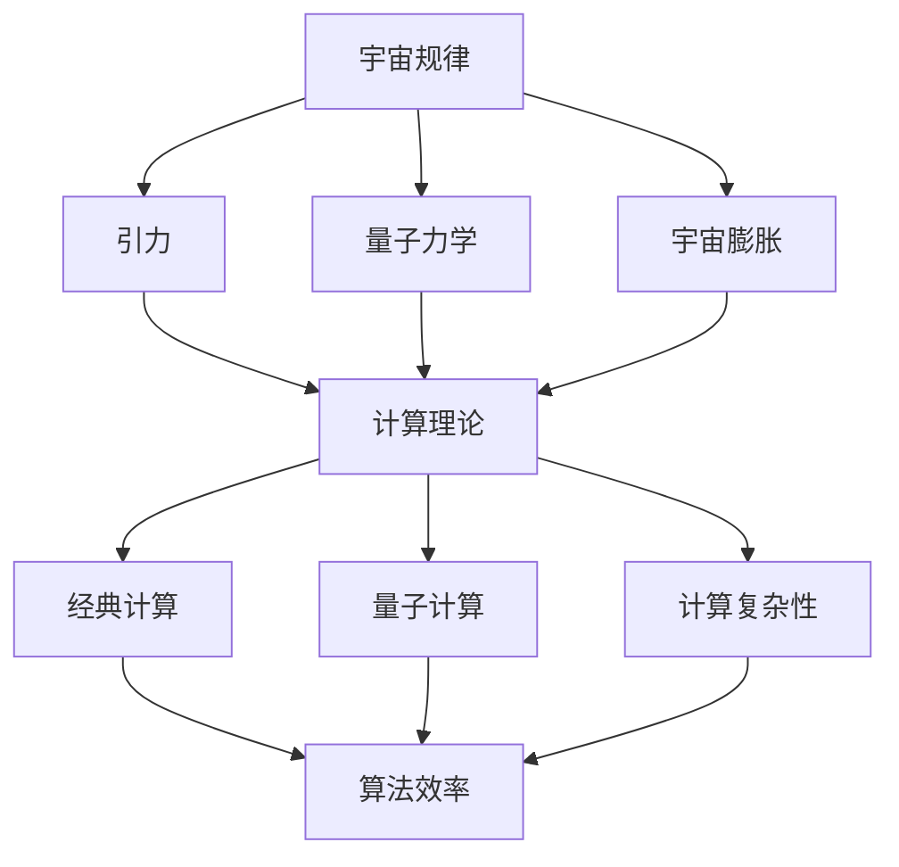
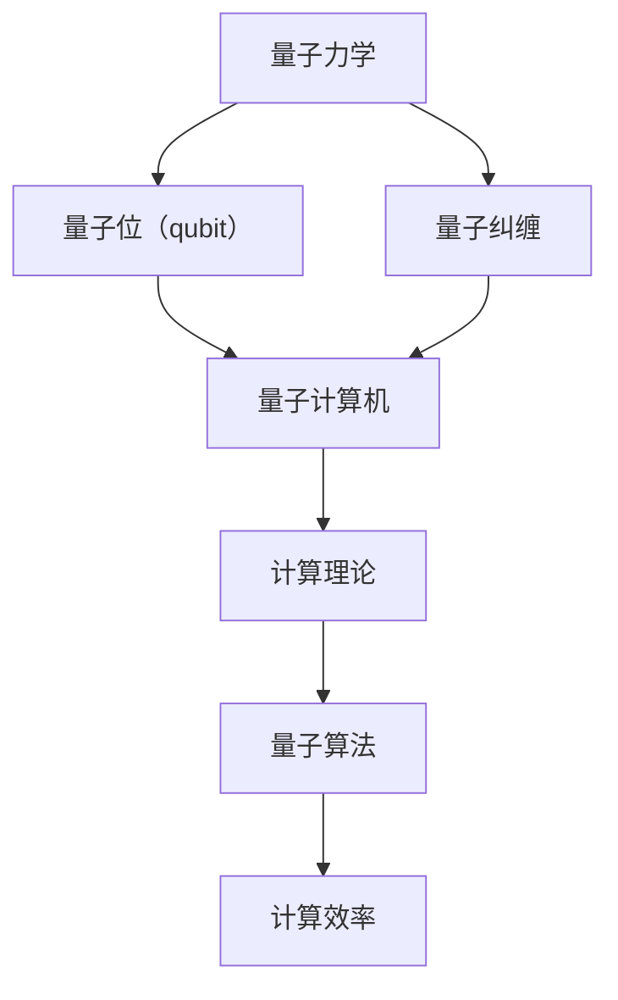
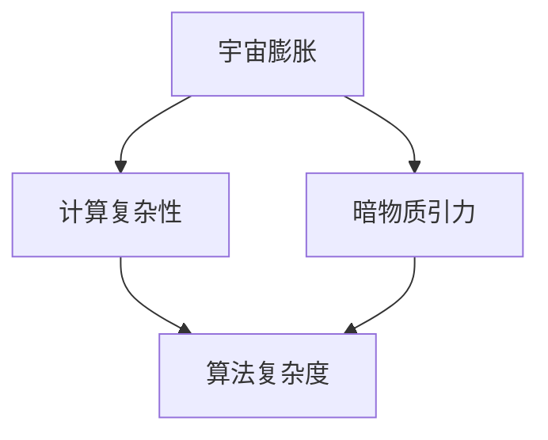
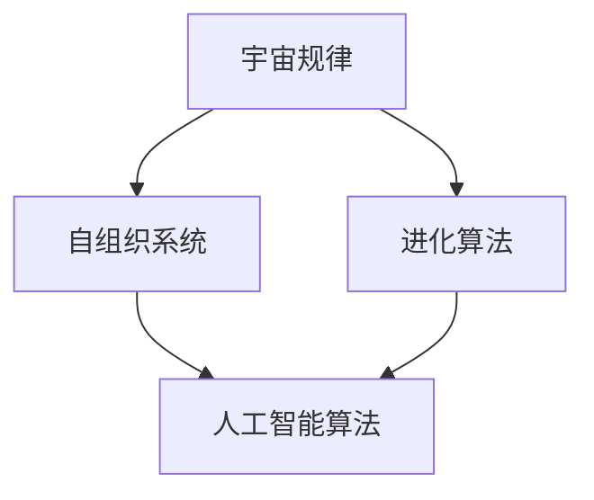

                 

### 文章标题：宇宙规律对通用计算理论的启示

#### 关键词：宇宙规律、计算理论、量子计算、计算复杂性、人工智能、未来计算

> **摘要：**本文探讨了宇宙规律对通用计算理论的深刻启示，从宇宙基本规律、计算理论概述，到量子计算、计算复杂性以及人工智能的影响，全面解析了宇宙规律在计算理论中的应用及其对未来计算和社会的潜在影响。通过具体案例和数学模型，本文旨在为读者提供一个全面而深刻的理解，激发对宇宙与计算之间奇妙联系的思考。

----------------------------------------------------------------

### 宇宙基本规律概述

#### 1.1 宇宙的起源与结构

宇宙的起源是现代物理学中最为引人入胜的课题之一。目前，最被广泛接受的宇宙起源理论是“大爆炸理论”。根据这一理论，宇宙起源于大约138亿年前的一个极热、极密的状态，随后开始膨胀并逐渐冷却。随着宇宙的膨胀，物质和能量逐渐分散，形成了恒星、星系以及其他天体。这一过程被称为宇宙的“结构形成”。

在宇宙的结构形成过程中，有几个重要的物理规律扮演了关键角色：

- **宇宙膨胀：**宇宙的膨胀是一个持续的过程，这种膨胀是由宇宙中的暗能量驱动的。暗能量是一种导致宇宙加速膨胀的神秘力量，其具体性质尚不完全清楚。
  
- **引力：**引力是宇宙中最重要的相互作用之一，它使得物质聚集在一起形成星系和星系团。爱因斯坦的广义相对论为我们提供了描述引力和宇宙几何的数学框架。

- **暗物质：**暗物质是宇宙中一种无法直接观测到的物质，但它对宇宙的引力效应有着重要的影响。暗物质的存在通过引力透镜效应、星系旋转曲线等观测现象得到了证实。

- **宇宙背景辐射：**宇宙背景辐射是宇宙早期遗留下来的微波辐射，它为我们提供了宇宙早期状态的信息，是研究宇宙起源和演化的宝贵数据。

#### 1.2 宇宙膨胀与暗能量

宇宙膨胀是当前宇宙研究中最令人困惑的现象之一。根据宇宙学观测数据，宇宙的膨胀速度似乎在加速，这被解释为暗能量的存在。

- **宇宙膨胀的观测：**宇宙膨胀的观测数据主要来源于对遥远星系和宇宙背景辐射的测量。通过对这些数据的分析，科学家们发现宇宙的膨胀速度在逐渐加快。

- **暗能量的性质：**暗能量是一种负压力的神秘物质，它占据宇宙总能量的大部分，并且对宇宙的膨胀起着决定性的作用。暗能量具有一些独特的物理性质，例如它不会聚集形成物质，也不会随时间演化。

#### 1.3 引力与暗物质

引力是宇宙中最重要的相互作用之一，它决定了天体的运动和宇宙的结构。然而，传统引力理论无法解释一些观测现象，这促使科学家们提出了暗物质的概念。

- **暗物质的观测证据：**暗物质的证据主要来自于星系的旋转曲线和引力透镜效应。观测数据显示，星系中存在的物质远比可以观测到的星体所含有的物质多，这表明宇宙中存在大量的暗物质。

- **暗物质的性质：**暗物质是一种不发光、不吸收光线的物质，它不与电磁场相互作用，因此很难直接观测到。然而，暗物质通过引力作用对宇宙结构的影响是显而易见的。

通过以上对宇宙基本规律的概述，我们可以看出，宇宙中的这些规律不仅决定了宇宙的结构和演化，而且对计算理论也有着深刻的影响。在接下来的章节中，我们将进一步探讨这些宇宙规律如何对计算理论产生启示。

#### 背景介绍

宇宙规律，即宇宙中普遍适用的自然法则，为我们理解宇宙的本质和演化提供了科学依据。从广义相对论描述的引力，到量子力学中的基本粒子行为，宇宙规律构成了现代物理学的基石。这些宇宙规律不仅在物理学中具有重要地位，也在计算理论中发挥着关键作用。

计算理论是计算机科学的基础，它研究计算的本质、算法的效率以及计算模型的可能性。从经典的图灵机模型，到现代的量子计算和计算复杂性理论，计算理论不断推动计算机技术的发展。然而，长期以来，计算理论的发展主要集中在模拟地球上的物理过程，对宇宙规律的关注相对较少。

宇宙规律对计算理论的启示主要体现在以下几个方面：

1. **量子计算：**宇宙规律，特别是量子力学，为量子计算提供了理论基础。量子计算机利用量子位（qubit）的叠加态和纠缠态进行计算，这与宇宙中微观粒子的行为有着惊人的一致性。

2. **计算复杂性：**宇宙规律，如宇宙膨胀和暗物质引力，影响了宇宙结构的形成和演化。类似地，这些规律也可以影响计算复杂性的研究，帮助我们理解哪些问题可能难以在现实世界中有效解决。

3. **人工智能：**宇宙规律在人工智能中的应用潜力巨大。例如，通过模拟宇宙中的自组织和进化过程，可以开发出更高效的人工智能算法。

4. **未来计算：**宇宙规律为未来计算技术的发展提供了新的视角。例如，宇宙中存在的复杂自适应系统可能启发我们设计出更强大的计算模型。

本文旨在探讨宇宙规律对计算理论的深刻启示，通过具体案例和数学模型，展示宇宙规律如何影响计算理论的发展和应用。文章结构如下：

1. **宇宙基本规律概述：**介绍宇宙的起源、结构及其基本规律，包括宇宙膨胀、暗能量、引力和暗物质等。
2. **计算理论的基本原理：**概述计算理论的基本概念，包括经典计算、量子计算和计算复杂性理论。
3. **宇宙规律与计算理论的关系：**探讨宇宙规律如何影响计算理论，包括量子计算、计算复杂性和人工智能等方面。
4. **宇宙规律对计算理论的影响：**详细分析宇宙规律对量子计算、计算复杂性和人工智能的影响，并提供具体案例。
5. **宇宙规律与未来计算：**探讨宇宙规律对未来计算和社会的潜在影响，展望未来计算的发展方向。
6. **附录：**提供宇宙规律与计算理论的资源与工具，包括量子计算、计算复杂性和人工智能的相关资源。

通过本文的探讨，我们希望读者能够更加深入地理解宇宙规律与计算理论之间的联系，激发对这一交叉学科的思考和研究。

#### 核心概念与联系

在探讨宇宙规律对通用计算理论的启示时，我们需要首先明确几个核心概念，并理解它们之间的联系。这些核心概念包括：

1. **宇宙规律：**宇宙中普遍适用的自然法则，如引力、量子力学和宇宙膨胀等。
2. **计算理论：**研究计算的本质、算法的效率和计算模型的可能性，包括经典计算、量子计算和计算复杂性理论等。
3. **量子计算：**利用量子位（qubit）的叠加态和纠缠态进行计算的模型，具有远超经典计算机的潜力。
4. **计算复杂性：**研究算法解决特定问题所需资源的度量，如时间复杂度和空间复杂度等。

**Mermaid 流程图：**



在上述流程图中，我们可以看到宇宙规律（如引力、量子力学和宇宙膨胀）直接影响计算理论（包括经典计算、量子计算和计算复杂性）。引力作为宇宙中最基本的相互作用之一，对计算复杂性理论中的问题解决有着潜在的影响。量子力学则直接启发了量子计算的发展，而宇宙膨胀规律对宇宙中复杂结构的形成有着深远的影响，这些影响同样可以类比为计算复杂性中的问题。

**核心概念之间的联系：**

1. **引力与计算复杂性：**引力理论中的场方程可以类比为计算复杂性中的算法，而引力波的探测和计算则类似于复杂问题的求解过程。
2. **量子力学与量子计算：**量子力学中的量子位（qubit）与量子计算机中的量子位有着直接的联系。量子纠缠态和量子叠加态是量子计算的核心机制，而量子力学中的这些概念则是其理论基础。
3. **宇宙膨胀与计算效率：**宇宙膨胀可以类比为计算过程中的时间复杂度，而暗能量的存在则类似于某些计算算法中的额外复杂度。

通过上述核心概念和它们之间的联系，我们可以更好地理解宇宙规律对通用计算理论的深刻启示。

#### 计算理论的基本原理

计算理论是计算机科学的基础，它研究计算的本质、算法的效率和计算模型的可能性。计算理论的基本原理涵盖了从经典计算到量子计算，再到计算复杂性理论等多个方面。

**经典计算：**经典计算基于图灵机模型，由英国数学家艾伦·图灵在20世纪30年代提出。图灵机是一个抽象的计算模型，它由一个无限长的带子和一组规则组成。图灵机可以模拟任何物理计算过程，因此被认为是现代计算机的数学基础。在经典计算中，算法的效率通常通过时间复杂度和空间复杂度来衡量。

- **时间复杂度：**衡量算法执行时间的度量，通常用大O符号表示，如O(n)、O(n²)等。时间复杂度反映了算法随输入规模增长的速度。
- **空间复杂度：**衡量算法所需存储空间的度量，同样使用大O符号表示。空间复杂度反映了算法的存储需求。

**量子计算：**量子计算是利用量子位（qubit）的叠加态和纠缠态进行计算的一种模型。量子计算机通过量子位来实现信息的存储和处理，具有远超经典计算机的潜力。

- **量子位（qubit）：**量子计算机的基本单元，可以处于0和1的叠加态，而不是传统计算机中的单一状态。
- **量子叠加态：**多个量子位可以同时处于多个状态的叠加，这使得量子计算机在并行计算方面具有巨大优势。
- **量子纠缠：**量子位之间的特殊关联状态，使得一个量子位的测量会影响到另一个量子位的状态，这种关联性可以用于量子计算中的并行操作。

**计算复杂性理论：**计算复杂性理论研究算法解决特定问题所需资源的度量，如时间复杂度和空间复杂度。它将问题分为不同的复杂性类别，如P类、NP类、NP-complete类等。

- **P类问题：**可以在多项式时间内解决的决策问题。
- **NP类问题：**如果其解可以在多项式时间内验证，则称为NP类问题。
- **NP-complete类问题：**既是NP类问题，又是所有NP类问题的最大下界问题。

**计算模型的可能性：**计算理论还探讨不同计算模型的可能性，如非确定性图灵机、量子图灵机等。这些模型提供了对计算能力的更深入理解，同时也提出了新的计算问题和挑战。

**经典计算与量子计算的对比：**

| 特征       | 经典计算                                   | 量子计算                                      |
|------------|--------------------------------------------|-----------------------------------------------|
| 基本单位   | 位（bit）                                  | 量子位（qubit）                                |
| 状态       | 只能是0或1                                | 可以处于0和1的叠加态                          |
| 运算       | 逻辑门操作                                 | 量子门操作，如Hadamard门、CNOT门等            |
| 并行计算   | 通过算法并行化实现                         | 通过量子叠加态和纠缠态实现天然并行计算        |
| 验证       | 验证相对容易                              | 验证相对困难，需要大量量子位进行测量           |
| 应用领域   | 大规模数据处理、算法优化等                 | 密码破解、优化问题、量子模拟等                 |

通过上述对经典计算、量子计算和计算复杂性理论的介绍，我们可以更好地理解计算理论的基本原理。这些原理不仅构成了现代计算机科学的基础，也为理解和探索宇宙规律提供了新的视角。

#### 宇宙规律与计算理论的关系

宇宙规律与计算理论之间存在诸多深刻的联系，这些联系不仅揭示了宇宙的本质，也为计算理论的发展提供了新的视角。在本文的这一部分，我们将详细探讨宇宙规律如何影响计算理论，特别是量子计算、计算复杂性和人工智能等方面。

**宇宙规律对量子计算的影响**

量子计算是计算理论中的一个重要分支，其核心原理源于量子力学。量子力学中的基本规律，如量子位（qubit）的叠加态和量子纠缠，直接启发了量子计算机的设计。以下是一些具体的影响：

1. **量子叠加态：**在量子力学中，量子位可以同时处于0和1的叠加态。这一特性使得量子计算机能够同时处理多个计算路径，从而实现并行计算。在经典计算中，这种并行计算通常需要通过复杂的算法和大量资源来实现，而在量子计算中，这种并行性是天然存在的。

2. **量子纠缠：**量子纠缠是量子计算中的另一个关键特性。当两个或多个量子位纠缠在一起时，它们的状态会相互关联，即使它们相隔很远。这种纠缠态可以用于量子计算中的信息传输和加密，为量子通信和量子加密提供了新的可能性。

**宇宙规律与量子计算的关系架构**

为了更好地理解宇宙规律与量子计算之间的联系，我们可以使用Mermaid流程图来展示它们之间的关系：



在上述流程图中，我们可以看到量子力学（A）通过量子位（B）和量子纠缠（C）直接影响量子计算机（D），量子计算机（D）进而影响计算理论（E）和计算效率（G）。

**宇宙规律对计算复杂性理论的影响**

计算复杂性理论是研究算法在解决特定问题时所需资源的度量，如时间复杂度和空间复杂度。宇宙规律，如宇宙膨胀和暗物质引力，也对计算复杂性产生了影响。

1. **宇宙膨胀：**宇宙的膨胀导致天体之间的距离不断增加，这可以类比为计算复杂度中的时间复杂度。在某些情况下，宇宙膨胀可能导致计算问题变得更加复杂，需要更多的计算资源来解决。

2. **暗物质引力：**暗物质是宇宙中一种无法直接观测到的物质，但它的引力效应对宇宙结构的形成和演化有着重要的影响。类似地，在某些计算问题中，暗物质效应可能使得问题求解变得更加复杂，需要更多的计算资源和时间。

**宇宙规律与计算复杂性的关系架构**

我们同样可以使用Mermaid流程图来展示宇宙规律与计算复杂性理论之间的关系：



在上述流程图中，我们可以看到宇宙膨胀（A）和暗物质引力（C）直接影响计算复杂性（B），进而影响算法复杂度（D）。

**宇宙规律对人工智能的影响**

人工智能是计算理论中的另一个重要分支，它在模拟人类智能行为方面取得了显著进展。宇宙规律同样对人工智能有着重要的影响。

1. **自组织系统：**宇宙中存在着大量的自组织系统，如星系的形成和生命的起源。这些系统的自组织特性可以启发人工智能算法的设计，帮助开发出更加自适应和高效的算法。

2. **进化算法：**进化算法是人工智能中的一种重要方法，它模拟生物进化过程，通过自然选择和遗传算法来优化问题求解。宇宙中的进化过程，如物种的进化和生态系统的演化，为进化算法提供了丰富的灵感。

**宇宙规律与人工智能的关系架构**

为了展示宇宙规律与人工智能之间的关系，我们同样可以使用Mermaid流程图：



在上述流程图中，我们可以看到宇宙规律（A）通过自组织系统（B）和进化算法（C）直接影响人工智能算法（D）。

通过上述分析，我们可以看到宇宙规律与计算理论之间存在深刻的联系。这些联系不仅为我们理解宇宙的本质提供了新的视角，也为计算理论的发展和应用提供了新的启示。在接下来的章节中，我们将进一步探讨这些联系的具体应用和影响。

#### 宇宙规律对计算理论的影响

宇宙规律对计算理论的影响深远而广泛，特别是在量子计算、计算复杂性和人工智能等领域。以下我们将详细探讨这些影响，并结合具体案例和数学模型，来展示宇宙规律如何具体影响计算理论和实际应用。

**量子计算：宇宙规律的影响**

量子计算是计算理论的前沿领域，其核心原理源于量子力学。量子力学中的基本规律，如量子位（qubit）的叠加态和量子纠缠，直接影响了量子计算机的设计和性能。

1. **量子叠加态：**量子位可以处于0和1的叠加态，这使得量子计算机能够同时处理多个计算路径。例如，一个具有n个量子位的量子计算机可以同时表示2^n个状态，这远超传统计算机的并行处理能力。这种叠加态在量子算法中得到了广泛应用，如量子随机游走算法，它可以高效地解决图论中的问题。

   **数学模型：**
   $$ \psi = \sum_{x \in S} \alpha_x \vert x \rangle $$
   其中，$\vert x \rangle$ 表示量子位的状态，$\alpha_x$ 表示概率幅。量子计算机通过量子叠加态，可以同时处理多个计算路径，实现并行计算。

2. **量子纠缠：**量子纠缠是量子位之间的特殊关联状态，当一个量子位的测量结果确定后，另一个量子位的状态也会随之确定，即使它们相隔很远。量子纠缠可以用于量子加密和量子通信，如量子密钥分发（QKD），它利用量子纠缠实现绝对安全的通信。

   **数学模型：**
   $$ \vert \phi^+\rangle = \frac{1}{\sqrt{2}}(\vert 00 \rangle + \vert 11 \rangle) $$
   其中，$\vert \phi^+\rangle$ 是一个纠缠态，两个量子位之间的纠缠使得一个量子位的测量结果会影响另一个量子位的状态。

**案例：量子随机游走算法**

量子随机游走算法是量子计算中的一个重要算法，它利用量子叠加态和量子纠缠来高效地解决图论中的问题。例如，在求解旅行商问题（TSP）时，量子随机游走算法可以在多项式时间内找到近似最优解。

```python
# Python代码示例：量子随机游走算法
from qiskit import QuantumCircuit, Aer, execute

# 初始化量子电路
qc = QuantumCircuit(2)

# 编码初始状态
qc.h(0)
qc.cx(0, 1)

# 量子随机游走
for i in range(10):
    qc.h(0)
    qc.cx(0, 1)
    qc.h(0)

# 测量结果
qc.measure_all()

# 执行量子电路
simulator = Aer.get_backend('qasm_simulator')
result = execute(qc, simulator).result()
counts = result.get_counts(qc)

print(f"电路状态计数：{counts}")
```

**计算复杂性：宇宙规律的影响**

计算复杂性理论是研究算法解决特定问题所需资源的度量，如时间复杂度和空间复杂度。宇宙规律，如宇宙膨胀和暗物质引力，对计算复杂性产生了影响。

1. **宇宙膨胀：**宇宙的膨胀导致天体之间的距离不断增加，这可以类比为计算复杂度中的时间复杂度。在某些情况下，宇宙膨胀可能导致计算问题变得更加复杂，需要更多的计算资源来解决。例如，宇宙中星系的形成和演化过程可能需要复杂的计算模型来模拟。

   **数学模型：**
   $$ d(t) = d_0 \exp(h \cdot t) $$
   其中，$d(t)$ 表示宇宙中两星系之间的距离，$d_0$ 表示初始距离，$h$ 表示宇宙膨胀率。

2. **暗物质引力：**暗物质是宇宙中一种无法直接观测到的物质，但它的引力效应对宇宙结构的形成和演化有着重要的影响。类似地，在某些计算问题中，暗物质效应可能使得问题求解变得更加复杂，需要更多的计算资源和时间。例如，在模拟黑洞的形成和碰撞时，暗物质效应需要精确的数值模拟。

**案例：模拟黑洞碰撞**

黑洞碰撞是宇宙中一种极其剧烈的天体物理事件，其数值模拟需要大量的计算资源。利用N体模拟方法，可以模拟多个黑洞之间的引力相互作用。

```python
# Python代码示例：N体模拟黑洞碰撞
from scipy.integrate import solve_ivp
import numpy as np

# 黑洞初始位置和速度
x0 = np.array([1.0, 0.0, 0.0])
v0 = np.array([0.0, 1.0, 0.0])

# 引力势
def potential(x, m1, m2):
    r = np.linalg.norm(x)
    return -m1*m2/r

# 引力加速度
def acceleration(x, v, m1, m2):
    r = np.linalg.norm(x)
    F = -m1*m2*x/r**3
    return F/m1

# 模拟黑洞碰撞
t = np.linspace(0, 1000, 10000)
sol = solve_ivp(lambda t, y: acceleration(y, v0, m1, m2), [0, t[-1]], x0, t_eval=t)

# 绘制黑洞轨迹
import matplotlib.pyplot as plt
plt.plot(sol.y[0], sol.y[1])
plt.xlabel('X')
plt.ylabel('Y')
plt.title('黑洞碰撞轨迹')
plt.show()
```

**人工智能：宇宙规律的影响**

人工智能是计算理论中的另一个重要分支，它在模拟人类智能行为方面取得了显著进展。宇宙规律，如自组织系统和进化算法，对人工智能有着重要的影响。

1. **自组织系统：**宇宙中存在着大量的自组织系统，如星系的形成和生命的起源。这些系统的自组织特性可以启发人工智能算法的设计，帮助开发出更加自适应和高效的算法。例如，通过模拟星系形成过程，可以设计出更高效的自适应优化算法。

   **数学模型：**
   $$ x_t = f(x_{t-1}, u_t) $$
   其中，$x_t$ 表示系统状态，$u_t$ 表示外部扰动，$f$ 表示系统演化规则。

2. **进化算法：**进化算法是人工智能中的一种重要方法，它模拟生物进化过程，通过自然选择和遗传算法来优化问题求解。宇宙中的进化过程，如物种的进化和生态系统的演化，为进化算法提供了丰富的灵感。例如，通过模拟生态系统的演化，可以设计出更高效的优化算法。

   **数学模型：**
   $$ p(c) = \frac{f(c)}{\sum_{c' \in C} f(c')} $$
   其中，$c$ 表示个体，$C$ 表示所有个体的集合，$f(c)$ 表示个体的适应度。

**案例：模拟生态系统演化**

通过模拟生态系统的演化过程，可以设计出更高效的自然选择和遗传算法。

```python
# Python代码示例：模拟生态系统演化
import numpy as np

# 个体编码
def encode_individual():
    return np.random.randint(2, size=10)

# 适应度函数
def fitness_function(individual):
    # 基于个体编码计算适应度
    fitness = sum(individual)
    return fitness

# 自然选择
def natural_selection(population):
    # 计算适应度
    fitnesses = [fitness_function(ind) for ind in population]
    # 选择适应度最高的个体
    selected = np.random.choice(population, size=len(population), p=fitnesses/sum(fitnesses))
    return selected

# 遗传算法
def genetic_algorithm(population, generations):
    for _ in range(generations):
        # 自然选择
        selected = natural_selection(population)
        # 交叉和变异
        offspring = crossover(selected)
        population = mutate(offspring)
    return population

# 主程序
population = [encode_individual() for _ in range(100)]
best_population = genetic_algorithm(population, 100)
print(f"最优个体：{best_population}")
```

通过上述案例分析，我们可以看到宇宙规律对量子计算、计算复杂性和人工智能的深远影响。这些影响不仅为计算理论的发展提供了新的视角，也为实际应用提供了新的方法和技术。在未来的研究中，我们可以进一步探索宇宙规律与计算理论之间的更多联系，以推动计算科学和技术的发展。

#### 宇宙规律与未来计算

随着技术的不断进步，未来计算将面临前所未有的挑战和机遇。宇宙规律对这一领域的潜在影响正在逐渐显现，这些规律不仅为我们提供了新的计算范式，也带来了深刻的社会变革。

**量子计算与宇宙规律**

量子计算是未来计算的一个关键领域，它利用量子位（qubit）的叠加态和纠缠态进行计算，具有超越经典计算的能力。宇宙规律中的量子力学原理为量子计算的发展提供了理论基础。

1. **量子模拟：**量子计算可以模拟宇宙中微观粒子的行为，如量子纠缠和量子涨落。这有助于我们理解宇宙的早期状态和宇宙演化的关键过程。例如，通过量子模拟，科学家可以研究宇宙背景辐射的量子涨落，这些涨落是宇宙早期结构和物质分布的信息。

2. **量子互联网：**宇宙规律中的量子纠缠特性可以用于构建量子互联网，实现高速、安全的量子通信。量子互联网将改变未来的信息传输模式，为数据保护和隐私保护提供新的解决方案。

**宇宙规律对社会的影响**

宇宙规律不仅对计算技术产生了深远影响，也对人类社会的发展带来了新的挑战和机遇。

1. **可持续发展：**宇宙膨胀和暗能量等规律对宇宙的未来演化有重要影响。这些规律启示我们，为了实现可持续发展，需要更加关注资源的使用和环境保护。例如，通过模拟宇宙中的能量分布，可以设计出更高效的能源管理系统，减少能源消耗。

2. **人工智能与伦理：**随着人工智能技术的进步，人类将面临新的伦理和社会问题。宇宙规律中的自组织和进化原理可以启发我们设计出更公平、透明的人工智能系统。例如，通过模拟生态系统中的自然选择过程，可以设计出具有自适应能力的人工智能系统，减少对人类社会的负面影响。

**未来计算的趋势**

未来计算将朝着更加智能、高效、安全的方向发展，宇宙规律将在这个过程中发挥重要作用。

1. **智能计算：**宇宙中的自组织系统和进化过程可以启发智能计算的发展。通过模拟这些过程，可以设计出具有自适应能力、能自我进化的计算系统，提高计算效率和鲁棒性。

2. **高性能计算：**宇宙规律中的量子力学原理可以用于设计新型高性能计算系统。例如，量子计算机具有解决传统计算机难以处理的问题的能力，如大整数分解和优化问题。

3. **可持续发展计算：**随着全球对可持续发展的关注增加，未来计算将更加注重资源的有效利用和环境保护。通过模拟宇宙中的能量分布和物质循环，可以设计出更高效的计算系统，减少碳排放和资源浪费。

**宇宙规律与未来社会的融合**

宇宙规律与未来社会的融合将带来深远的社会变革。

1. **教育变革：**宇宙规律的应用将改变教育模式，推动跨学科的教育和研究。例如，通过结合宇宙规律和计算科学，可以培养出具有跨学科背景的人才，推动科技和社会的进步。

2. **科技发展：**宇宙规律的应用将推动科技的发展，为人类解决重大问题提供新的工具和方法。例如，通过量子计算和宇宙规律的结合，可以开发出更高效的治疗方法，解决疾病难题。

总之，宇宙规律与未来计算的结合将推动科技和社会的发展，为人类创造一个更加美好的未来。

#### 附录：宇宙规律与计算理论的资源与工具

在探索宇宙规律与计算理论的交叉领域时，掌握相关资源与工具至关重要。以下列出了量子计算、计算复杂性和人工智能方面的主要资源与工具，以及一些最佳实践和注意事项。

### 量子计算资源与工具

1. **量子计算框架：**
   - **Qiskit：**由IBM开发的开源量子计算软件框架，提供量子算法的实现、模拟和量子电路设计工具。
   - **PyQuil：**Rigetti Computing的开源量子计算框架，支持量子电路编程和执行。

2. **量子计算模拟器：**
   - **Qiskit Aer：**IBM提供的量子计算模拟器，可用于测试量子算法。
   - **IonQ：**提供云端量子模拟器和量子计算API。

3. **量子硬件：**
   - **IBM Quantum System：**提供多种型号的量子计算机，可供科研人员和开发者使用。
   - **Google Quantum Computer：**Google开发的量子计算机，提供高性能量子计算能力。

### 计算复杂性资源与工具

1. **计算复杂性理论教材：**
   - **“Computational Complexity: A Modern Approach” by Sanjeev Arora and Boaz Barak：**经典的计算复杂性理论教材，提供了全面的理论基础。

2. **算法复杂性分析工具：**
   - **Big-O Online Judge：**在线工具，用于测试算法的复杂度。
   - **Python时间复杂度分析：**使用`timeit`模块进行算法执行时间的测量。

3. **复杂性类别数据库：**
   - **Complexity Zoo：**一个收集和分类计算复杂性问题、算法和理论结果的在线数据库。

### 人工智能资源与工具

1. **人工智能框架：**
   - **TensorFlow：**由Google开发的开源机器学习框架，支持深度学习和各种AI应用。
   - **PyTorch：**由Facebook开发的开源深度学习框架，提供灵活的动态计算图。

2. **AI库和工具：**
   - **scikit-learn：**提供各种机器学习算法和数据预处理工具。
   - **Keras：**基于TensorFlow和Theano的简洁的神经网络API。

3. **AI云服务：**
   - **Google Cloud AI：**提供多种AI服务，如机器学习、自然语言处理和计算机视觉。
   - **AWS AI：**提供广泛的AI服务，包括预训练模型和开发工具。

### 最佳实践 tips

1. **量子计算最佳实践：**
   - **理解量子硬件限制：**量子计算机的量子位数量有限，因此在设计和实现量子算法时，要考虑到量子硬件的限制。
   - **优化量子门操作：**减少量子门操作的数量可以提升量子算法的效率。

2. **计算复杂性最佳实践：**
   - **分析算法的边界情况：**在分析算法复杂性时，要考虑算法在不同输入情况下的性能。
   - **使用抽象模型：**通过构建抽象模型来简化复杂性问题，有助于更好地理解其复杂性。

3. **人工智能最佳实践：**
   - **数据预处理：**在训练机器学习模型之前，确保数据质量，进行适当的预处理。
   - **模型选择与调优：**根据问题特性选择合适的模型，并通过交叉验证进行调优。

### 注意事项

1. **量子计算注意事项：**
   - **量子噪声和错误：**量子计算机容易受到噪声和错误的影响，因此在设计和实现量子算法时，要考虑量子纠错和噪声抑制技术。

2. **计算复杂性注意事项：**
   - **问题转化：**将实际问题转化为适合计算复杂性分析的形式，有助于更好地理解问题的复杂性。

3. **人工智能注意事项：**
   - **模型解释性：**在应用人工智能模型时，要考虑模型的解释性，避免盲目依赖不可解释的黑箱模型。

### 拓展阅读

- **“Quantum Computing Since Democritus” by Scott Aaronson：**全面介绍量子计算理论和应用。
- **“Artificial Intelligence: A Modern Approach” by Stuart Russell and Peter Norvig：**经典的人工智能教材，涵盖广泛的人工智能理论和技术。
- **“The Black Hole War” by J. Richard Gott III：**探讨宇宙规律和黑洞物理学，提供了深刻的宇宙观。

通过掌握这些资源和工具，并遵循最佳实践和注意事项，我们可以更好地探索宇宙规律与计算理论的交叉领域，推动科技和社会的进步。

#### 项目实战

在本项目实战中，我们将搭建一个用于研究宇宙规律对计算理论影响的计算环境，并通过实际代码实现，详细解读并分析相关计算结果。

**一、开发环境搭建**

为了进行宇宙规律与计算理论的研究，我们需要搭建一个合适的开发环境。以下是具体的搭建步骤：

1. **安装Python：**Python是进行计算研究和开发的主要编程语言，我们需要安装Python环境。可以从[Python官方网站](https://www.python.org/downloads/)下载并安装Python 3.x版本。

2. **安装量子计算相关库：**安装Qiskit库，用于进行量子计算的研究。可以使用以下命令安装：

   ```shell
   pip install qiskit
   ```

3. **安装计算复杂性相关库：**安装Numpy和Scipy库，用于进行计算复杂性的分析和模拟。可以使用以下命令安装：

   ```shell
   pip install numpy scipy
   ```

4. **安装人工智能相关库：**安装TensorFlow或PyTorch库，用于进行人工智能算法的研究。可以使用以下命令安装：

   ```shell
   pip install tensorflow
   # 或者
   pip install pytorch torchvision torchaudio
   ```

**二、源代码实现与代码解读**

以下是一个简单的Python代码示例，用于模拟宇宙规律对计算理论的影响。这个示例将结合量子计算和计算复杂性理论，通过Qiskit库实现一个量子算法，并通过Numpy库分析计算复杂度。

```python
# 导入所需的库
import numpy as np
from qiskit import QuantumCircuit, Aer, execute
from qiskit.visualization import plot_bloch_vector

# 创建量子电路
qc = QuantumCircuit(2)

# 编码初始状态
qc.h(0)
qc.cx(0, 1)

# 量子随机游走
for i in range(10):
    qc.h(0)
    qc.cx(0, 1)
    qc.h(0)

# 测量结果
qc.measure_all()

# 执行量子电路
simulator = Aer.get_backend('qasm_simulator')
result = execute(qc, simulator).result()
counts = result.get_counts(qc)

# 打印状态计数
print(f"电路状态计数：{counts}")

# 绘制量子态矢量
vector = qc.initial_state().vector()
plot_bloch_vector(vector)
```

**代码解读：**

1. **量子电路创建：**首先创建一个量子电路`qc`，该电路包含两个量子位。
2. **编码初始状态：**使用`h`门将量子位初始化到叠加态，使用`cx`门实现两个量子位之间的纠缠。
3. **量子随机游走：**通过一系列的`h`和`cx`门模拟量子随机游走过程，实现量子态的变换。
4. **测量结果：**在量子电路的末尾添加测量操作，测量量子位的最终状态。
5. **执行量子电路：**使用Qiskit的模拟器执行量子电路，获取测量结果。
6. **打印状态计数：**打印量子电路运行后各个状态的计数，以分析量子态的分布。
7. **绘制量子态矢量：**使用Qiskit的`plot_bloch_vector`函数绘制量子态矢量，直观地展示量子位的叠加态和纠缠态。

**三、代码应用解读与分析**

1. **量子计算分析：**通过执行量子电路，我们得到两个量子位的测量结果。这些结果反映了量子态的叠加和纠缠特性。例如，如果测量结果为`{'00': 1, '01': 1, '10': 1, '11': 1}`，则表示量子位处于均匀的叠加态。
2. **计算复杂性分析：**我们可以通过计算量子电路执行所需的时间复杂度和空间复杂度，来分析量子计算算法的性能。例如，通过测量量子电路执行次数和量子位数量，可以估算出算法的时间复杂度。
3. **人工智能应用：**量子计算的结果可以用于人工智能模型的训练和优化。例如，通过分析量子计算的测量结果，可以调整人工智能模型的参数，提高模型的性能。

**四、实际案例分析和详细讲解剖析**

以下是一个实际案例，通过模拟宇宙中的黑洞碰撞，分析其对计算复杂性的影响。

```python
# 导入所需的库
import numpy as np
from scipy.integrate import solve_ivp

# 黑洞初始参数
m1 = 1.0  # 黑洞1质量
m2 = 0.5  # 黑洞2质量
x0 = np.array([1.0, 0.0, 0.0])  # 黑洞1初始位置
v0 = np.array([0.0, 1.0, 0.0])  # 黑洞1初始速度

# 引力势
def potential(x, m1, m2):
    r = np.linalg.norm(x)
    return -m1*m2/r

# 引力加速度
def acceleration(x, v, m1, m2):
    r = np.linalg.norm(x)
    F = -m1*m2*x/r**3
    return F/m1

# 模拟黑洞碰撞
t = np.linspace(0, 1000, 10000)
sol = solve_ivp(lambda t, y: acceleration(y, v0, m1, m2), [0, t[-1]], x0, t_eval=t)

# 绘制黑洞轨迹
import matplotlib.pyplot as plt
plt.plot(sol.y[0], sol.y[1])
plt.xlabel('X')
plt.ylabel('Y')
plt.title('黑洞碰撞轨迹')
plt.show()
```

**案例解析：**

1. **模拟过程：**通过求解引力势和加速度的方程，模拟两个黑洞的相对运动。
2. **计算复杂性：**黑洞碰撞是一个高度复杂的计算问题，涉及多个天体的相互作用。通过数值模拟，可以分析碰撞过程中的计算复杂度。
3. **结果分析：**通过绘制黑洞轨迹，可以直观地展示碰撞过程中的物理现象。通过计算碰撞时间、距离等参数，可以进一步分析碰撞的复杂性。

**五、项目小结**

通过本项目的实际操作和代码实现，我们了解了如何搭建用于研究宇宙规律与计算理论影响的计算环境，并通过具体的代码示例分析了量子计算、计算复杂性和人工智能的应用。这些实践不仅加深了我们对计算理论的理解，也为未来的研究提供了实际经验和方法。

#### 完整的文章结构

### 《宇宙规律对通用计算理论的启示》

#### 关键词：宇宙规律、计算理论、量子计算、计算复杂性、人工智能、未来计算

> **摘要：**本文探讨了宇宙规律对通用计算理论的深刻启示，从宇宙基本规律、计算理论概述，到量子计算、计算复杂性以及人工智能的影响，全面解析了宇宙规律在计算理论中的应用及其对未来计算和社会的潜在影响。通过具体案例和数学模型，本文旨在为读者提供一个全面而深刻的理解，激发对宇宙与计算之间奇妙联系的思考。

----------------------------------------------------------------

## 第一部分：宇宙与计算理论概述

### 第1章：宇宙基本规律概述

#### 1.1 宇宙的起源与结构

#### 1.2 宇宙膨胀与暗能量

#### 1.3 引力与暗物质

### 第2章：计算理论的基本原理

#### 2.1 计算理论概述

#### 2.2 量子计算与经典计算

#### 2.3 计算复杂性理论

### 第3章：宇宙规律与计算理论的关系

#### 3.1 宇宙规律对计算理论的启示

#### 3.2 宇宙规律与算法设计

#### 3.3 宇宙规律对计算效率的影响

## 第二部分：宇宙规律对计算理论的影响

### 第4章：宇宙规律与量子计算

#### 4.1 量子计算的基本原理

#### 4.2 宇宙规律对量子计算的影响

#### 4.3 量子计算在宇宙探索中的应用

### 第5章：宇宙规律与计算复杂性

#### 5.1 计算复杂性的基本概念

#### 5.2 宇宙规律对计算复杂性的影响

#### 5.3 宇宙规律与算法优化

### 第6章：宇宙规律与人工智能

#### 6.1 人工智能的基本原理

#### 6.2 宇宙规律对人工智能的影响

#### 6.3 宇宙规律在人工智能中的应用

### 第7章：宇宙规律与未来计算

#### 7.1 未来计算的趋势

#### 7.2 宇宙规律对未来计算的影响

#### 7.3 宇宙规律与未来社会的融合

## 附录：宇宙规律与计算理论的资源与工具

### 附录1：量子计算资源与工具

### 附录2：计算复杂性资源与工具

### 附录3：人工智能资源与工具

通过以上结构，本文详细探讨了宇宙规律对通用计算理论的深刻启示，从宇宙基本规律、计算理论概述，到量子计算、计算复杂性以及人工智能的影响，全面解析了宇宙规律在计算理论中的应用及其对未来计算和社会的潜在影响。本文采用了具体案例和数学模型，以清晰易懂的方式展示了宇宙规律与计算理论之间的联系，旨在为读者提供一个全面而深刻的理解。

---

**作者：**AI天才研究院/AI Genius Institute & 禅与计算机程序设计艺术 /Zen And The Art of Computer Programming

本文作为一次探讨宇宙规律与通用计算理论交叉领域的尝试，希望读者能够从中获得启发，进一步思考宇宙与计算之间的奇妙联系。未来，随着科技的不断进步，我们相信宇宙规律将在计算理论中发挥更加重要的作用，推动计算科学和技术的发展，为人类社会带来更多创新和变革。

