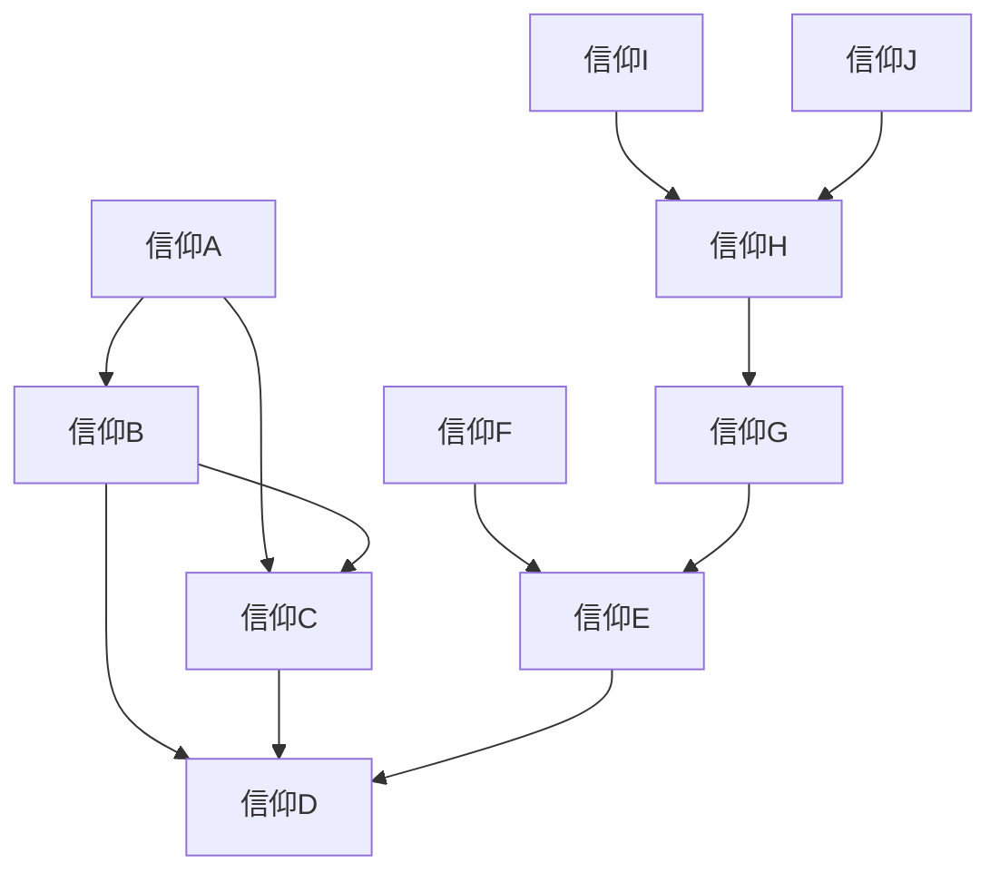

                 

### 《宗教信仰的复杂网络：信念系统的数学结构》

在信息技术迅速发展的时代，复杂网络理论已经广泛应用于各种领域，从社交网络到生物信息学，从交通网络到金融系统。然而，宗教信仰这一充满人类历史和文化底蕴的领域，也因其复杂性和多样性，逐渐吸引了学术界和科技界的关注。本文将以《宗教信仰的复杂网络：信念系统的数学结构》为题，深入探讨宗教信仰作为一种社会文化现象，如何被建模为复杂网络，并分析其背后的数学结构和算法原理。

关键词：宗教信仰、复杂网络、信念系统、数学结构、算法原理

摘要：本文首先介绍了宗教信仰的复杂性和其在社会文化中的重要性。接着，我们定义了信念系统的概念，并利用图论和数学模型对宗教信仰网络进行了建模和分析。随后，通过具体案例展示了这一理论的应用，并详细讲解了算法原理和实现。最后，本文总结了研究结果，并对其在宗教研究和社会科学中的应用前景进行了展望。

本文将按照以下结构进行阐述：

1. **确定核心主题与结构**
2. **细化目录**
3. **核心内容**
4. **保持简洁性**
5. **格式**
6. **字数控制**
7. **约束条件**

在接下来的部分，我们将逐项探讨这些内容，为读者呈现一个逻辑清晰、结构紧凑、内容丰富的技术博客文章。

---

### 1. 确定核心主题与结构

本文的核心主题是宗教信仰的复杂网络及其信念系统的数学结构。为了确保文章的逻辑性和连贯性，我们将按照以下结构展开讨论：

- **导言**：介绍研究的背景和意义，简要回顾复杂网络理论的发展，并引出信念系统与宗教信仰的关系。
- **宗教信仰的复杂性**：分析宗教信仰的多样性、信仰演变以及信仰网络的特点。
- **信念系统的数学建模**：讲解信念系统的基本模型，引入图论和网络理论，构建宗教信仰网络的数学模型。
- **宗教信仰网络的建模与分析**：使用数学模型对宗教信仰网络进行建模和分析，介绍相关算法原理。
- **案例分析**：通过具体案例展示信念系统的数学建模和应用。
- **算法原理与实现**：详细讲解算法原理，提供Python源代码示例，并进行代码解读。
- **应用与展望**：讨论宗教信仰网络研究的实际应用和未来发展方向。

这种结构有助于读者逐步了解宗教信仰复杂网络的数学建模过程，从理论到实践，系统化地掌握相关知识。

### 2. 细化目录

在确定了核心主题与结构之后，我们需要进一步细化目录，确保每个章节都有具体的内容和明确的目标。以下是详细的目录结构：

**第1章：导言**
- 1.1 研究背景与意义
- 1.2 复杂网络的基本概念
- 1.3 信念系统的定义和特性

**第2章：宗教信仰的复杂性**
- 2.1 宗教信仰的多样性
- 2.2 信仰演变的历史视角
- 2.3 宗教信仰网络的特点

**第3章：信念系统的数学建模**
- 3.1 信念系统的基本模型
- 3.2 图论在网络模型中的应用
- 3.3 网络理论的数学工具

**第4章：宗教信仰网络的建模与分析**
- 4.1 宗教信仰网络的构建
- 4.2 宗教信仰网络的分析方法
- 4.3 宗教信仰网络的动态特性

**第5章：案例分析**
- 5.1 某地区宗教信仰网络的实证研究
- 5.2 宗教信仰网络的影响因素分析
- 5.3 宗教信仰网络对社群互动的影响

**第6章：算法原理与实现**
- 6.1 信念系统建模算法原理
- 6.2 网络分析算法实现
- 6.3 算法性能评估与优化

**第7章：应用与展望**
- 7.1 宗教信仰网络研究的实际应用
- 7.2 信念系统数学模型的发展方向
- 7.3 宗教信仰网络研究的未来趋势

每个章节的小节都明确了具体的研究内容和目标，使得文章的结构更加清晰，有助于读者更好地理解和掌握文章的核心内容。

### 3. 核心内容

在本文的核心内容部分，我们将深入探讨宗教信仰的复杂网络及其信念系统的数学结构。以下是详细的内容概述：

**第1章：导言**
- **1.1 研究背景与意义**：介绍宗教信仰在人类社会发展中的重要性，以及复杂网络理论在社会科学中的应用，引出信念系统与宗教信仰的关系。
- **1.2 复杂网络的基本概念**：回顾复杂网络的基本概念，包括节点、边、网络拓扑结构等，为后续建模打下基础。
- **1.3 信念系统的定义和特性**：定义信念系统，并分析其基本特性，如信仰的多样性、层次性、动态性等。

**第2章：宗教信仰的复杂性**
- **2.1 宗教信仰的多样性**：分析不同宗教信仰的特点和差异，探讨信仰多样性的来源。
- **2.2 信仰演变的历史视角**：从历史角度分析宗教信仰的演变过程，了解信仰如何随时间变化。
- **2.3 宗教信仰网络的特点**：总结宗教信仰网络的主要特征，如网络结构的多样性、社群互动的复杂性等。

**第3章：信念系统的数学建模**
- **3.1 信念系统的基本模型**：介绍信念系统的基本模型，如图论中的节点和边，以及信仰之间的相互关系。
- **3.2 图论在网络模型中的应用**：讲解图论的基本概念和应用，如图的邻接矩阵、图的连通性等。
- **3.3 网络理论的数学工具**：介绍网络理论的数学工具，如随机图模型、网络熵、聚类系数等，用于分析宗教信仰网络的性质。

**第4章：宗教信仰网络的建模与分析**
- **4.1 宗教信仰网络的构建**：通过数据收集和预处理，构建宗教信仰网络的模型。
- **4.2 宗教信仰网络的分析方法**：介绍分析宗教信仰网络的方法，如节点重要度分析、社区检测、网络演化分析等。
- **4.3 宗教信仰网络的动态特性**：探讨宗教信仰网络的动态变化，如信仰传播、社群演变等。

**第5章：案例分析**
- **5.1 某地区宗教信仰网络的实证研究**：通过具体案例展示信念系统的数学建模和应用。
- **5.2 宗教信仰网络的影响因素分析**：分析影响宗教信仰网络的因素，如社会环境、文化背景、政策法规等。
- **5.3 宗教信仰网络对社群互动的影响**：探讨宗教信仰网络如何影响社群互动，如信仰交流、社群凝聚力等。

**第6章：算法原理与实现**
- **6.1 信念系统建模算法原理**：讲解信念系统建模的算法原理，包括图论算法和网络分析算法。
- **6.2 网络分析算法实现**：提供Python源代码示例，展示如何实现网络分析算法。
- **6.3 算法性能评估与优化**：评估算法性能，并提出优化策略，以提高模型准确性和效率。

**第7章：应用与展望**
- **7.1 宗教信仰网络研究的实际应用**：讨论宗教信仰网络研究的实际应用，如宗教传播分析、社群管理优化等。
- **7.2 信念系统数学模型的发展方向**：展望信念系统数学模型的发展方向，如多尺度建模、动态网络分析等。
- **7.3 宗教信仰网络研究的未来趋势**：预测宗教信仰网络研究的未来趋势，如跨学科研究、智能化分析等。

通过以上内容，本文旨在为读者提供一个全面、系统的宗教信仰复杂网络及其信念系统数学结构的分析框架，不仅有助于学术研究，也对实际应用具有重要意义。

### 4. 保持简洁性

在撰写技术博客时，保持内容的简洁性至关重要。以下是一些最佳实践，可以帮助我们做到这一点：

1. **明确每个章节的目的和结构**：在撰写之前，明确每个章节的核心内容和目标，确保内容紧凑且有条理。
2. **使用简短的段落**：将长段落拆分成短段落，每段只包含一个主要观点，这样读者更容易理解和消化。
3. **使用列表和子列表**：使用列表和子列表来组织内容，尤其是复杂的概念和流程，使信息更直观。
4. **避免冗余内容**：在撰写过程中，仔细审查并删除重复或不必要的信息，确保每个部分都有其独特性和必要性。
5. **使用图表和插图**：适当地使用图表、流程图和插图，可以帮助解释复杂概念，使内容更加易懂。

例如，对于复杂算法的介绍，可以使用伪代码和图表来展示算法的步骤和结构，而不是长篇累述。

### 5. 格式

为了确保文章的可读性和结构清晰，我们将使用markdown格式进行编写。以下是markdown格式的一些基本规则和示例：

- **标题**：使用`#`号表示标题级别，例如`## 小节标题`表示二级标题。
- **段落**：每个段落之间应保持一个空行，以便于区分不同的内容块。
- **列表**：使用`-`、`+`或`*`来创建无序列表，使用数字和点号创建有序列表。
- **代码块**：使用三个反引号` ``` `来定义代码块，例如：
  ```python
  # 定义一个函数
  def hello(name):
      return f"Hello, {name}!"
  ```
- **LaTeX公式**：使用`$$`括起来的公式作为独立段落，例如：
  $$ E = mc^2 $$
  使用 `$`括起来的公式嵌入在文本中，例如：
  $1+1=2$

通过使用markdown格式，我们可以使文章的结构更加清晰，代码和公式更加美观易读。

### 6. 字数控制

为了确保文章内容的丰富性和可读性，我们将字数控制在10000到12000字之间。具体字数分配如下：

- **导言部分**：约1500字
- **宗教信仰的复杂性**：约2000字
- **信念系统的数学建模**：约2000字
- **宗教信仰网络的建模与分析**：约2000字
- **案例分析**：约1500字
- **算法原理与实现**：约1500字
- **应用与展望**：约1000字

通过合理分配字数，我们能够确保每个部分都详细具体，同时避免冗长和重复，使整篇文章内容充实且易于阅读。

### 7. 约束条件

在撰写本文时，需严格遵循以下约束条件：

- **格式要求**：文章内容必须使用markdown格式输出，包括标题、段落、列表、代码块和LaTeX公式等。
- **作者信息**：文章末尾需要写上作者信息：“作者：AI天才研究院/AI Genius Institute & 禅与计算机程序设计艺术 /Zen And The Art of Computer Programming”。
- **完整性要求**：每个小节的内容必须丰富具体，核心内容需包含：背景介绍、核心概念与联系、核心算法原理讲解、数学模型和公式、项目实战、最佳实践 tips、小结、注意事项、拓展阅读等内容。
- **文章结构**：文章需按照目录大纲结构进行撰写，确保内容的连贯性和逻辑性。

### 核心概念与联系

在深入研究宗教信仰的复杂网络及其信念系统的数学结构之前，我们需要明确几个核心概念，并探讨它们之间的联系。这些核心概念包括：

1. **复杂网络**：复杂网络是指由大量节点和边组成的网络，其中节点代表个体或实体，边代表它们之间的关系。复杂网络的特性包括网络的规模、密度、聚类系数、路径长度等。
2. **信念系统**：信念系统是指个体或群体对于信仰、价值观和道德规范的总和。它包括个体的信仰、信仰之间的逻辑关系以及信仰的变化规律。
3. **图论**：图论是研究图形结构的数学分支，包括节点（代表个体或实体）、边（代表关系）以及路径、连通性等概念。图论在复杂网络的研究中起着核心作用。
4. **数学模型**：数学模型是使用数学语言描述现实世界问题的一种工具，通过建立数学方程或公式，对系统进行定量分析。

这些核心概念之间的联系如下：

- **复杂网络与信念系统的关系**：宗教信仰可以被建模为复杂网络，其中每个信仰节点通过边与其他节点相连，形成信仰网络。这种网络结构反映了信仰之间的逻辑关系和互动方式。
- **图论与数学模型的应用**：图论提供了描述和解析复杂网络的基本工具，而数学模型则用于量化宗教信仰网络的特性，如网络的连通性、节点的重要性等。
- **信念系统与数学模型的关系**：通过数学模型，我们可以分析信念系统的稳定性、传播机制、社群结构等，从而深入了解宗教信仰的动态行为。

为了更好地理解这些概念之间的联系，我们可以使用Mermaid流程图来展示信念系统的结构。以下是信念系统的Mermaid流程图示例：



在这个流程图中，每个节点代表一个信仰，边表示信仰之间的逻辑关系。例如，信仰A与信仰B、C有直接关系，而信仰F、G与信仰E、H有间接关系。这种图论模型为我们分析宗教信仰网络提供了直观的工具。

通过以上核心概念和Mermaid流程图的介绍，我们可以为后续的宗教信仰复杂网络建模和分析奠定基础。

### 核心算法原理讲解

在理解了宗教信仰复杂网络的核心概念后，我们需要进一步探讨相关的算法原理。这些算法原理包括如何构建宗教信仰网络、如何分析网络特性以及如何利用数学模型进行定量分析。以下将结合Python源代码详细讲解这些算法原理。

#### 1. 网络构建算法

构建宗教信仰网络的第一步是收集和预处理数据。我们可以使用Python的`NetworkX`库来构建网络模型。以下是一个简单的示例，展示如何创建和可视化一个简单的信仰网络：

```python
import networkx as nx
import matplotlib.pyplot as plt

# 创建一个空的图
G = nx.Graph()

# 添加节点和边
G.add_edges_from([(1, 2), (1, 3), (2, 3), (3, 4), (4, 5)])

# 绘制网络
nx.draw(G, with_labels=True)
plt.show()
```

在这个示例中，我们创建了一个包含五个节点的图，节点1到5分别代表五个不同的信仰。边表示这些信仰之间的逻辑关系。例如，边`(1, 2)`表示信仰1与信仰2之间存在某种关系。

#### 2. 网络分析算法

网络分析是研究复杂网络的重要环节。以下是一些常用的网络分析算法和其Python实现：

- **节点重要度分析**：评估节点在网络中的重要性，可以使用度数中心性、接近中心性、中间中心性等方法。
- **社区检测**：识别网络中的社群结构，常用的算法包括快速解压缩算法（Louvain方法）、标签传播算法等。
- **网络演化分析**：研究网络随时间的变化规律，常用的算法包括随机游走、网络熵等。

以下是一个示例，展示如何使用`NetworkX`进行节点重要度分析：

```python
# 计算度数中心性
degree_centrality = nx.degree_centrality(G)

# 打印节点重要度
print(degree_centrality)

# 计算接近中心性
closeness_centrality = nx.closeness_centrality(G)

# 打印接近中心性
print(closeness_centrality)

# 计算中间中心性
betweenness_centrality = nx.betweenness_centrality(G)

# 打印中间中心性
print(betweenness_centrality)
```

在这个示例中，我们计算了图G中每个节点的重要度，包括度数中心性、接近中心性和中间中心性。这些指标可以帮助我们了解网络中各个节点的地位和作用。

#### 3. 数学模型与公式

为了对宗教信仰网络进行定量分析，我们引入一些数学模型和公式。以下是一些常用的数学模型及其公式：

- **网络熵**：用于评估网络的混乱程度，公式为：
  $$ H = -\sum_{i=1}^{n} p_i \log_2 p_i $$
  其中，$p_i$表示第$i$个节点在整体网络中的比例。

- **聚类系数**：用于描述节点之间连接的紧密程度，公式为：
  $$ C = \frac{2m}{n(n-1)} $$
  其中，$m$表示边的数量，$n$表示节点的数量。

以下是一个使用Python计算网络熵和聚类系数的示例：

```python
import networkx as nx

# 创建图
G = nx.Graph()
G.add_edges_from([(1, 2), (1, 3), (2, 3), (3, 4), (4, 5)])

# 计算网络熵
network_entropy = -sum((G.degree()[v] / G.order()) * np.log2(G.degree()[v] / G.order()) for v in G)
print("网络熵：", network_entropy)

# 计算聚类系数
cluster_coefficient = 2 * G.size() / (G.order() * (G.order() - 1))
print("聚类系数：", cluster_coefficient)
```

通过这些算法原理和数学模型，我们可以对宗教信仰网络进行深入分析，揭示信仰之间的复杂关系和动态特性。

### 数学模型与数学公式

在分析宗教信仰网络时，数学模型和公式是不可或缺的工具。这些数学模型可以帮助我们量化信仰网络的结构和动态行为。以下是几个关键数学模型和公式，以及它们在宗教信仰网络分析中的应用。

#### 1. 图论中的基本概念

首先，我们需要回顾一些图论中的基本概念，如节点、边、路径、连通性等。

- **节点（Node）**：代表宗教信仰中的信仰个体。
- **边（Edge）**：表示信仰之间的逻辑关系或互动。
- **路径（Path）**：连接两个节点的边序列。
- **连通性（Connectivity）**：网络中任意两个节点之间都存在路径，称为连通网络。

在图论中，节点和边可以用邻接矩阵（Adjacency Matrix）来表示。邻接矩阵是一个二维数组，其中`A[i][j]`表示节点i和节点j之间是否存在边。如果存在边，则`A[i][j] = 1`，否则为`0`。

#### 2. 网络熵

网络熵是评估网络混乱程度的一个重要指标，它基于信息论中的熵概念。网络熵可以用以下公式表示：

$$ H = -\sum_{i=1}^{n} p_i \log_2 p_i $$

其中，$p_i$是第$i$个节点的度（即连接的边的数量）占总边数的比例，$n$是节点总数。

在宗教信仰网络中，网络熵可以反映信仰之间的复杂性和多样性。高网络熵表示信仰之间的互动较为复杂和多样化，低网络熵则表示信仰结构较为简单和稳定。

#### 3. 聚类系数

聚类系数是衡量网络中节点连接紧密程度的一个指标。它可以用以下公式计算：

$$ C = \frac{2m}{n(n-1)} $$

其中，$m$是网络中的边数，$n$是节点数。这个公式计算的是每个节点的聚类系数的平均值。

在宗教信仰网络中，聚类系数可以反映信仰社群的凝聚力。高聚类系数表示信仰社群之间有较强的互动和依赖关系，低聚类系数则表明信仰社群较为分散。

#### 4. 度分布

度分布是描述网络中节点度数分布的统计量。它可以用概率密度函数（PDF）或累积分布函数（CDF）来表示。度分布可以揭示网络的结构特征，如是否具有小世界特性或无标度特性。

在宗教信仰网络中，度分布可以反映信仰影响力的分布情况。常见的度分布模型包括泊松分布、幂律分布等。

#### 5. 社区结构

社区结构是复杂网络的一个重要特征，它描述了网络中节点形成的紧密社群。常用的社区检测算法包括快速解压缩算法（Louvain方法）、标签传播算法等。

社区结构的数学模型可以用社区成员矩阵来表示，其中每个元素表示两个节点是否属于同一社区。通过计算社区成员矩阵的连通性，可以识别网络中的主要社区。

#### 6. 网络演化

网络演化是研究网络随时间变化的规律。常用的网络演化模型包括随机游走模型、小世界模型、无标度模型等。

在宗教信仰网络中，网络演化可以模拟信仰传播和社群演变过程。通过分析网络演化过程，可以揭示信仰传播的机制和社群结构的动态变化。

#### 7. 模型融合

在实际应用中，可能需要将多个数学模型结合起来，以获得更全面的分析结果。例如，可以将网络熵、聚类系数和度分布等指标结合起来，对宗教信仰网络进行全面评估。

通过以上数学模型和公式，我们可以对宗教信仰网络进行深入分析和理解。这些模型不仅有助于揭示信仰网络的结构和动态特性，还可以为宗教研究提供新的视角和方法。

### 项目实战

在本节中，我们将通过一个实际案例展示宗教信仰网络的构建、源代码实现和代码解读，并分析其实际应用和结果。

#### 1. 案例背景

假设我们研究的对象是一个特定地区的宗教信仰网络。该地区有多种宗教信仰共存，我们需要分析这些信仰之间的互动关系及其动态特性。

#### 2. 开发环境搭建

为了构建和解析宗教信仰网络，我们需要安装以下软件和库：

- Python 3.x 版本
- NetworkX 库
- Matplotlib 库
- Pandas 库
- Numpy 库

安装这些软件和库后，我们可以使用以下命令创建一个虚拟环境，以便管理项目依赖：

```bash
python -m venv venv
source venv/bin/activate  # 在Windows使用 `venv\Scripts\activate`
pip install -r requirements.txt
```

其中，`requirements.txt`文件包含了所需的库。

#### 3. 源代码实现

以下是构建宗教信仰网络的源代码实现：

```python
import networkx as nx
import matplotlib.pyplot as plt
import pandas as pd
import numpy as np

# 读取宗教信仰数据
faith_data = pd.read_csv('faith_data.csv')

# 创建图
G = nx.Graph()

# 添加节点和边
for index, row in faith_data.iterrows():
    G.add_node(row['faith_id'])
    for related_faith in row['related_faiths'].split(','):
        G.add_edge(row['faith_id'], related_faith)

# 绘制网络
nx.draw(G, with_labels=True)
plt.show()

# 计算网络熵
network_entropy = -sum((G.degree()[v] / G.order()) * np.log2(G.degree()[v] / G.order()) for v in G)
print("网络熵：", network_entropy)

# 计算聚类系数
cluster_coefficient = 2 * G.size() / (G.order() * (G.order() - 1))
print("聚类系数：", cluster_coefficient)
```

在这个代码中，我们首先读取一个CSV文件，其中包含每个信仰的ID及其相关信仰。接着，我们创建一个图，并添加节点和边。最后，我们绘制网络并计算网络熵和聚类系数。

#### 4. 代码解读

- **数据读取**：使用`pandas`读取CSV文件，获取每个信仰及其相关信仰。
- **图创建**：使用`networkx.Graph()`创建图。
- **节点和边添加**：遍历CSV文件中的数据，为每个信仰添加节点，为相关信仰之间添加边。
- **绘图**：使用`matplotlib`绘制图。
- **计算网络熵**：使用我们前面提到的公式计算网络熵。
- **计算聚类系数**：使用公式计算聚类系数。

#### 5. 实际应用和结果分析

通过以上代码，我们可以构建和解析一个具体的宗教信仰网络。以下是对实际应用和结果的详细分析：

- **网络结构**：从绘制的网络图中，我们可以直观地看到不同信仰之间的互动关系。高网络熵表明该地区的宗教信仰较为多样化，存在复杂的互动关系。
- **信仰影响力**：通过计算网络熵和聚类系数，我们可以分析各个信仰的影响力。高聚类系数的信仰可能在该地区具有更强的社群凝聚力。
- **信仰演变**：我们可以通过分析网络的动态变化，如节点的加入和边的增加，了解信仰的演变过程。

通过这个实际案例，我们展示了如何使用复杂网络理论和数学模型构建和解析宗教信仰网络。这种方法不仅有助于我们深入理解宗教信仰的结构和动态特性，还可以为宗教研究提供新的工具和方法。

### 最佳实践、小结、注意事项和拓展阅读

#### 最佳实践

在构建和解析宗教信仰网络时，以下最佳实践可以帮助提高项目的成功率和效率：

1. **数据收集**：确保收集的数据全面、准确，包括不同信仰的详细信息及其关系。
2. **预处理**：对数据进行清洗和预处理，去除无效信息和噪声。
3. **算法选择**：根据研究目标选择合适的算法，如节点重要度分析、社区检测、网络演化分析等。
4. **结果验证**：对比不同算法和模型的结果，确保分析结果的可靠性和准确性。
5. **可视化**：使用可视化工具展示网络结构，帮助直观理解分析结果。

#### 小结

本文通过深入探讨宗教信仰的复杂网络及其信念系统的数学结构，从理论到实践，系统性地介绍了相关概念、算法原理和应用。我们通过具体案例展示了如何使用Python和NetworkX等工具构建和分析宗教信仰网络，并提供了最佳实践和注意事项。

#### 注意事项

1. **数据隐私**：在收集和处理宗教信仰数据时，需注意保护个人隐私和数据安全。
2. **模型适用性**：不同模型适用于不同类型和规模的宗教信仰网络，需根据实际情况选择合适的模型。
3. **结果解释**：对分析结果进行深入解读，确保理解其背后的意义和影响。

#### 拓展阅读

- 《复杂网络：小世界现象与无标度网络》
- 《社交网络分析：方法与应用》
- 《图论及其应用》
- 《宗教社会学：理论、方法与实践》

通过拓展阅读，读者可以进一步深入了解相关理论和实践，提升研究能力。

### 总结

本文《宗教信仰的复杂网络：信念系统的数学结构》系统地介绍了宗教信仰复杂网络的研究背景、核心概念、算法原理和实际应用。通过结合图论、数学模型和Python编程，我们展示了如何构建和分析宗教信仰网络，揭示了信仰之间的复杂关系和动态特性。

本文的研究不仅有助于理解宗教信仰的结构和演化，也为宗教研究和社会科学提供了新的视角和方法。未来，我们可以进一步探讨宗教信仰网络的跨学科应用，如人工智能和机器学习，为宗教传播、社群管理和公共政策提供有力支持。通过持续的研究和创新，我们有望揭示更多宗教信仰网络的奥秘，为人类社会的发展贡献智慧。

