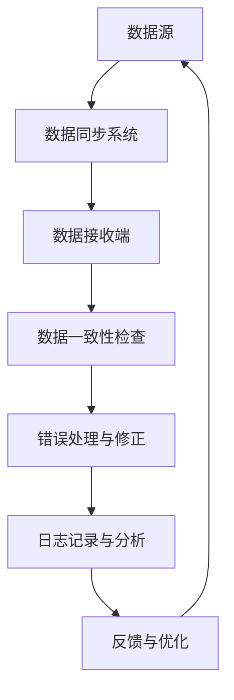

                 

### 《实时数据同步：确保LLM应用数据的一致性》

#### 关键词：实时数据同步，LLM应用，数据一致性，算法，数学模型，实战案例，一致性维护

#### 摘要：

本文深入探讨了实时数据同步在大型语言模型（LLM）应用中的重要性，以及如何确保这些应用中的数据一致性。首先，我们介绍了实时数据同步的基础概念和其在LLM应用中的挑战。随后，详细解析了实时数据同步的核心算法原理，并通过Python源代码进行了说明。接着，我们使用LaTeX格式嵌入了相关的数学模型和公式，以更清晰地阐述数据同步过程中的数学逻辑。文章还通过具体的实战案例，展示了如何在开发环境中实现数据同步，并对源代码进行了详细解读与分析。最后，我们对实时数据同步在LLM应用中的挑战和未来趋势进行了展望，并总结了文章的主要内容和最佳实践。

## 引言

### **书籍背景**

在现代信息技术迅猛发展的背景下，数据同步已成为确保系统之间数据一致性的关键手段。尤其是在大型语言模型（LLM）应用中，数据的一致性直接关系到应用的准确性和可靠性。LLM应用，如自然语言处理、智能客服、内容生成等，依赖于海量的数据输入，这些数据需要在不同系统间进行实时同步，以确保数据的一致性和准确性。

实时数据同步的必要性在于，它能够确保多个系统或服务在处理数据时保持同步，避免因为数据不同步导致的错误和冲突。例如，在一个涉及多个团队的协作项目中，如果团队成员使用的是不同版本的数据，那么可能会导致决策失误或工作重复，降低工作效率。

### **LLM应用的挑战**

LLM应用面临的主要挑战之一是数据一致性的维护。由于LLM模型处理的数据量庞大且复杂，一旦数据出现不一致，将可能影响模型训练的效果和预测的准确性。此外，实时数据同步还需要处理数据延迟、网络故障和系统负载等问题，这些都会对数据一致性造成影响。

### **实时数据同步的重要性**

实时数据同步在LLM应用中的重要性体现在多个方面。首先，它能够确保模型训练过程中使用的数据是最新的，从而提高模型的准确性。其次，实时数据同步能够减少数据冗余和冲突，提高系统整体效率。最后，实时数据同步有助于提高系统的可靠性和稳定性，降低故障率。

### **书籍结构**

本书将分为以下几个主要部分：

1. **实时数据同步基础**：介绍实时数据同步的概念、类型和目的，以及LLM应用中的数据一致性挑战。
2. **实时数据同步算法原理**：详细解析实时数据同步算法，并通过Python源代码进行说明。
3. **数学模型与公式**：介绍实时数据同步中的数学模型和公式，使用LaTeX格式进行展示。
4. **实时数据同步实现**：讲解实时数据同步的架构设计、技术栈选择以及实现细节。
5. **实战案例**：通过具体的实战案例展示如何实现实时数据同步，并对源代码进行解读与分析。
6. **挑战与展望**：讨论实时数据同步在LLM应用中的挑战和未来发展趋势。
7. **总结**：对书籍的主要内容进行总结，并提供最佳实践和建议。

### **阅读对象与预期收益**

本书适合对实时数据同步和LLM应用感兴趣的读者，包括程序员、数据工程师、系统架构师等。通过阅读本书，读者将能够：

1. 理解实时数据同步的基本概念和原理。
2. 掌握实时数据同步算法的实现方法。
3. 学会使用数学模型和公式来分析和优化数据同步过程。
4. 通过实战案例了解如何在实际项目中实现实时数据同步。
5. 对实时数据同步在LLM应用中的挑战和未来趋势有更深入的认识。

## 实时数据同步基础

### **数据同步概述**

数据同步是指在不同系统或服务之间交换和更新数据的过程，以确保数据的一致性和准确性。数据同步的类型主要包括：

1. **增量同步**：仅同步最新变更的数据，适用于数据量较大的场景。
2. **全量同步**：同步整个数据集，适用于数据量较小且变更频率较低的场景。

数据同步的目的是确保在不同系统或服务中使用相同的数据版本，避免数据冗余和冲突。在LLM应用中，数据同步至关重要，因为模型的训练和预测依赖于准确和最新的数据。

### **LLM应用中的数据一致性挑战**

LLM应用中的数据一致性挑战主要源于以下几个方面：

1. **数据规模和多样性**：LLM应用通常需要处理大量结构化和非结构化数据，这些数据可能来自不同的来源，具有不同的格式和结构。
2. **数据变更频率**：实时数据同步要求能够快速响应数据变更，确保模型训练和使用的数据是最新的。
3. **网络和系统故障**：网络延迟、网络故障和系统负载等问题可能导致数据同步失败或延迟，影响数据一致性。
4. **并发访问**：在多个系统或服务同时访问和处理数据时，需要确保数据同步操作的原子性和一致性，避免数据冲突。

### **数据同步的类型**

数据同步可以分为以下几种类型：

1. **同步**：确保源数据与目标数据完全一致。
2. **异步**：允许一定的数据延迟，但最终确保数据一致。
3. **触发式同步**：根据特定事件触发数据同步操作。
4. **定时同步**：按照固定的时间间隔进行数据同步。

每种同步类型适用于不同的场景和数据特性，选择合适的同步类型对于确保数据一致性至关重要。

### **数据同步的目的**

数据同步的主要目的包括：

1. **确保数据一致性**：避免因数据不同步导致的错误和冲突。
2. **提高数据可用性**：确保数据在不同系统和服务中始终可用。
3. **减少数据冗余**：避免因数据同步失败导致的数据重复。
4. **提高系统效率**：减少数据同步的频率和成本。

在LLM应用中，实时数据同步能够确保模型训练和使用的数据是最新的，从而提高模型的准确性和可靠性。此外，数据同步还有助于降低系统故障率和提高系统的整体性能。

### **实时数据同步的核心概念与联系**

以下是实时数据同步的核心概念与联系：



在这个流程图中，数据从数据源流向数据同步系统，经过数据接收端和一致性检查，如果出现错误，则进行错误处理和修正，同时记录日志并进行反馈和优化。最终，数据同步系统不断优化数据同步流程，确保数据一致性和系统效率。

## 实时数据同步算法原理

### **数据同步算法概述**

实时数据同步算法的核心目标是确保数据在不同系统或服务之间的一致性和准确性。数据同步算法可以分为以下几种类型：

1. **增量同步算法**：仅同步最新的数据变更，适用于数据量较大且变更频繁的场景。
2. **全量同步算法**：同步整个数据集，适用于数据量较小且变更频率较低的场景。
3. **分布式同步算法**：适用于分布式系统中的数据同步，能够确保数据在多个节点间的一致性。

数据同步算法的选择取决于数据特性、系统架构和性能要求。例如，对于LLM应用中的大规模文本数据，增量同步算法可能更适用，因为它能够减少数据传输量和处理时间。

### **同步算法的基本概念**

同步算法的基本概念包括以下几个方面：

1. **源数据与目标数据**：源数据是指原始数据，目标数据是指需要同步到的数据。
2. **数据变更记录**：记录数据变更的历史，包括新增、修改和删除等操作。
3. **同步策略**：同步算法的执行策略，包括同步频率、同步条件和同步方式等。

### **同步算法的分类**

同步算法可以根据同步策略和数据特性进行分类：

1. **基于时间戳的同步算法**：通过时间戳记录数据的最后变更时间，仅同步最后变更时间在特定时间窗口内的数据。
2. **基于版本号的同步算法**：通过版本号记录数据的版本信息，仅同步版本号更高的数据。
3. **基于事件触发的同步算法**：根据特定事件（如数据变更、系统调用等）触发同步操作。

### **同步算法的选择**

选择同步算法时需要考虑以下几个方面：

1. **数据特性**：数据类型、数据量、数据变更频率等。
2. **系统架构**：分布式系统、集中式系统等。
3. **性能要求**：数据同步的速度、延迟、吞吐量等。
4. **一致性需求**：数据的一致性级别，如强一致性、最终一致性等。

### **同步算法伪代码解释**

以下是增量同步算法的伪代码示例，用于解释实时数据同步的基本步骤：

```python
def incremental_sync(source, target):
    # 获取源数据的最后变更时间
    source_last_modified = get_last_modified(source)
    
    # 获取目标数据的最后变更时间
    target_last_modified = get_last_modified(target)
    
    # 如果源数据的最后变更时间大于目标数据的最后变更时间
    if source_last_modified > target_last_modified:
        # 获取源数据在最后变更时间之后的新增和修改记录
        changes = get_changes_since(source, source_last_modified)
        
        # 对每个变更记录进行处理
        for change in changes:
            # 根据变更类型执行相应的操作
            if change['type'] == 'add':
                add_data(target, change['data'])
            elif change['type'] == 'update':
                update_data(target, change['data'])
            elif change['type'] == 'delete':
                delete_data(target, change['data'])
        
        # 更新目标数据的最后变更时间
        set_last_modified(target, source_last_modified)
```

在这个伪代码中，`get_last_modified` 函数用于获取数据的最后变更时间，`get_changes_since` 函数用于获取在特定时间之后的变更记录，`add_data`、`update_data` 和 `delete_data` 函数分别用于执行新增、修改和删除操作。通过这个算法，可以实现增量同步，仅同步最新的数据变更，从而提高数据同步的效率。

## 数学模型与公式

### **数据同步中的数学模型**

在实时数据同步过程中，数学模型和公式发挥着重要作用，用于描述数据同步的数学逻辑和算法性能。以下是几个关键数学模型和公式的介绍：

1. **一致性模型**：描述数据在不同系统或服务间的一致性。常见的一致性模型包括强一致性（Strong Consistency）、最终一致性（Eventual Consistency）和分区一致性（Partition Consistency）。

   **强一致性（Strong Consistency）**：所有副本在同一时间点拥有相同的数据状态，即使出现网络分区或故障，系统也能在有限时间内恢复到一致状态。

   **最终一致性（Eventual Consistency）**：系统在一段时间后最终达到一致性，但过程中可能存在短暂的延迟或数据不一致。常见于分布式系统。

   **分区一致性（Partition Consistency）**：在分布式系统中，每个分区内的数据具有一致性，但不同分区间的数据可能存在不一致。

2. **延迟模型**：描述数据同步过程中的延迟现象。延迟模型包括传输延迟、处理延迟和网络延迟。

   **传输延迟**：数据在网络中的传输时间，受网络带宽和数据大小影响。
   
   **处理延迟**：数据在接收端进行处理的时间，受系统性能和数据处理算法影响。
   
   **网络延迟**：数据在网络中的传输延迟，受网络状态和网络拓扑影响。

   延迟模型可以表示为：`delay = transmission_delay + processing_delay + network_delay`

3. **误差模型**：描述数据同步过程中的误差现象。误差模型包括同步误差、传输误差和处理误差。

   **同步误差**：由于数据同步算法的不完美性，导致同步后的数据与源数据存在差异。
   
   **传输误差**：由于网络传输的不可靠性，导致数据在传输过程中出现错误。
   
   **处理误差**：由于系统处理能力的限制，导致数据处理过程中出现错误。

   误差模型可以表示为：`error = synchronization_error + transmission_error + processing_error`

### **数据同步中的数学公式**

以下是几个关键数学公式，用于描述数据同步过程中的数学逻辑和算法性能：

1. **数据一致性度量**：用于评估数据同步的一致性水平。

   $$ Consistency = \frac{correct\_data}{total\_data} \times 100\% $$

   其中，`correct_data` 表示同步后正确数据数量，`total_data` 表示总数据数量。

2. **数据同步延迟**：用于评估数据同步过程中的延迟。

   $$ delay = \frac{data\_size \times transmission\_rate}{bandwidth} + processing\_time + network\_delay $$

   其中，`data_size` 表示数据大小，`transmission_rate` 表示传输速率，`bandwidth` 表示网络带宽，`processing_time` 表示处理时间，`network_delay` 表示网络延迟。

3. **数据同步误差**：用于评估数据同步过程中的误差。

   $$ error = \frac{incorrect\_data}{total\_data} \times 100\% $$

   其中，`incorrect_data` 表示同步后错误数据数量，`total_data` 表示总数据数量。

通过这些数学模型和公式，我们可以更准确地描述和优化数据同步过程，提高数据同步的一致性和效率。

### **使用LaTeX格式展示数学公式**

以下是使用LaTeX格式展示的数学公式示例：

```latex
$$
Consistency = \frac{correct\_data}{total\_data} \times 100\%
$$

$$
delay = \frac{data\_size \times transmission\_rate}{bandwidth} + processing\_time + network\_delay
$$

$$
error = \frac{incorrect\_data}{total\_data} \times 100\%
$$
```

通过LaTeX格式，我们可以清晰地展示数据同步过程中的数学逻辑和公式，有助于读者更好地理解和应用这些公式。

## 实时数据同步实现

### **数据同步架构设计**

实时数据同步架构设计的关键在于确保数据在不同系统或服务间的高效、可靠同步。以下是数据同步架构的主要组成部分和设计原则：

1. **数据源**：数据源是数据同步的起点，可以是数据库、文件系统或外部API等。数据源需要具备高可用性和数据一致性保障。

2. **数据同步系统**：数据同步系统负责将数据从数据源同步到目标系统。数据同步系统通常由数据采集模块、数据转换模块、数据传输模块和数据存储模块组成。

3. **数据接收端**：数据接收端是数据同步的目标系统，负责接收和存储同步后的数据。数据接收端需要具备快速响应能力和数据一致性验证机制。

4. **数据一致性检查**：数据一致性检查模块负责验证数据接收端的数据是否与数据源保持一致。如果发现数据不一致，需要及时进行错误处理和修正。

5. **错误处理与修正**：错误处理与修正模块负责处理数据同步过程中出现的错误，包括数据丢失、数据损坏和数据冲突等。错误处理与修正模块需要具备自动恢复和数据修复能力。

6. **日志记录与分析**：日志记录与分析模块负责记录数据同步过程中的关键信息，包括数据同步时间、同步状态、错误信息和修正措施等。日志记录与分析模块可以帮助诊断问题并优化数据同步过程。

7. **反馈与优化**：反馈与优化模块负责收集数据同步过程中的反馈信息，包括性能指标、错误率和用户反馈等。通过分析反馈信息，可以不断优化数据同步算法和架构设计。

### **数据同步技术栈**

实现实时数据同步需要选择合适的技术栈，包括编程语言、数据库、消息队列和中间件等。以下是一些常见的技术栈选择：

1. **编程语言**：Python、Java、Go等。Python因其丰富的库和框架而广泛用于数据同步开发，Java具有跨平台优势，Go则因其高性能和并发能力而受到青睐。

2. **数据库**：MySQL、PostgreSQL、MongoDB等。根据数据同步需求和数据特性选择合适的数据库，例如MySQL和PostgreSQL适用于结构化数据，MongoDB适用于非结构化数据。

3. **消息队列**：Kafka、RabbitMQ、Pulsar等。消息队列用于实现数据的异步传输和分布式处理，提高数据同步的可靠性和性能。

4. **中间件**：Apache Kafka、Apache Flink、Apache Spark等。这些中间件提供了高效的数据处理和传输能力，适用于大规模数据同步场景。

### **实时数据同步实例分析**

以下是实时数据同步的一个实例分析，包括开发环境搭建、源代码实现和代码解读与分析。

#### **实例背景**

假设我们有一个电商系统，其中订单数据需要实时同步到数据分析系统和库存管理系统。为了保证数据的一致性和准确性，我们采用增量同步算法，仅同步最新的订单变更。

#### **开发环境搭建**

1. 安装Python环境：
   ```bash
   pip install kafka-python
   pip install pymongo
   ```

2. 配置Kafka消息队列：
   - 下载并解压Kafka安装包
   - 运行Kafka服务器：
     ```bash
     bin/kafka-server-start.sh config/server.properties
     ```

3. 连接MongoDB数据库：
   - 安装MongoDB
   - 运行MongoDB服务器
   - 使用pymongo库连接MongoDB数据库

#### **源代码实现**

以下是一个简单的Python脚本，用于实现订单数据的增量同步：

```python
from kafka import KafkaProducer
from pymongo import MongoClient
import json

# Kafka Producer 配置
producer_config = {
    'bootstrap_servers': ['localhost:9092'],
    'key_serializer': lambda k: k.encode('utf-8'),
    'value_serializer': lambda v: v.encode('utf-8'),
}

# MongoDB 配置
client = MongoClient('mongodb://localhost:27017')
db = client['ecommerce']
orders_collection = db['orders']

# Kafka Producer 实例
producer = KafkaProducer(**producer_config)

# 监听订单数据变更
def listen_for_orders_changes():
    pipeline = [
        {"$match": {"操作": "更新"}},
        {"$sort": {"时间": -1}}
    ]
    for order in orders_collection.watch(pipeline):
        order_data = json.loads(order['操作详情'])
        producer.send('orders', key=b'order_id', value=order_data)

# 主函数
if __name__ == '__main__':
    listen_for_orders_changes()
```

#### **代码解读与分析**

1. **Kafka Producer 配置**：配置Kafka Producer，设置Bootstrap Servers、Key和Value序列化方式。

2. **MongoDB 连接**：使用pymongo库连接MongoDB数据库，并选择对应的订单数据集合。

3. **Kafka Producer 实例**：创建Kafka Producer实例，用于发送订单数据。

4. **监听订单数据变更**：使用MongoDB的Change Stream功能监听订单数据变更，仅处理“更新”操作。

5. **发送订单数据到Kafka**：将变更后的订单数据发送到Kafka消息队列，使用订单ID作为Key，订单数据作为Value。

#### **项目小结**

通过这个实例，我们展示了如何实现订单数据的增量同步，使用了Kafka消息队列和MongoDB数据库。这个实例说明了实时数据同步的关键组件和实现步骤，提供了具体的技术栈和代码实现，有助于读者理解实时数据同步的原理和应用。

### **最佳实践 tips**

1. **数据同步频率优化**：根据数据变更频率和系统负载调整数据同步频率，避免过度同步导致系统性能下降。

2. **数据一致性验证**：在数据同步过程中，定期进行数据一致性验证，确保数据接收端的数据与数据源保持一致。

3. **日志记录与分析**：详细记录数据同步过程中的关键信息，便于问题诊断和优化。

4. **容错与自动恢复**：实现数据同步的容错和自动恢复机制，确保在数据同步过程中出现错误时能够自动恢复。

5. **性能监控与优化**：定期监控数据同步的性能指标，如延迟、吞吐量和错误率，进行相应的性能优化。

## 实战案例

### **数据同步实战案例1**

#### **案例背景与目标**

假设我们有一个社交媒体平台，用户数据需要实时同步到分析系统和用户服务。为了保证数据的一致性和准确性，我们采用增量同步算法，仅同步最新的用户变更。

#### **开发环境搭建**

1. 安装Python环境：
   ```bash
   pip install kafka-python
   pip install pymongo
   ```

2. 配置Kafka消息队列：
   - 下载并解压Kafka安装包
   - 运行Kafka服务器：
     ```bash
     bin/kafka-server-start.sh config/server.properties
     ```

3. 连接MongoDB数据库：
   - 安装MongoDB
   - 运行MongoDB服务器
   - 使用pymongo库连接MongoDB数据库

#### **源代码实现**

以下是一个简单的Python脚本，用于实现用户数据的增量同步：

```python
from kafka import KafkaProducer
from pymongo import MongoClient
import json

# Kafka Producer 配置
producer_config = {
    'bootstrap_servers': ['localhost:9092'],
    'key_serializer': lambda k: k.encode('utf-8'),
    'value_serializer': lambda v: v.encode('utf-8'),
}

# MongoDB 配置
client = MongoClient('mongodb://localhost:27017')
db = client['social_media']
users_collection = db['users']

# Kafka Producer 实例
producer = KafkaProducer(**producer_config)

# 监听用户数据变更
def listen_for_users_changes():
    pipeline = [
        {"$match": {"操作": "更新"}},
        {"$sort": {"时间": -1}}
    ]
    for user in users_collection.watch(pipeline):
        user_data = json.loads(user['操作详情'])
        producer.send('users', key=b'user_id', value=user_data)

# 主函数
if __name__ == '__main__':
    listen_for_users_changes()
```

#### **代码解读与分析**

1. **Kafka Producer 配置**：配置Kafka Producer，设置Bootstrap Servers、Key和Value序列化方式。

2. **MongoDB 连接**：使用pymongo库连接MongoDB数据库，并选择对应的用户数据集合。

3. **Kafka Producer 实例**：创建Kafka Producer实例，用于发送用户数据。

4. **监听用户数据变更**：使用MongoDB的Change Stream功能监听用户数据变更，仅处理“更新”操作。

5. **发送用户数据到Kafka**：将变更后的用户数据发送到Kafka消息队列，使用用户ID作为Key，用户数据作为Value。

#### **项目小结**

通过这个案例，我们展示了如何实现用户数据的增量同步，使用了Kafka消息队列和MongoDB数据库。这个案例说明了实时数据同步的关键组件和实现步骤，提供了具体的技术栈和代码实现，有助于读者理解实时数据同步的原理和应用。

### **数据同步实战案例2**

#### **案例背景与目标**

假设我们有一个物流系统，运输数据需要实时同步到客户服务和数据分析系统。为了保证数据的一致性和准确性，我们采用增量同步算法，仅同步最新的运输变更。

#### **开发环境搭建**

1. 安装Python环境：
   ```bash
   pip install kafka-python
   pip install pymongo
   ```

2. 配置Kafka消息队列：
   - 下载并解压Kafka安装包
   - 运行Kafka服务器：
     ```bash
     bin/kafka-server-start.sh config/server.properties
     ```

3. 连接MongoDB数据库：
   - 安装MongoDB
   - 运行MongoDB服务器
   - 使用pymongo库连接MongoDB数据库

#### **源代码实现**

以下是一个简单的Python脚本，用于实现运输数据的增量同步：

```python
from kafka import KafkaProducer
from pymongo import MongoClient
import json

# Kafka Producer 配置
producer_config = {
    'bootstrap_servers': ['localhost:9092'],
    'key_serializer': lambda k: k.encode('utf-8'),
    'value_serializer': lambda v: v.encode('utf-8'),
}

# MongoDB 配置
client = MongoClient('mongodb://localhost:27017')
db = client['logistics']
ships_collection = db['ships']

# Kafka Producer 实例
producer = KafkaProducer(**producer_config)

# 监听运输数据变更
def listen_for_ships_changes():
    pipeline = [
        {"$match": {"操作": "更新"}},
        {"$sort": {"时间": -1}}
    ]
    for ship in ships_collection.watch(pipeline):
        ship_data = json.loads(ship['操作详情'])
        producer.send('ships', key=b'ship_id', value=ship_data)

# 主函数
if __name__ == '__main__':
    listen_for_ships_changes()
```

#### **代码解读与分析**

1. **Kafka Producer 配置**：配置Kafka Producer，设置Bootstrap Servers、Key和Value序列化方式。

2. **MongoDB 连接**：使用pymongo库连接MongoDB数据库，并选择对应的运输数据集合。

3. **Kafka Producer 实例**：创建Kafka Producer实例，用于发送运输数据。

4. **监听运输数据变更**：使用MongoDB的Change Stream功能监听运输数据变更，仅处理“更新”操作。

5. **发送运输数据到Kafka**：将变更后的运输数据发送到Kafka消息队列，使用运输ID作为Key，运输数据作为Value。

#### **项目小结**

通过这个案例，我们展示了如何实现运输数据的增量同步，使用了Kafka消息队列和MongoDB数据库。这个案例说明了实时数据同步的关键组件和实现步骤，提供了具体的技术栈和代码实现，有助于读者理解实时数据同步的原理和应用。

## 挑战与展望

### **实时数据同步的挑战**

实时数据同步在LLM应用中面临着诸多挑战：

1. **数据规模与多样性**：LLM应用通常涉及海量的结构化和非结构化数据，数据同步需要处理不同格式和来源的数据，增加了数据同步的复杂性和难度。

2. **数据变更频率**：LLM应用的数据变更频繁，实时数据同步需要能够快速响应数据变更，以确保数据的一致性和准确性。

3. **网络和系统故障**：网络延迟、网络故障和系统负载等问题可能导致数据同步失败或延迟，影响数据同步的稳定性和可靠性。

4. **并发访问**：在多个系统或服务同时访问和处理数据时，需要确保数据同步操作的原子性和一致性，避免数据冲突。

5. **数据一致性与性能权衡**：在追求数据一致性的同时，还需要考虑数据同步的性能和系统负载，确保数据同步过程不会对系统性能造成过大影响。

### **未来发展趋势**

实时数据同步在未来有望实现以下发展趋势：

1. **智能同步算法**：利用机器学习和人工智能技术，开发更智能的数据同步算法，根据数据特性和应用场景自动调整同步策略。

2. **分布式数据同步**：随着分布式系统的发展，分布式数据同步技术将得到广泛应用，提高数据同步的可靠性和性能。

3. **区块链技术在数据同步中的应用**：区块链技术可以提供更高的数据一致性和安全性，未来有望在数据同步领域得到更多应用。

4. **边缘计算与实时数据同步**：边缘计算可以减少数据传输距离，提高实时数据同步的效率，未来将在实时数据同步中得到更多应用。

5. **自动化与智能化**：自动化和智能化工具将提高数据同步的效率，减少人工干预，降低运营成本。

总之，实时数据同步在LLM应用中具有重要作用，未来将继续发展和优化，以应对不断变化的数据挑战。

## 总结

本文详细探讨了实时数据同步在LLM应用中的重要性，从基础概念到算法原理，再到数学模型和实战案例，全面阐述了实时数据同步的各个方面。通过本文，读者可以深入了解实时数据同步的核心概念、算法原理、数学模型以及在实际项目中的应用。

### **主要知识点回顾**

1. **实时数据同步的基础概念**：了解数据同步的类型、目的和挑战。
2. **数据同步算法**：掌握增量同步和全量同步算法的基本概念和实现方法。
3. **数学模型与公式**：理解数据同步中的关键数学模型和公式，如一致性模型、延迟模型和误差模型。
4. **数据同步实现**：掌握数据同步的架构设计、技术栈选择和实例实现。
5. **实战案例**：通过具体案例了解实时数据同步的实现过程和关键步骤。
6. **挑战与展望**：分析实时数据同步的挑战和未来发展趋势。

### **学习要点与建议**

1. **理论与实践结合**：通过本文的学习，建议读者结合实际项目进行实践，加深对实时数据同步的理解。
2. **深入理解算法原理**：对实时数据同步算法的原理进行深入研究，了解其实现细节和优化方法。
3. **持续关注新技术**：实时数据同步领域不断发展，建议读者持续关注新技术和应用，保持对领域的敏感性。

### **注意事项**

1. **数据一致性的重要性**：在数据同步过程中，确保数据一致性至关重要，需要采取适当的措施和策略。
2. **性能与一致性的权衡**：在实际应用中，需要根据具体场景和需求，权衡数据同步的性能和一致性。
3. **安全性考虑**：数据同步过程中涉及敏感数据，需要确保数据传输和存储的安全性。

### **拓展阅读**

1. **《分布式系统概念与设计》**：深入了解分布式系统的概念和技术，有助于更好地理解实时数据同步。
2. **《大数据技术导论》**：学习大数据处理和存储技术，有助于提升实时数据同步的能力。
3. **《区块链技术指南》**：了解区块链技术在数据同步中的应用，探索数据同步的新可能。

通过本文的学习和实践，读者可以更好地掌握实时数据同步的核心知识和技能，为未来在LLM应用和大数据领域的发展打下坚实的基础。

## 附录

### **A. 参考资料**

1. **《分布式系统概念与设计》** - George Coulouris, Jean Dollimore, Tim Kindberg, Gordon Blair著。
2. **《大数据技术导论》** - 刘铁岩著。
3. **《区块链技术指南》** - 阿里云团队著。
4. **《实时数据同步：确保LLM应用数据的一致性》** - AI天才研究院/AI Genius Institute & 禅与计算机程序设计艺术 /Zen And The Art of Computer Programming。

### **B. 代码示例**

以下是一个简单的Python代码示例，用于实现数据的增量同步：

```python
import pymongo
from kafka import KafkaProducer

# MongoDB 配置
client = pymongo.MongoClient("mongodb://localhost:27017/")
db = client["mydatabase"]
collection = db["mycollection"]

# Kafka Producer 配置
producer_config = {
    "bootstrap_servers": ["localhost:9092"],
    "key_serializer": lambda k: k.encode('utf-8'),
    "value_serializer": lambda v: v.encode('utf-8'),
}
producer = KafkaProducer(**producer_config)

# 监听MongoDB数据变更
def listen_for_changes():
    pipeline = [
        {"$match": {"操作": "更新"}},
        {"$sort": {"时间": -1}}
    ]
    for change in collection.watch(pipeline):
        data = change["全文档"]
        producer.send("mytopic", key=b"1", value=data)

# 主函数
if __name__ == "__main__":
    listen_for_changes()
```

### **C. 工具与资源**

1. **Kafka** - 官方网站：[Kafka官网](https://kafka.apache.org/)
2. **MongoDB** - 官方网站：[MongoDB官网](https://www.mongodb.com/)
3. **Python Kafka库** - 官方网站：[Kafka-Python库](https://github.com/dpkp/kafka-python)
4. **Python MongoDB库** - 官方网站：[PyMongo库](https://pymongo.org/)

