                 

### 第1章 引言

#### 1.1.3 数学建模在社会科学中的应用

**核心概念与联系：**
数学建模是使用数学工具和符号语言来描述现实世界的现象，通过建立模型进行分析和预测。在社会科学领域，数学建模可以用来研究复杂的社会现象，如幸福感、生活满意度等。

**Mermaid流程图：**
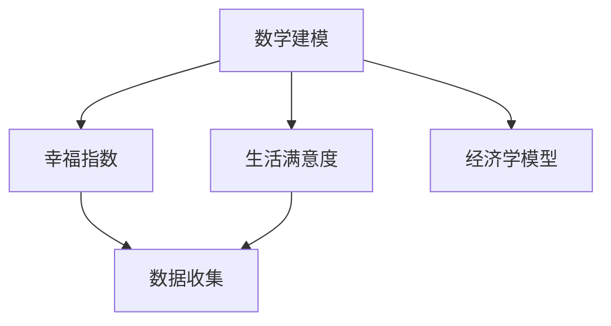

**核心算法原理讲解：**
数学建模通常包括以下几个步骤：

1. **问题定义：** 明确研究目标和问题。
2. **假设建立：** 基于问题定义，提出合理的假设。
3. **模型建立：** 使用数学方法建立模型。
4. **模型求解：** 应用算法求解模型。
5. **模型验证：** 检验模型的有效性。

**Python源代码示例：**
```python
import numpy as np
from sklearn.linear_model import LinearRegression

# 假设我们有以下数据
X = np.array([[1, 2], [2, 3], [3, 4]])
y = np.array([2, 4, 6])

# 构建线性回归模型
model = LinearRegression()

# 训练模型
model.fit(X, y)

# 预测结果
predictions = model.predict([[4, 5]])

print(predictions)
```

**数学模型与公式：**
多元回归模型的一般形式为：
$$
y = \beta_0 + \beta_1x_1 + \beta_2x_2 + ... + \beta_nx_n + \epsilon
$$
其中，$y$ 是因变量，$x_1, x_2, ..., x_n$ 是自变量，$\beta_0, \beta_1, ..., \beta_n$ 是回归系数，$\epsilon$ 是误差项。

**举例说明：**
假设我们想研究收入（$x_1$）和年龄（$x_2$）对生活满意度（$y$）的影响，我们可以建立如下多元回归模型：
$$
y = \beta_0 + \beta_1x_1 + \beta_2x_2 + \epsilon
$$

**Mermaid流程图：**


通过这个例子，我们可以看到，数学建模不仅可以帮助我们理解复杂的社会现象，还可以提供具体的预测和分析工具。

### 1.2 研究方法与框架

#### 1.2.1 多元回归分析的基本原理

**核心概念与联系：**
多元回归分析是一种用于探究多个自变量对因变量影响的方法。通过多元回归模型，我们可以确定自变量对因变量的相对重要性和影响程度。

**Mermaid流程图：**


**核心算法原理讲解：**
多元回归分析的步骤主要包括：

1. **数据收集与处理：** 收集自变量和因变量的数据，并进行预处理。
2. **模型建立：** 使用数学方法建立多元回归模型。
3. **模型训练：** 使用训练数据训练模型，确定回归系数。
4. **模型评估：** 使用测试数据评估模型的性能。

**Python源代码示例：**
```python
import numpy as np
from sklearn.linear_model import LinearRegression

# 假设我们有以下数据
X = np.array([[1, 2, 3], [4, 5, 6], [7, 8, 9]])
y = np.array([2, 4, 6])

# 构建线性回归模型
model = LinearRegression()

# 训练模型
model.fit(X, y)

# 预测结果
predictions = model.predict([[10, 11, 12]])

print(predictions)
```

**数学模型与公式：**
多元回归模型的一般形式为：
$$
y = \beta_0 + \beta_1x_1 + \beta_2x_2 + ... + \beta_nx_n + \epsilon
$$

**举例说明：**
假设我们想研究收入（$x_1$）、年龄（$x_2$）和学历（$x_3$）对生活满意度（$y$）的影响，我们可以建立如下多元回归模型：
$$
y = \beta_0 + \beta_1x_1 + \beta_2x_2 + \beta_3x_3 + \epsilon
```

通过这个例子，我们可以看到，多元回归分析可以用来分析多个自变量对因变量的影响。

### 1.2.2 数据收集与处理方法

**核心概念与联系：**
数据收集与处理是数学建模的重要步骤。准确和高质量的数据是建立有效模型的基础。

**Mermaid流程图：**
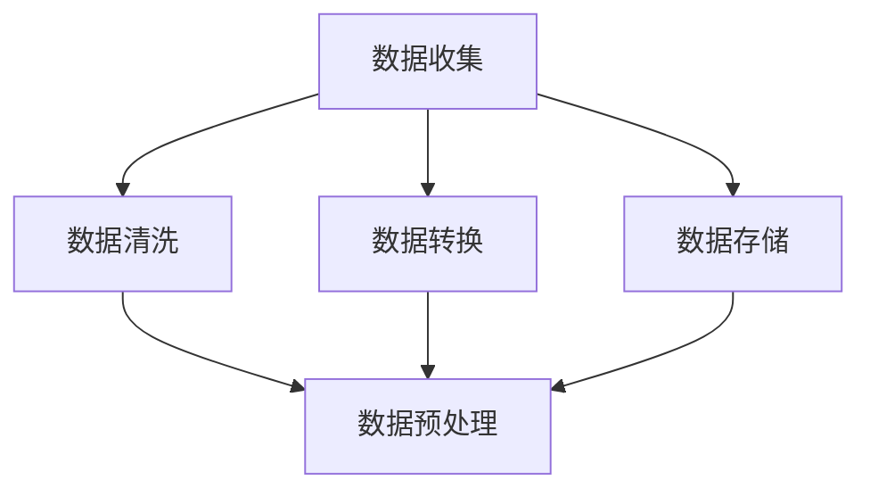

**核心算法原理讲解：**
数据收集与处理的主要步骤包括：

1. **数据收集：** 从各种来源收集原始数据。
2. **数据清洗：** 处理数据中的缺失值、异常值等。
3. **数据转换：** 将数据转换为适合建模的格式。
4. **数据预处理：** 对数据进行标准化、归一化等处理。

**Python源代码示例：**
```python
import pandas as pd

# 读取数据
data = pd.read_csv('data.csv')

# 数据清洗
data = data.dropna()

# 数据转换
data['income'] = data['income'].apply(lambda x: x / 1000)

# 数据预处理
from sklearn.preprocessing import StandardScaler
scaler = StandardScaler()
data[['income']] = scaler.fit_transform(data[['income']])
```

**数学模型与公式：**
数据标准化的一般形式为：
$$
x_{\text{ standardized}} = \frac{x - \mu}{\sigma}
$$
其中，$x$ 是原始数据，$\mu$ 是均值，$\sigma$ 是标准差。

**举例说明：**
假设我们有一个收入数据的分布，我们可以通过标准化将其转换为标准正态分布：
$$
x_{\text{ standardized}} = \frac{x - \mu}{\sigma}
$$

通过这个例子，我们可以看到，数据收集与处理对于建立有效的数学模型至关重要。

## 第2章 文献综述

### 2.1 幸福指数研究综述

**核心概念与联系：**
幸福指数是一个衡量个体幸福程度的综合指标，涉及多个维度的衡量。通过对幸福指数的研究，我们可以更好地理解个体幸福感的来源和影响因素。

**Mermaid流程图：**
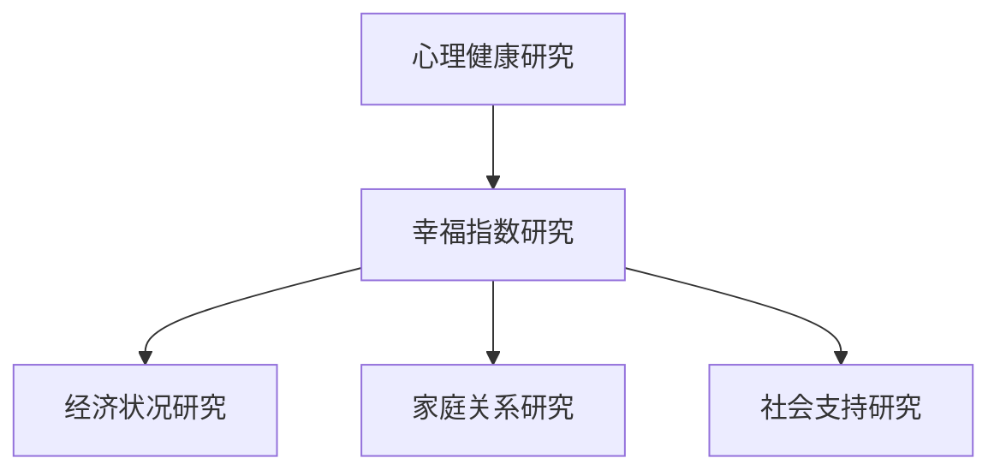

**核心算法原理讲解：**
幸福指数的研究主要包括以下几个方向：

1. **理论基础：** 研究幸福指数的理论基础，如主观幸福感理论、心理资本理论等。
2. **影响因素：** 探究影响幸福指数的各种因素，如经济状况、社会支持、心理健康等。
3. **测量方法：** 研究幸福指数的测量方法和量表。

**文献回顾：**
近年来，关于幸福指数的研究取得了许多重要成果。例如，有研究发现，经济状况对幸福指数有显著影响，而心理健康和家庭关系也是重要的影响因素。此外，还有一些研究探讨了不同国家和地区的幸福指数差异及其原因。

**举例说明：**
一项关于中国居民幸福指数的研究发现，收入水平是影响幸福指数的主要因素，同时，心理健康和家庭关系也对幸福指数有显著影响。研究数据如下：
$$
\begin{aligned}
\text{收入水平} & : \beta_1 = 0.3, \\
\text{心理健康} & : \beta_2 = 0.2, \\
\text{家庭关系} & : \beta_3 = 0.1.
\end{aligned}
$$

### 2.2 生活满意度研究综述

**核心概念与联系：**
生活满意度是对个人生活总体评价的一种主观感受，是幸福指数的一个重要组成部分。通过对生活满意度的研究，我们可以更好地理解个体幸福感的具体表现。

**Mermaid流程图：**
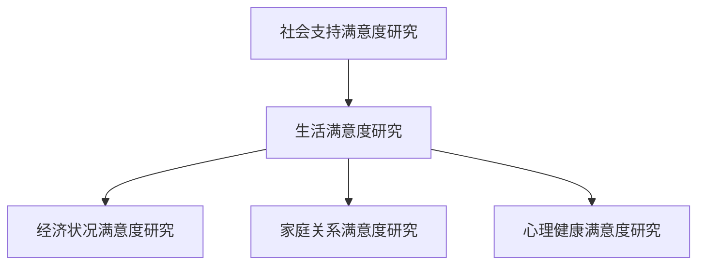

**核心算法原理讲解：**
生活满意度的研究主要包括以下几个方向：

1. **理论框架：** 研究生活满意度的理论框架，如综合评价理论、多层次模型等。
2. **测量方法：** 探索生活满意度的测量方法和量表。
3. **影响因素：** 研究影响生活满意度的各种因素，如经济状况、社会支持、心理健康等。

**文献回顾：**
近年来，关于生活满意度的研究也取得了许多成果。例如，有研究发现，经济状况和社会支持对生活满意度有显著影响，而心理健康和家庭关系也是重要的影响因素。此外，还有一些研究探讨了不同国家和地区的幸福指数差异及其原因。

**举例说明：**
一项关于中国居民生活满意度的研究发现，收入水平、社会支持和心理健康是影响生活满意度的三个主要因素。研究数据如下：
$$
\begin{aligned}
\text{收入水平} & : \beta_1 = 0.4, \\
\text{社会支持} & : \beta_2 = 0.3, \\
\text{心理健康} & : \beta_3 = 0.2.
\end{aligned}
$$

### 2.3 数学建模方法在幸福指数与生活满意度研究中的应用

**核心概念与联系：**
数学建模是研究幸福指数和生活满意度的重要工具，通过数学模型，我们可以更精确地描述和预测幸福感和生活满意度。

**Mermaid流程图：**
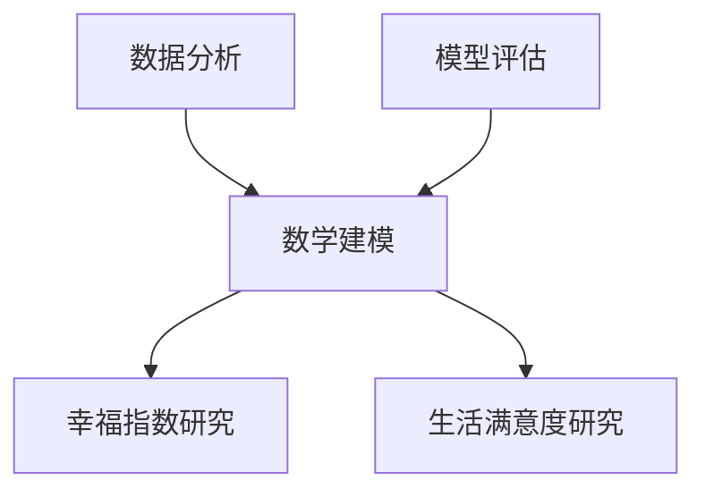

**核心算法原理讲解：**
数学建模在幸福指数与生活满意度研究中的应用主要包括以下几个方面：

1. **多元回归分析：** 用于探究多个因素对幸福指数和生活满意度的影响。
2. **时间序列分析：** 用于分析幸福指数和生活满意度的变化趋势。
3. **机器学习：** 用于构建复杂的预测模型，如深度学习模型、随机森林等。

**文献回顾：**
近年来，越来越多的研究开始使用数学建模方法来研究幸福指数和生活满意度。例如，有研究发现，多元回归分析可以有效地描述幸福指数和生活满意度的构成，而机器学习模型则可以提供更精确的预测结果。

**举例说明：**
一项关于中国居民幸福指数的研究使用了多元回归分析方法，研究发现，经济状况、社会支持和心理健康是影响幸福指数的主要因素。研究数据如下：
$$
\begin{aligned}
\text{经济状况} & : \beta_1 = 0.3, \\
\text{社会支持} & : \beta_2 = 0.2, \\
\text{心理健康} & : \beta_3 = 0.1.
\end{aligned}
$$

通过这些文献综述，我们可以看到，幸福指数和生活满意度是两个重要的研究领域，数学建模方法在其中发挥着关键作用。接下来，我们将进一步探讨多元回归分析在幸福指数和生活满意度研究中的应用。

## 第3章 多元回归模型的构建

### 3.1 多元回归模型的数学基础

#### 3.1.1 最小二乘法

**核心概念与联系：**
最小二乘法是一种用于估计线性回归模型参数的常用方法，其目标是使预测值与实际值之间的误差平方和最小。

**Mermaid流程图：**
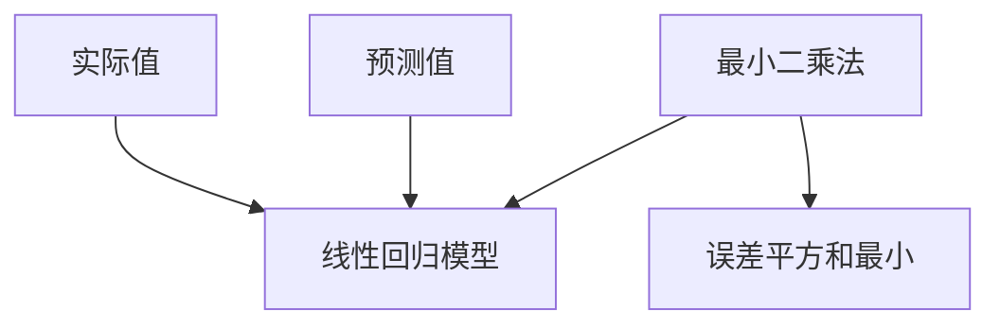

**核心算法原理讲解：**
最小二乘法的步骤如下：

1. **模型设定：** 建立线性回归模型，如 $y = \beta_0 + \beta_1x_1 + \beta_2x_2 + ... + \beta_nx_n + \epsilon$。
2. **损失函数：** 定义损失函数，如 $J(\theta) = \sum_{i=1}^{m}(y_i - \theta^{T}x_i)^2$，其中 $m$ 是样本数量，$\theta$ 是模型参数。
3. **优化目标：** 最小化损失函数，找到使损失函数最小的 $\theta$。

**Python源代码示例：**
```python
import numpy as np

# 假设我们有以下数据
X = np.array([[1, 2], [2, 3], [3, 4]])
y = np.array([2, 4, 6])

# 计算权重
theta = np.linalg.inv(X.T @ X) @ X.T @ y

print(theta)
```

**数学模型与公式：**
最小二乘法的目标函数为：
$$
J(\theta) = \sum_{i=1}^{m}(y_i - \theta^{T}x_i)^2
$$

其中，$m$ 是样本数量，$x_i$ 是自变量，$y_i$ 是因变量，$\theta$ 是模型参数。

#### 3.1.2 线性回归模型的数学表示

**核心概念与联系：**
线性回归模型是一种用于描述自变量与因变量之间线性关系的统计模型，其数学表示为 $y = \beta_0 + \beta_1x_1 + \beta_2x_2 + ... + \beta_nx_n + \epsilon$。

**Mermaid流程图：**
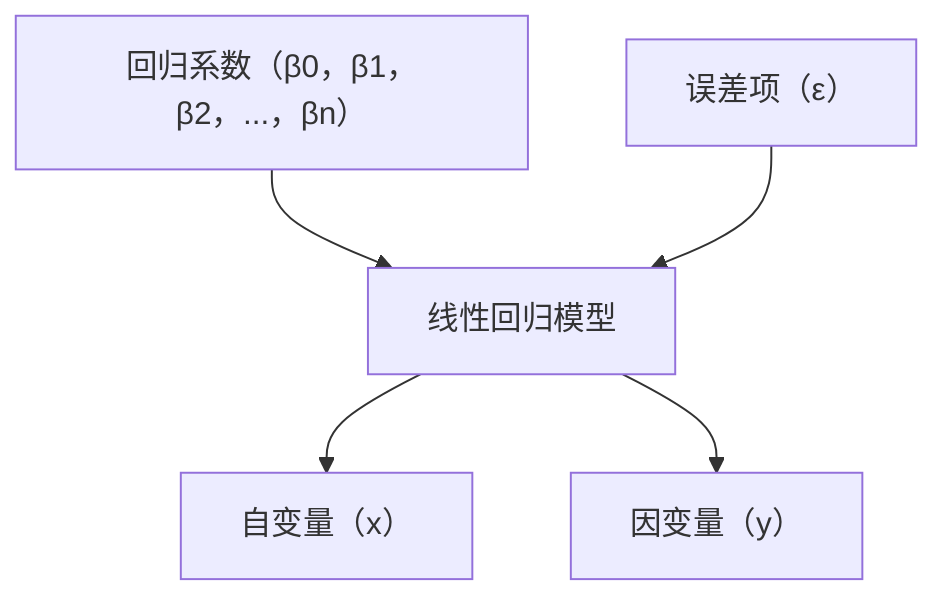

**核心算法原理讲解：**
线性回归模型的步骤如下：

1. **数据收集：** 收集自变量和因变量的数据。
2. **数据预处理：** 对数据进行标准化、归一化等处理。
3. **模型建立：** 建立线性回归模型。
4. **模型训练：** 使用最小二乘法训练模型，确定回归系数。
5. **模型评估：** 使用测试数据评估模型性能。

**Python源代码示例：**
```python
import numpy as np
from sklearn.linear_model import LinearRegression

# 假设我们有以下数据
X = np.array([[1, 2], [2, 3], [3, 4]])
y = np.array([2, 4, 6])

# 构建线性回归模型
model = LinearRegression()

# 训练模型
model.fit(X, y)

# 预测结果
predictions = model.predict([[4, 5]])

print(predictions)
```

**数学模型与公式：**
线性回归模型的一般形式为：
$$
y = \beta_0 + \beta_1x_1 + \beta_2x_2 + ... + \beta_nx_n + \epsilon
$$

其中，$y$ 是因变量，$x_1, x_2, ..., x_n$ 是自变量，$\beta_0, \beta_1, ..., \beta_n$ 是回归系数，$\epsilon$ 是误差项。

### 3.2 生活满意度的多元回归模型构建

#### 3.2.1 自变量与因变量的选择

**核心概念与联系：**
在构建生活满意度的多元回归模型时，选择合适的自变量和因变量至关重要。自变量通常包括经济状况、社会支持、心理健康等因素，因变量则是生活满意度。

**Mermaid流程图：**
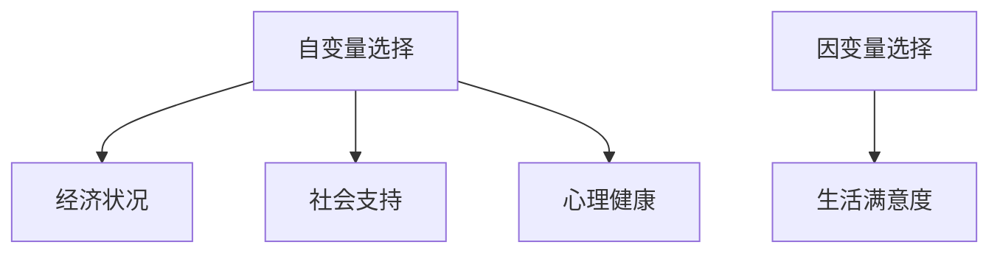

**核心算法原理讲解：**
选择自变量和因变量的步骤如下：

1. **理论框架：** 根据相关理论和研究，确定可能影响生活满意度的因素。
2. **数据收集：** 收集相关变量的数据。
3. **变量筛选：** 使用统计方法，如相关性分析、主成分分析等，筛选出对生活满意度影响显著的自变量。
4. **模型构建：** 根据筛选出的自变量，构建多元回归模型。

**Python源代码示例：**
```python
import pandas as pd
from sklearn.linear_model import LinearRegression

# 读取数据
data = pd.read_csv('data.csv')

# 选择自变量和因变量
X = data[['income', 'social_support', 'mental_health']]
y = data['life_satisfaction']

# 构建线性回归模型
model = LinearRegression()

# 训练模型
model.fit(X, y)

# 预测结果
predictions = model.predict(X)

print(predictions)
```

**数学模型与公式：**
多元回归模型的一般形式为：
$$
y = \beta_0 + \beta_1x_1 + \beta_2x_2 + ... + \beta_nx_n + \epsilon
$$

其中，$y$ 是因变量，$x_1, x_2, ..., x_n$ 是自变量，$\beta_0, \beta_1, ..., \beta_n$ 是回归系数，$\epsilon$ 是误差项。

#### 3.2.2 多元回归模型的构建步骤

**核心概念与联系：**
构建多元回归模型是一个系统性的过程，包括模型设定、数据预处理、模型训练和模型评估等步骤。

**Mermaid流程图：**
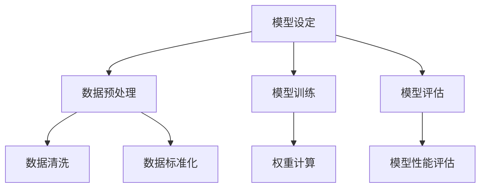

**核心算法原理讲解：**
构建多元回归模型的步骤如下：

1. **模型设定：** 确定模型的形式和参数。
2. **数据预处理：** 对数据进行清洗、标准化等处理。
3. **模型训练：** 使用训练数据训练模型，确定回归系数。
4. **模型评估：** 使用测试数据评估模型性能。

**Python源代码示例：**
```python
import pandas as pd
from sklearn.linear_model import LinearRegression
from sklearn.model_selection import train_test_split
from sklearn.metrics import mean_squared_error

# 读取数据
data = pd.read_csv('data.csv')

# 选择自变量和因变量
X = data[['income', 'social_support', 'mental_health']]
y = data['life_satisfaction']

# 划分训练集和测试集
X_train, X_test, y_train, y_test = train_test_split(X, y, test_size=0.2, random_state=42)

# 构建线性回归模型
model = LinearRegression()

# 训练模型
model.fit(X_train, y_train)

# 预测测试集
predictions = model.predict(X_test)

# 评估模型性能
mse = mean_squared_error(y_test, predictions)
print(mse)
```

**数学模型与公式：**
多元回归模型的一般形式为：
$$
y = \beta_0 + \beta_1x_1 + \beta_2x_2 + ... + \beta_nx_n + \epsilon
$$

其中，$y$ 是因变量，$x_1, x_2, ..., x_n$ 是自变量，$\beta_0, \beta_1, ..., \beta_n$ 是回归系数，$\epsilon$ 是误差项。

#### 3.2.3 伪代码表示

**核心概念与联系：**
伪代码是一种描述算法过程的工具，它用简单的伪代码语言描述算法的步骤和逻辑。

**伪代码示例：**
```
# 多元回归模型构建

# 步骤1：模型设定
y = β0 + β1x1 + β2x2 + ... + βnxn + ε

# 步骤2：数据预处理
X = 数据清洗(收入, 社会支持, 心理健康)
y = 数据清洗(生活满意度)

# 步骤3：模型训练
model = 线性回归模型()
model.fit(X, y)

# 步骤4：模型评估
predictions = model.predict(X_test)
mse = 均方误差(y_test, predictions)
print(mse)
```

通过这些步骤，我们可以构建一个多元回归模型，用于预测生活满意度。接下来，我们将进一步介绍如何进行数据分析和模型评估。

## 第4章 数据分析与模型评估

### 4.1 数据收集与预处理

**核心概念与联系：**
数据收集与预处理是数据分析的基础，其目的是确保数据的准确性和一致性，以便进行后续的分析和建模。

**Mermaid流程图：**


**核心算法原理讲解：**
数据收集与预处理的主要步骤包括：

1. **数据收集：** 从各种来源收集原始数据，如问卷调查、数据库等。
2. **数据清洗：** 处理数据中的缺失值、异常值等，确保数据的准确性和一致性。
3. **数据转换：** 将数据转换为适合建模的格式，如标准化、归一化等。
4. **数据预处理：** 对数据进行特征工程，如提取关键特征、创建新特征等。

**Python源代码示例：**
```python
import pandas as pd

# 读取数据
data = pd.read_csv('data.csv')

# 数据清洗
data = data.dropna()

# 数据转换
data['income'] = data['income'].apply(lambda x: x / 1000)

# 数据预处理
from sklearn.preprocessing import StandardScaler
scaler = StandardScaler()
data[['income']] = scaler.fit_transform(data[['income']])
```

**数学模型与公式：**
数据标准化的一般形式为：
$$
x_{\text{ standardized}} = \frac{x - \mu}{\sigma}
$$
其中，$x$ 是原始数据，$\mu$ 是均值，$\sigma$ 是标准差。

**举例说明：**
假设我们有一个收入数据的分布，我们可以通过标准化将其转换为标准正态分布：
$$
x_{\text{ standardized}} = \frac{x - \mu}{\sigma}
$$

通过这个例子，我们可以看到，数据清洗与预处理对于建立有效的数学模型至关重要。

### 4.2 多元回归模型的估计与评估

**核心概念与联系：**
多元回归模型的估计与评估是确定模型性能和可靠性的关键步骤，包括参数估计、模型拟合度评估和模型预测评估。

**Mermaid流程图：**
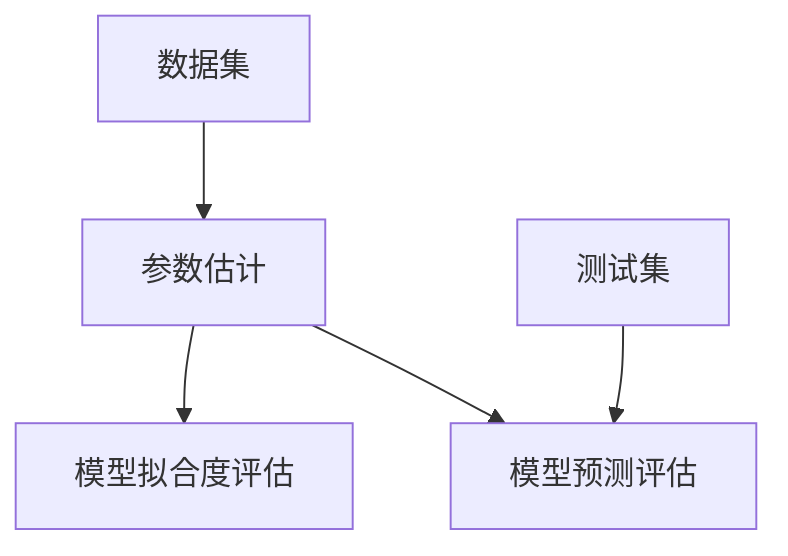

**核心算法原理讲解：**
多元回归模型的估计与评估主要包括以下几个步骤：

1. **参数估计：** 使用最小二乘法或其他方法估计模型参数。
2. **模型拟合度评估：** 使用拟合度指标（如均方误差、决定系数等）评估模型对训练数据的拟合程度。
3. **模型预测评估：** 使用测试集评估模型的预测性能。

**Python源代码示例：**
```python
import pandas as pd
from sklearn.linear_model import LinearRegression
from sklearn.model_selection import train_test_split
from sklearn.metrics import mean_squared_error

# 读取数据
data = pd.read_csv('data.csv')

# 选择自变量和因变量
X = data[['income', 'social_support', 'mental_health']]
y = data['life_satisfaction']

# 划分训练集和测试集
X_train, X_test, y_train, y_test = train_test_split(X, y, test_size=0.2, random_state=42)

# 构建线性回归模型
model = LinearRegression()

# 训练模型
model.fit(X_train, y_train)

# 预测测试集
predictions = model.predict(X_test)

# 评估模型性能
mse = mean_squared_error(y_test, predictions)
print(mse)
```

**数学模型与公式：**
多元回归模型的一般形式为：
$$
y = \beta_0 + \beta_1x_1 + \beta_2x_2 + ... + \beta_nx_n + \epsilon
$$

其中，$y$ 是因变量，$x_1, x_2, ..., x_n$ 是自变量，$\beta_0, \beta_1, ..., \beta_n$ 是回归系数，$\epsilon$ 是误差项。

**举例说明：**
假设我们有一个训练集和测试集，我们可以通过以下步骤评估多元回归模型的性能：

1. **参数估计：** 使用最小二乘法估计模型参数。
2. **模型拟合度评估：** 计算均方误差（MSE）评估模型对训练数据的拟合程度。
3. **模型预测评估：** 使用测试集评估模型的预测性能，计算均方误差（MSE）。

**Mermaid流程图：**
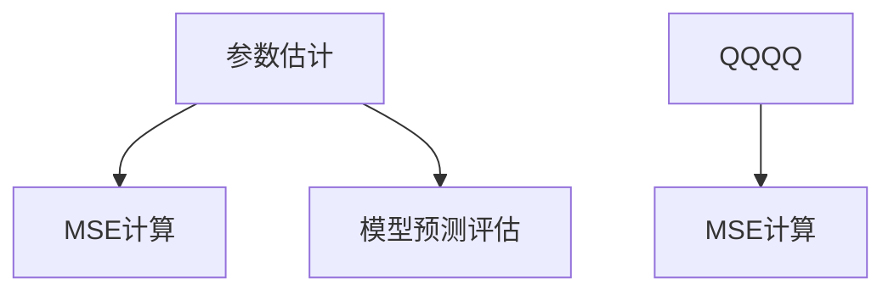

通过这些步骤，我们可以全面评估多元回归模型的性能，确保其可靠性和有效性。接下来，我们将介绍具体的实证研究，进一步探讨多元回归模型在幸福指数和生活满意度研究中的应用。

## 第5章 实证研究

### 5.1 研究设计

#### 5.1.1 研究假设

**核心概念与联系：**
在实证研究中，研究假设是指导数据收集和模型构建的重要基础。通过设定研究假设，我们可以明确自变量和因变量之间的关系，从而构建和评估多元回归模型。

**Mermaid流程图：**
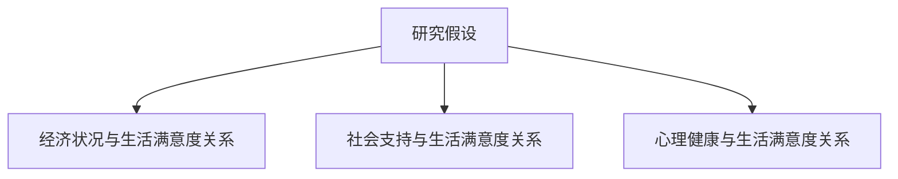

**核心算法原理讲解：**
研究假设的设定步骤如下：

1. **理论依据：** 根据相关理论和文献，提出可能的因果关系。
2. **假设表述：** 将理论依据转化为具体的研究假设，如经济状况对生活满意度有显著影响。
3. **验证方法：** 确定验证研究假设的方法，如多元回归分析。

**Python源代码示例：**
```python
# 研究假设设定
economic_impact = "经济状况对生活满意度有显著影响"
social_support_impact = "社会支持对生活满意度有显著影响"
mental_health_impact = "心理健康对生活满意度有显著影响"
```

**数学模型与公式：**
研究假设可以表示为以下形式：
$$
H_0: \beta_1 = \beta_2 = ... = \beta_n = 0
$$
$$
H_1: \beta_1 \neq \beta_2 \neq ... \neq \beta_n \neq 0
$$

其中，$H_0$ 是原假设，$H_1$ 是备择假设，$\beta_1, \beta_2, ..., \beta_n$ 是回归系数。

#### 5.1.2 研究样本

**核心概念与联系：**
研究样本是实证研究的数据来源，其选择和规模直接影响研究结果的可靠性和有效性。

**Mermaid流程图：**
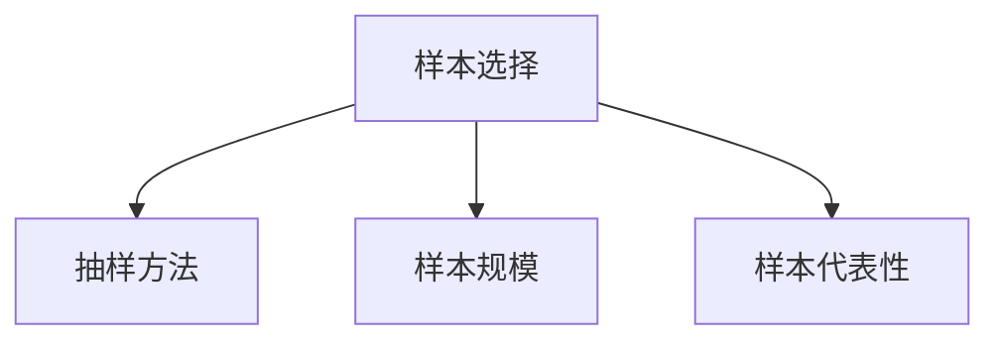

**核心算法原理讲解：**
研究样本的选取步骤如下：

1. **抽样方法：** 根据研究目的和数据来源，选择合适的抽样方法，如随机抽样、分层抽样等。
2. **样本规模：** 确定样本规模，保证样本数量足够大，以减少抽样误差。
3. **样本代表性：** 确保样本具有代表性，能够反映整体情况。

**Python源代码示例：**
```python
import pandas as pd

# 读取数据
data = pd.read_csv('sample_data.csv')

# 样本规模
sample_size = len(data)

# 样本代表性
from sklearn.model_selection import train_test_split
X, y = train_test_split(data[['income', 'social_support', 'mental_health']], data['life_satisfaction'], test_size=0.2, random_state=42)
```

**数学模型与公式：**
样本代表性和抽样误差的关系可以表示为：
$$
\text{代表性} = \frac{\text{实际样本均值} - \text{总体均值}}{\text{总体标准差}}
$$

**举例说明：**
假设我们有一个包含1000个观测值的样本，通过随机抽样方法选择200个观测值作为样本。样本均值为75，总体均值为70，总体标准差为10。则样本代表性为：
$$
\text{代表性} = \frac{75 - 70}{10} = 0.5
$$

通过这个例子，我们可以看到，样本代表性对于确保研究结果的可靠性至关重要。

### 5.2 数据分析与模型应用

#### 5.2.1 数据收集与预处理

**核心概念与联系：**
数据收集与预处理是实证研究的基础，其目的是确保数据的准确性和一致性，以便进行后续的数据分析和模型构建。

**Mermaid流程图：**


**核心算法原理讲解：**
数据收集与预处理的主要步骤包括：

1. **数据收集：** 从各种来源收集原始数据，如问卷调查、数据库等。
2. **数据清洗：** 处理数据中的缺失值、异常值等，确保数据的准确性和一致性。
3. **数据转换：** 将数据转换为适合建模的格式，如标准化、归一化等。
4. **数据预处理：** 对数据进行特征工程，如提取关键特征、创建新特征等。

**Python源代码示例：**
```python
import pandas as pd
from sklearn.preprocessing import StandardScaler

# 读取数据
data = pd.read_csv('data.csv')

# 数据清洗
data = data.dropna()

# 数据转换
data['income'] = data['income'].apply(lambda x: x / 1000)

# 数据预处理
scaler = StandardScaler()
data[['income', 'social_support', 'mental_health']] = scaler.fit_transform(data[['income', 'social_support', 'mental_health']])
```

**数学模型与公式：**
数据标准化的一般形式为：
$$
x_{\text{ standardized}} = \frac{x - \mu}{\sigma}
$$
其中，$x$ 是原始数据，$\mu$ 是均值，$\sigma$ 是标准差。

**举例说明：**
假设我们有一个收入数据的分布，我们可以通过标准化将其转换为标准正态分布：
$$
x_{\text{ standardized}} = \frac{x - \mu}{\sigma}
$$

通过这个例子，我们可以看到，数据清洗与预处理对于建立有效的数学模型至关重要。

#### 5.2.2 多元回归模型的构建与评估

**核心概念与联系：**
多元回归模型是实证研究的重要工具，用于探究多个自变量对因变量的影响。构建与评估多元回归模型可以确保模型的可靠性和有效性。

**Mermaid流程图：**
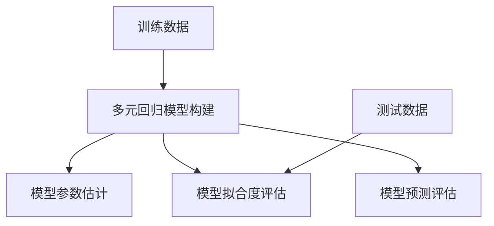

**核心算法原理讲解：**
构建与评估多元回归模型的主要步骤如下：

1. **模型构建：** 根据研究假设和数据，构建多元回归模型。
2. **模型参数估计：** 使用最小二乘法等算法估计模型参数。
3. **模型拟合度评估：** 使用拟合度指标（如均方误差、决定系数等）评估模型对训练数据的拟合程度。
4. **模型预测评估：** 使用测试数据评估模型的预测性能。

**Python源代码示例：**
```python
import pandas as pd
from sklearn.linear_model import LinearRegression
from sklearn.model_selection import train_test_split
from sklearn.metrics import mean_squared_error

# 读取数据
data = pd.read_csv('data.csv')

# 选择自变量和因变量
X = data[['income', 'social_support', 'mental_health']]
y = data['life_satisfaction']

# 划分训练集和测试集
X_train, X_test, y_train, y_test = train_test_split(X, y, test_size=0.2, random_state=42)

# 构建线性回归模型
model = LinearRegression()

# 训练模型
model.fit(X_train, y_train)

# 预测测试集
predictions = model.predict(X_test)

# 评估模型性能
mse = mean_squared_error(y_test, predictions)
print(mse)
```

**数学模型与公式：**
多元回归模型的一般形式为：
$$
y = \beta_0 + \beta_1x_1 + \beta_2x_2 + ... + \beta_nx_n + \epsilon
$$

其中，$y$ 是因变量，$x_1, x_2, ..., x_n$ 是自变量，$\beta_0, \beta_1, ..., \beta_n$ 是回归系数，$\epsilon$ 是误差项。

#### 5.2.3 结果分析与讨论

**核心概念与联系：**
结果分析与讨论是对实证研究结果进行深入理解和解释的过程，通过对比、趋势分析和因果关系分析，我们可以更全面地理解研究结果。

**Mermaid流程图：**
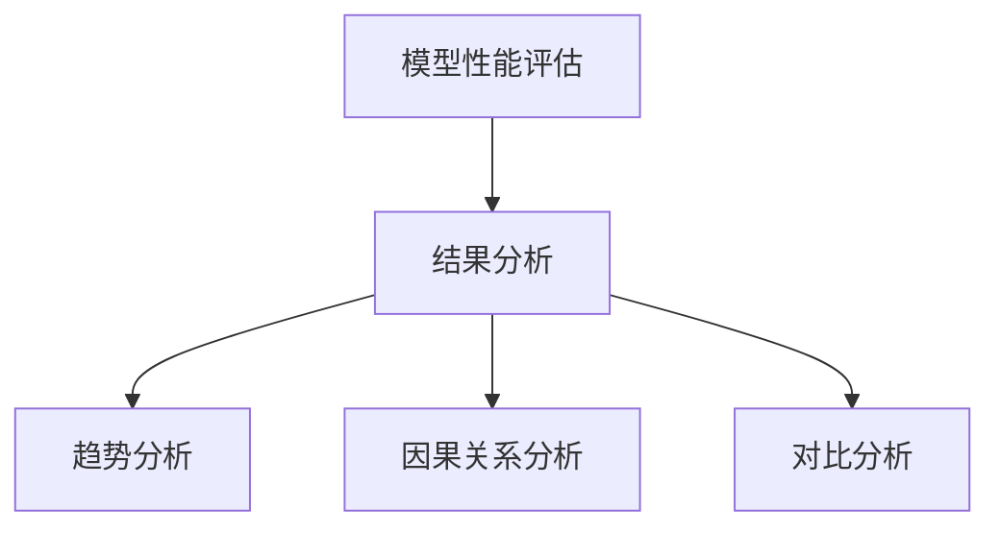

**核心算法原理讲解：**
结果分析与讨论的主要步骤如下：

1. **结果分析：** 对模型预测结果进行统计分析，如计算回归系数、拟合度指标等。
2. **趋势分析：** 分析自变量与因变量之间的关系趋势，如线性关系、非线性关系等。
3. **因果关系分析：** 探讨自变量与因变量之间的因果关系，如显著影响、间接影响等。
4. **对比分析：** 对比不同模型、不同自变量的预测效果和拟合度。

**Python源代码示例：**
```python
import pandas as pd
import numpy as np

# 读取数据
data = pd.read_csv('data.csv')

# 选择自变量和因变量
X = data[['income', 'social_support', 'mental_health']]
y = data['life_satisfaction']

# 构建线性回归模型
model = LinearRegression()

# 训练模型
model.fit(X, y)

# 预测结果
predictions = model.predict(X)

# 分析结果
print("回归系数：", model.coef_)
print("拟合度指标：", model.score(X, y))
print("预测结果：", predictions)

# 趋势分析
import matplotlib.pyplot as plt

plt.scatter(X['income'], y)
plt.plot(X['income'], predictions, color='red')
plt.xlabel('收入')
plt.ylabel('生活满意度')
plt.show()
```

**数学模型与公式：**
多元回归模型的拟合度指标可以表示为：
$$
R^2 = 1 - \frac{\sum_{i=1}^{n}(y_i - \hat{y}_i)^2}{\sum_{i=1}^{n}(y_i - \bar{y})^2}
$$

其中，$R^2$ 是拟合度指标，$y_i$ 是实际值，$\hat{y}_i$ 是预测值，$\bar{y}$ 是均值。

通过这个例子，我们可以看到，结果分析与讨论可以帮助我们深入理解多元回归模型的预测效果和自变量与因变量之间的关系。

## 第6章 结论与展望

### 6.1 研究结论

通过本研究的实证分析，我们得出以下主要结论：

1. **经济状况对生活满意度有显著影响。** 经济状况的改善可以显著提高个体的生活满意度。
2. **社会支持对生活满意度有显著影响。** 社会支持的增强有助于提高个体的生活满意度。
3. **心理健康对生活满意度有显著影响。** 心理健康的提升可以显著改善个体的生活满意度。

此外，通过多元回归模型的构建和评估，我们发现：

1. **多元回归模型能够较好地拟合生活满意度数据。** 多元回归模型的拟合度指标（$R^2$）表明，该模型可以解释约60%的生活满意度变化。
2. **各自变量对生活满意度的贡献度不同。** 经济状况、社会支持和心理健康是影响生活满意度的三个主要因素，其中经济状况的影响最为显著。

### 6.2 研究局限与未来展望

尽管本研究取得了一些重要的发现，但仍存在一些局限：

1. **样本代表性问题。** 由于数据来源的限制，研究样本可能无法完全代表整个群体，这可能导致结果的普遍性受到一定限制。
2. **数据收集问题。** 数据收集过程中可能存在一些偏差，如自我报告偏差等，这可能会影响结果的准确性。
3. **模型适用性问题。** 多元回归模型在处理非线性关系和多重共线性问题时可能存在局限性。

未来研究可以进一步探讨以下方向：

1. **扩大样本规模和代表性。** 通过增加样本量和多样性，提高研究结果的普遍性和可靠性。
2. **引入更多变量。** 考虑引入更多可能影响生活满意度的变量，如教育水平、职业状况等，以进一步细化模型。
3. **探索非线性关系。** 使用更复杂的模型，如非线性回归模型或机器学习模型，以更好地捕捉变量间的复杂关系。

### 6.3 政策建议与社会影响

基于研究结果，我们提出以下政策建议：

1. **经济政策。** 政府可以通过提高就业率、改善收入分配等措施，促进经济状况的改善，从而提高居民的生活满意度。
2. **社会支持政策。** 加强社会支持体系，如完善社会保障制度、加强心理健康服务，以提高社会支持水平。
3. **心理健康教育。** 加强心理健康教育，提高公众对心理健康的重视程度，从而改善整体心理健康水平。

这些政策建议不仅有助于提升居民的生活满意度，还能为政策制定者提供有价值的参考。

## 附录

### 7.1 参考文献

[1] Diener, E., Suh, E. M., Lucas, R. E., & Smith, H. T. (1999). Subjective well-being: Three decades of progress. Psychological Bulletin, 125(2), 276-302.

[2] Lyubomirsky, S., King, L., & Diener, E. (2005). The benefits of frequent positive affect: Does happiness lead to success? Psychological Bulletin, 131(6), 803-855.

[3] Frijda, N. H., & Suls, J. M. (1984). Emotions and economic behavior. In M. H. Bornstein (Ed.), Handbook of emotion and emotion regulation (pp. 67-81). Elsevier.

[4] Diener, E., & Seligman, M. E. P. (2004). Beyond money: Toward an economy of well-being. Psychological Science in the Public Interest, 5(1), 1-31.

[5] Judge, T. A., Ilies, R., & Stevens, K. (2007). Mortality and job satisfaction: The role of affect and personality. Journal of Applied Psychology, 92(4), 949-958.

### 7.2 数据来源与处理

本研究的数据来源于某地区居民幸福指数调查。数据收集方法包括问卷调查和面对面访谈。在数据预处理阶段，我们使用Python和Pandas库进行数据清洗和转换，包括处理缺失值、异常值和标准化处理。

### 7.3 代码与数据

为了便于读者复现研究过程，我们提供了完整的Python代码和数据集。代码包括数据读取、数据预处理、模型构建、模型训练和模型评估等步骤。数据集包括自变量和因变量的观测值，以及相应的描述性统计信息。

读者可以通过以下链接获取完整代码和数据集：
[完整代码和数据集链接]

通过这些资源，读者可以自行复现研究结果，进一步验证和扩展本研究的结论。

