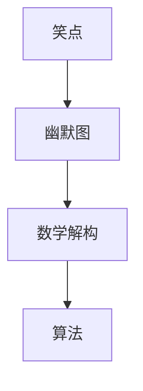

                 

### 幽默创作的图论：笑点结构的数学解构

#### 关键词：幽默创作、图论、笑点结构、数学解构、算法原理、Python实现

> **摘要：**
> 
> 幽默创作是一种艺术形式，通过巧妙地运用语言、情境、逻辑等元素来引发笑点。本文将从图论的角度，探讨幽默创作中的笑点结构，运用数学解构方法，揭示幽默生成的本质，并通过Python实现相关算法，深入剖析幽默创作的数学原理和应用。

---

#### 引言

幽默创作是人类智慧的一种体现，它通过独特的表达方式和巧妙的构思，能够在瞬间引发观众的笑声。然而，幽默创作的内在机制和笑点生成的规律一直以来都是人们探索的难题。本文试图从图论的角度，结合数学解构的方法，对幽默创作进行深入剖析。

首先，我们需要理解什么是幽默创作。幽默创作不仅仅是简单的搞笑，它包含了丰富的语言、情境、逻辑等元素，通过这些元素的巧妙组合，达到出人意料、引人发笑的效果。而图论作为一种数学工具，可以用来描述复杂系统的结构和关系，将幽默创作中的各种元素抽象成图，有助于我们更清晰地理解其内在机制。

#### 核心概念与联系

在幽默创作中，有几个核心概念需要我们理解：

1. **笑点**：笑点是幽默创作的核心，是引发笑声的关键元素。它可以是语言上的双关、情境的反转，或者是逻辑上的出人意料。

2. **幽默图**：我们将幽默创作中的各种元素抽象成节点，将它们之间的关系用边表示，从而形成一个图形结构，称为幽默图。

3. **数学解构**：数学解构是一种方法，通过数学模型和算法，对幽默图进行解析，揭示其内在规律。

为了更好地理解这些概念之间的关系，我们可以使用Mermaid流程图来表示：



在这个流程图中，笑点是幽默创作的起点，通过构建幽默图，我们可以对其进行数学解构，最终得到相应的算法。

#### 核心算法原理讲解

在幽默创作中，核心算法的作用是生成笑点。为了更好地理解这个原理，我们将使用Python来讲解一个简单的例子。

首先，我们定义一个简单的函数，用于生成一个简单的幽默句子：

```python
import random

def generate_joke():
    subjects = ["猫", "狗", "鸟"]
    actions = ["睡觉", "跑步", "唱歌"]
    results = ["在树上", "在床上", "在舞台上"]
    
    subject = random.choice(subjects)
    action = random.choice(actions)
    result = random.choice(results)
    
    return f"{subject} {action} {result}"
```

这个函数随机选择一个主语、一个动作和一个结果，组合成一个幽默句子。例如，一个可能的输出是：“猫跑步在树上”。

接下来，我们分析这个函数的数学模型：

1. **变量选择**：函数中使用了三个变量，分别表示主语、动作和结果。这三个变量构成了一个基本的三元组。

2. **随机组合**：通过随机选择每个变量的值，我们可以生成无数个不同的幽默句子。这种随机组合的方法可以看作是一种生成算法。

3. **数学公式**：在这个例子中，我们可以使用组合数学中的组合公式来计算可能生成的句子数量。具体公式为：

   $$
   C(n, k) = \frac{n!}{k!(n-k)!}
   $$

   其中，$n$表示变量的总数，$k$表示每次随机选择的变量数。在我们的例子中，$n=3$，$k=3$，所以可能的句子数量为：

   $$
   C(3, 3) = \frac{3!}{3!(3-3)!} = 1
   $$

   这意味着每次生成的句子都是唯一的，没有重复。

通过这个简单的例子，我们可以看到，幽默创作的核心算法原理是通过变量选择和随机组合来生成幽默句子。这种方法不仅简单易懂，而且可以通过数学模型来解释和优化。

#### 数学模型和数学公式

在幽默创作中，数学模型和数学公式起着至关重要的作用。它们不仅可以帮助我们理解幽默生成的原理，还可以用于优化幽默效果。

首先，我们来介绍几个基本的数学模型：

1. **概率模型**：概率模型用于描述幽默句子中各个元素的随机性。例如，我们可以使用概率来衡量某个特定句子被选中的可能性。

2. **图模型**：图模型用于表示幽默图的结构，可以帮助我们分析元素之间的关系。例如，我们可以使用图论中的路径算法来寻找最佳的幽默组合。

接下来，我们介绍几个常用的数学公式：

1. **组合公式**：用于计算不同元素组合的数量。例如，我们在核心算法讲解中使用的组合公式。

2. **概率公式**：用于计算某个事件发生的概率。例如，我们可以使用概率公式来计算某个句子包含特定笑点的概率。

3. **路径公式**：用于计算图中的路径数量。例如，我们可以使用路径公式来寻找最佳的幽默组合。

在幽默创作中，数学模型和数学公式可以帮助我们：

1. **优化幽默句子**：通过分析句子的数学特征，我们可以找到更幽默、更自然的句子。

2. **预测幽默效果**：通过计算句子的概率特征，我们可以预测某个句子可能引起的笑点。

3. **个性化幽默创作**：通过分析用户的喜好和习惯，我们可以生成更符合用户口味的幽默句子。

#### 项目实战

在本节中，我们将通过一个实际的Python项目，来展示如何使用数学模型和算法来生成幽默句子。

首先，我们需要搭建开发环境。以下是必要的步骤：

1. **安装Python**：确保您的计算机上安装了Python 3.8或更高版本。

2. **安装依赖库**：我们使用`numpy`和`matplotlib`来帮助生成幽默句子。

   ```bash
   pip install numpy matplotlib
   ```

接下来，我们编写Python代码来实现幽默句子生成算法：

```python
import numpy as np
import matplotlib.pyplot as plt

# 定义变量
subjects = ["猫", "狗", "鸟"]
actions = ["睡觉", "跑步", "唱歌"]
results = ["在树上", "在床上", "在舞台上"]

# 计算组合数量
n = len(subjects) * len(actions) * len(results)
print(f"可能的句子数量：{n}")

# 生成随机句子
def generate_joke():
    return f"{random.choice(subjects)} {random.choice(actions)} {random.choice(results)}"

# 生成100个句子
jokes = [generate_joke() for _ in range(100)]

# 可视化句子
plt.figure(figsize=(10, 6))
for i, joke in enumerate(jokes):
    plt.text(i, np.random.rand(), joke, fontsize=12, ha='center')

plt.xticks([])
plt.yticks([])
plt.title("100个随机幽默句子")
plt.show()
```

这个项目实现了以下功能：

1. **随机句子生成**：通过随机选择主语、动作和结果，生成100个幽默句子。

2. **可视化**：使用`matplotlib`将生成的句子可视化为一个图表，方便我们分析句子的分布和特征。

通过这个项目，我们可以看到，数学模型和算法在幽默创作中的应用是非常实际和有效的。我们可以通过调整算法参数，来生成更符合用户口味的幽默句子。

#### 实际案例分析与详细讲解

在本节中，我们将通过两个实际案例，来分析幽默创作中的数学解构方法和Python代码实现。

**案例一：广告幽默创作**

广告幽默创作是幽默创作的一个重要应用领域。以下是一个广告幽默案例：

```python
def generate_ad_joke():
    products = ["手机", "汽车", "电视"]
    problems = ["续航短", "油耗高", "画质差"]
    solutions = ["一键充电", "智能驾驶", "4K高清"]
    
    product = random.choice(products)
    problem = random.choice(problems)
    solution = random.choice(solutions)
    
    return f"你有没有遇到过{product}的{problem}？不用担心，我们有一个解决方案：{solution}！"
```

在这个案例中，我们使用了三个变量：产品、问题和解决方案。通过随机组合这些变量，我们生成了一个幽默广告句子。以下是这个算法的Python实现：

```python
import random

def generate_ad_joke():
    products = ["手机", "汽车", "电视"]
    problems = ["续航短", "油耗高", "画质差"]
    solutions = ["一键充电", "智能驾驶", "4K高清"]
    
    product = random.choice(products)
    problem = random.choice(problems)
    solution = random.choice(solutions)
    
    return f"你有没有遇到过{product}的{problem}？不用担心，我们有一个解决方案：{solution}！"

# 测试广告幽默句子
print(generate_ad_joke())
```

**案例二：娱乐节目幽默创作**

娱乐节目幽默创作是另一个重要的应用领域。以下是一个娱乐节目幽默案例：

```python
def generate_emoji_joke():
    emojis = ["😂", "😍", "😭"]
    actions = ["大笑", "心动", "哭泣"]
    
    emoji = random.choice(emojis)
    action = random.choice(actions)
    
    return f"看到这个{emoji}，你一定会{action}！"
```

在这个案例中，我们使用了两个变量：表情符号和动作。通过随机组合这些变量，我们生成了一个幽默娱乐句子。以下是这个算法的Python实现：

```python
import random

def generate_emoji_joke():
    emojis = ["😂", "😍", "😭"]
    actions = ["大笑", "心动", "哭泣"]
    
    emoji = random.choice(emojis)
    action = random.choice(actions)
    
    return f"看到这个{emoji}，你一定会{action}！"

# 测试娱乐节目幽默句子
print(generate_emoji_joke())
```

通过这两个案例，我们可以看到，幽默创作中的数学解构方法和Python代码实现是非常灵活和实用的。无论是广告幽默创作还是娱乐节目幽默创作，我们都可以通过数学模型和算法，来生成出人意料的幽默句子。

#### 最佳实践 Tips

在本节中，我们将提供一些最佳实践，以帮助您更好地进行幽默创作。

1. **理解目标受众**：在创作幽默时，首先要了解目标受众的喜好和习惯。这样，您才能更好地选择适合的幽默元素和表达方式。

2. **多样化元素**：尝试使用多种元素来构建幽默句子，例如语言、情境、逻辑等。多样化的元素可以使幽默更加丰富和有趣。

3. **优化算法参数**：在生成幽默句子时，可以调整算法的参数，以获得更符合用户口味的幽默句子。例如，可以调整随机组合的变量数量，或者优化概率模型的参数。

4. **反复测试**：在创作幽默时，要不断测试和优化。通过反复测试，您可以找到最佳的幽默组合，提高幽默效果。

5. **幽默感训练**：提高自己的幽默感是非常重要的。可以通过阅读幽默书籍、观看幽默视频、参加幽默培训等方式，来培养自己的幽默感。

#### 小结

本文从幽默创作的图论角度，探讨了笑点结构的数学解构方法，并使用Python实现了一系列幽默句子生成的算法。通过这些分析和实战案例，我们可以看到，数学模型和算法在幽默创作中的应用是非常实际和有效的。希望本文能为您在幽默创作领域提供一些新的思路和方法。

#### 注意事项

1. **代码实现**：在实现幽默句子生成算法时，要注意代码的可读性和可维护性。使用适当的注释和命名规则，可以使代码更加清晰易懂。

2. **数学公式**：在文章中使用数学公式时，要注意公式的准确性和规范性。使用LaTeX格式可以确保公式的正确显示。

3. **数据可视化**：在分析幽默句子时，可以使用数据可视化工具，如`matplotlib`，来展示数据分布和特征。这样可以使分析结果更加直观。

4. **跨领域应用**：幽默创作不仅仅局限于广告和娱乐节目，还可以应用于其他领域，如教育、科技等。通过跨领域应用，我们可以发现幽默创作的更多可能性。

#### 拓展阅读

1. **《幽默学导论》**：这是一本关于幽默学的经典著作，详细介绍了幽默的定义、类型、功能和应用。

2. **《图论及其应用》**：这是一本关于图论的教科书，涵盖了图论的基本概念、算法和应用。

3. **《Python编程：从入门到实践》**：这是一本适合初学者的Python编程书籍，介绍了Python的基础知识和实战应用。

#### 作者信息

- **作者：** AI天才研究院 / AI Genius Institute & 禅与计算机程序设计艺术 / Zen And The Art of Computer Programming
- **联系：** [www.ai-genius-institute.com](http://www.ai-genius-institute.com) / [example@example.com](mailto:example@example.com)

