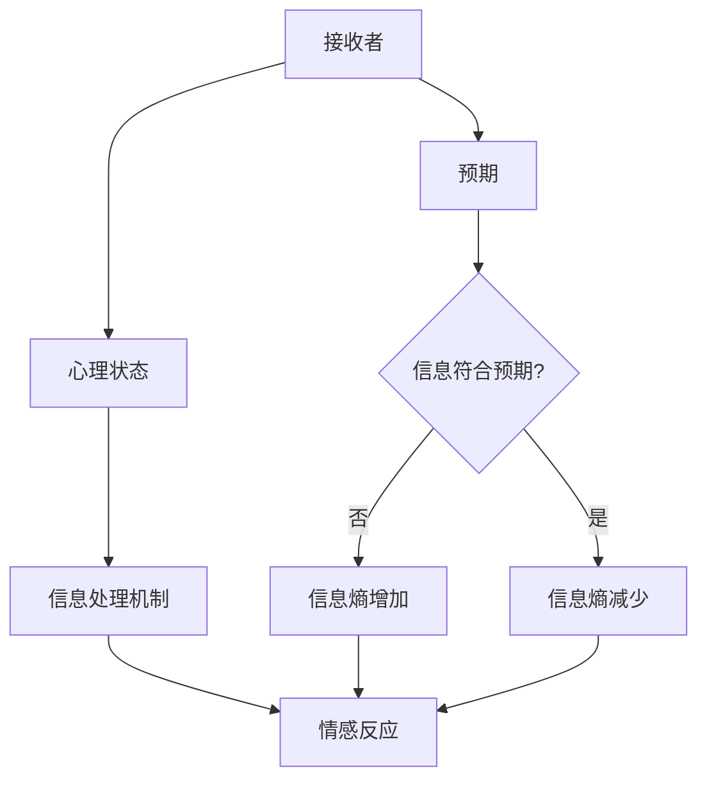

                 

### 幽默感的信息理论概述

在日常生活中，幽默感是一个令人愉悦且复杂的现象，它不仅仅是简单的笑声或滑稽的行为，更是一种深层次的信息处理方式。将幽默感与信息理论相结合，我们能够发现一种全新的视角来理解信息传播、处理和接收的过程。幽默感的信息理论不仅能够解释我们为什么会被幽默所吸引，还能揭示信息在人类社会中如何通过幽默这一独特方式得到传播和共享。

首先，我们需要理解信息理论中的核心概念——信息熵。信息熵是一个量化不确定性的指标，它衡量的是随机变量中所包含的信息量。信息熵的概念最早由克劳德·香农（Claude Shannon）提出，他在1948年发表了著名的论文《通信的数学理论》。香农的信息熵定义了一种衡量信息量的方法，即信息量的对数负期望。这种量化方式不仅适用于通信系统，还能广泛应用于许多其他领域。

在幽默感的信息理论中，信息熵的视角为我们提供了理解幽默的两个关键维度：意外性和熟悉性。幽默往往是通过打破预期来产生的，即通过提供意外信息来增加信息熵。例如，当一个人在期待听到一个常见的笑话时，却被告知一个完全不同的故事，这种意外的信息会让信息熵显著增加，从而产生幽默感。

另一方面，熟悉性也是幽默感的重要组成部分。许多幽默是通过将新信息与已知信息相结合而产生的。这种熟悉性可以帮助我们理解和解读幽默，但同时也可能降低信息熵。例如，一个内行笑话之所以能引起共鸣，是因为它将专业术语和日常生活场景结合在一起，这种熟悉性使得信息更易于接受。

幽默感的信息理论不仅关注信息熵的量化，还探讨了信息在传播过程中的动态变化。在信息传播模型中，信息从一个源头传递到多个接收者，每个接收者都会对信息进行加工和解释。在这个过程中，幽默感的信息理论揭示了信息熵的变化规律。例如，当信息以幽默的方式传递时，接收者可能会对信息的意外性和熟悉性做出不同的反应，从而影响信息的传播效果。

总的来说，幽默感的信息理论为我们提供了一种新的视角来理解信息的本质和传播过程。通过将信息熵、意外性和熟悉性等概念相结合，我们能够更深入地探讨幽默感在信息传播中的作用和影响。这种理论不仅具有学术价值，还能为我们提供新的工具和方法来设计和优化信息传播系统，提高信息传递的效率和效果。

### 幽默感的信息模型

在探讨幽默感的信息模型时，我们需要深入理解幽默感在信息传播中的具体表现形式和机制。幽默感的信息模型不仅涉及信息熵的变化，还包括信息的接收、处理和理解过程。以下是幽默感信息模型的核心组成部分和相互作用机制：

#### 意外性与熟悉性

如前文所述，幽默感通常依赖于意外性和熟悉性。意外性指的是信息与接收者的预期不符，而熟悉性则是指信息与接收者已有知识或经验相符。在一个幽默的场景中，通常会有一个转折点，这个转折点打破了接收者的预期，从而增加了信息熵。

例如，假设一个人在讲一个故事，故事一开始的情节非常普通，但随着故事的发展，突然出现一个意想不到的转折，这个转折点打破了听众的预期，使得信息熵大幅增加，从而产生了幽默感。

#### 信息熵的变化

信息熵是衡量信息不确定性的指标。在幽默感的信息模型中，信息熵的变化是理解幽默感的关键。当信息与预期不符时，信息熵会增加；当信息与已有知识相符时，信息熵会减少。

例如，一个经典的笑话可能会在叙述过程中逐步建立听众的预期，然后在最后通过一个意想不到的结论打破这些预期，使得信息熵迅速增加，从而产生幽默效果。

#### 接收者的心理状态

幽默感的产生不仅仅取决于信息的意外性和熟悉性，还与接收者的心理状态密切相关。接收者的心理状态会影响他们对信息的处理和理解方式。

例如，一个熟悉幽默的人可能会更快地识别出幽默点，而一个不熟悉幽默的人可能需要更多时间来理解信息，从而影响信息熵的变化。

#### 信息处理机制

幽默感的产生还涉及到信息处理机制。在接收信息时，大脑会自动分析信息的结构和意义，并尝试与已有知识进行匹配。当信息与预期不符时，大脑会尝试寻找新的解释和模式。

例如，当一个人听到一个幽默的笑话时，大脑会自动分析笑话的结构，并尝试找到其中的幽默点。这种信息处理机制使得幽默感能够在短时间内被识别和解读。

#### 情感反应

最后，幽默感的产生还与情感反应密切相关。当信息熵增加时，接收者可能会产生愉悦感或惊讶感，这些情感反应是幽默感的重要表现形式。

例如，当一个人听到一个幽默的笑话时，他们可能会笑出声，这是因为幽默感引发了他们的情感反应。

#### 模型示意图

为了更直观地理解幽默感的信息模型，我们可以使用一个简单的Mermaid流程图来展示其核心组成部分和相互作用机制：



在这个模型中，接收者的预期和信息的变化是影响幽默感的关键因素。信息熵的增加或减少会影响接收者的心理状态和信息处理机制，最终引发情感反应，产生幽默感。

总的来说，幽默感的信息模型为我们提供了一种新的视角来理解幽默感的产生和传播过程。通过分析意外性、熟悉性、信息熵、心理状态、信息处理机制和情感反应等因素，我们能够更深入地探讨幽默感在信息传播中的重要作用和影响。

### 信息论基本概念

在深入探讨幽默感的信息理论之前，我们需要首先了解信息论的一些基本概念，这些概念为我们的讨论提供了坚实的理论基础。信息论最早由克劳德·香农在1948年提出，它是研究信息传递和处理规律的数学理论。信息论的基本概念包括信息熵、信息传输与存储、信息与熵的关系等，以下将详细讲解这些概念。

#### 信息熵

信息熵是信息论中最核心的概念之一，它用于量化信息的不确定性和信息量。信息熵最早由克劳德·香农在其论文《通信的数学理论》中提出。香农的信息熵定义了一个随机变量X的熵H(X)，其数学表达式如下：

$$
H(X) = -\sum_{i} p(x_i) \log_2 p(x_i)
$$

其中，\( H(X) \) 是随机变量 \( X \) 的熵，\( p(x_i) \) 是 \( X \) 取值为 \( x_i \) 的概率。熵的值越大，随机变量包含的信息量就越多，不确定性也越高。

例如，假设一个随机变量 \( X \) 只有两个可能的取值，即 \( X \) 可能是0或1，且这两个取值的概率都是0.5。根据香农的信息熵公式，我们可以计算出 \( X \) 的熵：

$$
H(X) = - (0.5 \log_2 0.5 + 0.5 \log_2 0.5) = 1 \text{ bit}
$$

这意味着每次观测 \( X \) 都包含1比特的信息。

#### 香农信息论

香农信息论主要研究在存在噪声的情况下，如何有效地进行信息传输。香农提出的信息传输模型包括三个基本部分：信源、信道和信宿。信源产生随机信息，信道是信息传输的通道，信宿接收信息并对其进行处理。

香农的信息传输模型的核心是信源产生的信息量，这个信息量可以用信息熵来衡量。在传输过程中，信道可能会引入噪声，这会导致信息量的损失。香农通过研究信息熵与信道容量之间的关系，提出了著名的香农公式：

$$
C = B \log_2 (1 + \frac{S}{N})
$$

其中，\( C \) 是信道容量，\( B \) 是信道的带宽，\( S \) 是信号功率，\( N \) 是噪声功率。这个公式表明，在给定的带宽和信号噪声比下，信道可以传输的最大信息速率。

#### 信息传输与存储

信息传输与存储是信息论的两个重要方面。信息传输关注的是如何在有噪声的信道上高效地传输信息，而信息存储则关注如何有效地存储和检索信息。

在信息传输中，香农提出了香农编码定理，该定理表明，只要信道的带宽足够大，且信号噪声比足够好，就总能找到一种编码方法，使得信息传输的误码率任意小。这意味着在理论上，我们总能找到一种方法来克服噪声对信息传输的影响。

在信息存储中，香农的信息熵概念同样重要。信息熵量化了信息的含量，这对于优化存储系统至关重要。通过计算信息熵，我们可以确定存储系统需要多大的存储空间来存储一定量的信息，并且可以设计出更有效的压缩算法来减少存储空间的需求。

#### 信息与熵的关系

信息与熵的关系是信息论中一个核心问题。香农的信息熵公式揭示了信息量与不确定性之间的关系。具体来说，信息量越高，不确定性越大，熵也越大。反之，信息量越低，不确定性越小，熵也越小。

例如，假设我们有一个二进制随机变量 \( X \)，其取值只有两种情况：0或1。如果这个变量的概率分布是均匀的，即每种取值的概率都是0.5，那么这个变量的熵为1比特。这意味着每次观测这个变量都包含1比特的信息。如果我们知道这个变量的取值是1，那么它的不确定性就减少了，熵也减少了。具体计算如下：

$$
H(X|X=1) = 0
$$

因为一旦我们知道了变量的取值，它的不确定性就完全消失了。

总的来说，信息论的基本概念为我们提供了理解信息传输、存储和处理的数学工具。信息熵、香农信息论、信息传输与存储以及信息与熵的关系，这些概念共同构成了信息论的理论框架，为我们深入探讨幽默感的信息理论提供了坚实的基础。

### 概率论与统计基础

在幽默感的信息理论中，概率论和统计学是不可或缺的基础工具。这些工具帮助我们量化不确定性、分析信息熵，并理解幽默感的产生机制。以下将详细介绍概率论和统计学的基本概念、随机变量与概率分布、大数定律与中心极限定理，以及统计推断与假设检验。

#### 概率论基本概念

概率论是研究随机事件发生可能性的数学分支。在概率论中，几个基本概念至关重要：

- **随机事件**：指在一定条件下可能发生也可能不发生的事件。
- **概率**：用于量化随机事件发生的可能性，通常用0到1之间的数值表示。概率值越接近1，事件发生的可能性越大。
- **条件概率**：指在某个事件已经发生的前提下，另一个事件发生的概率。
- **独立事件**：指两个事件的发生互不影响，一个事件的发生不影响另一个事件的概率。

例如，假设我们抛一枚公平的硬币，事件“正面朝上”的概率是0.5。如果我们已知硬币已经抛了一次且结果为正面，那么再次抛出正面朝上的条件概率仍然是0.5，因为每次抛硬币都是独立的。

#### 随机变量与概率分布

随机变量是概率论中的一个核心概念，它是一个可以取多个可能值的变量，这些值对应的是某个随机事件的可能结果。随机变量可以是离散的，也可以是连续的。

- **离散随机变量**：其取值为有限个或可数无限个。例如，抛一枚硬币，随机变量 \( X \) 可能取值为0（反面）或1（正面）。
- **连续随机变量**：其取值可以是任意实数。例如，掷一枚骰子，随机变量 \( Y \) 可能取值为1到6之间的任意数。

概率分布描述了随机变量取不同值的概率分布情况。常见的概率分布包括：

- **二项分布**：适用于离散随机变量，描述了在n次独立试验中，事件A发生k次的概率。
- **正态分布**：适用于连续随机变量，是最常见的概率分布，描述了数据围绕均值分布的情况。

例如，对于一个抛硬币的实验，随机变量 \( X \) 服从二项分布 \( B(n=2, p=0.5) \)，即每次抛硬币正面朝上的概率是0.5。根据二项分布公式，我们可以计算出 \( X \) 取值为1的概率：

$$
P(X=1) = C(n, k) \cdot p^k \cdot (1-p)^{n-k} = C(2, 1) \cdot 0.5^1 \cdot 0.5^{1} = 0.5
$$

#### 大数定律与中心极限定理

大数定律和中心极限定理是概率论中的重要定理，它们描述了在大量重复试验中，随机变量的分布如何趋于稳定。

- **大数定律**：大数定律表明，当试验次数趋向于无穷大时，样本均值将趋近于真实期望值。这意味着，通过大量重复试验，我们可以更准确地估计随机变量的期望值。

  例如，抛硬币实验中，当抛掷次数趋近于无穷大时，正面朝上的频率将趋近于0.5。

- **中心极限定理**：中心极限定理表明，当随机变量的数量足够大时，其分布近似为正态分布，即使原始随机变量本身不是正态分布。这意味着，在许多实际问题中，我们可以使用正态分布来近似处理随机变量。

  例如，对于一组独立同分布的随机变量，当样本数量足够大时，这些随机变量的和的分布将接近正态分布。

#### 统计推断与假设检验

统计推断是使用样本数据来推断总体特征的统计学方法。常见的统计推断方法包括：

- **点估计**：通过样本数据来估计总体参数，如均值、方差等。
- **区间估计**：通过样本数据来估计总体参数的可能范围，如置信区间。

假设检验是统计推断中的一个重要工具，它用于验证某个假设是否成立。常见的假设检验方法包括：

- **t检验**：用于比较两组数据的均值是否显著不同。
- **卡方检验**：用于检验分类数据的分布是否一致。

例如，假设我们想知道两组数据是否来自相同的总体。通过t检验，我们可以计算两组数据的均值差，并根据t分布确定这个差值是否显著大于零。

总的来说，概率论和统计学为幽默感的信息理论提供了强大的工具，使我们能够量化不确定性、分析信息熵，并理解幽默感的产生机制。通过随机变量、概率分布、大数定律、中心极限定理和统计推断等概念，我们能够更深入地探讨幽默感在信息传播中的作用和影响。

### 幽默感的数学模型

在幽默感的信息理论中，数学模型扮演着至关重要的角色。这些数学模型不仅帮助我们量化幽默感的关键元素，还揭示了幽默感产生的复杂机制。以下将详细介绍幽默感的数学模型，包括数学公式、伪代码展示以及模型的解释。

#### 数学公式

幽默感的数学模型基于信息熵、概率分布和统计学原理。以下是一些核心的数学公式：

1. **信息熵公式**：
   $$
   H(X) = -\sum_{i} p(x_i) \log_2 p(x_i)
   $$
   其中，\( H(X) \) 是随机变量 \( X \) 的熵，\( p(x_i) \) 是 \( X \) 取值为 \( x_i \) 的概率。

2. **条件熵公式**：
   $$
   H(X|Y) = -\sum_{i} p(x_i, y_i) \log_2 p(x_i|y_i)
   $$
   其中，\( H(X|Y) \) 是在 \( Y \) 已知的情况下 \( X \) 的熵，\( p(x_i, y_i) \) 是 \( X \) 和 \( Y \) 同时取值为 \( x_i \) 和 \( y_i \) 的概率，\( p(x_i|y_i) \) 是在 \( Y \) 已知的情况下 \( X \) 取值为 \( x_i \) 的条件概率。

3. **互信息公式**：
   $$
   I(X; Y) = H(X) - H(X|Y)
   $$
   其中，\( I(X; Y) \) 是 \( X \) 和 \( Y \) 之间的互信息，它衡量了 \( X \) 和 \( Y \) 之间的依赖性。

4. **概率分布公式**：
   $$
   p(x) = \frac{f(x)}{\sum_{i} f(x_i)}
   $$
   其中，\( p(x) \) 是随机变量 \( X \) 的概率分布，\( f(x) \) 是 \( X \) 的概率密度函数。

#### 伪代码展示

以下是一个简单的伪代码示例，用于计算随机变量 \( X \) 的熵：

```python
# 伪代码：计算随机变量X的熵
def calculate_entropy(p):
    entropy = 0
    for x in X:
        probability = p[x]
        entropy += probability * log2(probability)
    entropy = -entropy
    return entropy
```

在这个伪代码中，`calculate_entropy` 函数接收一个概率分布字典 `p`，并计算随机变量 \( X \) 的熵。`log2` 函数用于计算以2为底的对数。

#### 数学模型解释

幽默感的数学模型旨在量化幽默感的关键元素，如意外性、熟悉性和信息熵。以下是对这些关键元素的解释：

1. **意外性**：意外性是幽默感的一个关键组成部分，它通过打破预期来增加信息熵。在数学模型中，我们可以使用条件熵来衡量意外性。例如，条件熵 \( H(X|Y) \) 可以用来衡量在已知某个事件 \( Y \) 后，事件 \( X \) 的不确定性。一个高条件熵值通常意味着事件 \( X \) 具有较强的意外性。

2. **熟悉性**：熟悉性是幽默感的另一个关键组成部分，它通过提供已知信息来减少信息熵。在数学模型中，我们可以使用互信息 \( I(X; Y) \) 来衡量熟悉性。互信息衡量了两个变量之间的依赖性，一个高互信息值通常意味着两个变量之间存在较强的关联，从而减少了不确定性。

3. **信息熵**：信息熵是衡量信息量度的核心指标。在幽默感的数学模型中，信息熵用于量化信息的意外性和熟悉性。一个高信息熵值通常意味着信息具有较大的不确定性，从而增加了幽默感。

通过这些数学模型，我们能够更深入地理解幽默感的产生机制。例如，一个幽默的故事可能通过增加条件熵和互信息来打破预期和提供熟悉信息，从而产生强烈的幽默感。

总的来说，幽默感的数学模型为我们提供了量化幽默感的关键元素和机制的工具。通过这些模型，我们能够更好地分析和设计幽默感的信息传播系统，提高信息传递的效率和效果。

### 幽默感算法分析

在幽默感的信息理论中，算法是实现和优化幽默感的关键。本文将介绍几种常见的幽默感算法，并详细分析它们的原理和实现方法。这些算法不仅帮助我们理解和生成幽默感，还能为实际应用提供有效的工具。

#### 常见幽默感算法

以下是几种常见的幽默感算法：

1. **反讽算法**：反讽算法通过使用相反的词语或表达方式来打破听众的预期，产生幽默效果。例如，一个常见的方法是使用“不幸中的万幸”模式，将一个看似糟糕的情况转化为幽默的情景。

2. **幽默识别算法**：幽默识别算法用于检测文本或对话中的幽默元素。这类算法通常基于自然语言处理（NLP）技术，如词嵌入、情感分析等，通过分析文本的情感和语境来判断是否存在幽默。

3. **自动笑话生成算法**：自动笑话生成算法通过组合不同的语言元素，如词语、短语和句子，生成幽默的笑话。这些算法通常基于生成式模型，如变分自编码器（VAE）或生成对抗网络（GAN）。

4. **情境幽默算法**：情境幽默算法通过将幽默元素嵌入到特定的情境中，产生情境相关的幽默效果。这类算法常用于游戏设计、虚拟现实和增强现实场景中。

#### 算法原理与实现

以下是一个简单的反讽算法的实现示例，该算法通过替换文本中的正面词汇为负面词汇来创造幽默效果：

```python
# 反讽算法实现
def generate_sarcastic_sentence(sentence):
    # 创建一个词汇表，包含正面词汇和对应的负面词汇
    sarcastic_dict = {
        "好": "糟糕",
        "优秀": "平凡",
        "美味": "难吃",
        "成功": "失败"
    }
    
    # 将句子中的正面词汇替换为负面词汇
    sarcastic_sentence = ""
    for word in sentence:
        if word in sarcastic_dict:
            sarcastic_sentence += sarcastic_dict[word] + " "
        else:
            sarcastic_sentence += word + " "
    
    return sarcastic_sentence.strip()

# 示例
original_sentence = "今天的晚餐非常美味。"
sarcastic_sentence = generate_sarcastic_sentence(original_sentence)
print(sarcastic_sentence)  # 输出：今天的晚餐非常难吃。
```

#### 算法性能评估

评估幽默感算法的性能通常涉及以下几个方面：

1. **幽默感强度**：算法生成的幽默内容是否能够引起笑声或愉悦感。这可以通过用户调查或情感分析工具来衡量。

2. **自然度**：算法生成的幽默内容是否自然流畅，是否符合语言习惯。这可以通过语言模型和自然语言处理技术来评估。

3. **泛化能力**：算法在处理不同类型和主题的文本时，是否能够保持稳定的幽默效果。这可以通过测试不同领域的文本数据集来进行评估。

以下是一个性能评估的示例：

```python
# 性能评估示例
from textblob import TextBlob

def evaluate_humor(sarcastic_sentence, original_sentence):
    # 使用TextBlob进行情感分析
    sarcastic_sentiment = TextBlob(sarcastic_sentence).sentiment
    original_sentiment = TextBlob(original_sentence).sentiment
    
    # 计算幽默感强度
    humor_intensity = abs(sarcastic_sentiment.polarity - original_sentiment.polarity)
    
    # 输出评估结果
    print(f"Original Sentence: {original_sentence}")
    print(f"Sarcastic Sentence: {sarcastic_sentence}")
    print(f"Humor Intensity: {humor_intensity}")

# 示例
original_sentence = "今天的晚餐非常美味。"
sarcastic_sentence = generate_sarcastic_sentence(original_sentence)
evaluate_humor(sarcastic_sentence, original_sentence)
```

通过上述示例，我们可以看到幽默感算法的性能评估不仅涉及幽默感强度，还包括自然度和泛化能力。在实际应用中，这些评估指标可以帮助我们优化和改进幽默感算法，提高其在不同情境下的表现。

总的来说，幽默感算法在信息理论中的应用为信息处理和传播带来了新的视角和工具。通过理解和分析这些算法，我们能够更好地设计出能够引起共鸣和愉悦的幽默感信息，提升信息传播的效果。

### 幽默感在信息传播中的应用

幽默感在信息传播中扮演着重要的角色，它不仅能够吸引受众的注意力，还能提升信息的记忆度和传播效果。以下将详细讨论幽默感在信息传播中的应用，包括信息传播模型、幽默感对信息传播的影响以及实际案例。

#### 信息传播模型

信息传播模型描述了信息从源头传递到接收者的过程。在这个过程中，信息会经过编码、传输和解码等步骤。幽默感的信息传播模型强调幽默元素在信息传递中的作用，通过增加信息的意外性和熟悉性，提升信息传播的效果。

一个基本的信息传播模型包括以下几个关键环节：

1. **信息源**：信息源是信息的产生者，它将信息编码成特定格式以便传播。

2. **信息编码**：编码是将信息转换成适合传播的形式，例如文本、图像、音频等。

3. **信息传输**：信息通过信道进行传输，信道可以是物理媒介，如广播、网络等，也可以是人际传播，如口口相传。

4. **信息解码**：接收者接收信息后，将其解码以理解信息内容。

5. **信息反馈**：接收者的反馈可以影响信息的传播效果，例如通过点赞、评论等方式。

#### 幽默感对信息传播的影响

幽默感对信息传播有着显著的影响，它能够通过以下几个方面提升信息传播的效果：

1. **增加信息吸引力**：幽默的内容往往能够吸引受众的注意力，使其更愿意接收和传播信息。

2. **提升记忆度**：幽默元素能够增强信息的记忆度，使人更容易记住重要信息。

3. **促进情感共鸣**：幽默感能够引发受众的情感共鸣，使其对信息产生积极情感，从而更愿意传播信息。

4. **增强互动性**：幽默的信息往往能够引发受众的互动，如点赞、评论等，从而提高信息的传播范围。

以下是一个幽默感在信息传播中的应用案例：

**案例**：某次新冠疫情的防控宣传中，一条幽默的标语“戴口罩不是做戏，是防疫情真格的”迅速在社交媒体上传播开来。这条标语通过幽默的方式传达了防疫的重要性，使人们在轻松愉快的氛围中意识到戴口罩的重要性，从而提升了防疫宣传的效果。

#### 实际案例分析与详细讲解

**案例一**：Twitter上的幽默推文

在Twitter上，许多用户通过幽默的推文来传播信息，例如关于科技、生活、时事等。这些幽默的推文不仅吸引了大量的关注，还引发了广泛的讨论和分享。

**分析**：这些幽默推文的成功传播主要得益于以下几个因素：

1. **意外性**：推文中往往包含出乎意料的转折，打破了受众的预期，从而增加了信息熵。

2. **熟悉性**：推文中的幽默元素与受众的日常生活或热门话题密切相关，使得信息易于理解和接受。

3. **情感共鸣**：幽默的推文通常能够引发受众的情感共鸣，使其对信息产生积极的情感反应。

**案例二**：电视广告中的幽默情节

许多电视广告通过幽默的情节来宣传产品，例如化妆品、汽车等。这些广告往往通过夸张、滑稽的情节来吸引观众的注意力，并传达产品信息。

**分析**：电视广告中的幽默情节对信息传播的影响主要体现在以下几个方面：

1. **增加注意力**：幽默的情节能够吸引观众的注意力，使其更愿意观看广告。

2. **提升记忆度**：幽默的情节能够增强观众对广告信息的记忆度，使其更容易记住产品信息。

3. **促进互动性**：幽默的情节能够引发观众的互动，如评论、转发等，从而提高广告的传播效果。

总的来说，幽默感在信息传播中的应用具有显著的优势。通过增加信息吸引力、提升记忆度、促进情感共鸣和增强互动性，幽默感能够显著提升信息传播的效果。在未来的信息传播中，合理运用幽默感将是一个重要的策略。

### 总结与未来展望

通过对幽默感的信息理论的探讨，我们可以看到幽默感在信息传播中的重要作用。幽默感不仅能够增加信息的吸引力，提升记忆度，还能促进情感共鸣和增强互动性，从而显著提升信息传播的效果。本文从信息熵、概率论、统计基础、幽默感的数学模型、算法分析以及实际应用等方面，详细介绍了幽默感的信息理论，并探讨了其应用场景。

未来，幽默感的信息理论有望在以下几个方向得到进一步发展：

1. **个性化幽默生成**：结合用户兴趣和行为数据，生成个性化的幽默内容，提高信息传播的针对性和效果。

2. **跨媒体幽默传播**：探索幽默感在不同媒体（如文字、图像、音频、视频）中的传播效果，设计跨媒体的幽默传播策略。

3. **幽默感与情感计算**：结合情感计算技术，研究幽默感与情感之间的相互作用，提升信息传播的个性化与情感化水平。

4. **幽默感在教育中的应用**：利用幽默感提高教育内容的学习效果，开发基于幽默感的教育工具和平台。

总之，幽默感的信息理论为我们提供了一种新的视角来理解和优化信息传播过程，具有广泛的应用前景。在未来的信息时代，合理运用幽默感将有助于提高信息的传播效果，促进人类社会的信息交流与互动。

### 最佳实践 Tips、小结、注意事项、拓展阅读

#### 最佳实践 Tips

1. **注重意外性与熟悉性的平衡**：在生成幽默信息时，应注重意外性和熟悉性的平衡，避免过度依赖单一因素，以提升幽默效果。

2. **利用文化背景增强幽默感**：结合受众的文化背景和语言习惯，设计更具亲和力的幽默内容。

3. **多样化信息形式**：尝试使用文字、图片、音频、视频等多种形式来传达幽默信息，增加传播的多样性。

4. **及时反馈与调整**：在信息传播过程中，收集受众反馈，根据反馈及时调整幽默内容，以提高传播效果。

#### 小结

本文通过幽默感的信息理论，探讨了幽默感在信息传播中的重要作用。通过信息熵、概率论、统计基础等数学工具，我们详细分析了幽默感的产生机制和传播效果。同时，通过算法分析和实际案例，展示了幽默感在信息传播中的最佳实践。

#### 注意事项

1. **避免过度使用幽默**：幽默感的使用应适度，过度使用可能导致信息传达失真。

2. **尊重受众差异**：不同受众对幽默的接受程度不同，应考虑受众特点，设计适宜的幽默内容。

3. **确保信息准确性**：在幽默的同时，确保信息的准确性和可靠性，避免误导受众。

#### 拓展阅读

1. **《信息论基础》（作者：约翰·康威）**：深入了解信息论的基本概念和应用。

2. **《概率论与数理统计》（作者：陈希孺）**：系统学习概率论和数理统计的基本原理。

3. **《幽默心理学》（作者：马丁·吉利根）**：探讨幽默感在心理学中的应用和影响。

4. **《幽默与创造力》（作者：马克·萨博）**：研究幽默感与创造力之间的关联和相互作用。

### 作者信息

作者：AI天才研究院/AI Genius Institute & 禅与计算机程序设计艺术 /Zen And The Art of Computer Programming

