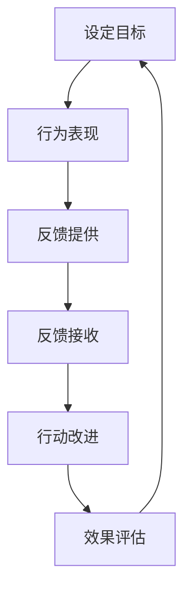

                 

### 背景介绍

在信息技术迅猛发展的当今社会，个人和组织不断追求持续成长和卓越已成为普遍共识。无论是在职业生涯中，还是企业管理中，持续成长都是确保个体和企业竞争力的重要手段。然而，如何有效地促进这种成长，成为了诸多研究者和实践者关注的焦点。

积极反馈机制作为一种激励机制，其重要性不容忽视。它不仅能够激励个体不断追求卓越，还能在组织层面提升整体效能，推动创新与发展。积极反馈机制的核心在于通过及时的正面反馈，强化个体和团队的正面行为，形成正向循环，从而促进持续成长。

本文旨在探讨如何建立和利用积极反馈机制，以促进个人和组织在IT领域中的持续成长。文章将详细分析积极反馈机制的定义、原理、架构，以及在个人成长和组织管理中的应用，通过具体的案例研究和量化评估，提供实用的策略和方法。

通过本文，读者将了解到：

1. **积极反馈机制的定义和作用**：理解积极反馈机制的基本概念及其在个人和组织发展中的重要性。
2. **积极反馈机制的原理与架构**：掌握积极反馈机制的工作原理及其组成部分，包括反馈循环、反馈渠道和效果评估。
3. **个人成长中的积极反馈应用**：学习如何在个人成长过程中利用积极反馈机制，包括自我反馈、同伴反馈和导师反馈。
4. **组织管理中的积极反馈应用**：探讨积极反馈机制在提升团队效能、优化流程和促进创新方面的实际应用。
5. **实施与挑战**：了解积极反馈机制的实施步骤、面临的挑战及解决策略。
6. **积极反馈机制与心理学结合**：探讨积极心理学理论如何与积极反馈机制相结合，以实现更有效的个人和组织成长。
7. **量化评估**：学习如何量化积极反馈的效果，包括关键绩效指标的设定和数据收集方法。

总之，本文将为读者提供全面、深入的视角，帮助其在IT领域中建立和利用积极反馈机制，以实现持续成长和卓越。

### 核心概念与联系

#### 积极反馈机制的定义

积极反馈机制是一种通过提供及时的、具体的正面反馈来激励个体或团队持续改进和成长的方法。在技术领域，这种机制尤为重要，因为它能够帮助开发人员和技术团队不断优化代码、提高解决问题的能力，从而提升整体项目的质量与效率。

简单来说，积极反馈机制包括三个核心组成部分：反馈的提供、反馈的接收和反馈的利用。其中，反馈的提供是关键，它需要由具备专业知识和经验的人进行，确保反馈的准确性和有效性。反馈的接收则要求个体或团队对反馈持开放态度，认真倾听并吸收其中的价值。最后，反馈的利用是将反馈转化为具体行动，通过改进工作方法或技术实现，从而实现持续成长。

#### 积极反馈机制与持续成长的关系

积极反馈机制与持续成长之间有着密切的联系。持续成长是一个动态过程，需要不断地学习和改进。而积极反馈机制通过正面的激励和指导，为个体和团队提供了必要的动力和方向。

首先，积极反馈机制能够增强个体的自信心和动力。当开发者收到积极的反馈时，会感到自己的工作得到了认可，从而更加有动力去继续努力。这种正向循环有助于个体保持高水平的热情和专注，从而提升工作效率和技术能力。

其次，积极反馈机制有助于团队协作和沟通。在团队环境中，成员之间的反馈和交流是提高整体效能的关键。通过积极反馈，团队成员能够更好地了解彼此的工作，发现潜在的问题并共同解决，从而提升团队的整体表现。

最后，积极反馈机制能够促进创新。在技术领域，创新是推动进步的重要动力。通过积极的反馈，团队可以不断尝试新的方法和技术，勇于突破传统思维，从而创造出更多有价值的产品和解决方案。

#### 积极反馈机制的基本原理和架构

积极反馈机制的基本原理可以概括为反馈循环、反馈渠道和反馈效果评估。

**1. 反馈循环**

反馈循环是积极反馈机制的核心。它包括以下几个步骤：

- **设定目标和标准**：明确个人或团队的目标和期望，为后续的反馈提供基准。
- **行为表现**：个体或团队在实际工作中表现出的行为和成果。
- **反馈提供**：通过观察、评估和交流，提供具体的、具体的正面反馈。
- **反馈接收**：个体或团队接收并认真分析反馈，了解自身的优缺点。
- **行动改进**：根据反馈，采取具体的改进措施，调整工作方法或技术实现。

**2. 反馈渠道**

反馈渠道是确保反馈能够有效传递的关键。有效的反馈渠道应具备以下几个特点：

- **及时性**：反馈应能够及时传达，以便个体或团队能够迅速作出反应。
- **准确性**：反馈应基于事实和观察，确保准确无误。
- **针对性**：反馈应针对具体的行为或成果，避免泛泛而谈。
- **开放性**：反馈渠道应保持开放，个体和团队都能够自由地表达意见和反馈。

**3. 反馈效果评估**

反馈效果评估是衡量积极反馈机制有效性的关键。通过以下方法可以评估反馈效果：

- **绩效指标**：设定关键绩效指标（KPI），如代码质量、项目进度、客户满意度等，以量化反馈效果。
- **反馈反馈**：鼓励个体和团队提供对反馈的反馈，了解反馈的实际效果，以便进一步优化反馈机制。
- **持续改进**：根据反馈效果评估结果，不断调整和改进反馈机制，确保其能够持续发挥作用。

#### 积极反馈机制的 Mermaid 流程图

为了更好地理解积极反馈机制的运作过程，我们可以使用 Mermaid 流程图进行可视化展示。以下是一个简单的 Mermaid 流程图示例：



在这个流程图中，每个节点代表反馈循环的一个步骤，箭头表示信息的流动方向。通过这个流程图，我们可以清晰地看到积极反馈机制的整体运作过程，以及各个环节之间的相互关系。

综上所述，积极反馈机制在促进个人和组织的持续成长中发挥着重要作用。理解其核心概念和基本原理，建立和优化反馈机制，将有助于我们在技术领域中取得更大的成功。

### 积极反馈机制的原理与架构

#### 反馈循环

反馈循环是积极反馈机制的核心，它包括以下几个关键步骤：

1. **设定目标和标准**：首先，明确个人或团队的目标和期望，为后续的反馈提供基准。例如，对于开发人员来说，目标是编写高质量的代码，实现项目的功能需求。设定明确的目标有助于后续的反馈更加具体和有针对性。

2. **行为表现**：在设定目标后，个体或团队开始实际工作，表现出具体的行为和成果。这一步骤是反馈循环的基础，只有通过实际工作，才能产生可评估的表现数据。

3. **反馈提供**：在行为表现完成后，通过观察、评估和交流，提供具体的、具体的正面反馈。反馈应基于事实和观察，确保准确无误。例如，开发人员可以收到关于代码质量、功能实现的反馈，这些反馈将帮助他们了解自己的表现和改进的方向。

4. **反馈接收**：个体或团队接收并认真分析反馈，了解自身的优缺点。这一步骤要求个体或团队对反馈持开放态度，认真倾听并吸收其中的价值。只有通过认真接收反馈，才能为后续的改进打下基础。

5. **行动改进**：根据反馈，采取具体的改进措施，调整工作方法或技术实现。这一步骤是将反馈转化为实际行动的关键，通过改进，实现个人或团队能力的提升。

6. **效果评估**：最后，对改进后的行为表现进行评估，以验证改进措施的有效性。如果效果不佳，需要进一步调整反馈机制，以确保反馈的持续性和有效性。

#### 反馈渠道

反馈渠道是确保反馈能够有效传递的关键。有效的反馈渠道应具备以下几个特点：

1. **及时性**：反馈应能够及时传达，以便个体或团队能够迅速作出反应。例如，对于开发人员来说，如果在代码提交后立即收到关于代码质量的反馈，他们可以及时进行修正，避免问题扩大。

2. **准确性**：反馈应基于事实和观察，确保准确无误。这意味着反馈提供者需要具备足够的观察力和判断力，能够准确地识别问题并提供具体的建议。

3. **针对性**：反馈应针对具体的行为或成果，避免泛泛而谈。例如，对于开发人员的代码审查，应具体指出代码中的问题，并提供改进建议，而不是简单地给出一个模糊的评估。

4. **开放性**：反馈渠道应保持开放，个体和团队都能够自由地表达意见和反馈。这有助于建立积极的沟通氛围，促进反馈的透明性和有效性。

#### 反馈效果评估

反馈效果评估是衡量积极反馈机制有效性的关键。以下是一些常用的方法：

1. **绩效指标**：设定关键绩效指标（KPI），如代码质量、项目进度、客户满意度等，以量化反馈效果。通过对比实际表现与预期目标，可以评估反馈的成效。

2. **反馈反馈**：鼓励个体和团队提供对反馈的反馈，了解反馈的实际效果，以便进一步优化反馈机制。例如，开发人员可以评估反馈的实用性，并提出改进建议。

3. **持续改进**：根据反馈效果评估结果，不断调整和改进反馈机制，确保其能够持续发挥作用。例如，如果发现某些反馈渠道不够有效，可以重新设计反馈流程，提高反馈的及时性和针对性。

#### 积极反馈循环模型的伪代码展示

为了更好地理解积极反馈循环的运作，我们可以用伪代码进行展示：

```python
# 设定目标和标准
set_goals("提高代码质量")
set_performance_metrics("代码质量得分", "项目进度")

# 行为表现
perform_actions()
code_quality = measure_code_quality()

# 反馈提供
if code_quality >= standard_code_quality:
    provide_positive_feedback("代码质量优秀，继续保持！")
else:
    provide_negative_feedback("代码质量有待提高，请仔细检查。")

# 反馈接收
receive_feedback()

# 行动改进
if is_positive_feedback():
    improve_actions()
else:
    fix_issues()

# 效果评估
evaluate_performance(code_quality, project_progress)
if performance_improved():
    print("反馈机制有效，持续使用。")
else:
    adjust_feedback_mechanism()
```

在这个伪代码中，我们通过设定目标和标准、表现行为、提供反馈、接收反馈、行动改进和效果评估等步骤，展示了积极反馈循环的运作过程。通过这种方式，可以确保个体或团队在不断反馈和改进中实现持续成长。

### 积极反馈机制在个人成长中的应用

#### 自我反馈

自我反馈是积极反馈机制在个人成长中应用的重要一环。通过自我反馈，个体可以自我观察和评估自己的行为和成果，从而发现自身的优点和不足，并采取相应的改进措施。

**1. 自我反馈的方法**

- **定期自我评估**：个体可以定期对自己的工作、学习和生活进行自我评估，以了解自己在各个方面的表现。例如，每周或每月进行一次自我评估，记录自己的进步和需要改进的地方。

- **日记记录**：通过写日记，个体可以记录自己的日常行为、思考过程和感受，这有助于自己更好地了解自己的内心世界和行为模式。

- **设定目标和行动计划**：个体可以设定短期和长期目标，并制定详细的行动计划，通过自我反馈，确保自己按照计划执行。

**2. 自我反馈的实际案例**

- **程序员A**：程序员A在写完一段代码后，会花时间仔细审查代码，找出可能存在的问题和改进点。他会记录下自己的发现，并在下一个项目中尝试应用这些改进，从而提高代码质量。

- **学生B**：学生B在学习一门新课程时，会定期复习所学内容，并通过做题来检验自己的掌握情况。当发现不懂的地方时，他会及时查阅资料或请教老师，以确保自己对知识的理解和应用。

**3. 自我反馈的优点**

- **增强自我意识**：通过自我反馈，个体可以更好地了解自己的优点和不足，从而增强自我意识。

- **提高自主性**：自我反馈有助于个体培养自主学习和自我管理的能力，从而更好地适应各种环境和挑战。

- **持续改进**：自我反馈是一种持续的过程，个体可以不断根据反馈进行改进，从而实现自我成长。

#### 同伴反馈

同伴反馈是通过与同事或同学之间的相互评估和交流来促进个人成长的一种方法。与自我反馈不同，同伴反馈可以提供不同的视角和见解，有助于个体更全面地了解自己的表现。

**1. 同伴反馈的方法**

- **同事间的定期会议**：团队成员可以定期举行会议，共同讨论项目进展、问题和改进措施。通过这些会议，成员可以相互提供反馈，分享经验和建议。

- **代码审查**：在软件开发中，同事间的代码审查是一种常见的同伴反馈方式。通过审查代码，成员可以相互发现问题和不足，并提出改进建议。

- **小组讨论**：在学习和工作中，小组讨论是一种有效的同伴反馈方法。成员可以就某个问题或主题进行讨论，通过交流思想和观点，共同提高。

**2. 同伴反馈的实际案例**

- **开发团队**：一个开发团队每周会举行一次代码审查会议。每个成员都可以提交自己的代码供其他成员审查，通过这种形式，成员不仅可以发现自己的问题，还可以从他人的代码中获得灵感和经验。

- **学习小组**：一个学习小组定期举行讨论会议，每个成员都会准备一个主题，向其他成员讲解自己的理解和疑惑。通过这种形式，成员不仅可以巩固自己的知识，还可以从他人的讲解中获得新的见解。

**3. 同伴反馈的优点**

- **多样性视角**：同伴反馈提供了不同的视角和见解，有助于个体更全面地了解自己的表现。

- **促进合作**：同伴反馈可以增强团队成员之间的合作和沟通，从而提高团队的整体效能。

- **激发创新**：通过同伴反馈，个体可以接触到新的观点和方法，从而激发创新思维。

#### 导师反馈

导师反馈是通过导师对学生的指导和建议来促进个人成长的一种方式。导师通常具有丰富的经验和知识，他们的反馈和建议对个体的发展具有重要作用。

**1. 导师反馈的方法**

- **一对一指导**：导师可以定期与学生进行一对一的指导，深入了解学生的学习进度和问题，并提供个性化的建议。

- **导师评审**：导师可以定期评审学生的项目或作业，提供详细的反馈和改进意见。

- **指导性讨论**：导师可以与学生进行指导性讨论，帮助学生明确学习目标，制定学习计划，并提供学习资源。

**2. 导师反馈的实际案例**

- **研究生导师**：研究生导师定期与学生进行一对一的学术指导，帮助学生解决研究中的问题，并提供学术写作和发表方面的建议。

- **程序员导师**：程序员导师定期评估学生的代码，提供详细的反馈和改进建议，帮助学生提高编程技能和项目开发能力。

**3. 导师反馈的优点**

- **个性化指导**：导师反馈可以提供个性化的指导，针对学生的具体问题提供解决方案，从而更有效地促进个人成长。

- **权威性**：导师通常具有丰富的经验和专业知识，他们的反馈和建议具有较高的权威性和可靠性。

- **职业发展**：导师反馈有助于学生明确职业发展方向，提供职业规划的建议和资源，从而促进职业成长。

通过自我反馈、同伴反馈和导师反馈，个体可以在个人成长中充分利用积极反馈机制，不断改进和提升自己的能力和素质。这些反馈方式不仅有助于个体发现自身的不足，还能提供改进的方向和动力，从而实现持续成长和卓越。

### 积极反馈机制在组织管理中的应用

在组织管理中，积极反馈机制起着至关重要的作用。它不仅能够提升团队效能，还能优化流程，促进创新，从而推动整个组织的持续成长。以下将详细探讨积极反馈机制在提升团队效能、优化流程和促进创新方面的实际应用。

#### 提升团队效能

提升团队效能是组织管理中的重要目标之一。通过建立积极的反馈机制，组织可以激励团队成员充分发挥潜力，提高整体工作表现。

**1. 设定明确的绩效目标**

在开始实施积极反馈机制之前，组织需要为团队成员设定明确的绩效目标。这些目标应具体、可衡量，并与组织的整体战略目标相一致。通过明确的目标，团队成员可以更好地了解自己的工作方向和期望，从而有针对性地进行努力。

**2. 实施定期反馈**

定期反馈是提升团队效能的关键。组织可以通过定期召开团队会议、项目评审会等形式，对团队成员的工作进行评估和反馈。反馈应具体、客观，既要指出团队成员的优点，也要指出需要改进的地方。通过及时的反馈，团队成员可以迅速了解自己的表现，并采取相应的措施进行改进。

**3. 建立正向激励机制**

建立正向激励机制可以增强团队成员的积极性和动力。组织可以设立各种奖励措施，如奖金、晋升机会、荣誉证书等，以激励团队成员在工作和绩效上取得优异成绩。同时，组织还可以开展团队建设活动，增强团队成员之间的凝聚力和信任感，从而提升整体效能。

**4. 培养团队合作精神**

团队合作是提升团队效能的重要因素。组织可以通过团队建设活动、跨部门协作项目等形式，培养团队成员之间的团队合作精神。通过积极的交流和合作，团队成员可以相互支持，共同面对挑战，从而提高团队的整体效能。

#### 优化流程

优化流程是提高组织效率和竞争力的关键。通过积极的反馈机制，组织可以及时发现和解决问题，持续改进工作流程。

**1. 反馈流程**

建立反馈流程是优化流程的第一步。组织需要明确反馈的渠道和流程，确保团队成员能够及时、准确地反馈问题和建议。例如，组织可以设立反馈邮箱、在线问卷等反馈渠道，让团队成员能够方便地提交反馈。

**2. 分析反馈**

收到反馈后，组织需要进行分析和总结。通过分析反馈，组织可以识别出流程中的瓶颈和问题，找到优化的方向。例如，组织可以通过数据分析和流程图等方法，对反馈进行定量和定性分析，找出问题的根本原因。

**3. 制定改进措施**

在分析反馈后，组织需要制定具体的改进措施。这些措施应针对问题，具有可操作性和实际效果。例如，组织可以通过优化工作流程、引入新的工具和技术、加强培训和指导等方式，改进工作流程，提高效率。

**4. 持续优化**

优化流程是一个持续的过程。组织需要定期对流程进行评估和改进，确保流程始终处于最佳状态。通过建立持续的反馈和改进机制，组织可以不断优化流程，提高整体效率。

#### 促进创新

创新是组织持续成长和发展的动力。通过积极的反馈机制，组织可以激发员工的创新思维，推动创新项目的实施。

**1. 鼓励创新**

组织需要创造一个鼓励创新的文化氛围，让员工敢于提出新的想法和建议。例如，组织可以通过设立创新基金、举办创新竞赛等形式，鼓励员工积极参与创新活动。

**2. 反馈创新建议**

组织需要建立有效的反馈机制，对员工的创新建议进行评估和反馈。通过积极的反馈，组织可以鼓励员工持续创新，同时确保创新建议具有实际可行性和价值。

**3. 支持创新项目**

组织需要为创新项目提供必要的支持和资源，包括资金、技术、人力等。通过支持创新项目，组织可以推动创新成果的转化和应用，提高创新的实际效果。

**4. 评估创新效果**

在创新项目实施后，组织需要对其进行评估，以确定创新的效果和影响。通过评估，组织可以总结经验，发现不足，为未来的创新活动提供参考。

综上所述，积极反馈机制在提升团队效能、优化流程和促进创新方面具有重要作用。通过建立和优化积极的反馈机制，组织可以不断改进和提升自身的能力和竞争力，实现持续成长和发展。

### 积极反馈机制的实施与挑战

#### 实施步骤

建立积极反馈机制需要经过一系列的步骤，以确保其能够有效地发挥作用。以下是一些关键的实施步骤：

1. **明确目标和标准**：首先，组织需要明确积极反馈机制的目标和标准。这些目标和标准应与组织的整体战略目标相一致，具体、可衡量。例如，提高项目交付速度、提升客户满意度、增强团队凝聚力等。

2. **选择合适的反馈渠道**：根据组织的特点和需求，选择合适的反馈渠道。常见的反馈渠道包括定期会议、反馈问卷、在线平台等。不同的反馈渠道适用于不同类型的反馈内容，需要根据实际情况进行选择。

3. **建立反馈机制**：建立反馈机制，明确反馈的流程和规则。这包括设定反馈的频率、反馈的内容、反馈的提供者和接收者等。通过建立明确的反馈机制，确保反馈能够及时、准确地传递。

4. **培训相关人员**：对参与反馈机制的相关人员进行培训，确保他们了解反馈机制的目的和操作方法。培训内容应包括如何提供有效反馈、如何接收和处理反馈等。

5. **试点运行**：在初步实施积极反馈机制时，可以选择一个较小的团队或项目进行试点运行。通过试点运行，可以发现和解决潜在的问题，为全面推广做好准备。

6. **推广和持续改进**：在试点运行成功后，可以将积极反馈机制推广到整个组织。同时，组织需要持续评估和改进反馈机制，确保其能够持续发挥作用。

#### 面临的挑战

尽管积极反馈机制具有显著的优势，但在实施过程中仍可能面临以下挑战：

1. **反馈的及时性和准确性**：确保反馈能够及时、准确地传递是积极反馈机制实施的关键挑战。反馈延迟或错误可能导致信息失真，影响反馈的有效性。

2. **员工的心理承受能力**：面对负面的反馈，部分员工可能会感到挫败或抵触。这需要组织在实施反馈机制时，充分考虑员工的心理承受能力，提供适当的心理支持和指导。

3. **反馈的文化接受度**：在一些组织中，员工可能对反馈机制持怀疑态度，认为这是管理者对员工的监督和控制。这需要组织通过有效的沟通和宣传，增强员工对反馈文化的接受度和理解。

4. **反馈的反馈**：在提供反馈后，如何确保员工能够接受并利用反馈进行改进，是另一个挑战。组织需要建立有效的反馈反馈机制，鼓励员工对反馈进行回应和讨论，从而实现双向沟通。

#### 解决策略

针对上述挑战，以下是一些解决策略：

1. **加强反馈培训**：通过定期培训和指导，提高员工对积极反馈的认识和操作能力。培训内容应包括如何提供有效反馈、如何接收和处理反馈等。

2. **建立反馈反馈机制**：鼓励员工对反馈进行回应和讨论，确保反馈能够得到有效的利用。例如，组织可以设立反馈反馈会议或在线平台，让员工可以分享自己的反馈经验和改进措施。

3. **建立信任关系**：通过建立信任关系，增强员工对反馈机制的信服和参与度。组织可以通过开放式沟通、员工参与决策等方式，建立良好的信任氛围。

4. **提供心理支持**：对于面对负面反馈的员工，组织可以提供心理支持和辅导，帮助他们正确理解反馈，积极应对挑战。例如，设立心理咨询室、开展心理健康讲座等。

5. **建立激励机制**：通过建立激励机制，鼓励员工积极参与反馈机制。例如，设立优秀反馈奖、反馈积分制度等，提高员工对反馈机制的参与度和积极性。

通过上述策略，组织可以有效地克服积极反馈机制实施过程中面临的挑战，确保其能够顺利运行并发挥应有的作用。

### 积极反馈机制与心理学

#### 自我决定理论

自我决定理论（Self-Determination Theory，简称SDT）是积极心理学中的一个重要理论，由心理学家德西（Deci）和瑞恩（Ryan）在20世纪80年代提出。该理论主要探讨了人类行为背后的动机，特别是内在动机与外在动机的关系。

自我决定理论认为，人类行为主要受到三种基本心理需求的驱动：自主性、能力和关联性。自主性指的是个体在行为中的自我决定程度，即个体是否能够自主地选择和支配自己的行为。能力是指个体在特定情境中能够成功完成任务的能力感。关联性则是指个体与他人建立积极关系的需要。

在积极反馈机制中，自我决定理论提供了重要的启示。首先，通过提供及时的、具体的正面反馈，可以增强个体的自主性和能力感。例如，当一名开发人员在完成一个复杂的任务后，得到领导或同事的积极反馈，这不仅能够增强他们的自主性（因为他们感觉到自己的工作得到了认可），还能提高他们的能力感（因为他们通过反馈了解到自己的工作成果）。

其次，关联性也是自我决定理论中的一个关键要素。通过积极的反馈，个体可以感受到与他人的紧密联系，从而增强内在动机。例如，一个团队在完成一个重要的项目后，通过庆祝和表彰活动，不仅能够增强团队成员之间的关联性，还能提高他们的内在动机，使他们更有动力去追求更高的成就。

#### 正念

正念（Mindfulness）是一种古老的心理练习，起源于佛教的禅修实践。它强调对当前经验的觉知，包括身体感受、情绪和思维。正念的实践可以帮助个体培养专注力、减少压力和焦虑，提高心理韧性。

在积极反馈机制中，正念可以发挥重要作用。首先，通过正念练习，个体可以更加专注于接收和解读反馈。这意味着个体不会因为负面反馈而产生过度的情绪反应，而是能够冷静地分析和处理反馈信息。例如，当一名员工收到负面的工作绩效评估时，通过正念练习，他们可以更清晰地看到评估的具体内容，而不是过度解读或反应。

其次，正念还可以帮助个体更好地利用正面反馈。通过正念练习，个体可以更加敏锐地感受到正面反馈带来的积极情绪，从而增强内在动机。例如，当一名员工在公开场合获得同事或领导的表扬时，通过正念练习，他们可以更加深刻地体验到这份认可的喜悦，从而激发更高的工作热情。

#### 感恩

感恩是一种积极情绪，指个体对他人或环境的好处的认可和感激。感恩有助于建立积极的社交关系，提高个体的幸福感和社会支持感。

在积极反馈机制中，感恩可以与反馈相结合，发挥更大的作用。首先，通过表达感恩，个体可以增强与反馈提供者之间的情感联系。例如，当一名开发人员在完成一个重要的任务后，得到同事的积极反馈，他可以表达对同事的感谢，这不仅能够加深两人之间的信任和友谊，还能激励同事在未来的工作中继续提供帮助和支持。

其次，感恩可以促进积极反馈机制的持续运行。通过表达感恩，个体不仅能够感受到他人的正面影响，还能激励自己持续地寻求和接受反馈。例如，当一名员工在年终评估中获得领导的积极反馈时，通过表达感恩，他可以意识到自己在过去一年中的努力和进步，从而更加积极地面对未来的挑战。

综上所述，积极反馈机制与心理学中的自我决定理论、正念和感恩有着密切的联系。通过理解这些心理学理论，我们可以更好地设计和应用积极反馈机制，以促进个人和组织的持续成长和发展。

### 积极反馈机制的量化评估

在建立和优化积极反馈机制时，量化评估是关键的一环。通过量化反馈效果，组织可以准确了解反馈机制的实际效果，发现潜在问题，并进行改进。以下将介绍如何设定关键绩效指标（KPI）、数据收集方法和数据分析应用，以实现积极反馈机制的量化评估。

#### 设定关键绩效指标（KPI）

关键绩效指标（KPI）是衡量反馈效果的重要工具。在设定KPI时，需要确保它们与组织的整体目标和战略相一致，同时具备可衡量性、具体性和相关性。

1. **项目质量**：项目质量是评估反馈效果的重要指标之一。具体包括代码质量、功能完整性、测试覆盖率、用户满意度等。

2. **工作效率**：工作效率是衡量反馈机制对团队成员表现影响的重要指标。包括任务完成时间、代码提交频率、任务重复率等。

3. **团队协作**：团队协作是确保项目顺利进行的关键。评估团队协作的KPI包括团队沟通频率、团队解决冲突的能力、团队成员之间的信任感等。

4. **员工满意度**：员工满意度是衡量反馈机制是否得到员工认可的重要指标。包括员工对工作环境的满意度、对上级领导的满意度、对工作任务的满意度等。

5. **创新与改进**：创新与改进是积极反馈机制的长期目标之一。评估创新的KPI包括新想法的提出数量、新技术的应用率、改进措施的采纳率等。

#### 数据收集方法

数据收集是量化评估的基础。以下是一些常用的数据收集方法：

1. **调查问卷**：通过设计详细的调查问卷，收集员工对反馈机制的意见和反馈。问卷可以包括定量和定性问题，帮助全面了解员工的感受和意见。

2. **绩效记录**：通过记录员工的绩效数据，如项目进度、任务完成情况、代码质量等，收集反馈效果的具体数据。

3. **工作日志**：鼓励员工记录自己的工作日志，包括工作内容、遇到的问题、解决方案等。工作日志可以帮助分析反馈机制在实际工作中的效果。

4. **会议记录**：在团队会议、项目评审会议等场合，记录会议内容和关键讨论点，收集关于反馈机制实施的具体数据。

5. **行为观察**：通过观察员工在工作中的行为和表现，收集关于反馈效果的直观数据。例如，观察员工在反馈后的行为变化、解决问题的能力等。

#### 数据分析应用

收集到数据后，需要进行系统化的分析，以评估反馈机制的实际效果。以下是一些常用的数据分析方法：

1. **统计分析**：使用统计方法，如平均值、中位数、标准差等，对数据进行描述和分析。通过统计分析，可以了解反馈机制在不同维度上的表现，如项目质量、工作效率等。

2. **相关性分析**：通过分析不同KPI之间的关系，了解反馈机制对各项绩效指标的影响。例如，分析员工满意度与项目质量之间的相关性，评估反馈机制对项目质量的影响。

3. **回归分析**：使用回归分析方法，建立反馈效果与绩效指标之间的数学模型，预测反馈机制的未来表现。例如，通过回归分析，可以预测不同反馈频率下的项目质量变化。

4. **可视化分析**：使用图表、仪表盘等可视化工具，将数据分析结果进行直观展示。通过可视化分析，可以更容易发现数据中的规律和趋势。

#### 实际案例分析

以下是一个关于量化评估积极反馈机制的实际案例分析：

**案例背景**：一家软件开发公司引入了积极反馈机制，旨在提高团队协作和项目质量。在实施半年后，公司希望通过量化评估来了解反馈机制的实际效果。

**数据收集**：公司通过以下方法收集数据：

- **调查问卷**：向全体员工发送调查问卷，收集他们对反馈机制的意见和反馈。
- **绩效记录**：记录项目进度、代码质量、任务完成情况等数据。
- **工作日志**：鼓励员工记录工作日志，记录遇到的问题和解决方案。
- **会议记录**：记录团队会议、项目评审会议的内容。

**数据分析**：

- **统计分析**：对调查问卷结果进行统计分析，发现员工对反馈机制的整体满意度较高，约80%的员工表示反馈机制有助于他们了解自己的工作表现和改进方向。
- **相关性分析**：通过分析调查问卷结果和绩效数据，发现员工满意度与项目质量之间有显著的正相关性，即员工满意度越高，项目质量越好。
- **回归分析**：建立员工满意度与项目质量之间的回归模型，预测员工满意度提高5%时，项目质量将提高约3%。

**结论**：通过量化评估，公司发现积极反馈机制在提升员工满意度和项目质量方面取得了显著成效。公司决定继续优化反馈机制，如增加反馈频率、提供更多具体的改进建议等，以进一步提高反馈效果。

综上所述，量化评估是建立和优化积极反馈机制的重要手段。通过设定关键绩效指标、数据收集和数据分析，组织可以准确了解反馈机制的实际效果，发现潜在问题，并进行改进，从而实现持续成长和发展。

### 成功案例研究

#### 企业案例

**案例一：谷歌的代码评审制度**

谷歌以其卓越的工程实践和高效的工作环境而闻名，其中之一就是其成熟的代码评审制度。谷歌的代码评审不仅仅是一个简单的代码审查过程，而是一个全方位的积极反馈机制。

**背景介绍**：谷歌的代码评审制度始于2006年，目的是通过团队成员之间的相互审查，确保代码质量和项目进度。每位开发者都需要对其编写的代码进行评审，并接受同事的反馈。这种制度不仅增强了团队之间的沟通，还提高了代码的整体质量。

**具体措施**：

- **定期代码评审**：谷歌的每个项目团队都设有定期的代码评审会议，通常每周进行一次。开发者会提前提交自己的代码，供其他团队成员审查。
- **详细的反馈**：在代码评审中，团队成员会详细讨论代码的设计、实现、性能等方面的问题，并提供具体的改进建议。
- **反馈的利用**：开发者根据反馈进行代码修改，并在下一次评审会议上展示改进后的代码。这种循环反馈机制确保了代码质量的持续提升。

**结果和影响**：通过这一制度，谷歌成功地提高了代码质量，减少了潜在的错误和漏洞。此外，代码评审也促进了团队成员之间的交流和学习，增强了团队协作精神。

#### 组织案例

**案例二：美国海军的反馈文化**

美国海军以其严格的纪律和高效的作战能力而闻名，这背后有一个强大的反馈文化。

**背景介绍**：美国海军自上世纪90年代开始实施积极的反馈文化，旨在通过及时的、具体的反馈，提高作战能力和团队协作效率。

**具体措施**：

- **反馈会议**：海军定期举行反馈会议，团队成员可以自由地提出问题、分享经验和提出改进建议。
- **匿名反馈**：为了确保反馈的真实性和有效性，海军允许团队成员匿名提交反馈，保护反馈者的隐私。
- **领导支持**：海军领导层高度重视反馈文化，鼓励团队成员积极参与反馈，并对反馈提出者给予表彰和支持。

**结果和影响**：通过这一系列措施，美国海军在多个作战任务中取得了显著的成绩。反馈文化的建立不仅提高了团队成员的工作积极性和责任感，还增强了团队的凝聚力和协作能力，使得海军在应对各种挑战时更加高效和灵活。

#### 案例分析

**成功原因**：

1. **明确的反馈目标和标准**：无论是谷歌的代码评审，还是美国海军的反馈文化，都明确了反馈的目标和标准，确保反馈具有针对性和有效性。
2. **及时的反馈机制**：及时反馈是确保问题得到迅速解决和改进的关键。两个案例都设立了定期的反馈机制，确保反馈能够及时传递。
3. **开放和支持的文化**：两个案例都营造了一个开放和支持的文化氛围，鼓励团队成员积极参与反馈，并对反馈提出者给予支持和表彰。
4. **反馈的利用和改进**：通过将反馈转化为具体的改进措施，谷歌和美国海军都实现了持续的成长和进步。

**经验借鉴**：

1. **建立明确的反馈目标和标准**：明确反馈的目标和标准，确保反馈具有针对性和可衡量性。
2. **设立定期的反馈机制**：定期进行反馈，确保问题能够及时发现和解决。
3. **营造开放和支持的文化**：鼓励团队成员积极参与反馈，并对反馈提出者给予支持和表彰。
4. **将反馈转化为具体行动**：确保反馈能够得到有效的利用，转化为具体的改进措施。

通过这些成功案例，我们可以看到，建立和优化积极反馈机制对于企业和组织的发展具有重要意义。通过借鉴这些经验，我们可以在自己的组织中实施有效的反馈机制，促进持续成长和卓越。

### 总结与展望

#### 核心观点回顾

本文详细探讨了积极反馈机制的定义、原理、架构及其在个人成长和组织管理中的应用。通过分析自我反馈、同伴反馈和导师反馈，我们了解到如何利用积极反馈机制促进个人成长。在组织管理方面，积极反馈机制被证明是提升团队效能、优化流程和促进创新的重要工具。同时，本文还探讨了积极反馈机制与心理学理论的结合，如自我决定理论、正念和感恩，以及量化评估方法在反馈机制中的应用。

#### 未来展望

随着信息技术的不断进步和企业管理理论的不断发展，积极反馈机制在个人和组织发展中的重要性将进一步凸显。未来，以下几个方面值得关注：

1. **个性化反馈**：随着大数据和人工智能技术的发展，个性化反馈将成为可能。通过分析个人和团队的数据，可以提供更加精准和有效的反馈，从而更好地促进持续成长。

2. **实时反馈系统**：实时反馈系统可以实时捕捉个体和团队的表现数据，提供即时的反馈和指导。这种系统将有助于快速发现问题并采取改进措施，从而提高工作效率和效果。

3. **跨学科融合**：积极反馈机制与心理学的结合将进一步深化。例如，通过引入认知行为疗法、积极心理学等理论，可以设计出更加有效的反馈机制，帮助个体和团队克服心理障碍，实现自我提升。

4. **多元化反馈渠道**：未来反馈渠道将更加多元化和智能化。除了传统的面对面反馈和在线反馈平台，还将引入虚拟现实、增强现实等新型反馈渠道，提供更加丰富和互动的反馈体验。

总之，积极反馈机制作为一种强有力的激励机制，将在未来个人和组织发展中发挥越来越重要的作用。通过不断探索和优化反馈机制，我们将能够实现更高效的个人成长和组织发展，迎接更加美好的未来。

