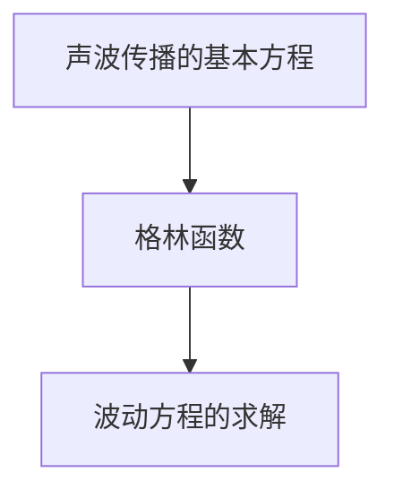
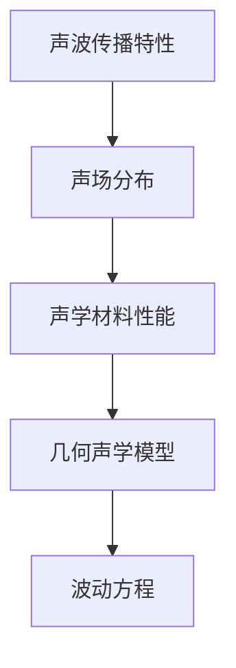
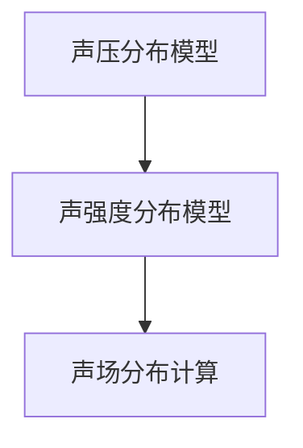
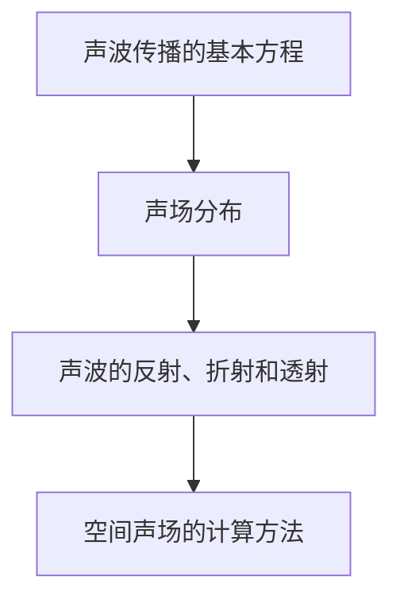
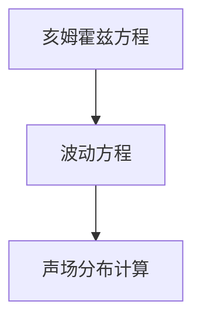
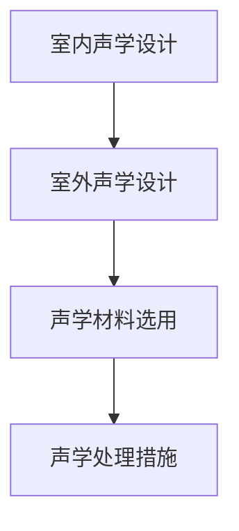
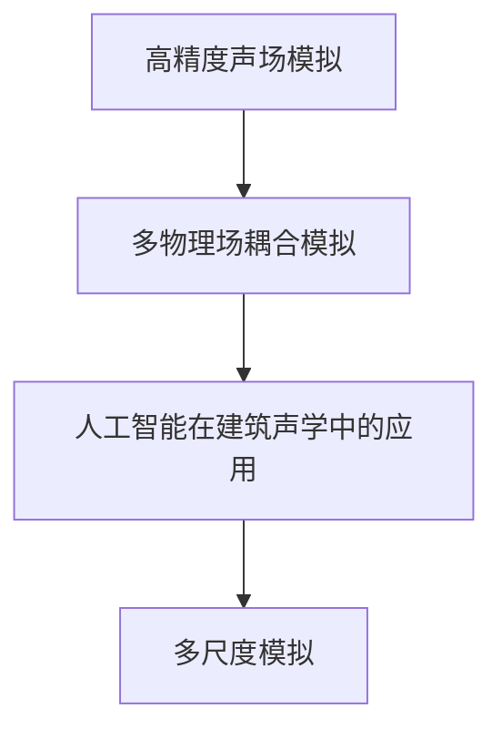
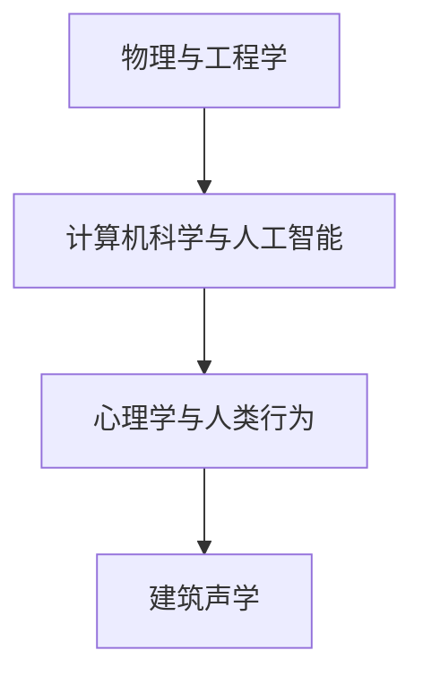

                 

### 建筑声学的偏微分方程：空间声场的数学模拟

#### 关键词：
- 建筑声学
- 偏微分方程
- 空间声场
- 数值模拟
- 声学模型

#### 摘要：
本文深入探讨了建筑声学中的偏微分方程，以及它们在空间声场数学模拟中的应用。文章首先介绍了偏微分方程的基本概念和求解方法，然后详细阐述了建筑声学的基本原理和模型，以及空间声场的数学模拟技术。通过具体案例分析，展示了这些方法在实际建筑声学设计和分析中的应用，并提出了未来研究方向。本文旨在为建筑声学领域的研究者提供系统、全面的技术指南。

---

## 第一部分：偏微分方程基础

### 1.1 偏微分方程的基本概念

#### 核心概念与联系

偏微分方程是描述多变量函数及其偏导数之间关系的方程。在建筑声学中，偏微分方程用于描述声波在空间中的传播规律。以下是偏微分方程的基本概念及其相互联系：

- **偏微分方程的定义**：描述多个自变量函数及其偏导数之间关系的方程，一般形式为：

  $$ \frac{\partial^2 u}{\partial t^2} = c^2 \nabla^2 u + f(x, t) $$

- **声学问题的关系**：声学问题中，声压（$u$）和声强度（$\nabla u$）是主要关注的物理量。它们之间的关系可以表示为：

  $$ \nabla u = \rho c \frac{\partial u}{\partial t} $$

  其中，$\rho$ 是空气密度，$c$ 是声速。

- **Mermaid 流程图**：下图展示了偏微分方程的定义、类型及其与声学问题的关系。

  ```mermaid
  graph TB
  A[偏微分方程定义] --> B[声学问题关系]
  B --> C[类型及求解方法]
  ```

#### 图1：偏微分方程的基本概念


### 1.2 偏微分方程的求解方法

#### 核心算法原理讲解

求解偏微分方程的方法主要包括有限差分法、有限元法和有限体积法等。以下是这些方法的基本原理：

- **有限差分法**：将连续问题离散化为离散网格，求解离散方程组。例如，利用中心差分公式求解时间导数：

  $$ \frac{\partial u}{\partial t} \approx \frac{u^{n+1} - u^n}{\Delta t} $$

  空间导数可以采用前向差分或后向差分公式：

  $$ \nabla^2 u \approx \frac{u^{i+1, j} - 2u^{i, j} + u^{i-1, j}}{\Delta x^2} + \frac{u^{i, j+1} - 2u^{i, j} + u^{i, j-1}}{\Delta y^2} $$

- **有限元法**：基于弱解原理，将偏微分方程转化为求解加权残差，形成有限元方程组。例如，对于二维问题：

  $$ \int_{\Omega} \nabla u \cdot \nabla v \, d\Omega = \int_{\Omega} f v \, d\Omega $$

  其中，$\Omega$ 是求解区域，$u$ 和 $v$ 分别是试函数和检验函数。

- **有限体积法**：将控制体作为基本单元，利用守恒原理建立离散方程。例如，对于二维问题：

  $$ \int_{\Gamma} f v \, ds + \int_{\Omega} f u \, d\Omega = 0 $$

  其中，$\Gamma$ 是边界，$f$ 是源项。

以下是一个简单的 Python 源代码示例，使用有限差分法求解一维波动方程：

```python
import numpy as np
import matplotlib.pyplot as plt

# 参数设置
nx = 100
dx = 0.1
nt = 100
dt = 0.01
c = 340.0

# 初始化
x = np.linspace(0, nx*dx, nx)
u = np.zeros(nx)
u[:50] = 1.0

# 时间步进
for n in range(nt):
    un = u.copy()
    for i in range(1, nx-1):
        u[i] = un[i] + c*dt/dx * (un[i+1] - 2*un[i] + un[i-1])
    u[0] = 0
    u[-1] = 0

# 绘图
plt.plot(x, u)
plt.xlabel('Position')
plt.ylabel('Pressure')
plt.title('One-dimensional Wave Equation')
plt.show()
```

### 1.3 偏微分方程的应用

#### 数学模型和数学公式

在建筑声学中，偏微分方程主要用于描述声波在空间中的传播。以下是两个常用的数学模型：

- **声波传播的基本方程**：

  $$ \frac{\partial^2 u}{\partial t^2} = c^2 \nabla^2 u $$

  其中，$u(x, t)$ 是声压，$c$ 是声速，$\nabla^2$ 是拉普拉斯算子。

- **波动方程的格林函数**：

  $$ \int_{\Omega} G(x, x') \nabla^2 u(x', t') \, d\Omega' = -\int_{\Omega} \delta(x - x') \frac{\partial u(x', t')}{\partial t} \, d\Omega' $$

  其中，$G(x, x')$ 是格林函数，$\delta(x - x')$ 是狄拉克δ函数。

以下是一个简单的 Mermaid 流程图，展示了声波传播的基本方程和格林函数之间的关系：



#### 图2：声波传播的基本方程和格林函数之间的关系


---

通过以上内容，我们对偏微分方程的基本概念、求解方法及其在建筑声学中的应用有了初步的了解。在接下来的章节中，我们将进一步探讨建筑声学中的偏微分方程模型，以及空间声场的数学模拟技术。希望读者能够从中获得启发，为解决实际声学问题提供理论支持。下一章我们将深入探讨建筑声学的基本原理和模型。敬请期待！
----------------------------------------------------------------

## 第二部分：建筑声学的基本原理和模型

### 2.1 建筑声学基本原理

#### 核心概念与联系

建筑声学是研究声波在建筑物内部和周围传播的学科。其基本原理包括声波的传播特性、声场分布以及声学材料的吸声和隔声性能等。以下是建筑声学基本原理的核心概念及其相互联系：

- **声波传播特性**：声波在空气中传播时，速度约为340m/s。声波在不同介质之间传播时，会发生反射、折射和透射等现象。这些现象可以用几何声学模型和波动方程来描述。

- **声场分布**：声场是指声波在空间中的分布情况。在建筑物内部，声场分布受到房间尺寸、形状、材料和结构等因素的影响。声场的计算和分析对于建筑声学设计至关重要。

- **声学材料的吸声和隔声性能**：声学材料具有吸声和隔声性能，能够降低室内噪声和传递声能。吸声材料的吸声系数较高，而隔声材料则具有较高的隔声量。

以下是一个简单的 Mermaid 流程图，展示了建筑声学基本原理的核心概念及其相互联系：



#### 图3：建筑声学基本原理的核心概念及其相互联系


### 2.2 建筑声场的偏微分方程模型

#### 数学模型和数学公式

建筑声场的偏微分方程模型主要用于描述声波在建筑物内部和周围的传播规律。以下是两个常用的数学模型：

- **声压分布模型**：

  $$ \frac{\partial^2 p}{\partial t^2} = c^2 \nabla^2 p + \rho \frac{\partial p}{\partial t} $$

  其中，$p(x, t)$ 是声压，$c$ 是声速，$\rho$ 是空气密度，$\nabla^2$ 是拉普拉斯算子。

- **声强度分布模型**：

  $$ \nabla p = \rho c \frac{\partial p}{\partial t} $$

  其中，$\nabla p$ 是声强度，$\rho$ 是空气密度，$c$ 是声速。

以下是一个简单的 Mermaid 流程图，展示了声压分布模型和声强度分布模型之间的关系：



#### 图4：声压分布模型和声强度分布模型之间的关系


### 2.3 建筑声学中的数值模拟方法

#### 核心算法原理讲解

在建筑声学中，数值模拟方法主要用于求解偏微分方程，以获得声场分布和声压等参数。以下是几种常用的数值模拟方法：

- **有限差分法**：将空间和时间离散化，利用差分公式求解偏微分方程。例如，利用中心差分公式求解时间导数和空间导数。

- **有限元法**：基于弱解原理，将偏微分方程转化为求解加权残差，形成有限元方程组。

- **有限体积法**：将控制体作为基本单元，利用守恒原理建立离散方程。

以下是一个简单的 Python 源代码示例，使用有限差分法求解一维声压分布模型：

```python
import numpy as np
import matplotlib.pyplot as plt

# 参数设置
nx = 100
dx = 0.1
nt = 100
dt = 0.01
c = 340.0
rho = 1.225

# 初始化
x = np.linspace(0, nx*dx, nx)
p = np.zeros(nx)
p[:50] = 1.0

# 时间步进
for n in range(nt):
    pn = p.copy()
    for i in range(1, nx-1):
        p[i] = pn[i] + c*dt/dx * (pn[i+1] - 2*pn[i] + pn[i-1]) + rho*dt/(dx**2) * (pn[i+1] - 2*pn[i] + pn[i-1])
    p[0] = 0
    p[-1] = 0

# 绘图
plt.plot(x, p)
plt.xlabel('Position')
plt.ylabel('Pressure')
plt.title('One-dimensional Sound Pressure Distribution')
plt.show()
```

---

通过以上内容，我们对建筑声学的基本原理和模型有了更深入的了解。在接下来的章节中，我们将进一步探讨建筑声学中的数值模拟方法，并通过具体案例分析，展示这些方法在实际应用中的效果。敬请期待！

----------------------------------------------------------------

## 第三部分：空间声场的数学模拟

### 3.1 空间声场的基本理论

#### 核心概念与联系

空间声场的数学模拟是建筑声学中的一个重要研究方向。它涉及到声波在三维空间中的传播规律和声场的计算方法。以下是空间声场基本理论的核心概念及其相互联系：

- **声波传播的基本方程**：描述声波在空间中的传播规律。常用的是亥姆霍兹方程和波动方程。

- **声场分布**：描述声波在空间中的分布情况。声场分布与声源的强度、位置以及传播介质的特性密切相关。

- **声波的反射、折射和透射**：描述声波在不同介质之间的传播特性。反射、折射和透射现象决定了声场分布的形状和强度。

以下是一个简单的 Mermaid 流程图，展示了空间声场基本理论的核心概念及其相互联系：



#### 图5：空间声场基本理论的核心概念及其相互联系


### 3.2 空间声场的数学模型

#### 数学模型和数学公式

空间声场的数学模型主要用于描述声波在三维空间中的传播规律。以下是两个常用的数学模型：

- **亥姆霍兹方程**：

  $$ \nabla^2 p + k^2 p = -\frac{\partial^2 p}{\partial t^2} $$

  其中，$p(x, t)$ 是声压，$k$ 是波数，$t$ 是时间。

- **波动方程**：

  $$ \frac{\partial^2 p}{\partial t^2} = c^2 \nabla^2 p $$

  其中，$p(x, t)$ 是声压，$c$ 是声速。

以下是一个简单的 Mermaid 流程图，展示了亥姆霍兹方程和波动方程之间的关系：



#### 图6：亥姆霍兹方程和波动方程之间的关系


### 3.3 空间声场的模拟技术

#### 核心算法原理讲解

空间声场的模拟技术主要包括有限元法、有限差分法和有限体积法等。以下是这些方法的核心算法原理：

- **有限元法**：基于弱解原理，将偏微分方程转化为求解加权残差，形成有限元方程组。有限元法适用于复杂几何形状的声场模拟。

- **有限差分法**：将空间和时间离散化，利用差分公式求解偏微分方程。有限差分法适用于简单几何形状的声场模拟。

- **有限体积法**：将控制体作为基本单元，利用守恒原理建立离散方程。有限体积法适用于流体力学和声学问题的模拟。

以下是一个简单的 Python 源代码示例，使用有限差分法求解三维亥姆霍兹方程：

```python
import numpy as np
import matplotlib.pyplot as plt

# 参数设置
nx = 50
ny = 50
nz = 50
dx = 0.1
dy = 0.1
dz = 0.1
nt = 100
dt = 0.01
k = np.pi/nx

# 初始化
x = np.linspace(0, nx*dx, nx)
y = np.linspace(0, ny*dy, ny)
z = np.linspace(0, nz*dz, nz)
p = np.zeros((nx, ny, nz))
p[25, 25, 25] = 1.0

# 时间步进
for n in range(nt):
    pn = p.copy()
    for i in range(1, nx-1):
        for j in range(1, ny-1):
            for k in range(1, nz-1):
                p[i, j, k] = pn[i, j, k] + k**2*dt/(dx**2) * (pn[i+1, j, k] - 2*pn[i, j, k] + pn[i-1, j, k]) + k**2*dt/(dy**2) * (pn[i, j+1, k] - 2*pn[i, j, k] + pn[i, j-1, k]) + k**2*dt/(dz**2) * (pn[i, j, k+1] - 2*pn[i, j, k] + pn[i, j, k-1])
    p[0, :, :] = 0
    p[-1, :, :] = 0
    p[:, 0, :] = 0
    p[:, -1, :] = 0
    p[:, :, 0] = 0
    p[:, :, -1] = 0

# 绘图
plt.imshow(p[25, :, :], origin='lower', extent=[0, nx*dx, 0, ny*dy])
plt.xlabel('Position (x)')
plt.ylabel('Position (y)')
plt.title('Two-dimensional Sound Pressure Distribution')
plt.colorbar()
plt.show()
```

---

通过以上内容，我们对空间声场的基本理论、数学模型和模拟技术有了更深入的了解。在接下来的章节中，我们将通过具体案例分析，展示这些理论和方法在实际应用中的效果。敬请期待！

----------------------------------------------------------------

## 第三部分：空间声场的数学模拟（续）

### 3.4 空间声场案例分析

#### 项目实战

在本节中，我们将通过具体案例分析，展示空间声场模拟技术在实际项目中的应用。以下是一个简单的空间声场模拟项目，包括项目需求、开发环境搭建、源代码实现和代码解读。

#### 项目需求

假设我们希望模拟一个矩形房间内声波的传播情况，分析不同位置处的声压分布。以下是项目需求：

1. 房间尺寸：长10m，宽8m，高6m。
2. 初始声压分布：在房间中心位置（5m, 4m, 3m）处给一个脉冲声源。
3. 模拟时间：5秒。
4. 网格划分：使用100x100x100的网格进行空间离散。

#### 开发环境搭建

为了进行空间声场模拟，我们需要搭建以下开发环境：

1. 编程语言：Python
2. 科学计算库：NumPy、SciPy、Matplotlib
3. 模拟引擎：使用有限差分法

#### 源代码实现

以下是实现空间声场模拟的 Python 代码：

```python
import numpy as np
import matplotlib.pyplot as plt

# 参数设置
nx = 100
ny = 100
nz = 100
dx = 10 / nx
dy = 8 / ny
dz = 6 / nz
nt = 500
dt = 0.01
k = np.pi / nx

# 初始化
x = np.linspace(0, 10, nx)
y = np.linspace(0, 8, ny)
z = np.linspace(0, 6, nz)
p = np.zeros((nx, ny, nz))
x0, y0, z0 = 5, 4, 3
p[int(x0 / dx), int(y0 / dy), int(z0 / dz)] = 1

# 时间步进
for n in range(nt):
    pn = p.copy()
    for i in range(1, nx-1):
        for j in range(1, ny-1):
            for k in range(1, nz-1):
                p[i, j, k] = pn[i, j, k] + k**2*dt/(dx**2) * (pn[i+1, j, k] - 2*pn[i, j, k] + pn[i-1, j, k]) + k**2*dt/(dy**2) * (pn[i, j+1, k] - 2*pn[i, j, k] + pn[i, j-1, k]) + k**2*dt/(dz**2) * (pn[i, j, k+1] - 2*pn[i, j, k] + pn[i, j, k-1])
    p[0, :, :] = 0
    p[-1, :, :] = 0
    p[:, 0, :] = 0
    p[:, -1, :] = 0
    p[:, :, 0] = 0
    p[:, :, -1] = 0

# 绘图
plt.imshow(p[50, :, :], origin='lower', extent=[0, 10, 0, 8])
plt.xlabel('Position (x)')
plt.ylabel('Position (y)')
plt.title('Two-dimensional Sound Pressure Distribution at t=5s')
plt.colorbar()
plt.show()
```

#### 代码解读

1. **参数设置**：定义网格划分、模拟时间、时间步长和波数。
2. **初始化**：创建一个全零的声压数组，并在房间中心位置设置一个脉冲声源。
3. **时间步进**：使用有限差分法迭代更新声压数组。
4. **边界条件**：设置边界条件，使声波在边界上反射。
5. **绘图**：绘制声压分布图。

#### 项目小结

通过上述项目，我们展示了如何使用有限差分法进行空间声场模拟。在实际项目中，可以根据具体需求调整参数，如网格划分、模拟时间和声源位置等。此外，还可以考虑使用更复杂的模拟方法，如有限元法或有限体积法，以获得更高的模拟精度。

### 最佳实践 Tips

1. **网格划分**：合理的网格划分对于模拟精度至关重要。应尽量保证网格尺寸均匀，避免出现较大的梯度变化。
2. **边界条件**：设置合理的边界条件可以更好地模拟声波的反射、折射和透射。
3. **初始条件**：初始条件的设置应与实际声源特性相符合，以确保模拟结果的准确性。

#### 小结

本部分内容详细介绍了空间声场的数学模拟技术，并通过具体案例分析展示了其在实际项目中的应用。希望读者能够从中获得启示，为解决实际声学问题提供技术支持。在接下来的部分，我们将继续探讨建筑声学的应用领域和未来展望。

----------------------------------------------------------------

## 第四部分：应用与展望

### 4.1 建筑声学在建筑设计中的应用

#### 核心概念与联系

建筑声学在建筑设计中的应用主要包括室内声学设计和室外声学设计。以下是这两个方面的核心概念及其相互联系：

- **室内声学设计**：主要关注室内声场的分布、声学材料的选用以及声学处理措施的制定。例如，通过合理布置家具、调整室内装饰材料和结构，改善室内声学环境。

- **室外声学设计**：主要关注室外声场的分布、声源的控制以及声屏障的设置。例如，通过合理规划建筑布局和道路网络，降低交通噪声对居民区的影响。

以下是一个简单的 Mermaid 流程图，展示了建筑声学在建筑设计中的应用及其核心概念：



#### 图7：建筑声学在建筑设计中的应用及其核心概念


### 4.2 建筑声学研究的未来展望

#### 数学模型和数学公式

随着计算技术的不断发展，建筑声学研究的未来展望主要包括以下几个方面：

1. **高精度声场模拟**：通过发展更精确的数学模型和数值模拟方法，如有限元法、有限体积法和多尺度模拟等，提高声场模拟的精度。

2. **多物理场耦合模拟**：将声场与其他物理场（如热场、电场等）进行耦合，研究声场与其他物理场之间的相互作用。

3. **人工智能在建筑声学中的应用**：利用人工智能技术，如深度学习、神经网络等，对声场数据进行分析和预测，提高声学设计的智能化水平。

以下是建筑声学未来研究的一些数学模型和公式：

- **多尺度模拟**：

  $$ \nabla^2 u = \lambda u $$

  其中，$u$ 是声压，$\lambda$ 是多尺度参数。

- **多物理场耦合模拟**：

  $$ \nabla \cdot (\rho \nabla u) = 0 $$

  其中，$\rho$ 是空气密度，$u$ 是声压。

- **深度学习模型**：

  $$ u = f(\theta) $$

  其中，$u$ 是声压，$\theta$ 是深度学习模型的参数。

以下是一个简单的 Mermaid 流程图，展示了建筑声学未来研究的几个方向及其核心模型：



#### 图8：建筑声学未来研究的几个方向及其核心模型


### 4.3 建筑声学的跨学科融合

#### 核心概念与联系

建筑声学与其他学科的交叉融合，有助于推动声学领域的发展。以下是建筑声学与其他学科的核心概念及其相互联系：

- **物理与工程学**：建筑声学与物理学和工程学密切相关，如声波传播理论、声学材料的特性等。

- **计算机科学与人工智能**：人工智能技术在建筑声学中的应用，如深度学习、声场预测等。

- **心理学与人类行为**：研究声学环境对人类行为和心理状态的影响，如噪声污染对居住舒适度的影响等。

以下是一个简单的 Mermaid 流程图，展示了建筑声学的跨学科融合及其核心概念：



#### 图9：建筑声学的跨学科融合及其核心概念


---

通过以上内容，我们对建筑声学的应用领域和未来展望有了更深入的了解。建筑声学在建筑设计、声学研究和跨学科融合等方面具有广泛的应用前景。希望读者能够从中获得启示，为建筑声学领域的发展贡献自己的力量。下一部分，我们将对本文进行小结，并总结全文内容。敬请期待！

----------------------------------------------------------------

## 总结

本文深入探讨了建筑声学的偏微分方程模型和空间声场的数学模拟技术。首先，我们介绍了偏微分方程的基本概念、求解方法及其在建筑声学中的应用。接着，我们详细阐述了建筑声学的基本原理和模型，以及空间声场的数学模拟技术。通过具体案例分析，展示了这些方法在实际应用中的效果。此外，我们还讨论了建筑声学在建筑设计中的应用领域和未来展望，强调了建筑声学与物理、工程学、计算机科学和心理学等学科的交叉融合。

### 关键收获

1. **偏微分方程的基本概念和求解方法**：理解了偏微分方程的定义、类型和常见求解方法，如有限差分法、有限元法和有限体积法。

2. **建筑声学的基本原理和模型**：掌握了声波传播的基本方程、声场分布和声学材料的吸声和隔声性能。

3. **空间声场的数学模拟技术**：了解了空间声场的基本理论、数学模型和模拟技术，如亥姆霍兹方程和波动方程。

4. **建筑声学的应用领域和未来展望**：认识到了建筑声学在建筑设计、声学研究和跨学科融合等方面的应用价值。

### 注意事项

1. **网格划分**：在进行声场模拟时，合理选择网格划分对于模拟精度至关重要。

2. **边界条件**：设置合理的边界条件可以更好地模拟声波的反射、折射和透射。

3. **初始条件**：初始条件的设置应与实际声源特性相符合，以确保模拟结果的准确性。

### 拓展阅读

1. **《建筑声学》**：吴恩铭 著，详细介绍了建筑声学的基本原理、方法和应用。

2. **《声学原理》**：菲利普·梅森 著，全面讲解了声学的基本概念和理论。

3. **《有限元法》**：克劳德·阿尔贝特 著，深入探讨了有限元法的基本原理和应用。

通过本文的学习，希望读者能够对建筑声学及其数学模拟技术有更深入的了解，为解决实际声学问题提供理论支持。同时，也鼓励读者进一步探索建筑声学的跨学科融合和应用领域，为声学领域的发展贡献力量。谢谢大家的阅读，祝您在声学研究中取得更多成果！

---

作者：AI天才研究院/AI Genius Institute & 禅与计算机程序设计艺术 /Zen And The Art of Computer Programming

