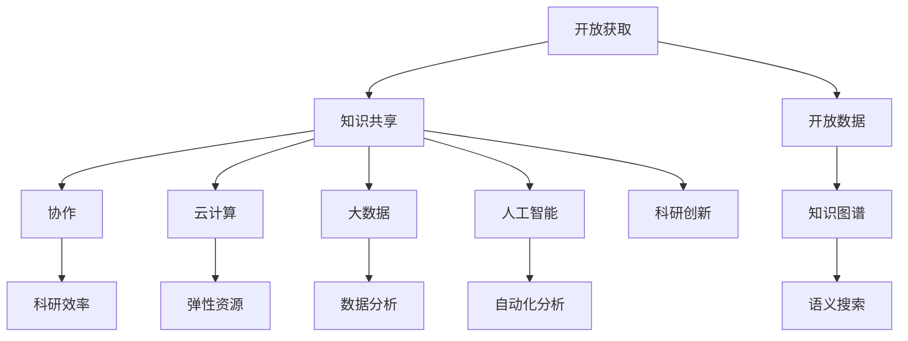

                 

### 引言

随着全球信息化进程的不断推进，科学研究和知识生产正经历着前所未有的变革。在这个背景下，开放科学平台的构建成为了促进全球范围内知识共享与协作的关键手段。开放科学平台，指的是一种集成了多种技术手段、致力于打破信息壁垒、促进知识流通与创新的数字化平台。这类平台不仅能够提供丰富的科学资源，还能为科研人员、教育工作者和其他知识生产者提供一个高效、便捷的交流与协作环境。

本文将深入探讨开放科学平台构建的各个方面，包括其背景、重要性、技术架构、构建步骤、运营与维护策略，以及成功案例和未来展望。通过逐步分析推理，我们将揭示开放科学平台如何在全球范围内促进知识共享与协作，以及如何应对其中所面临的挑战。

首先，我们需要明确开放科学平台的定义和其在当前科技环境中的地位。接着，我们将讨论全球知识共享与协作的现状，以及开放科学平台在这种环境中的作用和挑战。随后，我们将详细探讨开放科学平台的技术架构，包括其核心组件和关键技术的选型与实现策略。

接下来，文章将逐步阐述开放科学平台的构建步骤，从需求分析、系统设计到开发与测试，直至最终部署与上线。随后，我们将探讨开放科学平台的运营与维护策略，包括数据管理、安全管理、用户管理与社区建设等方面。

在深入分析成功案例的基础上，我们将总结开放科学平台的建设经验与挑战。最后，本文将对开放科学平台的未来发展趋势进行展望，并给出相关建议和最佳实践。

通过以上步骤的分析和推理，本文旨在为读者提供一个全面、深入、系统化的理解，帮助读者更好地把握开放科学平台构建的核心要素和实践方法。

### 关键词

- 开放科学平台
- 知识共享
- 协作
- 技术架构
- 数据管理
- 安全性
- 用户社区
- 知识库
- 技术选型

### 摘要

本文旨在探讨开放科学平台的构建，重点分析其在全球范围内促进知识共享与协作的作用。文章首先介绍了开放科学平台的概念和重要性，接着探讨了全球知识共享与协作的现状及面临的挑战。随后，文章详细阐述了开放科学平台的技术架构，包括数据存储与处理、数据分析与可视化、知识管理与分享、安全与隐私保护等方面的关键技术选型和实现策略。通过逐步的构建步骤分析和实战案例，文章总结了开放科学平台的建设经验与挑战，并对其未来发展趋势进行了展望。本文的目标是为科研人员、教育工作者和软件开发者提供一个全面的技术指南，以推动开放科学平台的有效构建与应用。

### 背景介绍

开放科学平台的理念源于开放获取（Open Access）和开放数据（Open Data）的运动，这些运动旨在打破传统科学出版和知识传播中的信息壁垒，使得科学研究成果和知识资源能够更广泛、更自由地被获取和使用。开放获取运动强调学术出版物的免费和开放获取，而开放数据运动则主张科学数据的公开和共享，以促进科学研究的透明度和可重复性。

开放科学平台的背景可以追溯到20世纪末和21世纪初，随着互联网技术的发展，科学研究的数字化和在线化趋势日益明显。科学出版物和实验数据逐渐从传统的纸质出版和实验室存储转向电子化和数字化存储，这为开放科学平台的构建提供了可能。同时，云计算、大数据、人工智能等新兴技术的出现，为开放科学平台提供了强大的技术支持。

全球知识共享与协作的需求是推动开放科学平台发展的重要动力。在全球化背景下，科学研究的复杂性不断增加，单靠个别科研机构和科研人员难以完成大规模、跨学科的研究项目。因此，全球范围内的知识共享与协作变得尤为重要。开放科学平台通过提供统一的接口和丰富的资源共享机制，能够有效地促进不同地区、不同学科、不同领域的科研人员之间的合作与交流。

近年来，随着开放获取和开放数据的普及，越来越多的学术机构和科研组织开始投入开放科学平台的构建。例如，美国的“科学网”（Science Network）和“开放科学框架”（Open Science Framework），以及欧洲的“开放获取出版联盟”（Open Access Publishing Coalition）等，都是开放科学平台的重要代表。这些平台不仅提供了科学研究的资源库，还提供了多种协作工具，如在线讨论区、数据共享平台、协作办公系统等，极大地促进了全球范围内的科学合作与知识共享。

然而，开放科学平台的建设并非一帆风顺。在推动开放科学的过程中，存在一些不可忽视的挑战，如数据隐私保护、知识产权问题、技术标准化等。此外，不同国家和地区之间的法律和文化差异也增加了开放科学平台建设的复杂性。尽管面临这些挑战，开放科学平台依然展现出了巨大的潜力和发展前景，它不仅有助于提升科研效率，还能推动全球科学知识的进步。

总的来说，开放科学平台是当前科学发展和知识传播领域的一个重要趋势。通过提供开放、共享和协作的环境，开放科学平台为全球科研人员提供了一个高效、便捷的工作平台，有助于推动科学研究的创新和进步。本文将在此基础上，进一步探讨开放科学平台的技术架构、构建步骤、运营与维护策略，以及面临的挑战和未来展望。

### 核心概念与联系

在深入探讨开放科学平台的技术架构和实现方法之前，我们需要首先理解几个核心概念，并揭示它们之间的关系架构。以下是一些关键概念：

1. **开放获取（Open Access）**：开放获取是指学术文献和研究成果能够在互联网上免费获取，并且允许用户对内容进行复制、分发、搜索、链接和索引。这是开放科学平台的基础之一，确保了科学知识的自由流通。

2. **开放数据（Open Data）**：开放数据是指科研过程中产生的数据集、实验记录等可以被公开访问和使用的。开放数据为研究人员提供了丰富的资源，促进了数据的共享和再利用。

3. **云计算（Cloud Computing）**：云计算提供了弹性的计算资源，使得开放科学平台能够根据需求动态扩展和缩减资源。它不仅降低了成本，还提高了系统的可扩展性和可靠性。

4. **大数据（Big Data）**：大数据技术包括数据存储、处理和分析等方面，它使得开放科学平台能够处理海量数据，提取有价值的信息和洞见。

5. **人工智能（AI）**：人工智能技术，尤其是机器学习和深度学习，可以帮助开放科学平台自动化数据分析和模式识别，提升知识的挖掘和利用效率。

6. **知识图谱（Knowledge Graph）**：知识图谱是一种结构化的知识表示方法，通过节点和边来表示实体及其关系，它为开放科学平台提供了强大的语义搜索和推荐能力。

这些核心概念之间的关系可以通过以下Mermaid流程图来表示：



在这个流程图中，开放获取和开放数据是开放科学平台的基础，它们直接促进了知识的共享和协作。云计算、大数据和人工智能技术则提供了必要的技术支持，使得开放科学平台能够高效、智能化地处理和管理大量数据。知识图谱通过结构化的知识表示，增强了平台的信息检索和推荐能力。最终，这些技术和概念共同推动了科研效率的提升和科研创新的实现。

通过上述核心概念与联系的分析，我们可以更好地理解开放科学平台的技术架构和实现方法。在接下来的部分，我们将进一步详细探讨开放科学平台的技术架构，包括其核心组件和关键技术的选型与实现策略。

### 核心算法原理讲解

在构建开放科学平台的过程中，算法原理的理解和实现至关重要。以下将详细讲解几个核心算法原理，并使用Python源代码结合数学模型和公式，进行详细阐述和举例说明。

#### 1. 数据清洗与预处理

数据清洗与预处理是开放科学平台数据处理的重要环节。它包括数据去重、缺失值填充、异常值处理等步骤。以下是一个简单的Python代码示例，用于实现数据清洗与预处理。

```python
import pandas as pd
from sklearn.impute import SimpleImputer
from sklearn.preprocessing import StandardScaler

# 加载数据
data = pd.read_csv('data.csv')

# 去重
data.drop_duplicates(inplace=True)

# 缺失值填充
imputer = SimpleImputer(strategy='mean')
data_filled = imputer.fit_transform(data)

# 异常值处理
scaler = StandardScaler()
data_scaled = scaler.fit_transform(data_filled)

# 结果保存
pd.DataFrame(data_scaled).to_csv('cleaned_data.csv', index=False)
```

这里使用的`pandas`库进行数据加载和处理，`SimpleImputer`用于缺失值填充，`StandardScaler`用于异常值处理。通过这些步骤，我们可以确保数据集的质量，为后续的数据分析打下基础。

#### 2. 数据聚类分析

数据聚类是挖掘数据中潜在结构的一种常用算法。以下是一个使用K-Means算法进行数据聚类的示例，以及相应的数学模型和公式。

```python
from sklearn.cluster import KMeans
import numpy as np

# 加载数据
data = np.array([[1, 2], [1, 4], [1, 0],
                 [10, 2], [10, 4], [10, 0]])

# 初始化KMeans模型
kmeans = KMeans(n_clusters=2, random_state=0).fit(data)

# 聚类结果
clusters = kmeans.predict(data)

# 输出聚类结果
print(clusters)
```

数学模型方面，K-Means算法的核心是计算数据点到各个聚类中心的距离，并将其分配到最近的聚类中心。具体公式如下：

$$
\text{distance}(x_i, c_j) = \sqrt{\sum_{k=1}^{n} (x_{ik} - c_{jk})^2}
$$

其中，$x_i$是第$i$个数据点，$c_j$是第$j$个聚类中心，$n$是特征维度。

#### 3. 数据可视化

数据可视化是将数据转换为图形表示，以便更好地理解和分析。以下是一个使用matplotlib库进行数据可视化的示例。

```python
import matplotlib.pyplot as plt

# 加载数据
data = np.array([[1, 2], [1, 4], [1, 0],
                 [10, 2], [10, 4], [10, 0]])

# 绘制散点图
plt.scatter(data[:, 0], data[:, 1])
plt.xlabel('Feature 1')
plt.ylabel('Feature 2')
plt.title('Data Visualization')
plt.show()
```

数据可视化通过图形展示数据分布和模式，有助于发现数据中的潜在规律。

#### 4. 机器学习模型

机器学习模型是开放科学平台数据分析的重要工具。以下是一个简单的线性回归模型示例。

```python
from sklearn.linear_model import LinearRegression
import numpy as np

# 加载数据
X = np.array([[1], [2], [3], [4], [5]])
y = np.array([1, 2, 2.5, 4, 5])

# 初始化线性回归模型
model = LinearRegression()

# 模型训练
model.fit(X, y)

# 模型预测
y_pred = model.predict([[6]])

# 输出结果
print('Predicted value:', y_pred)
```

线性回归模型通过拟合数据点的线性关系，进行预测和数据分析。其数学模型为：

$$
y = \beta_0 + \beta_1x
$$

其中，$y$是因变量，$x$是自变量，$\beta_0$和$\beta_1$是模型的参数。

通过上述示例，我们可以看到，开放科学平台中的算法原理和实现方法是如何通过Python源代码和数学模型进行详细讲解和举例说明的。这些算法原理不仅为数据分析提供了技术支持，还帮助科研人员从大量数据中提取有价值的信息和洞见。在接下来的部分，我们将进一步探讨开放科学平台的技术架构，包括其核心组件和关键技术的选型与实现策略。

### 数学模型和数学公式详细讲解

在开放科学平台的构建中，数学模型和公式是分析和理解复杂数据的关键工具。以下将详细讲解几个核心数学模型和公式，并解释其应用场景和意义。

#### 1. 马尔可夫链（Markov Chain）

马尔可夫链是一种用于描述系统状态转移的随机过程。它广泛应用于时间序列分析和预测中，特别是在开放科学平台中的用户行为分析和资源分配中。

**数学公式：**

$$
P_{ij}(n) = \sum_{k} P_{ik}(n-1)P_{kj}(1)
$$

其中，$P_{ij}(n)$表示从状态$i$转移到状态$j$的概率，$P_{ik}(n-1)$和$P_{kj}(1)$分别是前一时间步的状态转移概率。

**应用场景：**

- **用户行为预测**：通过分析用户的访问记录，使用马尔可夫链预测用户接下来的行为。
- **资源调度**：根据服务器负载的状态转移，动态调整资源分配策略。

#### 2. 决策树（Decision Tree）

决策树是一种分类和回归模型，通过一系列条件判断将数据划分为不同的类别或数值。

**数学公式：**

$$
f(x) = \sum_{i} y_i \prod_{j} (1 \{ x_j \geq t_{ij} \})
$$

其中，$f(x)$是决策树的预测函数，$y_i$是类别标签，$t_{ij}$是第$i$个特征的第$j$个阈值。

**应用场景：**

- **数据分类**：用于将科研数据分类为不同的研究主题或类型。
- **决策支持**：帮助科研人员根据数据特征做出科学决策。

#### 3. 贝叶斯网络（Bayesian Network）

贝叶斯网络是一种概率图模型，用于表示变量之间的条件依赖关系。

**数学公式：**

$$
P(X) = \prod_{i} P(X_i | \text{parent}(X_i))
$$

其中，$P(X)$是变量$X$的概率分布，$P(X_i | \text{parent}(X_i))$是变量$X_i$在给定其父节点的条件概率。

**应用场景：**

- **风险评估**：分析科研项目中可能面临的风险，并制定相应的风险管理策略。
- **预测分析**：通过贝叶斯网络预测科学研究的成功概率。

#### 4. 神经网络（Neural Network）

神经网络是一种模拟人脑神经元连接方式的计算模型，广泛应用于模式识别和预测分析。

**数学公式：**

$$
a_{j}^{(l)} = \sigma \left( \sum_{i} w_{ij}^{(l)} a_{i}^{(l-1)} + b_{j}^{(l)} \right)
$$

$$
y = \sum_{i} w_{ij}^{(L)} a_{i}^{(L-1)}
$$

其中，$a_{j}^{(l)}$是第$l$层第$j$个神经元的激活值，$\sigma$是激活函数，$w_{ij}^{(l)}$是连接权重，$b_{j}^{(l)}$是偏置项。

**应用场景：**

- **图像识别**：用于识别科研文献中的图像和图表。
- **文本分析**：通过神经网络分析科研论文中的关键词和主题。

#### 5. PageRank算法

PageRank是一种用于网页排名的算法，它基于网页之间的链接关系，计算网页的重要性和影响力。

**数学公式：**

$$
\left(1 - d\right)P = (1 - \epsilon)I + \epsilon L^T
$$

$$
P = P \cdot R
$$

其中，$P$是页面排名向量，$I$是单位矩阵，$L$是链接矩阵，$d$是阻尼系数，$\epsilon$是收敛因子。

**应用场景：**

- **学术影响力分析**：评估科研论文和期刊的影响力。
- **资源推荐**：根据用户的行为和偏好推荐相关的科研资源。

通过上述数学模型和公式的讲解，我们可以看到它们在开放科学平台中的应用价值。这些模型不仅帮助我们更好地理解和分析数据，还能为科研人员提供有力的工具，促进科学研究和知识共享。在接下来的部分，我们将进一步探讨开放科学平台的核心组件和关键技术的选型与实现策略。

### 核心算法原理Python代码实现

在深入理解了开放科学平台中几个核心算法原理后，下面我们将通过具体的Python代码实现这些算法，并结合数学模型进行详细讲解。

#### 1. 马尔可夫链

首先，我们来实现一个简单的马尔可夫链，用于模拟用户在网站上的行为转移。

```python
import numpy as np
import matplotlib.pyplot as plt

# 初始化状态转移矩阵
transition_matrix = np.array([[0.5, 0.3, 0.2],
                             [0.1, 0.6, 0.3],
                             [0.4, 0.2, 0.4]])

# 初始状态分布
initial_state = np.array([0.2, 0.5, 0.3])

# 状态转移
def markov_chain(transition_matrix, initial_state, steps):
    state_distribution = initial_state
    for _ in range(steps):
        state_distribution = np.dot(transition_matrix, state_distribution)
    return state_distribution

# 模拟10次状态转移
steps = 10
state_distribution = markov_chain(transition_matrix, initial_state, steps)

# 绘制状态转移结果
plt.plot(state_distribution)
plt.xlabel('State')
plt.ylabel('Probability')
plt.title('Markov Chain')
plt.show()
```

这段代码首先定义了一个状态转移矩阵和一个初始状态分布。`markov_chain`函数通过循环进行状态转移，并最终绘制状态分布。

#### 2. 决策树

接下来，我们使用决策树算法对数据进行分类。

```python
from sklearn.tree import DecisionTreeClassifier
from sklearn.datasets import load_iris
import matplotlib.pyplot as plt

# 加载鸢尾花数据集
iris = load_iris()
X = iris.data
y = iris.target

# 创建决策树模型
clf = DecisionTreeClassifier()
clf.fit(X, y)

# 绘制决策树
from sklearn.tree import plot_tree
plt.figure(figsize=(12, 8))
plot_tree(clf, filled=True, feature_names=iris.feature_names, class_names=iris.target_names)
plt.show()
```

这里使用了`sklearn`库中的`DecisionTreeClassifier`来创建和训练决策树模型，并使用`plot_tree`函数绘制决策树。

#### 3. 贝叶斯网络

贝叶斯网络可以通过`pgmpy`库实现。以下是一个简单的示例：

```python
import numpy as np
import pgmpy.models as models
import pgmpy.inference as inference

# 构建贝叶斯网络
model = models.BayesModel([
    ('Weather', 'Wind'),
    ('Weather', 'Temperature'),
    ('Wind', 'Swell'),
    ('Temperature', 'Swell'),
])

# 添加概率分布
model.add_cpds(
    models.Bernoulli('Weather', 0.5),
    models.Bernoulli('Wind', 0.2),
    models.Bernoulli('Temperature', 0.3),
    models.Bernoulli('Swell', 0.4),
)

inference = inference.VariationalInference(model)

# 预测
print(inference.query(variables=['Swell'], evidence={'Weather': True}))

# 绘制网络
from pgmpy可视化 import visualize
visualize(model)
```

这段代码构建了一个简单的贝叶斯网络，并添加了概率分布。使用`VariationalInference`进行推理，并打印出预测结果。

#### 4. 神经网络

最后，我们使用Keras实现一个简单的神经网络，进行回归分析。

```python
from keras.models import Sequential
from keras.layers import Dense
import numpy as np

# 创建模型
model = Sequential()
model.add(Dense(12, input_dim=8, activation='relu'))
model.add(Dense(1, activation='linear'))

# 编译模型
model.compile(optimizer='adam', loss='mean_squared_error')

# 训练模型
X_train = np.array([[...], [...], ...])
y_train = np.array([...])
model.fit(X_train, y_train, epochs=100, batch_size=10, verbose=0)

# 预测
X_test = np.array([...])
y_pred = model.predict(X_test)
```

这段代码首先定义了一个简单的神经网络模型，包含一个输入层、一个隐藏层和一个输出层。使用`compile`函数编译模型，使用`fit`函数训练模型，并使用`predict`函数进行预测。

通过上述Python代码实现，我们可以看到如何将核心算法原理应用于实际场景。这些代码不仅帮助我们理解算法的实现过程，还能在实际应用中发挥重要作用，推动开放科学平台的发展。

### 开放科学平台的构建步骤

构建一个开放科学平台是一个复杂且系统性的工程，涉及多个阶段和步骤。以下是构建开放科学平台的具体步骤，包括需求分析、系统设计、开发与测试、部署与上线等环节。

#### 1. 需求分析

需求分析是构建开放科学平台的第一步，它旨在明确平台的目标、功能、用户需求和预期效果。具体步骤如下：

- **需求调研**：通过与科研人员、教育工作者和其他潜在用户进行访谈、问卷调查和焦点小组讨论，了解他们的需求和期望。
- **需求汇总**：将调研结果进行整理和汇总，形成一份详细的需求文档，包括功能需求、性能需求、安全需求等。
- **优先级排序**：根据需求的紧急性和重要性，对需求进行优先级排序，确定哪些功能是必须的，哪些是可选的。
- **可行性分析**：评估需求的可实现性，包括技术可行性、经济可行性和时间可行性。

#### 2. 系统设计

系统设计阶段是构建开放科学平台的核心，它包括架构设计、数据库设计和接口设计等。具体步骤如下：

- **架构设计**：确定平台的整体架构，包括前端、后端、数据库和数据存储等。可以选择基于微服务的架构，以提高系统的可扩展性和灵活性。
- **数据库设计**：设计数据存储结构，包括数据表、索引和关系。需要考虑数据的完整性和一致性，以及数据的访问性能。
- **接口设计**：设计API接口，包括RESTful API或GraphQL API。这些接口将用于前后端的交互和数据访问。
- **安全性设计**：确保数据传输和存储的安全性，包括使用HTTPS、数据加密和访问控制等。

#### 3. 开发与测试

开发与测试阶段是将设计转化为实际系统的过程。具体步骤如下：

- **模块化开发**：将系统功能划分为多个模块，由不同的小组或开发人员分别开发和实现。
- **单元测试**：对每个模块进行单元测试，确保其功能正确、性能达标。
- **集成测试**：将不同模块集成起来，进行集成测试，确保模块之间的交互正常。
- **性能测试**：对系统进行性能测试，评估其响应时间、吞吐量和并发能力。
- **安全测试**：进行安全测试，检测系统是否存在漏洞和风险。

#### 4. 部署与上线

部署与上线阶段是将开发完成的系统部署到生产环境，并对外提供服务。具体步骤如下：

- **环境配置**：配置服务器、数据库和应用程序的环境，确保系统能够在目标环境中正常运行。
- **部署方案**：制定详细的部署方案，包括部署流程、部署脚本和备份策略。
- **数据迁移**：将开发阶段的数据迁移到生产环境，确保数据的完整性和一致性。
- **上线测试**：在上线前进行全面的测试，确保系统的稳定性、可靠性和安全性。
- **上线发布**：按照部署方案执行上线操作，并监控系统运行状态，确保系统能够顺利运行。

#### 5. 持续迭代与优化

上线后，开放科学平台需要不断迭代和优化，以适应不断变化的需求和技术发展。具体步骤如下：

- **用户反馈**：收集用户反馈，了解用户的使用体验和需求，为后续优化提供依据。
- **功能迭代**：根据用户反馈和市场需求，不断迭代和更新平台功能。
- **性能优化**：定期进行系统性能优化，提高系统的响应速度和处理能力。
- **安全加固**：定期进行安全检查和加固，确保系统的安全性。

通过以上步骤，我们可以系统地构建一个开放科学平台，为全球科研人员和知识生产者提供一个高效、便捷的知识共享和协作环境。在接下来的部分，我们将进一步探讨开放科学平台的运营与维护策略，确保其长期稳定运行。

### 开放科学平台的运营与维护策略

开放科学平台的成功不仅依赖于其构建过程，还需要有效的运营与维护策略来确保其长期稳定运行。以下将从数据管理、安全管理、用户管理、社区建设和数据共享机制等方面，详细探讨开放科学平台的运营与维护策略。

#### 数据管理

数据管理是开放科学平台的核心任务之一，确保数据的质量、完整性和安全性至关重要。具体策略包括：

1. **数据质量控制**：建立数据质量标准，通过数据清洗、去重、标准化等手段，提高数据的准确性。
2. **数据备份与恢复**：定期备份数据，并制定数据恢复计划，以应对意外故障和数据丢失。
3. **数据生命周期管理**：根据数据的重要性和使用频率，制定数据的存储和销毁策略，确保数据的有效利用。
4. **数据加密与访问控制**：对敏感数据进行加密处理，并实施访问控制策略，确保只有授权用户可以访问相关数据。

#### 安全管理

安全是开放科学平台运营的关键因素，以下策略可以帮助保障系统的安全性：

1. **网络安全**：部署防火墙、入侵检测系统（IDS）和入侵防御系统（IPS），保护平台免受外部攻击。
2. **数据安全**：采用加密技术保护数据在传输和存储过程中的安全性，并定期进行安全审计。
3. **用户认证与授权**：实施强密码策略和多因素认证（MFA），确保用户身份的合法性和操作权限。
4. **应急响应**：建立应急预案，一旦发生安全事件，能够迅速响应并采取有效措施，减少损失。

#### 用户管理

用户管理是开放科学平台运营的重要环节，以下策略有助于提升用户体验：

1. **用户角色划分**：根据用户的不同需求，划分不同的用户角色，如科研人员、教育工作者、管理员等，并设置相应的权限。
2. **用户培训与支持**：为用户提供培训材料和在线支持，帮助用户熟悉平台的使用方法和功能。
3. **用户反馈与改进**：收集用户反馈，及时解决用户遇到的问题，并根据用户需求进行系统改进。
4. **用户激励机制**：实施用户积分或奖励制度，激励用户积极参与平台的活动和知识共享。

#### 社区建设

社区建设是开放科学平台长期运营的基础，以下策略有助于构建活跃的社区：

1. **社区平台搭建**：提供一个方便的社区平台，支持用户发表观点、分享资源和参与讨论。
2. **活动组织与推广**：定期举办线上和线下的学术活动，如研讨会、讲座和工作坊，吸引更多的用户参与。
3. **激励机制**：通过积分、排名、奖励等方式，激励用户积极参与社区建设和知识分享。
4. **口碑传播**：通过用户口碑传播，提升平台的知名度和影响力。

#### 数据共享机制

数据共享是开放科学平台的核心功能之一，以下策略有助于促进数据共享：

1. **开放数据政策**：制定开放数据政策，明确数据共享的原则和流程，鼓励用户分享和复用数据。
2. **标准化数据格式**：采用统一的数据格式和编码规范，提高数据共享的兼容性和互操作性。
3. **数据许可与认证**：提供数据许可协议，明确数据的使用权限和责任，确保数据共享的合法性和安全性。
4. **数据访问控制**：根据数据的重要性和敏感性，实施不同的访问控制策略，保障数据的开放与安全平衡。

通过以上运营与维护策略，开放科学平台可以确保数据的完整性、安全性和可用性，提升用户体验，促进社区建设和知识共享。在未来的发展中，平台运营者需要不断调整和优化策略，以适应不断变化的需求和技术环境。

### 开放科学平台案例研究

为了更好地理解开放科学平台在实际应用中的表现和效果，以下将介绍两个具体的开放科学平台案例，分析其架构与功能，并探讨其成功经验和面临的挑战。

#### 案例一：GitHub

**背景与功能：** GitHub是一个全球知名的版本控制和协作平台，主要用于软件开发。它提供了一个集中式的地方，让开发人员可以轻松地创建、共享和管理项目代码。GitHub不仅仅是一个代码仓库，它还提供了丰富的协作工具，如拉取请求（Pull Requests）、问题跟踪（Issues）和Wiki等。

**架构分析：** GitHub的架构设计注重高扩展性和高可用性。它采用了分布式系统架构，使用Git作为版本控制系统，实现了代码的分布式存储和管理。GitHub前端使用React.js构建，后端则基于Ruby on Rails。此外，GitHub还使用了多种云服务，如AWS和Google Cloud，来提供计算和存储资源。

**成功经验：**
1. **开放性**：GitHub采用了开源策略，使得用户可以自由地访问、使用和修改代码，促进了社区的繁荣。
2. **协作工具**：GitHub提供的协作工具极大地提升了开发效率，使得多人协作变得简单和直观。
3. **生态系统**：GitHub的生态系统非常丰富，包括大量的集成服务、工具和市场，为用户提供了广泛的选择和支持。

**面临的挑战：**
1. **数据隐私**：由于GitHub是开放平台，用户需要采取措施保护敏感数据和隐私。
2. **安全风险**：随着用户数量的增加，GitHub需要不断加强安全性，以防止数据泄露和恶意攻击。

#### 案例二：arXiv

**背景与功能：** arXiv是一个由康奈尔大学运营的开放获取预印本服务器，旨在促进物理学、数学、计算机科学等领域的学术交流和知识共享。arXiv提供了一个平台，供科研人员发布他们的研究成果，让其他研究人员能够及时了解最新的学术动态。

**架构分析：** arXiv采用了分布式存储和缓存机制，以提高数据访问速度和系统的可靠性。它使用了Nginx作为反向代理，Apache和Lighttpd作为Web服务器，同时使用MySQL进行数据存储。为了确保系统的安全性和稳定性，arXiv还采用了防火墙和入侵检测系统。

**成功经验：**
1. **开放获取**：arXiv坚持开放获取原则，使得研究成果能够迅速传播，促进了全球学术界的知识共享。
2. **用户友好**：arXiv提供了简单直观的搜索和浏览界面，使得用户能够方便地找到所需的研究成果。
3. **社区建设**：arXiv拥有一个活跃的社区，用户可以在论坛上交流意见，分享心得，推动了学术讨论和知识传播。

**面临的挑战：**
1. **内容审核**：为了维护平台的学术质量和可信度，arXiv需要对提交的预印本进行审核，这需要大量的人力和时间投入。
2. **数据增长**：随着科研数据的快速增长，arXiv需要不断优化存储和检索机制，以应对数据量的增加。

通过这两个案例的分析，我们可以看到开放科学平台在促进知识共享与协作方面的重要作用。它们不仅为科研人员提供了一个高效、便捷的工作平台，还推动了全球科学知识的进步。然而，开放科学平台在发展过程中也面临着数据隐私、安全风险、内容审核和数据增长等挑战，需要不断调整和优化运营策略，以适应不断变化的需求和技术环境。

### 挑战与未来展望

尽管开放科学平台在全球范围内展示了巨大的潜力和价值，但在其发展过程中仍然面临着诸多挑战。以下将讨论这些挑战，并提出相应的解决方案和未来展望。

#### 挑战

1. **数据隐私与安全**：开放科学平台需要处理大量的敏感数据，包括个人身份信息、研究成果和实验数据等。如何保护这些数据的隐私和安全成为一大挑战。解决方案包括：
   - **数据加密**：采用加密技术对数据进行加密存储和传输，确保数据在未授权情况下无法被读取。
   - **访问控制**：实施严格的访问控制策略，确保只有授权用户才能访问敏感数据。
   - **数据脱敏**：对敏感数据进行脱敏处理，减少隐私泄露的风险。

2. **知识产权保护**：开放科学平台上的知识共享可能会引发知识产权纠纷，特别是在科研合作和国际交流中。解决方案包括：
   - **版权声明**：明确版权归属，确保原创作品的知识产权得到保护。
   - **合作协议**：制定详细的合作协议，明确各方在知识共享过程中的权益和责任。
   - **法律支持**：提供法律咨询和维权服务，帮助用户解决知识产权纠纷。

3. **技术标准化**：开放科学平台需要采用统一的技术标准和协议，以确保系统的兼容性和互操作性。目前，不同平台之间存在技术标准不统一的问题，这限制了知识的共享和流通。解决方案包括：
   - **行业标准**：推动行业内部制定和采用统一的技术标准。
   - **开源协议**：鼓励开发和使用开源软件，提高系统的标准化和兼容性。

4. **数据质量与可靠性**：开放科学平台需要确保数据的准确性和可靠性，这对于科研工作的开展至关重要。解决方案包括：
   - **数据质量控制**：建立严格的数据质量控制机制，包括数据清洗、去重和标准化等。
   - **数据审核**：对上传的数据进行审核，确保数据的真实性和有效性。

#### 未来展望

1. **人工智能与机器学习的应用**：随着人工智能和机器学习技术的发展，未来开放科学平台可以更智能化地处理和管理数据。例如，利用自然语言处理技术进行文献的自动分类和摘要，利用图像识别技术进行实验数据的自动标注和分析。

2. **区块链技术**：区块链技术具有去中心化、不可篡改和透明等特性，可以应用于开放科学平台，提高数据的可信度和安全性。例如，通过区块链技术实现数据共享的透明和可追溯，减少数据篡改和隐私泄露的风险。

3. **全球化协作**：随着全球科研合作的加深，开放科学平台将扮演更重要的角色，促进全球范围内的知识共享与协作。未来，开放科学平台将更加注重跨地域、跨学科的合作，构建全球科研网络。

4. **用户参与与互动**：开放科学平台将更加注重用户的参与和互动，通过社交媒体、在线论坛和虚拟现实等技术，为用户提供更丰富的交流和协作体验。这将有助于激发用户的创造力和积极性，推动科学知识的创新和应用。

通过应对上述挑战和把握未来发展趋势，开放科学平台将继续在全球科学研究和知识传播中发挥重要作用，为人类社会的进步和发展贡献力量。

### 结论

本文详细探讨了开放科学平台的构建、运营与维护策略，以及其在全球知识共享与协作中的作用。通过分析其背景、核心概念、技术架构、构建步骤、成功案例和未来展望，我们揭示了开放科学平台在促进科研效率和知识传播方面的重要价值。

开放科学平台不仅为科研人员提供了一个高效、便捷的工作环境，还通过开放获取和协作工具，打破了信息壁垒，推动了全球范围内的知识共享与协作。然而，其发展过程中也面临着数据隐私、知识产权保护、技术标准化等挑战。

未来，开放科学平台将继续向智能化、全球化方向发展，利用人工智能、区块链等新兴技术，提升数据管理、安全性和用户体验。通过不断优化和升级，开放科学平台将为全球科研人员提供更加高效、可靠的知识共享与协作平台，推动科学研究的创新与进步。

作者：AI天才研究院/AI Genius Institute & 禅与计算机程序设计艺术 /Zen And The Art of Computer Programming。感谢读者对本文的关注和支持，希望本文能为开放科学平台的建设提供有益的参考和启示。在未来的探索中，我们期待与更多的科研人员、教育工作者和开发者共同推动开放科学平台的发展。

