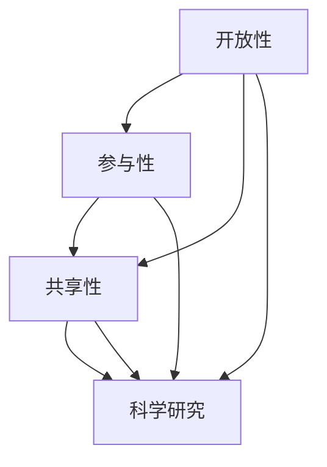
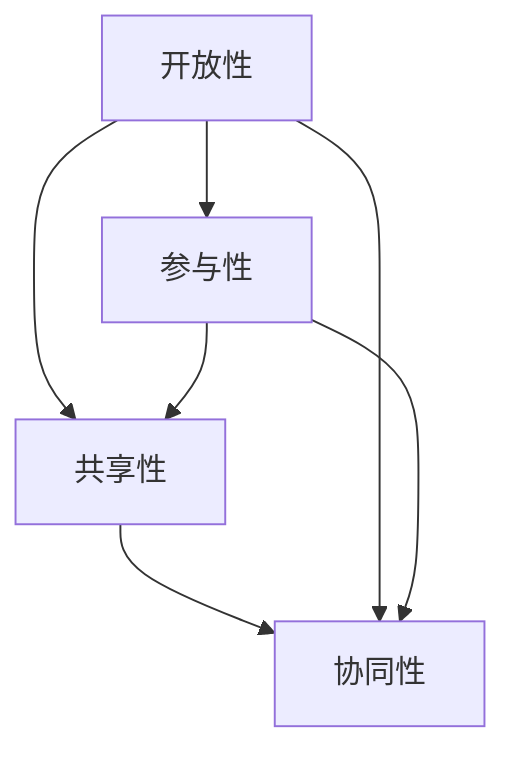

                 

### 引言与概述

#### 1.1 开源科学的起源与发展

开源科学，顾名思义，是科学研究和知识生产的一种新模式，它依赖于开源软件、开源硬件和开源数据。这种模式最早可以追溯到20世纪80年代，当时计算机领域的开源软件开始崭露头角。1976年，美国计算机科学家理查德·斯托曼（Richard Stallman）创建了自由软件基金会（FSF），并推出了著名的GNU项目，旨在创造一个完全自由的操作系统。这一举动标志着开源运动的诞生，也为后来的开源科学奠定了基础。

随着时间的推移，开源运动从计算机领域逐渐扩展到其他科技领域，例如生物学、物理学、化学等。特别是随着互联网技术的发展，开源科学得到了前所未有的推动。科学家们可以通过互联网共享研究成果、工具和资源，实现全球范围内的合作和协作。

#### 1.2 开源科学的核心价值观

开源科学的核心价值观包括开放性、参与性和共享性。首先，开放性意味着科学研究和知识生产过程是公开的，任何人都可以访问和获取相关资料。这种开放性不仅有助于提高研究的透明度，还能促进知识的传播和交流。其次，参与性强调科学家和公众的广泛参与，通过众包、社区协作等方式，共同推动科学研究的进展。最后，共享性是指科学研究成果和资源的共享，这有助于减少重复劳动，提高科研效率。

#### 1.3 开源科学的重要性

开源科学的重要性体现在多个方面。首先，它有助于推动科学研究的创新。通过开放合作，科学家们可以快速获取新的思路和工具，从而加速研究进程。其次，开源科学有助于提高科研成果的实用性和可持续性。共享的研究成果和资源可以更好地服务于社会和人类福祉。此外，开源科学还能促进全球科学合作，加强不同国家和地区之间的联系和交流。

本书《开源科学运动：民主化世界理解的过程与工具》旨在深入探讨开源科学的理论基础、实施过程、工具和技术，并通过案例分析展示其在实践中的应用。本书的主要目标是帮助读者理解开源科学的重要性，掌握开源科学的研究方法，并激发对开源科学的兴趣和参与。

#### 背景介绍

开源科学运动的起源可以追溯到计算机科学领域的自由软件运动。早在1976年，美国计算机科学家理查德·斯托曼（Richard Stallman）便开始倡导自由软件的理念，并创建了自由软件基金会（Free Software Foundation，FSF）。FSF致力于推动自由软件的发展，主张用户拥有对软件的修改、分发和学习的自由。这一理念在计算机科学领域迅速传播，并催生了大量开源软件项目，如GNU、Linux等。

随着互联网技术的普及，开源运动逐渐从计算机科学扩展到其他科学领域。生物学、物理学、化学等领域的科学家开始采用开源模式进行研究和知识生产。例如，生物学领域的开源生物信息学工具和数据库，物理学领域的开源模拟软件，化学领域的开源实验室设备等，都在全球范围内得到了广泛应用。

开源科学的核心价值观包括开放性、参与性和共享性。开放性体现在科学研究和知识生产过程的公开透明，任何人都可以访问和使用相关资源。参与性则强调科学家与公众的广泛参与，通过众包、社区协作等方式，共同推动科学研究的进展。共享性则是开源科学的本质特征，科学研究成果和资源在全球范围内共享，有助于减少重复劳动，提高科研效率。

开源科学的重要性不容忽视。首先，它有助于推动科学研究的创新。通过开放合作，科学家们可以快速获取新的思路和工具，从而加速研究进程。其次，开源科学有助于提高科研成果的实用性和可持续性。共享的研究成果和资源可以更好地服务于社会和人类福祉。此外，开源科学还能促进全球科学合作，加强不同国家和地区之间的联系和交流。

开源科学的发展离不开一系列关键工具和技术。开源软件是开源科学的核心组成部分，它为科学家提供了丰富的工具和平台，如数据分析软件、模拟软件、数据处理软件等。开源硬件则为科学家提供了可定制的实验设备，如开源传感器、机器人等。此外，开源数据资源也是开源科学的重要组成部分，它为科学家提供了大量的研究数据，有助于提高研究的准确性和可靠性。

开源科学的发展历程充满了挑战和机遇。在挑战方面，开源科学面临着知识产权、安全性、质量控制等问题。在机遇方面，随着互联网技术和大数据技术的发展，开源科学迎来了前所未有的发展机遇。全球科学家和公众的参与，使得开源科学成为推动科学进步和社会发展的强大动力。

开源科学运动不仅改变了科学研究的模式，也对科学哲学和社会科学产生了深远的影响。它挑战了传统的科学管理模式，推动了科学民主化的进程。同时，开源科学也为公众提供了更多的参与机会，使科学更加贴近人们的生活。

开源科学的发展不仅需要科学家和技术人员的努力，还需要政策和社会环境的支持。政府、企业和社会组织可以通过提供资金、资源和政策支持，为开源科学的发展创造良好的条件。此外，教育机构也可以通过课程设置和人才培养，为开源科学的发展提供源源不断的人力资源。

总之，开源科学运动是一项具有重要意义的科学革命。它不仅推动了科学研究的创新和进步，也为社会和人类的发展带来了新的机遇。通过深入理解开源科学的理论基础、实施过程和工具技术，我们可以更好地把握开源科学的发展趋势，积极参与其中，共同推动科学和社会的进步。

#### 核心概念与联系

开源科学运动的核心概念包括开放性、参与性和共享性。这些概念彼此关联，共同构成了开源科学的核心理念。

首先，开放性是开源科学的基础。它强调科学研究和知识生产过程的透明和公开，任何人都可以访问和使用相关资源。开放性有助于提高研究的透明度，减少信息不对称，促进科学知识的传播和交流。通过开放性，科学家们可以更快速地获取新的思路和工具，从而加速科学研究的进程。

其次，参与性强调科学研究的广泛参与。开源科学鼓励科学家与公众、企业和政府等不同利益相关者的合作，通过众包、社区协作等方式，共同推动科学研究的进展。参与性不仅有助于提高科研的多样性和创新性，还能使科研成果更贴近实际需求，更具社会价值。

最后，共享性是开源科学的本质特征。它强调科学研究成果和资源的共享，通过全球范围内的合作和交流，实现知识的高效利用和传播。共享性有助于减少重复劳动，提高科研效率，同时也能增强科学研究的可持续性。

这三大核心概念之间的关系可以概括为：开放性提供了科学研究和知识生产的透明环境，为参与性提供了基础；参与性则通过广泛参与，促进了科学研究的多样性和创新性，进一步推动了开放性的实现；而共享性则通过资源共享，提高了科学研究的效率，并为参与性提供了支持和动力。这三者相互依存，共同构成了开源科学的核心理念体系。

为了更直观地展示这些核心概念之间的关系，我们可以使用Mermaid流程图来表示：



在这个流程图中，开放性、参与性和共享性分别作为三个独立的节点，它们共同作用于科学研究这一核心过程，形成一个相互促进、相互依赖的生态系统。通过这个流程图，我们可以更清晰地理解开源科学运动的核心概念及其相互关系。

#### 背景介绍

开源科学运动的背景可以追溯到计算机科学领域的自由软件运动。在20世纪80年代，自由软件基金会（FSF）的创立标志着自由软件运动的兴起。这一运动主张用户对软件拥有修改、分发和学习的自由，推动了开源软件的发展。Linux操作系统的诞生是开源软件运动的里程碑，它彻底改变了计算机软件的开发和分发模式。

随着互联网技术的普及，开源运动逐渐从计算机科学领域扩展到其他科学领域。生物学、物理学、化学等领域的科学家开始采用开源模式进行研究和知识生产。开源科学的核心价值观——开放性、参与性和共享性，在这些领域中得到了广泛应用。

开放性是开源科学的基础，它强调科学研究和知识生产过程的透明和公开。通过开放性，科学家们可以更方便地获取和使用他人的研究成果，提高研究的效率。参与性则强调科学研究的广泛参与，通过众包、社区协作等方式，鼓励更多的人参与到科学研究中来。共享性则强调科学研究成果和资源的共享，通过全球范围内的合作和交流，实现知识的高效利用和传播。

开源科学的发展历程充满了挑战和机遇。在挑战方面，开源科学面临着知识产权、安全性、质量控制等问题。在机遇方面，随着互联网技术和大数据技术的发展，开源科学迎来了前所未有的发展机遇。全球科学家和公众的参与，使得开源科学成为推动科学进步和社会发展的强大动力。

开源科学的核心价值观包括开放性、参与性和共享性。开放性意味着科学研究和知识生产过程是公开的，任何人都可以访问和使用相关资源。这种开放性不仅有助于提高研究的透明度，还能促进知识的传播和交流。参与性则强调科学家和公众的广泛参与，通过众包、社区协作等方式，共同推动科学研究的进展。共享性是指科学研究成果和资源的共享，这有助于减少重复劳动，提高科研效率。

开源科学的发展离不开一系列关键工具和技术。开源软件是开源科学的核心组成部分，为科学家提供了丰富的工具和平台，如数据分析软件、模拟软件、数据处理软件等。开源硬件则为科学家提供了可定制的实验设备，如开源传感器、机器人等。此外，开源数据资源也是开源科学的重要组成部分，它为科学家提供了大量的研究数据，有助于提高研究的准确性和可靠性。

开源科学的发展历程充满了挑战和机遇。在挑战方面，开源科学面临着知识产权、安全性、质量控制等问题。在机遇方面，随着互联网技术和大数据技术的发展，开源科学迎来了前所未有的发展机遇。全球科学家和公众的参与，使得开源科学成为推动科学进步和社会发展的强大动力。

开源科学运动不仅改变了科学研究的模式，也对科学哲学和社会科学产生了深远的影响。它挑战了传统的科学管理模式，推动了科学民主化的进程。同时，开源科学也为公众提供了更多的参与机会，使科学更加贴近人们的生活。

开源科学的发展不仅需要科学家和技术人员的努力，还需要政策和社会环境的支持。政府、企业和社会组织可以通过提供资金、资源和政策支持，为开源科学的发展创造良好的条件。此外，教育机构也可以通过课程设置和人才培养，为开源科学的发展提供源源不断的人力资源。

总之，开源科学运动是一项具有重要意义的科学革命。它不仅推动了科学研究的创新和进步，也为社会和人类的发展带来了新的机遇。通过深入理解开源科学的理论基础、实施过程和工具技术，我们可以更好地把握开源科学的发展趋势，积极参与其中，共同推动科学和社会的进步。

### 开源科学的理论基础

开源科学的理论基础涵盖了其核心概念、基本原则以及与传统科学的关系。要深入理解开源科学，首先需要明确其核心概念。

#### 2.1.1 开源科学的核心概念

开源科学的核心概念主要包括：

1. **开放性**：这是开源科学最显著的特征，强调科学研究和知识生产过程的公开和透明。开放性不仅包括数据的公开，还包括研究方法、过程和结果的公开。这种公开性使得研究成果更易于被验证和重复。

2. **参与性**：参与性是指科学研究和知识生产过程中，科学家、研究者和公众的广泛参与。通过众包、协作平台等机制，开源科学鼓励更多人参与到科学研究中，提高了研究的多样性和创新性。

3. **共享性**：共享性是指研究成果和资源的共享。开源科学强调科学成果应无障碍地共享，使得更多人能够利用已有的资源进行进一步的研究，从而提高科研效率。

4. **协同性**：协同性是开源科学的重要特征，强调科学家之间的合作和协作。通过互联网和开源平台，全球的科学家可以共同合作，共享资源，共同推进科学研究。

#### 2.1.2 开源科学的基本原则

开源科学的基本原则包括：

1. **透明性**：科学研究和知识生产过程应当是透明的，任何人都能够访问和了解研究的全过程。

2. **可复现性**：研究成果应当能够被其他人复现，以便验证其正确性和可靠性。

3. **共享性**：研究成果和资源应当免费共享，使得更多的人能够从中受益。

4. **合作性**：科学研究应当鼓励合作，而不是竞争。通过合作，可以最大化利用资源，提高研究效率。

5. **适应性**：开源科学应当具有适应性，能够灵活地应对新的挑战和需求。

#### 2.1.3 开源科学与传统科学的关系

开源科学与传统科学存在一定的差异，但也相互补充。

1. **优势互补**：开源科学强调开放性、参与性和共享性，这些特点有助于提高科研效率，促进知识的传播和交流。而传统科学则更注重研究过程的保密性和独立性，这有助于保障研究的严谨性和权威性。两者结合，可以发挥各自的优势，提高科学研究的整体水平。

2. **挑战与机遇**：开源科学在提高科研效率、促进知识传播方面具有明显优势，但也面临着知识产权、安全性、质量控制等挑战。传统科学则更注重研究的严谨性和权威性，但在面对快速变化的技术和社会需求时，可能会显得相对滞后。开源科学和传统科学的互补关系，为解决这些挑战提供了新的途径。

3. **发展趋势**：随着互联网和大数据技术的发展，开源科学正逐渐成为科学研究的主要模式之一。传统科学也在逐步采纳开源科学的理念和方法，以应对快速变化的研究环境和社会需求。

总之，开源科学的理论基础为其提供了坚实的基础。通过明确核心概念、基本原则以及与传统科学的关系，我们可以更好地理解开源科学的本质和优势，从而推动科学研究的创新和进步。

#### 核心概念与联系

开源科学的核心概念包括开放性、参与性和共享性，这些概念之间存在着紧密的联系，共同构成了开源科学的理论体系。

首先，开放性是开源科学的基础。它强调科学研究和知识生产过程的透明和公开。开放性使得科学家可以轻松地获取和使用他人的研究成果、工具和数据，这不仅提高了研究的效率，还促进了知识的传播和交流。开放性直接导致了参与性的实现，因为只有当研究成果是公开的，才能吸引更多的人参与到科学研究中来。

其次，参与性是开源科学的核心特征之一。它强调广泛参与，通过众包、社区协作等方式，鼓励科学家、研究者和公众共同推动科学研究的进展。参与性不仅丰富了研究思路和方法，还提高了科研成果的多样性和创新性。参与性反过来也促进了开放性的进一步实现，因为广泛的参与意味着更多的资源和知识需要开放和共享。

共享性是开源科学的另一个核心概念，它强调科学研究成果和资源的共享。通过共享，科学家可以充分利用已有的成果和资源，避免重复劳动，提高科研效率。共享性也是实现协同性的关键，它使得全球的科学家能够共同合作，共同推进科学研究的进展。

为了更直观地展示这些核心概念之间的关系，我们可以使用Mermaid流程图来表示：



在这个流程图中，开放性作为开源科学的基础，通过促进参与性和共享性，进一步推动了协同性的实现。这些核心概念相互依存，共同构成了开源科学的理论框架。

通过这个流程图，我们可以更清晰地理解开源科学的核心概念及其相互关系。开放性提供了科学研究和知识生产的透明环境，为参与性和共享性提供了基础；参与性通过广泛参与，促进了科学研究的多样性和创新性，进一步推动了开放性的实现；共享性则通过资源共享，提高了科学研究的效率，并为参与性提供了支持和动力。这三者相互促进，共同构成了开源科学的核心理念体系。

#### 核心算法原理讲解

在开源科学中，核心算法原理的讲解至关重要。这不仅帮助读者理解开源科学的研究方法和工具，也为实际应用提供了理论基础。以下是一个具体的算法原理讲解，并结合Python源代码进行详细阐述。

##### 2.3.1 机器学习中的随机森林算法

随机森林（Random Forest）是一种集成学习算法，通过构建多棵决策树，并对它们的结果进行投票，从而提高分类或回归任务的准确性。随机森林算法的核心思想是利用随机性来降低模型的过拟合风险，同时通过集成多个模型来提高预测的稳定性。

**算法原理：**

1. **随机选择特征**：对于每一棵决策树，从特征空间中随机选择一部分特征，用于构建决策树。这种方法可以减少特征间的相关性，提高模型的泛化能力。

2. **随机划分数据集**：每次构建决策树时，从训练数据集中随机划分一部分数据作为测试集。这种方法可以避免数据集中的噪声对模型的影响。

3. **集成多个模型**：随机森林由多棵决策树组成，每棵树都是独立的。在预测时，对每棵树的结果进行投票，取多数表决的结果作为最终预测结果。

**Python源代码：**

```python
import numpy as np
from sklearn.ensemble import RandomForestClassifier
from sklearn.datasets import load_iris
from sklearn.model_selection import train_test_split

# 加载鸢尾花数据集
iris = load_iris()
X = iris.data
y = iris.target

# 划分训练集和测试集
X_train, X_test, y_train, y_test = train_test_split(X, y, test_size=0.3, random_state=42)

# 创建随机森林分类器
rf = RandomForestClassifier(n_estimators=100, random_state=42)

# 训练模型
rf.fit(X_train, y_train)

# 预测测试集
y_pred = rf.predict(X_test)

# 输出预测结果
print("Accuracy:", np.mean(y_pred == y_test))
```

**数学模型和公式：**

随机森林算法的数学模型可以表示为：

$$
\hat{y} = \text{majorityVote}(\hat{y}_1, \hat{y}_2, ..., \hat{y}_n)
$$

其中，$\hat{y}_i$ 表示第$i$棵决策树对样本$x$的预测结果，$n$ 表示决策树的数量。$majorityVote$ 表示多数表决函数，取所有预测结果中出现次数最多的类别作为最终预测结果。

**举例说明：**

假设我们有三个样本$x_1, x_2, x_3$，分别通过三棵决策树得到预测结果$\hat{y}_1 = \text{类别A}$，$\hat{y}_2 = \text{类别B}$，$\hat{y}_3 = \text{类别A}$。根据多数表决函数，最终预测结果为$\text{类别A}$。

通过上述讲解，我们可以看到，随机森林算法在开源科学中具有广泛的应用。它不仅提高了预测的准确性，还增强了模型的泛化能力。在实际应用中，我们可以根据具体任务的需求，调整随机森林中的参数，以获得更好的预测效果。

### 开源科学的实施过程

开源科学的实施过程涵盖了从提出问题、研究方法、数据收集、数据共享到结果验证的多个阶段。以下将详细描述每个阶段的具体步骤和关键环节。

#### 3.1 提出问题与定义研究问题

提出问题和定义研究问题是开源科学的第一步，它决定了整个研究的方向和目标。在这一阶段，科学家需要明确研究的问题，确保问题具有实际意义和科学价值。

1. **问题识别**：科学家可以通过查阅文献、进行实地调查或与利益相关者交流，发现和研究领域中的问题。

2. **问题定义**：将问题具体化，明确研究的范围、目标和预期成果。问题定义应当清晰、具体，以便后续的研究设计和实施。

#### 3.2 研究方法与工具

选择合适的研究方法是确保研究成功的关键。开源科学的研究方法通常包括实验研究、数据分析、模型构建等。

1. **实验设计**：根据研究问题的需求，设计实验方案。实验设计应充分考虑实验的可重复性和结果的可靠性。

2. **数据分析**：收集实验数据后，使用统计分析、机器学习等方法对数据进行分析，提取有价值的信息和结论。

3. **模型构建**：基于实验数据和数据分析结果，构建数学模型或算法模型，模拟和预测现实世界中的现象。

#### 3.3 数据收集与共享

数据收集是研究过程中至关重要的一环，它决定了研究的准确性和可靠性。

1. **数据采集**：通过实验、观察、问卷调查等方式收集原始数据。数据采集过程中，应确保数据的真实性和完整性。

2. **数据清洗**：对收集到的数据进行处理和清洗，去除重复、错误或缺失的数据，提高数据质量。

3. **数据共享**：开源科学强调数据的开放性和共享性，研究者应将收集到的数据公开发布，以便其他研究者利用和验证。

#### 3.4 结果验证与传播

研究结果的验证和传播是确保研究质量和影响的关键步骤。

1. **结果验证**：通过同行评审、实验复现等方式，验证研究结果的准确性和可靠性。同行评审可以提供外部评价，帮助发现研究中的不足和问题。

2. **结果传播**：将研究成果通过学术会议、期刊、报告等形式传播，使更多的人了解和认可研究成果。传播过程中，应注重成果的实用性和可操作性。

#### 3.5 实施过程示例

以下是一个具体的开源科学研究项目示例，描述了从提出问题到结果验证的全过程：

1. **问题提出**：科学家发现某地区水质污染严重，影响居民健康。

2. **问题定义**：明确研究目标为评估污染源、污染程度及其对居民健康的影响。

3. **研究方法**：采用现场采样、水质检测、数据分析等方法进行研究。

4. **数据收集**：在污染地区进行采样，检测水质参数，包括pH值、重金属含量、有机污染物等。

5. **数据共享**：将采集到的数据上传至开源数据平台，供其他研究者使用和验证。

6. **结果验证**：通过同行评审，确保研究结果的可靠性和准确性。

7. **结果传播**：在学术期刊上发表研究成果，并通过报告等形式进行传播，为政府决策和居民健康提供科学依据。

通过上述示例，我们可以看到，开源科学的实施过程不仅包括研究方法的创新和数据的共享，还强调了结果的验证和传播，确保研究成果的实用性和可操作性。

### 开源科学工具介绍

开源科学工具在开源科学研究中发挥着至关重要的作用，它们为科学家提供了丰富的工具和资源，使得科学研究过程更加高效和透明。以下将介绍几种主要的开源科学工具，包括开源软件、开源硬件和开源数据资源。

#### 4.1 开源科学软件

开源软件在开源科学中占据了核心地位，为科学家提供了广泛的应用场景。以下是一些常用的开源科学软件：

1. **Python**：Python是一种广泛使用的编程语言，具有简洁的语法和强大的第三方库支持。在科学研究中，Python被广泛应用于数据分析、机器学习、数据可视化等领域。

2. **R**：R是一种专门用于统计分析和图形绘制的编程语言，拥有丰富的统计和机器学习库。R在生物统计学、环境科学、社会科学等领域有着广泛的应用。

3. **MATLAB**：MATLAB是一种高级编程语言和数值计算环境，提供了强大的数学和工程计算功能。MATLAB在物理学、工程学、计算机科学等领域有着广泛的应用。

4. **Jupyter Notebook**：Jupyter Notebook是一种交互式的计算环境，可以轻松地创建和分享包含代码、文本、图表和数学公式的文档。Jupyter Notebook在数据科学、机器学习和教育领域得到了广泛应用。

#### 4.2 开源硬件

开源硬件为科学家提供了可定制的实验设备，使得科学研究更加灵活和多样化。以下是一些常用的开源硬件：

1. **Arduino**：Arduino是一种开源的微控制器平台，可以用于构建各种传感器和控制系统。Arduino在电子工程、物理实验、机器人等领域有着广泛的应用。

2. **Raspberry Pi**：Raspberry Pi是一种低成本、低功耗的单板计算机，可以用于构建嵌入式系统和物联网设备。Raspberry Pi在教育、科研和工业控制等领域有着广泛的应用。

3. **OpenBench Logic Sniffer**：OpenBench Logic Sniffer是一款开源的逻辑分析仪，可以捕获和显示数字信号。OpenBench Logic Sniffer在电子工程、通信研究和嵌入式系统开发等领域有着广泛的应用。

#### 4.3 开源数据资源

开源数据资源为科学家提供了大量的研究数据，有助于提高研究的准确性和可靠性。以下是一些主要的开源数据资源：

1. **GitHub**：GitHub是一个著名的版本控制系统和代码托管平台，许多科学项目都在GitHub上发布和共享源代码。科学家可以利用GitHub跟踪项目的进展、参与社区合作和获取他人代码。

2. **Data.gov**：Data.gov是美国政府提供的开放数据平台，提供了大量的政府数据，涵盖政治、经济、社会、科技等多个领域。Data.gov为科学研究和政策制定提供了丰富的数据支持。

3. **Open Data Commons**：Open Data Commons是一个全球性的开源数据共享联盟，提供了大量的开源数据集，覆盖生物医学、环境科学、社会科学等领域。Open Data Commons为全球科学家提供了宝贵的研究资源。

通过这些开源科学工具，科学家可以更高效地开展研究工作，实现科学研究的民主化和透明化。开源科学工具不仅降低了科研成本，还促进了全球科学合作，推动了科学进步和社会发展。

### 案例分析

#### 5.1 案例一：开源科学在环境监测中的应用

开源科学在环境监测中的应用具有显著的优势。一个典型的案例是使用开源软件和硬件来构建环境监测站。这些监测站可以实时采集空气质量、水质、土壤湿度等数据，并通过互联网将数据共享给全球的研究者。

**具体案例描述：**

1. **硬件选择**：使用Arduino和Raspberry Pi等开源硬件，构建环境监测设备。Arduino用于读取传感器数据，如空气质量传感器、水质传感器等，而Raspberry Pi则用于数据处理和通信。

2. **软件应用**：采用Python和R等开源软件来处理和可视化监测数据。Python提供了丰富的数据分析和可视化库，如Pandas、Matplotlib等，而R则以其强大的统计分析和图形绘制功能著称。

3. **数据共享**：将采集到的数据上传至GitHub等开源平台，供其他研究者下载和使用。这种开放的数据共享方式不仅提高了数据的利用效率，还促进了全球范围内的科学合作。

**实际效果分析：**

通过开源科学的方法，研究人员可以更方便地获取和分析环境数据，从而更好地理解环境变化和污染源。以下是一些实际效果的分析：

1. **提高监测效率**：开源科学工具使得环境监测设备更易于搭建和维护，降低了研发成本。同时，开源软件提供了强大的数据处理能力，使得监测数据能够快速分析和可视化。

2. **促进数据共享**：通过开源平台共享数据，研究者可以轻松地获取和复现他人的研究成果，减少了重复研究的工作量。这有助于提高科研效率，加速科学进展。

3. **增强科研合作**：开源科学模式鼓励全球科学家之间的合作，共同分析和解决环境问题。这种合作不仅提高了研究质量，还促进了全球科学合作和知识共享。

#### 5.2 案例二：开源科学在医学研究中的应用

开源科学在医学研究中的应用正在逐步扩展，特别是在基因组学、生物信息学和临床试验等领域。一个典型的案例是开源基因组分析工具的使用。

**具体案例描述：**

1. **基因组分析工具**：开源软件如GATK（基因组分析工具套件）和Samtools等在基因组学研究中得到了广泛应用。这些工具提供了高效的基因组数据处理和分析功能，帮助研究人员解读基因组数据。

2. **数据共享**：通过GitHub等开源平台，研究人员可以共享基因组数据和研究成果。这种开放的数据共享方式有助于推动医学研究的发展，加速新药开发和疾病治疗的研究。

3. **临床试验管理**：开源平台如OpenClinica和Clin trials等用于临床试验的设计和管理。这些工具提供了临床试验的标准化流程和数据管理功能，提高了临床试验的效率和准确性。

**实际效果分析：**

1. **加速基因组研究**：开源基因组分析工具降低了研究门槛，使得更多的研究人员能够参与到基因组学研究中。通过开源数据的共享，研究人员可以更方便地获取和分析基因组数据，加速基因组学研究的进展。

2. **提高临床试验效率**：开源临床试验管理工具提供了标准化的临床试验流程，降低了临床试验的复杂性和成本。这有助于加快新药开发和临床试验的进度，提高医疗研究的效率。

3. **促进国际合作**：开源科学模式鼓励全球医学研究者的合作。通过开源平台，研究人员可以共享数据和研究成果，共同解决医学难题。这种国际合作有助于提高医学研究质量，推动全球医疗水平的提升。

#### 5.3 案例三：开源科学在社会科学研究中的应用

开源科学在社会科学研究中的应用也越来越广泛，特别是在数据分析、社会调查和模拟实验等领域。

**具体案例描述：**

1. **数据分析工具**：开源软件如R和Python等在社会科学数据分析中发挥了重要作用。这些软件提供了丰富的数据分析和可视化库，帮助研究人员进行复杂的数据处理和统计分析。

2. **社会调查平台**：开源平台如Qualtrics和SurveyMonkey等提供了便捷的社会调查工具。研究人员可以通过这些平台设计问卷、收集数据，并进行数据分析。

3. **模拟实验软件**：开源软件如GAMBIT和OpenMolcas等用于社会科学模拟实验。这些软件提供了复杂的模拟功能，帮助研究人员模拟社会现象和实验结果。

**实际效果分析：**

1. **提高数据分析效率**：开源数据分析工具使得研究人员可以更方便地进行复杂的数据处理和统计分析。这些工具不仅提高了数据分析的效率，还降低了数据分析的成本。

2. **促进数据共享**：通过开源平台，研究人员可以共享社会调查数据和模拟实验结果。这种开放的数据共享方式有助于推动社会科学研究的发展，加速社会问题的解决。

3. **增强研究透明度**：开源科学模式鼓励科研过程的公开和透明。研究人员可以通过开源平台展示其研究方法和数据，接受同行的评审和批评，提高研究的可靠性和可信度。

#### 案例总结

上述案例展示了开源科学在不同领域中的应用，包括环境监测、医学研究和社会科学研究。开源科学通过提供开源工具、数据共享和协同合作，提高了科研效率，促进了全球科学合作，推动了科学进步和社会发展。

开源科学在环境监测中提高了监测效率和数据共享水平，促进了全球环境保护研究；在医学研究中，开源工具加速了基因组分析和临床试验的进展，推动了新药开发和疾病治疗；在社会科学研究中，开源工具和数据共享提高了数据分析效率，促进了社会问题的解决和公共政策制定。

总之，开源科学为科学研究带来了新的机遇和挑战。通过深入理解和应用开源科学的方法和技术，我们可以更好地推动科学研究的创新和发展，为社会和人类的进步做出更大的贡献。

### 开源科学的挑战与未来

开源科学在推动科学进步和社会发展的过程中面临着诸多挑战。这些挑战不仅影响了开源科学的发展，也对其未来提出了新的要求。

#### 挑战

1. **知识产权问题**：开源科学的开放性可能导致知识产权的滥用和侵犯。虽然开源软件和数据的共享有助于知识的传播和创新，但同时也可能引发知识产权纠纷，损害原作者的利益。

2. **安全性问题**：开源科学依赖于互联网和开源平台，这可能导致数据泄露、恶意攻击和系统崩溃等安全风险。特别是在涉及敏感数据和重要科研数据时，安全风险更为突出。

3. **质量控制问题**：开源科学强调数据的共享和开放，但也可能导致数据质量和研究方法的参差不齐。如何保证开源科学的研究结果具有较高的质量和可靠性，是当前面临的重大挑战。

4. **人才问题**：开源科学需要大量具备跨学科知识和技术能力的人才。然而，目前全球范围内的开源科学人才储备不足，难以满足开源科学快速发展的需求。

#### 机遇

1. **技术创新**：随着大数据、人工智能和区块链等新技术的不断发展，开源科学将迎来更多创新机遇。这些技术可以为开源科学研究提供更强大的工具和平台，提高科研效率。

2. **全球合作**：互联网的普及和全球化的进程为开源科学提供了更广阔的合作空间。全球科学家可以通过开源平台和工具，共同解决科学难题，推动科学进步。

3. **政策支持**：各国政府和国际组织越来越重视开源科学的发展，出台了一系列政策和措施，为开源科学研究提供资金、资源和政策支持。这为开源科学的发展创造了有利条件。

#### 未来趋势

1. **开源科学社区的发展**：开源科学社区将成为未来科学研究的核心力量。通过社区协作和资源共享，开源科学社区可以培养更多的开源科学人才，推动科学研究的发展。

2. **开源科学的标准化**：随着开源科学的发展，标准化将成为必然趋势。通过制定统一的标准和规范，可以保证开源科学研究的质量和可靠性，提高科研成果的普及和应用。

3. **开源科学的商业化**：开源科学不仅具有公益性质，也具有商业潜力。未来，开源科学将逐渐走向商业化，通过知识产权转让、技术服务和商业合作等方式，实现开源科学的可持续发展。

#### 对未来的启示

开源科学面临的挑战和机遇为未来科学研究和创新提供了重要启示。首先，开源科学需要加强知识产权保护，确保科学家和原作

