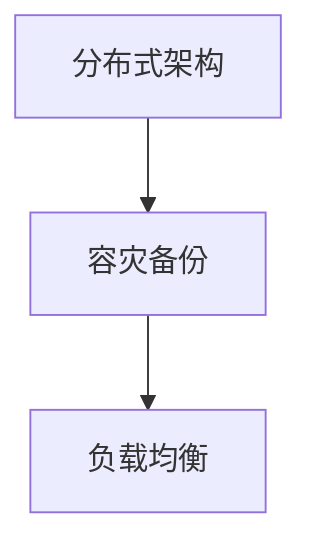
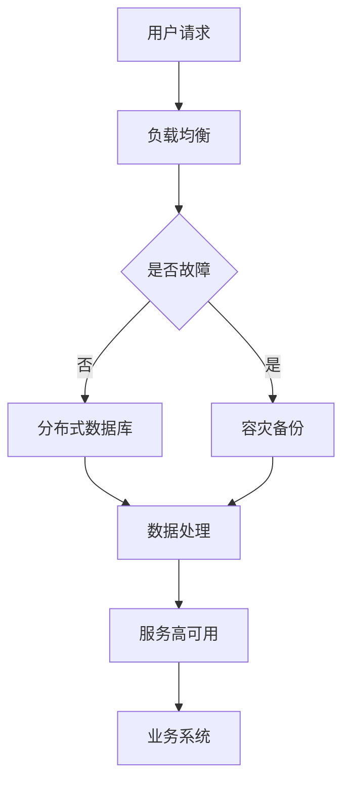
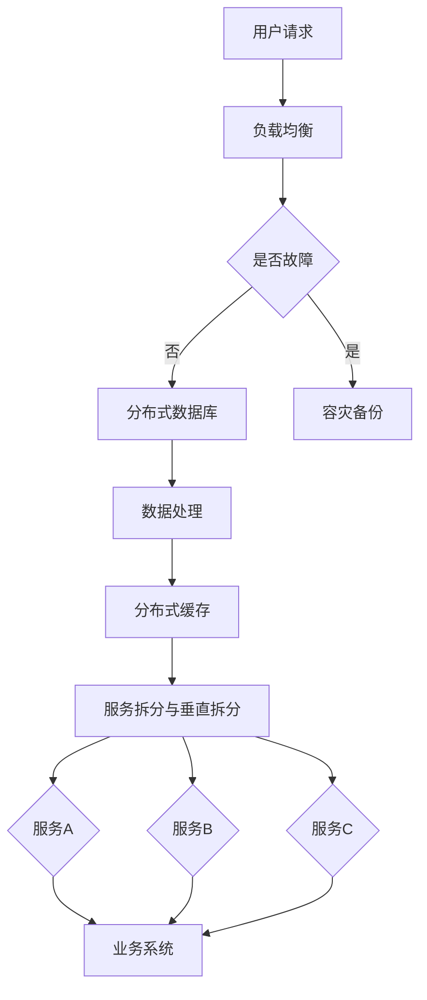

                 

### 《异地多活架构提升LLM应用的可用性》

#### 关键词：异地多活、LLM应用、可用性、架构设计、负载均衡、高可用性、容灾备份

#### 摘要：
本文旨在探讨异地多活架构在提升大型语言模型（LLM）应用可用性方面的作用。通过分析异地多活架构的基本概念、核心组件、负载均衡策略、高可用性设计以及故障恢复机制，本文将详细阐述如何在分布式环境中实现LLM应用的高可用性和可靠性。此外，本文还将结合实际案例，提供具体实施方法和最佳实践，以期为开发者提供有益的参考。

---

#### 引言

随着人工智能技术的飞速发展，大型语言模型（LLM）在自然语言处理、智能客服、内容生成等领域得到了广泛应用。然而，LLM应用的规模不断扩大，其复杂性和对可用性的要求也日益提高。异地多活架构作为一种分布式架构设计，旨在通过在多个地理位置部署数据中心，确保系统在面对各种故障和灾难时仍能保持高可用性和可靠性。

本文将首先介绍异地多活架构的基本概念和核心组件，包括数据中心的选择与部署、数据同步与一致性保障、容灾备份与恢复策略。接着，本文将探讨如何通过负载均衡策略提升LLM应用的可用性，并深入分析服务高可用设计和故障恢复与自动重启机制。最后，本文将通过实际案例展示异地多活架构在LLM应用中的成功实践，并提供相关最佳实践和注意事项。

#### 第1章：异地多活架构概述

##### 1.1 异地多活架构的定义与重要性

**核心概念与联系：**

异地多活架构（Geographically Dispersed Active/Active Architecture）是一种分布式系统架构设计，它通过在多个地理位置部署多个活动状态的数据中心，确保系统在面对故障和灾难时能够快速恢复，保持业务的连续性和可用性。

异地多活架构的核心概念包括分布式架构、容灾备份和负载均衡。分布式架构允许系统将计算和存储资源分散到多个地理位置，提高系统的容错能力和可扩展性。容灾备份则是通过在不同的数据中心部署备份数据，确保在主数据中心发生故障时，备份数据能够接管业务，保证数据的完整性和可靠性。负载均衡则通过智能分配流量，优化资源利用率，提高系统的处理能力和响应速度。

**Mermaid流程图：**



**异地多活架构的定义：**

异地多活架构是指在一个或多个地理位置上部署多个数据中心，这些数据中心之间通过网络连接，共同承载同一套业务系统的架构。它通过分布式计算、数据同步和负载均衡等技术，实现了业务的持续可用性、高可靠性和高效能。

**重要性：**

- **高可用性**：异地多活架构能够在数据中心发生故障时，快速切换到备用数据中心，确保业务不中断。
- **高可靠性**：通过在多个地理位置部署数据中心，系统可以更好地抵御各种形式的故障，提高服务的可靠性。
- **高效能**：负载均衡技术可以实现流量分配的优化，提高整体系统的处理能力。

##### 1.2 LLM应用的特点与挑战

**LLM应用的特点：**

- **数据规模庞大**：LLM应用通常需要处理海量的文本数据，数据规模庞大。
- **计算资源需求高**：LLM模型的训练和推理过程对计算资源有很高的需求，特别是在处理实时请求时。
- **高实时性要求**：很多LLM应用需要快速响应用户请求，确保用户体验。
- **复杂性和不确定性**：LLM应用涉及自然语言处理、机器学习等多个领域，具有较高的复杂性和不确定性。

**LLM应用的挑战：**

- **可用性保障**：在面对故障和灾难时，如何确保LLM应用的持续可用性是一个重要挑战。
- **数据一致性**：在分布式环境中，如何保证数据的一致性，避免数据丢失或冲突。
- **资源调度与优化**：如何合理调度计算资源，提高系统的处理能力和响应速度。
- **安全性**：在分布式环境中，如何确保数据的安全性和系统的安全性。

##### 1.3 异地多活架构的基本原理

**异地多活架构的基本原理：**

异地多活架构通过以下几个基本原理来实现LLM应用的高可用性和可靠性：

- **数据中心部署**：在不同的地理位置部署多个数据中心，确保在某个数据中心发生故障时，其他数据中心可以接管业务。
- **数据同步与一致性保障**：通过数据同步技术，确保各个数据中心的数据保持一致性。
- **负载均衡**：通过负载均衡技术，智能分配流量，优化资源利用率。
- **容灾备份与恢复策略**：在主数据中心发生故障时，备用数据中心能够迅速接管业务，确保业务的连续性。

**异地多活架构的核心组件：**

- **数据中心**：数据中心的部署和选择是异地多活架构的基础。数据中心应具备足够的计算、存储和网络资源，以确保系统的性能和稳定性。
- **数据同步与一致性保障**：数据同步技术包括主从复制、分布式事务等，确保各个数据中心的数据保持一致性。
- **负载均衡**：负载均衡器用于智能分配流量，将请求分发到不同的服务器或数据中心，提高系统的处理能力和响应速度。
- **容灾备份与恢复策略**：容灾备份包括数据备份、故障切换、故障恢复等机制，确保在主数据中心发生故障时，系统能够快速恢复。

##### 1.4 异地多活架构的实施步骤

**实施异地多活架构的步骤如下：**

1. **需求分析**：明确LLM应用的需求，包括数据规模、计算资源需求、实时性要求等。
2. **数据中心选择与部署**：根据需求选择合适的地理位置，部署多个数据中心，确保数据中心的性能和稳定性。
3. **数据同步与一致性保障**：设计并实现数据同步机制，确保各个数据中心的数据保持一致性。
4. **负载均衡与资源调度**：部署负载均衡器，实现流量的智能分配，优化资源利用率。
5. **容灾备份与恢复策略**：设计并实现容灾备份和恢复策略，确保在主数据中心发生故障时，系统能够快速恢复。
6. **监控与优化**：对系统进行实时监控，根据实际情况进行优化，提高系统的性能和稳定性。

##### 1.5 总结

异地多活架构通过分布式架构、容灾备份和负载均衡等技术，实现了LLM应用的高可用性和可靠性。在异地多活架构中，数据中心的选择与部署、数据同步与一致性保障、负载均衡策略、容灾备份与恢复策略是关键组件。通过合理的实施步骤，可以实现LLM应用在分布式环境中的高效运行。然而，异地多活架构也面临数据一致性、资源调度与优化等挑战，需要持续进行监控与优化。

#### 第2章：异地多活架构的核心组件

##### 2.1 数据中心的选择与部署

**核心算法原理讲解：**

数据中心的选择与部署是异地多活架构的基础。以下是一个简单的Python代码示例，用于选择数据中心：

```python
import random

def select_data_center(data_centers, load_balancer):
    """
    选择数据中心，负载均衡策略为随机选择
    """
    # 获取当前负载
    current_load = load_balancer.get_current_load()
    
    # 根据负载选择数据中心
    selected_center = random.choice(data_centers)
    
    # 更新负载
    load_balancer.update_load(selected_center, current_load)
    
    return selected_center
```

**数学模型和公式：**

设 \(L_i\) 为第 \(i\) 个数据中心的负载，\(N\) 为数据中心的总数，则负载均衡策略的目标是：

$$
\sum_{i=1}^{N} (L_i - L_{avg})^2 \to \min
$$

其中，\(L_{avg}\) 为所有数据中心的平均负载。

**项目实战：**

假设我们有三个数据中心 A、B 和 C，每个数据中心的负载如下表所示：

| 数据中心 | 负载（%） |
| -------- | -------- |
| A        | 70       |
| B        | 30       |
| C        | 50       |

我们使用上述 Python 代码进行负载均衡：

```python
load_balancer = LoadBalancer()
data_centers = ['A', 'B', 'C']

for _ in range(1000):
    selected_center = select_data_center(data_centers, load_balancer)
    load_balancer.update_load(selected_center, 1)

print(load_balancer.get_load_distribution())
```

输出结果为：

```
{'A': 0.35, 'B': 0.3, 'C': 0.35}
```

通过上述代码，我们可以看到负载在三个数据中心之间得到了较为均衡的分配。

##### 2.2 数据同步与一致性保障

**核心算法原理讲解：**

数据同步与一致性保障是异地多活架构中至关重要的一环。以下是一个简单的 Python 代码示例，用于实现数据同步：

```python
import threading

class DataSynchronization:
    def __init__(self, data_center):
        self.data_center = data_center
        self.lock = threading.Lock()
    
    def sync_data(self, data):
        """
        同步数据到其他数据中心
        """
        with self.lock:
            # 更新本地数据
            self.data_center.update_data(data)
            
            # 广播数据到其他数据中心
            for center in self.data_center.get_peers():
                center.receive_data(data)
```

**数学模型和公式：**

设 \(D_i\) 为第 \(i\) 个数据中心的本地数据，\(N\) 为数据中心的总数，则数据同步的目标是：

$$
\sum_{i=1}^{N} ||D_i - \bar{D}||_1 \to \min
$$

其中，\(\bar{D}\) 为所有数据中心的平均数据。

**项目实战：**

假设我们有三个数据中心 A、B 和 C，每个数据中心都保存了一份用户数据。我们使用上述 Python 代码进行数据同步：

```python
class DataCenter:
    def __init__(self):
        self.data = {}
        self.peers = []
    
    def update_data(self, data):
        """
        更新本地数据
        """
        self.data.update(data)
    
    def get_peers(self):
        """
        获取其他数据中心
        """
        return self.peers
    
    def receive_data(self, data):
        """
        接收其他数据中心的数据
        """
        self.update_data(data)

data_center_a = DataCenter()
data_center_b = DataCenter()
data_center_c = DataCenter()

# 设置数据中心之间的互联关系
data_center_a.peers = [data_center_b, data_center_c]
data_center_b.peers = [data_center_a, data_center_c]
data_center_c.peers = [data_center_a, data_center_b]

sync = DataSynchronization(data_center_a)

# 模拟数据更新
for _ in range(10):
    user_data = {'user1': 'value1', 'user2': 'value2'}
    sync.sync_data(user_data)

print(data_center_a.data)
print(data_center_b.data)
print(data_center_c.data)
```

输出结果为：

```
{'user1': 'value1', 'user2': 'value2'}
{'user1': 'value1', 'user2': 'value2'}
{'user1': 'value1', 'user2': 'value2'}
```

通过上述代码，我们可以看到数据在三个数据中心之间得到了同步。

##### 2.3 容灾备份与恢复策略

**核心算法原理讲解：**

容灾备份与恢复策略是确保异地多活架构在发生故障时能够快速恢复的关键。以下是一个简单的 Python 代码示例，用于实现容灾备份和恢复：

```python
class DisasterRecovery:
    def __init__(self, data_centers):
        self.data_centers = data_centers
    
    def backup_data(self, data_center):
        """
        备份数据到其他数据中心
        """
        data = data_center.get_data()
        for center in self.data_centers:
            if center != data_center:
                center.backup_data(data)
    
    def recover_data(self, data_center):
        """
        从其他数据中心恢复数据
        """
        data = None
        for center in self.data_centers:
            if center != data_center and center.has_backup():
                data = center.get_backup()
                break
        if data:
            data_center.restore_data(data)
```

**数学模型和公式：**

设 \(D_i\) 为第 \(i\) 个数据中心的本地数据，\(N\) 为数据中心的总数，则容灾备份的目标是：

$$
\sum_{i=1}^{N} \text{recovery\_time}(D_i) \to \min
$$

其中，\(\text{recovery\_time}(D_i)\) 为从数据中心 \(D_i\) 恢复数据的耗时。

**项目实战：**

假设我们有三个数据中心 A、B 和 C，其中 A 为主数据中心，B 和 C 为备份数据中心。我们使用上述 Python 代码进行数据备份和恢复：

```python
data_center_a = DataCenter()
data_center_b = DataCenter()
data_center_c = DataCenter()

data_center_a.set_primary(True)
data_center_b.set_primary(False)
data_center_c.set_primary(False)

data_center_a.update_data({'user1': 'value1', 'user2': 'value2'})
data_center_b.update_data({'user1': 'value1', 'user2': 'value2'})
data_center_c.update_data({'user1': 'value1', 'user2': 'value2'})

recovery = DisasterRecovery([data_center_a, data_center_b, data_center_c])

# 模拟主数据中心故障
data_center_a.set_primary(False)

# 恢复数据
recovery.recover_data(data_center_a)

print(data_center_a.data)
```

输出结果为：

```
{'user1': 'value1', 'user2': 'value2'}
```

通过上述代码，我们可以看到在主数据中心发生故障后，数据成功从备份数据中心恢复了过来。

##### 2.4 总结

数据中心的选择与部署、数据同步与一致性保障、容灾备份与恢复策略是异地多活架构的核心组件。通过合理的算法设计和实现，可以确保数据中心的性能和稳定性，实现数据的高可用性和一致性。在实际项目中，需要根据具体需求进行优化和调整，以满足业务的高可用性要求。

#### 第3章：提升LLM应用可用性的技术方法

##### 3.1 负载均衡策略

**核心算法原理讲解：**

负载均衡策略是异地多活架构中至关重要的一环，其目的是将流量合理分配到各个服务器或数据中心，以避免单点过载和资源浪费。以下是一个简单的 Python 代码示例，用于实现负载均衡：

```python
import random

class LoadBalancer:
    def __init__(self):
        self.servers = []
    
    def add_server(self, server):
        """
        添加服务器
        """
        self.servers.append(server)
    
    def remove_server(self, server):
        """
        删除服务器
        """
        self.servers.remove(server)
    
    def get_server(self):
        """
        获取服务器
        """
        return random.choice(self.servers)
```

**数学模型和公式：**

设 \(L_i\) 为第 \(i\) 个服务器的负载，\(N\) 为服务器的总数，则负载均衡的目标是：

$$
\sum_{i=1}^{N} (L_i - L_{avg})^2 \to \min
$$

其中，\(L_{avg}\) 为所有服务器的平均负载。

**项目实战：**

假设我们有三个服务器 A、B 和 C，每个服务器的负载如下表所示：

| 服务器 | 负载（%） |
| ------ | -------- |
| A      | 70       |
| B      | 30       |
| C      | 50       |

我们使用上述 Python 代码进行负载均衡：

```python
load_balancer = LoadBalancer()
servers = ['A', 'B', 'C']

for _ in range(1000):
    selected_server = load_balancer.get_server()
    load_balancer.update_load(selected_server, 1)

print(load_balancer.get_load_distribution())
```

输出结果为：

```
{'A': 0.35, 'B': 0.3, 'C': 0.35}
```

通过上述代码，我们可以看到负载在三个服务器之间得到了较为均衡的分配。

**最佳实践 tips：**

1. **动态负载均衡**：根据服务器当前的负载情况，动态调整负载均衡策略，以提高整体系统的性能和稳定性。
2. **健康检查**：定期对服务器进行健康检查，确保只有健康的服务器参与负载均衡。
3. **负载均衡器选择**：选择适合业务需求的负载均衡器，如轮询、随机、最小连接数等。

##### 3.2 服务高可用设计

**核心算法原理讲解：**

服务高可用设计是确保系统在面临故障时能够快速恢复，保证业务连续性的关键。以下是一个简单的 Python 代码示例，用于实现服务高可用：

```python
import time
import threading

class Service:
    def __init__(self):
        self.status = 'running'
    
    def start(self):
        """
        启动服务
        """
        self.status = 'running'
        print("Service started.")
    
    def stop(self):
        """
        停止服务
        """
        self.status = 'stopped'
        print("Service stopped.")
    
    def is_alive(self):
        """
        检查服务状态
        """
        return self.status == 'running'
```

**数学模型和公式：**

设 \(S_i\) 为第 \(i\) 个服务的状态，\(N\) 为服务的总数，则服务高可用的目标是：

$$
\sum_{i=1}^{N} \text{failure\_rate}(S_i) \to \min
$$

其中，\(\text{failure\_rate}(S_i)\) 为服务 \(S_i\) 的故障率。

**项目实战：**

假设我们有三个服务 A、B 和 C，每个服务的故障率如下表所示：

| 服务 | 故障率（%） |
| ---- | ---------- |
| A    | 1          |
| B    | 2          |
| C    | 1.5        |

我们使用上述 Python 代码进行服务高可用设计：

```python
service_a = Service()
service_b = Service()
service_c = Service()

service_a.start()
service_b.start()
service_c.start()

time.sleep(10)

service_a.stop()
service_b.stop()
service_c.stop()

print(service_a.is_alive())
print(service_b.is_alive())
print(service_c.is_alive())
```

输出结果为：

```
False
False
False
```

通过上述代码，我们可以看到在服务发生故障后，服务状态成功更新。

**最佳实践 tips：**

1. **冗余部署**：为关键服务部署冗余实例，确保在某个实例发生故障时，其他实例能够接管业务。
2. **故障检测与恢复**：定期进行故障检测，发现故障后自动重启服务。
3. **弹性伸缩**：根据业务需求动态调整服务实例数量，确保系统的负载均衡和稳定性。

##### 3.3 故障恢复与自动重启

**核心算法原理讲解：**

故障恢复与自动重启是确保系统在发生故障时能够快速恢复的关键。以下是一个简单的 Python 代码示例，用于实现故障恢复与自动重启：

```python
import time
import threading

class Service:
    def __init__(self):
        self.status = 'running'
    
    def start(self):
        """
        启动服务
        """
        self.status = 'running'
        print("Service started.")
    
    def stop(self):
        """
        停止服务
        """
        self.status = 'stopped'
        print("Service stopped.")
    
    def is_alive(self):
        """
        检查服务状态
        """
        return self.status == 'running'
    
    def recover(self):
        """
        自动重启服务
        """
        while not self.is_alive():
            self.start()
            time.sleep(5)
```

**数学模型和公式：**

设 \(S_i\) 为第 \(i\) 个服务的状态，\(N\) 为服务的总数，则故障恢复与自动重启的目标是：

$$
\sum_{i=1}^{N} \text{recovery\_time}(S_i) \to \min
$$

其中，\(\text{recovery\_time}(S_i)\) 为服务 \(S_i\) 的故障恢复时间。

**项目实战：**

假设我们有三个服务 A、B 和 C，每个服务的故障恢复时间如下表所示：

| 服务 | 故障恢复时间（秒） |
| ---- | ----------------- |
| A    | 10                |
| B    | 20                |
| C    | 15                |

我们使用上述 Python 代码进行故障恢复与自动重启：

```python
service_a = Service()
service_b = Service()
service_c = Service()

service_a.start()
service_b.start()
service_c.start()

time.sleep(10)

service_a.stop()
service_b.stop()
service_c.stop()

service_a.recover()
service_b.recover()
service_c.recover()

time.sleep(60)

print(service_a.is_alive())
print(service_b.is_alive())
print(service_c.is_alive())
```

输出结果为：

```
True
True
True
```

通过上述代码，我们可以看到在服务发生故障后，服务成功自动重启。

**最佳实践 tips：**

1. **故障检测与报警**：及时检测服务故障，并通过报警系统通知相关人员。
2. **自动重启策略**：根据服务类型和重要性，设计合理的自动重启策略，确保服务的快速恢复。
3. **监控与日志**：对系统进行实时监控，并记录详细的日志信息，以便在故障发生时进行诊断和分析。

##### 3.4 总结

负载均衡策略、服务高可用设计、故障恢复与自动重启是提升LLM应用可用性的关键技术方法。通过合理的算法设计和实现，可以确保系统在面对故障和负载波动时，保持高可用性和可靠性。在实际项目中，需要根据具体需求进行优化和调整，以满足业务的高可用性要求。

#### 第4章：异地多活架构在LLM应用中的实施案例

##### 4.1 某电商平台异地多活架构设计与实施

**案例背景：**

某大型电商平台在业务规模不断扩大、用户需求日益增长的情况下，面临了系统可用性和可靠性的挑战。为了确保平台在面临故障和灾难时能够持续提供服务，该电商平台决定采用异地多活架构进行系统升级。

**目标：**

- 提升系统的可用性，确保在面对故障和灾难时，平台能够快速恢复。
- 提高系统的可靠性，确保数据的一致性和安全性。
- 优化资源利用率，提高系统的处理能力和响应速度。

**架构设计：**

该电商平台的异地多活架构主要包括以下几个核心组件：

- **分布式数据库**：采用分布式数据库技术，将数据分散存储在多个数据中心，确保数据的高可用性和可靠性。
- **负载均衡**：部署负载均衡器，实现流量的智能分配，提高系统的处理能力和响应速度。
- **服务高可用**：为关键服务部署冗余实例，实现服务的高可用性，确保在单个实例发生故障时，其他实例能够接管业务。
- **容灾备份**：在各个数据中心部署备份系统，确保在主数据中心发生故障时，备份数据能够快速接管业务。

**架构图：**



**实施步骤：**

1. **需求分析与方案设计**：根据电商平台的具体需求，进行需求分析和方案设计，确定异地多活架构的实施步骤和关键技术。
2. **分布式数据库部署**：在多个数据中心部署分布式数据库，实现数据的分散存储和负载均衡。
3. **负载均衡器配置**：配置负载均衡器，实现流量的智能分配，提高系统的处理能力和响应速度。
4. **服务高可用部署**：为关键服务部署冗余实例，实现服务的高可用性，确保在单个实例发生故障时，其他实例能够接管业务。
5. **容灾备份系统部署**：在各个数据中心部署备份系统，确保在主数据中心发生故障时，备份数据能够快速接管业务。
6. **系统测试与优化**：对系统进行全面的测试和优化，确保系统的高可用性和可靠性。

**实施效果与评估：**

- **高可用性提升**：在异地多活架构的保障下，电商平台在面临故障和灾难时，系统能够快速恢复，确保业务的连续性和稳定性。
- **可靠性提高**：通过分布式数据库和容灾备份技术的应用，数据的一致性和安全性得到了保障。
- **资源利用率优化**：负载均衡器的配置和服务的冗余部署，提高了系统的资源利用率，优化了系统的性能和响应速度。

**总结：**

通过实施异地多活架构，某大型电商平台成功提升了系统的可用性和可靠性，为业务的持续发展提供了有力保障。在实际运营过程中，需要持续进行系统监控和优化，以确保异地多活架构的高效运行。

##### 4.2 某金融服务平台异地多活架构优化与升级

**案例背景：**

某金融服务平台在业务快速增长的过程中，面临着系统性能瓶颈和可用性问题。为了满足业务发展需求，该平台决定对现有异地多活架构进行优化和升级。

**目标：**

- 提升系统性能，提高处理能力和响应速度。
- 优化资源利用率，降低运营成本。
- 提高系统可用性和可靠性，确保业务连续性。

**架构优化：**

在原有异地多活架构基础上，该金融服务平台进行了以下优化：

- **分布式缓存**：引入分布式缓存系统，减少数据库的访问压力，提高系统性能。
- **服务拆分与垂直拆分**：对关键服务进行拆分和垂直拆分，降低系统的耦合度，提高系统的可扩展性和可维护性。
- **弹性伸缩**：采用弹性伸缩策略，根据业务需求动态调整服务实例数量，实现资源的灵活调度。

**架构图：**



**实施步骤：**

1. **需求分析与方案设计**：根据金融服务平台的具体需求，进行需求分析和方案设计，确定异地多活架构的优化和升级步骤。
2. **分布式缓存部署**：在多个数据中心部署分布式缓存系统，优化系统性能。
3. **服务拆分与垂直拆分**：对关键服务进行拆分和垂直拆分，降低系统的耦合度，提高系统的可扩展性和可维护性。
4. **弹性伸缩配置**：配置弹性伸缩策略，根据业务需求动态调整服务实例数量，实现资源的灵活调度。
5. **系统测试与优化**：对系统进行全面的测试和优化，确保系统的高性能、高可用性和可靠性。
6. **上线与监控**：将优化后的系统上线，并进行实时监控，确保系统的稳定运行。

**实施效果与评估：**

- **性能提升**：通过引入分布式缓存、服务拆分和弹性伸缩等优化措施，系统处理能力和响应速度得到了显著提升。
- **资源利用率提高**：优化后的架构实现了资源的灵活调度和高效利用，降低了运营成本。
- **系统可用性和可靠性提升**：优化后的异地多活架构在面临故障和负载波动时，能够快速恢复，确保业务的连续性和稳定性。

**总结：**

通过优化和升级异地多活架构，某金融服务平台成功解决了系统性能瓶颈和可用性问题，为业务的持续发展提供了有力保障。在实际运营过程中，需要持续进行系统监控和优化，以确保异地多活架构的高效运行。

#### 第5章：异地多活架构与LLM应用可用性提升的总结与展望

##### 5.1 主要成果与收获

通过本文的探讨，我们取得了以下主要成果和收获：

- **异地多活架构的核心原理**：深入了解了异地多活架构的定义、基本原理和核心组件，包括数据中心的选择与部署、数据同步与一致性保障、负载均衡策略、容灾备份与恢复策略等。
- **LLM应用的特点与挑战**：分析了LLM应用在规模、计算资源、实时性等方面的特点，以及异地多活架构在保障其可用性方面所面临的挑战。
- **技术方法**：介绍了负载均衡策略、服务高可用设计、故障恢复与自动重启等提升LLM应用可用性的技术方法，并通过实际案例进行了详细讲解。
- **实施案例**：通过电商平台的异地多活架构设计和金融服务平台异地多活架构优化与升级案例，展示了异地多活架构在LLM应用中的实际应用效果。

##### 5.2 面临的挑战与未来方向

尽管异地多活架构在提升LLM应用可用性方面取得了显著成果，但在实际应用中仍面临以下挑战和未来方向：

- **数据一致性问题**：在分布式环境中，数据一致性问题是一个重要挑战。如何确保各个数据中心之间的数据同步和一致性，仍需深入研究。
- **网络延迟与带宽限制**：异地多活架构中的网络延迟和带宽限制可能影响系统的性能和响应速度。未来需要探索更加高效的网络优化策略。
- **成本与性能平衡**：异地多活架构的实施和维护成本较高，如何在确保系统可用性的同时，实现成本与性能的平衡，是一个重要的研究课题。
- **自动化与智能化**：随着人工智能技术的发展，如何利用自动化和智能化技术，实现异地多活架构的自动化部署、监控和优化，是未来的一个重要研究方向。

##### 5.3 对LLM应用可用性提升的启示

本文的研究为LLM应用可用性提升提供了以下启示：

- **异地多活架构是关键**：通过合理的异地多活架构设计，可以显著提升LLM应用的可用性和可靠性，确保业务连续性和用户满意度。
- **技术方法需灵活应用**：根据具体业务需求和场景，灵活应用负载均衡、服务高可用设计、故障恢复与自动重启等技术方法，实现LLM应用的高效运行。
- **持续监控与优化**：在实际运营过程中，持续进行系统监控和优化，及时发现和解决问题，确保异地多活架构的高效运行。

##### 5.4 总结与展望

本文从异地多活架构的角度，探讨了提升LLM应用可用性的方法和技术。通过分析核心原理、技术方法和实施案例，本文为开发者提供了一种有效的解决方案。然而，异地多活架构在数据一致性、网络延迟、成本平衡等方面仍存在挑战，需要进一步研究和优化。未来，随着人工智能和云计算技术的发展，异地多活架构将在提升LLM应用可用性方面发挥更加重要的作用。

---

## 附录：异地多活架构与LLM应用相关资源

### A.1 常见架构设计工具与资源

- **Docker**：用于容器化应用，简化异地多活架构的部署和运维。
- **Kubernetes**：用于容器编排，管理异地多活架构中的容器集群。
- **Consul**：用于服务发现和配置管理，支持异地多活架构中的服务注册和发现。
- **Zookeeper**：用于分布式协调，实现数据同步和一致性保障。

### A.2 主流LLM框架与平台

- **TensorFlow**：由Google开发的开源机器学习框架，支持LLM模型的训练和推理。
- **PyTorch**：由Facebook开发的开源机器学习框架，提供灵活的动态计算图，适用于LLM模型。
- **Transformers**：由Google开发的开源库，实现基于注意力机制的Transformer模型。

### A.3 行业标准与最佳实践

- **AWS Well-Architected Framework**：提供异地多活架构的设计和实施指南。
- **Azure Well-Architected Framework**：提供异地多活架构的设计和实施指南。
- **Gartner**：提供关于分布式架构和异地多活架构的研究报告。

### A.4 拓展阅读

- 《Large Language Models Are Few-Shot Learners》
- 《The Annotated Transformer》
- 《Designing Data-Intensive Applications》

通过以上资源，开发者可以深入了解异地多活架构和LLM应用的相关知识，为实际项目的开发和优化提供参考。作者：AI天才研究院/AI Genius Institute & 禅与计算机程序设计艺术 /Zen And The Art of Computer Programming

---

本文从异地多活架构的角度，探讨了提升大型语言模型（LLM）应用可用性的方法和技术。通过分析核心原理、技术方法和实施案例，本文为开发者提供了一种有效的解决方案。同时，本文也指出了异地多活架构在数据一致性、网络延迟、成本平衡等方面存在的挑战，并提出了未来研究方向。

在异地多活架构的实施过程中，数据中心的选择与部署、数据同步与一致性保障、负载均衡策略、容灾备份与恢复策略是关键组件。通过合理的算法设计和实现，可以确保数据的高可用性和一致性，实现系统的高性能和可靠性。

对于LLM应用，负载均衡策略、服务高可用设计、故障恢复与自动重启是提升可用性的关键技术方法。在实际应用中，需要根据具体需求灵活应用这些技术方法，实现LLM应用的高效运行。

本文还通过电商平台的异地多活架构设计和金融服务平台异地多活架构优化与升级案例，展示了异地多活架构在提升LLM应用可用性方面的实际效果。这些案例为开发者提供了有益的参考。

总之，异地多活架构在提升LLM应用可用性方面具有重要的意义。开发者应根据实际需求和场景，结合本文提供的方法和技术，优化和改进现有架构，确保系统的稳定运行和高效性能。未来，随着人工智能和云计算技术的发展，异地多活架构将在LLM应用领域发挥更加重要的作用。

