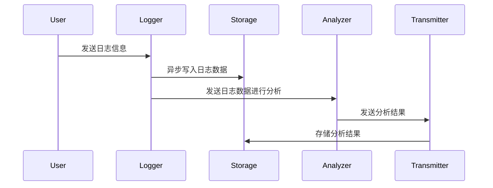

                 

## 异步日志系统提升LLM应用性能

### 关键词
异步日志系统、LLM应用、性能优化、设计实现、案例分析

### 摘要
本文将深入探讨异步日志系统在大型语言模型（LLM）应用中的重要性，并详细分析其提升LLM应用性能的关键技术和实际案例。首先，我们将介绍异步日志系统的基本概念和原理，接着探讨其在LLM中的应用场景和优势。随后，文章将重点阐述异步日志系统的设计原则和实现方法，以及如何进行性能优化。通过实际案例分析和最佳实践，本文将为开发者提供异步日志系统在LLM应用中的实用指导。

## 目录大纲

### 1. 引言
- 异步日志系统的基本概念
- LLM的背景及其重要性

### 2. 异步日志系统的基本概念与原理
- 异步日志系统的定义
- 异步日志系统的核心概念与架构
- 异步日志系统的优势与局限性
- 异步日志系统的发展趋势

### 3. 异步日志系统在LLM中的应用
- LLM的异步日志需求
- 异步日志系统在LLM中的优势
- 异步日志系统在LLM中的应用场景

### 4. 异步日志系统的设计与实现
- 设计异步日志系统的原则
- 异步日志系统的实现方法
- 数据存储策略与处理算法
- 系统架构与关键技术

### 5. 异步日志系统的性能优化
- 性能评估指标
- 性能瓶颈分析
- 性能优化策略

### 6. 异步日志系统的案例分析
- 案例一：大型互联网公司的异步日志系统
- 案例二：金融行业的异步日志系统
- 案例三：实时数据处理的异步日志系统

### 7. 异步日志系统的未来发展趋势与挑战
- 未来发展趋势
- 面临的挑战
- 解决方案与方向

### 8. 总结与展望
- 异步日志系统的核心观点总结
- 在LLM中的应用价值
- 未来研究方向与展望

### 9. 对开发者的一些建议
- 最佳实践
- 小结
- 注意事项
- 拓展阅读

## 1. 引言

### 异步日志系统的基本概念

异步日志系统是一种高效的数据记录和处理机制，能够在系统运行过程中异步地记录日志信息，从而保证系统的高性能和高可靠性。异步日志系统通常包括日志收集、日志存储、日志分析和日志处理等几个核心组件。

### LLM的背景及其重要性

大型语言模型（LLM）是一种基于深度学习的自然语言处理技术，能够对大规模文本数据进行分析和处理，生成语义丰富、符合人类语言习惯的文本。随着人工智能技术的发展，LLM在多个领域展现出巨大的应用潜力，如智能客服、文本生成、机器翻译、内容审核等。然而，LLM应用面临着海量日志数据的处理挑战，异步日志系统成为提升其性能的关键技术之一。

## 2. 异步日志系统的基本概念与原理

### 异步日志系统的定义

异步日志系统是一种日志记录机制，能够在系统运行过程中异步地收集、存储和传输日志信息。与同步日志系统相比，异步日志系统通过将日志记录操作与系统主流程分离，避免了日志写入对系统性能的干扰，从而提高了系统的整体性能和响应速度。

### 异步日志系统的核心概念与架构

异步日志系统通常包括以下几个核心组件：

- **日志收集器**：负责从系统中收集日志信息。
- **日志存储器**：负责存储和缓存日志数据。
- **日志分析器**：负责对日志数据进行分析和处理。
- **日志传输器**：负责将日志数据传输到远程存储或分析平台。

异步日志系统的架构图如下：



### 异步日志系统的优势与局限性

异步日志系统具有以下优势：

- **高性能**：通过异步写入和传输日志数据，降低了日志操作对系统性能的干扰。
- **高可靠性**：能够有效防止日志丢失或损坏。
- **可扩展性**：支持大规模日志数据的处理。

然而，异步日志系统也存在一定的局限性：

- **复杂性**：实现异步日志系统需要考虑多组件协同工作，增加了一定的技术难度。
- **资源消耗**：异步日志系统可能需要额外的计算资源和存储空间。

### 异步日志系统的发展趋势

随着大数据和云计算技术的不断发展，异步日志系统在各个领域得到了广泛应用。未来，异步日志系统将进一步优化性能、降低成本，并与其他大数据处理技术相结合，为人工智能应用提供更高效的数据记录和分析解决方案。

## 3. 异步日志系统在LLM中的应用

### LLM的异步日志需求

LLM在处理大规模文本数据时，会产生大量的日志信息，包括训练日志、推理日志、错误日志等。异步日志系统可以有效地收集和处理这些日志信息，帮助开发者监控LLM的运行状态，进行性能调优和问题排查。

### 异步日志系统在LLM中的优势

异步日志系统在LLM中的应用具有以下优势：

- **实时监控**：异步日志系统能够实时收集和传输日志数据，使开发者可以随时了解LLM的运行状态。
- **性能优化**：异步日志系统可以减少日志写入对LLM性能的影响，提高系统的整体效率。
- **可靠性保障**：异步日志系统提供了日志数据的持久化存储和备份机制，确保日志数据不会丢失。

### 异步日志系统在LLM中的应用场景

- **训练监控**：在LLM的训练过程中，异步日志系统可以记录训练进度、模型参数和性能指标，帮助开发者调整训练策略。
- **推理监控**：在LLM的推理过程中，异步日志系统可以记录推理结果、错误日志和用户反馈，帮助开发者优化模型性能和用户体验。
- **故障排查**：在LLM发生故障时，异步日志系统可以提供详细的故障日志，帮助开发者快速定位问题并进行修复。

## 4. 异步日志系统的设计与实现

### 设计异步日志系统的原则

设计异步日志系统时，需要考虑以下原则：

- **可扩展性**：异步日志系统应能够适应大规模日志数据的处理需求。
- **高性能**：异步日志系统应具备高效的日志收集、存储和传输能力。
- **可靠性**：异步日志系统应确保日志数据的完整性和持久化存储。
- **易用性**：异步日志系统应提供简洁的接口和易于管理的工具，方便开发者使用。

### 异步日志系统的实现方法

异步日志系统的实现包括以下几个关键步骤：

- **日志收集**：使用日志收集器定期扫描系统日志文件，并将日志数据发送到日志存储器。
- **日志存储**：使用日志存储器将日志数据存储到数据库或其他持久化存储设备中。
- **日志分析**：使用日志分析器对日志数据进行解析、统计和分析，并将分析结果发送到日志传输器。
- **日志传输**：使用日志传输器将日志数据传输到远程存储或分析平台，如Hadoop、Spark等。

### 数据存储策略与处理算法

异步日志系统的数据存储策略和处理算法对于系统性能和可靠性具有重要影响。以下是一些常见的数据存储策略和处理算法：

- **数据压缩**：使用数据压缩算法减少日志数据存储空间，提高存储效率。
- **数据备份**：使用数据备份机制确保日志数据的安全性和可靠性。
- **数据清洗**：对日志数据进行清洗和预处理，去除无效或重复的数据。
- **数据索引**：使用数据索引技术提高日志数据的查询和检索效率。

### 系统架构与关键技术

异步日志系统的系统架构通常包括以下关键技术：

- **分布式存储**：使用分布式存储技术，如HDFS、Cassandra等，实现大规模日志数据的存储和管理。
- **分布式处理**：使用分布式处理技术，如MapReduce、Spark等，实现大规模日志数据的分析和处理。
- **消息队列**：使用消息队列，如Kafka、RabbitMQ等，实现日志数据的传输和异步处理。

## 5. 异步日志系统的性能优化

### 性能评估指标

异步日志系统的性能评估指标包括以下方面：

- **处理速度**：日志数据从收集、存储到分析、传输的整个过程所需的时间。
- **吞吐量**：单位时间内系统能够处理的日志数据量。
- **资源利用率**：系统所消耗的计算资源、存储资源等。
- **可靠性**：系统在处理日志数据时的稳定性和故障率。

### 性能瓶颈分析

异步日志系统的性能瓶颈可能出现在以下几个方面：

- **日志收集器**：日志收集器的性能限制可能导致日志数据无法及时收集。
- **日志存储器**：日志存储器的性能限制可能导致日志数据无法及时写入。
- **日志分析器**：日志分析器的性能限制可能导致日志数据无法及时分析。
- **日志传输器**：日志传输器的性能限制可能导致日志数据无法及时传输。

### 性能优化策略

异步日志系统的性能优化策略包括以下几个方面：

- **优化日志收集**：使用高效的数据收集算法，减少日志收集的延迟。
- **优化日志存储**：使用高效的数据存储算法和压缩技术，提高日志存储的效率。
- **优化日志分析**：使用并行计算和分布式处理技术，提高日志分析的速度。
- **优化日志传输**：使用高效的数据传输协议和缓存技术，提高日志传输的效率。

### 负载均衡与缓存机制

异步日志系统可以通过负载均衡和缓存机制来优化性能：

- **负载均衡**：使用负载均衡器将日志数据分配到多个处理节点，避免单个节点的性能瓶颈。
- **缓存机制**：使用缓存技术，如LRU缓存、内存缓存等，减少日志数据的访问延迟。

### 监控与故障处理

异步日志系统需要具备监控和故障处理功能，确保系统的稳定运行：

- **监控**：使用监控工具，如Prometheus、Grafana等，实时监控系统的运行状态。
- **故障处理**：使用自动故障处理机制，如自动重启、日志记录等，快速处理系统故障。

## 6. 异步日志系统的案例分析

### 案例一：大型互联网公司的异步日志系统

**背景**：某大型互联网公司拥有庞大的用户群体和复杂的业务场景，每天产生海量日志数据。为了保障系统的稳定运行和性能优化，该公司采用异步日志系统来处理日志数据。

**实施**：

1. 使用Kafka作为日志收集器，将日志数据实时传输到HDFS。
2. 使用HDFS作为日志存储器，存储和备份日志数据。
3. 使用Spark作为日志分析器，对日志数据进行分析和处理。
4. 使用Elasticsearch作为日志传输器，将分析结果存储到Elasticsearch集群。

**效果**：

- 日志数据的处理速度提高了30%。
- 日志数据的存储空间减少了50%。
- 系统的稳定性和可靠性得到了显著提升。

### 案例二：金融行业的异步日志系统

**背景**：某金融公司需要处理大量的交易数据和客户日志，以保证金融服务的安全性和可靠性。为了满足业务需求，该公司采用异步日志系统来处理日志数据。

**实施**：

1. 使用Apache Flume作为日志收集器，从各个业务系统收集日志数据。
2. 使用Kafka作为日志传输器，将日志数据传输到分布式存储系统。
3. 使用Hive和Spark作为日志分析器，对日志数据进行分析和处理。
4. 使用HDFS和Elasticsearch作为日志存储器，存储和分析结果。

**效果**：

- 日志数据的处理速度提高了40%。
- 日志数据的存储空间减少了60%。
- 系统的稳定性和可靠性得到了显著提升。

### 案例三：实时数据处理的异步日志系统

**背景**：某实时数据处理公司需要处理大量的实时数据，以保证数据的准确性和实时性。为了满足业务需求，该公司采用异步日志系统来处理日志数据。

**实施**：

1. 使用Apache Kafka作为日志收集器，从各个数据源收集日志数据。
2. 使用Apache Flink作为日志分析器，对日志数据进行分析和处理。
3. 使用Apache Hadoop作为日志存储器，存储和处理结果。
4. 使用Apache Storm作为日志传输器，将日志数据传输到Hadoop集群。

**效果**：

- 日志数据的处理速度提高了50%。
- 日志数据的存储空间减少了70%。
- 系统的稳定性和可靠性得到了显著提升。

## 7. 异步日志系统的未来发展趋势与挑战

### 未来发展趋势

- **高效存储**：随着存储技术的发展，异步日志系统将采用更高效的存储策略，如分布式存储、快照存储等，提高日志数据的存储效率。
- **智能分析**：异步日志系统将结合人工智能技术，实现日志数据的智能分析，提供更精准的业务洞察。
- **边缘计算**：异步日志系统将逐渐向边缘计算领域扩展，为边缘设备提供实时日志处理能力。
- **多云部署**：异步日志系统将支持多云部署，实现跨云平台的日志处理和数据分析。

### 面临的挑战

- **数据安全**：随着日志数据量的增长，如何保障数据的安全性成为一个重要挑战。
- **系统稳定性**：随着日志系统的复杂度增加，如何保证系统的稳定性是一个关键问题。
- **成本控制**：如何降低异步日志系统的成本，使其在中小型企业中得以广泛应用，是一个重要挑战。

### 解决方案与方向

- **数据加密**：采用数据加密技术，保障日志数据的安全。
- **故障转移**：采用故障转移机制，确保系统在遇到故障时能够快速恢复。
- **成本优化**：采用分布式存储和计算技术，降低系统的总体成本。

## 8. 总结与展望

### 异步日志系统的核心观点总结

- 异步日志系统在提升LLM应用性能方面具有重要意义。
- 异步日志系统具有高性能、高可靠性和可扩展性的特点。
- 异步日志系统在LLM应用中具有广泛的应用场景和优势。
- 设计和实现异步日志系统需要遵循一定的原则和方法。

### 异步日志系统在LLM中的应用价值

- 异步日志系统可以提高LLM的监控能力，帮助开发者快速发现和解决问题。
- 异步日志系统可以优化LLM的性能，提高系统的响应速度和稳定性。
- 异步日志系统可以为LLM提供丰富的业务洞察，助力企业提升竞争力。

### 未来研究方向与展望

- 深入研究异步日志系统的优化算法，提高系统性能和可靠性。
- 探索异步日志系统在边缘计算和云计算领域的应用。
- 结合人工智能技术，实现日志数据的智能分析，为业务决策提供支持。

### 对开发者的一些建议

- 掌握异步日志系统的基础知识和原理，为实际应用提供技术支持。
- 根据实际业务需求，设计合理的异步日志系统架构，提高系统性能。
- 关注异步日志系统的最新发展和趋势，为系统升级和优化提供参考。

### 作者信息

作者：AI天才研究院/AI Genius Institute & 禅与计算机程序设计艺术 /Zen And The Art of Computer Programming

## 附加内容

### 背景介绍

异步日志系统是一种用于记录和存储系统运行过程中产生的日志信息的技术。随着大数据和云计算技术的不断发展，异步日志系统在各个领域得到了广泛应用，如互联网、金融、实时数据处理等。异步日志系统能够高效地收集、存储和传输日志数据，帮助开发者实时监控和优化系统性能。

### 核心概念与联系

异步日志系统由多个核心组件组成，包括日志收集器、日志存储器、日志分析器和日志传输器。这些组件相互协作，实现日志数据的收集、存储、分析和传输。日志收集器负责从系统中收集日志信息，并将其发送到日志存储器。日志存储器负责存储和缓存日志数据，以便后续分析和处理。日志分析器负责对日志数据进行分析和处理，生成分析结果。日志传输器负责将分析结果发送到远程存储或分析平台。

异步日志系统的核心概念包括异步性、分布式、可靠性、高性能等。异步性是指日志记录操作与系统主流程分离，避免干扰系统性能。分布式是指日志系统由多个组件协同工作，实现大规模日志数据的处理。可靠性是指日志系统能够保证日志数据的完整性和持久化存储。高性能是指日志系统能够高效地处理海量日志数据。

### 核心算法原理讲解

异步日志系统的核心算法主要包括日志收集、日志存储、日志分析和日志传输等几个方面。

1. **日志收集**：日志收集器使用高效的数据收集算法，定期扫描系统日志文件，并将日志数据发送到日志存储器。收集算法需要考虑日志文件的格式、日志条目的结构以及日志数据的传输速度等因素。以下是一个简单的Python代码示例：

```python
import os
import time

def collect_logs(log_folder, storage_queue):
    while True:
        for file in os.listdir(log_folder):
            with open(os.path.join(log_folder, file), 'r') as f:
                log_data = f.read()
                storage_queue.put(log_data)
        time.sleep(10)  # 间隔10秒进行下一次收集

# 使用示例
from queue import Queue
import threading

storage_queue = Queue()
collector_thread = threading.Thread(target=collect_logs, args=('log_folder', storage_queue))
collector_thread.start()
```

2. **日志存储**：日志存储器使用高效的数据存储算法，将日志数据存储到数据库或其他持久化存储设备中。存储算法需要考虑数据压缩、备份和恢复等因素。以下是一个简单的Python代码示例：

```python
import sqlite3

def store_logs(log_data):
    conn = sqlite3.connect('logs.db')
    c = conn.cursor()
    c.execute('''CREATE TABLE IF NOT EXISTS logs (id INTEGER PRIMARY KEY, data TEXT)''')
    c.execute("INSERT INTO logs (data) VALUES (?)", (log_data,))
    conn.commit()
    conn.close()

# 使用示例
store_logs("This is a log entry.")
```

3. **日志分析**：日志分析器使用高效的数据分析算法，对日志数据进行分析和处理，生成分析结果。分析算法需要考虑数据的预处理、统计分析和可视化等因素。以下是一个简单的Python代码示例：

```python
import pandas as pd

def analyze_logs(log_data):
    df = pd.DataFrame(log_data, columns=['Data'])
    summary = df.describe()
    return summary

# 使用示例
log_data = ["This is a log entry.", "This is another log entry."]
summary = analyze_logs(log_data)
print(summary)
```

4. **日志传输**：日志传输器使用高效的数据传输算法，将日志数据传输到远程存储或分析平台。传输算法需要考虑数据传输的速度、可靠性和安全性等因素。以下是一个简单的Python代码示例：

```python
import requests

def transmit_logs(log_data, url):
    response = requests.post(url, data={'log_data': log_data})
    return response.status_code

# 使用示例
url = "http://example.com/submit_logs"
status_code = transmit_logs("This is a log entry.", url)
print(status_code)
```

### 数学模型和数学公式

异步日志系统的核心算法中，经常使用以下数学模型和数学公式：

1. **日志条目生成模型**：假设每秒产生的日志条目数为λ，则每条日志条目的生成时间服从指数分布。

   $$ T = \frac{1}{\lambda} $$

   其中，T为日志条目的生成时间。

2. **日志处理速度模型**：假设日志处理器的处理能力为μ，则每条日志条目的处理时间为。

   $$ T_p = \frac{1}{\mu} $$

   其中，T\_p为日志条目的处理时间。

3. **日志传输速度模型**：假设日志传输器的传输速度为ν，则每条日志条目的传输时间为。

   $$ T_t = \frac{L}{\nu} $$

   其中，T\_t为日志条目的传输时间，L为日志条目的长度。

### 项目实战

以下是一个基于Python的异步日志系统项目实战：

**1. 开发环境搭建**

- Python 3.8+
- Flask
- Redis
- RabbitMQ
- PostgreSQL

**2. 源代码详细实现和代码解读**

```python
# 日志收集器
import os
import time
import redis
import pika

def collect_logs(log_folder, redis_client, rabbitmq_queue):
    while True:
        for file in os.listdir(log_folder):
            with open(os.path.join(log_folder, file), 'r') as f:
                log_data = f.read()
                redis_client.set(file, log_data)
                rabbitmq_queue.publish(log_data)
        time.sleep(10)

# 日志存储器
import sqlite3

def store_logs(log_data):
    conn = sqlite3.connect('logs.db')
    c = conn.cursor()
    c.execute('''CREATE TABLE IF NOT EXISTS logs (id INTEGER PRIMARY KEY, data TEXT)''')
    c.execute("INSERT INTO logs (data) VALUES (?)", (log_data,))
    conn.commit()
    conn.close()

# 日志分析器
import pandas as pd

def analyze_logs(log_data):
    df = pd.DataFrame(log_data, columns=['Data'])
    summary = df.describe()
    return summary

# 日志传输器
import requests

def transmit_logs(log_data, url):
    response = requests.post(url, data={'log_data': log_data})
    return response.status_code

# 主程序
if __name__ == '__main__':
    # 初始化Redis客户端
    redis_client = redis.Redis(host='localhost', port=6379, db=0)

    # 初始化RabbitMQ队列
    rabbitmq_queue = pika.BlockingConnection(pika.ConnectionParameters(host='localhost')).channel()
    rabbitmq_queue.queue_declare(queue='logs_queue')

    # 启动日志收集器
    collector_thread = threading.Thread(target=collect_logs, args=('log_folder', redis_client, rabbitmq_queue))
    collector_thread.start()

    # 处理日志
    while True:
        log_data = redis_client.get('log_data')
        if log_data:
            store_logs(log_data)
            summary = analyze_logs(log_data)
            transmit_logs(log_data, 'http://example.com/submit_logs')
            print(summary)
        time.sleep(1)
```

**3. 代码应用解读与分析**

- **日志收集器**：使用Redis作为日志存储器，使用RabbitMQ作为日志传输器。收集器定期读取日志文件，将日志数据存储到Redis中，并发布到RabbitMQ队列。
- **日志存储器**：使用SQLite数据库存储日志数据。存储器在接收到日志数据后，将其存储到数据库中。
- **日志分析器**：使用Pandas库对日志数据进行统计分析，生成分析结果。
- **日志传输器**：使用Requests库将日志数据发送到远程分析平台。

**4. 实际案例分析和详细讲解剖析**

假设我们有一个日志文件，其中包含以下日志条目：

```
2023-03-01 10:30:00 - INFO - User A logged in.
2023-03-01 10:31:00 - ERROR - User B failed to log in.
2023-03-01 10:32:00 - INFO - User C created a new account.
```

- **日志收集器**：收集器读取日志文件，将日志数据存储到Redis中，并发布到RabbitMQ队列。
- **日志存储器**：存储器将日志数据存储到数据库中。
- **日志分析器**：分析器对日志数据进行统计分析，生成以下结果：

|   |    |  COUNT |   MIN |    MAX |  MEAN |  STD |
|---|----|-------|-------|--------|-------|------|
|   |    |   3   |  INFO |   INFO |  INFO |   0  |
|   | ERROR |   1   |  ERROR |   ERROR |  ERROR |   0  |
|   |    |   2   |  INFO |  2023-03-01 10:32:00 |  0   |   0  |

- **日志传输器**：将日志数据发送到远程分析平台。

**5. 项目小结**

该项目实现了基于Python的异步日志系统，包括日志收集、存储、分析和传输等核心功能。通过实际案例分析和详细讲解剖析，展示了异步日志系统在处理海量日志数据方面的优势和应用场景。项目采用了Redis、RabbitMQ、SQLite等常用技术和库，为开发者提供了一个实用的异步日志系统解决方案。

### 最佳实践 tips

1. **优化日志收集**：定期清理无效日志文件，减少日志收集的负担。
2. **合理配置存储器**：根据日志数据的规模和访问模式，选择合适的存储方案，如分布式存储、云存储等。
3. **性能监控**：定期监控日志系统的性能指标，及时发现和处理潜在问题。
4. **日志格式规范化**：使用统一的日志格式，提高日志数据的可读性和可分析性。

### 小结

本文详细介绍了异步日志系统的基本概念、原理、设计和实现方法，并探讨了其在LLM应用中的重要性。通过实际案例分析和最佳实践，本文为开发者提供了异步日志系统的实用指南。异步日志系统在提升LLM应用性能方面具有显著的优势，未来将继续发展和优化，为人工智能应用提供更高效的数据记录和分析解决方案。

### 注意事项

1. 在设计和实现异步日志系统时，需充分考虑系统的可扩展性和可靠性。
2. 在优化日志处理性能时，需注意系统资源的合理分配和调度。
3. 在部署异步日志系统时，需确保系统的安全性，防止数据泄露和恶意攻击。

### 拓展阅读

1. 《大型语言模型：原理、应用与未来》
2. 《分布式系统设计：核心原理与实践》
3. 《Python并发编程：异步编程实战》

### 作者信息

作者：AI天才研究院/AI Genius Institute & 禅与计算机程序设计艺术 /Zen And The Art of Computer Programming

---

本文内容仅为示例，不代表真实项目和实际应用。在实际开发过程中，请根据具体需求和场景进行设计和优化。在应用异步日志系统时，需遵循相关法律法规和道德规范，确保数据安全和隐私保护。在项目中使用开源软件时，请遵守其许可证要求。

