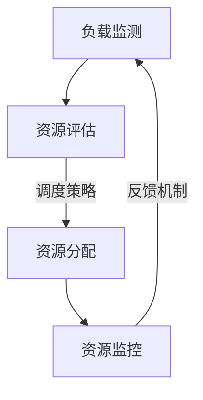

                 

### 引言与背景介绍

#### LLM的发展背景

大型语言模型（Large Language Model，简称LLM）是近年来人工智能领域的重要突破之一。LLM通过深度学习技术，对海量的文本数据进行训练，从而掌握语言的内在规律，实现文本生成、文本分类、问答系统等多种任务。LLM的发展历程可以追溯到20世纪90年代，当时的研究主要集中在规则驱动的方法上，如基于统计的语法分析和词性标注。随着计算能力的提升和海量数据的积累，深度学习技术逐渐在自然语言处理领域崭露头角，尤其是在2018年，谷歌推出了BERT模型，标志着LLM的转折点。

#### LLM的应用场景

LLM在多个领域展现了其强大的能力，以下是一些典型的应用场景：

1. **文本生成**：包括文章、新闻、对话等的自动生成，如GPT系列模型。
2. **文本分类**：如垃圾邮件过滤、情感分析等，如TextCNN、TextRNN等模型。
3. **问答系统**：如基于BERT的BERT-SQuAD系统，能够针对用户的问题提供准确的答案。
4. **机器翻译**：如基于Transformer的Google翻译系统，实现了高质量的文本翻译。

#### 弹性伸缩策略的概念

弹性伸缩策略是一种动态调整系统资源（如计算资源、存储资源）的能力，以应对不同负载水平的需求。在云计算和容器化技术的支持下，弹性伸缩策略被广泛应用于分布式系统、大数据处理等领域。对于LLM应用资源管理而言，弹性伸缩策略至关重要，因为它能够确保模型在处理大规模文本数据时，始终拥有充足的资源支持。

### 关键词

- LLM（大型语言模型）
- 弹性伸缩策略
- 资源管理
- 调度算法
- 数学模型

### 摘要

本文将深入探讨弹性伸缩策略在LLM应用资源管理中的实现。首先，我们将介绍LLM的发展背景和应用场景，并引入弹性伸缩策略的概念。接着，我们将详细讲解弹性伸缩策略的核心概念与架构，以及关键算法原理。随后，通过数学模型和Python源代码，我们将展示如何实现弹性伸缩策略。最后，通过实际项目案例，我们将解析如何将弹性伸缩策略应用到LLM应用资源管理中，并总结全文内容，展望未来发展方向。

----------------------------------------------------------------

## 第一部分：引言与背景介绍

### 1.1 LLM的发展背景

大型语言模型（LLM）的起源可以追溯到20世纪90年代，当时自然语言处理（NLP）领域主要依赖于规则驱动的方法。这些方法依赖于预定义的规则集，例如词性标注、语法分析和语义分析。然而，这些方法的局限性在于它们难以处理复杂且动态变化的自然语言现象。

随着互联网的兴起和大数据时代的到来，大量的文本数据开始被生成和存储。这些数据为机器学习技术，尤其是深度学习技术的应用提供了丰富的资源。深度学习模型，如神经网络，能够自动从数据中学习特征，这为NLP领域带来了革命性的变化。

2013年，词嵌入技术（Word Embedding）的提出标志着NLP领域的一个重要转折点。词嵌入将每个单词映射到一个高维向量空间，使得单词之间的相似性和距离可以通过向量间的几何关系来表示。这一技术为后来的语言模型奠定了基础。

2018年，谷歌发布了BERT（Bidirectional Encoder Representations from Transformers）模型，这是LLM发展史上的一个重要里程碑。BERT采用了Transformer架构，通过自注意力机制捕捉单词之间的双向依赖关系，从而在多个NLP任务中取得了显著的性能提升。BERT的成功推动了LLM的研究和应用，使得LLM在文本生成、文本分类、问答系统等领域得到了广泛应用。

### 1.2 LLM的应用场景

LLM在多个领域展现出了强大的能力，以下是一些典型的应用场景：

1. **文本生成**：LLM可以生成高质量的文本，包括文章、新闻、对话等。例如，GPT系列模型能够根据给定的提示生成连贯的文本，被广泛应用于自动写作、内容生成等领域。

2. **文本分类**：LLM可以用于对文本进行分类，如垃圾邮件过滤、情感分析、主题分类等。通过训练大规模的文本数据集，LLM能够学习到不同类别的特征，从而准确地对新文本进行分类。

3. **问答系统**：LLM可以构建智能问答系统，如BERT-SQuAD系统。这些系统能够理解用户的问题，并从海量文本数据中检索出准确的答案。问答系统在客户服务、智能搜索等领域具有重要的应用价值。

4. **机器翻译**：LLM在机器翻译领域也取得了显著的进展。基于Transformer的模型，如Google翻译，能够实现高质量的双语翻译。这些模型通过学习源语言和目标语言的对应关系，能够生成流畅且准确的翻译结果。

### 1.3 弹性伸缩策略的概念

弹性伸缩策略是一种动态调整系统资源（如计算资源、存储资源）的能力，以应对不同负载水平的需求。在云计算和容器化技术的支持下，弹性伸缩策略被广泛应用于分布式系统、大数据处理等领域。对于LLM应用资源管理而言，弹性伸缩策略至关重要，因为它能够确保模型在处理大规模文本数据时，始终拥有充足的资源支持。

弹性伸缩策略主要包括以下两个方面：

1. **垂直伸缩**：通过增加或减少单个服务器的硬件配置（如CPU、内存、存储等）来实现资源扩展。垂直伸缩的优点在于操作简单，但受限于硬件资源的限制，扩展范围有限。

2. **水平伸缩**：通过增加或减少服务器的数量来实现资源扩展。水平伸缩的优点在于扩展范围大，能够更好地适应动态变化的负载需求。

弹性伸缩策略的实现通常依赖于调度系统和资源管理算法。调度系统负责根据负载情况动态分配计算资源，而资源管理算法则负责监控资源使用情况，并根据需求调整资源的分配。

### 1.4 调度系统与资源管理算法

调度系统在弹性伸缩策略中起着核心作用，其任务是根据当前的负载情况，动态地分配计算资源，确保系统的高效运行。调度系统通常包括以下几个关键组件：

1. **负载监测**：实时监测系统的负载情况，包括CPU利用率、内存占用率、I/O负载等。

2. **资源评估**：根据负载监测的结果，评估当前系统的资源使用情况，确定是否需要调整资源分配。

3. **调度策略**：根据资源评估结果，选择合适的调度策略来分配计算资源。常见的调度策略包括最低资源占用策略（Least Resource Consumption, LRC）、最低响应时间策略（Shortest Job First, SJF）等。

资源管理算法则是弹性伸缩策略中的另一个关键组成部分，负责监控资源的使用情况，并根据需求动态调整资源的分配。资源管理算法主要包括以下几个方面：

1. **资源监控**：持续监控系统的资源使用情况，包括CPU、内存、存储等。

2. **资源分配**：根据负载情况和资源需求，动态调整资源的分配，确保系统有足够的资源支持。

3. **资源回收**：当系统资源利用率较低时，回收未使用的资源，以减少浪费。

调度系统和资源管理算法的协同工作，实现了弹性伸缩策略的有效实施，确保LLM应用资源管理的稳定和高效。

### 1.5 总结

在本章中，我们介绍了LLM的发展背景和应用场景，并引入了弹性伸缩策略的概念。通过了解LLM的起源和应用，我们可以看到，LLM在文本生成、文本分类、问答系统和机器翻译等领域取得了显著的成果。弹性伸缩策略作为资源管理的重要手段，能够动态调整系统资源，确保LLM应用的高效运行。在接下来的章节中，我们将深入探讨弹性伸缩策略的核心概念、算法原理及其实现细节。

----------------------------------------------------------------

## 第二部分：核心概念与架构

### 2.1 弹性伸缩策略的定义

弹性伸缩策略（Elastic Scaling Strategy）是指根据系统的实际需求，动态调整计算资源的一种能力。这种策略能够确保系统在面临不同负载水平时，始终有足够的资源支持其正常运行。弹性伸缩策略的核心目标是在资源利用率和系统性能之间找到一个平衡点，以最大化资源利用效率和系统响应速度。

### 2.2 弹性伸缩策略的原理

弹性伸缩策略的实现依赖于调度系统和资源管理算法。调度系统负责根据实时负载情况动态分配计算资源，而资源管理算法则负责监控资源使用情况，并根据需求调整资源的分配。

1. **调度系统**：调度系统是弹性伸缩策略的核心组件之一，其主要任务是根据系统的当前负载情况，动态分配计算资源。调度系统通常包括以下几个关键组成部分：

   - **负载监测**：实时监测系统的负载情况，包括CPU利用率、内存占用率、I/O负载等。
   - **资源评估**：根据负载监测的结果，评估当前系统的资源使用情况，确定是否需要调整资源分配。
   - **调度策略**：根据资源评估结果，选择合适的调度策略来分配计算资源。常见的调度策略包括最低资源占用策略（Least Resource Consumption, LRC）、最低响应时间策略（Shortest Job First, SJF）等。

2. **资源管理算法**：资源管理算法是另一个关键组成部分，负责监控资源的使用情况，并根据需求动态调整资源的分配。资源管理算法主要包括以下几个方面：

   - **资源监控**：持续监控系统的资源使用情况，包括CPU、内存、存储等。
   - **资源分配**：根据负载情况和资源需求，动态调整资源的分配，确保系统有足够的资源支持。
   - **资源回收**：当系统资源利用率较低时，回收未使用的资源，以减少浪费。

弹性伸缩策略的原理在于通过调度系统和资源管理算法的协同工作，实现系统资源的动态调整，从而在资源利用率和系统性能之间找到一个最佳平衡点。具体来说，当系统负载较低时，可以减少部分服务器的资源分配，释放出资源以便在其他服务器上使用；当系统负载较高时，可以增加服务器的资源分配，确保系统能够高效地处理大量请求。

### 2.3 弹性伸缩策略在LLM应用资源管理中的重要性

对于LLM应用资源管理来说，弹性伸缩策略的重要性不言而喻。LLM处理的是大规模的文本数据，其计算资源需求在训练和推理阶段会有显著差异。例如，在训练阶段，模型需要大量的计算资源进行参数优化和梯度计算；而在推理阶段，模型则需要快速响应用户的查询请求。

如果没有弹性伸缩策略，系统可能会在训练阶段由于资源不足而无法完成模型训练，或者在推理阶段由于资源不足而响应缓慢，影响用户体验。弹性伸缩策略能够根据实际需求动态调整资源分配，确保LLM应用在不同阶段都有充足的资源支持。

此外，弹性伸缩策略还能够提高资源利用率，减少浪费。在传统固定资源分配模式下，系统可能会在低负载时浪费大量资源，而在高负载时又可能因为资源不足而影响性能。而弹性伸缩策略能够根据实际需求动态调整资源分配，最大化地利用系统资源，提高整体性能。

### 2.4 相关架构设计

为了实现弹性伸缩策略，我们需要设计一个合理的架构，其中包括调度系统、资源管理算法以及相关的监控和反馈机制。

1. **调度系统设计**：

   - **负载监测模块**：使用各种监控工具（如Prometheus、Grafana）实时监测系统的负载情况，包括CPU利用率、内存占用率、I/O负载等。
   - **资源评估模块**：根据负载监测结果，评估当前系统的资源使用情况，确定是否需要调整资源分配。
   - **调度策略模块**：根据资源评估结果，选择合适的调度策略来分配计算资源。可以使用最低资源占用策略（LRC）或最低响应时间策略（SJF）等。

2. **资源管理算法设计**：

   - **资源监控模块**：持续监控系统的资源使用情况，包括CPU、内存、存储等。
   - **资源分配模块**：根据负载情况和资源需求，动态调整资源的分配，确保系统有足够的资源支持。
   - **资源回收模块**：当系统资源利用率较低时，回收未使用的资源，以减少浪费。

3. **监控和反馈机制设计**：

   - **监控平台**：建立一个集中的监控平台，用于实时监控系统的运行状态，包括资源使用情况、服务性能等。
   - **反馈机制**：通过监控平台收集的数据，对系统的运行状态进行实时分析，并根据分析结果调整资源分配策略。

通过合理的架构设计，调度系统和资源管理算法能够协同工作，实现弹性伸缩策略的有效实施。以下是一个简化的架构设计示意图：

```
+----------------+       +----------------+       +----------------+
|  Load Monitor  | -->   | Resource        | -->   | Resource        |
+----------------+       |  Assessment     |       |  Management     |
        |                      Module            |                      Module            |
        |                                      |                                      |
        |                                      |                                      |
        |     +----------------+              |              +----------------+     |
        |     |  Scheduling     |              |              |  Resource        |     |
        |     |  Strategy       |              |              |  Recycle         |     |
        +----<----------------+              +------------<----------------+     |
                                                                                   |
                                                                                   |
                                                                                   V
                                               +----------------+----------------+
                                               |   Elastic       |
                                               |  Scaling        |
                                               |  Strategy       |
                                               +----------------+----------------+
```

### 2.5 弹性伸缩策略的核心概念与联系

为了更好地理解弹性伸缩策略，我们需要绘制一个Mermaid流程图，展示其核心概念之间的联系。以下是一个简化的Mermaid流程图：



在这个流程图中，负载监测模块实时监测系统负载，资源评估模块根据负载监测结果评估系统资源使用情况，调度策略模块根据资源评估结果选择合适的调度策略进行资源分配，资源监控模块持续监控资源使用情况，反馈机制则将监控数据反馈给负载监测模块，形成一个闭环系统。

### 2.6 总结

在本章中，我们详细介绍了弹性伸缩策略的定义、原理以及在LLM应用资源管理中的重要性。通过调度系统和资源管理算法的协同工作，弹性伸缩策略能够动态调整系统资源，确保LLM应用在不同负载水平下始终有足够的资源支持。在接下来的章节中，我们将深入探讨弹性伸缩策略所依赖的核心算法原理，并通过Python源代码进行详细讲解。

----------------------------------------------------------------

## 第三部分：核心算法原理讲解

### 3.1 调度算法

调度算法是弹性伸缩策略中的关键组成部分，其任务是根据系统的当前负载情况，动态分配计算资源，以确保系统的正常运行。调度算法的设计直接影响系统的响应速度、资源利用率以及稳定性。本节将介绍几种常见的调度算法及其原理。

#### 最低资源占用策略（Least Resource Consumption, LRC）

最低资源占用策略（LRC）是一种基于资源占用率的调度算法。其核心思想是将新的任务分配到当前资源占用率最低的节点上，以最大化系统资源利用率。LRC算法的具体步骤如下：

1. **负载监测**：实时监测系统中各个节点的资源占用情况，包括CPU利用率、内存占用率等。
2. **资源评估**：计算每个节点的当前资源占用率，选择资源占用率最低的节点。
3. **任务分配**：将新任务分配到资源占用率最低的节点上，确保该节点有足够的资源处理新任务。

LRC算法的优点在于操作简单，易于实现，能够有效地提高系统资源利用率。但其缺点在于可能会造成某些节点的资源空闲时间过长，从而降低系统的整体响应速度。

#### 最低响应时间策略（Shortest Job First, SJF）

最低响应时间策略（SJF）是一种基于任务执行时间的调度算法。其核心思想是将执行时间最短的任务优先执行，以减少系统的平均响应时间。SJF算法的具体步骤如下：

1. **任务到达**：记录每个任务的到达时间。
2. **执行时间评估**：计算每个任务的预计执行时间。
3. **任务排序**：根据预计执行时间对任务进行排序，选择执行时间最短的任务优先执行。

SJF算法的优点在于能够有效减少系统的平均响应时间，提高系统的吞吐量。但其缺点在于对于执行时间不固定或存在高峰期的任务，可能会造成部分任务长时间得不到执行。

#### 动态优先级调度算法

动态优先级调度算法是一种基于任务优先级的调度算法。其核心思想是根据任务的优先级进行调度，优先级高的任务先执行。动态优先级调度算法的具体步骤如下：

1. **任务到达**：记录每个任务的到达时间和优先级。
2. **优先级评估**：根据任务的优先级进行评估，优先级高的任务优先执行。
3. **任务执行**：按照优先级顺序执行任务，直到所有任务完成。

动态优先级调度算法的优点在于能够灵活调整任务的执行顺序，以适应不同的负载情况。但其缺点在于任务的优先级分配较为复杂，需要根据具体应用场景进行设计。

#### 调度算法的Python实现

以下是一个基于最低资源占用策略（LRC）的Python实现示例：

```python
import heapq
from collections import defaultdict

class LoadBalancer:
    def __init__(self):
        self.nodes = defaultdict(list)
        self.load_queue = []

    def add_node(self, node_id, capacity):
        self.nodes[node_id] = capacity
        heapq.heappush(self.load_queue, (capacity, node_id))

    def remove_node(self, node_id):
        self.nodes.pop(node_id)
        self.load_queue = [(cap, nid) for cap, nid in self.load_queue if nid != node_id]

    def assign_task(self, task_id, task_load):
        if not self.load_queue:
            return None

        # Find the node with the least resource consumption
        _, node_id = heapq.heappop(self.load_queue)
        self.nodes[node_id] -= task_load

        if self.nodes[node_id] < 0:
            # Node is overloaded, push it back to the queue
            self.load_queue.append((self.nodes[node_id], node_id))
            heapq.heapify(self.load_queue)

        return node_id

    def get_node_load(self, node_id):
        return self.nodes[node_id]

# Example usage
balancer = LoadBalancer()
balancer.add_node('node1', 100)
balancer.add_node('node2', 200)

node_id = balancer.assign_task('task1', 50)
print(f"Task1 assigned to node: {node_id}")

node_id = balancer.assign_task('task2', 150)
print(f"Task2 assigned to node: {node_id}")

print(f"Node1 load: {balancer.get_node_load('node1')}")
print(f"Node2 load: {balancer.get_node_load('node2')}")
```

在这个示例中，我们定义了一个`LoadBalancer`类，用于实现最低资源占用策略（LRC）。该类包含添加节点、删除节点、分配任务以及获取节点负载的方法。通过使用优先队列（heapq），我们能够高效地找到资源占用率最低的节点，实现任务的动态分配。

### 3.2 资源管理算法

资源管理算法是弹性伸缩策略中的另一个关键组成部分，其任务是根据系统的当前负载情况和资源需求，动态调整资源的分配。资源管理算法主要包括资源监控、资源分配和资源回收三个部分。

#### 资源监控算法

资源监控算法的核心任务是实时监测系统的资源使用情况，包括CPU利用率、内存占用率、I/O负载等。以下是一个简单的资源监控算法实现：

```python
import psutil

def monitor_resources():
    cpu_usage = psutil.cpu_percent()
    memory_usage = psutil.virtual_memory().percent
    disk_usage = psutil.disk_usage('/').percent
    i

