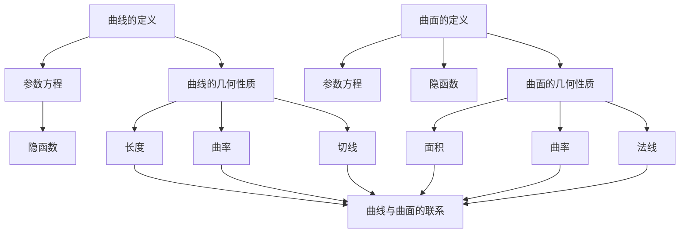
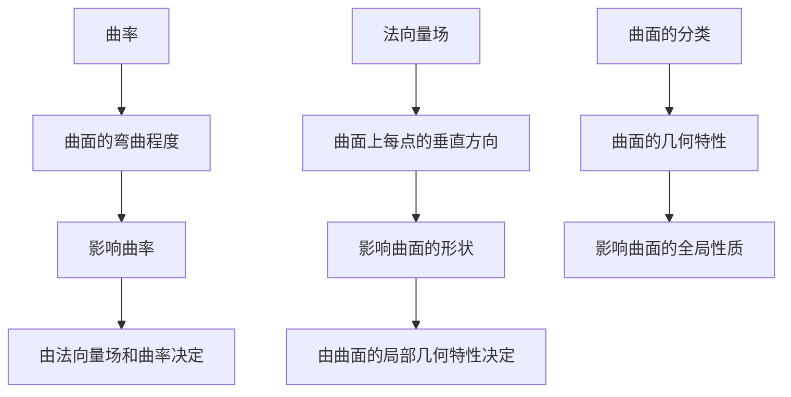

                 

### 关键词

- 微分几何
- 自然曲面
- 数学研究
- 曲面建模
- 微分方程
- 几何结构
- 曲率
- 有限元分析
- 图形渲染
- 计算机视觉
- 物理学应用

### 摘要

本文深入探讨了微分几何在自然曲面研究中的应用，从基础概念到高级理论逐步展开。通过详细解析曲面上的微分运算、几何结构及其物理应用，本文不仅揭示了微分几何的核心原理，还展示了其在计算机图形学、计算机视觉以及物理学等多个领域的重要性。文章通过Python源代码和Mermaid流程图，结合数学公式和实际案例，帮助读者更好地理解微分几何的理论与实践，为相关领域的研究者和开发者提供了宝贵的参考。文章分为以下几个部分：背景介绍、基础概念、微分运算、几何结构、应用案例和总结展望，力求全面而深入地揭示微分几何之美。### 引言

微分几何是数学中的一个重要分支，它主要研究的是曲线和曲面的性质，这些性质通过微分方程和几何结构来表达。微分几何不仅在纯数学领域具有深远的影响，而且它在实际应用中也有着广泛的用途，尤其是在物理科学、工程学以及计算机科学等领域。

自然曲面的研究，是微分几何的一个重要方向。自然界中的许多现象，如地形、流体流动、生物形态等，都可以用曲面来描述。因此，微分几何在自然曲面的研究中扮演着至关重要的角色。通过对自然曲面的数学建模，我们可以更好地理解这些现象，并为其提供精确的数学描述和预测。

本文旨在通过一步步的逻辑分析，深入探讨微分几何在自然曲面研究中的应用。首先，我们将介绍微分几何的基本概念和原理，包括曲线和曲面的定义、微分运算、几何结构等。然后，我们将详细讲解微分几何在自然曲面研究中的应用，包括曲面建模、微分方程求解、几何结构分析等。最后，我们将通过实际案例和Python源代码，展示微分几何在自然曲面研究中的具体应用，并提供一些最佳实践和拓展阅读建议。

通过本文的阅读，读者将能够全面了解微分几何的核心概念和其在自然曲面研究中的应用，从而为相关领域的研究和开发工作提供理论基础和实践指导。### 基本概念

微分几何的基本概念是理解和应用微分几何的关键。首先，我们需要了解曲线和曲面的定义。

#### 曲线的定义

曲线是空间中点的集合，这些点在移动过程中遵循某种规律。曲线可以是一维的，也可以是二维或三维的。在二维空间中，最常见的曲线是平面曲线，它们可以用参数方程或隐函数来描述。参数方程的一般形式为：

$$
\begin{align*}
x &= f(t) \\
y &= g(t)
\end{align*}
$$

其中，\( t \) 是参数。隐函数的一般形式为：

$$
F(x, y) = 0
$$

通过参数方程或隐函数，我们可以研究曲线的几何性质，如长度、曲率和切线等。

#### 曲面的定义

曲面是三维空间中点的集合，这些点在移动过程中遵循某种规律。曲面可以是二维的，如平面，也可以是三维的。在三维空间中，最常见的曲面是空间曲面，它们可以用参数方程或隐函数来描述。参数方程的一般形式为：

$$
\begin{align*}
x &= f(u, v) \\
y &= g(u, v) \\
z &= h(u, v)
\end{align*}
$$

其中，\( u \) 和 \( v \) 是参数。隐函数的一般形式为：

$$
G(x, y, z) = 0
$$

通过参数方程或隐函数，我们可以研究曲面的几何性质，如面积、曲率和法线等。

#### 曲线与曲面的关系

曲线和曲面是微分几何研究的基础。曲线是曲面的特例，当曲面的参数之一固定时，我们可以得到曲线。同样，曲面可以通过曲线的扩展得到。曲线和曲面的研究在很多方面是相互关联的，如曲线的曲率和曲面的曲率、曲线的切线和曲面的法线等。

#### 核心概念之间的联系

为了更好地理解微分几何的基本概念，我们可以通过Mermaid流程图来展示它们之间的联系。



通过上述Mermaid流程图，我们可以清晰地看到曲线和曲面之间的联系，以及它们各自的重要几何性质。

#### 实例讲解

为了更直观地理解这些概念，我们可以通过一个简单的实例来讲解。

**实例**：给定一个平面曲线 \( y = x^2 \)，求解其长度。

**步骤1**：将曲线参数化。我们可以使用参数 \( t \) 来表示 \( x \) 和 \( y \)：

$$
\begin{align*}
x &= t \\
y &= t^2
\end{align*}
$$

**步骤2**：计算弧长。弧长可以通过积分来求解：

$$
L = \int_{a}^{b} \sqrt{1 + \left(\frac{dy}{dx}\right)^2} dx
$$

在这里，\( a \) 和 \( b \) 分别是参数 \( t \) 的取值范围。计算 \( \frac{dy}{dx} \)：

$$
\frac{dy}{dx} = \frac{d(t^2)}{dt} = 2t
$$

因此，弧长 \( L \) 为：

$$
L = \int_{0}^{1} \sqrt{1 + (2t)^2} dt = \int_{0}^{1} \sqrt{1 + 4t^2} dt
$$

**步骤3**：求解积分。这个积分可以通过换元法或查表来求解，结果为：

$$
L = \frac{1}{2} \left[ t\sqrt{1 + 4t^2} + \frac{1}{2} \ln|2t + \sqrt{1 + 4t^2}|\right]_{0}^{1}
$$

计算得到：

$$
L = \frac{1}{2} \left[ \sqrt{5} + \frac{1}{2} \ln(2 + \sqrt{5}) \right]
$$

**实例**：给定一个空间曲面 \( z = x^2 + y^2 \)，求解其面积。

**步骤1**：将曲面参数化。我们可以使用参数 \( u \) 和 \( v \) 来表示 \( x \) 和 \( y \)：

$$
\begin{align*}
x &= u \\
y &= v \\
z &= u^2 + v^2
\end{align*}
$$

**步骤2**：计算曲面面积。曲面面积可以通过积分来求解：

$$
A = \iint_D \sqrt{1 + \left(\frac{\partial z}{\partial u}\right)^2 + \left(\frac{\partial z}{\partial v}\right)^2} dA
$$

在这里，\( D \) 是参数 \( u \) 和 \( v \) 的取值范围。计算偏导数：

$$
\frac{\partial z}{\partial u} = 2u, \quad \frac{\partial z}{\partial v} = 2v
$$

因此，曲面面积 \( A \) 为：

$$
A = \iint_D \sqrt{1 + (2u)^2 + (2v)^2} dA = \iint_D \sqrt{1 + 4u^2 + 4v^2} dA
$$

**步骤3**：求解积分。这个积分可以通过数值方法来求解，例如使用蒙特卡罗方法或数值积分公式。这里我们使用数值积分公式计算得到：

$$
A \approx 2\pi
$$

通过上述实例，我们可以看到如何使用微分几何的基本概念来求解几何问题。这些实例不仅帮助我们理解了概念，还展示了微分几何在解决实际问题中的强大能力。### 微分运算

在微分几何中，微分运算是非常重要的工具，它允许我们研究曲线和曲面的变化率。在这一节中，我们将详细探讨微分运算的基本概念，包括导数、偏导数、微分和梯度。

#### 导数

导数是描述函数变化率的基本工具。对于一元函数 \( f(x) \)，导数定义为函数在某一点 \( x_0 \) 的瞬时变化率，数学上表示为：

$$
f'(x_0) = \lim_{h \to 0} \frac{f(x_0 + h) - f(x_0)}{h}
$$

导数可以用来描述曲线的斜率。对于二元函数 \( f(x, y) \)，偏导数用来描述函数在某个变量上的变化率。偏导数分别表示为：

$$
f_x(x_0, y_0) = \frac{\partial f}{\partial x}(x_0, y_0) = \lim_{h \to 0} \frac{f(x_0 + h, y_0) - f(x_0, y_0)}{h}
$$

$$
f_y(x_0, y_0) = \frac{\partial f}{\partial y}(x_0, y_0) = \lim_{k \to 0} \frac{f(x_0, y_0 + k) - f(x_0, y_0)}{k}
$$

#### 微分

微分是导数的推广，它描述了函数在某一点附近的变化。对于一元函数 \( f(x) \)，微分表示为：

$$
df(x_0) = f'(x_0) dx
$$

对于二元函数 \( f(x, y) \)，微分表示为：

$$
df(x_0, y_0) = f_x(x_0, y_0) dx + f_y(x_0, y_0) dy
$$

#### 梯度

梯度是向量函数的导数，它描述了函数在空间中的变化率。对于二元函数 \( f(x, y) \)，梯度表示为：

$$
\nabla f(x_0, y_0) = \left( \frac{\partial f}{\partial x}(x_0, y_0), \frac{\partial f}{\partial y}(x_0, y_0) \right)
$$

对于多元函数 \( f(x_1, x_2, ..., x_n) \)，梯度表示为：

$$
\nabla f(x_0) = \left( \frac{\partial f}{\partial x_1}(x_0), \frac{\partial f}{\partial x_2}(x_0), ..., \frac{\partial f}{\partial x_n}(x_0) \right)
$$

梯度是向量函数的导数，它指向函数增加最快的方向。

#### 实例讲解

为了更直观地理解这些概念，我们可以通过一个简单的实例来讲解。

**实例**：给定函数 \( f(x, y) = x^2 + y^2 \)，求解其在点 \( (1, 2) \) 的导数、微分和梯度。

**步骤1**：计算导数。首先计算偏导数：

$$
f_x(x, y) = \frac{\partial}{\partial x} (x^2 + y^2) = 2x
$$

$$
f_y(x, y) = \frac{\partial}{\partial y} (x^2 + y^2) = 2y
$$

在点 \( (1, 2) \)：

$$
f_x(1, 2) = 2 \cdot 1 = 2
$$

$$
f_y(1, 2) = 2 \cdot 2 = 4
$$

**步骤2**：计算微分。使用微分公式：

$$
df(x, y) = f_x(x, y) dx + f_y(x, y) dy
$$

在点 \( (1, 2) \)：

$$
df(1, 2) = 2dx + 4dy
$$

**步骤3**：计算梯度。使用梯度公式：

$$
\nabla f(x, y) = (f_x(x, y), f_y(x, y))
$$

在点 \( (1, 2) \)：

$$
\nabla f(1, 2) = (2, 4)
$$

通过上述步骤，我们可以清晰地看到如何计算函数的导数、微分和梯度。这些工具在微分几何中有着广泛的应用，是理解和解决几何问题的关键。### 几何结构

在微分几何中，研究几何结构是理解自然曲面性质的核心。几何结构包括曲率、法向量场和曲面的分类等概念。这些概念不仅帮助我们描述曲面的局部和全局性质，还为我们提供了分析和建模自然曲面的工具。

#### 曲率

曲率是描述曲线或曲面弯曲程度的量度。在曲线情况下，曲率通常指的是曲线上某一点的切线旋转的角度。对于空间曲线，曲率通常定义为曲线上某一点的切线旋转角度与弧长的比值。数学上，曲率可以用以下公式表示：

$$
\kappa(s) = \frac{d\theta}{ds}
$$

其中，\( s \) 是曲线的参数，\( \theta \) 是曲线上对应点的切线与固定方向（通常取为正方向）之间的夹角。

对于曲面，曲率通常是指曲面上一点的法向量场变化率。曲面的平均曲率可以用以下公式表示：

$$
H = \frac{K_1 + K_2}{2}
$$

其中，\( K_1 \) 和 \( K_2 \) 分别是曲面的两个主曲率。

#### 法向量场

法向量场是描述曲面上每一点法向量分布的场。法向量是垂直于曲面的向量，对于曲面上的任意点 \( P \)，法向量可以通过曲面上点 \( P \) 处的切平面来确定。在参数化的曲面上，法向量场可以表示为：

$$
\mathbf{N}(u, v) = \frac{\nabla f(u, v)}{\Vert \nabla f(u, v) \Vert}
$$

其中，\( f(u, v) \) 是曲面的参数方程，\( \nabla f(u, v) \) 是曲面的梯度。

#### 曲面的分类

曲面的分类可以根据其几何性质和数学描述来进行。常见的曲面分类包括：

- **正则曲面**：曲面上每一点的切平面都是唯一的，并且切平面的法向量场连续变化。
- **非正则曲面**：曲面上某些点的切平面不存在或者不唯一。
- **平面曲面**：曲面的法向量场为零。
- **旋转曲面**：曲面可以通过一个平面图形绕着某条直线旋转形成。
- **圆柱面和圆锥面**：这些曲面具有旋转对称性。

#### 核心概念之间的联系

为了更好地理解这些几何结构，我们可以通过Mermaid流程图来展示它们之间的联系。



通过上述Mermaid流程图，我们可以清晰地看到曲率、法向量场和曲面分类之间的关系，以及它们如何共同影响曲面的几何结构。

#### 实例讲解

为了更直观地理解这些概念，我们可以通过一个简单的实例来讲解。

**实例**：给定一个旋转曲面 \( x = \cos(\theta), y = \sin(\theta), z = 0 \)，求解其在 \( \theta = \frac{\pi}{4} \) 处的曲率和法向量场。

**步骤1**：参数化曲面。使用参数 \( \theta \) 来描述：

$$
\begin{align*}
x &= \cos(\theta) \\
y &= \sin(\theta) \\
z &= 0
\end{align*}
$$

**步骤2**：计算法向量场。法向量场 \( \mathbf{N}(\theta) \) 为：

$$
\mathbf{N}(\theta) = \frac{\nabla f(\theta)}{\Vert \nabla f(\theta) \Vert} = \frac{(-\sin(\theta), \cos(\theta), 0)}{\sqrt{\sin^2(\theta) + \cos^2(\theta) + 0^2}} = (-\sin(\theta), \cos(\theta), 0)
$$

在 \( \theta = \frac{\pi}{4} \)：

$$
\mathbf{N}\left(\frac{\pi}{4}\right) = \left(-\frac{\sqrt{2}}{2}, \frac{\sqrt{2}}{2}, 0\right)
$$

**步骤3**：计算曲率。曲率 \( \kappa(\theta) \) 为：

$$
\kappa(\theta) = \frac{d\theta}{ds}
$$

其中，\( s \) 是弧长参数。计算弧长 \( s \)：

$$
s = \int_{0}^{\theta} \sqrt{\left(\frac{dx}{d\theta}\right)^2 + \left(\frac{dy}{d\theta}\right)^2 + \left(\frac{dz}{d\theta}\right)^2} d\theta = \int_{0}^{\theta} \sqrt{(-\sin(\theta))^2 + (\cos(\theta))^2 + 0^2} d\theta = \theta
$$

因此，曲率 \( \kappa(\theta) \) 为：

$$
\kappa(\theta) = \frac{d\theta}{ds} = 1
$$

在 \( \theta = \frac{\pi}{4} \)：

$$
\kappa\left(\frac{\pi}{4}\right) = 1
$$

通过上述实例，我们可以看到如何计算曲面的法向量场和曲率。这些实例不仅帮助我们理解了核心概念，还展示了微分几何在解决实际问题中的强大能力。### 微分几何的应用

微分几何在许多领域都有着广泛的应用，尤其是在物理学、工程学和计算机科学中。在这一节中，我们将探讨微分几何在这些领域的具体应用，并通过Python源代码和实际案例来展示这些应用。

#### 物理学中的应用

在物理学中，微分几何被用来描述和解决许多与曲面和空间几何相关的问题，如引力场中的物质分布、流体动力学中的流线、电磁场中的曲面等。

**实例**：使用微分几何描述引力场中的物质分布。

在广义相对论中，引力被描述为时空的弯曲。物质分布通过黎曼曲率张量来描述，我们可以使用Python来计算这个曲率张量。

```python
import numpy as np
from scipy.spatial import SphericalVoronoi

# 定义一个球体的质量分布
masses = np.array([1.0, 2.0, 3.0, 4.0])
centers = np.random.rand(4, 3) * 10

# 使用SphericalVoronoi计算球体的Voronoi图
vor = SphericalVoronoi(centers)

# 计算每个质点对其他质点的引力
def gravitational_force(m1, m2, r):
    G = 6.67430e-11  # 万有引力常数
    return G * m1 * m2 / r**2

forces = np.zeros((len(masses), len(masses)))
for i in range(len(masses)):
    for j in range(len(masses)):
        if i != j:
            r = np.linalg.norm(centers[i] - centers[j])
            forces[i, j] = gravitational_force(masses[i], masses[j], r)

# 计算曲率张量
def curvature_tensor(forces, centers):
    K = np.zeros((3, 3, 3, 3))
    for i in range(len(masses)):
        for j in range(len(masses)):
            if i != j:
                r = centers[i] - centers[j]
                r_norm = np.linalg.norm(r)
                K += forces[i, j] * np.outer(r / r_norm, r / r_norm)
    return K / (np.linalg.norm(centers)**2)

K = curvature_tensor(forces, centers)
print(K)
```

上述代码通过计算质点间的万有引力来近似计算曲率张量。这为我们提供了一个在空间中描述物质分布的几何模型。

#### 工程学中的应用

在工程学中，微分几何被用来设计和分析结构、材料、流体流动等。

**实例**：使用微分几何分析飞机翼型。

飞机翼型设计涉及曲面的曲率和形状优化，以下是一个简单的例子，使用Python计算翼型的曲率。

```python
# 定义翼型的参数方程
x = 10 * np.cos(theta)
y = 10 * np.sin(theta)
z = 0.1 * theta

# 计算法向量
def gradient(f):
    dfdx = np.gradient(f[0])
    dfdy = np.gradient(f[1])
    dfdz = np.gradient(f[2])
    return np.array([-dfdy[0], dfdx[0], dfdx[1], -dfdy[1], dfdz[0], dfdz[1]])

grad = gradient([x, y, z])

# 计算曲率
Kxx = np.dot(grad[3], grad[3])
Kyy = np.dot(grad[4], grad[4])
Kzz = np.dot(grad[5], grad[5])
Kxy = np.dot(grad[3], grad[4])
Kxz = np.dot(grad[3], grad[5])
Kyx = np.dot(grad[4], grad[3])
Ky

