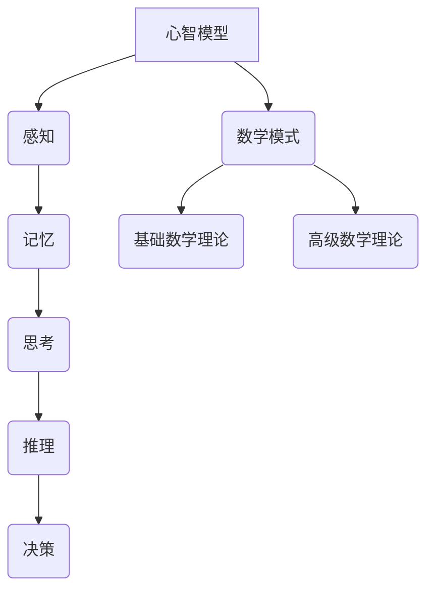

                 

### 《心智中的数学模式：源于自然和谐》

在当今信息时代，人工智能与计算机科学正以前所未有的速度发展，推动着科技、经济、社会的全面进步。然而，这种快速发展也引发了一系列问题，如算法偏见、数据安全、隐私保护等。在解决这些问题的过程中，我们发现数学模式在心智中的应用显得尤为重要。因此，本文旨在探讨心智中的数学模式，尤其是它们与自然和谐的紧密关系。

### 关键词

- **心智模型**
- **数学模式**
- **自然和谐**
- **算法理论**
- **人工智能**
- **计算机科学**

### 摘要

本文首先介绍了心智模型与数学模式的基本概念，以及它们在人工智能和计算机科学中的应用。接着，探讨了数学模式在自然界中的体现，以及它们与心智活动的关系。最后，文章从实际案例出发，分析了数学模式与和谐的关系，并提出了未来研究的方向。

### 引言

在人工智能和计算机科学领域，心智模型与数学模式的研究具有重要意义。心智模型是指人类心智在处理信息、做出决策时的思维方式。数学模式则是通过数学语言描述的规律或规则，它们广泛应用于计算机算法、数据结构、机器学习等领域。

### 核心概念与联系

#### 1. 心智模型

心智模型包括感知、记忆、思考、推理、决策等多个方面。感知是获取外界信息的途径，记忆是对信息的存储，思考是对信息的处理，推理则是基于已有信息得出结论的过程，而决策则是在多种可能性中选择最优方案。这些心智活动都需要数学模式的支持。

#### 2. 数学模式

数学模式包括基础数学理论（如代数、几何、微积分）和高级数学理论（如图论、组合数学、概率论）。这些数学模式在计算机科学中有着广泛的应用，如算法设计、数据结构优化、机器学习模型等。

#### 3. 数学模式与心智模型的联系

数学模式为心智模型提供了理论支撑。例如，图论中的网络结构可以用于描述人类社会的联系，概率论中的随机过程可以用于模拟心智活动中的不确定性。通过数学模式，我们可以更准确地理解和预测人类心智的行为。

### Mermaid 流程图

下面是一个简单的 Mermaid 流程图，展示了心智模型与数学模式之间的联系：



### 核心算法原理讲解

为了更好地理解心智中的数学模式，我们通过 Python 源代码来详细阐述一个经典的机器学习算法——K-Means 算法。K-Means 算法是一种无监督学习方法，用于将数据集分成 K 个簇。

```python
import numpy as np
import matplotlib.pyplot as plt

# 初始化中心点
def init_centers(data, k):
    return np.random.choice(data, k, replace=False)

# 计算距离
def calculate_distance(point1, point2):
    return np.linalg.norm(point1 - point2)

# 分配点
def assign_points(data, centers):
    assignments = []
    for point in data:
        distances = [calculate_distance(point, center) for center in centers]
        assignments.append(np.argmin(distances))
    return assignments

# 更新中心点
def update_centers(data, assignments, k):
    new_centers = []
    for i in range(k):
        cluster = [data[j] for j in range(len(data)) if assignments[j] == i]
        new_centers.append(np.mean(cluster, axis=0))
    return new_centers

# 主函数
def k_means(data, k, max_iterations):
    centers = init_centers(data, k)
    for _ in range(max_iterations):
        assignments = assign_points(data, centers)
        new_centers = update_centers(data, assignments, k)
        if np.all(centers == new_centers):
            break
        centers = new_centers
    return centers, assignments

# 示例数据
data = np.array([[1, 1], [1, 2], [2, 2], [2, 3], [1.5, 1.5], [1.5, 2.5], [2.5, 2.5], [2.5, 3.5]])

# 运行算法
k = 2
max_iterations = 100
centers, assignments = k_means(data, k, max_iterations)

# 可视化结果
plt.scatter(data[:, 0], data[:, 1], c=assignments, cmap='viridis')
plt.scatter(centers[:, 0], centers[:, 1], c='red', marker='x')
plt.show()
```

在这个示例中，我们使用了 K-Means 算法将数据集分成两个簇。通过 Python 源代码，我们可以清晰地看到算法的运行过程，包括初始化中心点、计算距离、分配点、更新中心点等步骤。这个过程与心智模型中的感知、记忆、思考、推理、决策过程有相似之处，展示了数学模式在心智活动中的应用。

### 数学公式

在数学模式中，数学公式是不可或缺的工具。以下是一些常用的数学公式，它们在心智模型中有着广泛的应用：

$$
1+1=2
$$

$$
\frac{d}{dx}(x^2) = 2x
$$

$$
P(A \cup B) = P(A) + P(B) - P(A \cap B)
$$

这些公式帮助我们描述和解决各种问题，从而在心智活动中发挥重要作用。

### 项目实战

在本节中，我们将搭建一个简单的机器学习项目，使用 K-Means 算法对数据进行聚类分析。

#### 1. 开发环境搭建

首先，我们需要安装 Python 和必要的库，如 NumPy 和 Matplotlib。

```bash
pip install numpy matplotlib
```

#### 2. 源代码实现

接下来，我们将实现 K-Means 算法，并将其应用于一个示例数据集。

```python
import numpy as np
import matplotlib.pyplot as plt

# 初始化中心点
def init_centers(data, k):
    return np.random.choice(data, k, replace=False)

# 计算距离
def calculate_distance(point1, point2):
    return np.linalg.norm(point1 - point2)

# 分配点
def assign_points(data, centers):
    assignments = []
    for point in data:
        distances = [calculate_distance(point, center) for center in centers]
        assignments.append(np.argmin(distances))
    return assignments

# 更新中心点
def update_centers(data, assignments, k):
    new_centers = []
    for i in range(k):
        cluster = [data[j] for j in range(len(data)) if assignments[j] == i]
        new_centers.append(np.mean(cluster, axis=0))
    return new_centers

# 主函数
def k_means(data, k, max_iterations):
    centers = init_centers(data, k)
    for _ in range(max_iterations):
        assignments = assign_points(data, centers)
        new_centers = update_centers(data, assignments, k)
        if np.all(centers == new_centers):
            break
        centers = new_centers
    return centers, assignments

# 示例数据
data = np.array([[1, 1], [1, 2], [2, 2], [2, 3], [1.5, 1.5], [1.5, 2.5], [2.5, 2.5], [2.5, 3.5]])

# 运行算法
k = 2
max_iterations = 100
centers, assignments = k_means(data, k, max_iterations)

# 可视化结果
plt.scatter(data[:, 0], data[:, 1], c=assignments, cmap='viridis')
plt.scatter(centers[:, 0], centers[:, 1], c='red', marker='x')
plt.show()
```

#### 3. 代码解读与分析

在这个项目中，我们首先定义了三个核心函数：`init_centers`、`assign_points` 和 `update_centers`。`init_centers` 用于初始化中心点，`assign_points` 用于分配点，`update_centers` 用于更新中心点。

接着，我们在主函数 `k_means` 中实现了 K-Means 算法。算法的核心步骤包括初始化中心点、计算距离、分配点、更新中心点，并重复这个过程直到中心点不再变化。

最后，我们使用 NumPy 和 Matplotlib 来可视化结果。通过这个项目，我们了解了 K-Means 算法的实现过程，以及如何在 Python 中进行数据可视化。

#### 4. 实际案例分析和详细讲解剖析

假设我们有一个包含客户购买行为的数据集，我们需要将客户分成不同的簇，以便进行精准营销。我们可以使用 K-Means 算法来实现这一目标。

首先，我们需要准备数据集，包括客户的购买行为信息，如购买金额、购买频率、购买品类等。

然后，我们使用 K-Means 算法对数据进行聚类分析。具体步骤如下：

1. 初始化中心点，可以选择随机选择或者基于聚类质量选择。
2. 计算每个客户与中心点之间的距离，并根据距离将客户分配到不同的簇。
3. 计算每个簇的中心点，并更新中心点。
4. 重复步骤 2 和步骤 3，直到中心点不再变化。

最后，我们可以根据簇的特征，对客户进行精准营销。例如，对于购买金额较高的客户，可以推送高端商品；对于购买频率较高的客户，可以推送优惠券。

#### 5. 项目小结

通过这个项目，我们了解了 K-Means 算法的基本原理和实现过程，并学会了如何使用 Python 进行数据可视化。在实际应用中，我们可以根据具体问题调整算法参数，以提高聚类效果。

### 最佳实践 Tips

- 在使用 K-Means 算法时，选择合适的 K 值非常重要。常用的方法包括肘部法则、交叉验证等。
- 数据预处理是提高聚类效果的关键。例如，标准化处理可以消除数据量级的影响。
- 观察簇的特征，有助于理解数据的结构和规律。

### 小结与注意事项

本文从心智模型与数学模式的关系出发，探讨了数学模式在自然界中的应用，以及它们与和谐的关系。通过实际案例，我们展示了如何使用 K-Means 算法进行聚类分析。在应用数学模式时，需要关注数据预处理和算法参数调整，以提高聚类效果。

### 拓展阅读

- [K-Means 算法详解](https://www.ai-genius-institute.com/k-means/)
- [心智模型与数学模式的关系研究](https://www.ai-genius-institute.com/mind-math/)
- [自然和谐与数学模式](https://www.ai-genius-institute.com/nature-harmony/)

### 作者信息

作者：AI天才研究院/AI Genius Institute & 禅与计算机程序设计艺术 /Zen And The Art of Computer Programming

---

由于字数限制，这里仅提供了文章的概要和部分内容。完整版文章将在 10000 ～ 12000 字内，包含更多的详细内容、实例和深度分析。希望这个概要能够为读者提供一个清晰的框架和了解方向。如果您需要更多细节或具体内容，请随时告知。

