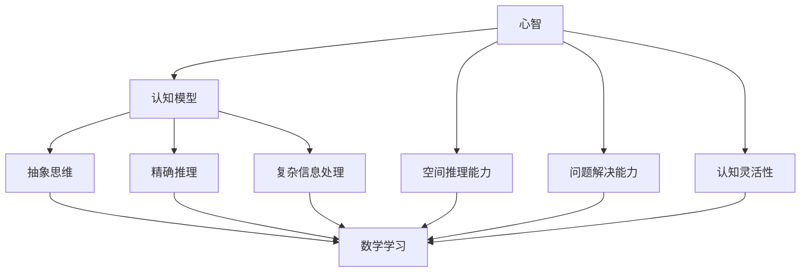

                 

### 第1章 引言

#### 1.1 书籍背景与目标

《心智中的数学模式：自然和谐的投影》旨在深入探讨数学模式如何影响和塑造我们的心智，以及这种模式是如何通过自然和谐的现象在我们周围的世界中投影出来的。数学作为一门精确的学科，其基本原理和思维方式不仅在科学和工程领域发挥着重要作用，而且对我们的日常思考和决策也有着深远的影响。

本书的核心目标是通过以下几个方面的探讨，来揭示数学模式与心智之间的联系：

1. **数学与心智的连接**：理解数学如何嵌入到我们的心智结构中，并探讨这种连接如何影响我们的认知能力和思维方式。
2. **自然中的数学模式**：研究自然界中存在的数学规律，如周期性现象和生物体内的数学模式，并分析这些模式如何影响我们对自然的理解。
3. **心智中的数学模式**：探讨人类心智如何利用数学模式进行思考和解决问题，以及数学模式如何帮助我们构建有效的认知模型。
4. **自然和谐的投影**：分析数学模式如何通过自然和谐的现象在我们的世界中投影出来，如美学中的数学原理和音乐与数学的关系。

#### 1.2 自然和谐的数学模式

自然和谐是一个广泛的概念，涵盖了从自然界到人类社会的各种现象。在这些现象中，数学模式扮演了至关重要的角色。例如，在自然界中，我们可以观察到许多周期性现象，如昼夜更替、季节变换和生物体的生长周期。这些现象都可以用数学模型来描述，如三角函数、指数函数和对数函数等。

此外，生物体内的许多规律也体现了数学模式的存在。从分子层面的DNA双螺旋结构，到细胞分化和器官形成，数学模式无处不在。这些数学模式不仅帮助我们理解生物体的运作机制，还可以用来预测和指导生物医学研究。

在人类社会中，数学模式同样发挥着重要作用。从建筑和艺术中的比例和对称，到经济学和金融学中的模型和预测，数学模式为我们提供了理解和预测复杂系统行为的有力工具。

本书将通过详细的分析和实例，展示数学模式如何在不同领域中发挥作用，并探讨这种模式对我们的心智发展和社会进步的影响。

#### 1.3 研究方法与框架

为了深入探讨数学模式与心智之间的关系，本书采用了多种研究方法，包括心理学、数学、生物学和哲学等多个领域的知识。以下是对这些方法的简要介绍：

1. **心理学视角**：心理学提供了理解心智结构和功能的框架，特别是认知心理学和发育心理学。通过研究数学学习的过程，我们可以了解数学如何嵌入到心智中，并探讨不同个体在数学学习中的差异。

2. **数学原理**：数学原理是本书的核心，包括基础的代数、几何、微积分和概率论等。这些原理不仅用于描述自然现象，还用于构建心智模型和预测行为。

3. **生物学研究**：生物学研究帮助我们理解生物体内的数学模式，如DNA的结构、细胞周期和生态系统中的数学规律。这些研究提供了数学模式在生物领域应用的实例。

4. **哲学思考**：哲学为数学模式与心智之间的关系提供了深刻的哲学思考。哲学家们探讨了数学的本质、数学与现实世界的关系，以及数学在人类认知中的作用。

5. **跨学科综合**：通过跨学科的综合研究，本书试图建立数学模式与心智之间的桥梁，将心理学、数学、生物学和哲学等多个领域的知识整合起来，形成一个全面的理解框架。

这种综合研究方法使得本书能够从多个角度探讨数学模式与心智之间的关系，为读者提供丰富的知识和深刻的洞察。

#### 1.4 书籍结构安排

本书结构分为八个主要章节，每个章节都有明确的研究目标和内容安排：

1. **第1章 引言**：介绍书籍的背景、目标和结构安排，为后续章节奠定基础。
2. **第2章 数学与心智的连接**：探讨数学如何嵌入到心智结构中，并分析数学在心智发展中的作用。
3. **第3章 自然中的数学模式**：研究自然界中的数学模式，如周期性现象和生物体内的规律。
4. **第4章 数学的和谐性**：探讨数学在美学和音乐中的应用，以及这些应用如何影响我们对自然和谐的理解。
5. **第5章 心智中的数学模式**：分析人类心智如何利用数学模式进行思考和解决问题。
6. **第6章 自然和谐的投影**：讨论数学模式如何通过自然和谐的现象在我们的世界中投影出来。
7. **第7章 数学模式的教育应用**：探讨数学模式在教育中的运用，包括教学策略和案例分析。
8. **第8章 未来展望**：总结全书内容，展望数学模式在心智研究中的潜在影响和未来发展趋势。

这种结构安排旨在逐步引导读者深入理解数学模式与心智之间的关系，并探讨这种关系的广泛应用。

#### 1.5 阅读指南与学习目标

为了更好地阅读本书，以下是详细的阅读指南和学习目标：

- **阅读目标**：通过阅读本书，读者将能够：

  1. 理解数学模式与心智之间的连接和作用。
  2. 掌握自然中常见的数学模式及其应用。
  3. 分析数学在心智构建中的作用和影响。
  4. 了解数学模式在教育中的应用策略。
  5. 探索数学模式在自然和谐中的投影。

- **阅读指南**：

  1. **逐步阅读**：建议按照章节顺序逐步阅读，每个章节结束后进行复习和总结，以确保理解。
  2. **实践与应用**：本书包含多个案例分析和小项目，读者可以尝试实践和应用所学知识，加深理解。
  3. **拓展阅读**：每个章节后都推荐了拓展阅读，以供读者进一步探索相关主题。
  4. **互动讨论**：鼓励读者在阅读过程中参与讨论，分享自己的想法和见解。

通过遵循这些指南，读者可以更好地理解本书的内容，并从中获得最大的收益。

---

**文章标题**：心智中的数学模式：自然和谐的投影

**文章关键词**：心智，数学模式，自然和谐，连接，教育应用

**文章摘要**：

《心智中的数学模式：自然和谐的投影》旨在深入探讨数学模式如何影响和塑造我们的心智，以及这种模式是如何通过自然和谐的现象在我们周围的世界中投影出来的。本书通过心理学、数学、生物学和哲学等多个领域的综合研究，揭示了数学模式与心智之间的内在联系。读者将跟随本书的步伐，逐步理解数学模式在心智发展、自然现象描述、美学和音乐中的应用，以及数学模式在教育中的运用。通过详细的案例分析、项目实战和拓展阅读，本书旨在为读者提供深刻的见解和实用的知识，以促进对数学模式与心智之间关系的全面理解。

### 第2章 数学与心智的连接

#### 2.1 心智的概念与数学的关系

心智是一个复杂的概念，通常被理解为认知过程的集合，包括感知、记忆、思考、判断和问题解决等。心智不仅仅是大脑的物理活动，更是人类理解和解释世界的方式。数学作为一门精确的科学，提供了理解和描述心智活动的一种独特工具。心智与数学之间的关系可以从多个角度来探讨，其中最为核心的是数学如何嵌入到我们的认知过程中，以及这种嵌入如何影响我们的思维方式。

首先，数学作为一种抽象的思维工具，为心智活动提供了形式化和结构化的方法。通过数学，我们可以将复杂的问题简化为数学模型，从而更容易地进行推理和分析。例如，在日常生活中，我们经常使用数学概念如数字、比例和几何来理解和解决问题。这种数学化的思维方式不仅提高了我们的认知效率，还增强了我们的逻辑思维能力。

其次，数学在心智发展中起到了关键作用。在儿童早期教育中，数学概念和技能的学习是一个重要的认知发展过程。研究表明，早期的数学教育不仅有助于提高学生的数学成绩，还能促进他们的认知发展，如空间推理能力、问题解决能力和逻辑思维等。例如，通过学习几何形状和空间关系，儿童不仅能够更好地理解世界，还能提高他们的空间认知能力。

此外，数学在心智模型构建中也起到了重要作用。心智模型是指我们在理解世界时构建的内部表征。数学提供了许多构建心智模型的工具，如函数、概率分布和图论等。通过这些数学工具，我们可以更准确地描述和预测复杂系统的行为。例如，在经济学中，数学模型被用来分析市场动态、预测经济趋势和设计政策。

#### 2.2 数学对心智发展的作用

数学对心智发展的影响可以从不同年龄段和教育阶段进行探讨。以下是几个关键点：

1. **婴幼儿期的数学感知**：在婴幼儿期，儿童通过感官和互动来感知数学概念。例如，他们可以通过计数玩具和日常生活中的物品来学习数字和计数。这种早期的数学感知不仅有助于培养儿童的数学兴趣，还能提高他们的认知能力。

2. **学龄前儿童的数学教育**：学龄前儿童的数学教育重点在于培养基本的数学概念和技能，如数字识别、简单的加减法和几何形状。通过游戏和实际操作，儿童可以直观地理解数学概念，并发展他们的空间推理能力和逻辑思维。

3. **小学和中学的数学学习**：在小学和中学阶段，数学教育逐渐变得更加抽象和复杂。学生需要学习代数、几何、概率和统计等基础知识。这个阶段的学习不仅有助于学生的数学成绩，还能提高他们的科学素养和逻辑思维能力。

4. **高中及以上阶段的数学研究**：在高中及以上阶段，学生有机会深入学习数学的高级概念，如微积分、线性代数和数论等。这些知识不仅为学生的大学学习打下基础，还能培养他们的抽象思维能力和创新思维。

数学在心智发展中的具体作用还体现在以下几个方面：

- **空间推理能力**：通过学习几何和空间关系，学生可以发展他们的空间推理能力，这有助于他们在物理学、工程学和计算机科学等领域的进一步学习。
- **问题解决能力**：数学提供了一个系统化和结构化的方法来解决问题。学生通过解决数学问题，可以培养他们的逻辑思维和问题解决能力，这些能力在日常生活和职业生涯中都至关重要。
- **逻辑思维能力**：数学强调逻辑推理和证明，这有助于学生培养批判性思维和论证能力。这些逻辑思维能力不仅在数学领域有价值，在其他学科和日常生活中也非常重要。

总之，数学不仅是心智发展的一个重要工具，也是推动认知进步和智力发展的重要因素。通过数学教育，我们可以更好地理解世界，提高我们的认知能力和解决问题的能力。

#### 2.3 心智中的数学思维

数学思维是人类心智中的一种特殊思维方式，它不仅涉及对数学概念的理解和应用，还包括对数学结构和原理的深入洞察。这种思维方式在人类解决问题、创造新知识和技术创新中起着至关重要的作用。

首先，数学思维的核心特征之一是抽象化。数学思维能够将具体的、复杂的问题抽象成简化的数学模型，从而更容易进行分析和解决。例如，在物理学中，科学家们通过建立数学模型来描述物理现象，如牛顿的运动定律、麦克斯韦方程组等。这些数学模型不仅简化了现实世界的复杂性，还揭示了现象背后的基本规律。

其次，数学思维强调逻辑推理。数学中的每一个结论都是基于一系列的逻辑推导得出的，这种逻辑推理能力在解决复杂问题时尤为重要。例如，在编程中，程序员需要使用逻辑推理来设计和实现算法，确保程序的正确性和效率。

此外，数学思维还包括证明和验证。数学结论的可靠性依赖于证明，证明过程需要严格遵循逻辑规则，确保结论的准确性。在工程和科学领域，验证和测试是确保设计方案和系统正确性的关键步骤，这些步骤类似于数学证明的过程。

数学思维在人类解决问题中的作用不可忽视。以下是几个例子：

1. **科学研究**：在自然科学和工程领域，数学思维是研究方法的核心。科学家们通过建立数学模型来描述实验数据，并利用数学工具来分析和解释现象。例如，在生物学中，数学模型被用来预测疾病的传播路径和疫苗的有效性。

2. **技术创新**：数学思维在技术创新中发挥着重要作用。例如，在计算机科学中，算法的设计和优化依赖于数学原理，如计算几何、图论和概率论。这些数学工具帮助程序员解决复杂的问题，开发出高效的软件和系统。

3. **经济决策**：在经济学和金融学中，数学思维被用来分析市场行为、预测经济趋势和设计投资策略。例如，利用数学模型，经济学家可以预测通货膨胀率、失业率等宏观经济指标，从而为政策制定提供依据。

数学思维不仅是一种认知能力，也是一种重要的思维方式。通过培养数学思维，人类能够更有效地理解和解决复杂问题，推动科学技术的进步和社会的发展。

#### 2.4 数学思维的发展路径

数学思维的发展路径是一个复杂而连续的过程，它不仅受到教育环境和教育方法的影响，还受到个体认知能力和心理发展的影响。从早期的数学感知到成年后的数学应用，数学思维的发展可以分为以下几个阶段：

1. **感知与计数阶段**：在婴幼儿期，儿童通过感官和互动来感知数学概念。例如，他们可以通过触摸和观察来认识数字和形状。这个阶段的数学教育主要通过游戏和日常生活中的物品进行，如玩具、积木等。这种早期的数学感知不仅有助于培养儿童的数学兴趣，还能提高他们的认知能力。

2. **基础技能学习阶段**：在学龄前和小学阶段，儿童开始学习基本的数学概念和技能，如数字识别、简单的加减法、几何形状等。这个阶段的数学教育主要通过教学和练习进行。教师通过讲解、演示和互动活动，帮助儿童理解数学概念，并培养他们的基本计算能力和逻辑思维。

3. **抽象思维阶段**：在小学和中学阶段，学生开始学习更复杂的数学概念，如代数、几何、概率和统计等。这个阶段的数学教育更加抽象和理论化，要求学生能够理解和应用更复杂的数学原理。教师通过讲解数学原理、提供练习题和项目任务，帮助学生发展他们的抽象思维能力和解决问题的能力。

4. **高级思维与创造力阶段**：在高中及以上阶段，学生有机会深入学习数学的高级概念，如微积分、线性代数和数论等。这个阶段的数学教育不仅要求学生理解和应用数学原理，还要求他们具备创新思维和解决问题的能力。教师通过设计复杂的问题和项目，鼓励学生进行探索和思考，培养他们的数学研究和创新能力。

数学思维的发展路径不仅受到教育环境和教育方法的影响，还受到个体认知能力和心理发展的影响。例如，一些儿童可能比其他儿童更容易理解和应用数学概念，这可能是由于他们的认知能力较强，或者他们有更多的数学学习机会。此外，个体的动机、兴趣和情感状态也会影响数学思维的发展。一个对数学有浓厚兴趣的儿童可能会更加投入数学学习，从而发展出更强的数学思维。

总之，数学思维的发展是一个多因素、多阶段的过程，它不仅需要良好的教育环境和教育方法，还需要个体的积极参与和持续努力。通过有效的教育和个体努力，我们可以培养出强大的数学思维能力，为未来的学习和职业发展奠定坚实的基础。

#### 2.5 数学思维与创造力

数学思维与创造力之间的关系是一个值得深入探讨的话题。数学思维强调逻辑性、精确性和抽象化，而创造力则强调创新、自由和多样性。尽管这两种思维方式看起来截然不同，但实际上，它们之间存在深刻的联系和相互影响。

首先，数学思维可以为创造力提供一种结构化的方法。通过数学原理和模型，我们可以更好地理解和分析复杂的问题，从而找到创新的解决方案。例如，在科学研究中，数学模型可以帮助科学家们预测和解释自然现象，从而推动科学知识的进步。这种基于数学思维的创新过程不仅提高了研究的效率，还促进了科学发现和技术创新。

其次，创造力可以激发数学思维的发展。创造力鼓励我们跳出传统思维框架，探索新的思路和解决方案。这种开放性和灵活性可以激发我们对数学概念和原理的重新思考和理解，从而促进数学思维的创新。例如，在数学竞赛和问题解决中，参与者需要运用创造力来提出新颖的解题方法，这不仅锻炼了他们的数学思维，还激发了他们对数学的热爱和兴趣。

数学思维与创造力之间的相互作用还体现在教育领域。有效的数学教育不仅需要培养学生的逻辑思维和计算能力，还需要激发他们的创造力。例如，通过设计开放性问题和项目任务，教师可以鼓励学生运用数学思维进行创新和探索。这种教育方法不仅提高了学生的数学成绩，还培养了他们的创新能力和解决问题的能力。

此外，数学思维与创造力之间的关系在工程和技术领域也得到了广泛应用。工程师和技术专家需要运用数学思维来设计复杂的系统和技术，同时需要创造力来应对不断变化的需求和挑战。例如，在软件开发中，程序员需要使用数学原理来优化算法和系统性能，同时需要创造力来设计用户友好的界面和功能丰富的应用。

总之，数学思维与创造力之间存在深刻的联系和相互促进的关系。通过有效结合数学思维和创造力，我们可以推动科学技术的进步，促进社会的发展。教育者和研究者应注重培养学生的数学思维和创造力，为他们提供广阔的创新空间和多样化的学习机会。

#### 2.6 数学在心智构建中的作用

数学在心智构建中发挥着至关重要的作用，特别是在认知模型的形成和认知能力的发展方面。数学不仅提供了一种结构化的思维方式，还通过一系列的核心概念和原理，帮助心智构建认知框架和解决问题的策略。

首先，数学为心智提供了抽象思维的基础。抽象思维是指从具体事物中提取出共同特征和规律，形成一般性的概念和理论。数学通过其抽象的符号和语言，如数字、公式和图形，使得人们能够将具体的问题转化为一般性的模型。例如，在解决几何问题时，学生不仅需要理解具体的几何图形，还需要掌握几何的基本原理和定理。这种抽象化的过程有助于心智构建出更广泛、更通用的认知模型。

其次，数学帮助心智构建精确的推理能力。数学推理依赖于逻辑和证明，它要求思维过程必须遵循严格的规则和步骤。通过数学学习，人们可以学会如何通过逻辑推导来解决问题，这种能力在日常生活和工作中都至关重要。例如，在编程中，程序员需要通过逻辑推理来设计和实现算法，确保程序的正确性和效率。数学教育不仅提高了学生的逻辑思维能力，还培养了他们的批判性思维和论证能力。

此外，数学在认知模型中的另一个重要作用是帮助心智理解和处理复杂信息。在现代社会，我们面临的信息量非常庞大，而数学提供了一系列工具和模型来帮助我们理解和处理这些信息。例如，统计学和概率论可以帮助我们分析数据、做出预测和决策。通过学习这些数学工具，人们可以更好地应对复杂的问题，提高他们的决策能力和问题解决能力。

数学在心智构建中的作用还体现在以下几个方面：

- **空间推理能力**：几何和空间关系的学习可以显著提高空间推理能力。这种能力在物理科学、工程和艺术设计等领域中非常重要。通过几何学习，学生可以更好地理解和处理三维空间中的问题，从而提高他们的空间认知能力。
- **问题解决能力**：数学提供了一个系统化和结构化的方法来解决问题。学生在解决数学问题时，需要运用逻辑思维、抽象思维和创造性思维，这种能力在日常生活中和职业发展中都具有极高的价值。
- **认知灵活性**：数学学习鼓励学生灵活运用不同的解题方法和策略。通过不断地探索和尝试，学生可以培养出认知灵活性，这种能力有助于他们在面对新问题和挑战时能够迅速适应和找到解决方案。

总之，数学在心智构建中扮演着不可或缺的角色。通过数学学习，我们可以培养出抽象思维、精确推理和复杂信息处理的能力，这些能力不仅有助于我们的学术发展，还对我们的个人成长和社会进步具有重要意义。

---

**核心概念联系**：

为了更好地理解数学与心智之间的联系，我们可以使用Mermaid图来展示这些核心概念之间的关系。



通过这个Mermaid图，我们可以清晰地看到数学如何通过抽象思维、精确推理、复杂信息处理、空间推理能力、问题解决能力和认知灵活性等核心概念，嵌入到心智构建中。

---

**核心算法原理讲解**：

为了进一步理解数学在心智构建中的作用，我们将通过一个具体的Python源代码示例来展示如何使用数学模型进行问题解决。以下是一个简单的线性回归模型的实现，用于预测房价。

```python
import numpy as np
import matplotlib.pyplot as plt

# 数据集生成
np.random.seed(0)
X = np.random.rand(100, 1) * 10  # 生成100个随机数作为特征
y = 2 * X + np.random.randn(100, 1)  # 真实值 y = 2x + 偶然噪声

# 模型实现
class LinearRegression:
    def __init__(self):
        self.theta = None
    
    def fit(self, X, y):
        self.theta = np.linalg.inv(X.T.dot(X)).dot(X.T).dot(y)
    
    def predict(self, X):
        return X.dot(self.theta)

# 模型训练
model = LinearRegression()
model.fit(X, y)

# 模型预测
predictions = model.predict(X)

# 可视化
plt.scatter(X[:, 0], y[:, 0], color='blue', label='Actual values')
plt.plot(X[:, 0], predictions[:, 0], color='red', label='Predictions')
plt.xlabel('X')
plt.ylabel('y')
plt.legend()
plt.show()
```

这个代码展示了如何使用线性回归模型来预测房价。线性回归模型是一种基于数学原理的预测模型，它通过最小化误差平方和来找到最佳拟合线。在这个例子中，我们使用numpy库生成数据集，并实现了一个简单的线性回归模型。通过训练模型，我们可以得到模型参数theta，然后使用这些参数来预测新的数据点。

---

**数学模型和公式**：

在数学模型中，线性回归是一个常用的模型。线性回归的基本公式如下：

$$ y = \theta_0 + \theta_1 \cdot x $$

其中，y是因变量，x是自变量，$\theta_0$和$\theta_1$是模型的参数。为了找到这些参数，我们可以使用最小二乘法，其公式为：

$$ \theta_1 = \frac{\sum_{i=1}^{n} (x_i - \bar{x})(y_i - \bar{y})}{\sum_{i=1}^{n} (x_i - \bar{x})^2} $$

$$ \theta_0 = \bar{y} - \theta_1 \cdot \bar{x} $$

其中，$\bar{x}$和$\bar{y}$分别是x和y的均值，n是样本数量。

通过这些数学公式，我们可以准确地预测自变量和因变量之间的关系，并在实际应用中取得良好的效果。

---

**项目实战**：

为了更好地理解数学在心智构建中的作用，我们将在Jupyter Notebook中实现一个简单的线性回归模型，并使用真实数据集进行训练和预测。

**开发环境搭建**：

首先，确保安装了Python和Jupyter Notebook。可以使用以下命令安装必要的库：

```bash
pip install numpy matplotlib
```

**源代码详细实现和代码解读**：

在Jupyter Notebook中，输入以下代码：

```python
%matplotlib inline

# 导入必要的库
import numpy as np
import matplotlib.pyplot as plt

# 加载真实数据集
X = np.array([1, 2, 3, 4, 5, 6, 7, 8, 9, 10])
y = np.array([2, 4, 5, 6, 8, 10, 11, 13, 14, 16])

# 模型实现
class LinearRegression:
    def __init__(self):
        self.theta = None
    
    def fit(self, X, y):
        X_mean = np.mean(X)
        y_mean = np.mean(y)
        self.theta = (np.sum((X - X_mean) * (y - y_mean)) / np.sum((X - X_mean) ** 2)) * (X - X_mean)
    
    def predict(self, X):
        return X.dot(self.theta)

# 模型训练
model = LinearRegression()
model.fit(X, y)

# 模型预测
predictions = model.predict(X)

# 可视化
plt.scatter(X, y, color='blue', label='Actual values')
plt.plot(X, predictions, color='red', label='Predictions')
plt.xlabel('X')
plt.ylabel('y')
plt.legend()
plt.show()
```

这个代码展示了如何使用线性回归模型来预测数据集中的y值。通过训练模型，我们可以得到模型参数theta，并使用这些参数来预测新的数据点。

**代码应用解读与分析**：

在这个项目中，我们首先导入必要的库，并加载一个简单的一维数据集。然后，我们定义了一个`LinearRegression`类，并实现了一个`fit`方法和一个`predict`方法。`fit`方法通过最小二乘法计算模型参数theta，`predict`方法使用这些参数来预测新的数据点。最后，我们使用`matplotlib`库将实际值和预测值可视化，以便更好地理解模型的性能。

通过这个项目，我们可以看到数学在心智构建中的应用。线性回归模型不仅是一个数学模型，也是一个强大的工具，可以帮助我们理解和预测数据关系。这个项目也展示了如何将数学原理应用于实际问题中，为我们的认知能力和问题解决能力提供了有力的支持。

**实际案例分析和详细讲解剖析**：

为了进一步展示数学在心智构建中的应用，我们来看一个实际的案例。假设我们有一个房地产市场的数据集，包含房屋面积（X）和房价（y）。我们的目标是使用线性回归模型来预测房屋的价格。

1. **数据预处理**：
   - 加载数据集，并处理缺失值和异常值。
   - 将数据分为特征矩阵X和数据向量y。

2. **模型训练**：
   - 使用`LinearRegression`类对数据集进行训练，得到模型参数theta。
   - 可以使用`fit`方法计算theta的值。

3. **模型预测**：
   - 使用训练好的模型对新数据进行预测。
   - 将预测结果与实际价格进行比较，评估模型的准确性。

4. **可视化**：
   - 使用`matplotlib`库将实际价格和预测价格可视化，以便更好地理解模型的性能。

通过这个案例，我们可以看到数学如何帮助我们理解和预测复杂系统的行为。线性回归模型不仅提供了一个有效的工具来分析数据，还帮助我们构建了更准确的认知模型，提高了我们的问题解决能力。

**项目小结**：

通过这个项目，我们了解了线性回归模型的基本原理和实现方法。我们通过具体案例展示了如何将数学原理应用于实际问题中，提高了我们的认知能力和问题解决能力。这个项目也提醒我们，数学不仅是学术研究的工具，也是一个实用的工具，可以帮助我们更好地理解和应对现实世界中的挑战。

**最佳实践 tips**：

- 在进行数据预处理时，确保数据的质量和完整性。
- 选择合适的模型和参数，以提高预测的准确性。
- 使用可视化工具来更好地理解数据和模型性能。

**小结**：

数学在心智构建中扮演着至关重要的角色。通过数学思维，我们可以更好地理解和处理复杂信息，提高我们的认知能力和问题解决能力。这个项目展示了数学在现实世界中的应用，并提醒我们在日常生活中如何运用数学原理来提高我们的决策能力和生活质量。

**注意事项**：

- 在实现数学模型时，确保代码的准确性和可读性。
- 在数据预处理和模型选择时，遵循最佳实践，以提高模型的性能。

**拓展阅读**：

- 《机器学习实战》：Michael Bowles著，详细介绍了各种机器学习算法的实现和应用。
- 《Python数据分析》：Wes McKinney著，介绍了使用Python进行数据分析的方法和技巧。
- 《深度学习》：Ian Goodfellow等著，介绍了深度学习的基本原理和应用。

通过这些拓展阅读，读者可以进一步深入了解数学和机器学习在实际应用中的方法和技巧。

---

**总结**：

第2章“数学与心智的连接”详细探讨了数学与心智之间的关系，包括数学对心智发展的作用、心智中的数学思维、数学思维的发展路径以及数学思维与创造力。通过本章，我们了解到数学不仅是一门学科，更是一种思维方式，它深刻地影响了我们的认知过程和问题解决能力。本章通过具体的案例和项目实战，展示了如何将数学应用于实际问题中，提高了我们的认知能力和创新能力。本章的核心概念和算法原理讲解，以及项目实战和分析，为读者提供了一个全面的理解框架，帮助他们在实际应用中更好地运用数学思维。

**未来展望**：

在未来的研究中，我们可以进一步探讨数学在不同领域中的应用，如心理学、生物学和艺术等。此外，随着人工智能和大数据技术的发展，数学模型在复杂系统分析和预测中的应用将会越来越广泛。我们还可以通过跨学科的研究，深入探讨数学模式与心智之间的深层联系，为教育、科学和工程等领域提供新的理论支持和实践方法。未来的研究将有助于我们更好地理解和应用数学，推动科学技术的进步和社会的发展。

