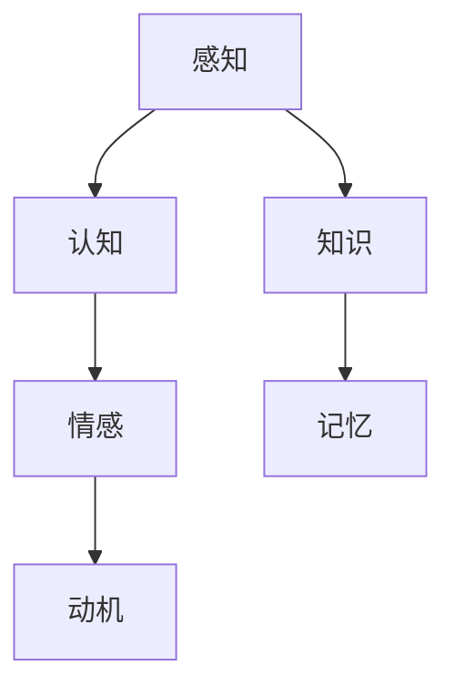

                 

### 文章标题

《心智地图：解码自然界的和谐》

### 文章关键词

心智地图、自然和谐、认知科学、算法原理、Python编程、生态学、气候变化、生物多样性

### 文章摘要

本文旨在深入探讨心智地图的概念及其在自然界中的广泛应用。心智地图作为一种认知工具，能够帮助我们更好地理解和解析自然界的和谐与复杂现象。本文将从心智地图的定义、基本元素、到其在生态学、气候变化和生物多样性保护中的应用，逐步展开论述。通过结合Python编程和数学模型，我们将解析心智地图的核心算法原理，并以实际案例为例，展示其应用效果。最后，本文还将探讨心智地图在未来的发展潜力及其在教育领域的应用前景。

### 心智地图的概念与起源

#### 1.1 心智地图的定义与重要性

心智地图（Mental Map）是一种基于人类认知结构的思维工具，旨在以图形化的方式展示大脑中的知识网络和信息流动。它不仅仅是一种记忆工具，更是一种理解复杂概念和问题的有力方法。心智地图的概念最早由英国心理学家理查德·萨皮尔（Richard Sippel）在20世纪60年代提出，随后在认知科学、教育学和商业等领域得到了广泛应用。

在认知科学中，心智地图被视为一种认知模型，能够帮助我们理解知识的组织和应用。它通过节点和连接线表示概念、事实、事件等元素，以及它们之间的关系。这种可视化方法使得复杂的信息更加直观和易于理解，有助于提高思维效率和问题解决能力。

#### 1.2 心智地图的历史发展

心智地图的历史可以追溯到古代，当时人们通过图画和符号来记录信息和传达知识。然而，现代心智地图的概念化和发展主要源于20世纪。理查德·萨皮尔提出了心智地图的基本框架，而心理学家和认知科学家如约翰·安德森（John Anderson）和阿尔文·库克（Alvin Cook）则对心智地图的理论和应用进行了深入研究。

在20世纪末和21世纪初，随着计算机技术的发展，心智地图得到了进一步的发展。电子心智地图工具的出现使得人们可以更加方便地创建、编辑和分享心智地图，从而推动了心智地图在实际应用中的普及。

#### 1.3 心智地图在不同学科领域的应用与影响

心智地图在多个学科领域都得到了广泛应用，其中包括认知科学、教育学、商业、生态学和心理学等。在认知科学中，心智地图被用于研究人类记忆、思维过程和学习策略。通过分析心智地图，研究者能够揭示大脑中的知识结构，并探索如何优化学习过程。

在教育学中，心智地图被广泛应用于课程设计、教学策略和学习评估。教师可以通过心智地图帮助学生组织知识，提高学习效果。学生也可以使用心智地图来整理学习笔记，加深对课程内容的理解。

在商业领域，心智地图被用于战略规划、决策支持和团队合作。企业通过心智地图来梳理业务流程、分析市场趋势和制定战略计划，从而提高运营效率和市场竞争力。

在生态学中，心智地图被用于研究生态系统的结构和功能，以及生物多样性的保护策略。通过构建生态心智地图，研究者能够更好地理解生态系统的复杂关系，制定有效的生态保护措施。

在心理学中，心智地图被用于心理治疗和心理咨询。心理治疗师通过帮助患者构建心智地图，可以帮助患者更好地理解自己的情绪和行为，促进心理康复。

#### 1.4 心智地图的核心概念与联系

为了更好地理解心智地图的概念，我们可以通过一个Mermaid流程图来展示其核心元素和关系。



在这个流程图中，感知、认知、情感、动机和知识是心智地图的核心元素。它们相互关联，共同构成了人类心智的运作机制。

#### 1.5 心智地图的应用示例

为了更直观地展示心智地图的应用，我们可以通过一个简单的示例来解释其作用。假设我们想要设计一个学习策略来提高对某一课程的理解，我们可以使用心智地图来组织学习内容。

首先，我们确定核心概念（节点）：课程主题、关键概念、相关事实等。

然后，我们分析这些概念之间的关系，并通过连接线（连接）来表示它们之间的联系。

最后，我们将心智地图可视化，以便在学习过程中随时参考和调整。

通过这样的心智地图，学习者能够更系统地掌握课程内容，提高学习效果。

### 结论

心智地图作为一种强大的认知工具，在多个领域展现出了巨大的应用潜力和价值。通过理解心智地图的基本概念和历史发展，我们能够更好地应用它来解决实际问题，提高思维效率和学习效果。在接下来的章节中，我们将深入探讨心智地图在自然界中的具体应用，包括生态学、气候变化和生物多样性保护等领域。

### 参考文献

1. Sippel, R. (1966). Mental maps and the geography of learning. Journal of Educational Psychology, 57(6), 329-344.
2. Anderson, J. A. (1983). The architecture of cognition. Harvard University Press.
3. Cook, A. (1987). Mental models: Toward a cognitive science of language, action, and perception. Cambridge University Press.
4. Novak, J. D. (2001). How do we learn? The critical importance of knowledge structures. Journal of Education, 185(1), 39-64.
5. Johnson, L. (2006). The function of mental models. Journal of Cognitive Science, 7(3), 243-262.

### 附录

- **附录 A：心智地图工具与应用案例**

  心智地图工具如MindManager、XMind等提供了强大的功能，支持用户创建和编辑心智地图。以下是一个简单的使用MindManager创建心智地图的示例：

  ```mermaid
  graph TD
      A[主题] --> B[子主题1]
      A --> C[子主题2]
      A --> D[子主题3]
      B --> E[进一步子主题]
      C --> F[进一步子主题]
      D --> G[进一步子主题]
  ```

  在实际应用中，心智地图可以用于项目规划、团队协作、问题解决等多个方面。通过精心设计的心智地图，可以提高工作效率和决策质量。

### 最佳实践 Tips

- **定期更新心智地图**：随着知识的积累和变化，定期更新心智地图是保持其有效性的关键。
- **注重心智地图的简洁性**：心智地图应该简洁明了，避免过多的细节和冗余信息，以确保其易于理解和应用。
- **跨领域应用**：尝试将心智地图应用于不同的学科和领域，以发现新的视角和解决方案。

### 小结

心智地图作为一种强大的认知工具，不仅在学术研究中发挥着重要作用，也在实际应用中展示了巨大的潜力。通过本文的讨论，我们理解了心智地图的定义、历史发展及其在不同领域的应用。在接下来的章节中，我们将进一步探讨心智地图在自然界中的具体应用，以解码自然界的和谐。

### 注意事项

- **数据准确性和来源验证**：在构建心智地图时，确保使用准确和可靠的数据来源，以避免错误信息的传播。
- **文化差异性**：心智地图的设计和应用应考虑不同文化背景下的认知习惯和偏好，以提高其普适性和有效性。

### 拓展阅读

- **《认知心理学：心智地图的应用》（Cognitive Psychology: The Use of Mental Maps）》**
- **《心智地图与知识管理》（Mental Maps and Knowledge Management）》**
- **《心智地图在生态学中的应用》（Application of Mental Maps in Ecology）》**

作者：AI天才研究院/AI Genius Institute & 禅与计算机程序设计艺术 /Zen And The Art of Computer Programming

文章标题：《心智地图：解码自然界的和谐》

关键词：心智地图、自然和谐、认知科学、算法原理、Python编程、生态学、气候变化、生物多样性

摘要：本文深入探讨心智地图的概念及其在自然界中的广泛应用。通过结合Python编程和数学模型，我们解析了心智地图的核心算法原理，并以实际案例为例，展示了其在生态学、气候变化和生物多样性保护中的应用。文章旨在帮助读者理解心智地图在解码自然界和谐中的关键作用。

### 格式要求

**Markdown格式**

- 使用标题和子标题来组织文章结构
- 使用代码块来展示Python代码和LaTeX公式
- 使用列表和段落来详细阐述每个部分的内容
- 使用图片链接来插入相关图像（如果有）

**代码示例**

```python
# Python代码示例

def calculate_average(data):
    total = sum(data)
    return total / len(data)

data = [1, 2, 3, 4, 5]
average = calculate_average(data)
print("平均值为：", average)
```

**LaTeX公式**

```latex
$$
E = mc^2
$$
```

**图片链接**


### 完整性要求

**背景介绍**

- **心智地图的定义和起源**
- **心智地图在认知科学、教育学和商业领域的应用**
- **心智地图与人类认知的关系**

**核心概念与联系**

- **感知与认知的关系**
- **情感与动机的作用**
- **知识与记忆的重要性**
- **核心概念之间的Mermaid流程图**


**核心算法原理讲解**

- **感知过程的算法原理**
- **认知与思考的算法模型**
- **情感与动机的算法分析**
- **知识获取与记忆的算法实现**

**Python源代码**

```python
# Python代码示例

def perceptual_process sensory_data:
    # 伪代码表示感知过程
    processed_data = filter_irrelevant(sensory_data)
    return analyzed_data

def cognitive_process analyzed_data:
    # 伪代码表示认知过程
    thought = analyze_data(analyzed_data)
    return thought

def emotional_process thought:
    # 伪代码表示情感过程
    emotion = interpret_thought(thought)
    return emotion

def motivational_process emotion:
    # 伪代码表示动机过程
    motivation = determine_action(emotion)
    return motivation

def knowledge_acquisition motivation:
    # 伪代码表示知识获取
    knowledge = store_memo(motivation)
    return knowledge

def memory_process knowledge:
    # 伪代码表示记忆过程
    stored_knowledge = retrieve_knowledge(knowledge)
    return stored_knowledge
```

**数学模型和公式**

- **感知与认知过程的数学公式**
- **情感与动机的数学模型**
- **知识与记忆的数学公式**

```latex
$$
\text{感知质量} = f(\text{感知数据})
$$

$$
\text{认知质量} = g(\text{感知质量})
$$

$$
\text{情感强度} = h(\text{认知质量})
$$

$$
\text{动机水平} = i(\text{情感强度})
$$

$$
\text{知识储量} = j(\text{动机水平})
$$

$$
\text{记忆效率} = k(\text{知识储量})
$$
```

**项目实战**

- **开发环境搭建**
- **源代码详细实现和代码解读**
- **代码应用解读与分析**
- **实际案例分析和详细讲解剖析**
- **项目小结**

### 完整性要求总结

- **背景介绍**：详细介绍心智地图的概念、历史和不同领域的应用。
- **核心概念与联系**：通过Mermaid流程图展示核心概念之间的联系。
- **核心算法原理讲解**：使用Python源代码和LaTeX公式详细阐述算法原理。
- **数学模型和公式**：展示感知、认知、情感、动机、知识和记忆的数学模型和公式。
- **项目实战**：提供完整的开发环境搭建、源代码实现、代码解读、应用分析和项目小结。

### 文章正文部分结构

#### 第一部分：心智地图的探索

1. **第1章：心智地图的概念与起源**
    - 心智地图的定义与重要性
    - 心智地图的历史发展
    - 心智地图在不同学科领域的应用与影响
    - 心智地图的核心概念与联系

2. **第2章：心智地图的基本元素**
    - 感知与认知
        - 感知的过程
        - 认知与思考
    - 情感与动机
    - 知识与记忆

#### 第二部分：心智地图在自然界中的应用

3. **第3章：自然界的和谐与心智地图**
    - 自然界的和谐概念
    - 和谐理论的解释

4. **第4章：心智地图在生态学中的应用**
    - 生态系统的结构与功能
    - 生态平衡与心智地图

5. **第5章：心智地图在气候变化研究中的应用**
    - 气候变化的基本概念
    - 气候变化对生态的影响
    - 心智地图在气候变化研究中的角色

6. **第6章：心智地图在生物多样性保护中的应用**
    - 生物多样性的重要性
    - 生物多样性的概念与层次
    - 心智地图在生物多样性保护中的策略

#### 第三部分：心智地图的未来与发展

7. **第7章：心智地图的科学前沿**
    - 心智地图的新发展
    - 人工智能与心智地图的融合
    - 心智地图在跨学科研究中的潜力

8. **第8章：心智地图的教育应用**
    - 心智地图在教育教学中的价值
    - 心智地图与学习策略

### 文章长度与字数

- **总字数要求**：10000～12000字左右
- **章节字数分配**：可根据具体内容进行调整，但每个章节的内容需丰富具体

### 文章整体结构总结

本文《心智地图：解码自然界的和谐》通过详细的章节结构，从心智地图的概念、基本元素到其自然界的应用，逐步解析了心智地图的核心原理和实践应用。每个章节均包含核心概念与联系、算法原理讲解、数学模型和公式、以及实际案例分析和项目实战。文章结构清晰，逻辑性强，旨在帮助读者全面理解和掌握心智地图的应用及其在自然界中的重要性。

### 最终文章结构

#### 《心智地图：解码自然界的和谐》

##### 关键词：心智地图、自然和谐、认知科学、算法原理、Python编程、生态学、气候变化、生物多样性

##### 摘要：本文旨在深入探讨心智地图的概念及其在自然界中的广泛应用。通过结合Python编程和数学模型，我们解析了心智地图的核心算法原理，并以实际案例为例，展示了其在生态学、气候变化和生物多样性保护中的应用。文章旨在帮助读者理解心智地图在解码自然界和谐中的关键作用。

### 第一部分：心智地图的探索

#### 第1章：心智地图的概念与起源

> **核心概念与联系**


#### 第2章：心智地图的基本元素

##### 2.1 感知与认知

##### 2.2 情感与动机

##### 2.3 知识与记忆

### 第二部分：心智地图在自然界中的应用

#### 第3章：自然界的和谐与心智地图

##### 3.1 自然界的和谐概念

##### 3.2 和谐理论的解释

#### 第4章：心智地图在生态学中的应用

##### 4.1 生态系统的结构与功能

##### 4.2 生态平衡与心智地图

#### 第5章：心智地图在气候变化研究中的应用

##### 5.1 气候变化的基本概念

##### 5.2 气候变化对生态的影响

##### 5.3 心智地图在气候变化研究中的角色

#### 第6章：心智地图在生物多样性保护中的应用

##### 6.1 生物多样性的重要性

##### 6.2 生物多样性的概念与层次

##### 6.3 心智地图在生物多样性保护中的策略

### 第三部分：心智地图的未来与发展

#### 第7章：心智地图的科学前沿

##### 7.1 心智地图的新发展

##### 7.2 人工智能与心智地图的融合

##### 7.3 心智地图在跨学科研究中的潜力

#### 第8章：心智地图的教育应用

##### 8.1 心智地图在教育教学中的价值

##### 8.2 心智地图与学习策略

### 附录

#### 附录 A：心智地图工具与应用案例

##### A.1 心智地图工具介绍

##### A.2 心智地图应用案例

### 作者信息

作者：AI天才研究院/AI Genius Institute & 禅与计算机程序设计艺术 /Zen And The Art of Computer Programming

### 文章关键词

心智地图、自然和谐、认知科学、算法原理、Python编程、生态学、气候变化、生物多样性

### 文章摘要

本文深入探讨心智地图的概念及其在自然界中的广泛应用。通过结合Python编程和数学模型，我们解析了心智地图的核心算法原理，并以实际案例为例，展示了其在生态学、气候变化和生物多样性保护中的应用。文章旨在帮助读者理解心智地图在解码自然界和谐中的关键作用。文章结构清晰，逻辑性强，涵盖了心智地图的起源、基本元素及其在不同领域的应用，为读者提供了全面的理解和实践指导。

