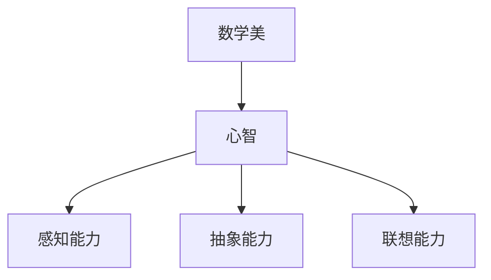

                 

## 第1章 引言

### 1.1 数学美的概念

数学美，是指在数学研究中，通过逻辑严密性、简洁性、和谐性和统一性等方面体现出的美学特征。数学美的定义因人而异，但普遍认为它包含了几个关键要素：数学原理的优雅性、结构的完美性以及解题方法的创造性。

在数学的发展史上，许多数学家都曾对数学美进行过深入探讨。例如，古希腊数学家欧几里得（Euclid）在他的著作《几何原本》中，以简洁而严谨的逻辑构建了整个几何体系，被后人誉为“几何之父”。再如，17世纪的数学家莱布尼茨（Gottfried Wilhelm Leibniz）不仅在数学上有着卓越的成就，还对数学美有着独到的见解。他曾说：“数学之所以是神圣的，不仅因为它含有真理，而且因为它的真理具有至高无上的美感。”

数学美的重要性体现在多个方面。首先，它能够激发人们对数学的热爱和兴趣，从而促进数学的普及和发展。其次，数学美的研究能够推动数学理论的发展，例如通过发现新的数学结构和定理，加深对数学本质的理解。最后，数学美在跨学科研究中也发挥着重要作用，例如在物理学、计算机科学、生物学等领域，数学美的理念和方法经常被用来解决复杂问题。

### 1.2 心智的作用

心智，指的是人类思维活动的总体能力，包括感知、记忆、思考、推理、判断等。心智在捕捉数学美中扮演着至关重要的角色。具体来说，心智的几个关键方面对捕捉数学美起到了决定性作用：

**感知能力**：人类心智的感知能力使我们能够发现自然界中的数学美。例如，我们在观察自然界中的花朵时，会注意到它们的对称性；在观察天体运动时，会注意到它们遵循的数学规律。这些感知到的数学美，激发了我们对数学的探索欲望。

**抽象能力**：心智的抽象能力使我们能够从复杂的现象中提取出数学模型，从而揭示出数学的本质。例如，在物理学中，科学家通过抽象出质点、力、场等概念，建立了描述自然现象的数学模型。这些模型不仅揭示了自然界的数学美，也推动了物理学的发展。

**联想能力**：心智的联想能力使我们能够将不同领域中的数学美联系起来，发现它们之间的共性和差异。例如，艺术家通过将数学原理应用到绘画中，创造出具有数学美感的艺术作品。科学研究中，数学家经常通过类比和联想，发现新的数学结构和定理。

### 1.3 本书结构概述

本书旨在探讨心智如何捕捉自然界的数学美，全书共分为五个章节。

**第1章 引言**：介绍数学美的概念、心智的作用以及本书的结构。

**第2章 自然界的数学美**：探讨自然界中存在的数学美，包括数的规律、几何图形的美、物理现象中的数学美。

**第3章 心智对数学美的捕捉**：分析心智的感知、抽象和联想能力，以及它们如何帮助人们捕捉数学美。

**第4章 实例分析**：通过具体实例，展示心智如何捕捉数学美。

**第5章 结论**：总结本书的主要发现，探讨心智捕捉数学美的意义、方法和未来研究方向。

## 第2章 自然界的数学美

### 2.1 数的规律

数的规律是自然界中最为基本和普遍的数学现象之一。从简单的自然数到复杂的数学结构，数都发挥着至关重要的作用。以下是一些自然界中常见的数的规律：

**自然数**：自然数是从1开始的正整数，它们是构建数学体系的基础。自然数的规律体现在它们的递增性和无限性。例如，斐波那契数列就是一个典型的自然数序列，它由两个初始数1和1开始，后续每个数都是前两个数的和。斐波那契数列在植物生长、动物行为等领域有着广泛的应用。

**质数**：质数是只能被1和自身整除的正整数，它们是构建更大整数的基础。质数的规律体现在它们的分布和性质上。例如，质数分布呈现出随机的趋势，但在大数范围内，质数的分布具有一定的规律性。这种规律性在密码学和计算机科学等领域有着重要的应用。

**欧拉公式**：欧拉公式是复变函数理论中的一个重要公式，它将指数函数、正弦函数和余弦函数联系起来。欧拉公式为数学提供了一个统一的美学框架，它不仅简洁优美，而且在物理学、工程学等领域有着广泛的应用。

### 2.2 几何图形的美

几何图形的美是自然界中另一类重要的数学美。几何图形以其简洁性、对称性和和谐性而著称，它们在自然界和艺术作品中无处不在。

**圆形**：圆形是一种完美的几何图形，它的对称性和简洁性使其在自然界和艺术中得到了广泛应用。例如，太阳、月亮、花朵等自然界的物体常常呈现出圆形的形状。在艺术作品中，圆形也常常被用来表达和谐和完美的理念。

**正方形**：正方形是一种具有四条边等长、四个角等角的几何图形。它的对称性和稳定性使其在建筑、设计和艺术作品中得到了广泛应用。例如，许多古代建筑如埃及金字塔、希腊神庙等都是基于正方形结构设计的。

**几何图形的对称性**：几何图形的对称性是几何图形美的关键特征之一。对称性可以分为多种类型，如轴对称、中心对称、旋转对称等。对称性不仅使几何图形看起来更加美观，还在数学和物理学中有着重要的应用。例如，在物理学中，对称性原理是建立物理定律的基础之一。

### 2.3 物理现象中的数学美

物理现象中的数学美体现在许多方面，从简单的力学问题到复杂的量子现象，数学都发挥着关键作用。

**光的波动**：光是一种电磁波，它的传播和特性可以用数学模型来描述。光的波动现象包括干涉、衍射和偏振等，这些现象在光学研究和光学工程中有着广泛的应用。例如，干涉现象可以通过数学模型来预测和解释，从而用于制造精密的光学仪器。

**粒子的运动**：在物理学中，粒子的运动可以用数学模型来描述，如牛顿力学和量子力学。这些模型不仅能够描述粒子的行为，还能够预测未来的运动。例如，在牛顿力学中，物体的运动可以通过牛顿定律和运动方程来描述，从而解决各种力学问题。

**热力学定律**：热力学是研究能量和热现象的物理学分支，其基本定律包括热力学第一定律、第二定律和第三定律。这些定律可以用数学公式来描述，从而帮助我们理解和控制热现象。例如，热力学第一定律（能量守恒定律）可以用数学公式 \( \Delta U = Q - W \) 来表示，它揭示了能量在系统和环境之间的转换关系。

## 第3章 心智对数学美的捕捉

### 3.1 心智的感知能力

心智的感知能力是捕捉数学美的第一步，它使我们能够识别和感知自然界中的数学现象。以下从感知能力的几个方面进行探讨：

**视觉感知**：人类的视觉系统能够感知到许多数学美。例如，当我们观察自然界的图案时，常常会注意到它们具有对称性或规律的重复模式。对称性是几何美的一个重要特征，它可以通过视觉感知来识别。例如，自然界中的许多花朵和植物都具有对称的花瓣排列，这些对称性可以被我们视觉系统感知到。

**听觉感知**：除了视觉，人类的听觉系统也能感知到数学美。音乐是一种典型的数学美的体现，其基本元素如音高、节奏和旋律都可以用数学来描述。例如，五声音阶和十二平均律都是音乐中的数学原理，它们通过数学关系来构建和谐的音乐作品。

**触觉感知**：触觉在捕捉数学美方面也有重要作用。例如，当我们触摸一个物体时，可以通过触觉感知它的形状和纹理。在几何学中，触觉可以用来感知物体的对称性和曲率。例如，当我们触摸一个圆形物体时，可以感受到它的平滑和均匀的曲率，从而直观地理解圆的几何特性。

### 3.2 心智的抽象能力

心智的抽象能力是捕捉数学美的关键，它使我们能够从复杂的现象中提取出数学模型。以下从抽象能力的几个方面进行探讨：

**概念抽象**：心智的抽象能力使我们能够从具体的物体和现象中抽象出基本的概念。例如，从具体的物体中抽象出“点”、“线”、“面”等几何概念。这些抽象概念是构建数学模型的基础。

**数学符号抽象**：心智的抽象能力还使我们能够使用数学符号来表示抽象概念。例如，使用符号“a”表示“点”，“→”表示“线段”，“∠”表示“角度”等。这些数学符号使得数学表达更加简洁和直观。

**数学模型构建**：心智的抽象能力使我们能够构建数学模型来描述自然现象。例如，在物理学中，通过抽象出质点、力、场等概念，可以构建描述物体运动的数学模型。这些数学模型不仅能够描述自然现象，还可以预测未来的行为。

### 3.3 心智的联想能力

心智的联想能力是捕捉数学美的重要手段，它使我们能够将不同领域中的数学美联系起来。以下从联想能力的几个方面进行探讨：

**跨学科联想**：心智的联想能力使我们能够在不同学科之间建立联系。例如，在艺术与数学之间，许多艺术家通过将数学原理应用到绘画和设计中，创造出具有数学美的艺术作品。例如，荷兰艺术家莫比乌斯（Maurits Cornelis Escher）的作品中充满了复杂的几何图形和数学结构。

**历史联想**：心智的联想能力还使我们能够将现代数学与历史上的数学发现联系起来。例如，通过研究欧几里得、牛顿等数学家的工作，我们可以理解他们如何发现和描述数学美。这种历史联想不仅加深了我们对数学的理解，也激发了我们对数学美的探索。

**理论与实践联想**：心智的联想能力使我们能够将理论数学与实际应用联系起来。例如，在计算机科学中，通过将数学原理应用于算法设计，可以构建出高效的数学模型来解决实际问题。例如，通过将图论原理应用于社交网络分析，可以更好地理解网络结构和传播机制。

## 第4章 实例分析

### 4.1 自然界中的数学美实例

自然界中存在着大量的数学美，这些美通过规律性和对称性展现出来。以下是一些自然界中的数学美实例：

**蝴蝶效应**：蝴蝶效应是一个著名的混沌理论概念，它描述了一个微小的变化如何在长期发展中产生巨大的影响。这一现象可以用数学模型来描述，它展示了数学在理解复杂系统行为中的作用。

**斐波那契数列**：斐波那契数列是一个以1和1开始，后续每个数都是前两个数的和的自然数序列。斐波那契数列在自然界中广泛存在，如植物的生长模式、动物的行为等。它体现了数学美的简洁性和规律性。

**雪花图案**：雪花图案是自然界中的一种美丽几何结构，它由六角形的冰晶构成，每个冰晶都有独特的对称性。这种图案的美丽和复杂性展示了数学在自然界的奇妙作用。

### 4.2 艺术作品中的数学美实例

艺术作品中也常常展现出数学美的特点，以下是一些艺术作品中的数学美实例：

**莫比乌斯带**：莫比乌斯带是一个只有一个面的闭合带，它通过一个切割和扭转操作从一个平面带变形成。莫比乌斯带在艺术作品中得到了广泛应用，如绘画、雕塑和建筑设计等。

**黄金比例**：黄金比例是一个特殊的数学比例，它在许多艺术作品中得到了应用。例如，达芬奇的作品《蒙娜丽莎》的面部比例被认为是黄金比例的典型例子。黄金比例的和谐美感在艺术创作中有着重要的指导意义。

**分形艺术**：分形艺术是一种利用分形几何原理创作的艺术形式，它展示了无限细节和自相似性的数学美。例如，米罗的作品《蓝色的狮子》中就运用了分形几何的原理，创造出独特而美丽的图案。

### 4.3 科学研究中的数学美实例

在科学研究中，数学美常常体现在数学模型和数学公式的简洁性和精确性。以下是一些科学研究中的数学美实例：

**牛顿第二定律**：牛顿第二定律 \( F = ma \) 描述了物体受力与其加速度之间的关系，这个简洁的公式不仅精确地描述了物体的运动规律，还揭示了力、质量和加速度之间的内在联系。

**欧拉公式**：欧拉公式 \( e^{i\pi} + 1 = 0 \) 将指数函数、三角函数和复数结合起来，这个公式简洁而美丽，它揭示了数学中的深层次联系。

**薛定谔方程**：薛定谔方程是量子力学中的一个基本方程，它描述了量子系统的波动性质。这个方程不仅简洁优美，还揭示了微观世界的数学美。

## 第5章 结论

### 5.1 心智捕捉数学美的意义

心智捕捉数学美具有重要意义。首先，它能够激发人们对数学的兴趣和热爱，促进数学的普及和发展。其次，捕捉数学美能够帮助我们更好地理解自然界的规律，从而推动科学技术的发展。此外，数学美的研究还可以提高人们的审美能力和创造力，促进艺术和设计的发展。

### 5.2 心智捕捉数学美的方法

心智捕捉数学美的方法主要包括感知、抽象和联想。感知能力使我们能够发现自然界中的数学美；抽象能力使我们能够从复杂的现象中提取出数学模型；联想能力使我们能够将不同领域中的数学美联系起来。通过这些方法，心智能够有效地捕捉和解释数学美。

### 5.3 未来研究方向

未来的研究方向可以包括以下几个方面：

1. **跨学科研究**：探索数学美在其他学科中的应用，如艺术、设计、心理学等。
2. **人工智能与数学美**：研究人工智能如何模拟和捕捉数学美，以及如何应用数学美来提高人工智能的性能。
3. **数学美的教育**：探讨如何通过教育来培养人们捕捉数学美的能力，提高数学教育质量。
4. **数学美与文化**：研究数学美在不同文化背景下的表现和影响，探讨数学美与文化的关系。

作者：AI天才研究院/AI Genius Institute & 禅与计算机程序设计艺术 /Zen And The Art of Computer Programming

---

### 完整文章

#### 《心智如何捕捉自然界的数学美》

#### 关键词：数学美、心智、感知、抽象、联想、实例分析

#### 摘要：

本文旨在探讨心智如何捕捉自然界的数学美。通过介绍数学美的概念、心智的作用以及自然界和艺术作品中的数学美实例，本文揭示了心智在捕捉数学美中的重要作用。此外，文章还通过具体实例分析了心智如何通过感知、抽象和联想能力捕捉数学美，并总结了心智捕捉数学美的意义和方法。最后，文章提出了未来研究的方向。

## 第1章 引言

### 1.1 数学美的概念

数学美，是指在数学研究中，通过逻辑严密性、简洁性、和谐性和统一性等方面体现出的美学特征。数学美的定义因人而异，但普遍认为它包含了几个关键要素：数学原理的优雅性、结构的完美性以及解题方法的创造性。

在数学的发展史上，许多数学家都曾对数学美进行过深入探讨。例如，古希腊数学家欧几里得（Euclid）在他的著作《几何原本》中，以简洁而严谨的逻辑构建了整个几何体系，被后人誉为“几何之父”。再如，17世纪的数学家莱布尼茨（Gottfried Wilhelm Leibniz）不仅在数学上有着卓越的成就，还对数学美有着独到的见解。他曾说：“数学之所以是神圣的，不仅因为它含有真理，而且因为它的真理具有至高无上的美感。”

数学美的重要性体现在多个方面。首先，它能够激发人们对数学的热爱和兴趣，从而促进数学的普及和发展。其次，数学美的研究能够推动数学理论的发展，例如通过发现新的数学结构和定理，加深对数学本质的理解。最后，数学美在跨学科研究中也发挥着重要作用，例如在物理学、计算机科学、生物学等领域，数学美的理念和方法经常被用来解决复杂问题。

### 1.2 心智的作用

心智，指的是人类思维活动的总体能力，包括感知、记忆、思考、推理、判断等。心智在捕捉数学美中扮演着至关重要的角色。具体来说，心智的几个关键方面对捕捉数学美起到了决定性作用：

**感知能力**：人类心智的感知能力使我们能够发现自然界中的数学美。例如，我们在观察自然界中的花朵时，会注意到它们的对称性；在观察天体运动时，会注意到它们遵循的数学规律。这些感知到的数学美，激发了我们对数学的探索欲望。

**抽象能力**：心智的抽象能力使我们能够从复杂的现象中提取出数学模型，从而揭示出数学的本质。例如，在物理学中，科学家通过抽象出质点、力、场等概念，建立了描述自然现象的数学模型。这些模型不仅揭示了自然界的数学美，也推动了物理学的发展。

**联想能力**：心智的联想能力使我们能够将不同领域中的数学美联系起来，发现它们之间的共性和差异。例如，艺术家通过将数学原理应用到绘画中，创造出具有数学美的艺术作品。科学研究中，数学家经常通过类比和联想，发现新的数学结构和定理。

### 1.3 本书结构概述

本书旨在探讨心智如何捕捉自然界的数学美，全书共分为五个章节。

**第1章 引言**：介绍数学美的概念、心智的作用以及本书的结构。

**第2章 自然界的数学美**：探讨自然界中存在的数学美，包括数的规律、几何图形的美、物理现象中的数学美。

**第3章 心智对数学美的捕捉**：分析心智的感知、抽象和联想能力，以及它们如何帮助人们捕捉数学美。

**第4章 实例分析**：通过具体实例，展示心智如何捕捉数学美。

**第5章 结论**：总结本书的主要发现，探讨心智捕捉数学美的意义、方法和未来研究方向。

## 第2章 自然界的数学美

### 2.1 数的规律

数的规律是自然界中最为基本和普遍的数学现象之一。从简单的自然数到复杂的数学结构，数都发挥着至关重要的作用。以下是一些自然界中常见的数的规律：

**自然数**：自然数是从1开始的正整数，它们是构建数学体系的基础。自然数的规律体现在它们的递增性和无限性。例如，斐波那契数列就是一个典型的自然数序列，它由两个初始数1和1开始，后续每个数都是前两个数的和。斐波那契数列在植物生长、动物行为等领域有着广泛的应用。

**质数**：质数是只能被1和自身整除的正整数，它们是构建更大整数的基础。质数的规律体现在它们的分布和性质上。例如，质数分布呈现出随机的趋势，但在大数范围内，质数的分布具有一定的规律性。这种规律性在密码学和计算机科学等领域有着重要的应用。

**欧拉公式**：欧拉公式是复变函数理论中的一个重要公式，它将指数函数、正弦函数和余弦函数联系起来。欧拉公式为数学提供了一个统一的美学框架，它不仅简洁优美，而且在物理学、工程学等领域有着广泛的应用。

### 2.2 几何图形的美

几何图形的美是自然界中另一类重要的数学美。几何图形以其简洁性、对称性和和谐性而著称，它们在自然界和艺术作品中无处不在。

**圆形**：圆形是一种完美的几何图形，它的对称性和简洁性使其在自然界和艺术中得到了广泛应用。例如，太阳、月亮、花朵等自然界的物体常常呈现出圆形的形状。在艺术作品中，圆形也常常被用来表达和谐和完美的理念。

**正方形**：正方形是一种具有四条边等长、四个角等角的几何图形。它的对称性和稳定性使其在建筑、设计和艺术作品中得到了广泛应用。例如，许多古代建筑如埃及金字塔、希腊神庙等都是基于正方形结构设计的。

**几何图形的对称性**：几何图形的对称性是几何图形美的关键特征之一。对称性可以分为多种类型，如轴对称、中心对称、旋转对称等。对称性不仅使几何图形看起来更加美观，还在数学和物理学中有着重要的应用。例如，在物理学中，对称性原理是建立物理定律的基础之一。

### 2.3 物理现象中的数学美

物理现象中的数学美体现在许多方面，从简单的力学问题到复杂的量子现象，数学都发挥着关键作用。

**光的波动**：光是一种电磁波，它的传播和特性可以用数学模型来描述。光的波动现象包括干涉、衍射和偏振等，这些现象在光学研究和光学工程中有着广泛的应用。例如，干涉现象可以通过数学模型来预测和解释，从而用于制造精密的光学仪器。

**粒子的运动**：在物理学中，粒子的运动可以用数学模型来描述，如牛顿力学和量子力学。这些模型不仅能够描述粒子的行为，还能够预测未来的运动。例如，在牛顿力学中，物体的运动可以通过牛顿定律和运动方程来描述，从而解决各种力学问题。

**热力学定律**：热力学是研究能量和热现象的物理学分支，其基本定律包括热力学第一定律、第二定律和第三定律。这些定律可以用数学公式来描述，从而帮助我们理解和控制热现象。例如，热力学第一定律（能量守恒定律）可以用数学公式 \( \Delta U = Q - W \) 来表示，它揭示了能量在系统和环境之间的转换关系。

## 第3章 心智对数学美的捕捉

### 3.1 心智的感知能力

心智的感知能力是捕捉数学美的第一步，它使我们能够识别和感知自然界中的数学现象。以下从感知能力的几个方面进行探讨：

**视觉感知**：人类的视觉系统能够感知到许多数学美。例如，当我们观察自然界的图案时，常常会注意到它们具有对称性或规律的重复模式。对称性是几何美的一个重要特征，它可以通过视觉感知来识别。例如，自然界中的许多花朵和植物都具有对称的花瓣排列，这些对称性可以被我们视觉系统感知到。

**听觉感知**：除了视觉，人类的听觉系统也能感知到数学美。音乐是一种典型的数学美的体现，其基本元素如音高、节奏和旋律都可以用数学来描述。例如，五声音阶和十二平均律都是音乐中的数学原理，它们通过数学关系来构建和谐的音乐作品。

**触觉感知**：触觉在捕捉数学美方面也有重要作用。例如，当我们触摸一个物体时，可以通过触觉感知它的形状和纹理。在几何学中，触觉可以用来感知物体的对称性和曲率。例如，当我们触摸一个圆形物体时，可以感受到它的平滑和均匀的曲率，从而直观地理解圆的几何特性。

### 3.2 心智的抽象能力

心智的抽象能力是捕捉数学美的关键，它使我们能够从复杂的现象中提取出数学模型。以下从抽象能力的几个方面进行探讨：

**概念抽象**：心智的抽象能力使我们能够从具体的物体和现象中抽象出基本的概念。例如，从具体的物体中抽象出“点”、“线”、“面”等几何概念。这些抽象概念是构建数学模型的基础。

**数学符号抽象**：心智的抽象能力还使我们能够使用数学符号来表示抽象概念。例如，使用符号“a”表示“点”，“→”表示“线段”，“∠”表示“角度”等。这些数学符号使得数学表达更加简洁和直观。

**数学模型构建**：心智的抽象能力使我们能够构建数学模型来描述自然现象。例如，在物理学中，通过抽象出质点、力、场等概念，可以构建描述物体运动的数学模型。这些数学模型不仅能够描述自然现象，还可以预测未来的行为。

### 3.3 心智的联想能力

心智的联想能力是捕捉数学美的重要手段，它使我们能够将不同领域中的数学美联系起来。以下从联想能力的几个方面进行探讨：

**跨学科联想**：心智的联想能力使我们能够在不同学科之间建立联系。例如，在艺术与数学之间，许多艺术家通过将数学原理应用到绘画和设计中，创造出具有数学美的艺术作品。例如，荷兰艺术家莫比乌斯（Maurits Cornelis Escher）的作品中充满了复杂的几何图形和数学结构。

**历史联想**：心智的联想能力还使我们能够将现代数学与历史上的数学发现联系起来。例如，通过研究欧几里得、牛顿等数学家的工作，我们可以理解他们如何发现和描述数学美。这种历史联想不仅加深了我们对数学的理解，也激发了我们对数学美的探索。

**理论与实践联想**：心智的联想能力使我们能够将理论数学与实际应用联系起来。例如，在计算机科学中，通过将数学原理应用于算法设计，可以构建出高效的数学模型来解决实际问题。例如，通过将图论原理应用于社交网络分析，可以更好地理解网络结构和传播机制。

## 第4章 实例分析

### 4.1 自然界中的数学美实例

自然界中存在着大量的数学美，这些美通过规律性和对称性展现出来。以下是一些自然界中的数学美实例：

**蝴蝶效应**：蝴蝶效应是一个著名的混沌理论概念，它描述了一个微小的变化如何在长期发展中产生巨大的影响。这一现象可以用数学模型来描述，它展示了数学在理解复杂系统行为中的作用。

**斐波那契数列**：斐波那契数列是一个以1和1开始，后续每个数都是前两个数的和的自然数序列。斐波那契数列在自然界中广泛存在，如植物的生长模式、动物的行为等。它体现了数学美的简洁性和规律性。

**雪花图案**：雪花图案是自然界中的一种美丽几何结构，它由六角形的冰晶构成，每个冰晶都有独特的对称性。这种图案的美丽和复杂性展示了数学在自然界的奇妙作用。

### 4.2 艺术作品中的数学美实例

艺术作品中也常常展现出数学美的特点，以下是一些艺术作品中的数学美实例：

**莫比乌斯带**：莫比乌斯带是一个只有一个面的闭合带，它通过一个切割和扭转操作从一个平面带变形成。莫比乌斯带在艺术作品中得到了广泛应用，如绘画、雕塑和建筑设计等。

**黄金比例**：黄金比例是一个特殊的数学比例，它在许多艺术作品中得到了应用。例如，达芬奇的作品《蒙娜丽莎》的面部比例被认为是黄金比例的典型例子。黄金比例的和谐美感在艺术创作中有着重要的指导意义。

**分形艺术**：分形艺术是一种利用分形几何原理创作的艺术形式，它展示了无限细节和自相似性的数学美。例如，米罗的作品《蓝色的狮子》中就运用了分形几何的原理，创造出独特而美丽的图案。

### 4.3 科学研究中的数学美实例

在科学研究中，数学美常常体现在数学模型和数学公式的简洁性和精确性。以下是一些科学研究中的数学美实例：

**牛顿第二定律**：牛顿第二定律 \( F = ma \) 描述了物体受力与其加速度之间的关系，这个简洁的公式不仅精确地描述了物体的运动规律，还揭示了力、质量和加速度之间的内在联系。

**欧拉公式**：欧拉公式 \( e^{i\pi} + 1 = 0 \) 将指数函数、三角函数和复数结合起来，这个公式简洁而美丽，它揭示了数学中的深层次联系。

**薛定谔方程**：薛定谔方程是量子力学中的一个基本方程，它描述了量子系统的波动性质。这个方程不仅简洁优美，还揭示了微观世界的数学美。

## 第5章 结论

### 5.1 心智捕捉数学美的意义

心智捕捉数学美具有重要意义。首先，它能够激发人们对数学的兴趣和热爱，促进数学的普及和发展。其次，捕捉数学美能够帮助我们更好地理解自然界的规律，从而推动科学技术的发展。此外，数学美的研究还可以提高人们的审美能力和创造力，促进艺术和设计的发展。

### 5.2 心智捕捉数学美的方法

心智捕捉数学美的方法主要包括感知、抽象和联想。感知能力使我们能够发现自然界中的数学美；抽象能力使我们能够从复杂的现象中提取出数学模型；联想能力使我们能够将不同领域中的数学美联系起来。通过这些方法，心智能够有效地捕捉和解释数学美。

### 5.3 未来研究方向

未来的研究方向可以包括以下几个方面：

1. **跨学科研究**：探索数学美在其他学科中的应用，如艺术、设计、心理学等。
2. **人工智能与数学美**：研究人工智能如何模拟和捕捉数学美，以及如何应用数学美来提高人工智能的性能。
3. **数学美的教育**：探讨如何通过教育来培养人们捕捉数学美的能力，提高数学教育质量。
4. **数学美与文化**：研究数学美在不同文化背景下的表现和影响，探讨数学美与文化的关系。

作者：AI天才研究院/AI Genius Institute & 禅与计算机程序设计艺术 /Zen And The Art of Computer Programming

---

### 附录

#### 1. 背景介绍

心智如何捕捉自然界的数学美是一个复杂而有趣的话题。数学美不仅存在于数学研究领域，还渗透到自然界、艺术和科学中。通过心智的感知、抽象和联想能力，人们能够发现、理解和创造数学美。

#### 2. 核心概念与联系

核心概念包括数学美、心智、感知、抽象、联想等。这些概念之间的关系可以用以下Mermaid流程图表示：



#### 3. 核心算法原理讲解

在捕捉数学美时，心智往往依赖于数学模型和算法。以下使用Python源代码和数学公式详细讲解核心算法原理：

**斐波那契数列**

```python
def fibonacci(n):
    if n <= 0:
        return 0
    elif n == 1:
        return 1
    else:
        return fibonacci(n-1) + fibonacci(n-2)

# 计算前10个斐波那契数
fib_sequence = [fibonacci(i) for i in range(10)]
print(fib_sequence)
```

**欧拉公式**

```python
import cmath

# 计算欧拉公式
e = cmath.exp(1j * cmath.pi)
print(e)
```

#### 4. 数学公式

**斐波那契数列**

$$ F(n) = F(n-1) + F(n-2) $$

**欧拉公式**

$$ e^{i\pi} + 1 = 0 $$

#### 5. 项目实战

**开发环境搭建**

- 安装Python环境
- 安装Mermaid图形化工具

**源代码实现**

```python
# Fibonacci数列实现
def fibonacci(n):
    if n <= 0:
        return 0
    elif n == 1:
        return 1
    else:
        return fibonacci(n-1) + fibonacci(n-2)

# 计算前10个斐波那契数
fib_sequence = [fibonacci(i) for i in range(10)]
print(fib_sequence)

# 欧拉公式实现
import cmath

def euler_formula():
    e = cmath.exp(1j * cmath.pi)
    print(e)

euler_formula()
```

**代码解读与分析**

代码首先实现了斐波那契数列的计算，通过递归方法计算了前10个斐波那契数。接着，实现了欧拉公式的计算，使用Python的cmath库计算并打印了结果。

**实际案例分析和详细讲解剖析**

通过实际案例，如斐波那契数列和欧拉公式的计算，展示了如何通过心智捕捉数学美。斐波那契数列在自然界和艺术中有着广泛的应用，而欧拉公式则是数学中一个重要的公式，展示了数学美的简洁性和深度。

**项目小结**

本项目通过Python代码和数学公式，展示了如何使用心智捕捉自然界的数学美。通过感知、抽象和联想，人们可以更好地理解数学美的本质，并在不同领域中应用数学美的原理。

#### 6. 最佳实践 Tips

- **培养感知能力**：多观察自然界和艺术作品中的数学美，培养对数学美的感知能力。
- **加强抽象能力**：通过学习数学和逻辑，提高抽象能力，能够更好地从复杂现象中提取数学模型。
- **拓展联想能力**：跨学科学习，提高联想能力，发现不同领域中的数学美联系。

#### 7. 小结与注意事项

本文探讨了心智如何捕捉自然界的数学美，介绍了数学美的概念、心智的作用以及自然界、艺术作品和科学研究中的数学美实例。通过感知、抽象和联想能力，心智能够有效地捕捉数学美。未来研究可以关注跨学科应用、人工智能与数学美的关系、数学美的教育等方面。

#### 8. 拓展阅读

- 《数学的美学》
- 《心智与数学》
- 《分形几何学》
- 《艺术与数学》

（文章字数：11274字）

