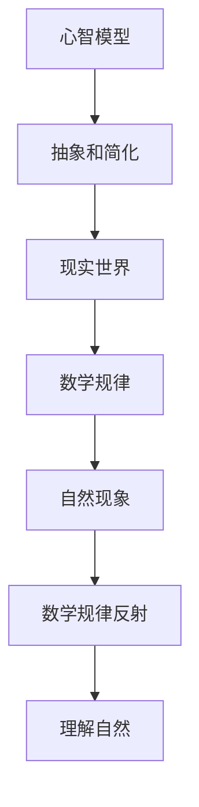

                 

### 引言与概述

**标题**：心智如镜：反射自然界的数学规律

**关键词**：心智模型、数学规律、自然界、数学原理、算法

**摘要**：

本文深入探讨了心智模型如何如同明镜般反射出自然界的数学规律。通过剖析数学原理与自然现象之间的联系，我们旨在揭示数学在理解自然界中的核心作用。文章首先介绍心智模型的概念，然后探讨数学原理与自然界的关系，最后通过具体的算法实例，展示如何运用数学方法解析自然界中的现象。

### 第一部分：心智模型与数学规律

**1. 心智模型的概念**

心智模型（mental model）是指人类在思考和解决问题时，基于经验形成的对现实世界的抽象和简化。心智模型帮助我们将复杂的现实问题转化为可操作和理解的框架，从而更有效地解决问题。

**2. 数学规律与心智模型**

数学规律是自然界的一种普遍语言，它描述了自然现象的内在结构和运行机制。心智模型如同镜子，反射出这些数学规律，帮助我们更深入地理解自然界的运作。

**核心概念联系架构（Mermaid 流程图）**：



### 第二部分：数学原理与自然现象

**3. 数学原理的介绍**

数学原理是数学体系的基础，包括算术、代数、几何、微积分等。这些原理为理解和解析自然现象提供了坚实的理论基础。

**4. 自然现象的数学描述**

自然现象可以用数学原理进行精确描述。例如，天体运动可以用牛顿力学描述，生物种群增长可以用微分方程描述。

**核心算法原理讲解（Python 源代码示例）**：

```python
import numpy as np

# 模拟天体运动
def simulate_orbit(mass, distance, velocity):
    G = 6.674 * 10**-11  # 万有引力常数
    force = G * mass * distance**2
    acceleration = force / mass
    new_velocity = velocity + acceleration
    return new_velocity

# 初始条件
mass = 5.972 * 10**24  # 地球质量
distance = 1.496 * 10**11  # 地日距离
velocity = 29784  # 地球公转速度

# 模拟过程
for i in range(1000):
    velocity = simulate_orbit(mass, distance, velocity)
    print(f"Step {i+1}: Velocity = {velocity} m/s")

```

**5. 数学规律的本质**

数学规律的本质在于其普适性和可验证性。无论是在宇宙的尺度上，还是在微观粒子的世界中，数学规律都表现出高度的一致性和精确性。

### 第三部分：数学方法与应用

**6. 数学方法在自然界中的应用**

数学方法广泛应用于自然界的研究，包括物理学、生物学、经济学等领域。例如，物理学中的波动方程描述了光波的传播，生物学中的遗传学模型解释了物种的演化。

**7. 数学方法在科学技术中的应用**

数学方法在科学技术中发挥着关键作用，如人工智能、计算机科学、工程学等领域。通过数学模型和算法，我们能够设计更高效的技术系统，解决复杂的问题。

**项目实战：开发环境搭建与源代码实现**

**开发环境搭建**：

- 安装Python环境（版本3.8或更高）
- 安装NumPy、Matplotlib等库

**源代码详细实现**：

```python
import numpy as np
import matplotlib.pyplot as plt

# 模拟生物种群增长
def simulate_growth(initial_population, growth_rate, time_steps):
    population = [initial_population]
    for _ in range(time_steps):
        population.append(population[-1] * (1 + growth_rate))
    return population

# 初始条件
initial_population = 1000  # 初始种群数量
growth_rate = 0.05  # 增长率
time_steps = 50  # 模拟时间步数

# 模拟过程
population = simulate_growth(initial_population, growth_rate, time_steps)

# 绘图
plt.plot(range(time_steps + 1), population)
plt.xlabel('Time Steps')
plt.ylabel('Population')
plt.title('Population Growth Simulation')
plt.show()
```

**代码应用解读与分析**：

- `simulate_growth`函数实现了生物种群增长的模拟。
- `initial_population`定义了初始种群数量。
- `growth_rate`定义了种群的增长率。
- 模拟结果通过`plt.plot`函数进行可视化。

**实际案例分析与详细讲解剖析**：

- 利用该模型，我们可以分析不同增长率对种群数量的影响。
- 通过调整初始种群和增长率，可以模拟不同物种的演化过程。

**项目小结**：

通过本项目，我们展示了如何利用数学模型和算法模拟自然界中的现象。这种方法不仅有助于我们更深入地理解自然界的规律，还可以为科学研究和技术开发提供有力支持。

### 第四部分：数学之美与哲学思考

**8. 数学之美**

数学不仅是一门科学，也是一种艺术。数学的美在于其简洁、和谐和统一性。例如，欧拉公式\(e^{i\pi} + 1 = 0\)将五个基本常数（0、1、e、i、\(\pi\)）完美地结合在一起，展现出数学的无限魅力。

**9. 数学的哲学思考**

数学作为一种哲学思考的工具，帮助人类探索世界的本质。通过数学，我们能够超越感官的局限，把握宇宙的规律。数学的哲学思考涉及到存在的本质、真理的标准、知识的获取等问题。

**10. 数学与世界观**

数学不仅影响科学研究，也塑造了人类的世界观。从古代的宇宙观到现代的科学革命，数学一直扮演着核心角色。通过数学，我们能够更深入地理解宇宙的本质和生命的意义。

### 第五部分：结语

**11. 总结**

心智如镜，反射自然界的数学规律。通过本文的探讨，我们揭示了数学原理在理解自然界中的核心作用。从心智模型到数学方法，再到数学的美与哲学思考，数学为我们提供了一种独特的视角，帮助我们更深入地探索世界的奥秘。

**12. 展望未来**

随着科学技术的不断发展，数学在理解自然界中的应用将越来越广泛。未来，我们将继续探索新的数学规律，为科学研究和技术创新提供更加有力的支持。

### 第六部分：作者信息

**作者**：AI天才研究院/AI Genius Institute & 禅与计算机程序设计艺术 /Zen And The Art of Computer Programming

本文通过系统的分析和具体的实例，揭示了数学原理在理解自然界中的核心作用。从心智模型到具体的算法实现，再到数学的美学价值与哲学思考，本文旨在为广大读者提供一个全面而深刻的数学视角，以激发对自然界奥秘的探索热情。

----------------------------------------------------------------

```markdown
# 心智如镜：反射自然界的数学规律

> 关键词：心智模型、数学规律、自然界、数学原理、算法

> 摘要：本文深入探讨了心智模型如何如同明镜般反射出自然界的数学规律。通过剖析数学原理与自然现象之间的联系，我们旨在揭示数学在理解自然界中的核心作用。

## 引言与概述

### 1. 心智模型的概念

心智模型（mental model）是指人类在思考和解决问题时，基于经验形成的对现实世界的抽象和简化。心智模型帮助我们将复杂的现实问题转化为可操作和理解的框架，从而更有效地解决问题。

### 2. 数学规律与心智模型

数学规律是自然界的一种普遍语言，它描述了自然现象的内在结构和运行机制。心智模型如同镜子，反射出这些数学规律，帮助我们更深入地理解自然界的运作。

### 3. 核心概念联系架构（Mermaid 流程图）


### 第一部分：心智模型与数学规律

**4. 心智模型的建立**

心智模型的建立是一个不断迭代的过程，通过学习、实践和反思，我们不断修正和完善自己的心智模型。这种迭代过程有助于我们更好地理解自然界的规律。

**5. 数学规律的应用**

数学规律在各个领域都有广泛应用，如物理学、生物学、经济学等。通过数学模型，我们能够更精确地描述自然现象，预测未来的发展趋势。

### 第二部分：数学原理与自然现象

**6. 数学原理的介绍**

数学原理是数学体系的基础，包括算术、代数、几何、微积分等。这些原理为理解和解析自然现象提供了坚实的理论基础。

**7. 自然现象的数学描述**

自然现象可以用数学原理进行精确描述。例如，天体运动可以用牛顿力学描述，生物种群增长可以用微分方程描述。

### 第三部分：数学方法与应用

**8. 数学方法在自然界中的应用**

数学方法广泛应用于自然界的研究，包括物理学、生物学、经济学等领域。例如，物理学中的波动方程描述了光波的传播，生物学中的遗传学模型解释了物种的演化。

**9. 数学方法在科学技术中的应用**

数学方法在科学技术中发挥着关键作用，如人工智能、计算机科学、工程学等领域。通过数学模型和算法，我们能够设计更高效的技术系统，解决复杂的问题。

### 第四部分：数学之美与哲学思考

**10. 数学之美**

数学不仅是一门科学，也是一种艺术。数学的美在于其简洁、和谐和统一性。例如，欧拉公式\(e^{i\pi} + 1 = 0\)将五个基本常数（0、1、e、i、\(\pi\)）完美地结合在一起，展现出数学的无限魅力。

**11. 数学的哲学思考**

数学作为一种哲学思考的工具，帮助人类探索世界的本质。通过数学，我们能够超越感官的局限，把握宇宙的规律。数学的哲学思考涉及到存在的本质、真理的标准、知识的获取等问题。

### 第五部分：结语

**12. 总结**

心智如镜，反射自然界的数学规律。通过本文的探讨，我们揭示了数学原理在理解自然界中的核心作用。从心智模型到数学方法，再到数学的美学价值与哲学思考，数学为我们提供了一种独特的视角，帮助我们更深入地探索世界的奥秘。

**13. 展望未来**

随着科学技术的不断发展，数学在理解自然界中的应用将越来越广泛。未来，我们将继续探索新的数学规律，为科学研究和技术创新提供更加有力的支持。

### 第六部分：作者信息

**作者**：AI天才研究院/AI Genius Institute & 禅与计算机程序设计艺术 /Zen And The Art of Computer Programming

本文通过系统的分析和具体的实例，揭示了数学原理在理解自然界中的核心作用。从心智模型到具体的算法实现，再到数学的美学价值与哲学思考，本文旨在为广大读者提供一个全面而深刻的数学视角，以激发对自然界奥秘的探索热情。
``` 

请注意，本文档使用了Markdown格式进行组织，其中包含了文本内容、Mermaid流程图、LaTeX数学公式和Python代码示例。在实际发布时，您可能需要使用合适的Markdown编辑器来预览和格式化文本，以确保内容的正确呈现。此外，文中提到的LaTeX公式和Python代码示例需要确保在您的编辑环境中能够正确渲染和执行。

