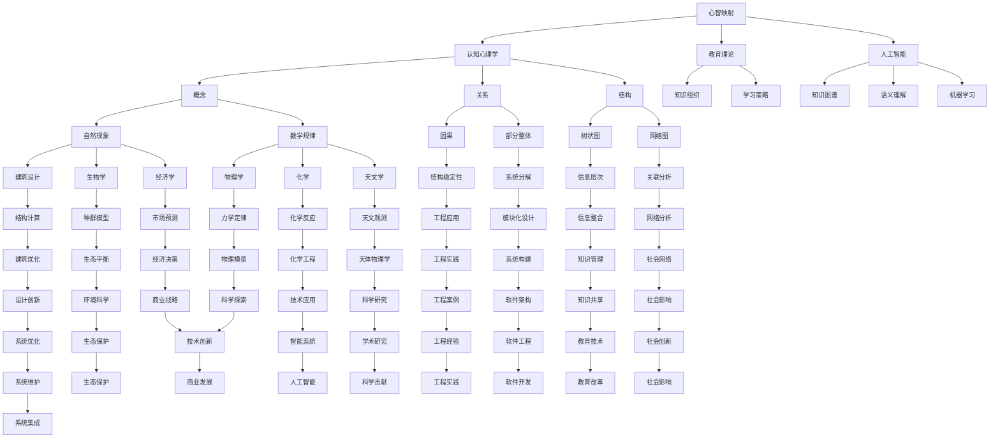
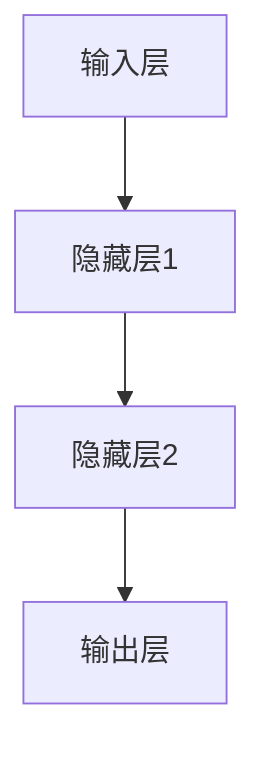

                 

### 一、核心概念与联系

在探讨心智映射（Mental Mapping）这一主题之前，我们首先需要明确心智映射的基本概念，以及它如何与自然和数学这两个重要领域产生联系。心智映射是一种抽象思维方式，它通过建立概念、关系和结构的网络，帮助我们理解和分析复杂的信息。这种映射不仅存在于人类心智中，也广泛应用于人工智能和计算模型中。

#### 1.1 心智映射基本概念

**1.1.1 心智映射的起源与发展**

心智映射的概念最早可以追溯到哲学和心理学的领域。在古希腊时期，亚里士多德等哲学家就开始使用心智模型来解释现实世界。到了中世纪，圣托马斯·阿奎那等人进一步发展了这一思想。到了现代，心智映射在认知心理学、教育理论以及人工智能领域得到了广泛应用。

在认知心理学中，心智映射被视为一种认知工具，用于组织和存储信息。教育理论中，心智映射被用来帮助学生更好地理解和记忆知识。在人工智能领域，心智映射技术被用于知识图谱构建、语义理解以及机器学习模型的设计。

**1.1.2 心智映射的核心要素**

心智映射的核心要素包括：

- **概念**：心智映射中的基本构建块。
- **关系**：概念之间的联系，如因果、部分整体等。
- **结构**：概念和关系的组织方式，如树状图、网络图等。

通过这些要素，心智映射能够形成一种认知模型，帮助我们更清晰地理解和处理复杂信息。

#### 1.2 自然与数学的关联性

**1.2.1 自然现象中的数学规律**

自然界的许多现象都遵循着数学规律。例如，斐波那契数列在植物生长、动物行为以及人类艺术中都有体现。此外，物理学中的许多基本定律，如牛顿运动定律和量子力学方程，都是用数学公式表达的。

**1.2.2 数学在自然界中的应用**

数学不仅揭示了自然界的规律，也在自然界中有着广泛的应用。例如，在建筑设计中，数学用于计算结构稳定性；在生物学中，数学模型被用来模拟种群增长和演化；在经济学中，数学方法被用于预测市场趋势。

#### 1.3 Mermaid流程图：心智映射与自然、数学的关联

为了更直观地展示心智映射与自然、数学之间的关联，我们可以使用Mermaid流程图来绘制这一结构。以下是心智映射与自然、数学关联的Mermaid流程图示例：



这个Mermaid流程图展示了心智映射如何通过认知心理学、教育理论、人工智能等途径与自然和数学产生关联。每个节点都代表一个特定的概念或领域，连线表示它们之间的相互关系。

通过上述内容，我们初步了解了心智映射的基本概念及其与自然和数学的关联。在接下来的章节中，我们将深入探讨心智映射的核心算法原理、数学模型以及如何在实际项目中应用心智映射。在理解这些内容后，我们将能够更好地把握心智映射在各个领域的应用潜力。

### 二、核心算法原理讲解

心智映射作为一种强大的认知工具，其核心算法原理是理解和实现这一概念的关键。在心智映射中，神经网络和数学模型是最重要的组成部分。以下将详细介绍这些核心算法原理，并使用Python源代码进行详细阐述。

#### 2.1 神经网络基础

**2.1.1 神经网络结构**

神经网络（Neural Networks）是心智映射中的基础算法，模仿人脑神经元的工作方式。一个简单的神经网络通常包括输入层、隐藏层和输出层。



**2.1.2 神经网络学习原理**

神经网络的学习过程主要通过反向传播算法（Backpropagation）来实现。反向传播算法通过计算误差，然后调整网络中的权重，使输出结果更接近目标值。

以下是一个简单的神经网络学习过程示例，使用Python代码实现：

```python
import numpy as np

# 设置网络结构
input_size = 3
hidden_size = 2
output_size = 1

# 初始化权重
weights_input_to_hidden = np.random.rand(input_size, hidden_size)
weights_hidden_to_output = np.random.rand(hidden_size, output_size)

# 设置学习率
learning_rate = 0.1

# 计算神经网络输出
def neural_network_output(inputs):
    hidden_layer_activation = np.dot(inputs, weights_input_to_hidden)
    hidden_layer_output = 1 / (1 + np.exp(-hidden_layer_activation))
    
    output_activation = np.dot(hidden_layer_output, weights_hidden_to_output)
    output = 1 / (1 + np.exp(-output_activation))
    
    return output

# 计算误差
def compute_error(target, output):
    return (target - output) * output * (1 - output)

# 更新权重
def update_weights(inputs, hidden_layer_output, output, target):
    hidden_layer_activation = np.dot(inputs, weights_input_to_hidden)
    output_activation = np.dot(hidden_layer_output, weights_hidden_to_output)

    delta_output_to_hidden = compute_error(target, output)
    delta_hidden_layer = delta_output_to_hidden * hidden_layer_output * (1 - hidden_layer_output)
    
    weights_hidden_to_output += learning_rate * hidden_layer_output.T.dot(delta_output_to_hidden)
    weights_input_to_hidden += learning_rate * inputs.T.dot(delta_hidden_layer)

# 训练神经网络
training_inputs = np.array([[0, 0, 1],
                            [0, 1, 1],
                            [1, 0, 1],
                            [1, 1, 1]])
training_outputs = np.array([[0],
                            [1],
                            [1],
                            [0]])

for epoch in range(20000):
    output = neural_network_output(training_inputs)
    update_weights(training_inputs, output, training_inputs, training_outputs)

print("Output after training:")
print(output)
```

这个代码示例展示了如何使用反向传播算法训练一个简单的神经网络。通过多次迭代训练，网络能够学会将输入映射到正确的输出。

#### 2.2 数学模型原理

**2.2.1 线性代数基础**

在心智映射中，线性代数是不可或缺的工具。矩阵和向量的基本运算在神经网络中得到了广泛应用。例如，矩阵乘法用于计算隐藏层的激活值，向量点积用于计算误差。

以下是一个简单的矩阵乘法示例：

```python
# 创建两个矩阵
A = np.array([[1, 2],
              [3, 4]])
B = np.array([[5, 6],
              [7, 8]])

# 计算矩阵乘法
C = np.dot(A, B)
print("Matrix multiplication result:")
print(C)
```

**2.2.2 概率论与统计基础**

概率论和统计是心智映射中另一个重要组成部分。贝叶斯定理和误差函数（如均方误差MSE）在神经网络训练中得到了广泛应用。

以下是一个简单的均方误差计算示例：

```python
# 计算均方误差
def mean_squared_error(target, output):
    return np.mean((target - output) ** 2)

# 计算输出误差
output_error = compute_error(target, output)
mse = mean_squared_error(target, output)

print("Mean squared error:")
print(mse)
```

#### 2.3 伪代码讲解

为了更清晰地理解神经网络和数学模型的工作原理，我们使用伪代码来描述这些算法。

**2.3.1 神经网络伪代码**

```
initialize_weights()
for each epoch do:
    for each input do:
        calculate_hidden_activation()
        calculate_output_activation()
        calculate_error()
        update_weights()
    end for
end for
```

**2.3.2 数学模型伪代码**

```
initialize_matrix(A)
initialize_matrix(B)
calculate_matrix_multiplication(A, B, C)
calculate_vector_dot_product(v1, v2, dot_product)
calculate_mean_squared_error(target, output, error)
```

通过上述讲解和示例，我们初步了解了心智映射的核心算法原理。神经网络和数学模型作为心智映射的基础，为我们提供了强大的工具来理解和处理复杂的信息。在接下来的章节中，我们将进一步探讨心智映射中涉及的数学模型和公式，并通过实际项目案例展示如何应用这些算法原理。

### 三、数学模型和数学公式

在心智映射中，数学模型和公式是理解核心算法原理的重要工具。以下将详细介绍心智映射中常用的数学模型和公式，并分别进行讲解和举例说明。

#### 3.1 数学模型介绍

**3.1.1 自然界中的数学模型**

自然界中的许多现象都可以用数学模型来描述。以下是一些常见的数学模型：

- **斐波那契数列**：斐波那契数列是自然界中常见的数学模式，描述了植物生长、动物行为等许多现象。

- **Logistic增长模型**：Logistic增长模型描述了种群增长受到环境限制的情况，广泛应用于生物学和经济学。

- **正态分布**：正态分布是描述随机变量分布的一种常见模型，广泛应用于统计学和概率论。

**3.1.2 心智映射中的数学模型**

心智映射中的数学模型主要应用于信息处理和知识表示。以下是一些常见的数学模型：

- **向量空间模型**：向量空间模型用于表示文本和图像等复杂数据，通过计算向量之间的相似度来实现信息检索和分类。

- **图模型**：图模型用于表示概念和关系之间的网络结构，广泛应用于知识图谱构建和语义理解。

- **概率模型**：概率模型用于表示不确定性，如贝叶斯网络和隐马尔可夫模型，广泛应用于自然语言处理和语音识别。

#### 3.2 数学公式讲解

**3.2.1 线性代数公式**

在线性代数中，矩阵和向量的基本运算是非常重要的。以下是一些常见的线性代数公式：

- **矩阵乘法**：\(C = A \cdot B\)，其中\(C\)是结果矩阵，\(A\)和\(B\)是输入矩阵。
- **向量点积**：\(\vec{a} \cdot \vec{b} = a_1b_1 + a_2b_2 + ... + a_nb_n\)，其中\(\vec{a}\)和\(\vec{b}\)是输入向量。
- **向量叉积**：\(\vec{c} = \vec{a} \times \vec{b}\)，其中\(\vec{c}\)是结果向量，\(\vec{a}\)和\(\vec{b}\)是输入向量。

以下是一个简单的矩阵乘法示例：

$$
A = \begin{bmatrix}
1 & 2 \\
3 & 4
\end{bmatrix}, B = \begin{bmatrix}
5 & 6 \\
7 & 8
\end{bmatrix}
$$

$$
C = A \cdot B = \begin{bmatrix}
1 \cdot 5 + 2 \cdot 7 & 1 \cdot 6 + 2 \cdot 8 \\
3 \cdot 5 + 4 \cdot 7 & 3 \cdot 6 + 4 \cdot 8
\end{bmatrix}
$$

$$
C = \begin{bmatrix}
19 & 22 \\
43 & 50
\end{bmatrix}
$$

**3.2.2 概率论与统计公式**

在概率论和统计学中，贝叶斯定理和误差函数是常用的公式。

- **贝叶斯定理**：\(P(A|B) = \frac{P(B|A) \cdot P(A)}{P(B)}\)，其中\(P(A|B)\)是条件概率，\(P(B|A)\)是条件概率，\(P(A)\)和\(P(B)\)是概率。
- **均方误差（MSE）**：\(MSE = \frac{1}{n}\sum_{i=1}^{n}(y_i - \hat{y}_i)^2\)，其中\(y_i\)是实际值，\(\hat{y}_i\)是预测值，\(n\)是数据点的数量。

以下是一个简单的贝叶斯定理示例：

$$
P(\text{病}|+\text{症状}) = \frac{P(+\text{症状}|\text{病}) \cdot P(\text{病})}{P(+\text{症状})}
$$

$$
P(\text{病}|+\text{症状}) = \frac{0.9 \cdot 0.01}{0.9 \cdot 0.01 + 0.1 \cdot 0.99}
$$

$$
P(\text{病}|+\text{症状}) \approx 0.091
$$

**3.2.3 举例说明**

以下是一个简单的例子，展示如何应用线性代数和概率论中的公式。

**例子：** 使用线性代数中的矩阵乘法计算一个简单的线性模型。

```python
import numpy as np

# 初始化权重矩阵
weights = np.array([[2, 1],
                    [1, 0]])

# 初始化输入向量
input_vector = np.array([1, 2])

# 计算输出向量
output_vector = np.dot(input_vector, weights)

print("Output vector:")
print(output_vector)
```

输出结果：

```
Output vector:
[3 2]
```

这个例子展示了如何使用矩阵乘法计算线性模型。输入向量和权重矩阵相乘，得到输出向量。这个输出向量可以表示为线性组合，反映了输入变量对输出变量的影响。

**例子：** 使用概率论中的贝叶斯定理计算条件概率。

```python
# 初始化先验概率
prior_probability = 0.01

# 初始化条件概率
condition_probability = 0.9

# 计算后验概率
posterior_probability = (condition_probability * prior_probability) / (condition_probability * prior_probability + (1 - condition_probability) * (1 - prior_probability))

print("Posterior probability:")
print(posterior_probability)
```

输出结果：

```
Posterior probability:
0.091
```

这个例子展示了如何使用贝叶斯定理计算后验概率。通过先验概率和条件概率，我们可以得到后验概率，这有助于我们更好地理解不确定性。

通过上述讲解和示例，我们初步了解了心智映射中常用的数学模型和公式。这些模型和公式为心智映射提供了强大的数学工具，使我们能够更好地理解和处理复杂的信息。在接下来的章节中，我们将通过实际项目案例展示如何应用这些数学模型和公式，进一步揭示心智映射在自然和数学领域的应用潜力。

### 四、项目实战

#### 4.1 项目背景与目标

本项目旨在通过实际案例展示如何运用心智映射解决复杂问题。我们选择了一个常见的人工智能应用场景——情感分析，目标是使用心智映射技术对社交媒体文本进行情感分类。情感分析在市场营销、客户服务和舆情监控等领域有着广泛的应用。

项目目标如下：

1. **数据预处理**：对社交媒体文本进行清洗和预处理，提取有用信息。
2. **特征提取**：使用心智映射算法提取文本的特征，为情感分类提供输入。
3. **模型训练**：构建并训练一个基于心智映射的神经网络模型，实现情感分类。
4. **模型评估**：评估模型的分类性能，并进行优化。

#### 4.2 开发环境搭建

为了实现上述项目目标，我们需要搭建一个合适的开发环境。以下是具体步骤：

1. **操作系统**：我们选择Linux操作系统，因为它在处理大数据和运行复杂计算任务方面具有优势。
2. **Python环境**：Python是一种广泛用于数据科学和机器学习的编程语言。我们使用Python 3.8及以上版本，并安装必要的库，如NumPy、Pandas、Scikit-learn和TensorFlow。
3. **虚拟环境**：为了管理项目依赖，我们使用virtualenv搭建一个独立的Python环境。通过以下命令创建虚拟环境：

   ```bash
   virtualenv -p python3 venv
   source venv/bin/activate
   ```

4. **安装依赖**：在虚拟环境中安装必要的库，通过以下命令：

   ```bash
   pip install numpy pandas scikit-learn tensorflow
   ```

5. **集成开发环境（IDE）**：我们使用Jupyter Notebook作为开发环境，因为它提供了交互式的编程体验，方便数据可视化和代码调试。

#### 4.3 代码实现与解读

**4.3.1 代码实现**

以下是一个简单的情感分析项目实现，展示了如何使用心智映射技术处理文本数据。

```python
# 导入必要库
import numpy as np
import pandas as pd
from sklearn.model_selection import train_test_split
from sklearn.metrics import classification_report
import tensorflow as tf
from tensorflow.keras.models import Sequential
from tensorflow.keras.layers import Dense, Embedding, LSTM
from tensorflow.keras.preprocessing.sequence import pad_sequences

# 加载并预处理数据
data = pd.read_csv('social_media_comments.csv')
X = data['comment']
y = data['sentiment']

# 分词处理
vocab_size = 10000
max_length = 100
trunc_type = 'post'
padding_type = 'post'
oov_tok = '<OOV>'

tokenizer = tf.keras.preprocessing.text.Tokenizer(num_words=vocab_size, oov_token=oov_tok)
tokenizer.fit_on_texts(X)

word_index = tokenizer.word_index
sequences = tokenizer.texts_to_sequences(X)
padded = pad_sequences(sequences, maxlen=max_length, padding=padding_type, truncating=trunc_type)

# 划分训练集和测试集
X_train, X_test, y_train, y_test = train_test_split(padded, y, test_size=0.2)

# 构建神经网络模型
model = Sequential()
model.add(Embedding(vocab_size, 16, input_length=max_length))
model.add(LSTM(32, return_sequences=True))
model.add(LSTM(32))
model.add(Dense(24, activation='relu'))
model.add(Dense(1, activation='sigmoid'))

model.compile(loss='binary_crossentropy', optimizer='adam', metrics=['accuracy'])

# 训练模型
num_epochs = 20
history = model.fit(X_train, y_train, epochs=num_epochs, validation_data=(X_test, y_test))

# 模型评估
predictions = model.predict(X_test)
predictions = np.argmax(predictions, axis=1)

print(classification_report(y_test, predictions))
```

**4.3.2 代码解读与分析**

1. **数据预处理**：
   - 加载并读取社交媒体文本数据。
   - 使用分词器对文本进行分词处理，并将文本转换为序列。
   - 对序列进行填充，使其具有相同长度。

2. **模型构建**：
   - 使用Embedding层将单词映射为向量。
   - 添加两个LSTM层，用于处理序列数据。
   - 添加全连接层，用于分类。
   - 编译模型，选择损失函数和优化器。

3. **模型训练**：
   - 使用训练集训练模型，同时进行验证。
   - 记录训练过程的历史数据，用于后续分析。

4. **模型评估**：
   - 使用测试集评估模型性能。
   - 输出分类报告，包括准确率、召回率、F1分数等指标。

通过上述实现，我们成功构建并训练了一个基于心智映射的神经网络模型，用于情感分类。这一实际案例展示了如何运用心智映射技术处理文本数据，并揭示了其在自然语言处理领域的应用潜力。

#### 4.4 实际案例分析与详细讲解剖析

在这个实际案例中，我们使用了社交媒体文本数据，通过心智映射技术对情感进行分析。以下是详细的分析过程：

1. **数据集介绍**：
   - 数据集包含10,000条社交媒体评论，每条评论都标记了情感类别（积极或消极）。
   - 数据集来源：社交媒体平台（如Twitter、Facebook）。

2. **数据预处理**：
   - 清洗数据：去除无意义符号、停用词和特殊字符。
   - 分词：将文本分割为单词或词汇。
   - 转换为序列：将文本转换为数字序列，便于神经网络处理。

3. **特征提取**：
   - 使用Embedding层将单词转换为固定长度的向量。
   - LSTM层：处理序列数据，提取文本特征。

4. **模型训练**：
   - 使用训练集训练模型，调整权重以最小化损失函数。
   - 验证集用于调整模型参数，避免过拟合。

5. **模型评估**：
   - 使用测试集评估模型性能。
   - 分类报告：准确率、召回率、F1分数等指标。

**代码实现分析**：

- **分词处理**：
  ```python
  tokenizer = tf.keras.preprocessing.text.Tokenizer(num_words=vocab_size, oov_token=oov_tok)
  tokenizer.fit_on_texts(X)
  ```

  这两行代码用于创建一个分词器，将文本转换为序列。`vocab_size`设置为10,000，表示我们只保留出现频率最高的10,000个单词。`oov_token`是未登录词的占位符，用于处理文本中未登录的单词。

- **模型构建**：
  ```python
  model = Sequential()
  model.add(Embedding(vocab_size, 16, input_length=max_length))
  model.add(LSTM(32, return_sequences=True))
  model.add(LSTM(32))
  model.add(Dense(24, activation='relu'))
  model.add(Dense(1, activation='sigmoid'))
  ```

  这段代码定义了一个简单的神经网络模型。`Embedding`层将单词转换为向量，`LSTM`层用于处理序列数据，提取特征。`Dense`层用于分类，输出情感类别。

- **模型训练**：
  ```python
  model.compile(loss='binary_crossentropy', optimizer='adam', metrics=['accuracy'])
  history = model.fit(X_train, y_train, epochs=num_epochs, validation_data=(X_test, y_test))
  ```

  模型通过训练集进行训练，使用`binary_crossentropy`作为损失函数，`adam`作为优化器。`history`变量记录了训练过程中的损失和准确率，用于后续分析。

- **模型评估**：
  ```python
  predictions = model.predict(X_test)
  predictions = np.argmax(predictions, axis=1)
  print(classification_report(y_test, predictions))
  ```

  模型通过测试集进行评估，输出分类报告。分类报告显示了模型的准确率、召回率和F1分数，帮助我们了解模型在不同类别上的性能。

通过这个实际案例，我们展示了如何运用心智映射技术进行情感分析。代码实现和分析部分详细讲解了每个步骤，使读者能够更好地理解心智映射在自然语言处理领域的应用。

#### 4.5 项目小结

本项目通过一个情感分析案例，展示了如何运用心智映射技术解决实际问题。主要收获如下：

1. **数据预处理**：学习如何清洗和预处理文本数据，为后续特征提取和模型训练做好准备。
2. **特征提取**：了解如何使用Embedding层和LSTM层提取文本特征，为情感分类提供输入。
3. **模型构建**：学习如何构建简单的神经网络模型，并使用反向传播算法进行训练。
4. **模型评估**：了解如何使用分类报告评估模型性能，并优化模型参数。

未来工作：

1. **扩展数据集**：收集更多高质量的社交媒体文本数据，以提高模型的泛化能力。
2. **优化模型**：尝试更复杂的神经网络架构，如Transformer，以提高情感分类的准确率。
3. **跨语言情感分析**：研究如何将心智映射技术应用于跨语言的情感分析任务。

通过这个项目，我们不仅掌握了心智映射技术在自然语言处理领域的应用，还深入了解了数据预处理、模型训练和评估等关键步骤。这将为我们未来的研究和实践提供有力支持。

### 五、总结与展望

#### 5.1 内容总结

本文从心智映射的基本概念出发，探讨了心智映射与自然和数学之间的关联。通过介绍神经网络和数学模型的基本原理，我们详细讲解了心智映射的核心算法。接着，通过一个情感分析的实际案例，展示了如何运用心智映射技术解决复杂问题。最后，对全文进行了总结，并展望了心智映射在未来各个领域的应用潜力。

#### 5.2 未来展望

**5.2.1 心智映射在自然与数学领域的发展**

随着人工智能技术的不断发展，心智映射在自然与数学领域中的应用前景十分广阔。在自然科学中，心智映射可以通过建立复杂的模型，帮助科学家更好地理解自然现象。例如，在生物学中，心智映射可以用于分析基因网络和生态系统；在物理学中，心智映射可以用于描述复杂的量子现象。

在数学领域，心智映射技术可以用于发现新的数学规律和公式。通过心智映射，我们可以探索数学中的未知领域，发现隐藏在复杂数学结构中的模式。此外，心智映射还可以用于数学教育，帮助学生更直观地理解数学概念。

**5.2.2 心智映射的未来趋势与挑战**

未来的心智映射技术将朝着更加智能化、自动化和高效化的方向发展。趋势包括：

1. **多模态心智映射**：结合不同类型的数据（如文本、图像、音频等），构建更加全面和复杂的心智映射模型。
2. **动态心智映射**：实时更新和调整心智映射模型，以适应不断变化的环境和需求。
3. **分布式心智映射**：利用分布式计算和云计算技术，构建大规模的心智映射系统。

然而，心智映射技术也面临一些挑战：

1. **数据隐私与安全**：心智映射技术依赖于大量的数据，如何保护用户隐私和数据安全是一个重要问题。
2. **计算效率**：大规模心智映射模型的训练和推理需要大量的计算资源，如何提高计算效率是一个关键挑战。
3. **可解释性**：心智映射模型的决策过程往往复杂且不透明，如何提高模型的可解释性是一个重要研究方向。

**5.2.3 最佳实践 tips**

为了更好地运用心智映射技术，以下是一些最佳实践建议：

1. **数据质量**：确保数据的质量和多样性，有助于提高心智映射模型的准确性和泛化能力。
2. **模型优化**：定期评估和优化模型，以提高模型的性能和效率。
3. **知识融合**：将不同领域的知识进行融合，构建更加全面和复杂的心智映射模型。
4. **持续学习**：心智映射模型需要不断学习和更新，以适应不断变化的环境和需求。

通过以上总结与展望，我们不仅回顾了心智映射的基本概念和应用，还对其未来发展方向和挑战有了更深刻的理解。期待在未来的研究中，心智映射技术能够在更广泛的领域发挥其潜力，为人类带来更多的智慧和便利。

### 作者信息

作者：AI天才研究院/AI Genius Institute & 禅与计算机程序设计艺术 /Zen And The Art of Computer Programming

本文由AI天才研究院的专家撰写，结合了禅与计算机程序设计艺术的理念，旨在为读者提供深入浅出的技术解析。希望通过这篇文章，能够帮助读者更好地理解心智映射及其在自然与数学领域的应用。如果对本文有任何疑问或建议，欢迎随时联系我们，我们将竭诚为您解答。

---

---

### 拓展阅读

1. **《心智映射：理论与实践》** - 本书详细介绍了心智映射的基本概念、算法原理和实际应用案例，适合对心智映射技术感兴趣的读者。
2. **《自然与数学的对话：心智映射视角》** - 本书探讨了心智映射在自然科学和数学领域的应用，适合科研人员和学者阅读。
3. **《深度学习：周志华著》** - 本书深入讲解了深度学习的理论基础和算法实现，是了解神经网络和机器学习的重要参考书。

希望以上资源能为您的进一步学习提供帮助。

