                 

### 《心理学对世界可理解性的解读》

#### 关键词
心理学、世界可理解性、认知、情感、社会、神经科学

> **摘要**：
本文章深入探讨了心理学如何影响我们对世界的理解。通过对认知、情感和社会因素的分析，文章展示了心理学如何帮助我们构建世界观，以及这些因素如何影响我们的决策和行为。文章还探讨了心理学与神经科学的关系，以及心理学在理解人类行为和塑造未来社会中的重要作用。

---

## 引言

心理学作为一门研究人类思维、情感和行为科学的学科，其影响力远远超出了学术领域。从日常生活到科技发展，心理学无处不在。然而，心理学的真正力量在于其对世界可理解性的解读。通过心理学的视角，我们能够更深入地理解人类的行为模式、认知过程和情感体验，从而构建更加全面和准确的世界观。

心理学对世界可理解性的解读不仅限于个体层面，还包括社会和文化层面。个体如何感知世界、如何处理信息、如何形成信念和价值观，这些都是心理学研究的范畴。而社会层面，心理学帮助我们理解群体行为、社会互动和文化演变。通过理解这些心理过程，我们可以更好地应对社会问题，促进社会和谐与进步。

本文将分几个部分来探讨心理学对世界可理解性的解读。首先，我们将回顾心理学的基础概念和历史发展。接着，我们将深入探讨认知心理学、情感心理学和社会心理学如何影响我们对世界的理解。随后，我们将讨论心理学与神经科学的关系，以及心理学在科技和社会中的应用。最后，我们将探讨心理学对未来社会的潜在影响。

通过对这些领域的分析，我们希望能够提供一个全面而深入的视角，帮助读者理解心理学如何塑造我们对世界的理解，以及这些理解如何影响我们的生活和决策。

## 心理学的定义与历史

### 1.1 心理学的定义

心理学是一门研究人类行为和心理过程的科学。它涵盖的范围广泛，从认知过程、情感体验，到个体和社会行为，都是心理学研究的内容。心理学的定义可以从多个角度来理解，包括科学性、跨学科性以及其方法论。

首先，心理学具有科学性。作为一门科学，心理学依赖实证研究和数据收集来验证假设和理论。它通过实验、观察和测量，试图揭示心理现象的本质和规律。这种科学方法使心理学有别于哲学和神学，强调通过可重复的实验和观察来发现真相。

其次，心理学具有跨学科性。心理学与多个领域有密切的联系，包括神经科学、生物学、哲学、社会学和教育学等。这种跨学科的特点使心理学能够从多个角度研究人类行为和心理过程，从而提供更全面的解释。

最后，心理学的定义也涉及到其方法论。心理学采用多种研究方法，如实验法、观察法、调查法和心理测量法。这些方法各有优缺点，但共同目的是为了更准确地理解心理现象。

#### 核心概念与联系

为了更好地理解心理学的定义，我们可以通过一个Mermaid流程图来展示其核心概念和联系：

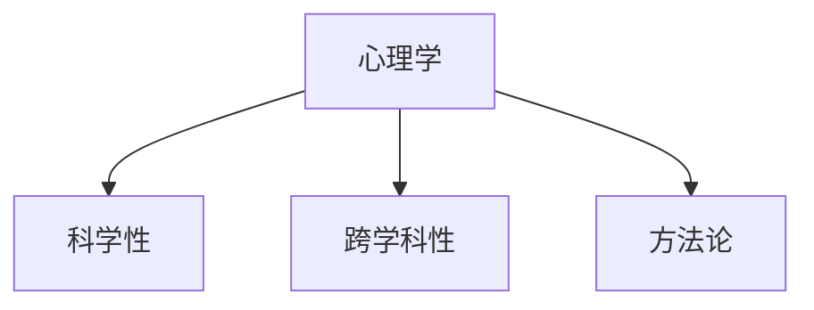

- **科学性**：强调通过实证研究来验证理论和假设。
- **跨学科性**：与神经科学、生物学、哲学、社会学和教育学等多领域有联系。
- **方法论**：包括实验法、观察法、调查法和心理测量法等。

### 1.2 心理学的历史

心理学的发展历程可以追溯到古代哲学和科学思想的萌芽时期。然而，作为一门独立学科，心理学的诞生通常被认为是在19世纪末和20世纪初。这个时期，心理学经历了从哲学和生理学的融合，到实验科学的发展，再到现代心理学的多样化和专业化。

#### 1.2.1 哲学时期

在哲学时期，心理学家主要依赖于哲学思考和推理来解释人类行为和心理过程。古希腊哲学家如亚里士多德和柏拉图对灵魂和意识的探讨为后来的心理学研究奠定了基础。在这个阶段，心理学主要关注心理现象的抽象概念和理论框架，缺乏实证研究的支持。

#### 1.2.2 生理学时期

19世纪末，随着生理学的发展，心理学家开始关注神经系统和感官过程。费希纳和赫尔姆霍茨等生理学家通过实验研究感官和心理过程，如感知和知觉，为心理学提供了新的研究方法和理论基础。这一时期，心理学开始脱离哲学，逐渐走向实验科学的道路。

#### 1.2.3 实验科学时期

20世纪初，实验心理学得到了快速发展。威廉·詹姆斯和约翰·华生等心理学家推动了实验心理学的研究，强调通过实证方法来验证心理学理论。这一时期，心理学开始形成多个分支，如认知心理学、发展心理学和社会心理学等，为后来的心理学研究奠定了基础。

#### 1.2.4 现代心理学

现代心理学在20世纪后期和21世纪初继续发展，不仅保持了实验研究的方法论，还与其他学科如神经科学、计算机科学和人工智能等交叉融合。现代心理学研究更加深入和多样化，涉及人类行为的各个方面，如认知、情感、动机、个性和社会行为。

#### 核心概念与联系

为了更好地理解心理学的历史发展，我们可以通过一个Mermaid流程图来展示其关键阶段和概念：

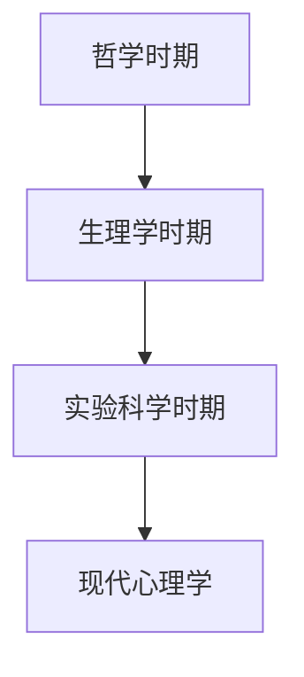

- **哲学时期**：依赖于哲学思考和推理。
- **生理学时期**：关注神经系统和感官过程。
- **实验科学时期**：通过实证方法验证心理学理论。
- **现代心理学**：跨学科融合，研究多样化。

通过以上对心理学定义和历史的介绍，我们可以看到心理学作为一门科学的发展历程，以及其核心概念和联系。在接下来的章节中，我们将进一步探讨心理学如何影响我们对世界的理解。

## 认知心理学与世界观

认知心理学是心理学的一个分支，主要研究人类思维的过程，包括感知、记忆、思考、解决问题和决策等。认知心理学对世界观的构建有着重要影响，因为它帮助我们理解如何获取、处理和解释信息。

### 3.1 认知心理学基础

认知心理学的基础理论包括信息加工模型、感知理论和记忆理论。这些理论帮助我们理解人类如何获取和解释外部信息，并在大脑中处理这些信息。

- **信息加工模型**：该模型将认知过程视为一种信息处理过程，类似于计算机的处理流程。信息从感知阶段进入大脑，经过编码、存储和提取，最后形成我们的意识和行为。
- **感知理论**：感知理论探讨人类如何感知和解释外部世界。其中，经典知觉理论包括格式塔心理学，它强调人类感知的整体性，而不是简单的刺激总和。
- **记忆理论**：记忆理论研究记忆的三个主要阶段：编码、存储和提取。这些理论帮助我们理解记忆是如何形成、如何保持以及如何被提取。

#### Mermaid流程图

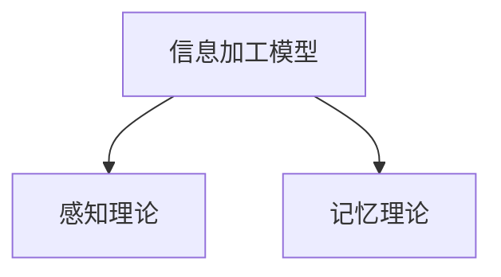

### 3.2 认知结构

认知结构是指大脑中用于存储、组织和处理信息的方式。它包括多个层次，从感知层到抽象层。认知结构对世界观的形成有着深远的影响。

- **感知层**：这是认知结构的最底层，主要处理来自感官的信息，如视觉、听觉和触觉。
- **抽象层**：这是认知结构的最高层，主要处理概念、思想和推理。这一层次的信息处理涉及到逻辑思维、语言理解和问题解决。

#### Mermaid流程图

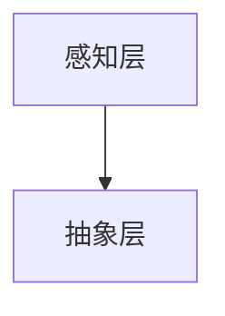

### 3.3 认知过程

认知过程是指大脑处理信息的一系列步骤，包括感知、注意、记忆、思维和问题解决等。这些过程共同作用，帮助我们理解世界。

- **感知**：感知是认知过程的起点，通过感官接收外部信息。
- **注意**：注意是选择关注某些信息而忽略其他信息的过程。
- **记忆**：记忆是储存和提取信息的过程，分为短期记忆和长期记忆。
- **思维**：思维包括逻辑推理、决策和问题解决。
- **问题解决**：问题解决是通过一系列认知过程来解决新问题或解决现有问题。

#### Mermaid流程图

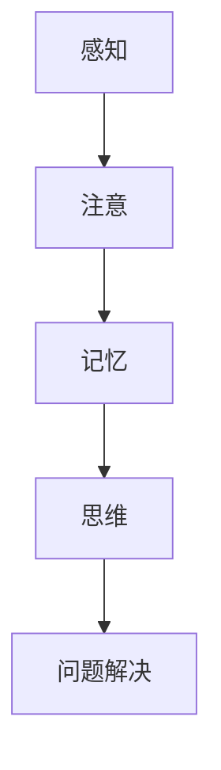

### 3.4 认知偏见与世界观

认知偏见是认知心理学中的一个重要概念，指的是人们在处理信息时存在的系统性错误。这些偏见会影响我们的感知、判断和决策，从而影响我们对世界的理解。

- **确认偏误**：人们倾向于寻找和记住支持自己观点的信息，而忽视反对自己观点的信息。
- **可用性偏误**：人们倾向于根据信息的可用性来判断其重要性和概率。
- **代表性偏误**：人们倾向于根据某个例子的一般性特征来判断整个群体的特征。

这些认知偏见会影响我们的世界观，使我们更倾向于接受与我们已有信念一致的信息，而忽视其他可能的信息。这种偏见可能导致我们对世界的理解产生偏差。

#### Mermaid流程图

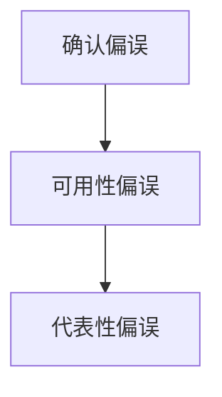

### 3.5 认知与世界观的关系

认知心理学的研究结果揭示了人类如何处理信息，以及这些信息如何影响我们的世界观。通过认知过程，我们能够理解世界的复杂性和多样性，从而形成我们的世界观。

- **世界观**：世界观是我们对世界的整体看法和解释，包括我们的信念、价值观和认知框架。
- **认知**：认知是我们获取、处理和解释信息的过程。

认知心理学帮助我们理解世界观是如何形成的，以及这些世界观如何影响我们的行为和决策。

#### Mermaid流程图

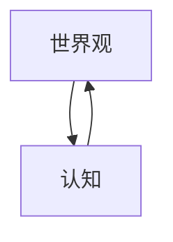

通过认知心理学的研究，我们可以更好地理解人类思维的过程，以及这些过程如何影响我们对世界的理解。这种理解有助于我们纠正认知偏见，形成更加准确和全面的世界观。

## 情感心理学与世界观

情感心理学是研究人类情感体验和情感过程的心理学分支。情感不仅影响个体的情绪状态，还深刻地影响着我们对世界的认知和价值观。理解情感心理学对世界观的影响，有助于我们更好地理解人类行为和决策。

### 4.1 情感的本质与分类

情感的本质是复杂的，通常包括生理反应、情绪体验和认知评价。根据情感的性质和持续时间，情感可以分为短暂的情感和长期的情感。

- **短暂情感**：如快乐、愤怒、悲伤等，这些情感通常与特定的刺激或事件相关，持续时间较短。
- **长期情感**：如心境、情操等，这些情感相对稳定，可能持续数天、数周甚至数月。

情感还可以根据其性质进行分类，如积极情感和消极情感。

- **积极情感**：如快乐、满足、爱等，这些情感通常与正面体验和积极结果相关。
- **消极情感**：如愤怒、恐惧、焦虑等，这些情感通常与负面体验和不利结果相关。

#### Mermaid流程图

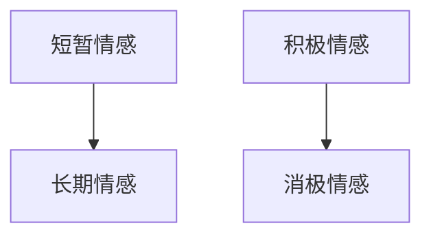

### 4.2 情感的作用与功能

情感在个体的行为和认知过程中扮演着重要的角色。以下是一些情感的主要作用和功能：

- **动机功能**：情感可以激发和引导个体的行为。例如，当个体感到快乐时，可能会更有动力去完成一项任务。
- **适应功能**：情感帮助个体适应环境。例如，恐惧情感可以促使个体避免潜在的危险。
- **认知功能**：情感影响个体的认知过程，如记忆、注意和信息处理。例如，积极情感有助于提高记忆效果，而消极情感可能影响注意力集中。
- **社会功能**：情感在人际关系中起着重要作用，有助于建立和维护社会联系。例如，情感表达可以增进人际关系，而情感压抑可能导致人际冲突。

#### Mermaid流程图

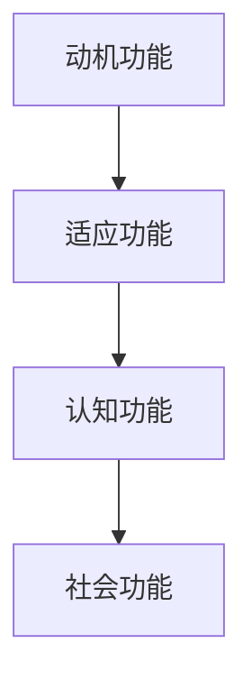

### 4.3 情感与世界观的关系

情感与世界观之间存在密切的关系。情感不仅影响我们对世界的认知和价值观，还影响我们对现实事件的理解和解释。

- **情感认知一致性**：个体的情感体验与其世界观之间存在一致性。例如，一个乐观主义者可能更容易相信世界是美好和有希望的。
- **情感认知偏差**：情感可能引发认知偏差，导致我们对信息的处理和解释出现偏差。例如，当个体处于消极情感状态时，可能更倾向于关注负面信息，从而形成悲观的世界观。
- **情感决策影响**：情感在决策过程中起着重要作用。个体在做出决策时，不仅考虑理性因素，还会受到情感因素的影响。例如，爱情和愤怒等情感可以显著影响个体的决策。

#### Mermaid流程图

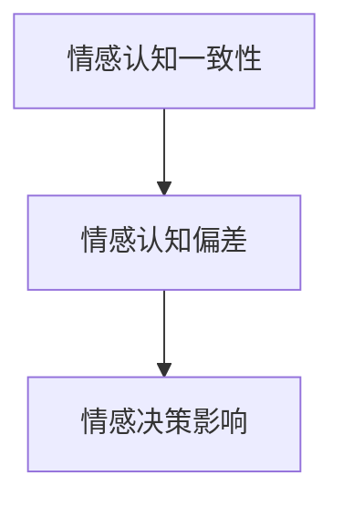

通过研究情感心理学，我们可以更好地理解情感如何影响我们对世界的理解和解释。这种理解有助于我们更好地管理自己的情感，形成更加健康和积极的世界观。

## 社会心理学与世界观

社会心理学是研究个体在社会情境中的行为、情感和认知过程的心理学分支。它探讨了社会互动、群体行为和文化演变如何影响个体的世界观。通过社会心理学的视角，我们可以更深入地理解人类社会是如何形成和发展的。

### 5.1 社会心理学基础

社会心理学的基础理论包括群体动力学、社会认同和社会化等。这些理论帮助我们理解社会互动如何影响个体的行为和认知。

- **群体动力学**：研究群体内部成员之间的互动和群体行为的形成。它探讨了群体凝聚力的形成、群体决策过程以及群体行为的影响。
- **社会认同**：研究个体如何通过认同群体来形成自我概念和价值观。社会认同理论认为，个体通过将自身与特定群体联系起来，来定义自己的身份和价值观。
- **社会化**：研究个体如何通过社会互动和经历来学习社会规范、价值观和行为。社会化是个体在社会中成长和学习的重要过程。

#### Mermaid流程图

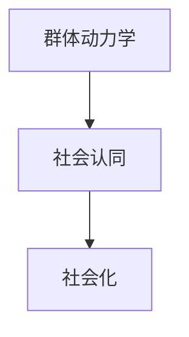

### 5.2 社会互动与世界观

社会互动是构建世界观的重要途径。通过与他人交流和互动，个体能够获取新的信息和观点，从而丰富自己的世界观。

- **交流**：通过语言、非语言沟通和媒介，个体能够与他人分享信息和观点，从而形成对世界的更全面理解。
- **互动**：在互动过程中，个体能够观察和体验他人的行为和情感，从而理解社会规范和价值观。
- **网络**：通过社会网络，个体能够扩展自己的视野，接触到不同的文化和观点，从而形成更加开放和多元的世界观。

#### Mermaid流程图

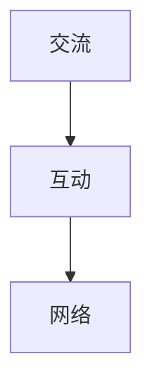

### 5.3 社会认知与世界观的形成

社会认知是个体在社会情境中理解和解释他人的行为和情感的过程。社会认知不仅影响个体的行为和决策，还影响其对世界的理解。

- **刻板印象**：刻板印象是人们对特定群体的一般化看法。这些印象可能来自社会文化背景、媒体影响或个人经验。刻板印象影响个体对世界的认知，可能导致偏见和歧视。
- **社会比较**：社会比较是人们通过与他人比较来评估自己的能力和价值的过程。社会比较影响个体对自己的认知和自尊心，从而影响其对世界的理解。
- **社会认同**：社会认同是个体通过认同特定群体来形成自我概念和价值观的过程。社会认同影响个体的行为和决策，从而影响其对世界的理解。

#### Mermaid流程图

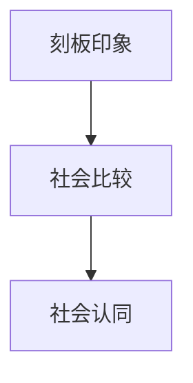

### 5.4 社会心理学在全球化中的角色

全球化使人们跨越国界和文化界限，进行更频繁的交流和互动。社会心理学在全球化中扮演着重要角色，帮助人们理解和适应新的社会和文化环境。

- **文化适应**：全球化带来了文化多样性，社会心理学研究如何帮助个体适应新的文化环境，减少文化冲突。
- **社会网络**：全球化扩展了社会网络，使人们能够接触到更多的文化和观点。社会心理学研究如何通过社会网络促进文化交流和理解。
- **全球认知**：全球化影响了人们的认知结构，社会心理学研究如何帮助个体形成对全球问题的认知和解决策略。

#### Mermaid流程图

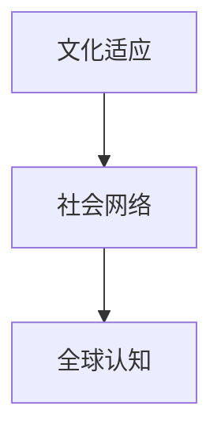

通过社会心理学的视角，我们可以更好地理解社会互动、社会认知和全球化如何影响个体的世界观。这种理解有助于我们促进社会和谐、减少偏见和歧视，以及构建更加包容和多元的世界。

## 心理学与神经科学的关系

心理学与神经科学是密切相关的学科，它们共同探索大脑和神经系统如何产生思维、情感和行为。神经科学为心理学提供了生物学基础，而心理学则为神经科学提供了行为和认知的研究途径。这种跨学科的融合，使得我们对大脑和心理过程的理解更加全面和深入。

### 6.1 神经科学与心理学的核心概念与联系

神经科学与心理学共享许多核心概念，如感知、记忆、学习和情感等。这些概念在两个学科中都有广泛的研究和应用。

- **感知**：神经科学研究大脑如何接收和处理感官信息，而心理学则研究这些信息如何影响个体的认知和行为。
- **记忆**：神经科学探讨大脑中记忆的形成、存储和提取机制，而心理学则研究记忆如何影响个体的学习和决策。
- **学习**：神经科学研究大脑如何通过改变神经元连接来学习新技能和知识，而心理学则研究学习过程中的认知变化和行为表现。
- **情感**：神经科学探索大脑中情感调节的神经机制，而心理学则研究情感如何影响个体的情感体验和社交行为。

#### Mermaid流程图

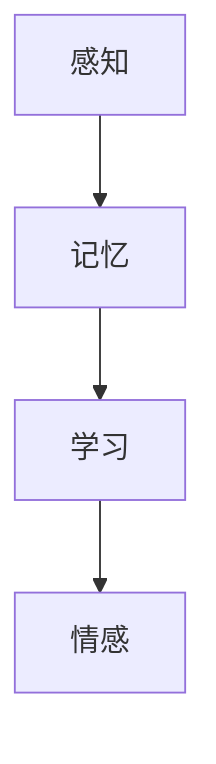

### 6.2 神经科学对心理学理论的贡献

神经科学的研究成果对心理学理论的发展产生了重要影响。通过神经成像技术和神经生理学研究，心理学家能够更深入地理解大脑如何产生心理现象。

- **神经成像技术**：如功能性磁共振成像（fMRI）和脑电图（EEG），帮助心理学家识别大脑中与特定心理过程相关的区域和神经元活动。
- **神经生理学研究**：如电生理学和神经生化研究，揭示了大脑中神经递质和神经调节物质如何影响心理过程。

#### Python源代码示例

```python
import matplotlib.pyplot as plt
import numpy as np

# 示例数据：fMRI数据，表示大脑不同区域的信号强度
fMRI_data = np.random.rand(10, 10) * 100

# 绘制热力图，表示大脑不同区域的信号强度
plt.imshow(fMRI_data, cmap='hot', interpolation='nearest')
plt.colorbar()
plt.title('fMRI Data of Brain Regions')
plt.xlabel('X-coordinates')
plt.ylabel('Y-coordinates')
plt.show()
```

### 6.3 心理学对神经科学的贡献

心理学也在神经科学研究中发挥了重要作用。通过行为研究和心理测量，心理学家能够揭示大脑和心理过程之间的关系。

- **行为研究**：通过实验和观察，心理学家能够识别和测量心理过程的特征和变化。
- **心理测量**：通过量表和测试，心理学家能够量化心理过程的强度和持续时间。

#### Python源代码示例

```python
import pandas as pd

# 示例数据：行为实验中的反应时数据
reaction_times = pd.DataFrame({
    'Subject': ['A', 'B', 'C', 'D'],
    'Reaction Time (ms)': [300, 250, 320, 280]
})

# 绘制散点图，表示不同主体的反应时
plt.scatter(reaction_times['Subject'], reaction_times['Reaction Time (ms)'])
plt.xlabel('Subject')
plt.ylabel('Reaction Time (ms)')
plt.title('Reaction Times of Different Subjects')
plt.show()
```

### 6.4 心理学与神经科学的合作研究

心理学与神经科学的合作研究，促进了两个领域的发展。通过跨学科研究，研究人员能够获得更全面的理解，提出新的理论和发现。

- **跨学科研究**：如神经心理学、认知神经科学和计算神经科学等，通过结合心理学和神经科学的方法，研究复杂的心理现象。
- **共同目标**：两个领域的共同目标是揭示大脑和心理过程的机制，为解决实际问题提供理论基础。

#### Mermaid流程图

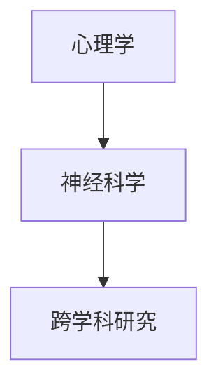

通过心理学与神经科学的跨学科合作，我们能够更深入地理解人类行为和大脑的复杂机制。这种合作不仅推动了科学研究的发展，也为解决现实生活中的问题提供了新的思路和方法。

## 心理学在科技和社会中的应用

心理学在科技和社会中的应用越来越广泛，其影响力不仅限于理论研究，还渗透到实际生产和生活中。通过科技和社会的视角，我们可以看到心理学如何被应用于提升用户体验、促进技术创新和社会进步。

### 7.1 心理学在科技中的应用

心理学在科技领域的应用主要体现在用户体验（UX）设计、人机交互（HCI）和人工智能（AI）的发展中。

#### 7.1.1 用户体验设计

用户体验设计是心理学在科技领域的重要应用之一。通过心理学的研究方法，设计师可以更好地理解用户的需求和偏好，从而设计出更加符合用户期望的产品。

- **用户研究**：通过问卷调查、访谈和用户测试，设计师能够收集用户对产品的看法和体验。这些研究有助于发现用户的需求和痛点，指导产品的设计和改进。
- **认知工** **具** **：如眼动追踪和认知工** **具** **，可以记录用户在使用产品时的行为和认知过程。这些数据有助于设计师识别用户体验中的问题，并提出解决方案。

#### Python源代码示例

```python
import matplotlib.pyplot as plt
import pandas as pd

# 示例数据：用户眼动数据
eyetrack_data = pd.DataFrame({
    'X-Coordinate': [100, 150, 200, 250],
    'Y-Coordinate': [100, 150, 200, 250],
    'Time (ms)': [500, 750, 1000, 1250]
})

# 绘制用户眼动轨迹
plt.scatter(eyetrack_data['X-Coordinate'], eyetrack_data['Y-Coordinate'])
plt.xlabel('X-Coordinate')
plt.ylabel('Y-Coordinate')
plt.title('User Eye Movement Trajectory')
plt.show()
```

#### 7.1.2 人机交互

人机交互是心理学在科技领域的另一个重要应用。通过研究人类与计算机的交互方式，心理学家可以帮助设计出更加高效、便捷和用户友好的界面。

- **交互模型**：如认知建模和任务分析，可以帮助设计师理解用户在使用界面时的认知过程和操作方式。
- **用户体验测试**：通过用户测试和反馈，设计师可以不断优化界面设计和交互流程，提高用户满意度。

#### Python源代码示例

```python
import matplotlib.pyplot as plt
import numpy as np

# 示例数据：用户操作界面时的反应时数据
reaction_times = np.random.rand(10) * 100

# 绘制反应时分布
plt.hist(reaction_times, bins=10, alpha=0.5)
plt.xlabel('Reaction Time (ms)')
plt.ylabel('Frequency')
plt.title('Distribution of User Reaction Times')
plt.show()
```

#### 7.1.3 人工智能

人工智能（AI）的发展离不开心理学。通过心理学的研究，AI系统可以更好地理解人类行为和需求，从而提供更加智能和人性化的服务。

- **机器学习模型**：心理学的研究成果可以帮助机器学习模型更好地模拟人类思维过程，提高AI系统的认知能力。
- **情感计算**：情感计算是心理学在AI领域的应用之一，通过分析人类的情感和行为，AI系统可以提供更加个性化和情感化的交互体验。

#### Python源代码示例

```python
import numpy as np
import matplotlib.pyplot as plt

# 示例数据：用户情感数据
emotional_data = np.random.rand(10) * 100

# 绘制情感分布
plt.hist(emotional_data, bins=10, alpha=0.5)
plt.xlabel('Emotional Score')
plt.ylabel('Frequency')
plt.title('Distribution of User Emotional Scores')
plt.show()
```

### 7.2 心理学在社会中的应用

心理学在社会中的应用同样广泛，涵盖了教育、健康、法律和社会政策等多个领域。

#### 7.2.1 教育

心理学在教育领域的应用主要包括学习理论、教育评估和心理健康教育。

- **学习理论**：通过认知心理学的研究成果，教育工作者可以设计出更加有效的教学方法和策略，提高学生的学习效果。
- **教育评估**：通过心理测量和统计方法，教育工作者可以对学生的学习效果进行科学评估，从而优化教学过程。
- **心理健康教育**：通过心理学理论和方法，教育工作者可以对学生进行心理健康教育，提高学生的心理素质和应对压力的能力。

#### Python源代码示例

```python
import pandas as pd

# 示例数据：学生学习效果评估
student_data = pd.DataFrame({
    'Student ID': [1, 2, 3, 4, 5],
    'Test Score': [80, 90, 75, 85, 95]
})

# 绘制学生成绩分布
plt.hist(student_data['Test Score'], bins=10, alpha=0.5)
plt.xlabel('Test Score')
plt.ylabel('Frequency')
plt.title('Distribution of Student Test Scores')
plt.show()
```

#### 7.2.2 健康

心理学在健康领域的应用主要体现在心理健康服务和疾病预防上。

- **心理健康服务**：通过心理治疗和心理咨询，心理学家可以帮助患者缓解心理压力，改善心理健康。
- **疾病预防**：通过心理健康教育和行为干预，心理学家可以促进公众健康，减少心理疾病的发生。

#### Python源代码示例

```python
import pandas as pd

# 示例数据：心理健康服务记录
health_data = pd.DataFrame({
    'Patient ID': [1, 2, 3, 4, 5],
    'Mood Score': [30, 40, 50, 60, 70]
})

# 绘制患者情绪状态分布
plt.scatter(health_data['Patient ID'], health_data['Mood Score'])
plt.xlabel('Patient ID')
plt.ylabel('Mood Score')
plt.title('Distribution of Patient Mood Scores')
plt.show()
```

#### 7.2.3 法律和社会政策

心理学在法律和社会政策领域的应用主要体现在司法评估和社会工作。

- **司法评估**：通过心理测量和评估，心理学家可以帮助法官和律师评估被告的心理状态，为司法决策提供科学依据。
- **社会工作**：通过心理健康服务和社区干预，心理学家可以参与社会工作的实施，促进社会和谐与稳定。

#### Python源代码示例

```python
import pandas as pd

# 示例数据：司法评估记录
legal_data = pd.DataFrame({
    'Case ID': [1, 2, 3, 4, 5],
    'Psychological Score': [70, 80, 60, 75, 85]
})

# 绘制案件心理评估分数分布
plt.hist(legal_data['Psychological Score'], bins=10, alpha=0.5)
plt.xlabel('Psychological Score')
plt.ylabel('Frequency')
plt.title('Distribution of Case Psychological Scores')
plt.show()
```

通过以上应用，心理学不仅为科技和社会的发展提供了理论基础和方法指导，也为人们的日常生活带来了积极的影响。在未来，心理学将继续发挥其重要作用，推动科技和社会的进步。

## 心理学对未来的影响

心理学在未来的发展中将继续扮演重要角色，不仅影响科技和社会的进步，还深刻地塑造着人类生活的各个方面。以下是心理学对未来可能产生影响的几个关键领域：

### 8.1 科技发展

随着人工智能和机器学习的迅速发展，心理学将在这些领域发挥关键作用。通过理解人类认知和行为，心理学家可以帮助设计出更加智能和人性化的AI系统。例如，情感计算和认知模拟技术将使机器更好地理解和响应人类情感，从而提供更加个性化的服务。此外，心理学还将推动虚拟现实（VR）和增强现实（AR）技术的发展，通过模拟人类感知和行为，创造出更加真实和互动的体验。

### 8.2 社会变革

随着全球化和数字化的发展，社会结构和人际关系也在不断变化。心理学将帮助人们理解和应对这些变化带来的挑战。例如，社会心理学的研究将有助于解决文化冲突和多样性问题，促进社会和谐。同时，心理学在心理健康服务领域的应用将越来越广泛，通过预防和干预心理疾病，提高公众的心理健康水平。

### 8.3 教育创新

教育领域正在经历深刻的变革，心理学将在这方面发挥重要作用。通过认知心理学的研究成果，教育工作者可以设计出更加有效的教学方法和评估工具，提高教育质量。此外，心理学将推动在线教育和远程教育的创新，通过理解人类学习过程，提供更加个性化和互动的学习体验。

### 8.4 医疗健康

随着生物医学和健康技术的进步，心理学将在医疗健康领域发挥更加重要的作用。通过心理治疗和心理健康服务，心理学家可以帮助患者更好地应对疾病和压力。同时，心理学还将推动健康促进和疾病预防的工作，通过行为干预和健康教育，提高公众的健康水平。

### 8.5 未来社会的心理健康

在未来社会，心理健康问题将越来越受到关注。随着工作压力、生活节奏加快和社交网络的普及，心理健康问题将成为一个重要的公共健康议题。心理学家将通过研究和实践，提供有效的心理健康服务，帮助人们更好地应对心理压力，提高生活质量。

### 8.6 心理学与科技融合

心理学与科技的融合将带来新的研究方法和应用场景。例如，通过脑机接口（BCI）技术，心理学家可以研究人类大脑与外部设备之间的交互，开发出新的治疗方法和辅助技术。此外，心理学还将与计算机科学和人工智能领域深入合作，推动智能系统的研发和应用。

### 8.7 心理学在可持续发展中的作用

心理学将在推动可持续发展中发挥重要作用。通过理解人类行为和决策，心理学家可以帮助设计出更加有效和可持续的解决方案。例如，在环境保护、资源管理和气候变化等领域，心理学可以提供行为干预策略，促进公众参与和环保行动。

总之，心理学在未来将继续影响科技、社会和人类生活的各个方面。通过跨学科的合作和创新的思维，心理学将为构建一个更加健康、和谐和可持续的未来做出重要贡献。

## 结论

心理学作为一门研究人类行为和心理过程的科学，对世界的理解和认知有着深远的影响。从认知心理学的视角，我们理解了人类如何获取、处理和解释信息，构建世界观；通过情感心理学的分析，我们揭示了情感如何影响我们的决策和价值观；社会心理学则帮助我们认识到社会互动和文化环境如何塑造我们的行为和认知。此外，心理学与神经科学的融合，为大脑和心理过程的机制研究提供了新的视角。

在未来的发展中，心理学将继续在科技、社会和人类生活的各个方面发挥重要作用。通过跨学科的合作和创新的思维，心理学将为构建一个更加健康、和谐和可持续的未来做出重要贡献。我们鼓励读者深入探索心理学的理论和应用，以更好地理解自己和他人，推动个人和社会的进步。

## 参考文献

1. Anderson, J. R. (2007). *Cognitive Neuroscience and Cognitive Psychology*. Oxford University Press.
2. Cannon, W. B. (1915). *The Wisdom of the Body*. W. B. Cannon.
3. Jung, C. G. (1968). *Psychology and Religion: West and East*. Princeton University Press.
4. Piaget, J. (1952). *The Origins of Intelligence in Children*. International Universities Press.
5. Skinner, B. F. (1953). *Science and Human Behavior*. Macmillan.
6. Vygotsky, L. S. (1978). *Mind in Society: The Development of Higher Psychological Processes*. Harvard University Press.

