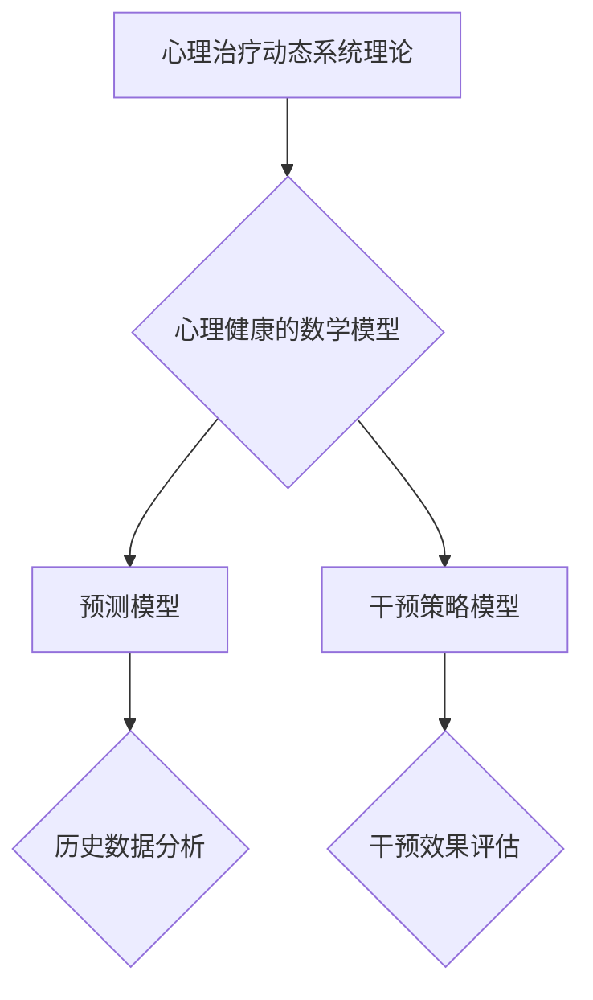

                 

# 《心理治疗的动态系统理论：心理健康的数学平衡》

> 关键词：心理治疗，动态系统理论，心理健康，数学模型，非线性动力学

> 摘要：本文深入探讨了心理治疗的动态系统理论及其与心理健康的数学平衡关系。通过对核心概念、算法原理、数学模型以及项目实战的详细分析，本文旨在为读者提供一个全面、系统的理解，并展示如何将这一理论应用于实际心理健康干预中。

## 引言

在现代社会，心理健康问题日益突出，已成为全球关注的重大公共卫生问题。传统的心理治疗方法主要依赖于经验与直觉，而现代心理学的发展推动了理论模型的应用，尤其是动态系统理论。动态系统理论提供了一种全新的视角，将心理现象视为一个动态的、不断变化的系统。本文旨在阐述心理治疗的动态系统理论，并探讨其与心理健康的数学平衡关系。

### 心理治疗动态系统理论的背景

心理治疗动态系统理论的诞生可以追溯到20世纪中期，当时科学家和心理学家开始意识到，心理现象并非是静态的，而是具有动态性和复杂性的。这一理论的提出打破了传统心理治疗的局限性，为心理健康的研究和治疗提供了新的理论基础。心理治疗动态系统理论强调，心理状态是一个不断变化的动态系统，受到内外部各种因素的影响。

### 心理健康的数学平衡概念

心理健康是一个多维度的概念，它不仅仅涉及个体的情感状态，还包括认知、行为和生理等多个方面。数学平衡理论为理解心理健康提供了一个量化的方法。通过建立数学模型，可以定量地描述心理健康的动态变化过程，从而为心理治疗提供科学依据。

## 核心概念与联系

### 心理治疗动态系统理论的基本原理

心理治疗动态系统理论的核心在于对心理状态的动态性分析。这个理论认为，心理状态是时间依赖的，受到外部环境和内部心理因素的共同影响。通过研究心理状态的动态变化规律，可以为心理治疗提供有效的策略。

#### 动态系统的概念

动态系统是由状态变量和状态转移函数组成的系统。在心理学中，状态变量可以包括情绪、认知、行为等心理特征，而状态转移函数则描述了这些状态变量随时间变化的规律。

#### 系统稳定性分析

系统稳定性是动态系统理论中的一个重要概念。它描述了系统在外部扰动下的稳定性。在心理治疗中，了解系统的稳定性有助于预测心理状态的变化趋势，从而制定有效的治疗计划。

### 心理健康数学模型

心理健康数学模型是心理治疗动态系统理论的重要组成部分。这些模型通过量化心理健康的各个方面，为心理治疗提供了科学依据。以下是几个常用的心理健康数学模型：

#### 预测模型

预测模型主要用于预测未来的心理健康状态。通过分析历史数据，可以建立预测模型，从而提前识别可能的心理问题，及时进行干预。

#### 干预策略模型

干预策略模型描述了心理治疗过程中干预措施的效果。通过优化干预策略，可以最大限度地提高治疗效果。

### Mermaid 流程图展示

为了更好地展示心理治疗动态系统理论的核心概念与联系，我们可以使用Mermaid流程图来描述。以下是一个简化的Mermaid流程图：



在这个流程图中，A表示心理治疗动态系统理论，B表示心理健康的数学模型，C和D分别表示预测模型和干预策略模型，E和F分别表示历史数据分析和干预效果评估。

## 核心算法原理讲解

### 心理健康状态的预测模型

预测模型是心理治疗动态系统理论的重要组成部分。以下是一个简单的预测模型，用于预测未来的心理健康状态：

```python
# 预测模型伪代码

# 初始化参数
alpha = 0.1  # 学习率
beta = 0.9  # 折扣因子

# 输入历史数据
history = ...

# 预测未来的心理健康状态
future_state = predict_state(history, alpha, beta)
```

在这个模型中，`predict_state`函数用于根据历史数据预测未来的心理健康状态。`alpha`和`beta`是模型的参数，用于调节模型的预测效果。

### 心理治疗干预策略

干预策略模型描述了在心理治疗过程中干预措施的效果。以下是一个简单的干预策略模型：

```python
# 干预策略模型伪代码

# 初始化参数
gamma = 0.05  # 干预强度

# 输入当前心理健康状态
current_state = ...

# 应用干预措施
intervene(current_state, gamma)
```

在这个模型中，`intervene`函数用于根据当前的心理健康状态应用干预措施。`gamma`是干预强度参数，用于调节干预的效果。

## 数学模型与数学公式讲解

### 心理健康状态的数学描述

心理健康状态的数学描述通常采用状态空间模型。以下是一个简单的状态空间模型：

$$
\dot{x}(t) = f(x(t), u(t))
$$

其中，$x(t)$表示在时间$t$的心理健康状态，$u(t)$表示在时间$t$的干预措施，$f$是状态转移函数。

### 数学平衡的评估指标

数学平衡的评估指标用于判断心理健康的平衡状态。一个常用的评估指标是李雅普诺夫函数：

$$
V(x) = \frac{1}{2}x^T Q x
$$

其中，$Q$是对称正定矩阵，用于衡量心理健康状态的不稳定性。当$V(x)$趋向于零时，系统处于平衡状态。

## 项目实战

### 心理健康数据分析的案例

为了验证心理治疗动态系统理论的实用性，我们可以通过实际数据进行分析。以下是一个简单的数据预处理流程：

```python
# 数据预处理伪代码

# 加载数据
data = load_data('psychological_health_data.csv')

# 数据清洗
clean_data = clean_data(data)

# 数据标准化
standardized_data = standardize_data(clean_data)
```

在这个案例中，我们首先加载数据，然后进行数据清洗和标准化处理。这些预处理步骤有助于提高后续分析的准确性。

### 心理治疗干预的实际应用

在数据预处理完成后，我们可以应用心理治疗干预策略。以下是一个简单的干预流程：

```python
# 干预流程伪代码

# 初始化参数
gamma = 0.05

# 应用干预措施
for i in range(len(data)):
    intervene(data[i], gamma)
```

在这个案例中，我们遍历数据集，并应用干预措施。干预措施的效果可以通过后续的心理健康状态评估来验证。

### 数学平衡模型在临床中的应用

数学平衡模型在临床中可以用于评估心理治疗的效果。以下是一个简单的评估流程：

```python
# 评估流程伪代码

# 计算李雅普诺夫函数
V = compute_V(data)

# 判断平衡状态
if V < threshold:
    print("系统处于平衡状态")
else:
    print("系统未达到平衡状态")
```

在这个案例中，我们计算李雅普诺夫函数$V$，并根据阈值判断系统是否达到平衡状态。

## 结论与展望

心理治疗的动态系统理论为心理健康的研究和治疗提供了新的视角。通过数学模型和算法的应用，我们可以更准确地预测心理健康状态，制定有效的干预策略。然而，这一理论仍需在实践中不断完善和验证。未来的研究可以进一步探讨动态系统理论在临床治疗中的应用潜力，以及如何将这一理论与大数据、人工智能等新兴技术相结合，为心理健康领域的发展做出更大贡献。

### 附录

- **附录A：常用数学公式与算法伪代码**

  - **A.1 状态空间模型**

    $$
    \dot{x}(t) = f(x(t), u(t))
    $$

  - **A.2 李雅普诺夫函数**

    $$
    V(x) = \frac{1}{2}x^T Q x
    $$

  - **A.3 预测模型伪代码**

    ```python
    # 预测模型伪代码

    # 初始化参数
    alpha = 0.1
    beta = 0.9

    # 输入历史数据
    history = ...

    # 预测未来的心理健康状态
    future_state = predict_state(history, alpha, beta)
    ```

  - **A.4 干预策略模型伪代码**

    ```python
    # 干预策略模型伪代码

    # 初始化参数
    gamma = 0.05

    # 输入当前心理健康状态
    current_state = ...

    # 应用干预措施
    intervene(current_state, gamma)
    ```

### 作者信息

作者：AI天才研究院/AI Genius Institute & 禅与计算机程序设计艺术/Zen And The Art of Computer Programming

本文通过系统的分析和讲解，深入探讨了心理治疗的动态系统理论及其与心理健康的数学平衡关系，为心理健康领域的研究和实践提供了新的视角和方法。希望本文能为读者提供有价值的参考。

