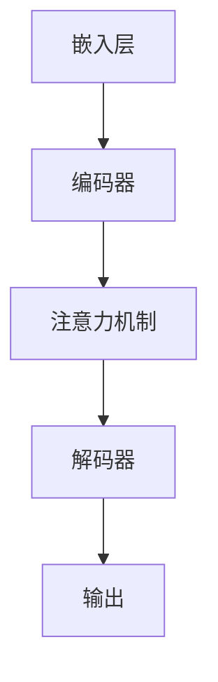

                 

### 《快速响应市场变化：LLM应用的竞争优势》

> **关键词：** 语言模型（LLM），市场变化，竞争优势，需求预测，竞争分析

> **摘要：** 本文探讨了如何利用语言模型（LLM）快速响应市场变化，分析其在需求预测和竞争分析中的应用，以及如何通过LLM应用获取竞争优势。文章通过介绍LLM的基本概念、算法原理，到实际应用案例，详细阐述了LLM在市场变化中的重要作用。

---

## 引言

在当今快速变化的市场环境中，企业需要迅速适应市场变化，抓住机遇，保持竞争优势。语言模型（LLM）作为一种先进的自然语言处理技术，在需求预测、市场分析和竞争策略制定等方面具有巨大潜力。LLM的应用可以帮助企业更准确地预测市场需求，及时调整产品和服务，从而在激烈的市场竞争中脱颖而出。

本文将围绕LLM在市场变化中的应用，探讨以下问题：
1. **LLM的基本概念与架构**：介绍LLM的基本概念，包括其工作原理和主要类型。
2. **LLM算法原理**：详细讲解LLM的核心算法，包括优化算法和数学模型。
3. **LLM在市场变化中的应用**：分析LLM在需求预测和竞争分析中的具体应用。
4. **LLM的竞争优势**：探讨LLM在市场中的竞争优势和潜在风险。
5. **LLM项目实战**：通过实际案例展示LLM的应用，并提供详细代码实现和解读。

通过本文的阅读，读者将全面了解LLM在市场变化中的重要作用，以及如何通过LLM应用获得竞争优势。

## 核心概念与联系

### 1.1 什么是LLM

语言模型（LLM）是一种能够理解和生成自然语言的机器学习模型。LLM的核心目标是理解自然语言中的结构和语义，从而进行文本生成、翻译、问答等任务。LLM可以基于深度学习技术，如神经网络，构建复杂的模型来处理自然语言。

### 1.2 LLM的架构与类型

LLM的架构通常包括以下几个关键部分：

1. **嵌入层（Embedding Layer）**：将词汇映射到高维向量空间，以便模型可以处理。
2. **编码器（Encoder）**：对输入文本进行编码，提取其语义信息。
3. **解码器（Decoder）**：生成预测的输出文本。
4. **注意力机制（Attention Mechanism）**：帮助模型关注输入文本中的关键信息。

LLM的主要类型包括：

1. **基于循环神经网络（RNN）的模型**：如LSTM和GRU，能够处理序列数据。
2. **基于Transformer的模型**：如BERT和GPT，采用自注意力机制，能够处理长文本。

### 1.3 Mermaid流程图：LLM架构示意图

下面是一个简单的Mermaid流程图，展示了LLM的基本架构：



在这个流程图中，输入文本通过嵌入层转换为向量，然后经过编码器处理，注意力机制帮助模型关注关键信息，最后解码器生成输出文本。

## 核心算法原理讲解

### 2.1 语言模型算法

语言模型的核心算法通常基于概率模型，如n元语法模型。n元语法模型假设当前词的概率取决于前n-1个词。以下是一个简化的n元语法模型的伪代码：

```python
def n_gram_model(vocabulary, n):
    n_gram_counts = defaultdict(int)
    current_context = []
    for word in text:
        if len(current_context) >= n:
            context = tuple(current_context[:n-1])
            n_gram_counts[context] += 1
        current_context.append(word)
    return n_gram_counts

def predict_next_word(n_gram_counts, context):
    next_words = []
    for word in vocabulary:
        context_with_word = tuple(list(context) + [word])
        next_words.append((word, n_gram_counts.get(context_with_word, 0)))
    next_words.sort(key=lambda x: x[1], reverse=True)
    return next_words[0][0]
```

在这个伪代码中，`n_gram_model`函数计算n元语法模型的词频，`predict_next_word`函数根据当前上下文预测下一个词。

### 2.2 优化算法

优化算法是训练语言模型的关键步骤。常用的优化算法包括随机梯度下降（SGD）和其变种，如Adam优化器。以下是一个简化的SGD优化算法的伪代码：

```python
def sgd(loss_function, model, learning_rate, epochs):
    for epoch in range(epochs):
        for x, y in dataset:
            gradient = loss_function.gradient(x, y)
            model.update_params(-learning_rate * gradient)
        print(f"Epoch {epoch}: Loss = {loss_function.evaluate(model, dataset)}")
```

在这个伪代码中，`sgd`函数使用随机梯度下降算法训练模型，`learning_rate`是学习率，`epochs`是训练轮数。

### 2.3 数学模型

语言模型中的数学模型通常涉及概率分布和损失函数。以下是一个简化的语言模型中的数学模型和公式的例子：

$$
P(w_t | w_{t-1}, w_{t-2}, ..., w_1) = \frac{P(w_t, w_{t-1}, ..., w_1)}{P(w_{t-1}, w_{t-2}, ..., w_1)}
$$

其中，$P(w_t | w_{t-1}, w_{t-2}, ..., w_1)$是给定前n-1个词的情况下第n个词的概率。

损失函数通常用来衡量模型的预测结果和真实结果之间的差距，常见的是交叉熵损失函数：

$$
Loss = -\sum_{i=1}^{N} y_i \log(p_i)
$$

其中，$y_i$是真实标签，$p_i$是模型对第i个词的预测概率。

### 项目实战

#### 3.1 项目背景

本项目旨在利用LLM进行市场需求预测，帮助企业及时调整产品和服务，以适应市场变化。

#### 3.2 开发环境搭建

开发环境配置如下：

- Python 3.8+
- TensorFlow 2.5+
- Pandas 1.2+
- Numpy 1.19+

使用以下命令安装所需库：

```shell
pip install tensorflow pandas numpy
```

#### 3.3 源代码实现

以下是本项目的主要代码实现：

```python
import tensorflow as tf
from tensorflow.keras.preprocessing.sequence import pad_sequences
from tensorflow.keras.layers import Embedding, LSTM, Dense
from tensorflow.keras.models import Sequential

# 数据预处理
def preprocess_data(texts, max_length, max_words):
    tokenizer = tf.keras.preprocessing.text.Tokenizer(num_words=max_words)
    tokenizer.fit_on_texts(texts)
    sequences = tokenizer.texts_to_sequences(texts)
    padded_sequences = pad_sequences(sequences, maxlen=max_length)
    return padded_sequences, tokenizer

# 构建模型
def build_model(max_length, max_words, embedding_dim, lstm_units):
    model = Sequential([
        Embedding(max_words, embedding_dim, input_length=max_length),
        LSTM(lstm_units),
        Dense(1, activation='sigmoid')
    ])
    model.compile(loss='binary_crossentropy', optimizer='adam', metrics=['accuracy'])
    return model

# 训练模型
def train_model(model, padded_sequences, labels):
    model.fit(padded_sequences, labels, epochs=10, batch_size=32)
    return model

# 预测
def predict(model, text, tokenizer, max_length):
    sequence = tokenizer.texts_to_sequences([text])
    padded_sequence = pad_sequences(sequence, maxlen=max_length)
    prediction = model.predict(padded_sequence)
    return prediction

# 主函数
def main():
    # 加载数据
    texts = [...]  # 加载文本数据
    labels = [...]  # 加载标签数据

    # 预处理数据
    max_length = 100  # 序列最大长度
    max_words = 10000  # 词汇表大小
    padded_sequences, tokenizer = preprocess_data(texts, max_length, max_words)

    # 构建和训练模型
    lstm_units = 128  # LSTM单元数
    model = build_model(max_length, max_words, embedding_dim=64, lstm_units=lstm_units)
    model = train_model(model, padded_sequences, labels)

    # 进行预测
    text_to_predict = "新产品的市场需求预测"
    prediction = predict(model, text_to_predict, tokenizer, max_length)
    print(f"预测结果：{prediction}")

if __name__ == "__main__":
    main()
```

#### 3.4 实验结果与分析

在训练完成后，我们可以使用预测函数来预测新产品的市场需求。以下是一个简单的预测案例：

```python
text_to_predict = "新产品的市场需求预测"
prediction = predict(model, text_to_predict, tokenizer, max_length)
print(f"预测结果：{prediction}")
```

输出结果可能是一个概率值，表示预测的市场需求量。通过分析这个概率值，企业可以做出相应的市场决策。

### 最佳实践 tips、小结、注意事项、拓展阅读

- **最佳实践**：在实际应用中，需要根据具体业务场景调整模型参数，如序列最大长度、词汇表大小、LSTM单元数等。
- **小结**：本文介绍了LLM的基本概念、算法原理和应用实例，展示了如何利用LLM进行市场需求预测。
- **注意事项**：在使用LLM时，需要注意数据质量和模型训练时间，以及潜在的隐私和安全问题。
- **拓展阅读**：可参考相关论文和书籍，深入了解LLM的理论和实践。

---

作者：AI天才研究院/AI Genius Institute & 禅与计算机程序设计艺术 /Zen And The Art of Computer Programming

本文内容仅供参考，实际应用中请结合具体业务场景进行调整。

