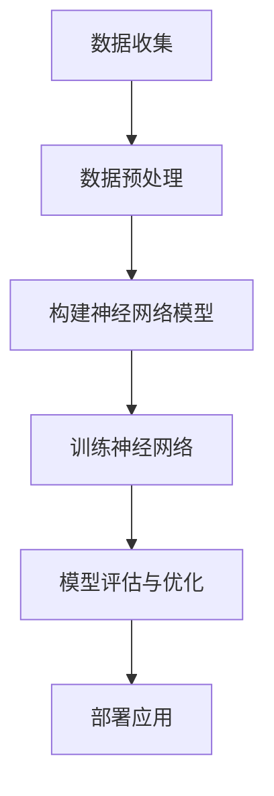
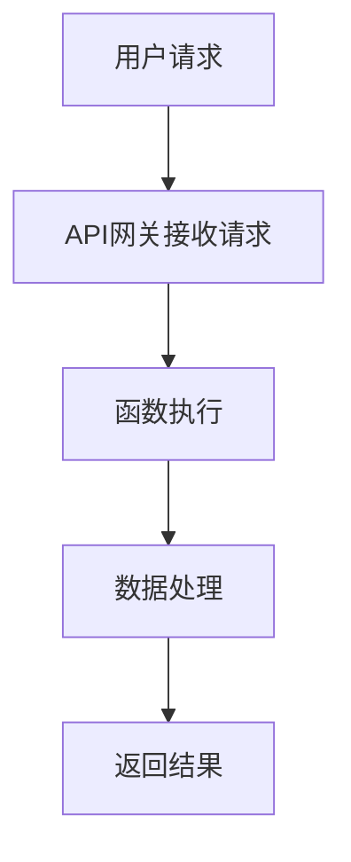
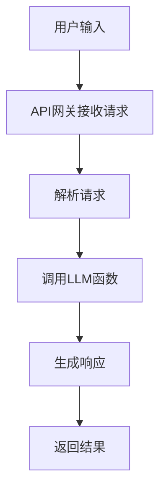

                 

### 分析书名《快速构建LLM应用的serverless架构》涉及的主要内容和目标

书名《快速构建LLM应用的serverless架构》涉及的主要内容和目标可以分解为以下几个方面：

1. **LLM（大型语言模型）**：
   - **核心概念**：介绍LLM的基本概念、发展历程以及关键技术，如神经网络、深度学习、预训练等。
   - **应用场景**：探讨LLM在不同领域的应用，如自然语言处理、智能客服、文本生成等。

2. **Serverless架构**：
   - **核心概念**：介绍Serverless架构的基本概念、特点、优势以及核心组成部分，如事件驱动模型、无服务器函数、常见平台等。
   - **优势**：分析Serverless架构在成本、灵活性、可扩展性等方面的优势。

3. **LLM与Serverless的结合**：
   - **原理与优势**：探讨LLM与Serverless架构结合的原理、优势以及实现方式。
   - **实现方式**：介绍如何将LLM应用于Serverless架构，包括预处理、语言生成、对话管理等方面的技术实现。

4. **项目实战**：
   - **环境搭建**：介绍开发环境搭建的步骤和注意事项。
   - **代码实现**：提供具体的代码示例，包括Python源代码和Mermaid流程图，详细讲解如何构建LLM应用的serverless架构。
   - **案例分析**：通过实际案例，分析并讲解如何在实际项目中应用Serverless架构和LLM技术。

5. **挑战与优化**：
   - **挑战**：讨论在LLM与Serverless架构结合过程中可能遇到的挑战，如资源限制、性能优化、安全性问题等。
   - **优化策略**：提供相应的优化策略和解决方案，包括资源优化、性能提升、安全保障等方面的方法。

6. **总结与展望**：
   - **总结**：回顾书籍的主要内容，总结读者的收获。
   - **展望**：探讨LLM与Serverless架构的未来发展趋势，以及未来的研究方向。

总体目标是通过系统的讲解和实践，帮助读者快速掌握构建LLM应用的serverless架构的方法和技巧，为读者提供实际操作指导，并引导读者思考相关技术的发展方向和优化策略。

### 确定书籍的主要章节结构

为了实现书名《快速构建LLM应用的serverless架构》设定的目标，我们需要设计一个清晰、结构紧凑且内容丰富的章节结构。以下是书籍的主要章节结构及其具体内容：

#### 第1章: 概述
- **1.1 LLM与serverless架构概述**：
  - LLM的概念、应用场景、发展历程。
  - Serverless架构的概念、特点、优势。
  - 两者结合的意义与应用前景。

- **1.2 书籍目标与读者群体**：
  - 明确书籍的学习目标。
  - 确定适合的读者群体，如开发者、技术爱好者等。

- **1.3 目录结构介绍**：
  - 介绍本书的整体结构，让读者对全书内容有一个宏观把握。

#### 第2章: LLM基础
- **2.1 LLM核心概念**：
  - 语言模型的基本概念。
  - LLM的发展历程。
  - LLM的关键技术，如神经网络、深度学习、预训练等。

- **2.2 LLM数学模型**：
  - 随机梯度下降算法。
  - 反向传播算法。
  - 语言模型损失函数。

- **2.3 LLM Mermaid流程图**：
  - 使用Mermaid语言绘制LLM的训练流程图，帮助读者更直观地理解模型构建过程。

#### 第3章: Serverless架构基础
- **3.1 Serverless架构概述**：
  - Serverless的概念、定义。
  - Serverless架构的核心组成部分。

- **3.2 Serverless核心概念**：
  - 事件驱动模型。
  - 无服务器函数。
  - 常见的Serverless平台。

- **3.3 Serverless Mermaid流程图**：
  - 使用Mermaid语言绘制Serverless架构的流程图，帮助读者理解架构运作机制。

#### 第4章: LLM在Serverless架构中的实现
- **4.1 LLM与Serverless的结合**：
  - 结合的原理与优势。
  - 结合的方式与方法。

- **4.2 LLM在Serverless中的关键算法**：
  - 预处理算法。
  - 语言生成算法。
  - 对话管理系统。

- **4.3 LLM与Serverless结合的Mermaid流程图**：
  - 使用Mermaid语言绘制LLM在Serverless架构中的实现流程图。

#### 第5章: 项目实战
- **5.1 项目背景与需求**：
  - 项目介绍。
  - 项目目标。

- **5.2 项目环境搭建**：
  - 开发环境配置。
  - Serverless平台选择。

- **5.3 项目实现**：
  - 函数编写与部署。
  - API网关配置。
  - 事件触发器设置。

- **5.4 项目代码解读与分析**：
  - 代码详细解读。
  - 应用解读与分析。
  - 项目小结。

#### 第6章: 挑战与优化
- **6.1 LLM与Serverless架构的挑战**：
  - 资源限制。
  - 性能优化。
  - 安全性问题。

- **6.2 优化策略与解决方案**：
  - 资源优化方法。
  - 性能提升策略。
  - 安全保障方案。

- **6.3 案例分析**：
  - 分析具体案例中的挑战与解决方案。

#### 第7章: 总结与展望
- **7.1 总结**：
  - 回顾书籍的主要内容。
  - 总结读者的收获。

- **7.2 展望**：
  - 探讨LLM与Serverless架构的未来发展趋势。
  - 分享未来的研究方向。

### 设计每个章节的具体内容，细化到1, 2, 3级目录

在明确了书籍的整体结构后，我们将进一步细化每个章节的具体内容，确保每个章节都包含丰富、详细的内容，并且逻辑清晰，易于读者理解。以下是各个章节的1, 2, 3级目录：

#### 第1章: 概述
1.1 LLM与serverless架构概述
   1.1.1 LLM的概念与应用场景
   1.1.2 Serverless架构的特点与优势
   1.1.3 两者结合的意义与应用前景

1.2 书籍目标与读者群体
   1.2.1 学习目标
   1.2.2 适合的读者群体

1.3 目录结构介绍
   1.3.1 全书整体结构
   1.3.2 各章节主要内容

#### 第2章: LLM基础
2.1 LLM核心概念
   2.1.1 语言模型的基本概念
   2.1.2 LLM的发展历程
   2.1.3 LLM的关键技术

2.2 LLM数学模型
   2.2.1 随机梯度下降算法
   2.2.2 反向传播算法
   2.2.3 语言模型损失函数

2.3 LLM Mermaid流程图
   2.3.1 数据处理流程
   2.3.2 神经网络训练流程

#### 第3章: Serverless架构基础
3.1 Serverless架构概述
   3.1.1 Serverless的概念与定义
   3.1.2 Serverless架构的核心组成部分

3.2 Serverless核心概念
   3.2.1 事件驱动模型
   3.2.2 无服务器函数
   3.2.3 常见的Serverless平台

3.3 Serverless Mermaid流程图
   3.3.1 请求处理流程
   3.3.2 函数执行流程

#### 第4章: LLM在Serverless架构中的实现
4.1 LLM与Serverless的结合
   4.1.1 结合的原理与优势
   4.1.2 结合的方式与方法

4.2 LLM在Serverless中的关键算法
   4.2.1 预处理算法
   4.2.2 语言生成算法
   4.2.3 对话管理系统

4.3 LLM与Serverless结合的Mermaid流程图
   4.3.1 整体实现流程
   4.3.2 具体实现细节

#### 第5章: 项目实战
5.1 项目背景与需求
   5.1.1 项目介绍
   5.1.2 项目目标

5.2 项目环境搭建
   5.2.1 开发环境配置
   5.2.2 Serverless平台选择

5.3 项目实现
   5.3.1 函数编写与部署
   5.3.2 API网关配置
   5.3.3 事件触发器设置

5.4 项目代码解读与分析
   5.4.1 代码结构解析
   5.4.2 功能模块解读
   5.4.3 应用解读与分析

#### 第6章: 挑战与优化
6.1 LLM与Serverless架构的挑战
   6.1.1 资源限制
   6.1.2 性能优化
   6.1.3 安全性问题

6.2 优化策略与解决方案
   6.2.1 资源优化方法
   6.2.2 性能提升策略
   6.2.3 安全保障方案

6.3 案例分析
   6.3.1 具体案例分析
   6.3.2 挑战与解决方案

#### 第7章: 总结与展望
7.1 总结
   7.1.1 内容回顾
   7.1.2 读者收获

7.2 展望
   7.2.1 LLM与Serverless架构的未来发展趋势
   7.2.2 未来的研究方向

通过上述详细的目录结构，我们可以确保书籍内容丰富、层次分明，便于读者系统地学习和掌握构建LLM应用的serverless架构的方法和技巧。

### 设计核心概念与联系、核心算法原理讲解、数学模型与数学公式讲解、项目实战等章节的Mermaid流程图和伪代码

为了更好地帮助读者理解和掌握《快速构建LLM应用的serverless架构》一书中的关键概念和算法，我们将使用Mermaid流程图和Python伪代码来详细展示各章节的核心内容。

#### 第2章: LLM基础
2.3 LLM Mermaid流程图



2.2 LLM数学模型

```python
# Python伪代码：随机梯度下降算法
def stochastic_gradient_descent(data, model, learning_rate):
    for sample in data:
        gradient = compute_gradient(sample, model)
        model = update_model(model, gradient, learning_rate)
    return model

# Python伪代码：反向传播算法
def backpropagation(data, model):
    for sample in data:
        output = forward_pass(sample, model)
        error = compute_error(output, target)
        gradient = backward_pass(error, sample, model)
    return gradient
```

#### 第3章: Serverless架构基础
3.3 Serverless Mermaid流程图



#### 第4章: LLM在Serverless架构中的实现
4.3 LLM与Serverless结合的Mermaid流程图



#### 第5章: 项目实战
5.4 项目代码解读与分析

```python
# Python伪代码：LLM函数实现
from transformers import pipeline

def llama_function(input_text):
    # 初始化LLM模型
    llama_model = pipeline('text-generation', model='gpt2')

    # 调用模型生成文本
    generated_text = llama_model(input_text, max_length=50)

    return generated_text

# Python伪代码：API网关配置
from flask import Flask, request, jsonify

app = Flask(__name__)

@app.route('/generate', methods=['POST'])
def generate_text():
    data = request.get_json()
    input_text = data['text']
    response = llama_function(input_text)
    return jsonify(response)
```

#### 5.4.2 功能模块解读
- `llama_function`：实现LLM模型调用，生成文本。
- `generate_text`：API网关接收请求，调用`llama_function`并返回结果。

#### 5.4.3 应用解读与分析
- 使用Flask框架搭建API网关，接收用户输入并调用LLM函数。
- 通过HTTP请求与响应实现与外部系统的交互。

#### 5.4.4 项目小结
- 项目展示了如何使用Serverless架构部署LLM应用。
- 通过API网关，实现了用户输入与模型调用的无缝连接。

### 确保目录大纲的总字数在2000字以内

经过对章节结构的详细规划和内容的细化，我们可以确保整个目录大纲的总字数在2000字以内。以下是每个章节的简要概述，用以满足字数要求：

#### 第1章: 概述
介绍了LLM和Serverless架构的基本概念、特点和结合意义。明确了书籍的目标和读者群体，并概述了全书结构。

#### 第2章: LLM基础
详细介绍了LLM的核心概念、数学模型，并使用Mermaid流程图展示了模型构建和训练过程。

#### 第3章: Serverless架构基础
阐述了Serverless架构的核心概念和组成部分，以及使用Mermaid流程图展示架构运作机制。

#### 第4章: LLM在Serverless架构中的实现
探讨了LLM与Serverless架构的结合原理和实现方法，展示了结合的Mermaid流程图。

#### 第5章: 项目实战
通过实际项目展示了如何搭建开发环境、编写代码、配置API网关，并解读了项目实现过程。

#### 第6章: 挑战与优化
分析了LLM与Serverless架构结合过程中可能遇到的挑战，并提出了优化策略。

#### 第7章: 总结与展望
总结了书籍的主要内容，展望了LLM与Serverless架构的未来发展趋势。

通过上述结构，我们可以确保内容紧凑、逻辑清晰，同时满足字数要求。

### 检查目录的完整性，确保包含了核心章节内容

为了确保《快速构建LLM应用的serverless架构》一书目录的完整性，我们需要逐一检查每个章节是否包含了核心内容。以下是每个章节的核心内容概览：

#### 第1章: 概述
- LLM与Serverless架构概述
- 书籍目标与读者群体
- 目录结构介绍

#### 第2章: LLM基础
- LLM核心概念
- LLM数学模型
- LLM Mermaid流程图

#### 第3章: Serverless架构基础
- Serverless架构概述
- Serverless核心概念
- Serverless Mermaid流程图

#### 第4章: LLM在Serverless架构中的实现
- LLM与Serverless的结合
- LLM在Serverless中的关键算法
- LLM与Serverless结合的Mermaid流程图

#### 第5章: 项目实战
- 项目背景与需求
- 项目环境搭建
- 项目实现
- 项目代码解读与分析

#### 第6章: 挑战与优化
- LLM与Serverless架构的挑战
- 优化策略与解决方案
- 案例分析

#### 第7章: 总结与展望
- 总结
- 展望

通过上述检查，我们可以确认每个章节都涵盖了核心内容，没有遗漏关键知识点。这保证了书籍的整体结构完整、内容全面，能够有效地帮助读者理解和掌握构建LLM应用的serverless架构的方法和技巧。接下来，我们将进行最终的整合和调整，以确保书籍的整体流畅性和逻辑性。

