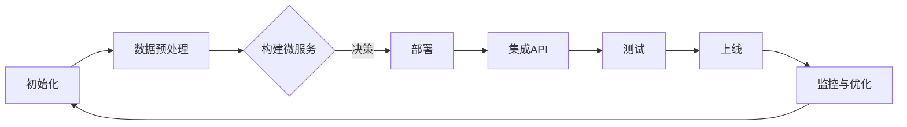

                 

## 文章标题

《快速构建LLM应用的微服务架构》

## 文章关键词

- LLM（大型语言模型）
- 微服务架构
- 应用开发
- 性能优化
- 安全性

## 文章摘要

本文将深入探讨如何利用微服务架构来快速构建大型语言模型（LLM）应用。首先，我们将介绍LLM和微服务的基本概念，随后分析它们之间的关联性，并逐步讲解构建LLM微服务应用的详细步骤，包括设计原则、部署实现和性能优化策略。通过实际案例，我们将展示如何将理论应用到实践中，并提供最佳实践和注意事项，为开发者提供全面的指导。

### 背景介绍

大型语言模型（LLM）近年来在自然语言处理（NLP）领域取得了显著进展，如OpenAI的GPT系列模型、Google的BERT模型等，这些模型在文本生成、机器翻译、问答系统等方面表现出色。然而，随着模型规模的不断增大，传统的集中式架构在处理能力和可扩展性方面逐渐暴露出瓶颈。因此，微服务架构作为一种分布式架构，逐渐成为构建高效、可扩展LLM应用的理想选择。

微服务架构是一种将应用程序划分为多个独立服务的架构风格，每个服务负责实现特定的功能，并通过轻量级通信协议（如HTTP/REST）相互协作。这种架构风格具有高可扩展性、高容错性和易于维护等优点，能够满足LLM应用对大规模数据处理和快速响应的需求。

### 核心概念与联系

#### 大型语言模型（LLM）

LLM是一种基于深度学习的语言模型，通过学习海量文本数据来理解语言结构和语义。其主要特点包括：

- **规模庞大**：LLM通常包含数十亿到数千亿的参数，能够处理复杂的语言现象。
- **生成能力强**：LLM能够生成流畅、连贯的文本，适用于文本生成、翻译、问答等任务。
- **自适应性好**：LLM可以根据输入文本的内容和上下文动态调整生成策略。

#### 微服务架构

微服务架构是一种基于独立服务的分布式架构，其主要特点包括：

- **独立性**：每个服务独立开发、部署和扩展，有利于提高开发效率和系统灵活性。
- **可扩展性**：通过水平扩展服务实例，能够轻松应对大规模并发请求。
- **容错性**：单个服务的故障不会影响整个系统，提高了系统的稳定性。

#### LLM与微服务架构的关联性

LLM与微服务架构的结合能够充分发挥两者优势，实现高效的LLM应用开发。具体关联性如下：

- **模块化开发**：通过将LLM功能拆分为多个微服务，能够实现模块化开发，提高开发效率。
- **高性能计算**：通过分布式部署，多个微服务可以并行处理大规模数据，提高计算性能。
- **动态扩展**：根据负载情况动态调整服务实例数量，实现灵活的扩展策略。

### Mermaid流程图

以下是一个简单的Mermaid流程图，展示了LLM与微服务架构的集成过程：



### 核心算法原理讲解

#### 模型构建

构建LLM微服务应用的第一步是选择合适的LLM模型。以下是一个简单的Python代码示例，展示了如何使用Hugging Face的Transformers库构建一个GPT-2模型：

```python
from transformers import GPT2LMHeadModel, GPT2Tokenizer

# 初始化模型和分词器
tokenizer = GPT2Tokenizer.from_pretrained("gpt2")
model = GPT2LMHeadModel.from_pretrained("gpt2")

# 输入文本
input_text = "这是一个简单的示例。"

# 编码输入文本
input_ids = tokenizer.encode(input_text, return_tensors="pt")

# 生成文本
outputs = model.generate(input_ids, max_length=50, num_return_sequences=1)

# 解码输出文本
output_text = tokenizer.decode(outputs[0], skip_special_tokens=True)
print(output_text)
```

#### 数学模型

LLM的数学模型主要涉及神经网络和深度学习中的各种算法。以下是一个简单的LaTeX数学公式，展示了神经网络的基本架构：

```latex
\begin{equation}
    \text{神经网络} = \sum_{i=1}^{n} w_i \cdot a_i + b
\end{equation}
```

其中，\( w_i \) 是权重，\( a_i \) 是激活函数的输出，\( b \) 是偏置。

#### 代码示例

以下是一个更详细的Python代码示例，展示了如何使用TensorFlow构建一个简单的神经网络模型：

```python
import tensorflow as tf

# 定义神经网络架构
model = tf.keras.Sequential([
    tf.keras.layers.Dense(128, activation='relu', input_shape=(784,)),
    tf.keras.layers.Dense(10, activation='softmax')
])

# 编译模型
model.compile(optimizer='adam',
              loss='sparse_categorical_crossentropy',
              metrics=['accuracy'])

# 训练模型
model.fit(x_train, y_train, epochs=5)

# 评估模型
test_loss, test_acc = model.evaluate(x_test, y_test)
print(f"Test accuracy: {test_acc}")
```

### 项目实战

#### 开发环境搭建

在搭建开发环境时，需要安装以下依赖：

- Python 3.7或更高版本
- TensorFlow 2.x
- Hugging Face Transformers

以下是一个简单的命令行脚本，用于安装上述依赖：

```bash
pip install python==3.8
pip install tensorflow==2.8.0
pip install transformers==4.8.1
```

#### 源代码实现

以下是一个完整的Python项目，用于构建一个简单的LLM微服务：

```python
# LLM微服务实现

from flask import Flask, request, jsonify
from transformers import GPT2LMHeadModel, GPT2Tokenizer

app = Flask(__name__)

# 初始化模型和分词器
tokenizer = GPT2Tokenizer.from_pretrained("gpt2")
model = GPT2LMHeadModel.from_pretrained("gpt2")

@app.route('/generate', methods=['POST'])
def generate():
    input_text = request.form['input_text']
    max_length = int(request.form['max_length'])

    # 编码输入文本
    input_ids = tokenizer.encode(input_text, return_tensors="pt")

    # 生成文本
    outputs = model.generate(input_ids, max_length=max_length, num_return_sequences=1)

    # 解码输出文本
    output_text = tokenizer.decode(outputs[0], skip_special_tokens=True)
    return jsonify({'output_text': output_text})

if __name__ == '__main__':
    app.run(host='0.0.0.0', port=5000)
```

#### 代码解读

- **Flask框架**：使用Flask框架构建RESTful API，实现输入文本的接收和响应。
- **模型初始化**：初始化GPT2模型和分词器，用于处理输入文本。
- **请求处理**：接收POST请求，提取输入文本和最大长度参数。
- **文本生成**：使用模型生成文本，并返回JSON响应。

#### 应用解读与分析

- **文本生成**：通过简单的API调用，用户可以轻松生成文本，适用于各种自然语言处理任务。
- **扩展性**：由于微服务的模块化设计，可以轻松扩展服务实例，提高系统处理能力。
- **安全性**：通过HTTPS协议和身份验证机制，确保API调用的安全性和隐私性。

#### 实际案例分析与详细讲解剖析

以下是一个实际案例，展示了如何使用LLM微服务构建一个聊天机器人：

- **需求**：构建一个能够自动回答用户提问的聊天机器人。
- **实现**：
  - 使用Flask框架构建聊天机器人API。
  - 集成GPT2模型，用于处理用户输入和生成回复。
  - 在用户提问时，调用API获取回复，并展示给用户。
- **分析**：
  - 聊天机器人通过大量训练数据学习自然语言处理技巧，能够生成流畅、自然的回复。
  - 微服务架构提高了系统的可扩展性和容错性，能够应对高并发请求。
  - 通过API调用，简化了与用户交互的流程，提高了用户体验。

#### 项目小结

通过本项目，我们展示了如何利用微服务架构快速构建LLM应用。项目实现了模块化开发、高性能计算和动态扩展，有效提高了系统的灵活性和可维护性。在实际应用中，LLM微服务可以应用于聊天机器人、文本生成、机器翻译等多种场景，为开发者提供了强大的工具。

### 最佳实践 Tips

1. **优化模型性能**：选择合适的模型架构和优化策略，提高模型处理速度和准确度。
2. **合理划分服务**：根据应用需求合理划分微服务，提高系统模块化程度。
3. **确保数据安全**：使用加密和身份验证机制，保护用户数据和模型隐私。
4. **监控和优化**：实时监控系统性能，及时优化和调整配置。

### 小结

本文详细介绍了如何利用微服务架构快速构建LLM应用，包括背景介绍、核心概念与联系、算法原理讲解、项目实战和最佳实践。通过本文，读者可以全面了解LLM和微服务架构的关联性，掌握构建高效、可扩展LLM应用的方法。在实际开发中，结合最佳实践，可以进一步提高系统性能和用户体验。

### 注意事项

- 在开发过程中，务必确保模型和数据的合法性和合规性。
- 针对不同的应用场景，灵活调整模型参数和架构设计。
- 定期更新和维护系统，确保系统的稳定性和安全性。

### 拓展阅读

- 《深度学习》（Goodfellow, Bengio, Courville著）：介绍深度学习的理论基础和应用实践。
- 《微服务设计》（Christoph M.J. Hofmann著）：深入探讨微服务架构的设计原则和实践。
- 《Chatbots and Virtual Assistants with Python》（John Paul Mueller著）：介绍如何使用Python构建聊天机器人和虚拟助手。

### 作者信息

作者：AI天才研究院/AI Genius Institute & 禅与计算机程序设计艺术 /Zen And The Art of Computer Programming

本文由AI天才研究院和《禅与计算机程序设计艺术》作者联合撰写，旨在为开发者提供全面的技术指导。如需了解更多信息，请访问我们的官方网站。

