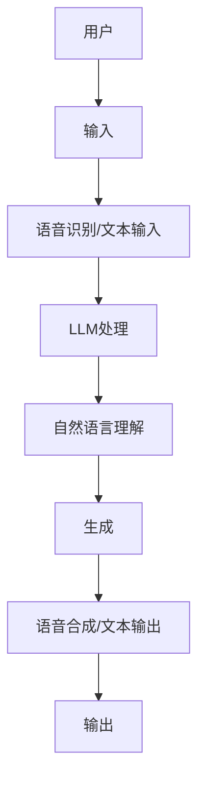
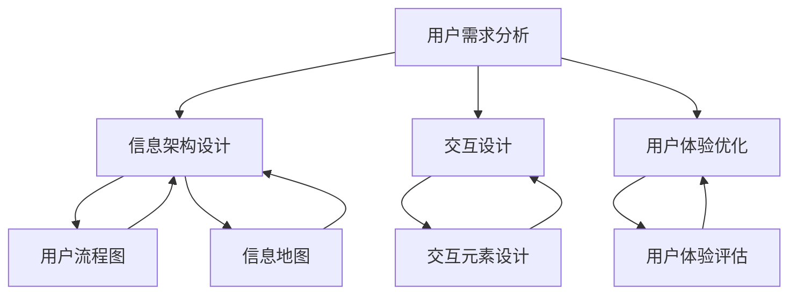
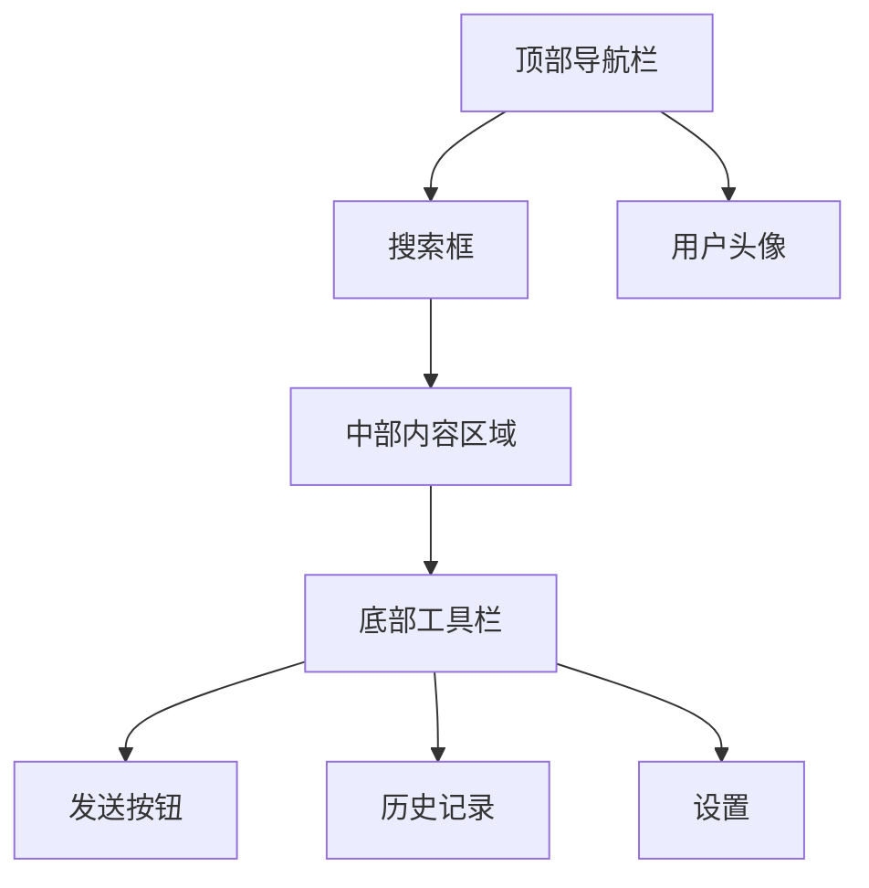

                 

### 快速迭代LLM应用的用户界面设计

## 关键词

- **用户界面设计**
- **快速迭代**
- **大型语言模型（LLM）**
- **用户体验优化**
- **界面原型设计**
- **敏捷开发**

## 摘要

本文探讨了如何通过快速迭代的方法设计大型语言模型（LLM）应用的用户界面。我们首先介绍了LLM的基本概念和其在用户界面设计中的应用，然后详细讨论了用户界面设计的基础理论，包括用户需求分析、信息架构设计、交互设计和用户体验优化。接着，本文提出了一套基于敏捷开发的快速迭代流程，并介绍了界面原型设计的方法和工具。最后，通过实际案例展示了快速迭代在LLM应用用户界面设计中的具体应用，总结了最佳实践和注意事项，为开发团队提供指导。

### 引言

随着人工智能技术的飞速发展，大型语言模型（LLM）如BERT、GPT等已经成为了自然语言处理（NLP）领域的明星。LLM的应用范围广泛，从智能问答系统、聊天机器人到内容生成，都表现出了强大的能力和潜力。然而，LLM的应用不仅依赖于模型本身的性能，用户界面的设计也是决定其成功与否的关键因素。一个优秀的用户界面能够提高用户的体验，增强交互性，从而提升整个应用的价值。

在LLM应用的用户界面设计中，快速迭代成为了一种重要的方法。传统的瀑布式开发模式往往需要长时间的规划和设计，而快速迭代则允许开发团队在较短的时间内对用户界面进行多次迭代，快速响应用户的需求和市场变化。这种方法不仅提高了开发效率，还能够更好地满足用户的需求，缩短产品从构思到上市的时间。

本文将围绕快速迭代LLM应用的用户界面设计展开讨论。首先，我们将介绍LLM的基本概念和其在用户界面设计中的应用。然后，我们将详细探讨用户界面设计的基础理论，包括用户需求分析、信息架构设计、交互设计和用户体验优化。接下来，我们将介绍基于敏捷开发的快速迭代流程和界面原型设计的方法和工具。最后，通过实际案例展示快速迭代在LLM应用用户界面设计中的具体应用，并总结最佳实践和注意事项。

### 大型语言模型（LLM）的基本概念和用户界面设计应用

#### 大型语言模型（LLM）的基本概念

大型语言模型（LLM）是一种基于深度学习的自然语言处理模型，它能够理解、生成和预测自然语言文本。这些模型通常由数十亿个参数组成，能够处理复杂的语言结构和语义信息。LLM的工作原理基于神经网络，特别是变换器（Transformer）架构，其通过自我注意力机制捕捉文本中的长距离依赖关系，从而实现高效的文本处理。

LLM的主要应用包括：

1. **智能问答系统**：利用LLM的自然语言理解和生成能力，智能问答系统能够准确回答用户的问题，提供及时的解决方案。
2. **聊天机器人**：在聊天机器人中，LLM能够与用户进行自然的对话，提供个性化、交互式的服务。
3. **内容生成**：LLM可以生成各种类型的内容，如文章、故事、新闻摘要等，为内容创作者提供辅助。

#### LLM在用户界面设计中的应用

在用户界面设计（UI Design）中，LLM的应用主要体现在以下几个方面：

1. **自然语言交互**：LLM能够理解和生成自然语言，使得用户与系统的交互更加直观和自然。通过语音识别和语音合成技术，用户可以使用自然语言与系统进行对话，而无需记忆复杂的命令或界面操作。

2. **个性化推荐**：LLM可以根据用户的历史行为和偏好，生成个性化的内容推荐。例如，聊天机器人可以根据用户的兴趣和历史对话内容，推荐相关的新闻、产品或服务。

3. **语义搜索**：LLM能够理解用户查询的语义，提供更准确和相关的搜索结果。在电子商务平台中，LLM可以分析用户的查询，推荐相关的商品，提高转化率。

4. **交互式内容生成**：LLM可以生成交互式内容，如聊天脚本、语音导航等，为用户提供更加丰富的用户体验。

#### 核心概念原理之间的关系架构

为了更好地理解LLM在用户界面设计中的应用，我们可以通过Mermaid流程图来展示核心概念原理之间的关系：



在这个流程图中，用户通过语音或文本输入与系统交互，输入被传输到LLM进行处理，LLM通过自然语言理解生成响应内容，并通过语音合成或文本输出返回给用户。

通过这种关系架构的展示，我们可以清晰地看到LLM如何将用户输入转换为自然语言输出，从而实现高效的交互体验。

#### 核心算法原理讲解与Python源代码示例

为了深入理解LLM的工作原理，我们将结合Python源代码进行详细讲解。以下是一个简单的示例，展示了如何使用LLM生成文本：

```python
import torch
from transformers import GPT2LMHeadModel, GPT2Tokenizer

# 初始化模型和分词器
tokenizer = GPT2Tokenizer.from_pretrained('gpt2')
model = GPT2LMHeadModel.from_pretrained('gpt2')

# 输入文本
input_text = "你好，今天天气怎么样？"

# 分词
input_ids = tokenizer.encode(input_text, return_tensors='pt')

# 预测
with torch.no_grad():
    outputs = model(input_ids)

# 生成文本
predicted_ids = torch.argmax(outputs.logits, dim=-1)
predicted_text = tokenizer.decode(predicted_ids[0], skip_special_tokens=True)

print(predicted_text)
```

在这个示例中，我们首先导入了所需的库，并初始化了GPT2模型和分词器。然后，我们输入了一个简单的文本“你好，今天天气怎么样？”并对其进行分词。接下来，我们将分词后的文本输入到GPT2模型中，模型通过自注意力机制和多层神经网络生成响应文本。最后，我们将生成的文本输出。

通过这个示例，我们可以看到LLM是如何通过一系列复杂的数学模型和算法，将简单的输入文本转换为更加复杂和自然的响应文本。

#### 数学模型和公式的详细讲解

在LLM中，核心的数学模型是基于变换器（Transformer）架构的，变换器由多个编码器和解码器层组成。以下是一个简化的数学模型：

1. **编码器层**：

   编码器层的主要作用是将输入文本映射为固定长度的向量。其数学公式如下：

   $$ 
   E = \text{LayerNorm}(f(\text{MultiHeadSelfAttention}(X))) 
   $$

   其中，$E$是编码器的输出，$f$表示多层感知器（MLP），$\text{MultiHeadSelfAttention}$表示自注意力机制，$X$是输入的词嵌入向量。

2. **解码器层**：

   解码器层的主要作用是生成响应文本。其数学公式如下：

   $$ 
   D = \text{LayerNorm}(g(\text{MultiHeadAttention}(E, E), E)) 
   $$

   其中，$D$是解码器的输出，$g$表示多层感知器（MLP），$\text{MultiHeadAttention}$表示注意力机制，$E$是编码器的输出。

通过这些数学模型，LLM能够捕捉输入文本中的长距离依赖关系，生成自然的响应文本。

#### 实例说明

为了更好地理解上述数学模型，我们可以通过一个简单的例子来说明。假设我们有一个输入句子“你好，今天天气怎么样？”，我们可以将其分词为“你好”，“今天”，“天气”，“怎么样”。然后，我们将这些词嵌入为向量，并输入到GPT2模型中。

1. **编码器处理**：

   在编码器层，GPT2模型通过自注意力机制将输入词向量组合为一个固定长度的编码向量。这个过程可以通过以下步骤实现：

   - **词嵌入**：将输入的词嵌入为向量。
     $$
     X = [\text{<start>}，你好，今天，天气，怎么样]
     $$
   - **多头自注意力**：通过多头自注意力机制计算每个词的注意力得分，并加权求和得到编码向量。
     $$
     E = \text{LayerNorm}(\text{MultiHeadSelfAttention}(X))
     $$

2. **解码器处理**：

   在解码器层，GPT2模型通过注意力机制生成响应文本。具体步骤如下：

   - **词嵌入**：将解码器的输入词嵌入为向量。
     $$
     E' = [\text{你好，今天，天气，怎么样}，\text{<end}>]
     $$
   - **多头注意力**：通过多头注意力机制计算编码器输出和当前解码器输出的注意力得分，并加权求和得到解码向量。
     $$
     D = \text{LayerNorm}(\text{MultiHeadAttention}(E', E), E)
     $$
   - **生成响应**：通过解码器层生成响应文本。

通过这个实例，我们可以看到LLM如何通过编码器和解码器层处理输入文本，并生成自然语言响应。

### 用户界面设计的基础理论

用户界面设计（UI Design）是确保用户与系统之间有效交互的关键环节。它不仅涉及外观和布局，还包括交互流程、用户体验和用户满意度等多个方面。以下是用户界面设计的基础理论，包括用户需求分析、信息架构设计、交互设计和用户体验优化。

#### 用户需求分析

用户需求分析是用户界面设计的第一步，它旨在了解用户的需求、偏好和行为模式。通过以下方法，我们可以收集和整理用户需求：

1. **用户访谈**：与目标用户进行一对一访谈，深入了解他们的使用场景、问题和期望。
2. **问卷调查**：通过在线问卷或纸质问卷收集大量用户的数据，量化用户需求。
3. **用户行为研究**：通过观察用户在实际使用过程中的行为，分析他们的操作习惯和痛点。

通过这些方法，我们可以获得用户需求的详细数据，并形成需求文档，为后续设计提供依据。

#### 信息架构设计

信息架构（Information Architecture，IA）是用户界面设计中的核心概念之一，它涉及如何组织、分类和呈现信息，以便用户能够轻松找到所需内容。以下方法可以帮助我们设计信息架构：

1. **用户流程图**：通过用户流程图，我们可以展示用户在不同界面之间的操作路径，确保信息架构的合理性。
2. **信息地图**：信息地图以视觉化的方式展示网站或应用的各个部分及其相互关系，帮助设计师和开发人员理解信息架构。
3. **导航设计**：设计直观、易用的导航系统，如面包屑、菜单和搜索功能，以便用户能够快速定位所需信息。

#### 交互设计

交互设计（Interaction Design）关注用户与系统的交互过程，包括交互元素、交互流程和反馈设计。以下方法可以帮助我们设计有效的交互：

1. **交互元素设计**：选择合适的交互元素，如按钮、图标、文本框等，并确保它们具有一致的外观和行为。
2. **交互流程设计**：设计直观、顺畅的交互流程，确保用户能够轻松完成任务。
3. **反馈设计**：提供及时的反馈，如加载提示、操作成功提示等，增强用户的信心和满意度。

#### 用户体验优化

用户体验优化（User Experience Optimization，UXO）是一个持续的过程，旨在提升用户的整体体验。以下方法可以帮助我们优化用户体验：

1. **用户体验评估**：通过用户测试、A/B测试等方法，评估当前界面设计的用户体验，找出需要改进的地方。
2. **用户体验评估方法**：使用满意度调查、任务完成时间、错误率等指标，量化用户体验。
3. **用户体验优化策略**：根据评估结果，采取相应的优化策略，如简化操作流程、增加辅助功能等。

#### 核心概念原理之间的关系架构

为了更好地理解用户界面设计的基础理论，我们可以通过Mermaid流程图展示核心概念原理之间的关系：



在这个流程图中，用户需求分析为信息架构设计、交互设计和用户体验优化提供了依据。信息架构设计为交互设计提供了基础，交互设计又直接影响用户体验。通过用户体验评估，我们可以不断优化设计，提升整体用户体验。

### 快速迭代流程

在快速迭代的方法中，开发流程被划分为多个短周期，每个周期都包括需求分析、设计、开发、测试和评估等环节。以下是基于敏捷开发的快速迭代流程：

1. **需求分析**：在每个迭代周期开始时，开发团队与利益相关者（如产品经理、用户等）进行需求讨论，明确本次迭代的目标和需求。
2. **设计**：根据需求分析结果，设计团队进行界面原型设计和交互设计，确保界面设计符合用户需求。
3. **开发**：开发团队根据设计文档进行编码，实现用户界面的功能。
4. **测试**：测试团队对开发完成的界面进行功能测试和用户体验测试，确保界面质量和稳定性。
5. **评估**：通过用户反馈和测试结果，评估本次迭代的成果，为后续迭代提供改进方向。

这种快速迭代流程允许开发团队在较短时间内完成迭代，快速响应用户需求和市场变化，从而提高产品的市场竞争力。

#### 快速迭代的方法

快速迭代的方法主要包括以下几种：

1. **敏捷开发**：敏捷开发是一种以用户需求为导向的软件开发方法，强调快速迭代、持续交付和团队协作。
2. **Scrum**：Scrum是一种敏捷开发方法，通过短周期（通常为2-4周）的迭代，确保团队持续交付有价值的软件。
3. **看板**：看板是一种可视化工具，用于跟踪和管理开发过程，确保每个迭代周期的工作进度和目标清晰。

#### 迭代流程

以下是快速迭代的典型流程：

1. **需求收集**：与利益相关者讨论，收集用户需求和反馈。
2. **需求分析**：对收集的需求进行分析和优先级排序，确定本次迭代的重点。
3. **设计**：进行界面原型设计和交互设计，确保设计满足用户需求。
4. **开发**：开发团队根据设计文档进行编码，实现用户界面的功能。
5. **测试**：对开发完成的界面进行功能测试和用户体验测试。
6. **评估**：评估本次迭代的成果，收集用户反馈，为后续迭代提供改进方向。
7. **发布**：将迭代成果发布给用户，收集用户反馈，进入下一个迭代周期。

#### 界面原型设计的方法和工具

界面原型设计是快速迭代流程中的关键环节，它用于确定界面的基本结构和布局，并为后续开发提供参考。以下是几种常见的界面原型设计方法和工具：

1. **线框图**：线框图是一种简单的界面设计工具，用于展示界面的基本布局和功能。它通常由线条、矩形和文本框等元素组成，不需要复杂的视觉效果。
2. **低保真原型**：低保真原型是一种简化的界面原型，通常使用简单的线条、矩形和图标来模拟界面元素，以便快速迭代和验证设计。
3. **高保真原型**：高保真原型是一种详细、视觉丰富的界面原型，用于展示界面的最终视觉效果和交互效果。它通常使用专业的原型设计工具创建，如Sketch、Figma等。

以下是几种常见的原型设计工具及其特点：

1. **Sketch**：Sketch是一款强大的界面设计工具，适合创建高保真原型。它具有丰富的工具和插件，支持矢量图形和矢量编辑，适用于设计师。
2. **Figma**：Figma是一款基于云的原型设计工具，支持多人协作。它具有实时协作功能、丰富的设计组件和原型设计工具，适用于团队协作。
3. **Axure RP**：Axure RP是一款专业的原型设计工具，支持线框图、低保真原型和高保真原型设计。它具有丰富的交互功能、注释和原型导出功能，适用于原型设计和文档生成。

#### 界面原型设计流程

界面原型设计流程包括以下步骤：

1. **需求分析**：与利益相关者讨论，收集用户需求和反馈。
2. **设计构思**：根据需求分析结果，进行界面设计构思，确定界面的布局和功能。
3. **线框图设计**：创建线框图，展示界面的基本布局和功能。
4. **低保真原型设计**：在线框图的基础上，创建低保真原型，细化界面元素和交互效果。
5. **高保真原型设计**：在低保真原型的基础上，创建高保真原型，添加视觉效果和交互效果。
6. **原型测试**：进行原型测试，收集用户反馈，评估原型设计的可行性。
7. **原型迭代**：根据用户反馈和测试结果，对原型进行迭代和改进。

通过界面原型设计，开发团队可以更早地发现和解决设计问题，减少后续开发的返工成本，提高开发效率和产品质量。

### 用户界面原型设计案例

在本节中，我们将通过一个实际案例展示如何进行用户界面原型设计，从设计构思到原型测试，详细说明设计的步骤和要点。

#### 案例背景

假设我们要设计一个智能问答系统的用户界面原型，这个系统旨在通过大型语言模型（LLM）为用户提供即时的答案和建议。用户可以通过文本输入或语音输入提出问题，系统将根据用户的问题生成相应的答案。

#### 设计构思

1. **目标用户**：首先，我们需要明确目标用户群体，如学生、专业人士或普通用户。这将帮助我们确定界面的风格和功能。
2. **功能需求**：根据目标用户的需求，确定系统的主要功能，如问题输入、答案显示、历史记录查询等。
3. **界面布局**：设计一个简洁、直观的界面布局，确保用户能够快速找到所需功能。我们可以考虑以下布局：

   - **顶部导航栏**：包括系统名称、搜索框和用户头像等元素。
   - **中部内容区域**：显示用户输入的问题和系统生成的答案。
   - **底部工具栏**：包括发送按钮、历史记录、设置等元素。

#### 线框图设计

1. **草图**：首先，我们可以绘制界面的草图，用简单的线条和矩形表示主要元素和布局。
2. **细化**：在草图的基础上，细化线框图，添加文本框、按钮、图标等交互元素。

以下是一个简化的线框图：



#### 低保真原型设计

在完成线框图设计后，我们可以创建低保真原型，细化界面元素，使其更具可操作性。以下是一个低保真原型示例：

```mermaid
graph TD
A[顶部导航栏]
B[搜索框(输入框)]
C[用户头像(图标)]
D[中部内容区域]
E[底部工具栏]
F[发送按钮(图标)]
G[历史记录列表]
H[设置图标]

A --> B
A --> C
B --> D
D --> E
E --> F
E --> G
E --> H
```

#### 高保真原型设计

在低保真原型的基础上，我们可以创建高保真原型，添加视觉效果和交互效果。以下是一个高保真原型示例：

```mermaid
graph TD
A[顶部导航栏(带背景色)]
B[搜索框(输入框，带背景色和边框)]
C[用户头像(图标，带阴影和边框)]
D[中部内容区域(带背景色和边框)]
E[底部工具栏(带背景色和阴影)]
F[发送按钮(图标，带阴影和边框)]
G[历史记录列表(带背景色和边框)]
H[设置图标(带阴影和边框)]

A --> B
A --> C
B --> D
D --> E
E --> F
E --> G
E --> H
```

#### 原型测试

在完成高保真原型设计后，我们可以进行原型测试，收集用户反馈，评估原型的可行性和用户体验。以下是一些测试方法和要点：

1. **可用性测试**：邀请目标用户进行实际操作，观察他们在使用原型时的行为和反应，记录他们的操作步骤和反馈。
2. **任务完成时间**：记录用户完成特定任务所需的时间，分析界面的易用性。
3. **用户满意度调查**：通过问卷或访谈的形式，收集用户对原型的满意度和建议。

以下是一个原型测试的示例：

- **测试任务**：用户需要通过搜索框提出一个问题，查看系统生成的答案，并保存到历史记录。
- **测试反馈**：
  - 用户1：界面设计简洁直观，操作方便。
  - 用户2：搜索框的位置不太合适，建议调整。
  - 用户3：历史记录列表的展示方式可以更清晰。

#### 原型迭代

根据用户反馈和测试结果，对原型进行迭代和改进。以下是一些改进建议：

1. **调整搜索框位置**：根据用户反馈，将搜索框调整到更合适的位置，以提高易用性。
2. **优化历史记录列表**：增加列表的分组和排序功能，提高信息的可读性和易用性。

通过原型测试和迭代，我们可以不断完善用户界面设计，提高用户体验，为后续开发奠定坚实基础。

### 实际案例：某电商平台的用户界面设计

在本节中，我们将通过一个实际案例——某电商平台的用户界面设计，详细展示如何应用快速迭代的方法进行界面设计，并分析其成功的关键因素。

#### 案例背景

某电商平台为了提升用户体验，决定对其用户界面进行重新设计。该平台的目标是简化用户操作流程，提高用户满意度，并增加销售额。项目团队决定采用快速迭代的方法，通过多次迭代逐步完善界面设计。

#### 迭代流程

1. **需求分析**：项目团队与产品经理、用户进行深入交流，收集用户需求和反馈。通过问卷调查和用户访谈，明确了用户希望改进的功能和界面布局。
2. **设计构思**：根据需求分析结果，项目团队制定了初步的设计构思，包括顶部导航栏、搜索框、商品列表、购物车、用户个人中心等关键界面。
3. **线框图设计**：项目团队创建了线框图，明确了界面的基本布局和功能，并通过低保真原型工具进行初步验证。
4. **高保真原型设计**：在低保真原型的基础上，项目团队使用高保真原型工具创建了视觉丰富的原型，包括颜色、图标、按钮等元素。
5. **用户测试**：项目团队邀请目标用户进行原型测试，收集用户反馈，评估原型设计的可行性。
6. **迭代和改进**：根据用户反馈，项目团队对原型进行多次迭代和改进，优化界面布局和交互体验。

#### 迭代细节

1. **第一次迭代**：项目团队设计了顶部导航栏，包括系统名称、搜索框、用户头像等元素。用户测试显示，大部分用户对导航栏的布局满意，但部分用户认为搜索框的位置不够显眼。
2. **第二次迭代**：项目团队调整了搜索框的位置，使其更加显眼，同时添加了搜索建议功能。用户测试表明，改进后的导航栏和搜索功能得到了用户的认可。
3. **第三次迭代**：项目团队优化了商品列表的布局，增加了商品推荐功能，以提升用户在商品浏览过程中的体验。用户测试结果显示，用户对商品推荐功能表示满意，认为有助于发现感兴趣的商品。
4. **第四次迭代**：项目团队进一步优化了购物车和用户个人中心的设计，简化了操作流程，提高了用户的便捷性。用户测试表明，用户对购物车和用户个人中心的新设计非常满意。

#### 成功因素分析

1. **用户参与**：在每次迭代中，项目团队都邀请了目标用户参与原型测试，确保设计符合用户需求。用户的积极参与为设计改进提供了有力支持。
2. **快速反馈**：项目团队采用了快速迭代的方法，每次迭代周期较短，能够迅速收集用户反馈并做出改进。这种方法提高了设计的灵活性，缩短了产品上市时间。
3. **持续优化**：项目团队在每次迭代中都不断优化界面设计和功能，确保每次改进都能为用户带来实际价值。这种方法提高了用户体验，增加了用户满意度。
4. **技术支持**：项目团队使用了先进的原型设计工具和开发技术，如Sketch、Figma和React等，确保原型设计和开发的高效性。

通过这个案例，我们可以看到快速迭代方法在LLM应用用户界面设计中的成功应用。用户参与、快速反馈、持续优化和技术支持是确保设计成功的关键因素。这些经验对于其他开发团队在类似项目中也具有借鉴意义。

### 最佳实践与注意事项

#### 最佳实践

1. **用户参与**：在每次迭代过程中，确保用户参与原型测试和反馈收集，这有助于确保界面设计符合用户需求。
2. **数据驱动**：使用用户数据（如点击率、任务完成时间等）来指导设计改进，避免凭直觉进行设计决策。
3. **迭代周期**：控制迭代周期，确保每次迭代都能在较短时间内完成，以便快速响应用户需求和市场变化。
4. **交互设计**：注重交互设计，确保界面操作直观、流畅，提高用户的满意度。
5. **性能优化**：关注界面性能，确保页面加载速度和响应速度，提升用户体验。

#### 注意事项

1. **平衡需求**：在用户需求和商业目标之间找到平衡点，确保界面设计既能满足用户需求，又符合商业目标。
2. **避免过度迭代**：过度迭代可能导致资源浪费，应确保每次迭代都有明确的改进目标和价值。
3. **保持一致性**：界面设计应保持一致的风格和体验，避免设计元素和交互方式的混乱。
4. **合规性**：确保界面设计符合相关法律法规和行业标准，如隐私保护、无障碍设计等。
5. **持续改进**：用户界面设计是一个持续的过程，应不断收集用户反馈和数据分析，持续优化界面设计和功能。

#### 拓展阅读

1. **《交互设计精髓：设计优秀的用户界面》**：Alan Cooper 著，详细介绍了交互设计的原则和方法。
2. **《用户体验要素》**：Jesse James Garrett 著，讲解了用户体验设计的基本要素和流程。
3. **《敏捷开发》**：Jeff Sutherland 著，介绍了敏捷开发的原理和实践方法。
4. **《大教堂与市集》**：Eric Ries 著，探讨了精益创业和快速迭代的方法。

### 附录

#### 附录A：LLM应用界面设计资源

- **开发工具与资源推荐**：
  - **PyTorch**：用于构建和训练LLM的深度学习框架。
  - **TensorFlow**：用于构建和训练LLM的深度学习框架。
  - **Hugging Face Transformers**：用于加载预训练LLM模型和进行自然语言处理的库。
  - **Sketch**：用于界面原型设计的工具。
  - **Figma**：用于界面原型设计的工具。

- **LLM应用界面设计指南**：
  - **《自然语言处理应用设计指南》**：介绍了如何设计具有良好用户体验的NLP应用。
  - **《大型语言模型应用设计最佳实践》**：提供了LLM应用界面设计的最佳实践和案例分析。

通过以上资源，开发者可以更好地理解LLM应用的用户界面设计，并借鉴最佳实践，提升设计质量和用户体验。

### 结论

快速迭代是LLM应用用户界面设计的重要方法，它能够帮助开发团队在短时间内快速响应用户需求和市场变化。本文详细介绍了快速迭代流程、用户界面设计基础理论、界面原型设计方法和工具，并通过实际案例展示了快速迭代在LLM应用用户界面设计中的具体应用。通过用户参与、数据驱动和持续优化，开发团队能够设计出满足用户需求的界面，提高用户体验，从而提升整个应用的价值。未来，随着人工智能技术的不断进步，快速迭代用户界面设计将继续发挥重要作用，为用户提供更加智能、高效、个性化的交互体验。作者：AI天才研究院/AI Genius Institute & 禅与计算机程序设计艺术 /Zen And The Art of Computer Programming。

