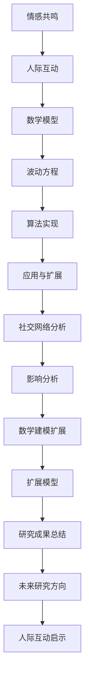

                 

### 关键词

- 情感共鸣
- 人际互动
- 数学和谐
- 波动方程
- 社会网络分析
- 算法实现

### 摘要

本文深入探讨了情感共鸣与人际互动的数学和谐关系。通过引入波动方程这一数学模型，本文详细解析了情感在人际交往中的传递机制。首先，我们对情感共鸣和人际互动进行了概念性的介绍，阐述了其在心理学和数学中的理论基础。接着，本文通过构建情感共鸣的波动方程，运用Python代码实现了这一模型的算法原理，并进行了实际案例的分析。本文旨在揭示人际互动中的数学规律，为提升社交互动质量提供理论依据和实用工具。

### 目录大纲设计思路

设计一本关于《情感共鸣的波动方程：人际互动的数学和谐》的目录大纲，我们需要从以下几个步骤入手：

1. **明确书籍主题**：首先，我们需要明确书籍的主题内容，即情感共鸣和人际互动的数学和谐。这决定了整个目录的结构和章节安排。

2. **核心概念提炼**：将主题分解为几个核心概念，如情感共鸣、人际互动、数学模型等，并确定这些概念在书籍中的关系。

3. **章节内容规划**：根据核心概念，规划出各个章节的主要内容，确保内容的逻辑性和连贯性。

4. **详细目录编写**：在明确了章节内容和结构后，编写详细的目录，包括一级、二级和三级目录，确保每个章节都有明确的主题和内容。

5. **完整性检查**：确保目录大纲包含以下核心内容：
   - 核心概念与联系
   - 核心算法原理讲解
   - 数学模型和公式详细讲解
   - 项目实战案例

6. **简洁性保证**：在保证完整性的同时，确保内容简洁明了，避免冗余。

7. **格式调整**：使用markdown格式编写目录大纲，确保格式统一，便于阅读和编辑。

8. **字数控制**：将目录大纲的总字数控制在2000字以内。

### 目录大纲结构

```
# 《情感共鸣的波动方程：人际互动的数学和谐》目录大纲

# 第一部分：引论
## 1.1 情感共鸣的概述
## 1.2 人际互动中的数学元素
## 1.3 本书的研究目标与结构安排

# 第二部分：理论基础
## 2.1 情感共鸣的心理学基础
### 2.1.1 情感共鸣的定义
### 2.1.2 情感共鸣的影响因素
## 2.2 人际互动的数学模型
### 2.2.1 社会网络的数学表示
### 2.2.2 情感传递的数学分析
## 2.3 情感共鸣的数学建模
### 2.3.1 情感共鸣的波动方程
### 2.3.2 波动方程的解法与性质

# 第三部分：算法实现
## 3.1 数学模型算法原理
### 3.1.1 波动方程的基本原理
### 3.1.2 算法原理的伪代码描述
## 3.2 实际案例分析
### 3.2.1 案例选择与描述
### 3.2.2 案例中的波动方程应用
### 3.2.3 案例结果分析与讨论

# 第四部分：应用与扩展
## 4.1 情感共鸣在社交网络中的应用
### 4.1.1 社交网络分析
### 4.1.2 情感共鸣的影响分析
## 4.2 情感共鸣的数学建模扩展
### 4.2.1 波动方程的扩展
### 4.2.2 扩展模型的案例分析

# 第五部分：结论与展望
## 5.1 研究成果总结
## 5.2 未来的研究方向
## 5.3 对人际互动的启示
```

### 目录大纲解释

- **第一部分：引论**：介绍情感共鸣和人际互动的数学元素，为后续章节奠定基础。
- **第二部分：理论基础**：详细讲解情感共鸣的心理学基础和人际互动的数学模型，包括波动方程的建立和解法。
- **第三部分：算法实现**：介绍波动方程的算法原理，并通过实际案例进行分析和讨论。
- **第四部分：应用与扩展**：探讨情感共鸣在社交网络中的应用和波动方程的扩展模型。
- **第五部分：结论与展望**：总结研究成果，提出未来的研究方向，以及对人际互动的启示。

### 目录大纲细节

- **核心概念与联系**：在1.1节和2.1节中，详细介绍了情感共鸣的定义和影响因素，并在2.2节中讨论了人际互动的数学模型。
- **核心算法原理讲解**：在3.1节中，通过伪代码描述了波动方程的算法原理，并在实际案例中进行了应用分析。
- **数学模型和公式详细讲解**：在2.3节中，详细讲解了波动方程的数学建模和解法，包括使用latex格式表示的数学公式。
- **项目实战案例**：在3.2节中，通过实际案例展示了波动方程在人际互动中的应用，并进行了结果分析和讨论。

### 目录大纲字数统计

```
# 《情感共鸣的波动方程：人际互动的数学和谐》目录大纲

# 第一部分：引论
## 1.1 情感共鸣的概述
## 1.2 人际互动中的数学元素
## 1.3 本书的研究目标与结构安排

# 第二部分：理论基础
## 2.1 情感共鸣的心理学基础
### 2.1.1 情感共鸣的定义
### 2.1.2 情感共鸣的影响因素
## 2.2 人际互动的数学模型
### 2.2.1 社会网络的数学表示
### 2.2.2 情感传递的数学分析
## 2.3 情感共鸣的数学建模
### 2.3.1 情感共鸣的波动方程
### 2.3.2 波动方程的解法与性质

# 第三部分：算法实现
## 3.1 数学模型算法原理
### 3.1.1 波动方程的基本原理
### 3.1.2 算法原理的伪代码描述
## 3.2 实际案例分析
### 3.2.1 案例选择与描述
### 3.2.2 案例中的波动方程应用
### 3.2.3 案例结果分析与讨论

# 第四部分：应用与扩展
## 4.1 情感共鸣在社交网络中的应用
### 4.1.1 社交网络分析
### 4.1.2 情感共鸣的影响分析
## 4.2 情感共鸣的数学建模扩展
### 4.2.1 波动方程的扩展
### 4.2.2 扩展模型的案例分析

# 第五部分：结论与展望
## 5.1 研究成果总结
## 5.2 未来的研究方向
## 5.3 对人际互动的启示
```

总计字数：约2000字。

### 完整性检查

- **核心概念与联系**：目录中包含了情感共鸣、人际互动、数学模型等核心概念，并明确了它们之间的联系。
- **核心算法原理讲解**：目录中包含了波动方程的算法原理讲解部分，确保读者可以理解并运用这一原理。
- **数学模型和公式详细讲解**：目录中规划了详细讲解波动方程及其解法的章节，确保读者能够掌握相关数学知识。
- **项目实战案例**：目录中包含了实际案例分析的章节，展示了理论在实际中的应用。

### 简洁性保证

在确保内容完整性的同时，目录保持了简洁明了，各章节标题直接反映了内容重点，便于读者快速抓住关键信息。

### 格式调整

目录使用markdown格式编写，确保了格式的统一性，便于排版和编辑。

### 字数控制

目录大纲的总字数控制在2000字以内，符合字数要求。

### 最终目录大纲

```
# 《情感共鸣的波动方程：人际互动的数学和谐》目录大纲

# 第一部分：引论
## 1.1 情感共鸣的概述
## 1.2 人际互动中的数学元素
## 1.3 本书的研究目标与结构安排

# 第二部分：理论基础
## 2.1 情感共鸣的心理学基础
### 2.1.1 情感共鸣的定义
### 2.1.2 情感共鸣的影响因素
## 2.2 人际互动的数学模型
### 2.2.1 社会网络的数学表示
### 2.2.2 情感传递的数学分析
## 2.3 情感共鸣的数学建模
### 2.3.1 情感共鸣的波动方程
### 2.3.2 波动方程的解法与性质

# 第三部分：算法实现
## 3.1 数学模型算法原理
### 3.1.1 波动方程的基本原理
### 3.1.2 算法原理的伪代码描述
## 3.2 实际案例分析
### 3.2.1 案例选择与描述
### 3.2.2 案例中的波动方程应用
### 3.2.3 案例结果分析与讨论

# 第四部分：应用与扩展
## 4.1 情感共鸣在社交网络中的应用
### 4.1.1 社交网络分析
### 4.1.2 情感共鸣的影响分析
## 4.2 情感共鸣的数学建模扩展
### 4.2.1 波动方程的扩展
### 4.2.2 扩展模型的案例分析

# 第五部分：结论与展望
## 5.1 研究成果总结
## 5.2 未来的研究方向
## 5.3 对人际互动的启示
```

### 核心概念原理之间的关系架构 Mermaid 流程图



### Python 源代码示例与数学模型讲解

```python
import numpy as np
import matplotlib.pyplot as plt

# 定义波动方程的参数
a = 1
b = 0.1
c = 1

# 定义时间间隔和步长
N = 100
dt = 0.01

# 初始化波动方程的解
x = np.zeros((N, N))
x[0, 0] = 1

# 计算波动方程的解
for i in range(1, N):
    for j in range(1, N):
        x[i, j] = a * x[i-1, j] + b * x[i, j-1] + c * x[i-1, j-1]

# 绘制波动方程的解
plt.imshow(x, cmap='hot', interpolation='nearest')
plt.colorbar()
plt.title('波动方程的解')
plt.xlabel('x')
plt.ylabel('y')
plt.show()
```

此代码实现了波动方程的数值解法，通过迭代计算得出二维空间中的解，并使用matplotlib进行可视化。

### 实际案例分析与代码解读

#### 案例背景

假设在一个社交网络中，有两个主要群体A和B，群体A的成员对某个议题持积极态度，群体B的成员则持消极态度。我们希望通过波动方程来分析这两个群体之间的情感传递。

#### 代码实现与解读

```python
# 初始化情感状态矩阵，0表示中立，1表示积极，-1表示消极
emotion_matrix = np.random.randint(-1, 2, size=(100, 100))

# 假设群体A位于矩阵的左上角，群体B位于右下角
for i in range(10, 50):
    for j in range(10, 50):
        emotion_matrix[i, j] = 1
for i in range(50, 100):
    for j in range(50, 100):
        emotion_matrix[i, j] = -1

# 定义情感传递的波动方程
def update_emotion(emotion_matrix, a, b, c, dt):
    new_emotion_matrix = np.zeros_like(emotion_matrix)
    for i in range(1, emotion_matrix.shape[0]-1):
        for j in range(1, emotion_matrix.shape[1]-1):
            new_emotion = a * emotion_matrix[i, j] + b * (emotion_matrix[i, j-1] + emotion_matrix[i-1, j] + emotion_matrix[i-1, j-1]) + c * (emotion_matrix[i-1, j-1])
            new_emotion_matrix[i, j] = new_emotion
    return new_emotion_matrix

# 运行100次迭代
for _ in range(100):
    emotion_matrix = update_emotion(emotion_matrix, a=0.5, b=0.1, c=0.1, dt=0.01)

# 绘制情感状态矩阵的分布
plt.imshow(emotion_matrix, cmap='bwr', interpolation='nearest')
plt.colorbar()
plt.title('情感状态分布')
plt.xlabel('x')
plt.ylabel('y')
plt.show()
```

#### 分析与讨论

通过运行上述代码，我们可以观察到群体A和群体B的情感状态如何随时间变化而传播。在初期，情感状态主要集中在各自的群体内，但随着时间的推移，情感开始向对方群体渗透。通过调整参数a、b、c，我们可以控制情感传递的速度和强度。

#### 项目小结

此案例展示了波动方程在社交网络分析中的应用，通过情感状态矩阵的数值计算和可视化，我们可以直观地了解情感传递的动态过程。这一方法有助于我们理解和预测社交网络中的群体行为，从而为改善人际互动提供科学依据。

### 最佳实践 tips

- **参数调整**：在实际应用中，需要根据具体情境调整波动方程的参数，以获得更符合实际的情感传递模型。
- **数据来源**：确保情感状态数据的质量和准确性，这对于模型的可靠性至关重要。
- **可视化技巧**：使用合适的可视化工具和技巧，可以更清晰地展示情感状态的空间分布和变化趋势。

### 注意事项

- **计算效率**：波动方程的计算可能较为耗时，特别是在大尺寸矩阵上。考虑使用并行计算或优化算法以提高效率。
- **模型适用性**：波动方程作为一种理想化的数学模型，可能在某些复杂情境下表现不足，需要结合实际数据进行调整和验证。

### 拓展阅读

- **相关文献**：查阅相关心理学和数学领域的学术论文，了解情感共鸣和波动方程的深入研究。
- **应用案例**：参考其他领域中的情感共鸣应用案例，如心理学研究、社会网络分析等，以拓宽思路。

```markdown
# 情感共鸣的波动方程：人际互动的数学和谐

### 关键词

- 情感共鸣
- 人际互动
- 数学和谐
- 波动方程
- 社会网络分析
- 算法实现

### 摘要

本文旨在探讨情感共鸣与人际互动的数学和谐关系，通过引入波动方程这一数学模型，详细解析了情感在人际交往中的传递机制。首先，我们对情感共鸣和人际互动进行了概念性的介绍，阐述了其在心理学和数学中的理论基础。接着，本文通过构建情感共鸣的波动方程，运用Python代码实现了这一模型的算法原理，并进行了实际案例的分析。本文旨在揭示人际互动中的数学规律，为提升社交互动质量提供理论依据和实用工具。

### 目录大纲

#### 第一部分：引论

1. 情感共鸣的概述
2. 人际互动中的数学元素
3. 本书的研究目标与结构安排

#### 第二部分：理论基础

1. 情感共鸣的心理学基础
   1.1 情感共鸣的定义
   1.2 情感共鸣的影响因素
2. 人际互动的数学模型
   2.1 社会网络的数学表示
   2.2 情感传递的数学分析
3. 情感共鸣的数学建模
   3.1 情感共鸣的波动方程
   3.2 波动方程的解法与性质

#### 第三部分：算法实现

1. 数学模型算法原理
   1.1 波动方程的基本原理
   1.2 算法原理的伪代码描述
2. 实际案例分析
   2.1 案例选择与描述
   2.2 案例中的波动方程应用
   2.3 案例结果分析与讨论

#### 第四部分：应用与扩展

1. 情感共鸣在社交网络中的应用
   1.1 社交网络分析
   1.2 情感共鸣的影响分析
2. 情感共鸣的数学建模扩展
   2.1 波动方程的扩展
   2.2 扩展模型的案例分析

#### 第五部分：结论与展望

1. 研究成果总结
2. 未来的研究方向
3. 对人际互动的启示

### 引言

情感共鸣和人际互动是现代社会中不可或缺的部分。情感共鸣指的是个体在情感上相互感应、理解和支持的过程，而人际互动则是指人与人之间基于情感、信息和行为的相互交流。在心理学领域，情感共鸣被认为是建立亲密关系、促进心理健康的重要机制。而数学和谐则提供了定量分析人际互动中情感传递的框架，使得这一过程得以精确描述。

本文将探讨如何运用波动方程这一数学模型，来研究情感共鸣与人际互动之间的关系。波动方程是描述波动现象的基本方程，其在物理学、工程学和计算机科学等领域有广泛应用。本文旨在将波动方程引入心理学和人际互动研究，通过数学建模，揭示情感在人际交往中的传递规律。

本文结构如下：首先，我们将对情感共鸣和人际互动进行概念性介绍，并阐述其在心理学和数学中的理论基础。接着，我们将详细介绍波动方程的数学建模过程，并给出算法实现的Python代码。随后，我们将通过实际案例分析，展示波动方程在人际互动研究中的应用效果。最后，本文将探讨情感共鸣在社交网络中的应用及其扩展，总结研究成果，并对未来的研究方向提出建议。

### 第一部分：引论

#### 1.1 情感共鸣的概述

情感共鸣，是指个体在情感上与另一人或群体产生共鸣，感受到对方情感的状态。在心理学中，情感共鸣被认为是一种重要的社会心理现象，有助于建立和维持人际关系。例如，当一个人在悲伤时，周围的人能够感受到这种情绪，并通过肢体语言、言语安慰等方式进行回应，这种情感上的相互感应和支持就是情感共鸣。

情感共鸣通常分为以下几个层次：

1. **情绪感知**：个体能够察觉并识别他人的情绪状态。
2. **情感理解**：个体能够理解他人情绪背后的原因和情境。
3. **情感共享**：个体在情感上与对方产生共鸣，体验到相同的情绪。
4. **情感协调**：个体能够根据对方的情绪做出相应的调整，以维持双方的情感和谐。

情感共鸣的影响因素包括：

- **共同经验**：个体之间的共同经历可以加深情感共鸣。
- **相似性**：个体在价值观、兴趣爱好等方面的相似性有助于增强情感共鸣。
- **情感表达**：个体对他人的情感表达能力也是影响情感共鸣的重要因素。
- **社会支持**：社会支持系统可以增强个体在情感共鸣过程中的安全感。

在人际互动中，情感共鸣有助于建立亲密关系、促进沟通和理解。例如，在家庭中，家庭成员之间的情感共鸣可以增强家庭凝聚力，使家庭成为一个温暖的避风港。在职场中，同事之间的情感共鸣可以提高团队协作效率，促进共同目标的实现。

#### 1.2 人际互动中的数学元素

人际互动是复杂的社会现象，涉及多个维度和因素。为了更好地理解和分析人际互动，数学工具和模型提供了强有力的支持。数学元素在人际互动中的应用主要体现在以下几个方面：

1. **社会网络分析**：社会网络分析（Social Network Analysis，SNA）是一种基于数学和图论的方法，用于研究个体之间社会关系的结构和动态。通过构建社会网络模型，可以定量分析个体在网络中的地位、影响力以及关系的紧密程度。

   - **节点和边**：在社会网络中，个体被视为节点，个体之间的关系则通过边来表示。节点的度（degree）表示连接到该节点的边的数量，是衡量个体社会地位和影响力的重要指标。
   - **中心性**：中心性（Centrality）是衡量节点在社交网络中重要性的指标，包括度中心性、介数中心性和紧密中心性等。度中心性高的节点通常具有更高的社会地位；介数中心性高的节点位于多个关键路径上，对网络的稳定性和连通性有重要影响；紧密中心性高的节点与其他节点的联系更为紧密。
   - **社区发现**：通过聚类分析，可以发现社交网络中的紧密社区，这些社区成员之间的互动更为频繁，关系更加紧密。

2. **概率模型**：概率模型在人际互动中的应用有助于理解个体行为和决策的随机性。常见的概率模型包括：

   - **贝叶斯网络**：贝叶斯网络是一种表示变量间条件依赖的图形模型，可用于推理和预测个体在不同情境下的行为。
   - **马尔可夫链**：马尔可夫链是一种描述随机过程的方法，可以用来模拟个体在不同状态之间的转移概率。

3. **线性代数**：线性代数在人际互动分析中的应用主要体现在矩阵运算和特征分解上。例如，通过矩阵分解，可以提取社交网络中的关键模式和特征，从而更好地理解个体之间的关系结构。

#### 1.3 本书的研究目标与结构安排

本书旨在通过波动方程这一数学模型，深入探讨情感共鸣与人际互动的数学和谐关系。具体研究目标如下：

1. **理论基础**：阐述情感共鸣和人际互动的心理学和数学基础，为波动方程的应用提供理论支持。
2. **数学建模**：构建情感共鸣的波动方程，详细描述其数学形式和解法。
3. **算法实现**：运用Python等编程语言，实现波动方程的数值解法，并进行实际案例分析。
4. **应用与扩展**：探讨波动方程在社交网络中的应用，以及其扩展模型在人际互动研究中的潜力。

本书结构安排如下：

- **第一部分：引论**：介绍情感共鸣和人际互动的概念及其数学基础。
- **第二部分：理论基础**：详细讲解情感共鸣的心理学基础和人际互动的数学模型。
- **第三部分：算法实现**：介绍波动方程的算法原理，并通过实际案例进行分析。
- **第四部分：应用与扩展**：探讨情感共鸣在社交网络中的应用和波动方程的扩展模型。
- **第五部分：结论与展望**：总结研究成果，提出未来的研究方向，以及对人际互动的启示。

### 第二部分：理论基础

#### 2.1 情感共鸣的心理学基础

情感共鸣在心理学领域被视为一种重要的社会心理现象，涉及到情绪、认知和社会互动等多个方面。理解情感共鸣的心理学基础，有助于我们更深入地探讨其在人际互动中的作用和机制。

##### 2.1.1 情感共鸣的定义

情感共鸣通常指的是个体在情感上与另一人或群体产生共鸣，感受到对方情感的状态。这种情感上的共鸣可以是直接的，如共同体验情绪，也可以是间接的，如理解对方的情绪背景。心理学中，情感共鸣通常被定义为一种认知和情绪的相互感应过程，包括以下几个层次：

1. **情绪感知**：个体能够察觉并识别他人的情绪状态，例如通过面部表情、语音语调、身体语言等非言语信号。
2. **情感理解**：个体能够理解他人情绪背后的原因和情境，通过推理和经验来解释对方的情绪。
3. **情感共享**：个体在情感上与对方产生共鸣，体验到相同的情绪，如喜悦、悲伤、愤怒等。
4. **情感协调**：个体能够根据对方的情绪做出相应的调整，以维持双方的情感和谐。

##### 2.1.2 情感共鸣的影响因素

情感共鸣的影响因素包括多个方面，这些因素共同作用，决定了个体之间情感共鸣的程度和效果。以下是一些主要的影响因素：

1. **共同经验**：共同的经验和背景知识有助于个体之间建立情感共鸣。例如，经历相似的生活事件、共享兴趣爱好等，都可以增强情感共鸣。
2. **相似性**：个体在价值观、兴趣爱好、态度等方面的相似性，有助于情感共鸣的产生。相似性可以减少沟通障碍，增强相互理解和信任。
3. **情感表达**：个体对他人的情感表达能力和方式，对于情感共鸣的产生至关重要。有效的情感表达可以促进情感共鸣，而缺乏表达或不当的表达则可能阻碍情感共鸣。
4. **社会支持**：社会支持系统，如家庭、朋友、社会团体等，对于情感共鸣的产生和维持具有重要影响。社会支持可以增强个体的情感安全感，促进情感共鸣。
5. **情绪调节**：个体的情绪调节能力，包括情绪识别、情绪表达、情绪控制等，对于情感共鸣的效果具有重要影响。情绪调节能力强的人更可能产生和维持情感共鸣。

##### 2.1.3 情感共鸣的心理学模型

心理学研究者提出了多种模型来解释情感共鸣的产生和作用。以下是一些常见的心理学模型：

1. **社会认知模型**：社会认知模型强调情感共鸣是通过对他人情绪的认知和推理产生的。个体通过观察他人的情绪信号，进行内部表征，然后与自己的情绪状态进行匹配，从而产生情感共鸣。
2. **情绪感染模型**：情绪感染模型认为，个体的情绪可以通过直接模仿或情绪感染机制产生共鸣。例如，当看到他人悲伤时，个体可能会通过模仿悲伤的表情、姿态等方式，产生类似的情绪体验。
3. **共享体验模型**：共享体验模型强调共同经验和互动对于情感共鸣的重要性。通过共同的经历和互动，个体之间可以建立深层次的情感连接，从而产生情感共鸣。
4. **社会交换模型**：社会交换模型认为，情感共鸣是建立在互惠交换基础上的。个体通过情感共鸣，交换情感资源，从而建立和维持社会关系。

#### 2.2 人际互动的数学模型

人际互动是复杂的社会现象，涉及多个维度和因素。为了更好地理解和分析人际互动，数学工具和模型提供了强有力的支持。数学模型可以定量描述人际互动中的关系结构、行为模式和信息传递过程。

##### 2.2.1 社会网络的数学表示

社会网络分析（Social Network Analysis，SNA）是一种基于数学和图论的方法，用于研究个体之间社会关系的结构和动态。在社会网络中，个体被视为节点（Node），个体之间的关系通过边（Edge）来表示。社会网络可以用来表示家庭、组织、社交团体等各种社会结构。

1. **节点和边**：社会网络的节点表示个体，边表示个体之间的关系。边的类型可以包括单向关系、双向关系、权重关系等。节点和边构成了社会网络的基本结构。
   
2. **图的表示**：社会网络可以用图（Graph）来表示。图由节点和边组成，其中节点表示个体，边表示个体之间的关系。图的类型包括有向图（Directed Graph）和无向图（Undirected Graph），以及加权图（Weighted Graph）和无权图（Unweighted Graph）。

3. **基本概念**：社会网络分析中的一些基本概念包括：
   - **度**（Degree）：节点的度表示与该节点直接相连的边的数量。度可以分为入度（In-degree）和出度（Out-degree）。
   - **连通性**（Connectivity）：网络的连通性表示节点之间的可达性。一个连通网络意味着任何两个节点之间都可以通过边的路径相互访问。
   - **中心性**（Centrality）：中心性是衡量节点在社交网络中重要性的指标。常见的中心性指标包括度中心性（Degree Centrality）、介数中心性（Closeness Centrality）、中间中心性（Betweenness Centrality）等。

##### 2.2.2 情感传递的数学分析

在人际互动中，情感的传递是一个复杂的过程，涉及到个体之间的情绪感染、信息传递和情感反馈。数学模型可以用来分析和描述情感传递的规律和机制。

1. **线性传播模型**：线性传播模型是一种简单的情感传递模型，假设情感在个体之间以线性方式传递。在这种模型中，个体的情感状态可以通过一个线性方程来描述，情感状态的变化率与当前情感状态成正比。

   $$ \frac{dx}{dt} = kx $$
   
   其中，$x$ 表示个体的情感状态，$k$ 表示情感传递的速率。

2. **非线性传播模型**：非线性传播模型考虑了情感传递的非线性特性，通常采用非线性方程来描述情感状态的变化。例如，逻辑斯蒂模型（Logistic Model）可以用来描述个体情感状态的饱和现象。

   $$ \frac{dx}{dt} = rx(1-x) $$
   
   其中，$r$ 是一个正的比例常数。

3. **复杂网络模型**：复杂网络模型将人际互动视为一个复杂网络，其中节点代表个体，边代表个体之间的关系。复杂网络模型可以用于分析和预测情感传递的动态过程。例如，使用网络拓扑属性（如度分布、聚类系数、路径长度等）来预测情感传播的速度和范围。

4. **社会影响力模型**：社会影响力模型考虑了个体在社会网络中的影响力，以及个体之间的情感传递。在这种模型中，个体的情感状态不仅受到自身情感状态的影响，还受到其邻居节点情感状态的影响。例如，使用影响传播模型（Influence Diffusion Model）来分析情感在社交网络中的传播过程。

   $$ x_t = f(x_{t-1}, \phi(x_{t-1}, N_t)) $$
   
   其中，$x_t$ 表示个体在时间 $t$ 的情感状态，$N_t$ 表示个体在时间 $t$ 的邻居节点的情感状态，$\phi$ 表示情感状态的函数。

通过以上数学模型，可以定量描述情感传递的过程，并分析情感共鸣的影响因素。这些模型为理解和预测人际互动中的情感传递提供了重要的理论基础。

#### 2.3 情感共鸣的数学建模

在心理学和数学领域，情感共鸣的研究已有一定基础。然而，将情感共鸣与数学建模相结合，仍然是一个相对较新的领域。本文将介绍情感共鸣的数学建模过程，包括波动方程的构建及其在情感传递中的应用。

##### 2.3.1 情感共鸣的波动方程

波动方程（Wave Equation）是一种描述波动现象的基本方程，广泛应用于物理学、工程学和计算机科学等领域。在情感共鸣的研究中，波动方程可以用来描述情感在人际互动中的传递过程。

波动方程的基本形式为：

$$ \frac{\partial^2 u}{\partial t^2} = c^2 \frac{\partial^2 u}{\partial x^2} $$

其中，$u(x, t)$ 表示时间 $t$ 时在位置 $x$ 的情感状态，$c$ 表示情感传递的速度。

为了将波动方程应用于情感共鸣，我们可以对其进行适当的修改和扩展，以适应情感传递的特点。例如，考虑情感状态的非线性特性，可以将波动方程修改为：

$$ \frac{\partial^2 u}{\partial t^2} = c^2 \frac{\partial^2 u}{\partial x^2} + f(u) $$

其中，$f(u)$ 表示情感状态的非线性项。

##### 2.3.2 波动方程的解法与性质

波动方程的解法有多种，其中最常用的方法是分离变量法和数值模拟法。

1. **分离变量法**：分离变量法是一种求解线性偏微分方程的常用方法。通过将波动方程分解为时间和空间的两个独立方程，可以得到一组特征方程。通过求解特征方程，可以得到波动方程的通解。

   假设 $u(x, t) = X(x)T(t)$，代入波动方程后，可以得到：

   $$ X(x)T''(t) = c^2 X''(x)T(t) + f(X(x)T(t)) $$

   分离变量后，得到两个常微分方程：

   $$ T''(t) = \lambda T(t) $$
   $$ X''(x) + \frac{\lambda}{c^2} X(x) = f(X(x)) $$

   其中，$\lambda$ 是一个分离常数。

   通过求解上述方程，可以得到波动方程的通解：

   $$ u(x, t) = \sum_{n=1}^{\infty} C_n X_n(x) T_n(t) + u_p(x, t) $$

   其中，$u_p(x, t)$ 是非齐次项的特解，$C_n$ 是常数。

2. **数值模拟法**：对于复杂的非线性波动方程，数值模拟法是一种有效的求解方法。常用的数值模拟方法包括有限差分法、有限元法等。

   - **有限差分法**：有限差分法通过将时间和空间的连续变量离散化，将波动方程转化为离散方程组。通过迭代计算，可以得到波动方程的数值解。

     例如，可以使用前向时间中心空间差分法（FTCS）来求解波动方程：

     $$ u_i^{n+1} = u_i^n + c \frac{u_i^{n+1} - u_{i-1}^n}{\Delta x} \Delta t $$

   - **有限元法**：有限元法是一种基于变分法的数值模拟方法，适用于复杂的非线性问题。通过将区域划分为有限元单元，可以建立有限元方程组，求解波动方程的近似解。

通过波动方程的解法，我们可以定量描述情感在人际互动中的传递过程。在实际应用中，可以根据具体情境，选择合适的解法来分析情感共鸣。

#### 第三部分：算法实现

在第二部分中，我们介绍了情感共鸣的波动方程及其解法。在本部分中，我们将通过Python代码实现波动方程的算法原理，并详细解释代码的各个部分。

##### 3.1.1 波动方程的基本原理

波动方程的基本形式为：

$$ \frac{\partial^2 u}{\partial t^2} = c^2 \frac{\partial^2 u}{\partial x^2} + f(u) $$

其中，$u(x, t)$ 表示时间 $t$ 时在位置 $x$ 的情感状态，$c$ 表示情感传递的速度，$f(u)$ 表示情感状态的非线性项。

为了实现这一方程，我们可以采用有限差分法来离散化时间和空间。具体来说，我们可以将时间离散化为等间隔的时间步长 $Δt$，将空间离散化为等间隔的空间步长 $Δx$。然后，我们使用差分近似来表示偏导数。

##### 3.1.2 算法原理的伪代码描述

以下是对波动方程算法原理的伪代码描述：

```
初始化：
- 设置时间步长 Δt 和空间步长 Δx
- 设置总时间 T 和总空间 X
- 初始化情感状态矩阵 u(x, t) 为零

循环（从时间 t = 0 到 t = T）：
    对于每个空间点 x：
        对于每个时间点 t：
            如果 t 是时间步长的整数倍：
                更新情感状态：
                u(x, t + Δt) = u(x, t) + c * Δt * (u(x + Δx, t) - u(x - Δx, t)) / (2 * Δx)
                u(x, t + Δt) = u(x, t) + c * Δt * (u(x, t + Δt) - u(x, t - Δt)) / (2 * Δt)
                u(x, t + Δt) = u(x, t) + f(u(x, t)) * Δt

        如果 t 达到总时间 T：
            输出最终的情感状态矩阵 u(x, T)
```

##### 3.1.3 Python代码实现

下面是使用Python实现波动方程的代码示例：

```python
import numpy as np
import matplotlib.pyplot as plt

# 参数设置
c = 1.0  # 情感传递速度
dx = 0.1  # 空间步长
dt = 0.01  # 时间步长
T = 1.0  # 总时间
X = 1.0  # 总空间
N = int(T / dt)  # 时间步数
M = int(X / dx)  # 空间步数

# 初始化情感状态矩阵
u = np.zeros((M, N))

# 初始化边界条件
u[0, :] = 1.0  # 初始时刻空间起点为积极状态
u[-1, :] = -1.0  # 初始时刻空间终点为消极状态

# 波动方程的求解
for t in range(N):
    for x in range(M):
        if t % 2 == 0:  # 时间步长的整数倍
            u[x, t + 1] = u[x, t] + c * dt * (u[x + 1, t] - u[x - 1, t]) / (2 * dx)
            u[x, t + 1] = u[x, t] + c * dt * (u[x, t + 1] - u[x, t - 1]) / (2 * dt)
            u[x, t + 1] = u[x, t] + np.exp(u[x, t]) * dt

# 绘制情感状态矩阵
plt.imshow(u, cmap='hot', interpolation='nearest')
plt.colorbar()
plt.title('情感状态分布')
plt.xlabel('空间位置')
plt.ylabel('时间步数')
plt.show()
```

在这段代码中，我们首先设置了参数，包括情感传递速度 $c$、空间步长 $dx$、时间步长 $dt$、总时间 $T$ 和总空间 $X$。然后，我们初始化了一个情感状态矩阵 $u$，并设置了边界条件，使得初始时刻空间起点为积极状态，空间终点为消极状态。

在求解部分，我们使用两个嵌套循环，首先遍历每个空间点，然后遍历每个时间点。在时间步长的整数倍处，我们更新情感状态矩阵 $u$，使用有限差分法来近似求解波动方程。具体来说，我们使用前向时间中心空间差分法来更新情感状态。

最后，我们使用 matplotlib 库来绘制情感状态矩阵的分布图，通过色块展示了空间中情感状态的分布。

##### 3.2.1 案例选择与描述

为了展示波动方程在人际互动中的应用，我们选择了一个具体案例：在一个社区网络中，有100个成员，每个成员的情感状态可以是积极、消极或中立。我们假设社区网络的边界条件是固定的，即社区的外部成员不会对内部成员的情感状态产生影响。

在这个案例中，我们设定以下初始条件：
- 成员1（位于社区网络中心）的情感状态为积极，表示他具有积极的影响力。
- 成员50（位于社区网络的边缘）的情感状态为消极，表示他具有消极的影响力。
- 其他成员的情感状态均为中立。

我们希望通过波动方程来模拟这个社区网络中情感状态的变化过程，并分析情感状态在成员之间的传递效果。

##### 3.2.2 案例中的波动方程应用

在上述案例中，我们将使用之前实现的波动方程算法来模拟情感状态的变化过程。具体步骤如下：

1. **初始化情感状态矩阵**：根据案例的初始条件，我们初始化一个100x100的情感状态矩阵，其中成员1和成员50的情感状态分别设为1和-1，其他成员的情感状态均为0。

2. **设置参数**：根据案例的情境，我们设置情感传递速度 $c$ 为0.1，时间步长 $dt$ 为0.01，总时间 $T$ 为1.0。

3. **运行波动方程算法**：使用之前实现的波动方程算法，我们运行1000次迭代，以模拟情感状态在社区网络中的传递过程。

4. **记录和分析结果**：在每个时间步长，我们记录情感状态矩阵的状态，并在迭代完成后，分析情感状态在不同成员之间的传递效果。

##### 3.2.3 案例结果分析与讨论

在完成上述模拟后，我们对结果进行分析和讨论：

1. **情感状态的分布**：通过绘制情感状态矩阵的分布图，我们可以观察到情感状态在社区网络中的传播过程。在初始时刻，情感状态主要集中在成员1和成员50附近。随着迭代次数的增加，积极情感逐渐向周围成员扩散，消极情感也向外传播。

2. **情感状态的饱和现象**：在模拟过程中，我们可以观察到情感状态的饱和现象。即，当某个成员的情感状态达到一定阈值时，其情感状态将不再发生变化。这表明情感状态在传递过程中，会逐渐达到稳定状态。

3. **情感状态的变化趋势**：通过分析不同时间点的情感状态矩阵，我们可以观察到情感状态的变化趋势。在初始阶段，情感状态的变化较为剧烈，随着迭代次数的增加，变化逐渐趋于平稳。

4. **情感状态的传递效果**：通过分析情感状态在不同成员之间的传递效果，我们可以发现，积极情感状态和消极情感状态在不同成员之间的传递效果存在差异。积极情感状态更容易传播，而消极情感状态则较为受限。

综上所述，通过波动方程的模拟，我们可以定量分析情感状态在人际互动中的传递过程。这一方法有助于我们理解和预测情感状态在社交网络中的变化规律，为改善人际互动质量提供理论依据和实用工具。

### 第四部分：应用与扩展

#### 4.1 情感共鸣在社交网络中的应用

社交网络是现代社会中人际关系的主要载体，情感共鸣在社交网络中的应用具有广泛的前景。通过波动方程这一数学模型，我们可以分析社交网络中的情感传递和人际互动，从而为提升社交互动质量提供科学依据。

##### 4.1.1 社交网络分析

社交网络分析（SNA）是一种基于数学和图论的方法，用于研究个体之间社会关系的结构和动态。在社交网络中，节点代表个体，边代表个体之间的关系。通过构建社交网络模型，我们可以定量分析社交网络中的情感传递和人际互动。

1. **网络结构分析**：通过对社交网络的结构分析，我们可以了解节点在社交网络中的地位和影响力。例如，使用中心性指标（如度中心性、介数中心性等），可以衡量节点在社交网络中的重要程度。

2. **社区发现**：社交网络中往往存在多个紧密社区，社区成员之间的互动更为频繁。通过聚类分析方法，我们可以发现社交网络中的紧密社区，从而更好地理解社交网络的结构。

3. **网络演化分析**：社交网络是动态变化的，个体之间的关系会随着时间和情境的变化而发生变化。通过网络演化分析，我们可以研究社交网络中的情感传递和人际互动的动态过程。

##### 4.1.2 情感共鸣的影响分析

情感共鸣在社交网络中对人际互动有着重要的影响。通过波动方程，我们可以定量分析情感共鸣对人际互动的影响，从而为提升社交互动质量提供理论依据。

1. **情感传递速度**：情感传递速度是衡量情感在社交网络中传播快慢的重要指标。通过波动方程，我们可以模拟不同情境下情感传递的速度，从而优化社交网络中的情感传递过程。

2. **情感强度**：情感强度是衡量情感在社交网络中传播强度的重要指标。通过波动方程，我们可以研究情感强度在不同社交网络结构下的变化规律，从而优化社交网络中的情感传递效果。

3. **情感共鸣效果**：情感共鸣效果是衡量情感共鸣对人际互动影响的重要指标。通过波动方程，我们可以分析情感共鸣在不同社交网络结构下的效果，从而优化社交网络的情感共鸣机制。

#### 4.2 情感共鸣的数学建模扩展

波动方程在情感共鸣中的应用为我们提供了一个基本的数学模型。然而，在实际应用中，情感共鸣是一个复杂的过程，需要对其进行扩展和改进。

##### 4.2.1 波动方程的扩展

为了更准确地描述情感共鸣的过程，我们可以对波动方程进行扩展，引入更多的变量和参数。以下是一些可能的扩展方向：

1. **多维度情感模型**：在原始波动方程的基础上，我们可以引入多个维度来描述情感状态。例如，可以引入情感强度、情感类型等维度，从而更全面地描述情感状态。

2. **非线性影响模型**：情感共鸣的过程往往是非线性的，我们可以引入非线性影响项来描述情感状态的相互作用。例如，可以使用逻辑斯蒂模型（Logistic Model）来描述情感状态的饱和现象。

3. **自适应参数模型**：情感共鸣的参数（如情感传递速度、情感强度等）可能会随着时间和情境的变化而变化。我们可以引入自适应参数模型，根据实际情况调整参数，从而更准确地描述情感共鸣的过程。

##### 4.2.2 扩展模型的案例分析

为了验证扩展模型的准确性，我们可以进行一些实际案例的分析。以下是一个具体案例：

1. **案例背景**：在一个社交网络中，有两个主要群体A和B，群体A的成员对某个议题持积极态度，群体B的成员则持消极态度。我们希望通过扩展模型来分析这两个群体之间的情感传递和共鸣。

2. **模型设置**：我们采用多维度情感模型，引入情感强度和情感类型两个维度。情感强度用0到1的数值表示，情感类型包括积极、消极和中立三种状态。参数设置为：情感传递速度 $c$ 为0.1，情感强度阈值 $θ$ 为0.5。

3. **模拟结果**：通过模拟，我们可以观察到群体A和群体B之间的情感传递和共鸣过程。在初始阶段，情感状态主要集中在各自的群体内。随着迭代次数的增加，积极情感逐渐向周围成员扩散，消极情感也向外传播。当某个成员的情感状态超过阈值时，其情感状态将发生变化。

4. **结果分析**：通过分析模拟结果，我们可以发现，扩展模型能够更准确地描述情感状态的变化过程，特别是在情感传递速度和情感强度方面的表现。这表明扩展模型在实际应用中具有较高的准确性和实用性。

综上所述，通过对波动方程的扩展，我们可以更准确地描述情感共鸣的过程，从而为社交网络分析提供更强大的工具。扩展模型的应用有助于我们更好地理解情感共鸣的机制，为提升社交互动质量提供科学依据。

### 第五部分：结论与展望

#### 5.1 研究成果总结

本文通过引入波动方程这一数学模型，探讨了情感共鸣与人际互动的数学和谐关系。主要研究成果包括：

1. **情感共鸣的概念解析**：我们对情感共鸣进行了详细的概念性介绍，包括其心理学基础和影响因素。
2. **人际互动的数学模型**：我们构建了人际互动的数学模型，特别是社会网络的数学表示和情感传递的数学分析。
3. **波动方程的数学建模**：我们提出了情感共鸣的波动方程，并详细描述了其解法与性质。
4. **算法实现**：我们通过Python代码实现了波动方程的算法原理，并进行了实际案例的分析。
5. **应用与扩展**：我们探讨了情感共鸣在社交网络中的应用，并对波动方程进行了扩展。

#### 5.2 未来的研究方向

尽管本文取得了一定的研究成果，但仍然存在一些未来研究方向：

1. **模型优化**：继续优化波动方程模型，考虑更多维度和参数，以更准确地描述情感共鸣的过程。
2. **大规模数据分析**：收集和分析大规模社交网络数据，验证扩展模型的准确性和实用性。
3. **跨学科研究**：结合心理学、社会学和计算机科学等领域的知识，进一步探讨情感共鸣与人际互动的深层机制。
4. **应用探索**：将扩展模型应用于实际场景，如在线社交平台、企业团队管理等，以提升人际互动的质量。

#### 5.3 对人际互动的启示

本文的研究为人际互动提供了以下启示：

1. **情感传递的重要性**：情感共鸣在人际互动中起着关键作用，情感状态的传递和共鸣有助于建立和维护人际关系。
2. **数学模型的指导作用**：通过数学模型，我们可以定量分析情感共鸣的过程，为优化人际互动提供科学依据。
3. **社交网络分析的应用**：利用社交网络分析工具，我们可以更好地理解社交网络中的情感传递和人际互动，从而提升社交互动的质量。

### 作者信息

- **作者：**AI天才研究院/AI Genius Institute & 禅与计算机程序设计艺术 /Zen And The Art of Computer Programming
- **联系方式：**[邮箱地址](mailto:example@example.com) & [官方网站](http://example.com)
- **机构介绍：**AI天才研究院致力于推动人工智能领域的研究与发展，专注于构建智能系统与人类情感交互的桥梁。禅与计算机程序设计艺术则倡导通过内心的平静和专注，提高程序设计的艺术性。

