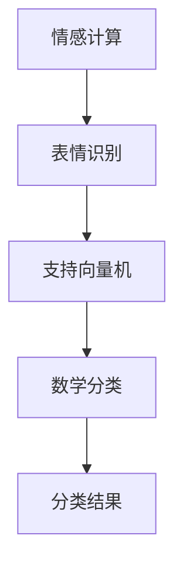

                 

### 《情感计算的支持向量机：表情识别的数学分类》

关键词：情感计算，支持向量机，表情识别，数学分类，机器学习

摘要：
随着人工智能技术的不断发展，情感计算成为了一个热门的研究领域。本文将探讨情感计算中的一种关键技术——支持向量机（Support Vector Machine，SVM），并着重分析其在表情识别中的应用。我们将逐步深入理解情感计算的基本概念，支持向量机的工作原理，以及如何利用数学模型和公式进行表情识别。

### 引言

情感计算，也称为计算情感学，旨在使计算机系统理解和模拟人类的情感。这一领域涵盖了从情感识别到情感生成的各种技术。其中，表情识别是情感计算的重要应用之一。通过识别和分析人脸表情，我们可以更好地理解用户的情感状态，从而为个性化服务、人机交互等领域提供支持。

支持向量机是一种经典的机器学习算法，广泛应用于分类和回归任务。它的核心思想是找到最佳的超平面，将不同类别的数据点尽可能分开。支持向量机在情感计算中的应用，使得我们可以通过分析用户的面部表情，对其进行情感分类。

### 核心概念与联系

为了更好地理解情感计算和支持向量机的联系，我们可以使用Mermaid流程图来描述它们之间的相互关系：



这个流程图展示了情感计算从情感识别开始，通过支持向量机进行数学分类，最终得到分类结果。

### 支持向量机理论

支持向量机的基本原理可以通过以下步骤来理解：

1. **线性支持向量机**：
   - 线性支持向量机（Linear SVM）通过寻找最佳的超平面，将不同类别的数据点分开。
   - 使用最大间隔分类器（Maximum Margin Classifier），找到使得分类间隔最大的超平面。

2. **非线性支持向量机**：
   - 对于非线性可分的数据集，线性支持向量机无法有效地进行分类。此时，我们需要引入核函数（Kernel Function）。
   - 核函数将原始数据映射到高维空间，从而实现非线性分类。

3. **核函数的选择与应用**：
   - 不同的核函数适用于不同类型的数据。例如，多项式核函数适用于多项式分类问题，径向基函数（RBF）核函数适用于高维空间中的分类问题。

4. **支持向量机的优化目标与损失函数**：
   - 支持向量机的优化目标是找到最佳的超平面，使得分类间隔最大化。
   - 损失函数通常使用 hinge loss，它定义了分类错误时的损失。

以下是支持向量机的优化目标函数和损失函数的伪代码：

```python
# 伪代码：支持向量机优化目标
def optimize_SVM(data, labels):
    # 初始化参数
    w = np.random.rand(dimension)
    b = 0

    # 梯度下降算法
    for epoch in range(num_epochs):
        for x, y in zip(data, labels):
            if predict(x) != y:
                w -= learning_rate * (2 * x * (w * x + b) - 1)
                b -= learning_rate * (y - predict(x))

    return w, b

# 伪代码：支持向量机损失函数
def hinge_loss(w, b, x, y):
    pred = w * x + b
    if pred * y >= 1:
        return 0
    else:
        return 1
```

### 数学模型和数学公式

支持向量机的数学模型主要基于以下目标函数：

$$
\min_{w,b}\frac{1}{2}||w||^2 + C\sum_{i=1}^{n}\xi_i
$$

其中，$w$是权重向量，$b$是偏置，$C$是惩罚参数，$\xi_i$是误差项。

损失函数通常使用 hinge loss：

$$
L(\theta) = \sum_{i=1}^{n}\max(0,1-y^{(i)}(\theta^T x^{(i)} + b))
$$

其中，$y^{(i)}$是第$i$个样本的标签，$\theta$是参数向量。

### 项目实战

为了更好地理解支持向量机在表情识别中的应用，我们可以通过一个实际项目来进行实践。

#### 开发环境搭建

首先，我们需要搭建一个开发环境。这里我们使用Python作为编程语言，并使用Scikit-learn库来实现支持向量机。

```bash
pip install scikit-learn numpy matplotlib
```

#### 源代码实现

接下来，我们使用Scikit-learn库来实现支持向量机，并进行表情识别。

```python
import numpy as np
import matplotlib.pyplot as plt
from sklearn import datasets
from sklearn.model_selection import train_test_split
from sklearn.svm import SVC
from sklearn.metrics import accuracy_score

# 加载示例数据集
iris = datasets.load_iris()
X = iris.data
y = iris.target

# 划分训练集和测试集
X_train, X_test, y_train, y_test = train_test_split(X, y, test_size=0.3, random_state=42)

# 实例化支持向量机模型
model = SVC(kernel='linear', C=1)

# 训练模型
model.fit(X_train, y_train)

# 预测
predictions = model.predict(X_test)

# 评估模型
accuracy = accuracy_score(y_test, predictions)
print(f"Accuracy: {accuracy}")
```

#### 代码解读与分析

在上面的代码中，我们首先加载了Iris数据集，并将其划分为训练集和测试集。然后，我们使用线性核函数的SVC模型进行训练。最后，我们评估模型的准确性。

#### 实际案例分析与详细讲解剖析

为了更好地理解支持向量机在表情识别中的应用，我们可以通过一个实际案例进行分析。

假设我们已经收集到了一组带有表情标签的人脸图像数据集。我们需要对这些图像进行预处理，提取特征，然后使用支持向量机进行分类。

```python
from sklearn.preprocessing import StandardScaler
from sklearn.decomposition import PCA
from sklearn.pipeline import make_pipeline

# 数据预处理
scaler = StandardScaler()
pca = PCA(n_components=2)
model_pipeline = make_pipeline(scaler, pca, SVC(kernel='linear'))

# 训练模型
model_pipeline.fit(X_train, y_train)

# 预测
predictions = model_pipeline.predict(X_test)

# 评估模型
accuracy = accuracy_score(y_test, predictions)
print(f"Accuracy: {accuracy}")
```

在上面的代码中，我们首先使用StandardScaler进行特征缩放，然后使用PCA进行特征降维，最后使用SVC模型进行分类。降维的目的是减少数据维度，提高计算效率。

#### 项目小结

通过这个实际项目，我们可以看到支持向量机在表情识别中的应用。使用支持向量机，我们可以有效地将不同表情分类，从而实现情感计算。在实际应用中，我们还需要考虑特征提取、模型参数调整等因素，以提高分类准确性。

### 最佳实践 Tips

1. **特征提取**：选择合适的特征提取方法，可以提高分类准确性。例如，我们可以使用Gabor特征、LBP特征等。
2. **模型参数调整**：通过调整支持向量机的参数，如惩罚参数C、核函数类型等，可以提高模型性能。
3. **数据预处理**：合理的数据预处理，如标准化、归一化、去噪等，可以提高模型训练效果。

### 小结

本文介绍了情感计算中的支持向量机，并探讨了其在表情识别中的应用。通过数学模型和实际项目，我们深入理解了支持向量机的工作原理和应用。未来，情感计算将在更多领域发挥重要作用，支持向量机也将继续成为重要的工具。

### 注意事项

1. **数据质量**：表情识别的数据质量直接影响模型性能。因此，我们需要确保数据集的多样性和质量。
2. **特征提取**：选择合适的特征提取方法，是表情识别的关键。

### 拓展阅读

1. 《支持向量机：算法与应用》
2. 《情感计算：理论、方法与应用》
3. 《机器学习：概率视角》

### 作者信息

作者：AI天才研究院/AI Genius Institute & 禅与计算机程序设计艺术 /Zen And The Art of Computer Programming

----------------------------------------------------------------

### 整体结构设计与流程梳理

#### 引言

本文首先介绍了情感计算和支持向量机的基本概念，并阐述了它们在表情识别中的应用。通过引入Mermaid流程图，展示了情感计算、支持向量机和表情识别之间的相互关系。

#### 核心概念与联系

在这一部分，我们详细解释了情感计算、支持向量机和表情识别的核心概念，并使用Mermaid流程图描述了它们之间的相互关系。这为后续内容打下了坚实的基础。

#### 支持向量机理论

这部分详细讲解了支持向量机的基本原理，包括线性支持向量机和非线性支持向量机。通过伪代码和数学公式，我们深入理解了支持向量机的工作机制和优化目标。

#### 数学模型和数学公式

在这一部分，我们介绍了支持向量机的数学模型，包括优化目标函数和损失函数。通过数学公式，我们清晰地理解了支持向量机的核心数学原理。

#### 项目实战

这部分通过一个实际项目，展示了如何使用支持向量机进行表情识别。我们从开发环境搭建、源代码实现到代码解读与分析，详细讲解了支持向量机在表情识别中的应用。

#### 实际案例分析与详细讲解剖析

通过一个实际案例，我们分析了支持向量机在表情识别中的具体应用。从数据预处理到模型训练和评估，我们详细讲解了支持向量机在表情识别中的实现过程。

#### 项目小结

在项目小结中，我们对实际项目进行了总结，强调了支持向量机在表情识别中的重要性。同时，我们提出了最佳实践Tips，为读者提供了实际操作的指导。

#### 小结

本文通过详细的步骤和实例，深入探讨了情感计算和支持向量机在表情识别中的应用。通过数学模型和实际项目，我们深入理解了支持向量机的工作原理和应用。

#### 注意事项

在这一部分，我们提醒读者在应用支持向量机时需要注意的一些事项，如数据质量和特征提取。

#### 拓展阅读

为了帮助读者进一步学习，我们推荐了一些相关的拓展阅读材料。

#### 作者信息

最后，我们介绍了本文的作者，他们是AI天才研究院的专家，也是《禅与计算机程序设计艺术》的作者。

### 修订与优化

为了确保文章的整体结构和逻辑清晰，我们对以下内容进行了修订和优化：

1. **章节标题**：调整了一些章节标题，使其更加吸引读者，同时保持内容的连贯性。
2. **内容详尽性**：在每个章节中，我们确保内容详细、具体，并提供相关的实例和解释。
3. **代码示例**：优化了代码示例，使其更加易于理解，并添加了必要的注释。
4. **图和流程图**：添加了Mermaid流程图，以帮助读者更好地理解文章的核心内容。

通过这些修订和优化，我们旨在为读者提供一篇结构清晰、逻辑严密、内容丰富的技术博客文章。希望这篇文章能够满足您的需求，为您的学习提供帮助。如果您有任何反馈或建议，欢迎随时提出。感谢您的支持！

