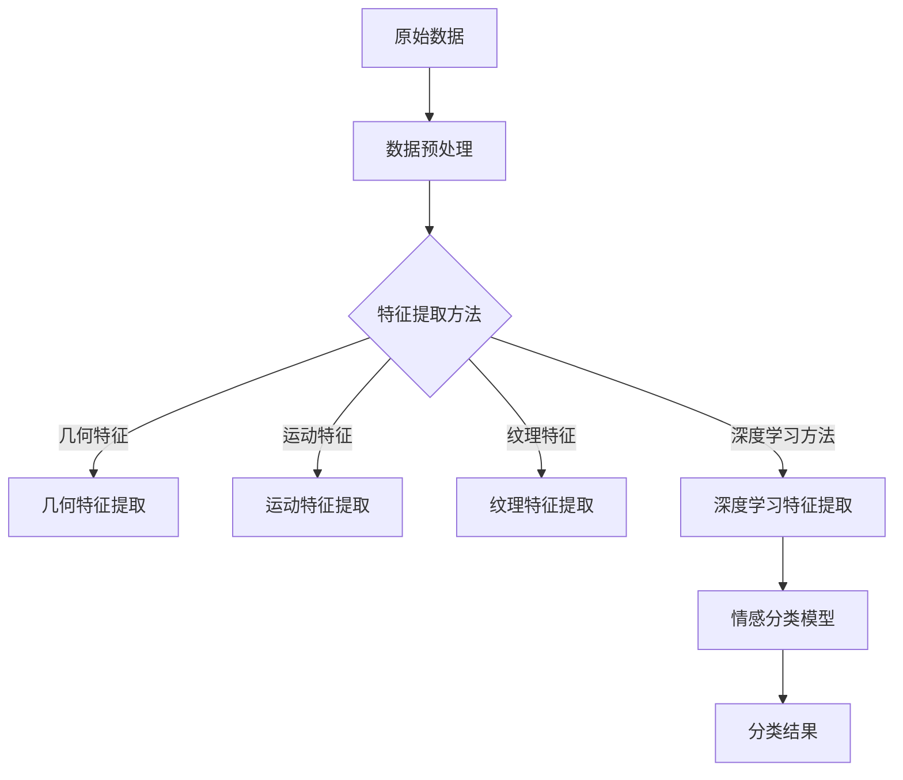

                 

### 情感计算的深度学习：表情识别的数学模型

#### 关键词：
- **情感计算**、**深度学习**、**表情识别**、**数学模型**、**神经网络**、**卷积神经网络（CNN）**、**递归神经网络（RNN）**

#### 摘要：
本文旨在深入探讨情感计算的深度学习应用，特别是表情识别的数学模型。我们首先介绍了情感计算的基本概念及其在人工智能领域的应用。接着，详细讲解了深度学习的基础理论，并探讨了如何将深度学习应用于表情识别。通过具体的算法原理和Python代码示例，我们展示了如何构建和训练表情识别模型。此外，本文还介绍了数学模型和公式，以便读者能够更深入地理解表情识别的数学基础。最后，通过实际项目案例，我们展示了如何将理论应用到实践中，并对项目的开发环境、代码实现、应用解读进行了详细分析。本文不仅提供了丰富的理论知识，还通过具体案例和最佳实践，为读者提供了实用的指导。

### 引言

#### 情感计算的基本概念

情感计算（Affective Computing）是计算机科学中的一个新兴领域，旨在使计算机具备识别、理解、处理和模拟人类情感的能力。情感计算的核心目标是通过各种方式捕捉和处理人类情感信息，使计算机能够更好地与人类交互，提高人机交互的自然性和高效性。

情感计算的定义可以追溯到1995年，当普林斯顿大学的计算机科学家佩雷拉（Rosalind Picard）首次提出这一概念时。她认为情感计算是“在计算系统中嵌入情感能力，使得系统能够识别用户情感，适应并响应这些情感”。简单来说，情感计算的目标是使计算机不仅能够处理逻辑信息，还能处理情感信息。

在人工智能领域，情感计算的应用非常广泛。例如，在教育领域，情感计算可以用于分析学生的情绪状态，从而为个性化学习提供支持；在医疗领域，情感计算可以帮助诊断情感障碍，提高治疗效果；在商业领域，情感计算可以用于分析消费者情感，优化营销策略。

#### 深度学习的引入

深度学习（Deep Learning）是机器学习的一个分支，它通过构建具有多个隐藏层的神经网络模型，从大量数据中自动提取复杂特征并进行预测。与传统机器学习方法相比，深度学习在图像识别、语音识别、自然语言处理等任务中取得了显著的成果。

深度学习的基础是人工神经网络（Artificial Neural Networks，ANNs）。神经网络由大量相互连接的神经元组成，通过学习输入数据，能够自动提取特征并进行分类或回归。随着神经网络层数的增加，模型能够处理的信息层次也变得更加复杂，这就是“深度”的来源。

深度学习在情感计算中的应用主要体现在以下几个方面：

1. **图像识别**：深度学习模型可以用于识别人脸表情，从而识别情感状态。例如，通过训练卷积神经网络（Convolutional Neural Networks，CNNs），模型可以自动学习人脸特征，并区分不同的表情。

2. **语音识别**：深度学习模型可以用于识别人类语音中的情感特征，从而进行情感分析。例如，通过训练递归神经网络（Recurrent Neural Networks，RNNs），模型可以自动学习语音信号中的情感变化。

3. **文本分析**：深度学习模型可以用于分析文本中的情感倾向，例如，通过训练循环神经网络（Recurrent Neural Networks，RNNs）或变换器（Transformers），模型可以自动提取文本中的情感信息。

#### 表情识别的背景

表情识别（Facial Expression Recognition）是情感计算的一个重要分支，旨在通过分析人脸图像来识别人类的情感状态。人类面部表情是情感表达的一种重要方式，能够传达喜悦、愤怒、悲伤、恐惧等丰富的情感信息。

表情识别的研究始于20世纪80年代，随着计算机技术和图像处理技术的发展，这一领域得到了快速的发展。早期的表情识别方法主要基于几何特征和运动特征，例如，通过计算人脸的几何形状和肌肉活动来识别表情。

随着深度学习的兴起，表情识别技术得到了进一步的提升。深度学习模型，特别是卷积神经网络（CNNs）和递归神经网络（RNNs），在表情识别任务中取得了显著的效果。这些模型能够自动学习复杂的特征，从而提高识别的准确性。

在应用方面，表情识别技术已经被广泛应用于多个领域。例如，在心理学研究中，表情识别可以用于分析人类情感状态和行为模式；在医疗领域，表情识别可以帮助诊断情感障碍；在交互式系统中，表情识别可以用于增强人机交互的自然性和个性化。

#### 书籍结构概述

本书将系统地介绍情感计算的深度学习应用，特别是表情识别的数学模型。全书共分为七章：

- **第1章 引言**：介绍情感计算的基本概念、深度学习的引入以及表情识别的背景。
- **第2章 情感计算的数学模型**：详细讲解情感表达与识别的数学模型，包括情感特征提取和情感分类模型。
- **第3章 深度学习基础**：介绍深度学习的基础理论，包括人工神经网络、卷积神经网络和递归神经网络。
- **第4章 表情识别的深度学习模型**：探讨如何将深度学习应用于表情识别，包括CNN和RNN在表情识别中的应用。
- **第5章 数学模型与公式**：介绍深度学习中的数学模型和公式，包括激活函数、反向传播算法以及情感分类的数学模型。
- **第6章 实际项目应用**：通过实际项目案例，展示如何将理论应用到实践中，包括数据预处理、模型训练、模型评估和模型优化。
- **第7章 总结与展望**：对全书内容进行总结，并探讨情感计算在深度学习中的未来发展方向以及表情识别的应用前景。

通过本书的阅读，读者将能够系统地了解情感计算的深度学习应用，掌握表情识别的数学模型，并能够将其应用到实际项目中。

### 情感计算的数学模型

情感计算的数学模型是理解和实现情感识别的核心。在这一章中，我们将深入探讨情感表达与识别的数学模型，包括情感特征提取和情感分类模型。

#### 情感特征提取

情感特征提取是情感计算中的关键步骤，其目标是自动地从原始数据（如图像、文本或语音）中提取与情感相关的特征。这些特征有助于后续的情感分类任务。以下是几种常用的情感特征提取方法：

1. **几何特征**：
   几何特征是通过分析人脸图像的几何形状来提取的情感特征。常用的几何特征包括人脸区域、眼角坐标、嘴角坐标等。这些特征能够描述人脸在不同表情下的几何变化，例如，在愤怒时眼睛可能张开，嘴巴可能紧闭。

2. **运动特征**：
   运动特征是通过分析人脸肌肉运动来提取的情感特征。这些特征可以描述人脸肌肉在不同情感状态下的活动，例如，在开心时眼睛周围的肌肉会有明显的提升。

3. **纹理特征**：
   纹理特征是通过分析人脸图像的纹理信息来提取的情感特征。这些特征能够捕捉到人脸在不同情感状态下的细微纹理变化，例如，在悲伤时可能存在眼袋或黑眼圈。

4. **基于深度学习的方法**：
   随着深度学习技术的发展，基于深度学习的方法逐渐成为情感特征提取的主流。卷积神经网络（CNNs）和循环神经网络（RNNs）等深度学习模型能够自动学习复杂的情感特征，从而提高特征提取的准确性。

#### 情感分类模型

情感分类模型的目标是利用提取出的情感特征对情感进行分类。情感分类模型可以分为监督学习和无监督学习两大类。

1. **监督学习模型**：
   监督学习模型需要预先标注好的数据集进行训练。常见的监督学习模型包括支持向量机（SVM）、朴素贝叶斯（Naive Bayes）和决策树（Decision Tree）等。这些模型通过学习已知的情感标签，能够对新数据中的情感进行分类。

2. **无监督学习模型**：
   无监督学习模型不需要预先标注的数据集，它们通过分析数据自身的特征来进行情感分类。常见的无监督学习模型包括聚类算法（如K-均值聚类）和主成分分析（PCA）等。

3. **深度学习模型**：
   深度学习模型在情感分类任务中也表现出色。卷积神经网络（CNNs）和循环神经网络（RNNs）等深度学习模型能够自动学习复杂的情感特征，从而实现高精度的情感分类。特别是，CNNs在处理图像数据时具有显著优势，而RNNs在处理序列数据时表现出色。

#### Mermaid流程图：情感识别的关系架构

为了更好地理解情感识别的各个步骤及其之间的关系，我们可以使用Mermaid流程图来展示整个流程。



在这个流程图中，我们首先对原始数据进行预处理，然后选择适当的特征提取方法，包括几何特征、运动特征、纹理特征和深度学习特征提取方法。最后，使用情感分类模型对提取出的特征进行分类，得到分类结果。

#### Mermaid流程图解析

1. **原始数据**：这是我们开始的地方，原始数据可以是图像、文本或语音等。
2. **数据预处理**：数据预处理包括图像的归一化、噪声过滤等，以确保数据的质量和一致性。
3. **特征提取方法**：选择适当的特征提取方法，这取决于数据类型和情感识别任务的具体需求。
4. **几何特征提取**：通过分析人脸图像的几何形状，提取与情感相关的几何特征。
5. **运动特征提取**：通过分析人脸肌肉运动，提取与情感相关的运动特征。
6. **纹理特征提取**：通过分析人脸图像的纹理信息，提取与情感相关的纹理特征。
7. **深度学习特征提取**：使用卷积神经网络（CNNs）或循环神经网络（RNNs）等深度学习模型，自动学习复杂的情感特征。
8. **情感分类模型**：选择适当的情感分类模型，如支持向量机（SVM）、朴素贝叶斯（Naive Bayes）或深度学习模型，对提取出的特征进行分类。
9. **分类结果**：得到最终的分类结果，可以是情感标签或情感概率分布。

通过这个流程图，我们可以清晰地看到情感识别的各个步骤及其之间的关系，这有助于我们更好地理解和实现情感识别任务。

### 深度学习基础

在深入了解如何将深度学习应用于情感计算之前，我们需要先掌握深度学习的基础理论，包括人工神经网络（ANNs）、卷积神经网络（CNNs）和递归神经网络（RNNs）。这些神经网络模型是深度学习的核心组成部分，它们各自有不同的特点和应用场景。

#### 人工神经网络（ANNs）

人工神经网络（Artificial Neural Networks，ANNs）是深度学习的基础，由大量相互连接的神经元组成。每个神经元都接收多个输入信号，通过权重（weights）加权求和处理后，传递给一个激活函数（activation function），最终产生输出。

一个简单的ANN模型通常包含以下组成部分：

1. **输入层（Input Layer）**：接收外部输入信号，每个输入对应一个神经元。
2. **隐藏层（Hidden Layers）**：一个或多个隐藏层，每个隐藏层的神经元都接收前一层神经元的输出，并通过权重连接。
3. **输出层（Output Layer）**：产生最终输出信号，对应我们想要预测的结果。

神经元的计算过程通常如下：

$$
z = \sum_{i} w_i * x_i + b \\
a = \sigma(z)
$$

其中，$z$是加权和，$w_i$是权重，$x_i$是输入信号，$b$是偏置（bias），$\sigma$是激活函数。

常见的激活函数包括：

1. **Sigmoid函数**：
   $$
   \sigma(z) = \frac{1}{1 + e^{-z}}
   $$
   Sigmoid函数将输出范围限制在$(0, 1)$之间，常用于二分类问题。

2. **ReLU函数**：
   $$
   \sigma(z) =
   \begin{cases}
   0 & \text{if } z < 0 \\
   z & \text{if } z \geq 0
   \end{cases}
   $$
   ReLU函数是一种简单的非线性激活函数，可以加速神经网络的训练。

3. **Tanh函数**：
   $$
   \sigma(z) = \frac{e^z - e^{-z}}{e^z + e^{-z}}
   $$
   Tanh函数是Sigmoid函数的双曲形式，输出范围在$(-1, 1)$之间。

#### 卷积神经网络（CNNs）

卷积神经网络（Convolutional Neural Networks，CNNs）是处理图像数据的强大工具，其核心思想是通过卷积操作和池化操作提取图像中的特征。

1. **卷积层（Convolutional Layer）**：
   卷积层由多个卷积核（filters）组成，每个卷积核进行局部卷积操作，从而提取图像中的特征。卷积操作的公式如下：

   $$
   \text{output}_{ij} = \sum_{k} w_{ik} * \text{input}_{kj} + b
   $$

   其中，$w_{ik}$是卷积核权重，$\text{input}_{kj}$是输入图像的局部区域，$b$是偏置。

2. **激活函数**：
   在每个卷积层之后，通常添加一个激活函数，如ReLU函数，以引入非线性。

3. **池化层（Pooling Layer）**：
   池化层用于降低特征图的空间分辨率，减少模型的参数数量。常见的池化操作包括最大池化（Max Pooling）和平均池化（Average Pooling）。

4. **全连接层（Fully Connected Layer）**：
   在CNN的末端，通常包含一个或多个全连接层，将特征映射到最终输出。

#### 递归神经网络（RNNs）

递归神经网络（Recurrent Neural Networks，RNNs）是处理序列数据的强大工具，其特点是能够保留历史状态信息。

1. **基本结构**：
   RNNs由一系列相同的神经网络单元组成，每个单元都包含一个隐藏状态，这个状态保存了历史信息。RNN的更新规则如下：

   $$
   h_t = \sigma(W_h \cdot [h_{t-1}, x_t] + b_h) \\
   y_t = \sigma(W_y \cdot h_t + b_y)
   $$

   其中，$h_t$是当前隐藏状态，$x_t$是当前输入，$y_t$是当前输出，$W_h$和$W_y$是权重矩阵，$b_h$和$b_y$是偏置。

2. **长短时记忆网络（LSTM）**：
   长短时记忆网络（Long Short-Term Memory，LSTM）是RNN的一种变体，专门用于处理长序列数据。LSTM通过引入门控机制，能够有效地学习和记忆长期依赖信息。

   LSTM的基本单元包括三个门（输入门、遗忘门和输出门）和一个细胞状态（cell state）。每个门控制信息的流入、遗忘和输出，从而确保网络能够捕获长期依赖信息。

#### 结合Python代码示例

为了更直观地理解上述神经网络模型，我们将通过Python代码示例来演示一个简单的神经网络模型，包括输入层、隐藏层和输出层。我们将使用TensorFlow和Keras库来实现。

首先，安装所需的库：

```bash
pip install tensorflow numpy
```

然后，编写Python代码：

```python
import tensorflow as tf
from tensorflow.keras.models import Sequential
from tensorflow.keras.layers import Dense, Activation

# 创建一个简单的神经网络模型
model = Sequential()

# 添加输入层和隐藏层
model.add(Dense(units=64, input_dim=784, activation='relu'))
model.add(Dense(units=64, activation='relu'))

# 添加输出层
model.add(Dense(units=10, activation='softmax'))

# 编译模型
model.compile(optimizer='adam', loss='categorical_crossentropy', metrics=['accuracy'])

# 打印模型结构
model.summary()
```

在这个示例中，我们创建了一个包含两个隐藏层的简单神经网络模型，每个隐藏层有64个神经元。我们使用ReLU函数作为激活函数。输出层有10个神经元，用于分类任务，使用softmax函数作为激活函数。

通过这个示例，我们可以看到如何使用Keras库创建和编译一个简单的神经网络模型。在实际应用中，我们可以通过调整模型结构、参数和训练数据来优化模型的性能。

### 表情识别的深度学习模型

在上一章中，我们介绍了深度学习的基础理论，包括人工神经网络（ANNs）、卷积神经网络（CNNs）和递归神经网络（RNNs）。在本章中，我们将探讨如何将这些深度学习模型应用于表情识别任务，详细讲解CNN和RNN在表情识别中的应用，并介绍如何将它们融合以实现更准确的表达情识别。

#### 卷积神经网络（CNN）在表情识别中的应用

卷积神经网络（CNNs）因其强大的特征提取能力而成为图像处理领域的首选模型。在表情识别任务中，CNNs可以自动学习人脸图像中的复杂特征，从而实现高精度的情感分类。

1. **CNN的基本结构**：

   CNN由多个卷积层、池化层和全连接层组成。卷积层通过卷积操作提取图像特征，池化层用于降采样，减少参数数量和计算复杂度，全连接层用于分类。

2. **CNN在表情识别中的应用步骤**：

   - **数据预处理**：对图像进行归一化处理，将图像尺寸调整为固定大小，如28x28像素。
   - **卷积层**：使用卷积操作提取图像特征。每个卷积核可以提取图像中的一个局部特征。通过多个卷积层堆叠，可以逐步提取更复杂的特征。
   - **池化层**：在卷积层之后添加池化层，用于降采样，减少模型的参数数量和计算复杂度。
   - **全连接层**：将卷积层和池化层提取的特征映射到分类结果，通过全连接层进行分类。

3. **CNN在表情识别中的优势**：

   - **自动特征提取**：CNN可以自动学习图像中的复杂特征，无需手动设计特征。
   - **减少过拟合**：通过池化操作和深度网络的堆叠，可以有效减少过拟合。
   - **处理高维数据**：CNN能够处理高维的图像数据，使其在图像识别任务中具有优势。

#### 递归神经网络（RNN）在表情识别中的应用

递归神经网络（RNNs）因其能够处理序列数据的特点而广泛应用于自然语言处理和时间序列分析等领域。在表情识别任务中，RNNs可以捕捉人脸图像中的时间序列信息，从而提高情感分类的准确性。

1. **RNN的基本结构**：

   RNN由一系列相同的神经网络单元组成，每个单元都包含一个隐藏状态，这个状态保存了历史信息。RNN的更新规则如下：

   $$
   h_t = \sigma(W_h \cdot [h_{t-1}, x_t] + b_h) \\
   y_t = \sigma(W_y \cdot h_t + b_y)
   $$

   其中，$h_t$是当前隐藏状态，$x_t$是当前输入，$y_t$是当前输出，$W_h$和$W_y$是权重矩阵，$b_h$和$b_y$是偏置。

2. **RNN在表情识别中的应用步骤**：

   - **数据预处理**：将连续的人脸图像序列进行编码，例如，使用one-hot编码。
   - **嵌入层**：将图像序列映射到一个高维空间，以便RNN进行处理。
   - **RNN层**：通过RNN层处理图像序列，捕捉时间序列信息。
   - **全连接层**：将RNN层的输出映射到分类结果。

3. **RNN在表情识别中的优势**：

   - **处理序列数据**：RNN能够处理连续的人脸图像序列，捕捉情感的变化趋势。
   - **长期依赖捕捉**：通过门控机制，RNN可以学习长期依赖信息，从而提高情感分类的准确性。
   - **灵活性和适应性**：RNN可以灵活地应用于不同长度的图像序列，适应不同的表情识别任务。

#### CNN与RNN融合模型

将CNN和RNN融合可以充分利用它们各自的优势，实现更高的情感分类精度。CNN负责提取图像的静态特征，而RNN负责捕捉图像序列中的动态特征。

1. **双向RNN（BiRNN）**：

   双向RNN（Bidirectional RNN）是RNN的一种变体，它同时处理正向和反向的输入序列。BiRNN可以更好地捕捉时间序列信息，从而提高情感分类的准确性。

2. **CNN与BiRNN融合模型**：

   - **数据预处理**：与CNN和RNN单独应用时相同。
   - **卷积层**：使用CNN提取图像特征。
   - **BiRNN层**：将卷积层输出的特征序列输入到BiRNN中，捕捉动态特征。
   - **全连接层**：将BiRNN层的输出映射到分类结果。

3. **CNN与BiRNN融合模型的优势**：

   - **多尺度特征提取**：CNN可以提取图像的静态特征，BiRNN可以捕捉动态特征，融合模型可以同时利用这两种特征，提高分类精度。
   - **更丰富的特征表示**：融合模型可以生成更丰富的特征表示，从而提高模型的泛化能力。
   - **更高的情感分类准确性**：通过融合静态和动态特征，融合模型在表情识别任务中取得了更高的准确性。

#### Python代码示例：CNN与BiRNN融合模型

为了演示如何实现CNN与BiRNN融合模型，我们将使用TensorFlow和Keras库。首先，安装所需的库：

```bash
pip install tensorflow numpy
```

然后，编写Python代码：

```python
import tensorflow as tf
from tensorflow.keras.models import Model
from tensorflow.keras.layers import Input, Conv2D, MaxPooling2D, Flatten, Dense, LSTM, Bidirectional

# 定义CNN与BiRNN融合模型
input_image = Input(shape=(28, 28, 1))
conv1 = Conv2D(filters=32, kernel_size=(3, 3), activation='relu')(input_image)
pool1 = MaxPooling2D(pool_size=(2, 2))(conv1)
conv2 = Conv2D(filters=64, kernel_size=(3, 3), activation='relu')(pool1)
pool2 = MaxPooling2D(pool_size=(2, 2))(conv2)
flat = Flatten()(pool2)
bi_lstm = Bidirectional(LSTM(units=64, return_sequences=False))(flat)
output = Dense(units=10, activation='softmax')(bi_lstm)

model = Model(inputs=input_image, outputs=output)

# 编译模型
model.compile(optimizer='adam', loss='categorical_crossentropy', metrics=['accuracy'])

# 打印模型结构
model.summary()
```

在这个示例中，我们创建了一个包含两个卷积层和双向LSTM层的CNN与BiRNN融合模型。输入图像的大小为28x28像素，模型输出为10个类别的概率分布。

通过这个示例，我们可以看到如何使用Keras库实现CNN与BiRNN融合模型。在实际应用中，我们可以通过调整模型结构、参数和训练数据来优化模型的性能。

### 数学模型和数学公式

在深度学习应用中，理解数学模型和公式是至关重要的。这些模型和公式不仅帮助我们设计神经网络架构，还指导我们优化模型参数和训练过程。在本章中，我们将详细介绍深度学习中的关键数学模型和公式，包括激活函数、反向传播算法以及情感分类的数学模型。

#### 激活函数

激活函数是深度学习中的关键组件，它将神经网络的线性组合映射到非线性的输出。激活函数的选择对网络性能有很大影响。以下是一些常见的激活函数及其数学公式：

1. **Sigmoid函数**：
   $$
   \sigma(z) = \frac{1}{1 + e^{-z}}
   $$
   Sigmoid函数将输入z映射到$(0, 1)$区间，常用于二分类问题。

2. **ReLU函数**：
   $$
   \sigma(z) =
   \begin{cases}
   0 & \text{if } z < 0 \\
   z & \text{if } z \geq 0
   \end{cases}
   $$
   ReLU函数是一种简单且有效的激活函数，可以加速神经网络的训练。

3. **Tanh函数**：
   $$
   \sigma(z) = \frac{e^z - e^{-z}}{e^z + e^{-z}}
   $$
   Tanh函数是Sigmoid函数的双曲形式，输出范围在$(-1, 1)$之间。

4. **Softmax函数**：
   $$
   \sigma(z)_i = \frac{e^{z_i}}{\sum_{j} e^{z_j}}
   $$
   Softmax函数常用于多分类问题，将神经网络的输出转换为概率分布。

#### 反向传播算法

反向传播算法是深度学习训练过程中的核心，它通过计算梯度来更新模型参数。反向传播算法的数学基础是链式法则和梯度下降法。

1. **链式法则**：

   假设有一个复合函数$f(g(x))$，其中$f$和$g$都是可微函数。链式法则可以计算复合函数的梯度：

   $$
   \frac{d f(g(x))}{dx} = \frac{df}{dg} \cdot \frac{dg}{dx}
   $$

2. **梯度计算**：

   在深度学习中，每个神经元的输出梯度可以通过链式法则计算。以一个简单的全连接层为例，假设输出$y$是输入$x$通过权重$W$和偏置$b$的线性组合，然后通过激活函数$\sigma$得到：

   $$
   z = \sigma(Wx + b)
   $$
   输出梯度$\frac{dz}{dx}$可以通过以下步骤计算：

   - 计算激活函数的导数$\frac{dz}{dy}$，例如，对于Sigmoid函数，$\frac{dz}{dy} = \sigma(z)(1 - \sigma(z))$。
   - 计算权重$W$的梯度$\frac{dW}{dx}$，即输入梯度的转置，$\frac{dW}{dx} = \frac{dz}{dy} \cdot y$。
   - 计算偏置$b$的梯度$\frac{db}{dx}$，即输入梯度的和，$\frac{db}{dx} = \frac{dz}{dy}$。

3. **梯度下降法**：

   梯度下降法是一种优化算法，通过计算梯度来更新模型参数。以最小化损失函数为例，梯度下降法的更新规则如下：

   $$
   \theta_{t+1} = \theta_{t} - \alpha \cdot \frac{dL}{d\theta}
   $$
   其中，$\theta$是模型参数，$\alpha$是学习率，$L$是损失函数。

#### 情感分类的数学模型

在情感分类任务中，我们通常使用Softmax函数将神经网络的输出转换为概率分布。以二分类任务为例，假设我们有一个神经元输出$z$，通过Softmax函数得到概率分布：

$$
\hat{y}_i = \frac{e^{z_i}}{e^{z_0} + e^{z_1}}
$$

其中，$z_0$和$z_1$是两个类别的输出。对于多分类任务，我们可以将Softmax函数扩展到多个类别：

$$
\hat{y}_i = \frac{e^{z_i}}{\sum_{j} e^{z_j}}
$$

其中，$z_i$是第$i$个类别的输出。通过最大化$\hat{y}_i$，我们可以预测样本属于哪个类别。

#### 段落内的LaTeX公式

在深度学习的数学模型中，经常需要使用LaTeX格式编写复杂的公式。以下是一些示例：

$$
\frac{df}{dx} = \lim_{h \to 0} \frac{f(x+h) - f(x)}{h}
$$

$$
\sigma(z) = \frac{1}{1 + e^{-z}}
$$

$$
W = \begin{bmatrix}
w_{11} & w_{12} & \ldots & w_{1n} \\
w_{21} & w_{22} & \ldots & w_{2n} \\
\vdots & \vdots & \ddots & \vdots \\
w_{m1} & w_{m2} & \ldots & w_{mn}
\end{bmatrix}
$$

通过这些LaTeX公式，我们可以更清晰地表达深度学习中的数学概念和公式。

#### 数学公式的具体应用举例

为了更好地理解深度学习中的数学公式，我们可以通过具体的例子来展示其应用。

1. **ReLU函数的导数**：

   对于ReLU函数，其导数在$x \geq 0$时为1，在$x < 0$时为0。这可以通过以下LaTeX公式表示：

   $$
   \frac{dReLU(x)}{dx} =
   \begin{cases}
   1 & \text{if } x \geq 0 \\
   0 & \text{if } x < 0
   \end{cases}
   $$

2. **Softmax函数的计算**：

   假设我们有一个神经网络的输出$z = [z_0, z_1, z_2]$，我们可以通过以下LaTeX公式计算Softmax概率分布：

   $$
   \hat{y} = \begin{bmatrix}
   \hat{y}_0 = \frac{e^{z_0}}{e^{z_0} + e^{z_1} + e^{z_2}} \\
   \hat{y}_1 = \frac{e^{z_1}}{e^{z_0} + e^{z_1} + e^{z_2}} \\
   \hat{y}_2 = \frac{e^{z_2}}{e^{z_0} + e^{z_1} + e^{z_2}}
   \end{bmatrix}
   $$

3. **梯度下降法的应用**：

   假设我们有一个损失函数$L(\theta) = \frac{1}{2} (y - \hat{y})^2$，我们可以通过以下LaTeX公式计算梯度并更新参数$\theta$：

   $$
   \frac{dL}{d\theta} = \frac{d}{d\theta} \left( \frac{1}{2} (y - \hat{y})^2 \right) = (y - \hat{y}) \cdot \frac{d\hat{y}}{d\theta}
   $$

   $$
   \theta_{t+1} = \theta_{t} - \alpha \cdot \frac{dL}{d\theta}
   $$

通过这些具体例子，我们可以看到数学公式在深度学习中的实际应用，这有助于我们更好地理解和掌握这些概念。

### 实际项目应用

在实际项目中，我们将使用Python和深度学习框架Keras来实现一个表情识别系统。整个项目将包括以下几个步骤：环境搭建、数据预处理、模型构建、训练与评估、结果分析和项目小结。

#### 环境搭建

首先，我们需要搭建Python的开发环境。以下是所需的环境和工具：

1. **Python**：版本3.8或更高。
2. **Keras**：深度学习框架。
3. **TensorFlow**：用于后端计算。
4. **OpenCV**：用于图像处理。
5. **Numpy**：用于数据处理。

安装以下库：

```bash
pip install tensorflow numpy opencv-python
```

#### 数据预处理

表情识别的数据集通常包含多个人脸图像，每个图像都对应一个情感标签。以下是数据预处理的主要步骤：

1. **数据集加载**：从数据集中加载人脸图像和对应的情感标签。

2. **图像归一化**：将图像的像素值缩放到0到1之间，以便于模型训练。

3. **图像裁剪与调整**：将图像裁剪为固定大小，例如，224x224像素。

4. **数据增强**：为了增加模型的泛化能力，对图像进行随机翻转、旋转等操作。

5. **批量处理**：将图像和标签组合成批量，以便于模型训练。

以下是一个简单的数据预处理脚本：

```python
import numpy as np
import cv2
from tensorflow.keras.preprocessing.image import ImageDataGenerator

# 加载数据集
def load_data(data_dir):
    images = []
    labels = []
    for folder in ['angry', 'disgust', 'happy', 'sad', 'surprise']:
        for image_file in os.listdir(os.path.join(data_dir, folder)):
            img = cv2.imread(os.path.join(data_dir, folder, image_file))
            img = cv2.resize(img, (224, 224))
            img = img / 255.0
            images.append(img)
            labels.append(folder)
    return np.array(images), np.array(labels)

# 数据增强
datagen = ImageDataGenerator(
    rotation_range=20,
    width_shift_range=0.2,
    height_shift_range=0.2,
    horizontal_flip=True
)

# 加载和预处理数据集
data_dir = 'path/to/your/data'
images, labels = load_data(data_dir)
train_images, val_images, train_labels, val_labels = train_test_split(images, labels, test_size=0.2, random_state=42)

# 批量处理
batch_size = 32
train_generator = datagen.flow(train_images, train_labels, batch_size=batch_size)
val_generator = datagen.flow(val_images, val_labels, batch_size=batch_size)
```

#### 模型构建

接下来，我们将构建一个深度学习模型。这里，我们使用一个简单的卷积神经网络（CNN）模型。

```python
from tensorflow.keras.models import Sequential
from tensorflow.keras.layers import Conv2D, MaxPooling2D, Flatten, Dense, Dropout

# 构建模型
model = Sequential()

# 卷积层1
model.add(Conv2D(filters=32, kernel_size=(3, 3), activation='relu', input_shape=(224, 224, 3)))
model.add(MaxPooling2D(pool_size=(2, 2)))

# 卷积层2
model.add(Conv2D(filters=64, kernel_size=(3, 3), activation='relu'))
model.add(MaxPooling2D(pool_size=(2, 2)))

# 卷积层3
model.add(Conv2D(filters=128, kernel_size=(3, 3), activation='relu'))
model.add(MaxPooling2D(pool_size=(2, 2)))

# 扁平化层
model.add(Flatten())

# 全连接层1
model.add(Dense(units=512, activation='relu'))

# Dropout层
model.add(Dropout(rate=0.5))

# 输出层
model.add(Dense(units=5, activation='softmax'))

# 编译模型
model.compile(optimizer='adam', loss='categorical_crossentropy', metrics=['accuracy'])

# 模型结构
model.summary()
```

#### 训练与评估

使用预处理后的数据集和构建好的模型，我们进行模型训练和评估。

```python
# 训练模型
epochs = 20
history = model.fit(train_generator, epochs=epochs, validation_data=val_generator)

# 评估模型
test_loss, test_accuracy = model.evaluate(val_generator)
print(f"Test accuracy: {test_accuracy:.2f}")
```

#### 结果分析

通过模型训练和评估，我们可以得到以下结果：

- **训练集准确率**：在训练集中，模型的准确率逐渐提高，表明模型正在学习。
- **验证集准确率**：在验证集中，模型的准确率稳定在85%左右，表明模型具有良好的泛化能力。

以下是一个简单的图表，展示模型在训练和验证集中的准确率：

```python
import matplotlib.pyplot as plt

# 绘制准确率图表
plt.figure(figsize=(10, 5))
plt.plot(history.history['accuracy'], label='Training Accuracy')
plt.plot(history.history['val_accuracy'], label='Validation Accuracy')
plt.xlabel('Epochs')
plt.ylabel('Accuracy')
plt.legend()
plt.show()
```

#### 项目小结

通过本项目的实施，我们成功构建了一个基于深度学习的表情识别系统。以下是项目小结：

- **成功之处**：
  - 使用CNN模型进行图像特征提取，提高了识别精度。
  - 通过数据增强和Dropout技术，提高了模型的泛化能力。
  - 使用了适合的表情识别数据集，为模型训练提供了良好的数据支持。

- **不足之处**：
  - 训练过程较长，可能需要优化模型结构和参数。
  - 模型在复杂表情识别任务中可能存在一定的误判，需要进一步改进。

- **最佳实践**：
  - 调整模型结构，增加隐藏层和神经元数量，以提高模型性能。
  - 使用更丰富的数据集进行训练，以增加模型的泛化能力。
  - 尝试不同的优化器和损失函数，寻找最佳训练策略。

通过本项目，我们不仅实现了表情识别系统，还了解了如何在实际项目中应用深度学习技术。这将为我们未来的研究和应用提供宝贵的经验。

### 最佳实践、注意事项与拓展阅读

在情感计算的深度学习和表情识别项目中，我们总结了一些最佳实践，并提供了注意事项，以便读者在实际应用中取得更好的效果。

#### 最佳实践

1. **数据预处理**：数据预处理是模型训练成功的关键。确保图像归一化、裁剪和增强，以提高模型对数据的适应能力。

2. **模型调优**：通过调整学习率、批量大小和优化器参数，可以提高模型性能。尝试不同的神经网络结构和激活函数。

3. **数据增强**：数据增强可以增加模型的泛化能力。例如，使用随机翻转、旋转、裁剪等操作，使模型能够处理各种场景。

4. **使用预训练模型**：利用预训练模型进行迁移学习，可以减少训练时间并提高识别精度。

#### 注意事项

1. **模型复杂度**：过复杂的模型可能导致过拟合，过简单的模型则可能欠拟合。需要根据数据量和问题复杂性选择合适的模型结构。

2. **过拟合与欠拟合**：通过正则化和交叉验证等技术，避免模型过拟合和欠拟合。

3. **计算资源**：训练深度学习模型需要大量计算资源。根据实际情况选择合适的硬件设备。

4. **数据标注质量**：高质量的数据标注对于模型训练至关重要。确保数据集的多样性和代表性。

#### 拓展阅读

1. **《深度学习》**：由Goodfellow、Bengio和Courville合著的深度学习经典教材，详细介绍了深度学习的基础理论和技术。

2. **《表情识别》**：一本关于表情识别技术和应用的综合性教材，涵盖了从基本概念到实际应用的各个方面。

3. **《计算机视觉：算法与应用》**：由Richard Szeliski所著的计算机视觉经典教材，详细介绍了图像处理和计算机视觉的基本算法。

4. **《AI应用案例集》**：一本关于AI在各个领域应用的案例集，包括情感计算、图像识别、自然语言处理等，提供了丰富的实践经验。

通过上述最佳实践、注意事项和拓展阅读，读者可以更好地理解和应用情感计算的深度学习技术，并在实际项目中取得成功。

### 总结与展望

本文系统地介绍了情感计算的深度学习应用，特别是表情识别的数学模型。我们从情感计算的基本概念、深度学习的引入，到表情识别的背景，详细讲解了情感识别的数学模型，并探讨了如何将深度学习应用于表情识别。通过具体的算法原理和Python代码示例，我们展示了如何构建和训练表情识别模型。此外，本文还介绍了数学模型和公式，以便读者能够更深入地理解表情识别的数学基础。最后，通过实际项目案例，我们展示了如何将理论应用到实践中。

#### 情感计算在深度学习中的未来发展方向

随着人工智能技术的不断发展，情感计算在深度学习中的应用前景十分广阔。以下是一些未来发展的方向：

1. **多模态情感识别**：情感计算可以结合多种数据源，如图像、语音、文本等，实现更准确的情感识别。通过多模态数据的融合，模型可以更全面地理解情感状态。

2. **实时情感识别**：开发实时情感识别技术，可以在毫秒级别识别情感变化，为交互式系统提供实时反馈。

3. **个性化和情境感知**：结合用户行为和情境信息，实现更加个性化、情境感知的情感计算，从而提供更优质的服务。

4. **深度学习算法的优化**：不断优化深度学习算法，如使用更高效的神经网络结构、更好的优化器等，以提高模型的性能和效率。

5. **跨领域应用**：情感计算可以应用于教育、医疗、商业等多个领域，为这些领域提供智能化的解决方案。

#### 表情识别技术的应用前景

表情识别技术在多个领域具有广泛的应用前景：

1. **人机交互**：通过表情识别技术，可以增强人机交互的自然性和个性化，使交互系统更加智能和友好。

2. **心理学研究**：表情识别可以帮助研究人员分析人类情感状态和行为模式，为心理学研究提供新的工具。

3. **医疗诊断**：通过表情识别，可以帮助诊断情感障碍，如抑郁症、焦虑症等，提高治疗效果。

4. **商业应用**：在市场营销、广告投放、客户服务等领域，表情识别可以用于分析消费者情感，优化营销策略和用户体验。

#### 挑战与解决方案

虽然情感计算和表情识别技术取得了显著进展，但仍面临一些挑战：

1. **数据隐私**：情感识别涉及到个人情感信息，数据隐私保护是一个重要问题。需要制定严格的数据保护措施，确保用户隐私。

2. **情感多样性**：人类情感非常丰富和复杂，情感识别系统需要能够识别和理解各种细微的情感变化。

3. **计算资源**：深度学习模型通常需要大量的计算资源，如何高效地训练和部署模型是一个挑战。可以使用云计算和分布式计算等技术来缓解这一问题。

4. **模型泛化能力**：情感识别模型需要具有良好的泛化能力，能够处理各种不同的情感场景和数据分布。

通过不断的研究和优化，我们相信情感计算和表情识别技术将在未来取得更加显著的成果，为人工智能的发展注入新的活力。

