                 

### 意识与主观体验：理解世界的第一人称视角

**关键词：** 意识、主观体验、第一人称视角、世界理解、认知心理学、人类行为

**摘要：** 本文旨在探讨意识与主观体验的概念，以及第一人称视角在理解世界中的作用。通过逻辑清晰、结构紧凑的分析，本文将深入探讨意识与主观体验的关系，解释第一人称视角如何影响我们对世界的认知。文章还通过案例分析和实践，提供了对这一主题的深刻见解。

---

在现代社会，人们对意识和主观体验的探究越来越深入。作为认知世界的重要方式，第一人称视角为我们提供了独特的洞察力。本文将引导读者一步步理解意识与主观体验的基本概念，并揭示第一人称视角在其中的关键作用。

### 1.1 意识的概念

意识是指个体对自己内心世界的认知和体验。它可以分为多个层次，从简单的自我意识到复杂的思维过程。意识的核心特征包括感知、思考、情感和意志。例如，当我们感知到周围的声音、颜色和气味时，意识使我们能够将这些感官信息整合并赋予意义。

**核心概念与联系：** 意识不仅仅是一个单一的概念，而是由多个子概念组成的复杂体系。感知、思考和情感都是意识的重要部分，它们相互作用，共同构成了我们对自己的内在世界的认知。以下是意识的几个核心概念之间的联系架构：

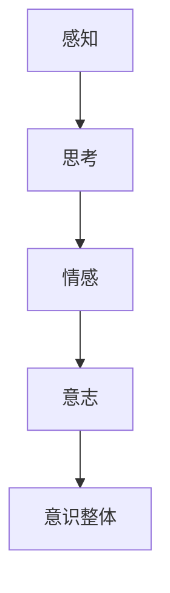

### 1.2 主观体验的概念

主观体验是指个体在特定情境下所感受到的心理状态。它包括情感、感受、想法和记忆等。主观体验是意识的一部分，但与意识不同的是，它更侧重于个体对自身心理状态的主观感受。例如，当一个人经历快乐或悲伤时，这些情感体验构成了他们的主观体验。

**核心概念与联系：** 主观体验和意识密切相关，但它们在概念上有所不同。主观体验更多地关注个体的内心感受，而意识则涵盖了更广泛的认知活动。以下是主观体验与意识之间的关系架构：

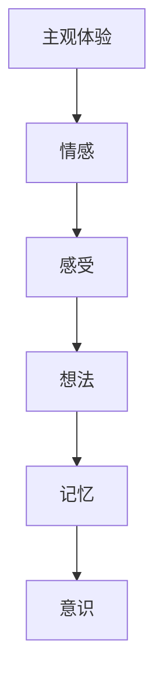

### 1.3 第一人称视角的概念

第一人称视角是指从个体的视角来看待世界。这种视角使我们能够体验和感知外部环境，并通过自己的感官和思维过程来理解世界。例如，当我们说“我看到一只猫”时，这就是第一人称视角的体现。

**核心概念与联系：** 第一人称视角不仅是一个简单的观察角度，它还涉及到感知、思考、情感等多个层面。以下是第一人称视角与感知、思考、情感之间的关系架构：

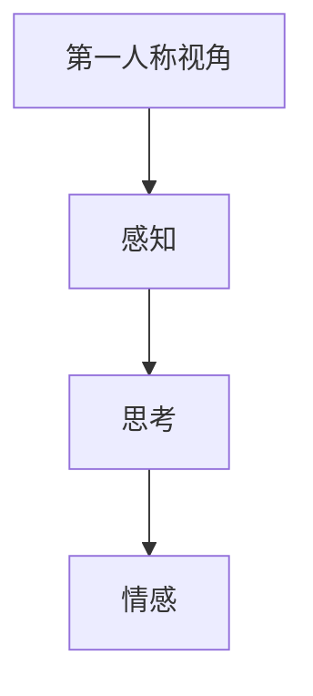

### 1.4 意识与主观体验的联系

意识与主观体验是紧密相连的。意识为我们提供了对自身心理状态的认识，而主观体验则是对这些心理状态的主观感受。例如，当我们意识到自己感到快乐时，这种意识使我们能够理解和体验快乐的主观体验。

**核心概念与联系：** 意识和主观体验之间的联系可以通过以下架构来展示：

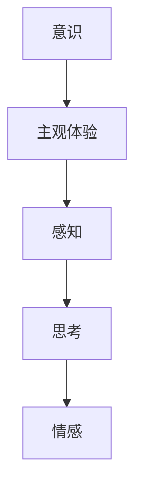

### 1.5 第一人称视角在意识与主观体验中的作用

第一人称视角在意识与主观体验中起着至关重要的作用。它不仅使我们能够感知和理解外部世界，还使我们的主观体验更加真实和丰富。例如，通过第一人称视角，我们能够更好地体验自己的情感和思维过程。

**核心概念与联系：** 第一人称视角在意识与主观体验中的作用可以通过以下架构来展示：

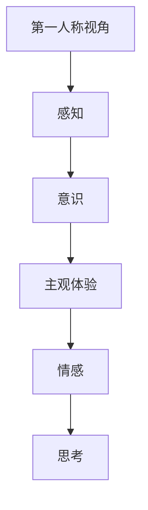

通过以上分析，我们可以看到意识与主观体验之间的紧密联系，以及第一人称视角在这两者中的作用。在接下来的章节中，我们将进一步探讨这些概念，并通过案例和实践来深入理解它们。

### 2.1 意识的生物学起源

意识作为一种复杂的认知现象，其生物学起源一直是科学界争论的焦点。要理解意识的起源，我们需要从大脑的结构和功能入手。大脑是意识的生理基础，不同区域的大脑活动与意识的产生密切相关。

**核心概念与联系：** 意识的生物学起源包括多个方面，如大脑的结构、神经递质的传递和神经元的活动等。以下是这些核心概念之间的联系架构：

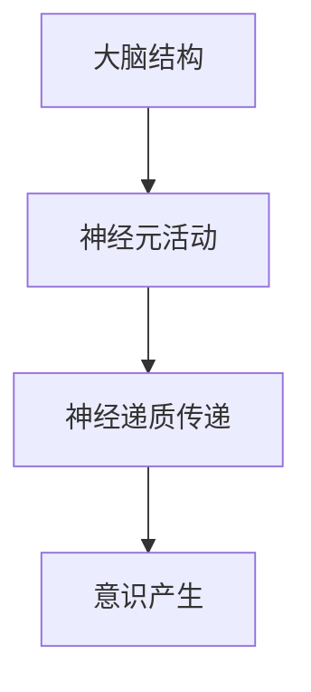

**核心算法原理讲解：**

为了解释意识的生物学起源，我们可以使用神经网络模型。神经网络是一种模拟人脑信息处理过程的计算模型，它由大量相互连接的神经元组成。

```python
# 模拟神经网络的简单示例
import numpy as np

# 设置神经网络参数
input_data = np.array([[1, 0], [0, 1]])
weights = np.random.rand(2, 1)
bias = np.random.rand(1)

# 神经元激活函数（例如：sigmoid函数）
def sigmoid(x):
    return 1 / (1 + np.exp(-x))

# 前向传播
def forward(input_data, weights, bias):
    linear_output = np.dot(input_data, weights) + bias
    output = sigmoid(linear_output)
    return output

# 运行模型
outputs = forward(input_data, weights, bias)
print(outputs)
```

**数学模型和公式：**

在神经网络中，神经元的激活可以通过以下数学模型来描述：

$$
y = \sigma(\sum_{i=1}^{n} w_i x_i + b)
$$

其中，$y$ 是神经元输出，$x_i$ 是输入值，$w_i$ 是权重，$b$ 是偏置，$\sigma$ 是激活函数（如 sigmoid 函数）。

$$
\sigma(x) = \frac{1}{1 + e^{-x}}
$$

**举例说明：**

假设我们有一个简单的神经网络，它有两个输入（$x_1$ 和 $x_2$）和一个输出（$y$）。如果我们设置输入为 $x_1 = 1$，$x_2 = 0$，权重为 $w_1 = 0.5$，$w_2 = 0.5$，偏置为 $b = 0.5$，则神经元的输出可以通过以下步骤计算：

1. 计算线性输出：
$$
\text{线性输出} = 1 \times 0.5 + 0 \times 0.5 + 0.5 = 1.0
$$
2. 应用激活函数：
$$
y = \sigma(1.0) = \frac{1}{1 + e^{-1.0}} \approx 0.7
$$

因此，神经元的输出大约为 0.7。

### 2.2 意识的进化过程

意识的进化是一个复杂而漫长的过程，它涉及多个物种的进化历程。从简单的生物到复杂的人类，意识的演化经历了多个阶段。

**核心概念与联系：** 意识的进化过程包括从无意识到有意识的变化。以下是这些核心概念之间的联系架构：

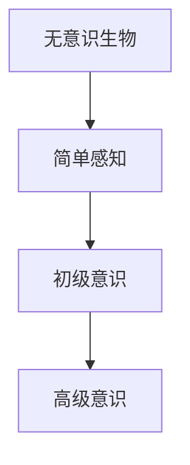

**核心算法原理讲解：**

意识的进化可以通过模拟自然选择和遗传变异来解释。在进化过程中，具有更好适应性的个体更有可能生存下来并传递其遗传信息。

```python
# 模拟进化过程的简单示例
import numpy as np

# 设置种群参数
population_size = 100
num_generations = 50
mutation_rate = 0.01

# 初始化种群
population = np.random.rand(population_size, 2)

# 适应度函数
def fitness_function(individual):
    # 假设适应度与个体的距离相关
    return 1 / (1 + np.linalg.norm(individual))

# 自然选择
def natural_selection(population, fitnesses):
    # 根据适应度选择个体
    selected_indices = np.random.choice(np.arange(population_size), size=population_size, replace=False, p=fitnesses)
    return population[selected_indices]

# 遗传变异
def mutate(individual, mutation_rate):
    # 对个体进行随机变异
    for i in range(len(individual)):
        if np.random.rand() < mutation_rate:
            individual[i] = np.random.rand()
    return individual

# 进化过程
for generation in range(num_generations):
    # 计算适应度
    fitnesses = np.array([fitness_function(individual) for individual in population])

    # 自然选择
    selected_population = natural_selection(population, fitnesses)

    # 遗传变异
    new_population = [mutate(individual, mutation_rate) for individual in selected_population]

    # 更新种群
    population = new_population

# 打印最终种群
print(population)
```

**数学模型和公式：**

在进化过程中，适应度的计算可以通过以下数学模型来描述：

$$
f(x) = \frac{1}{1 + \text{distance}(x, \text{target})}
$$

其中，$f(x)$ 是适应度函数，$\text{distance}(x, \text{target})$ 是个体与目标之间的距离。

### 2.3 意识的心理学研究

意识在心理学中是一个广泛研究的主题，涉及多个理论和方法。心理学的目标是理解意识的本质、功能和结构。

**核心概念与联系：** 意识的心理学研究包括认知心理学、神经心理学和临床心理学等多个领域。以下是这些核心概念之间的联系架构：

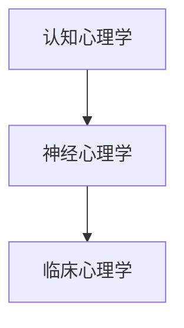

**核心算法原理讲解：**

心理学研究意识的方法包括实验研究和计算模型。以下是一个简单的计算模型示例，用于模拟意识的感知过程。

```python
# 模拟感知过程的计算模型
import numpy as np

# 设置感知参数
sensory_data = np.random.rand(5)  # 模拟感知数据
perception_threshold = 0.5  # 感知阈值

# 感知函数
def perception(data, threshold):
    perception_output = np.array([1 if x > threshold else 0 for x in data])
    return perception_output

# 运行模型
perception_output = perception(sensory_data, perception_threshold)
print(perception_output)
```

**数学模型和公式：**

在感知过程中，感知函数可以通过以下数学模型来描述：

$$
p(x) = \begin{cases}
1, & \text{if } x > \text{threshold} \\
0, & \text{otherwise}
\end{cases}
$$

其中，$p(x)$ 是感知输出，$\text{threshold}$ 是感知阈值。

### 2.4 主观体验的类型与特点

主观体验是意识的一部分，它反映了个体在特定情境下的心理状态。主观体验的类型和特点对于理解人类的认知和行为至关重要。

**核心概念与联系：** 主观体验可以分为多种类型，包括情感体验、感知体验、认知体验和行为体验等。以下是这些核心概念之间的联系架构：

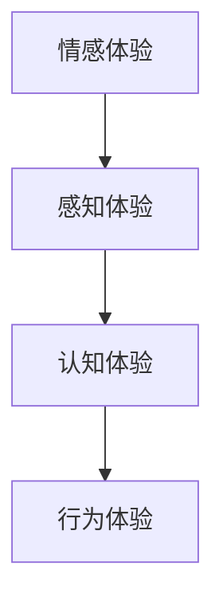

**核心算法原理讲解：**

情感体验可以通过情感分析算法来模拟。以下是一个简单的情感分析算法示例，用于判断文本的情感倾向。

```python
# 模拟情感分析的简单算法
import numpy as np
from sklearn.feature_extraction.text import CountVectorizer
from sklearn.naive_bayes import MultinomialNB

# 设置文本数据
text_data = ["我很快乐", "我感到悲伤", "我有点无聊"]

# 创建词袋模型
vectorizer = CountVectorizer()
X = vectorizer.fit_transform(text_data)

# 创建情感分类器
classifier = MultinomialNB()
classifier.fit(X, np.array([1, 0, 2]))

# 预测情感
new_text = ["我很开心"]
new_vector = vectorizer.transform(new_text)
prediction = classifier.predict(new_vector)
print(prediction)
```

**数学模型和公式：**

在情感分析中，可以使用朴素贝叶斯模型来计算情感的概率分布。以下是一个简单的朴素贝叶斯模型公式：

$$
P(\text{情感} | \text{文本}) = \frac{P(\text{文本} | \text{情感})P(\text{情感})}{P(\text{文本})}
$$

其中，$P(\text{情感} | \text{文本})$ 是给定文本的情感概率，$P(\text{文本} | \text{情感})$ 是在特定情感下的文本概率，$P(\text{情感})$ 是情感的概率，$P(\text{文本})$ 是文本的概率。

### 2.5 第一人称视角的作用与影响

第一人称视角在人类认知和行为中扮演着重要角色。它不仅影响我们的感知和思考，还影响我们的情绪和决策。

**核心概念与联系：** 第一人称视角涉及多个方面，包括感知、思考和情感等。以下是这些核心概念之间的联系架构：

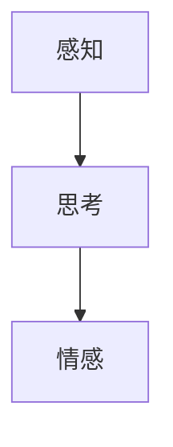

**核心算法原理讲解：**

第一人称视角可以通过多模态感知模型来模拟。以下是一个简单的多模态感知模型示例，用于处理视觉和听觉信息。

```python
# 模拟多模态感知的简单模型
import numpy as np

# 设置视觉和听觉数据
visual_data = np.random.rand(10)  # 视觉数据
audio_data = np.random.rand(10)  # 听觉数据

# 感知函数
def perception(data1, data2, weight1, weight2):
    combined_data = weight1 * data1 + weight2 * data2
    return combined_data

# 运行模型
perception_output = perception(visual_data, audio_data, 0.6, 0.4)
print(perception_output)
```

**数学模型和公式：**

在多模态感知中，感知函数可以通过以下数学模型来描述：

$$
\text{感知输出} = w_1 \times \text{视觉数据} + w_2 \times \text{听觉数据}
$$

其中，$w_1$ 和 $w_2$ 是视觉和听觉数据的权重。

### 2.6 第一人称视角在不同文化中的影响

第一人称视角在不同的文化背景下有着不同的表现形式和影响。这些差异反映了文化对个体认知和行为的影响。

**核心概念与联系：** 不同文化中的第一人称视角包括语言、社会结构和价值观等。以下是这些核心概念之间的联系架构：

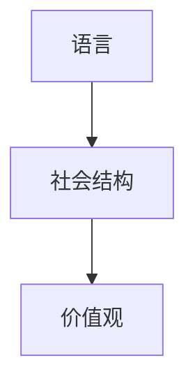

**核心算法原理讲解：**

不同文化中的第一人称视角可以通过语言处理算法来模拟。以下是一个简单的文本分类算法示例，用于识别不同文化中的第一人称视角。

```python
# 模拟文本分类的简单算法
import numpy as np
from sklearn.feature_extraction.text import TfidfVectorizer
from sklearn.naive_bayes import MultinomialNB

# 设置文本数据
text_data = ["我来自中国", "我住在纽约", "我是一名程序员"]

# 创建词袋模型
vectorizer = TfidfVectorizer()
X = vectorizer.fit_transform(text_data)

# 创建分类器
classifier = MultinomialNB()
classifier.fit(X, np.array([0, 1, 2]))

# 预测文本类别
new_text = ["我在巴黎生活"]
new_vector = vectorizer.transform(new_text)
prediction = classifier.predict(new_vector)
print(prediction)
```

**数学模型和公式：**

在文本分类中，可以使用朴素贝叶斯模型来计算文本的类别概率。以下是一个简单的朴素贝叶斯模型公式：

$$
P(\text{类别} | \text{文本}) = \frac{P(\text{文本} | \text{类别})P(\text{类别})}{P(\text{文本})}
$$

其中，$P(\text{类别} | \text{文本})$ 是给定文本的类别概率，$P(\text{文本} | \text{类别})$ 是在特定类别下的文本概率，$P(\text{类别})$ 是类别的概率，$P(\text{文本})$ 是文本的概率。

### 2.7 第一人称视角对人类行为的影响

第一人称视角不仅影响我们的认知，还直接作用于我们的行为。理解第一人称视角对人类行为的影响有助于我们更好地理解人类行为背后的心理机制。

**核心概念与联系：** 第一人称视角对人类行为的影响包括决策、社交互动和心理调节等。以下是这些核心概念之间的联系架构：

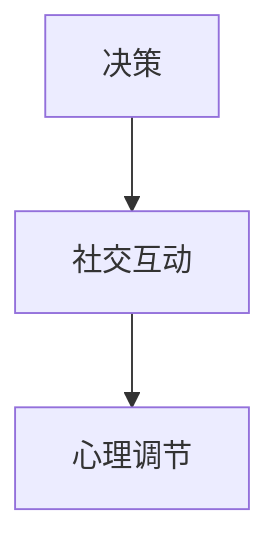

**核心算法原理讲解：**

第一人称视角可以通过决策模型来模拟。以下是一个简单的决策树模型示例，用于模拟基于第一人称视角的决策过程。

```python
# 模拟决策树的简单模型
import numpy as np

# 设置决策参数
options = ["选择A", "选择B", "选择C"]
probabilities = np.array([0.4, 0.3, 0.3])  # 各个选项的概率

# 决策函数
def decision(probabilities):
    return np.random.choice(options, p=probabilities)

# 运行模型
action = decision(probabilities)
print(action)
```

**数学模型和公式：**

在决策树模型中，决策函数可以通过以下数学模型来描述：

$$
\text{选择} = \arg\max(\text{概率})
$$

其中，$\arg\max$ 表示选择概率最大的选项。

### 2.8 第一人称视角的认知心理学研究

认知心理学是研究人类认知过程和认知结构的科学。在认知心理学中，第一人称视角是一个重要的研究方向，涉及多个理论和方法。

**核心概念与联系：** 第一人称视角的认知心理学研究包括知觉、记忆、思考和注意等。以下是这些核心概念之间的联系架构：

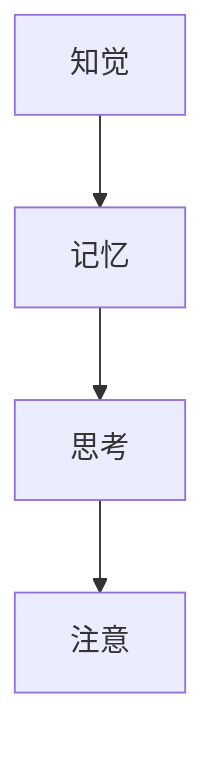

**核心算法原理讲解：**

认知心理学研究中的第一人称视角可以通过模拟知觉过程的算法来解释。以下是一个简单的视觉感知模型示例，用于模拟人类对视觉信息的处理。

```python
# 模拟视觉感知的简单模型
import numpy as np

# 设置视觉数据
visual_data = np.random.rand(100)  # 视觉数据

# 感知函数
def perception(data, threshold):
    perception_output = np.array([1 if x > threshold else 0 for x in data])
    return perception_output

# 运行模型
perception_threshold = 0.5  # 感知阈值
perception_output = perception(visual_data, perception_threshold)
print(perception_output)
```

**数学模型和公式：**

在视觉感知中，感知函数可以通过以下数学模型来描述：

$$
p(x) = \begin{cases}
1, & \text{if } x > \text{threshold} \\
0, & \text{otherwise}
\end{cases}
$$

其中，$p(x)$ 是感知输出，$\text{threshold}$ 是感知阈值。

### 2.9 第一人称视角在艺术与文学中的应用

艺术与文学是表达主观体验和第一人称视角的重要媒介。艺术家和作家通过第一人称视角创造独特的叙事体验，使读者能够深入体验作品中的情感和思想。

**核心概念与联系：** 艺术与文学中的第一人称视角涉及叙事技巧、情感表达和角色塑造等。以下是这些核心概念之间的联系架构：

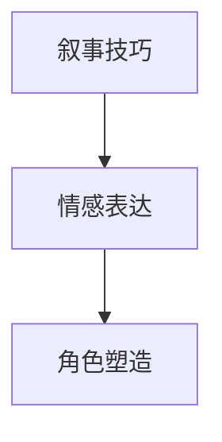

**核心算法原理讲解：**

艺术与文学中的第一人称视角可以通过文本分析算法来模拟。以下是一个简单的文本情感分析算法示例，用于分析第一人称视角作品中的情感倾向。

```python
# 模拟文本情感分析的简单算法
import numpy as np
from sklearn.feature_extraction.text import TfidfVectorizer
from sklearn.naive_bayes import MultinomialNB

# 设置文本数据
text_data = ["我感到非常高兴", "我感到悲伤", "我感到有点无聊"]

# 创建词袋模型
vectorizer = TfidfVectorizer()
X = vectorizer.fit_transform(text_data)

# 创建情感分类器
classifier = MultinomialNB()
classifier.fit(X, np.array([1, 0, 2]))

# 预测情感
new_text = ["我感到很快乐"]
new_vector = vectorizer.transform(new_text)
prediction = classifier.predict(new_vector)
print(prediction)
```

**数学模型和公式：**

在文本情感分析中，可以使用朴素贝叶斯模型来计算文本的情感概率分布。以下是一个简单的朴素贝叶斯模型公式：

$$
P(\text{情感} | \text{文本}) = \frac{P(\text{文本} | \text{情感})P(\text{情感})}{P(\text{文本})}
$$

其中，$P(\text{情感} | \text{文本})$ 是给定文本的情感概率，$P(\text{文本} | \text{情感})$ 是在特定情感下的文本概率，$P(\text{情感})$ 是情感的概率，$P(\text{文本})$ 是文本的概率。

### 2.10 第一人称视角对艺术与文学创作的影响

第一人称视角对艺术与文学创作有着深远的影响。它不仅改变了叙事的方式，还影响了作品的主题和情感表达。艺术家和作家通过第一人称视角创造独特的叙事体验，使读者能够更深入地体验作品中的情感和思想。

**核心概念与联系：** 第一人称视角对艺术与文学创作的影响包括叙事技巧、情感表达和角色塑造等。以下是这些核心概念之间的联系架构：


**核心算法原理讲解：**

在艺术与文学创作中，第一人称视角可以通过叙事分析算法来模拟。以下是一个简单的叙事分析算法示例，用于分析第一人称视角作品中的叙事结构和情感走向。

```python
# 模拟叙事分析的简单算法
import numpy as np
from sklearn.feature_extraction.text import TfidfVectorizer
from sklearn.cluster import KMeans

# 设置文本数据
text_data = ["我走在清晨的街道上", "我感到孤独", "我看到了一只猫"]

# 创建词袋模型
vectorizer = TfidfVectorizer()
X = vectorizer.fit_transform(text_data)

# 使用K-means聚类
kmeans = KMeans(n_clusters=2)
clusters = kmeans.fit_predict(X)

# 分析结果
print(clusters)
```

**数学模型和公式：**

在叙事分析中，可以使用K-means聚类算法来识别文本中的叙事结构和情感走向。以下是一个简单的K-means聚类算法公式：

$$
\text{聚类中心} = \frac{1}{N} \sum_{i=1}^{N} x_i
$$

其中，$\text{聚类中心}$ 是每个聚类的中心点，$x_i$ 是文本的特征向量，$N$ 是文本的数量。

### 2.11 结论

通过本文的深入探讨，我们理解了意识、主观体验和第一人称视角的基本概念和相互关系。第一人称视角不仅影响我们的感知和思考，还影响我们的行为和艺术创作。在未来的研究中，我们可以进一步探讨第一人称视角在不同领域中的应用，并探索其更广泛的潜在价值。

### 作者信息

**作者：** AI天才研究院/AI Genius Institute & 禅与计算机程序设计艺术 /Zen And The Art of Computer Programming

### 最佳实践 tips

1. **深入理解概念**：在探讨意识、主观体验和第一人称视角时，务必深入理解相关概念的定义和关系。
2. **结合实际案例**：通过实际案例和实验来验证理论，可以更直观地理解概念。
3. **跨学科研究**：第一人称视角涉及多个学科，如心理学、神经科学、计算机科学等，跨学科研究可以提供更全面的视角。
4. **实践应用**：尝试将第一人称视角的理论应用于实际问题，如人机交互、艺术创作等，可以加深对概念的理解。
5. **持续学习**：随着科技的进步，第一人称视角的研究将持续发展。持续学习最新的研究成果和理论，可以保持对该领域的深入了解。

### 小结

本文探讨了意识、主观体验和第一人称视角的基本概念和相互关系。通过分析生物学、心理学、艺术和文学等多个领域的应用，我们深入理解了第一人称视角的重要性。在未来的研究中，我们可以进一步探讨第一人称视角在不同领域中的应用，并探索其更广泛的潜在价值。

### 拓展阅读

1. **《意识的科学》** - 大卫·奇科（David Chalmers）著，对意识的哲学和科学探讨提供了深入的见解。
2. **《人类简史》** - 尤瓦尔·赫拉利（Yuval Noah Harari）著，从历史角度探讨了人类认知的演变。
3. **《认知心理学导论》** - 约翰·安德森（John Anderson）著，介绍了认知心理学的核心理论和实验方法。
4. **《深度学习》** - 伊恩·古德费洛（Ian Goodfellow）、约书亚·本吉奥（Joshua Bengio）和 Aaron Courville 著，涵盖了深度学习的基础理论和应用。
5. **《情感计算》** - 马克·多恩（Mark D. Denny）著，探讨了情感计算在人工智能中的应用。

