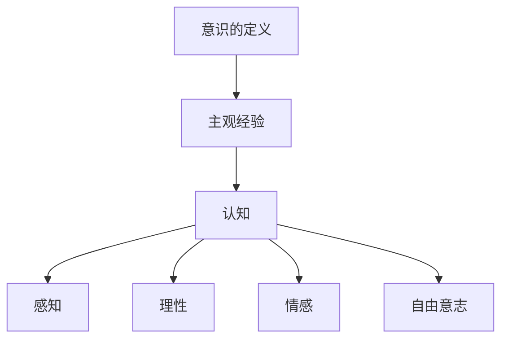

                 

### 意识与主观经验在理解世界中的作用

> 关键词：意识，主观经验，认知，哲学，科学，理解世界

> 摘要：本文将深入探讨意识与主观经验在理解世界中的重要作用。通过分析哲学与科学对意识的不同解释，结合实际案例和算法原理，我们试图揭示这两者在人类认知过程中的关键作用。本文旨在为读者提供一个全面而深刻的理解，帮助他们在日常生活和科技发展中更好地把握这两者的本质。

---

### 引言

在人类的认知过程中，意识与主观经验扮演着至关重要的角色。意识是我们对自己和外部世界的感知，是我们思考、决策和行动的基础；而主观经验则是我们对于周围世界的感受和体验。尽管这两个概念看似抽象，但它们在人类生活中无处不在，影响着我们的每一个决策和行为。

本文将从以下三个方面展开讨论：

1. **意识的哲学探讨**：回顾历史哲学中的意识观，从古希腊哲学到现代哲学，探讨不同哲学流派对意识的解释。
2. **科学对意识的研究**：介绍神经科学、心理学和认知科学对意识的研究进展，包括大脑机制、感知和决策过程等。
3. **意识与主观经验的重要性**：分析意识与主观经验在理解世界中的具体作用，以及它们在科技发展中的应用。

通过本文的探讨，我们希望读者能够更深刻地理解意识与主观经验在人类认知中的重要作用，从而更好地应用这些理论于日常生活和科技发展中。

### 意识的哲学探讨

#### 历史哲学中的意识观

哲学对意识的研究可以追溯到古希腊时期。古希腊哲学家如苏格拉底、柏拉图和亚里士多德都对意识进行了深入的探讨。

**苏格拉底**认为，意识是理性思考的基础。他强调人的灵魂是独立的，不受物质世界的限制。苏格拉底的哲学观点对后来的西方哲学产生了深远的影响，奠定了理性主义的基础。

**柏拉图**则提出了“理型论”（Theory of Forms），认为现实世界只是理型世界的影子。柏拉图认为，意识是灵魂对理型的感知，这是一种超越物质世界的认知过程。

**亚里士多德**则更加注重实证研究，他提出了“感知论”（Sensationalism），认为意识是通过感官与外界互动而获得的。亚里士多德的观点强调了感知在意识形成中的重要作用。

随着时间的推移，中世纪哲学和文艺复兴时期的哲学家也对意识进行了不同的解释。中世纪的奥古斯丁和托马斯·阿奎那都强调了灵魂和意识在宗教信仰中的作用。而文艺复兴时期的哲学家则更加关注人类个体的价值和自由意志，如蒙田和培根等。

**现代哲学**中的意识观

进入现代社会，哲学对意识的研究更加多元和深入。经验主义者如洛克和休谟认为，意识是由一系列感知和经验构成的。洛克提出了“感觉论”（Sensationalism），认为所有知识都来源于感觉。休谟则进一步强调了主观经验在意识形成中的决定性作用。

理性主义者如莱布尼茨和康德则认为，意识是一个统一的认知过程。莱布尼茨提出了“单子论”（Monadology），认为每个物质都是独立的意识单元。康德则通过“先验范畴”（Transcendental Categories）的概念，探讨了意识在认知过程中的作用。

**后现代哲学**中的意识观

后现代哲学对意识的研究更加复杂和多元。德里达和福柯等哲学家质疑了西方哲学中关于意识和真理的传统观念。他们认为，意识是文化和社会建构的结果，具有相对性和多样性。

**意识的概念架构**

为了更清晰地理解意识的不同概念，我们可以使用Mermaid流程图来展示它们之间的关系：

在这个流程图中，意识的定义（A）是主观经验（B）的基础，而主观经验又与认知（C）密切相关。认知包括了感知（D）、理性（E）、情感（F）和自由意志（G），这些因素共同构成了我们对外部世界的理解和体验。

#### 现代哲学中的意识观

进入20世纪，哲学对意识的研究更加深入和多样化。一些哲学家继续探讨传统哲学问题，如意识的存在和本质，而另一些哲学家则开始将意识研究纳入科学领域。

**存在主义哲学家**如萨特和加缪认为，意识是个体的存在方式。萨特提出了“存在主义”（Existentialism）的观点，认为意识是个体自由选择和行动的根源。加缪则通过“荒诞主义”（Absurdism）探讨了人类在面临不可知的未来时的自由和选择。

**分析哲学家**如艾耶尔和维特根斯坦则通过语言分析来探讨意识。艾耶尔提出了“语言哲学”（Philosophy of Language），认为意识是通过语言表达的。维特根斯坦则通过“逻辑哲学”（Philosophy of Logic）探讨了意识的本质。

**认知科学哲学家**如福多和哈蒙德则将意识研究纳入认知科学领域。福多提出了“功能主义”（Functionalism）的观点，认为意识是认知过程的产物。哈蒙德则通过“神经系统科学”（Neuroscience）的研究，探讨了大脑与意识的关系。

**后现代哲学**中的意识观

后现代哲学对意识的研究更加复杂和多元。德里达和福柯等哲学家质疑了西方哲学中关于意识和真理的传统观念。他们认为，意识是文化和社会建构的结果，具有相对性和多样性。

**德里达**的“解构主义”（Deconstructionism）认为，语言和文本都是建构的，没有绝对的意义。福柯的“知识考古学”（Archaeology of Knowledge）则通过研究历史和权力关系，探讨了知识的生产和传播。

**社会建构主义**认为，意识是通过社会互动和文化传承而形成的。社会建构主义强调了社会环境在意识形成中的重要作用。

**多元文化主义**则认为，不同的文化和社会背景会影响人们对意识的看法和理解。多元文化主义提倡尊重不同文化的多样性，反对文化单一化。

### 意识与认知的关系

#### 哲学中的意识与认知关系

在哲学中，意识与认知的关系是一个长期争论的主题。一些哲学家认为，意识是认知的基础，没有意识就没有认知。另一些哲学家则认为，意识是认知的产物，是认知过程的一部分。

**理性主义**哲学家如莱布尼茨和康德认为，意识是统一的认知过程。莱布尼茨提出了“单子论”，认为每个物质都是独立的意识单元。康德则通过“先验范畴”的概念，探讨了意识在认知过程中的作用。

**经验主义**哲学家如洛克和休谟则认为，意识是认知的产物。洛克提出了“感觉论”，认为所有知识都来源于感觉。休谟则进一步强调了主观经验在意识形成中的决定性作用。

**实证主义**哲学家如孔德和斯宾塞认为，意识是可以通过科学方法研究的。他们强调实证研究在理解意识中的作用，认为意识是可以通过数据和实验来验证的。

#### 认知科学中的意识与认知关系

在认知科学中，意识与认知的关系也得到了广泛的探讨。认知科学是心理学、神经科学、计算机科学和哲学等多个学科交叉的领域，它试图通过实验和模型来理解人类的认知过程。

**认知心理学**研究表明，意识在认知过程中的作用是不可忽视的。认知心理学通过研究记忆、感知、决策等认知过程，揭示了意识在信息处理中的作用。例如，记忆研究表明，意识对记忆的形成和提取有重要影响。

**神经科学**研究表明，意识与大脑的某些区域密切相关。神经科学家通过研究大脑结构和功能，揭示了意识与大脑神经网络的关系。例如，一些研究表明，大脑前额叶和顶叶区域在意识形成中起着关键作用。

**认知科学模型**如人工神经网络和符号计算模型，试图通过模拟人类认知过程来理解意识。这些模型虽然还没有完全解释清楚意识的本质，但它们为研究意识与认知的关系提供了新的思路和工具。

### 意识的神经科学解释

#### 大脑机制与意识

神经科学研究提供了对意识的一种科学解释，主要集中在探索大脑机制与意识之间的关系。以下是一些关键概念和理论：

**神经元与意识**  
神经元是大脑的基本功能单元，负责传递电信号。神经科学家研究发现，神经元的活动模式与意识的产生密切相关。例如，脑电图（EEG）研究表明，大脑的电活动在意识状态下呈现特定的波形和模式。

**大脑结构**  
大脑的不同区域在意识中扮演着不同的角色。例如，**前额叶皮质**（prefrontal cortex）参与高级认知功能，如决策和规划；**顶叶皮质**（parietal cortex）涉及空间感知和自我意识；**扣带回**（cingulate cortex）与情感和注意力相关。

**意识机制**  
神经科学家提出了多种关于意识机制的假设。例如，**全局工作空间理论**（Global Workspace Theory）认为，大脑中的某些区域形成一个共享的信息空间，使得意识能够访问和整合来自不同感官和认知模块的信息。

#### 意识与感知

感知是意识的重要组成部分，它是我们从外部环境中获取信息的过程。神经科学研究表明，大脑的多个区域协同工作，实现感知功能：

- **初级感官皮层**（primary sensory cortex），如视觉皮层、听觉皮层等，负责处理基本的感官信息。
- **高级感官皮层**（higher-order sensory cortex），如视觉 association cortex，负责对感官信息进行加工和解释。

**视觉感知**是一个典型的例子。当光线进入眼睛，通过视网膜上的感光细胞转化为电信号，这些信号通过视觉通路传递到大脑皮层。视觉皮层的不同区域对视觉信息进行不同的加工，如形状、颜色和运动。最终，这些信息被整合并产生主观的视觉体验。

#### 意识与记忆

记忆是意识的另一个重要方面，它涉及对过去经验的存储和回忆。神经科学研究揭示了大脑中多个区域在记忆形成和回忆中的作用：

- **海马体**（hippocampus）是记忆的重要结构，负责短期记忆的存储和长期记忆的编码。
- **新皮层**（neocortex）的不同区域参与长期记忆的加工和存储。

**记忆错误和遗忘**也是意识研究的重要领域。研究表明，大脑中不同区域的功能异常可能导致记忆错误和遗忘。例如，阿尔茨海默病等疾病会导致海马体的损伤，从而影响记忆功能。

#### 意识与情感

情感是意识中一个复杂而重要的维度。情感不仅影响我们的行为和决策，也影响我们对世界的感知和体验。神经科学研究揭示了大脑中多个区域在情感中的作用：

- **前额叶皮质**和**杏仁核**（amygdala）在情绪调节中起着关键作用。
- **扣带回**和**中脑边缘系统**（mesolimbic dopamine system）与愉悦和奖赏相关。

**情绪调节**和**情绪记忆**是意识研究的重要领域。例如，情绪记忆研究表明，情感强烈的经历更容易被记住并长期保持。

### 意识与自由意志

#### 自由意志的概念

自由意志是一个哲学和科学中长期的争论话题。简单来说，自由意志是指个体在行为决策中具有选择和改变的能力，不受外部环境的强制。自由意志与意识的关系紧密相连，因为意识是个体对自己行为和决策的感知和理解。

**哲学中的自由意志**  
哲学家们对自由意志有多种解释。一些哲学家认为，自由意志是绝对存在的，是我们人类独特的能力。例如，笛卡尔认为，自由意志是灵魂的特性，不受物理世界的限制。另一些哲学家则认为，自由意志是相对的，受到物理规律和因果关系的制约。

**科学中的自由意志**  
神经科学和认知科学研究试图从大脑机制和认知过程的角度解释自由意志。一些研究表明，大脑中的前额叶皮质与自由意志相关。例如，大脑成像研究表明，当人们做出自由决策时，前额叶皮质的活动增加。

#### 意识与自由意志的关系

意识与自由意志的关系复杂而微妙。一方面，自由意志可能需要意识的参与，因为只有意识到自己的选择和行动，个体才能被认为是自由地做出决策。另一方面，自由意志可能受到意识之外的认知和神经机制的影响。

**意识对自由意志的影响**  
意识可能影响自由意志的几个方面：

- **决策过程**：意识使得个体能够反思和评估不同的选择，从而做出更明智的决策。
- **行为控制**：意识可以帮助个体控制自己的行为，避免冲动和不当行为。
- **责任感**：意识使得个体对自己的行为和决策承担责任，从而促进道德和社会发展。

**自由意志对意识的影响**  
自由意志也可能影响意识的形成和体验：

- **自我意识**：自由意志使得个体能够认识到自己的选择和行动，从而增强自我意识。
- **主观体验**：自由意志可能影响个体对行为的体验和感受，使得某些行为更加有意义和有价值。
- **认知负担**：自由意志可能增加个体的认知负担，因为需要考虑更多的选择和后果。

### 意识在理解世界中的作用

#### 主观经验与客观现实

意识使我们能够对外部世界进行主观经验，这些经验是我们理解世界的重要途径。主观经验包括感知、情感和思维等，它们帮助我们将外部信息转化为可以理解和解释的知识。

然而，主观经验并不总是与客观现实完全一致。例如，由于个体的感官、认知和情感差异，不同的人可能会对同一事物产生不同的主观体验。此外，由于认知偏差和错觉，我们的主观经验也可能与客观现实存在偏差。

#### 意识与知识的形成

意识在知识的形成中起着关键作用。通过感知和思考，我们可以将外部信息转化为知识。意识使我们能够整合不同的感官信息，进行抽象思维和推理，从而构建对世界的理解。

**感知**是知识形成的第一步。我们的感官接收外部信息，并通过大脑进行处理和解释。例如，视觉感知使我们能够识别和分类物体，听觉感知使我们能够理解和交流语言。

**思维**是知识形成的核心。通过思考，我们能够分析、推理和解决问题，从而将感知到的信息转化为更复杂的知识结构。思维使我们能够进行抽象和概括，从而理解世界的本质和规律。

#### 意识与决策过程

意识在决策过程中也起着重要作用。通过意识，我们能够评估不同的选择和后果，从而做出明智的决策。例如，在购物时，我们会考虑商品的价格、质量和品牌，从而做出购买决策。

然而，意识也可能导致决策困难。由于需要考虑众多的选择和后果，我们可能会感到决策负担过重，难以做出决策。此外，认知偏差和情绪也可能影响我们的决策，导致不理性的行为。

#### 意识与社会互动

意识不仅影响个体的认知和行为，也影响社会互动。通过意识，我们能够理解和预测他人的行为，从而更好地进行社交互动。例如，通过观察他人的表情和语言，我们能够判断他们的情绪和意图。

此外，意识也影响社会规范和价值观的形成。通过意识，我们能够反思和评估社会的行为规范，从而促进社会进步和改革。例如，民权运动和女权运动等社会运动都是通过意识的觉醒和行动来推动社会变革。

### 主观经验在社会生活中的意义

#### 社会互动与主观经验

主观经验在社会互动中扮演着重要角色。通过主观经验，我们能够理解和预测他人的行为，从而更好地进行社交互动。例如，通过观察他人的表情和语言，我们能够判断他们的情绪和意图。

此外，主观经验也影响我们的社会身份和角色。我们的主观经验塑造了我们对社会规范和价值观的理解，从而影响我们的行为和决策。例如，不同文化背景下的人可能有不同的主观经验，从而导致不同的行为和价值观。

#### 主观经验与文化多样性

文化多样性是主观经验的重要组成部分。不同的文化背景和社会环境会导致人们产生不同的主观经验。例如，在多元文化的社会中，人们可能会有不同的信仰、价值观和行为方式。

主观经验和文化多样性之间的关系是复杂的。一方面，主观经验可能促进文化多样性，因为不同的主观经验会导致不同的文化表达和创造。另一方面，主观经验也可能导致文化冲突和隔阂，因为不同的主观经验可能会导致误解和偏见。

#### 主观经验与幸福感

主观经验与幸福感密切相关。积极的、愉快的经验能够提高我们的幸福感，而消极的、不愉快的经验则可能降低我们的幸福感。

主观经验不仅影响我们的情绪和心理健康，还影响我们的社交关系和生活质量。例如，通过积极的社交互动和经验，我们能够建立深厚的社交关系，从而提高幸福感。

### 意识在科技发展中的应用

#### 虚拟现实与意识

虚拟现实（VR）技术正在逐渐改变我们的体验方式。通过VR技术，我们能够进入一个虚拟的世界，这个虚拟世界通过视觉、听觉和触觉等多种感官与我们的意识互动。

VR技术对意识的影响是多方面的。首先，VR能够创造高度沉浸式的体验，使我们感觉仿佛置身于另一个世界。这种沉浸感可以用于娱乐、教育、医疗等多种场景。

然而，VR技术也可能对意识产生负面影响。例如，过度使用VR可能导致晕动症和其他身体不适。此外，长时间沉浸在虚拟世界中可能会影响我们的现实感知和社交能力。

#### 人工智能与主观经验

人工智能（AI）技术正在逐渐融入我们的日常生活，改变我们对世界的理解。通过AI，我们可以实现自动化决策、智能助手和个性化服务。

AI与主观经验的关系是复杂的。一方面，AI可以模拟人类的主观经验，帮助我们更好地理解和处理复杂的信息。例如，智能助手可以通过语音识别和自然语言处理来理解我们的需求和意图。

另一方面，AI也可能影响我们的主观经验。例如，个性化推荐系统可能会影响我们的选择和决策，导致信息泡沫和偏见。此外，AI的自动化决策可能导致人类失去自主性和责任感。

#### 意识研究的未来方向

随着科技的发展，意识研究也在不断深入。未来的研究可能会集中在以下几个方面：

1. **神经科学**：进一步探索大脑机制与意识之间的关系，揭示意识的神经基础。
2. **认知科学**：通过人工智能和机器学习技术，模拟和理解人类认知过程，从而更好地理解意识。
3. **心理学**：研究意识与心理健康之间的关系，探索如何提高人们的幸福感和生活质量。
4. **哲学**：继续探讨意识和自由意志等哲学问题，为科学研究提供新的理论框架。
5. **跨学科研究**：结合神经科学、认知科学、心理学和哲学等多个学科的研究，实现意识的全面理解。

### 结论

通过本文的探讨，我们可以看到意识与主观经验在理解世界中的重要作用。无论是哲学、科学，还是日常生活和科技发展，意识与主观经验都是不可或缺的。

首先，从哲学的角度来看，意识与主观经验是理解人类思维和行为的基础。从古希腊哲学到现代哲学，哲学家们对意识进行了深入的探讨，形成了丰富的理论体系。

其次，科学的发展为我们提供了对意识的新视角。神经科学、心理学和认知科学的研究揭示了大脑机制与意识之间的关系，使我们能够从科学的角度理解意识。

最后，意识与主观经验在科技发展中的应用也日益广泛。虚拟现实、人工智能等技术的进步，使得我们可以更加深入地探索意识和主观经验。

总之，意识与主观经验不仅是理解世界的钥匙，也是推动科技发展和社会进步的重要力量。通过深入研究和理解这两者，我们有望在未来的科技和哲学研究中取得更大的突破。

### 作者信息

作者：AI天才研究院/AI Genius Institute & 禅与计算机程序设计艺术 /Zen And The Art of Computer Programming

本文由AI天才研究院和禅与计算机程序设计艺术联合撰写。AI天才研究院致力于探索人工智能的深层次理论和实践，推动人工智能技术的发展和应用。禅与计算机程序设计艺术则通过禅宗哲学与计算机科学的结合，提供一种全新的思考方式和方法论，帮助程序员在复杂的问题中找到简洁和优雅的解决方案。希望本文能为读者提供有价值的见解和思考。

