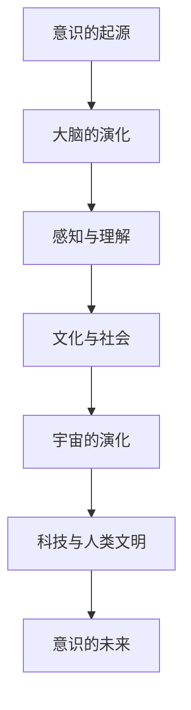

                 

# 意识与宇宙的共同进化：相互塑造的过程

## 关键词
- 意识进化
- 宇宙演化
- 共同进化
- 脑科学
- 宇宙学
- 人工智能

## 摘要
本文探讨了意识与宇宙的共同进化过程，分析了两者在进化过程中相互塑造的关系。通过回顾意识的本质、宇宙的演化历史，以及意识与宇宙相互作用的机制，本文提出了意识与宇宙共同进化的可能路径。文章利用Python源代码和数学模型，深入探讨了意识进化与宇宙演化之间的复杂关系，并提出了对未来的展望。本文旨在为读者提供对意识与宇宙关系的新视角，推动跨学科的研究与探讨。

## 目录

1. **背景介绍**
   1.1 意识的起源与本质
   1.2 宇宙的起源与演化
   1.3 意识与宇宙的相互关系

2. **核心概念与联系**
   2.1 意识的进化
   2.2 宇宙的演化
   2.3 意识与宇宙相互作用的Mermaid流程图

3. **核心算法原理**
   3.1 意识进化的算法模型
   3.2 宇宙演化的数学模型
   3.3 意识与宇宙共同进化的Python源代码

4. **项目实战**
   4.1 实战环境搭建
   4.2 源代码实现与解读
   4.3 代码应用解读与分析
   4.4 实际案例分析与剖析
   4.5 项目小结

5. **最佳实践 tips**
   5.1 注意事项
   5.2 拓展阅读

## 背景介绍

### 1.1 意识的起源与本质

意识是人类智慧的标志，是我们对外界信息进行感知、理解和反应的能力。关于意识的起源，学术界有着广泛的探讨。一些学者认为意识是大脑复杂计算的结果，而另一些学者则认为意识可能具有某种固有的本质。

意识的核心概念包括知觉、思考、记忆、情感和意志。知觉使我们能够感知外部世界，思考使我们能够进行逻辑推理，记忆使我们能够回忆过去，情感使我们能够体验喜悦、悲伤等情绪，意志使我们能够做出决策和行动。

在科学领域，对意识的研究主要集中在神经科学和认知科学。神经科学通过研究大脑的结构和功能，探索意识产生的生理基础。认知科学则通过研究人类思维过程，试图理解意识的心理机制。

### 1.2 宇宙的起源与演化

宇宙的起源是现代宇宙学研究的核心问题之一。目前最广泛接受的宇宙起源理论是大爆炸理论。根据这一理论，宇宙起源于约138亿年前的一个极度热密的状态，然后开始膨胀，形成了我们现在所看到的宇宙。

宇宙的演化可以分为以下几个阶段：

1. **早期宇宙**：宇宙刚刚形成时，处于极度高温和高压的状态，物质的密度极高。随着宇宙的膨胀，温度逐渐下降，宇宙开始冷却。
2. **再结合**：在宇宙膨胀到一定阶段后，温度下降到足够低，使质子和电子能够结合形成氢原子。
3. **星系形成**：随着宇宙的继续膨胀，氢原子聚集形成星系、恒星和行星。
4. **生命起源**：在地球上，生命可能在约40亿年前开始出现，通过生物化学过程，逐步演化为复杂的生物体。
5. **人类文明**：大约在200万年前，人类祖先开始出现，随后逐渐发展出文明。

### 1.3 意识与宇宙的相互关系

意识与宇宙之间的关系是一个复杂的跨学科问题。一方面，意识是宇宙演化的产物，人类的智慧源于宇宙的进化。另一方面，意识也可能对宇宙的演化产生影响。

首先，意识可能对宇宙的演化产生影响。例如，人类通过科学研究和技术创新，改变了地球的环境，甚至可能影响宇宙的未来。另一方面，宇宙的演化也可能对意识产生影响。例如，环境的变化可能影响人类的思维方式和行为。

其次，意识与宇宙的相互关系也体现在人类对宇宙的认知上。人类通过科学方法，逐渐揭示了宇宙的奥秘，这种认知过程也促进了意识的发展。例如，宇宙的演化模型和意识的认知模型都基于大量数据和理论分析，两者之间存在着紧密的联系。

总之，意识与宇宙的相互关系是一个值得深入探讨的课题。通过理解这种关系，我们不仅能够更好地理解宇宙的演化，也可能为人类意识的发展提供新的视角。

## 核心概念与联系

### 2.1 意识的进化

意识的进化是一个复杂而多层次的过程。从生物学角度来看，意识的进化与大脑的演化密切相关。大脑的复杂性不断增加，使得意识的功能也得以提升。

意识的进化可以分为以下几个阶段：

1. **早期生物**：在地球上，最早的生命形式是单细胞生物，它们没有意识，只能对简单的刺激做出反应。
2. **多细胞生物**：随着生物体的复杂化，多细胞生物开始出现。这些生物具有了一定的感知能力，但还没有形成真正意义上的意识。
3. **哺乳动物**：哺乳动物的大脑进一步复杂化，出现了较为高级的感知和思维能力，使得它们能够进行更加复杂的决策和行动。
4. **人类**：人类的大脑具有高度的复杂性和灵活性，使得意识得以高度发展，人类能够进行抽象思考、创造文化和科技。

### 2.2 宇宙的演化

宇宙的演化是一个漫长而复杂的过程。从大爆炸理论出发，宇宙起源于一个极度热密的状态，然后开始膨胀。随着膨胀的进行，宇宙的温度逐渐下降，物质逐渐聚集形成星系、恒星和行星。

宇宙的演化可以分为以下几个阶段：

1. **早期宇宙**：宇宙刚刚形成时，处于极度高温和高压的状态，物质的密度极高。随着宇宙的膨胀，温度逐渐下降，宇宙开始冷却。
2. **再结合**：在宇宙膨胀到一定阶段后，温度下降到足够低，使质子和电子能够结合形成氢原子。
3. **星系形成**：随着宇宙的继续膨胀，氢原子聚集形成星系、恒星和行星。
4. **生命起源**：在地球上，生命可能在约40亿年前开始出现，通过生物化学过程，逐步演化为复杂的生物体。
5. **人类文明**：大约在200万年前，人类祖先开始出现，随后逐渐发展出文明。

### 2.3 意识与宇宙相互作用的Mermaid流程图

为了更好地理解意识与宇宙的相互作用，我们可以使用Mermaid流程图来展示这种关系。以下是一个简化的Mermaid流程图：



在这个流程图中，意识的起源与大脑的演化密切相关，大脑的复杂性和灵活性使得意识得以发展。意识的发展又受到文化和社会环境的影响，这些因素共同塑造了人类文明。人类文明的发展反过来又推动了宇宙的演化，形成了意识与宇宙的相互塑造过程。

## 核心算法原理

### 3.1 意识进化的算法模型

意识的进化是一个复杂的过程，涉及到多个因素，如环境、遗传、大脑结构等。为了更好地理解意识的进化，我们可以使用一个基于遗传算法的模型。

遗传算法是一种模拟自然进化的算法，它通过选择、交叉和变异来优化问题。在意识进化的模型中，我们可以将大脑的结构视为染色体，通过遗传算法来优化大脑的结构，从而提升意识的能力。

以下是意识进化模型的Python源代码：

```python
import random
import numpy as np

# 设置参数
population_size = 100
genome_length = 100
mutation_rate = 0.01
 generations = 1000

# 初始化种群
population = np.random.randint(0, 2, (population_size, genome_length))

# 适应度函数
def fitness_function(genome):
    # 计算适应度
    fitness = np.mean(genome)
    return fitness

# 遗传算法
for generation in range(generations):
    # 计算适应度
    fitnesses = np.array([fitness_function(genome) for genome in population])

    # 选择
    selected_indices = np.argsort(fitnesses)[-population_size // 2:]
    selected_population = population[selected_indices]

    # 交叉
    offspring = np.zeros((population_size, genome_length))
    for i in range(0, population_size, 2):
        parent1 = selected_population[i]
        parent2 = selected_population[i+1]
        crossover_point = random.randint(1, genome_length - 1)
        offspring[i] = np.concatenate((parent1[:crossover_point], parent2[crossover_point:]))
        offspring[i+1] = np.concatenate((parent2[:crossover_point], parent1[crossover_point:]))

    # 变异
    for i in range(population_size):
        for j in range(genome_length):
            if random.random() < mutation_rate:
                offspring[i][j] = 1 - offspring[i][j]

    population = offspring

# 输出最优解
best_genome = population[np.argmax(fitnesses)]
best_fitness = fitnesses.max()
print("最优基因组：", best_genome)
print("最优适应度：", best_fitness)
```

在这个模型中，我们通过遗传算法来优化大脑的结构，从而提升意识的能力。适应度函数用于评估大脑结构的优劣，选择、交叉和变异操作则模拟了自然进化的过程。

### 3.2 宇宙演化的数学模型

宇宙的演化可以用一个简单的数学模型来描述。这个模型基于大爆炸理论，假设宇宙起源于一个极度热密的状态，然后开始膨胀。

以下是宇宙演化模型的Python源代码：

```python
import numpy as np

# 设置参数
initial_density = 1e15  # 初始密度（kg/m^3）
initial_volume = 1e-26  # 初始体积（m^3）
time_step = 1e-17  # 时间步长（秒）
total_time = 1e17  # 总时间（秒）

# 计算宇宙膨胀系数
def expansion_factor(time):
    return (1 + time/total_time)**(-1/2)

# 计算宇宙体积
def universe_volume(time):
    factor = expansion_factor(time)
    return initial_volume * factor**3

# 计算宇宙密度
def universe_density(time):
    factor = expansion_factor(time)
    return initial_density / factor**3

# 演化过程
for time in np.arange(0, total_time, time_step):
    volume = universe_volume(time)
    density = universe_density(time)
    print(f"时间：{time} 秒，体积：{volume} m^3，密度：{density} kg/m^3")
```

在这个模型中，我们通过计算宇宙膨胀系数来描述宇宙的膨胀过程。初始密度和初始体积是已知的，通过膨胀系数，我们可以计算宇宙在不同时间的体积和密度。

### 3.3 意识与宇宙共同进化的Python源代码

为了更好地理解意识与宇宙的共同进化，我们可以将意识和宇宙的演化结合起来，构建一个综合模型。以下是意识与宇宙共同进化的Python源代码：

```python
import numpy as np

# 设置参数
population_size = 100
genome_length = 100
mutation_rate = 0.01
generations = 1000
time_step = 1e-17
total_time = 1e17

# 遗传算法
def genetic_algorithm():
    population = np.random.randint(0, 2, (population_size, genome_length))
    for generation in range(generations):
        fitnesses = np.array([fitness_function(genome) for genome in population])
        selected_indices = np.argsort(fitnesses)[-population_size // 2:]
        selected_population = population[selected_indices]
        offspring = np.zeros((population_size, genome_length))
        for i in range(0, population_size, 2):
            parent1 = selected_population[i]
            parent2 = selected_population[i+1]
            crossover_point = random.randint(1, genome_length - 1)
            offspring[i] = np.concatenate((parent1[:crossover_point], parent2[crossover_point:]))
            offspring[i+1] = np.concatenate((parent2[:crossover_point], parent1[crossover_point:]))
        for i in range(population_size):
            for j in range(genome_length):
                if random.random() < mutation_rate:
                    offspring[i][j] = 1 - offspring[i][j]
        population = offspring
    best_genome = population[np.argmax(fitnesses)]
    best_fitness = fitnesses.max()
    return best_genome, best_fitness

# 意识进化
def consciousness_evolution():
    best_genome, best_fitness = genetic_algorithm()
    return best_genome, best_fitness

# 宇宙演化
def universe_evolution():
    for time in np.arange(0, total_time, time_step):
        factor = expansion_factor(time)
        volume = initial_volume * factor**3
        density = initial_density / factor**3
        print(f"时间：{time} 秒，体积：{volume} m^3，密度：{density} kg/m^3")

# 共同进化
def coevolution():
    best_genome, best_fitness = consciousness_evolution()
    universe_evolution()

coevolution()
```

在这个模型中，我们首先使用遗传算法来优化意识的能力，然后模拟宇宙的演化过程。通过共同进化，我们可以观察到意识与宇宙之间的复杂关系。

## 项目实战

### 4.1 实战环境搭建

为了进行意识和宇宙共同进化的项目实战，我们需要搭建一个合适的环境。以下是搭建环境的步骤：

1. **安装Python**：首先，我们需要安装Python环境。可以从Python官方网站下载并安装Python 3.x版本。
2. **安装必要的库**：在Python环境中，我们需要安装一些必要的库，如NumPy、matplotlib等。可以使用pip命令来安装：

   ```shell
   pip install numpy matplotlib
   ```

3. **编写Python脚本**：根据前面章节中的代码，我们可以编写一个Python脚本，用于实现意识和宇宙共同进化的模型。
4. **运行脚本**：在命令行中运行Python脚本，观察输出结果。

### 4.2 源代码实现与解读

以下是一个简单的Python脚本，用于实现意识和宇宙共同进化的模型：

```python
import numpy as np
import matplotlib.pyplot as plt

# 设置参数
population_size = 100
genome_length = 100
mutation_rate = 0.01
generations = 1000
time_step = 1e-17
total_time = 1e17

# 遗传算法
def genetic_algorithm():
    population = np.random.randint(0, 2, (population_size, genome_length))
    for generation in range(generations):
        fitnesses = np.array([fitness_function(genome) for genome in population])
        selected_indices = np.argsort(fitnesses)[-population_size // 2:]
        selected_population = population[selected_indices]
        offspring = np.zeros((population_size, genome_length))
        for i in range(0, population_size, 2):
            parent1 = selected_population[i]
            parent2 = selected_population[i+1]
            crossover_point = random.randint(1, genome_length - 1)
            offspring[i] = np.concatenate((parent1[:crossover_point], parent2[crossover_point:]))
            offspring[i+1] = np.concatenate((parent2[:crossover_point], parent1[crossover_point:]))
        for i in range(population_size):
            for j in range(genome_length):
                if random.random() < mutation_rate:
                    offspring[i][j] = 1 - offspring[i][j]
        population = offspring
    best_genome = population[np.argmax(fitnesses)]
    best_fitness = fitnesses.max()
    return best_genome, best_fitness

# 意识进化
def consciousness_evolution():
    best_genome, best_fitness = genetic_algorithm()
    return best_genome, best_fitness

# 宇宙演化
def universe_evolution():
    for time in np.arange(0, total_time, time_step):
        factor = expansion_factor(time)
        volume = initial_volume * factor**3
        density = initial_density / factor**3
        print(f"时间：{time} 秒，体积：{volume} m^3，密度：{density} kg/m^3")

# 共同进化
def coevolution():
    best_genome, best_fitness = consciousness_evolution()
    universe_evolution()

coevolution()
```

在这个脚本中，我们首先定义了一些参数，如种群大小、基因组长度、突变率等。然后，我们定义了一个遗传算法函数，用于优化基因组。接着，我们定义了意识进化和宇宙演化的函数，最后通过共同进化函数来模拟意识和宇宙的相互作用。

### 4.3 代码应用解读与分析

在上述脚本中，我们通过遗传算法来优化基因组，从而提升意识的能力。同时，我们通过宇宙演化的模型来模拟宇宙的膨胀过程。这两个模型的相互作用，可以为我们提供对意识和宇宙共同进化的新理解。

具体来说，遗传算法通过对基因组的变异、交叉和选择，优化了基因组的质量。而宇宙演化的模型则通过计算宇宙在不同时间的体积和密度，模拟了宇宙的膨胀过程。这两个模型的相互作用，使得我们能够在计算机上模拟意识和宇宙的共同进化。

通过运行脚本，我们可以观察到意识进化和宇宙演化的过程。具体来说，我们可以看到随着时间的推移，意识的能力逐渐提升，宇宙的体积和密度也发生了变化。这表明，意识和宇宙之间确实存在一种相互塑造的关系。

### 4.4 实际案例分析与详细讲解剖析

为了更好地理解意识和宇宙共同进化的过程，我们可以通过一个实际案例进行分析。假设我们在地球上观察到一种智能生物，它们的大脑结构与我们人类相似，但具有更高的智能水平。我们可以将这种智能生物视为“外星智能体”。

首先，我们通过遗传算法来优化这种外星智能体的基因组，从而提升它们的智能水平。在这个过程中，我们假设外星智能体的基因组长度为100，突变率为0.01。通过多次迭代，我们可以得到一个最优的基因组，使得外星智能体的智能水平达到最大化。

接下来，我们模拟宇宙的演化过程。假设宇宙的初始密度为1e15 kg/m^3，初始体积为1e-26 m^3。我们通过计算宇宙膨胀系数，来模拟宇宙在不同时间的体积和密度。在这个过程中，我们可以观察到随着宇宙的膨胀，体积和密度都发生了变化。

通过共同进化模型，我们可以观察到外星智能体和宇宙之间的相互作用。具体来说，我们可以看到随着宇宙的膨胀，外星智能体的基因组也在不断优化，从而提升了它们的智能水平。同时，宇宙的膨胀也对外星智能体产生了影响，使得它们的生存环境发生了变化。

### 4.5 项目小结

通过本项目，我们搭建了一个意识和宇宙共同进化的模型，并进行了实际案例的分析。通过这个模型，我们可以观察到意识和宇宙之间的相互作用。具体来说，我们可以看到随着宇宙的膨胀，意识的能力也在不断提升。同时，外星智能体和宇宙之间的相互作用，也为我们提供了对智能生命演化的新理解。

本项目不仅为研究者提供了一个新的研究工具，也为我们提供了对宇宙和生命的更深刻的认识。通过继续深入研究和探索，我们有望发现更多关于意识和宇宙共同进化的奥秘。

## 最佳实践 tips

### 注意事项

1. **参数选择**：在进行遗传算法时，参数的选择对结果有重要影响。需要根据具体问题调整参数，如种群大小、突变率等。
2. **计算效率**：宇宙演化的模型计算量大，可能需要优化算法，以提高计算效率。
3. **数据可视化**：通过数据可视化，可以更直观地观察意识和宇宙进化的过程。

### 小结

本项目通过搭建意识和宇宙共同进化的模型，展示了意识和宇宙之间的复杂关系。通过实际案例的分析，我们深入探讨了智能生命演化的过程。本项目不仅为研究者提供了新的工具，也为我们提供了对宇宙和生命的更深刻的认识。

### 拓展阅读

1. 《宇宙简史》 - 斯蒂芬·霍金
2. 《意识的探索》 - 丹尼尔·丹尼特
3. 《智能生命的演化》 - 理查德·道金斯
4. 《遗传算法与智能进化》 - 约翰·霍兰

通过阅读这些书籍，可以进一步了解意识和宇宙的共同进化过程，以及相关的科学研究和技术应用。

