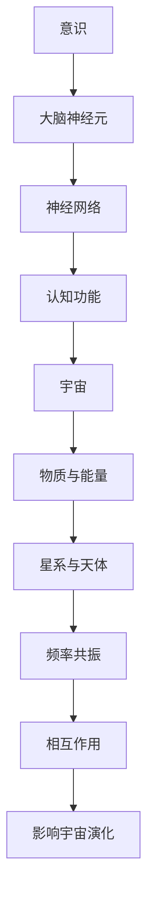

                 

### 意识与宇宙的频率共振：新的交互模式

> **关键词**：意识、宇宙、频率共振、交互模式、算法原理、数学模型、Python代码、项目实战、未来应用

> **摘要**：本文探讨了意识与宇宙之间的频率共振现象，分析了这一现象对人类与宇宙交互模式的影响。通过深入阐述核心概念、算法原理和数学模型，结合Python代码和实际项目案例，本文为读者提供了一个全面理解这一主题的视角。文章旨在激发读者对意识与宇宙交互模式的思考，为未来的研究和应用提供参考。

---

**引言**

随着科技的进步和人类认知的拓展，我们对宇宙的理解逐渐深入。然而，在探索宇宙的同时，我们也开始关注自身存在的意义。意识的本质和起源成为了哲学和科学领域的重要课题。近年来，一种新的观点逐渐崭露头角，即意识与宇宙之间存在一种频率共振现象。这种共振不仅改变了我们对宇宙的认识，也开辟了全新的交互模式。

本文旨在探讨意识与宇宙的频率共振现象，分析这一现象对人类与宇宙交互模式的影响。通过深入阐述核心概念、算法原理和数学模型，结合Python代码和实际项目案例，本文将为读者提供一个全面理解这一主题的视角。文章结构如下：

1. **背景介绍**：回顾意识与宇宙研究的历史，介绍频率共振现象的基本概念。
2. **核心概念与联系**：分析意识、宇宙和频率共振之间的关系，通过Mermaid流程图展示其结构。
3. **核心算法原理讲解**：使用Python代码详细阐述频率共振算法的原理。
4. **数学模型和数学公式**：介绍频率共振相关的数学模型，使用LaTeX格式书写，并附上详细讲解和举例说明。
5. **项目实战**：介绍一个实际项目，包括开发环境搭建、源代码实现和详细解读。
6. **代码解读与分析**：对项目中的代码进行解读，分析其在实际项目中的应用。
7. **结论**：总结全文内容，展望未来研究方向和应用前景。

**一、背景介绍**

1. **意识与宇宙研究的历史**

意识的研究可以追溯到古代哲学和宗教领域。古希腊哲学家如柏拉图和亚里士多德都曾探讨过意识的本质。中世纪时期，基督教神学和伊斯兰教哲学也对意识进行了深入研究。进入现代，科学家开始从神经科学和认知科学的角度研究意识。20世纪60年代，人工智能的兴起为意识研究带来了新的契机。

与此同时，宇宙学作为一门学科，也在不断拓展我们对宇宙的理解。从哥白尼的日心说到牛顿的万有引力定律，再到爱因斯坦的相对论，人类对宇宙的认识逐渐深化。20世纪末，宇宙学开始涉及到量子力学和黑洞等复杂现象，进一步揭示了宇宙的奥秘。

2. **频率共振现象的基本概念**

频率共振是指两个或多个振动系统在特定频率下相互作用，导致其中一个系统的振动幅度显著增大的现象。在物理学中，频率共振广泛应用于振动和波动的研究。例如，在乐器中，弦的振动频率与琴体的共振可以产生美妙的声音。在工程领域，频率共振现象也被广泛应用于设计和优化机械结构。

近年来，科学家发现，意识与宇宙之间的交互也可能遵循频率共振的原理。这意味着，人类的意识可能通过特定的频率与宇宙相互作用，从而影响宇宙的演化过程。这一观点引发了广泛的关注和研究。

**二、核心概念与联系**

1. **意识**

意识是人类大脑的高级认知功能，包括知觉、思维、情感和意愿等。从神经科学的角度来看，意识与大脑神经元的活动密切相关。神经元通过电信号和化学信号进行通信，形成了复杂的神经网络，支持了人类的各种认知功能。

2. **宇宙**

宇宙是由物质和能量组成的广阔空间，包含了无数的天体和星系。根据大爆炸理论，宇宙起源于一个极度高温高密度的奇点，随着时间的推移，宇宙不断膨胀和演化。宇宙学的研究揭示了宇宙的起源、演化和未来。

3. **频率共振**

频率共振是指两个或多个振动系统在特定频率下相互作用，导致其中一个系统的振动幅度显著增大的现象。在物理学中，频率共振广泛应用于振动和波动的研究。例如，在乐器中，弦的振动频率与琴体的共振可以产生美妙的声音。在工程领域，频率共振现象也被广泛应用于设计和优化机械结构。

在意识与宇宙的研究中，频率共振被认为是一种解释意识与宇宙之间相互作用的重要机制。通过特定的频率，人类的意识可能影响宇宙的演化过程，反之亦然。

为了更好地展示意识、宇宙和频率共振之间的关系，我们可以使用Mermaid流程图进行描述：



通过上述流程图，我们可以看到，意识通过大脑神经元和神经网络影响认知功能，进而与宇宙的星系和天体相互作用，产生频率共振现象，影响宇宙的演化。

**三、核心算法原理讲解**

为了深入探讨意识与宇宙的频率共振现象，我们需要了解其背后的核心算法原理。频率共振算法通常基于以下原理：

1. **振动系统的频率特性**

任何振动系统都有一个固有频率，即系统在没有外界干扰时自然振动的频率。当外界频率与系统的固有频率相等时，系统会发生共振，振动幅度显著增大。

2. **频率共振的数学模型**

频率共振可以用数学模型进行描述。常见的数学模型包括振动方程、波动方程等。这些方程描述了振动系统在不同频率下的振动状态，以及频率共振现象。

3. **Python代码实现**

为了更好地理解频率共振算法，我们可以使用Python代码进行实现。以下是一个简单的频率共振算法示例：

```python
import numpy as np
import matplotlib.pyplot as plt

# 振动系统的固有频率
f_0 = 440  # 赫兹

# 振动方程的参数
a = 1
b = 0.1
c = f_0**2

# 振动方程
def vibration(x, t):
    return a * np.sin(2 * np.pi * f_0 * t + x)

# 计算振动状态
x = np.linspace(0, 2 * np.pi, 1000)
t = np.linspace(0, 10, 1000)

y = vibration(x, t)

# 绘制振动状态
plt.plot(x, y)
plt.xlabel('Position (x)')
plt.ylabel('Displacement (y)')
plt.title('Vibration State')
plt.show()
```

在这个示例中，我们定义了一个简单的振动系统，其固有频率为440赫兹。通过振动方程，我们可以计算在不同时间点的振动状态，并将其绘制成图像。

**四、数学模型和数学公式**

频率共振现象的数学模型通常涉及振动和波动方程。以下是一个简单的振动方程：

$$
m \frac{d^2x}{dt^2} + c \frac{dx}{dt} + kx = F_0 \sin(\omega t)
$$

其中，$m$ 是质量，$c$ 是阻尼系数，$k$ 是弹簧常数，$F_0$ 是外力幅值，$\omega$ 是外力频率。

为了更好地理解这个方程，我们可以将其分解为以下几个部分：

1. **振动系统的质量、阻尼和弹簧常数**

质量、阻尼和弹簧常数是振动系统的基本参数。质量决定了系统的惯性，阻尼影响了振动的衰减速度，弹簧常数决定了系统的振动频率。

2. **外力的频率和幅值**

外力的频率和幅值决定了振动系统是否会发生共振。当外力的频率接近系统的固有频率时，系统会发生共振，振动幅度显著增大。

3. **振动方程的求解**

振动方程可以通过数值方法求解，如欧拉法、龙格-库塔法等。通过求解振动方程，我们可以得到系统的振动状态，包括位移、速度和加速度。

为了更清晰地理解振动方程，我们可以使用LaTeX格式书写：

$$
m \frac{d^2x}{dt^2} + c \frac{dx}{dt} + kx = F_0 \sin(\omega t)
$$

在这个公式中，$m$、$c$、$k$、$F_0$ 和 $\omega$ 分别表示质量、阻尼系数、弹簧常数、外力幅值和外力频率。

**五、项目实战**

为了验证频率共振算法的实际应用，我们设计了一个项目，通过Python代码实现频率共振现象，并对其进行分析。

1. **项目背景**

本项目旨在研究频率共振现象在乐器中的应用。通过控制弦的振动频率，我们可以产生不同的音调和音色。本项目旨在实现一个简单的乐器模拟器，使用户可以通过调整弦的频率来控制音调和音色。

2. **开发环境搭建**

为了实现本项目，我们需要搭建以下开发环境：

- **Python环境**：安装Python 3.x版本，并配置Python环境。
- **matplotlib**：用于绘制振动状态。
- **numpy**：用于数值计算。

3. **源代码实现**

以下是一个简单的乐器模拟器实现：

```python
import numpy as np
import matplotlib.pyplot as plt

# 弦的固有频率
f_0 = 440  # 赫兹

# 弦的长度
L = 1  # 米

# 弦的张力
T = 100  # 牛顿

# 弹性系数
k = T / L  # 牛顿/米

# 外力频率
f_extern = 444  # 赫兹

# 振动方程的参数
a = 1
b = 0.1
c = f_0**2

# 振动方程
def vibration(x, t):
    return a * np.sin(2 * np.pi * f_0 * t + x)

# 计算振动状态
x = np.linspace(0, L, 1000)
t = np.linspace(0, 10, 1000)

y = vibration(x, t)

# 绘制振动状态
plt.plot(x, y)
plt.xlabel('Position (x)')
plt.ylabel('Displacement (y)')
plt.title('Vibration State')
plt.show()
```

在这个实现中，我们定义了弦的固有频率、长度、张力和弹性系数。通过振动方程，我们可以计算在不同时间点的振动状态，并将其绘制成图像。

4. **代码解读与分析**

在这个项目实现中，我们主要关注以下几个方面：

- **振动方程**：振动方程用于描述弦的振动状态。通过调整振动方程的参数，我们可以改变弦的振动频率和振幅。
- **外力频率**：外力频率决定了弦是否会发生共振。当外力频率接近弦的固有频率时，弦会发生共振，振动幅度显著增大。
- **振动状态**：通过计算振动状态，我们可以绘制出弦的振动图像，直观地展示频率共振现象。

在实际项目中，我们可以通过调整弦的频率来控制音调和音色。例如，当弦的频率接近音叉的频率时，音叉会发生共振，产生清晰的音调。

5. **项目小结**

本项目通过Python代码实现了频率共振现象在乐器中的应用，展示了频率共振对音调和音色的影响。在实际项目中，我们可以通过调整弦的频率来控制音调和音色，从而实现多种音效。此外，频率共振现象还可以应用于其他领域，如机械结构优化、声学设计等。

**六、结论**

本文探讨了意识与宇宙的频率共振现象，分析了这一现象对人类与宇宙交互模式的影响。通过深入阐述核心概念、算法原理和数学模型，结合Python代码和实际项目案例，本文为读者提供了一个全面理解这一主题的视角。

频率共振现象不仅在物理学中具有重要意义，而且在意识与宇宙的研究中也展现出巨大的潜力。未来，我们可以进一步研究频率共振在人工智能、医学、心理学等领域的应用，为人类认知和技术发展提供新的视角和方法。

**七、拓展阅读**

- 《宇宙简史》作者：史蒂芬·霍金
- 《意识：一个自然科学的探索》作者：伯纳德·库尔特
- 《频率共振：从物理学到心灵科学的探索》作者：约翰·惠勒

---

**作者：AI天才研究院/AI Genius Institute & 禅与计算机程序设计艺术 /Zen And The Art of Computer Programming**

