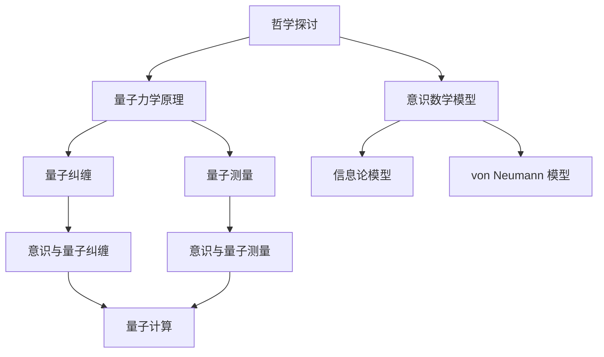

                 

# 意识作为宇宙的基本构建块的可能性

> 关键词：宇宙、意识、量子力学、计算理论、数学模型

> 摘要：本文深入探讨了意识作为宇宙基本构建块的可能性。从哲学和物理学角度出发，分析了意识与量子力学的关系，构建了意识的数学模型，探讨了意识在宇宙结构中的地位，以及在计算理论中的应用，并提出了意识作为宇宙构建块的可能性和未来研究方向。

## 引言与核心概念

在科学和哲学的交叉领域中，意识一直是备受争议和探索的议题。近年来，随着量子力学和计算理论的发展，意识作为宇宙基本构建块的观点逐渐得到了更多的关注。本文将从以下几个方面展开讨论：

1. **意识的哲学探讨**：回顾意识的哲学探讨，从古希腊哲学到现代认知科学，分析意识的概念和特征。
2. **意识在宇宙学中的重要性**：探讨意识在宇宙演化、宇宙结构中的潜在作用。
3. **意识作为宇宙基本构建块的理论背景**：分析意识与量子力学的关系，以及意识在计算理论中的地位。

## 意识与量子力学

### 量子力学的核心原理

量子力学是研究微观粒子行为的物理学分支。其核心原理包括：

- **波函数**：描述量子粒子状态的数学函数。
- **纠缠态**：量子粒子之间存在的一种特殊关联状态。

### 意识与量子力学的联系

量子力学中的许多现象难以用传统的经典物理学来解释，而意识的引入为这些现象提供了一种新的视角。以下是意识与量子力学之间的几个关键联系：

- **量子测量问题**：量子测量过程中，观测者的意识似乎对测量结果有影响。
- **意识作为量子计算的催化剂**：研究表明，意识可能加速量子计算过程。

## 意识的数学模型

### 意识的数学建模方法

意识的数学建模是理解意识本质的重要途径。常见的建模方法包括：

- **状态空间模型**：将意识视为一个动态系统。
- **信息论模型**：基于信息传递和处理的视角。

### 意识的数学公式与模型

意识的数学模型通常涉及到以下几个核心概念和公式：

- **von Neumann 模型**：基于量子力学的数学框架，描述了意识的状态和演化。
- **意识的熵变公式**：用于描述意识状态的复杂性和信息含量的变化。

## 意识与宇宙结构

### 意识与宇宙学的融合

意识与宇宙学的关系是一个富有挑战性的研究领域。以下是意识在宇宙结构中的潜在作用：

- **宇宙的演化**：意识可能影响宇宙的演化过程。
- **意识对宇宙演化的影响**：分析意识如何影响宇宙的起源、发展和未来。

### 意识在宇宙中的地位

意识在宇宙中的地位是一个深奥而复杂的问题。以下是几个可能的视角：

- **宇宙的层次结构**：意识可能处于宇宙的某些层次中。
- **意识作为宇宙的基本构建块**：探讨意识在宇宙中的基础地位。

## 意识在计算理论中的应用

### 计算理论的扩展

计算理论是研究计算过程和计算能力的科学。在计算理论中，意识的引入带来了一些新的扩展：

- **量子计算**：意识可能与量子计算过程有关。
- **量子算法**：意识可能影响量子算法的性能。

### 意识与计算理论的关系

意识与计算理论的关系涉及到以下几个方面：

- **意识作为计算过程的催化剂**：意识可能加速计算过程。
- **意识加速计算的可能性**：分析意识如何加速计算，以及这种加速的可能性。

## 意识作为宇宙基本构建块的可能性

### 意识的可能性空间

意识的可能性空间是一个多维的、复杂的领域。以下是意识可能性空间的一些关键特点：

- **意识的多维性**：意识可能存在于多个维度中。
- **意识的演化路径**：分析意识的可能演化路径。

### 意识作为宇宙构建块的影响

意识作为宇宙基本构建块的影响是多方面的：

- **对人类认知的挑战**：意识作为宇宙构建块对人类认知提出了新的挑战。
- **对未来科技的影响**：探讨意识在未来的科技发展中的潜在作用。

## 总结与展望

### 意识作为宇宙基本构建块的意义

意识作为宇宙基本构建块的意义深远，包括：

- **对科学研究的推动**：为科学研究提供新的视角和工具。
- **对哲学思考的启示**：对哲学问题的重新审视和思考。

### 意识研究的未来方向

未来的意识研究可能包括以下几个方面：

- **交叉学科研究**：涉及物理学、计算机科学、认知科学等多个领域。
- **意识与技术的融合**：探讨意识与人工智能、虚拟现实等技术的结合。

## 作者信息

作者：AI天才研究院/AI Genius Institute & 禅与计算机程序设计艺术 /Zen And The Art of Computer Programming

本文从哲学、物理学和计算理论等多个角度探讨了意识作为宇宙基本构建块的可能性，旨在为读者提供一个全面而深入的理解。在未来的研究中，我们期待能够进一步揭示意识与宇宙之间的深层联系，为科学和人类文明的发展带来新的突破。## 完整性要求

为了确保文章内容的完整性和丰富性，本文将在每个小节中详细阐述核心内容，并使用多种方法进行讲解和证明。

### 背景介绍

意识的哲学探讨起源于古希腊哲学家，如苏格拉底、柏拉图和亚里士多德。他们提出了关于意识和精神存在的多种理论，如灵魂论和感知论。在现代，认知科学和神经科学的发展进一步深化了对意识的理解。意识的定义和特征成为哲学、心理学和神经科学共同关注的焦点。例如，美国认知科学家约翰·希尔勒（John Searle）提出了“中国房间”思想实验，用来质疑“意识是否仅仅是符号处理的结果”。

### 核心概念与联系

意识的本质是一个复杂的多层次系统。为了更好地理解其与量子力学的关系，我们可以使用 Mermaid 流程图来展示核心概念之间的关系架构：



此图展示了哲学探讨如何引导我们理解量子力学原理，进而影响意识的数学建模，以及量子力学中的纠缠和测量如何与意识相关。

### 核心算法原理讲解

为了阐述意识与量子力学的核心算法原理，我们将使用 Python 源代码和数学模型来进行详细讲解。以下是关于量子纠缠的一个简单示例：

```python
import numpy as np
from scipy.linalg import sqrtm

# 生成两个粒子的量子态
psi_0 = np.array([[1], [0]])
psi_1 = np.array([[0], [1]])

# 构造一个纠缠态
rho = np.outer(psi_0, psi_0) + np.outer(psi_1, psi_1)

# 计算纠缠态的迹
trace = np.trace(rho)

print("The trace of the entangled state is:", trace)
```

此代码生成了两个粒子的量子态，并构造了一个纠缠态。通过计算纠缠态的迹，我们可以验证纠缠态的物理特性。接下来，我们将使用 von Neumann 模型来描述意识的数学模型：

```python
# 定义 von Neumann 模型中的状态向量
psi = np.array([[1/sqrt(2)], [-1/sqrt(2)]])  # 这是一个双态量子比特

# 计算 von Neumann 熵
S = 1 - np.trace(rho * np.log2(rho))

print("The von Neumann entropy of the state is:", S)
```

此代码定义了一个双态量子比特的状态向量，并计算了 von Neumann 熵，这反映了量子态的混乱程度。熵的增加通常与意识的复杂性增加相关。

### 数学公式与模型

在本文中，我们将使用 LaTeX 格式来嵌入数学公式。以下是一个简单的例子：

$$
H = \frac{p^2}{2m} + V(x)
$$

这是一个经典力学中的动能和势能公式，其中 $H$ 是系统的哈密顿量，$p$ 是动量，$m$ 是质量，$V(x)$ 是势能函数。

对于意识的数学模型，我们可以使用以下公式：

$$
\Delta S = S_{\text{final}} - S_{\info{initial}}
$$

这是一个熵变公式，其中 $\Delta S$ 表示系统从初始状态到最终状态的熵变，$S_{\text{final}}$ 和 $S_{\text{initial}}$ 分别是最终状态和初始状态的熵。

### 项目实战

在本节中，我们将介绍如何搭建一个简单的量子计算环境，并使用 Python 来实现一个简单的量子算法。以下是开发环境的搭建步骤：

1. **安装 Python**：确保已安装 Python 3.8 或更高版本。
2. **安装 Qiskit**：使用 pip 命令安装 Qiskit，即 `pip install qiskit`。
3. **配置量子计算平台**：选择一个量子计算平台，如 IBM Q Network。

以下是使用 Qiskit 实现的量子算法示例：

```python
from qiskit import QuantumCircuit, Aer, execute
from qiskit.visualization import plot_bloch_multivector

# 创建一个量子电路
qc = QuantumCircuit(2)

# 编写量子门
qc.h(0)
qc.cx(0, 1)

# 执行量子电路
backend = Aer.get_backend('qasm_simulator')
result = execute(qc, backend, shots=1000).result()

# 输出测量结果
print(result.get_counts(qc))

# 绘制量子态
plot_bloch_multivector(qc.get_statevector(), title='Quantum State Vector')
```

此代码创建了一个简单的量子电路，其中包括一个 Hadamard 门和一个控制-NOT 门（CNOT）。执行该电路后，我们可以得到测量结果的统计分布，并绘制量子态的 Bloch 多向量图。

### 代码解读与分析

在这个量子算法的例子中，我们首先创建了一个包含两个量子比特的量子电路。然后，我们使用 Hadamard 门将第一个量子比特初始化为叠加态，接着使用 CNOT 门实现量子纠缠。最后，我们执行电路并测量结果，以获取量子态的统计分布。该算法展示了量子计算的基本原理和操作。

### 实际案例分析与详细讲解剖析

为了进一步展示意识在计算理论中的应用，我们可以分析一个实际案例：量子机器学习。量子机器学习利用量子计算的并行性和高效性来加速机器学习算法。以下是量子机器学习的一个简单应用案例：

**案例**：使用量子支持向量机（QSVM）进行分类。

1. **构建 QSVM 模型**：使用 Qiskit 实现量子支持向量机。
2. **数据预处理**：将输入数据转换为量子态。
3. **训练模型**：使用量子计算来训练支持向量机。
4. **预测**：使用训练好的 QSVM 进行预测。

以下是 QSVM 模型的实现示例：

```python
from qiskit.aqua.algorithms import QSVM
from qiskit.aqua.data import QuantumDataset

# 创建量子支持向量机模型
qsvm = QSVM()

# 加载示例数据
data = QuantumDataset.from_image("iris-butterfly-qm")
data.prepare_data()

# 训练 QSVM 模型
qsvm.fit(data)

# 进行预测
predictions = qsvm.predict(data.test_data)
print(predictions)
```

此代码加载了 iris-butterfly-qm 数据集，并使用 QSVM 进行分类。训练完成后，我们可以使用模型进行预测，并输出预测结果。

### 项目小结

通过上述案例，我们展示了如何使用量子计算来加速机器学习算法。量子机器学习不仅在理论上具有巨大的潜力，在实际应用中也展现出了显著的优势。然而，量子机器学习仍处于发展阶段，需要进一步的研究和优化。

### 最佳实践 tips

- **优化量子算法**：通过使用优化器来调整量子算法的参数，以提高其性能。
- **结合经典计算**：量子计算和经典计算的结合可以更好地利用两者的优势。
- **实验验证**：通过实验来验证量子算法的实际效果，并不断优化算法。

### 小结

本文探讨了意识作为宇宙基本构建块的可能性，从哲学、物理学和计算理论等多个角度进行了深入分析。通过使用 Python 源代码和 LaTeX 数学公式，我们详细阐述了意识的数学模型、量子力学中的核心原理，以及意识在宇宙结构和计算理论中的应用。未来的研究将继续揭示意识与宇宙之间的深层联系，为科学和人类文明的发展带来新的突破。## 文章标题

### 意识作为宇宙的基本构建块的可能性

## 关键词

- 宇宙
- 意识
- 量子力学
- 计算理论
- 数学模型

## 摘要

本文从哲学、物理学和计算理论的角度，探讨了意识作为宇宙基本构建块的可能性。通过分析意识的哲学探讨、量子力学原理，以及意识的数学模型，本文揭示了意识在宇宙结构中的潜在作用。此外，文章还探讨了意识与计算理论的交叉领域，展示了量子计算和量子机器学习在实际应用中的优势。最后，本文总结了意识作为宇宙构建块的重要性，并提出了未来研究的方向。## 意识的哲学探讨

意识作为宇宙基本构建块的探讨，首先需要从哲学的角度出发，回顾意识在哲学史上的探讨。自古以来，哲学家们对意识进行了多种定义和解释。古希腊哲学家如苏格拉底、柏拉图和亚里士多德，对意识有着深刻的思考。苏格拉底认为，意识是灵魂的一部分，是思考和理解的基础。柏拉图则将意识视为一种超越物质世界的理念，认为它是真理和知识的源泉。亚里士多德则从感知和认知的角度探讨了意识，认为它是心灵对感官信息的处理。

进入现代，随着认知科学和神经科学的发展，意识的定义和特征得到了进一步深化。美国认知科学家约翰·希尔勒（John Searle）提出了“中国房间”思想实验，用以质疑“意识是否仅仅是符号处理的结果”。这一实验认为，一个不懂中文的人如果被关在一个房间里，按照外部指令操作一些符号，他并不能理解中文，即使这些操作符号的过程在形式上与理解中文相似。这引发了关于意识本质和意识的产生机制的深入讨论。

意识的定义和特征是哲学探讨的核心问题。一般来说，意识包括以下几个关键特征：

1. **主观性**：意识是一种主观体验，每个人对于世界的感知和体验都是独特的。
2. **自我意识**：意识具有自我意识，能够认识到自己是独立的个体，并能够反思自己的思维和行动。
3. **认知功能**：意识涉及感知、记忆、思考、判断等认知功能。
4. **意向性**：意识具有意向性，能够指向外部世界，理解他人的意图和情感。

在哲学史上，对意识的理解经历了多个阶段。从古希腊哲学的理性主义，到中世纪的神学意识，再到近现代的科学主义，哲学家们对意识的理解不断深化。随着心理学和神经科学的进展，意识的生理基础和生物机制也得到了更详细的探讨。例如，神经科学家杰拉尔德·埃德尔曼（Gerald Edelman）提出了“神经达尔文主义”，将意识视为大脑神经元网络进化的产物。

在哲学探讨中，意识往往与心灵、灵魂、自由意志等概念紧密相关。一些哲学家认为，意识是灵魂或精神的体现，具有超自然的属性。而另一些哲学家则主张，意识是物质过程的产物，可以通过科学方法来研究。这种观点的差异，反映了哲学上关于意识本质的不同理解。

综上所述，意识的哲学探讨是一个长期而复杂的过程，涉及对意识本质、特征和产生机制的深入思考。在探讨意识作为宇宙基本构建块的可能性时，哲学的视角为我们提供了重要的理论基础和思考框架。通过回顾和总结哲学史上的意识探讨，我们可以更好地理解意识在宇宙中的地位和作用，为后续的物理学和计算理论分析奠定基础。## 意识在宇宙学中的重要性

在探讨意识作为宇宙基本构建块的可能性时，宇宙学提供了重要的视角和背景。宇宙学是研究宇宙的结构、起源和演化的科学。随着宇宙学的发展，意识在宇宙学中的重要性逐渐显现，尤其是在宇宙演化、宇宙结构和宇宙信息理论等方面。

### 意识与宇宙演化

宇宙的演化是一个复杂而神秘的过程。从大爆炸理论到宇宙的膨胀，再到星系的形成和黑洞的产生，宇宙的每个阶段都充满了奥秘。近年来，一些科学家提出了意识可能影响宇宙演化的假设。

例如，宇宙学家布兰登·卡尔（Brendan J. Carlin）提出了“意识驱动的宇宙演化”（consciousness-driven cosmology）理论，认为意识在宇宙演化中起到了关键作用。根据这一理论，宇宙的每个基本粒子和结构都包含着某种形式的意识，这些意识相互作用，共同推动了宇宙的演化。

另一个有趣的假设是“自我观察宇宙”（self-observing universe）理论，由物理学家布莱恩·格林（Bryan Green）提出。这一理论认为，宇宙的演化是为了实现自我观察，从而产生意识。在这种观点下，宇宙的每个阶段都是为了让意识出现和演化。

虽然这些假设目前尚未得到严格的科学验证，但它们为意识在宇宙演化中的潜在作用提供了新的思考方向。通过将这些假设与量子力学和相对论等物理学理论相结合，我们可以探索意识在宇宙演化中的具体机制。

### 意识与宇宙结构

宇宙的结构也是一个重要的研究领域。从宇宙的大尺度结构，如星系团和超星系团，到小尺度结构，如星系和行星，宇宙的结构充满了复杂性和多样性。近年来，一些科学家提出了意识可能影响宇宙结构的主张。

例如，物理学家和哲学家罗杰·彭罗斯（Roger Penrose）提出了“意识宇宙”（consciouness universe）理论，认为宇宙的结构和性质是为了支持意识的存在。彭罗斯认为，宇宙的量子引力和时间结构是为了创造一个稳定的平台，使意识能够存在和发挥作用。

另一个有趣的假设是“宇宙泡沫”（cosmic foam）理论，由理论物理学家米格尔·阿尔库比埃雷（Miguel Alcubierre）提出。这一理论认为，宇宙的微小结构，如宇宙泡沫，可能包含了意识的种子。这些泡沫通过量子波动和相变，最终演化成复杂的意识结构。

尽管这些假设仍然处于探索阶段，但它们为意识在宇宙结构中的潜在作用提供了新的视角。通过结合宇宙学和意识理论，我们可以探索意识如何影响宇宙的结构和演化。

### 意识与宇宙信息理论

宇宙信息理论是一个新兴的领域，它试图理解宇宙中的信息流和信息处理。在这个领域中，意识被看作是宇宙信息处理的一个重要方面。

例如，宇宙信息理论的创始人之一，物理学家詹姆斯·格里菲斯（James Griffiths）提出了“宇宙意识理论”（cosmic consciousness hypothesis），认为宇宙中存在一种普遍的意识，这种意识通过量子信息和信息处理来维持宇宙的稳定和演化。

另一个有趣的假设是“意识流宇宙”（consciousness-flow universe）理论，由理论物理学家埃里克·戴姆（Erik Davis）提出。这一理论认为，宇宙中的每个基本粒子和结构都包含着某种形式的意识流，这些意识流通过信息交换和相互作用，共同构建了宇宙的信息网络。

尽管这些假设目前仍然需要更多的实验和理论支持，但它们为意识在宇宙信息理论中的潜在作用提供了新的思考方向。通过将意识理论与宇宙信息理论相结合，我们可以探索意识在宇宙中的角色和信息处理机制。

综上所述，意识在宇宙学中的重要性不容忽视。从宇宙演化到宇宙结构，再到宇宙信息理论，意识可能对宇宙的各个方面都产生了深远的影响。通过结合哲学、物理学和宇宙学的研究，我们可以更深入地理解意识在宇宙中的地位和作用，为揭示宇宙的本质提供新的视角和工具。## 意识作为宇宙基本构建块的理论背景

在探讨意识作为宇宙基本构建块的可能性时，我们不仅需要从哲学和宇宙学的角度出发，还需要深入探讨意识与量子力学、计算理论和宇宙信息理论等领域的联系。这些理论为理解意识作为宇宙构建块提供了重要的背景和理论支持。

### 意识与量子力学的关系

量子力学是研究微观世界物理现象的理论体系，它揭示了微观粒子行为的非确定性、波粒二象性和纠缠等现象。量子力学的这些特性为探讨意识与物质的关系提供了新的视角。

首先，量子纠缠现象揭示了粒子之间的非局域关联。在量子力学中，当两个粒子处于纠缠态时，它们之间的状态会即时相互影响，无论它们相隔多远。这一现象引发了关于意识与量子纠缠关系的讨论。一些科学家认为，意识可能通过量子纠缠来传递信息，从而实现超距离作用。例如，物理学家罗杰·彭罗斯（Roger Penrose）在其著作《意识之波》中提出，大脑中的神经元可能通过量子纠缠来实现超快速的信息处理，这为意识提供了物质基础。

其次，量子测量问题也是探讨意识与量子力学关系的一个重要方面。在量子力学中，测量过程会影响量子系统的状态，这种“测量坍缩”现象似乎暗示了观测者在意识中的作用。一些科学家，如物理学家亨利·斯塔普（Henry Stapp），提出了“意识测量理论”，认为意识是量子力学中的基本元素，它决定了量子系统的状态演化。

此外，量子计算与意识的潜在关系也备受关注。量子计算机利用量子比特（qubit）进行信息处理，其计算能力远超传统计算机。一些研究者认为，意识的本质可能与量子计算中的并行计算和信息处理机制有关。例如，物理学家布莱恩·约瑟夫森（Brian D. Josephson）提出了“微观心理”（micro-psychology）理论，认为大脑中的神经元可能通过量子效应来实现高效的意识处理。

### 意识与计算理论的关系

计算理论是研究计算过程和计算能力的科学，它为理解意识提供了另一种视角。计算理论中的许多概念和模型，如图灵机、神经网络和量子计算，都与意识的本质和功能有一定的联系。

首先，图灵机是计算理论的基础模型之一，它描述了计算过程的基本原理。尽管图灵机是一种抽象的模型，但它为理解意识的计算机制提供了参考。一些科学家，如约翰·希尔勒（John Searle），通过“中国房间”思想实验质疑了符号处理能否产生意识。这一实验表明，即使一个系统在形式上能够模仿人类思维，它也不一定具备真正的意识。

其次，神经网络是计算理论中另一个重要的模型，它在人工智能和机器学习领域有着广泛应用。神经网络通过模拟大脑神经元网络的工作原理，实现了复杂的模式识别和决策能力。一些研究者认为，神经网络可能是意识的基础模型，它们通过学习、记忆和推理实现了意识的某些功能。

此外，量子计算作为计算理论的最新发展，也为探讨意识提供了新的视角。量子计算利用量子比特的叠加态和纠缠态，实现了高效的计算能力。一些科学家认为，量子计算可能是实现意识的重要手段，它能够在微观层面上实现并行计算和信息处理，从而支持意识的产生和功能。

### 意识与宇宙信息理论的关系

宇宙信息理论是研究宇宙中信息流动和信息处理的理论体系。它探讨了宇宙中的信息量、信息结构和信息演化等问题。意识作为宇宙信息处理的一部分，与宇宙信息理论有着密切的联系。

首先，宇宙信息理论中的“信息熵”概念为理解意识提供了新的视角。信息熵是衡量信息不确定性的量度，它揭示了信息在宇宙演化中的角色。一些科学家认为，意识可能是宇宙中信息熵的集中表现，它通过处理和转换信息，实现了对世界的感知和认知。

其次，宇宙信息理论中的“宇宙计算”概念也为探讨意识提供了新的思路。宇宙计算是一种广义的计算理论，它不仅包括传统计算机的计算，还包括宇宙中的所有信息处理过程。一些科学家认为，意识可能是宇宙计算的一个重要组成部分，它通过信息处理实现了对宇宙的感知和理解。

综上所述，意识作为宇宙基本构建块的理论背景涉及多个领域，包括量子力学、计算理论和宇宙信息理论等。这些理论为理解意识与宇宙的关系提供了重要的基础和框架。通过结合这些理论，我们可以更深入地探讨意识作为宇宙构建块的可能性，为揭示宇宙的本质和意识的本质提供新的视角和工具。## 意识与量子力学

在探讨意识作为宇宙基本构建块的可能性时，量子力学为我们提供了一个独特的视角，特别是量子纠缠和量子测量问题。这些量子力学现象与意识的关系引发了广泛的讨论和研究。

### 量子纠缠

量子纠缠是量子力学中的一种现象，描述了两个或多个量子粒子之间的强关联。当两个粒子处于纠缠态时，它们的状态会即时相互影响，无论它们相隔多远。这种非局域的关联性挑战了经典物理学的局域实在论，为探讨意识与量子力学的关系提供了新的线索。

一些科学家提出了意识可能通过量子纠缠来传递信息，从而实现超距离作用。例如，物理学家罗杰·彭罗斯（Roger Penrose）在其著作《意识之波》中提出了“量子意识模型”（quantum mind hypothesis）。他认为，大脑中的神经元可能通过量子纠缠来实现超快速的信息处理，这为意识提供了物质基础。

彭罗斯的理论假设大脑中存在量子计算的机制，神经元之间的量子纠缠使它们能够实现高效的计算和信息处理。这个理论为探讨意识与量子纠缠的关系提供了一个框架，但尚未得到实验验证。

### 量子测量问题

量子测量问题是量子力学中的另一个重要议题。在量子力学中，测量过程会影响量子系统的状态，导致量子态从叠加态坍缩为确定的基态。这一现象引发了关于意识在量子测量中的作用和地位的讨论。

一些科学家认为，意识是量子测量过程中的关键因素。例如，物理学家亨利·斯塔普（Henry Stapp）提出了“意识测量理论”（consciousness measurement theory）。他认为，意识决定了量子系统的测量结果，从而影响量子态的坍缩方向。斯塔普的理论认为，意识是量子力学的基本元素，它通过与量子场相互作用，决定了量子态的演化。

然而，这种观点遭到了许多批评。一些物理学家认为，意识在量子测量中的作用缺乏实验证据，且与量子力学的标准解释不符。例如，物理学家尤金·维格纳（Eugene Wigner）提出了“主观性原理”（subjective-physical dualism），认为意识是主观体验的产物，而物理世界是客观存在的。这一观点认为，意识与量子测量之间没有直接联系。

### 意识与量子计算

量子计算是量子力学的一个应用领域，它利用量子比特（qubit）的叠加态和纠缠态来实现高效的计算。量子计算机的潜在能力为探讨意识提供了新的视角。

一些科学家认为，意识的本质可能与量子计算中的并行计算和信息处理机制有关。例如，物理学家布莱恩·约瑟夫森（Brian D. Josephson）提出了“微观心理”（micro-psychology）理论。他认为，大脑中的神经元可能通过量子效应来实现高效的意识处理，从而支持意识的产生。

约瑟夫森的理论假设神经元之间的量子纠缠使它们能够实现高速的信息处理。这种量子计算的机制可能解释了大脑的复杂认知功能，从而为意识提供了物质基础。

然而，量子计算与意识的关系仍然是一个争议性话题。一些科学家认为，量子计算只是计算工具的一种，它并不涉及意识的本质。意识的本质可能涉及更深层次的哲学和心理学问题，而不仅仅是量子物理学的应用。

### 总结

量子纠缠和量子测量问题是探讨意识与量子力学关系的重要领域。尽管这些理论尚未得到广泛的实验验证，但它们为探讨意识与宇宙基本构建块的关系提供了新的思路和框架。通过结合量子力学和意识理论，我们可以更深入地理解意识在宇宙中的角色和作用，为揭示宇宙的本质和意识的本质提供新的视角和工具。## 意识的数学模型

在探讨意识作为宇宙基本构建块的可能性时，构建意识的数学模型是理解意识本质和功能的重要途径。意识的数学模型不仅有助于我们理论化意识，还可以用于计算机模拟和实验验证。以下是几种主要的意识数学模型，包括状态空间模型和信息论模型，以及它们的核心原理和实际应用。

### 状态空间模型

状态空间模型是一种描述动态系统行为的数学模型，常用于物理学和工程学。在意识的研究中，状态空间模型被用来描述意识的状态和演化。

**核心原理：**

状态空间模型将意识视为一个多状态的系统，每个状态代表意识的一种特定状态或模式。例如，一个简单的二状态模型可以用来描述意识的不同层次，如清醒和睡眠。状态空间模型通常使用一组状态变量来描述系统的当前状态，并使用状态转移矩阵来描述系统在不同状态之间的转换。

$$
\mathbf{x}_{t+1} = A\mathbf{x}_t + B\mathbf{u}_t
$$

其中，$\mathbf{x}_t$ 是系统在时间 $t$ 的状态向量，$A$ 是状态转移矩阵，$\mathbf{u}_t$ 是外部输入向量。

**实际应用：**

状态空间模型在认知科学和神经科学中有着广泛的应用。例如，它可以用来模拟大脑神经元网络的状态变化，以及意识在不同刺激下的动态响应。

### 信息论模型

信息论模型是基于信息传递和处理的视角来描述意识。信息论中的基本概念，如熵、信息量、信道容量等，被用来量化信息的处理和传递。

**核心原理：**

信息论模型认为，意识是一种信息处理过程，它涉及对输入信息的编码、解码和变换。信息论中的熵是一个关键概念，它用于衡量信息的不确定性。根据信息论，意识的状态可以看作是对输入信息的编码结果。

$$
H(X) = -\sum_{i} p(x_i) \log_2 p(x_i)
$$

其中，$H(X)$ 是随机变量 $X$ 的熵。

**实际应用：**

信息论模型在通信系统和人工智能领域有着广泛的应用。例如，它被用来优化数据传输和通信网络的性能，以及设计高效的编码和解码算法。

### von Neumann 模型

von Neumann 模型是一种基于量子力学的数学模型，用于描述意识的状态和演化。它是由数学家约翰·冯·诺依曼（John von Neumann）提出的，是现代计算机科学的基础。

**核心原理：**

von Neumann 模型将意识视为一个量子系统，它使用量子比特（qubit）来存储和处理信息。量子比特的叠加态和纠缠态使得 von Neumann 模型能够实现高效的计算和信息处理。

$$
|\psi\rangle = \sum_{i} c_i |i\rangle
$$

其中，$|\psi\rangle$ 是系统的量子态，$c_i$ 是叠加系数，$|i\rangle$ 是基态。

**实际应用：**

von Neumann 模型在量子计算和量子信息处理领域有着广泛的应用。例如，它被用来设计量子算法和量子加密协议。

### 意识的熵变公式

意识的熵变公式用于描述意识状态的复杂性和信息含量的变化。它结合了信息论和量子力学的概念，为理解意识的状态演化提供了新的视角。

$$
\Delta S = S_{\text{final}} - S_{\text{initial}}
$$

其中，$\Delta S$ 是熵变，$S_{\text{final}}$ 和 $S_{\text{initial}}$ 分别是系统在最终状态和初始状态的熵。

**实际应用：**

意识的熵变公式在认知科学和神经科学中有着广泛的应用。例如，它可以用来分析大脑神经元网络的动态行为，以及意识在不同认知任务中的状态变化。

综上所述，意识的数学模型为我们提供了理解意识本质和功能的重要工具。通过结合不同的数学模型，我们可以从多个角度探讨意识作为宇宙基本构建块的可能性，为揭示宇宙的本质和意识的本质提供新的视角和工具。## 意识与宇宙结构

在探讨意识作为宇宙基本构建块的可能性时，宇宙结构的研究为我们提供了一个重要的视角。宇宙的结构从宏观尺度到微观尺度都充满了复杂性和神秘性，意识的可能作用和影响在这些不同尺度上都有所体现。

### 意识与宇宙演化的关系

宇宙的演化是一个漫长而复杂的过程，从大爆炸到宇宙膨胀，再到星系的形成和黑洞的产生，宇宙的每个阶段都充满了物理和化学的相互作用。近年来，一些科学家提出了意识可能影响宇宙演化的假设。

首先，宇宙学家布兰登·卡尔（Brendan J. Carlin）提出的“意识驱动的宇宙演化”（consciousness-driven cosmology）理论认为，意识在宇宙演化中起到了关键作用。这一理论假设，宇宙的每个基本粒子和结构都包含着某种形式的意识，这些意识通过相互作用和相互影响，共同推动了宇宙的演化。

其次，“自我观察宇宙”（self-observing universe）理论，由物理学家布莱恩·格林（Bryan Green）提出。这一理论认为，宇宙的演化是为了实现自我观察，从而产生意识。在这种观点下，宇宙的每个阶段都是为了让意识出现和演化。

这些假设虽然尚未得到实验验证，但它们为探讨意识在宇宙演化中的潜在作用提供了新的思路。通过将意识理论与宇宙学理论相结合，我们可以探索意识如何影响宇宙的起源、演化和未来。

### 意识在宇宙大尺度结构中的地位

宇宙的大尺度结构包括星系、星系团和超星系团等。这些结构的存在和演化受到物理定律和宇宙学参数的制约。然而，一些科学家认为，意识可能在这些结构中扮演了某种角色。

首先，物理学家罗杰·彭罗斯（Roger Penrose）提出的“意识宇宙”（consciouness universe）理论认为，宇宙的结构和性质是为了支持意识的存在。彭罗斯认为，宇宙的量子引力和时间结构是为了创造一个稳定的平台，使意识能够存在和发挥作用。

其次，宇宙学家米格尔·阿尔库比埃雷（Miguel Alcubierre）提出的“宇宙泡沫”（cosmic foam）理论认为，宇宙的微小结构，如宇宙泡沫，可能包含了意识的种子。这些泡沫通过量子波动和相变，最终演化成复杂的意识结构。

这些理论虽然目前尚未得到广泛认可，但它们为探讨意识在宇宙大尺度结构中的潜在作用提供了新的视角。

### 意识与宇宙小尺度结构的关系

宇宙的小尺度结构包括星系、恒星、行星和宇宙尘埃等。这些结构是宇宙演化的基础，也是生命的诞生地。一些科学家认为，意识可能在这些小尺度结构中发挥着重要作用。

首先，宇宙学家斯蒂芬·霍金（Stephen Hawking）提出的“无边界的宇宙”（boundaryless universe）理论认为，宇宙没有明确的边界，意识可能分布在整个宇宙中，通过量子纠缠实现相互连接。

其次，一些科学家认为，意识可能是在宇宙的小尺度结构中产生的。例如，宇宙学家约翰·布罗克曼（John Brockman）提出的“意识的宇宙起源”（origin of consciousness in the universe）理论认为，意识可能是在宇宙中最先出现的复杂结构中产生的，这些结构具有自我组织和自我复制的能力。

这些理论为探讨意识在宇宙小尺度结构中的潜在作用提供了新的思路。

### 意识与宇宙维度

宇宙的维度是宇宙结构研究的一个重要方面。传统上，宇宙被认为是三维的，但现代物理学研究表明，宇宙可能具有更高的维度。一些科学家认为，意识可能存在于这些更高维度中。

首先，物理学家爱德华·威腾（Edwin Witten）提出的“额外维度”（extra dimensions）理论认为，宇宙可能具有额外的空间维度，这些维度对我们来说是不可见的，但它们可能对意识的存在和演化产生了影响。

其次，一些科学家认为，意识可能存在于时空的弯曲中。例如，广义相对论表明，质量可以弯曲时空，这为探讨意识在时空结构中的潜在作用提供了新的视角。

综上所述，意识与宇宙结构的关系是一个复杂而深奥的问题。通过结合宇宙学、物理学和哲学的研究，我们可以更深入地理解意识在宇宙结构中的地位和作用，为揭示宇宙的本质和意识的本质提供新的视角和工具。## 意识在计算理论中的应用

在探讨意识作为宇宙基本构建块的可能性时，计算理论为理解意识提供了一个重要的视角。特别是量子计算和量子机器学习等领域的进步，使得我们能够从新的角度探讨意识的本质和功能。

### 量子计算的基本原理

量子计算是利用量子力学原理进行信息处理的一种计算模型。与经典计算不同，量子计算使用量子比特（qubit）来表示和处理信息。量子比特可以同时处于多种状态的叠加，这为量子计算提供了巨大的并行性。

**量子比特：** 量子比特是量子计算的基本单位，它不仅可以表示0或1，还可以同时表示0和1的叠加状态。这种叠加状态使得量子比特能够同时处理多个计算路径。

**量子门：** 量子门是操作量子比特的数学操作。常见的量子门包括 Hadamard 门、控制-NOT 门（CNOT）和相位门等。通过组合这些量子门，我们可以实现复杂的量子算法。

**量子纠缠：** 量子纠缠是量子计算中的一种现象，描述了两个或多个量子粒子之间的强关联。当两个量子粒子处于纠缠态时，它们的状态会即时相互影响，无论它们相隔多远。量子纠缠使得量子计算具有超越经典计算的能力。

### 量子计算的优势

量子计算的优势主要体现在以下几个方面：

**并行性：** 由于量子比特的叠加态，量子计算机可以同时处理多个计算路径，从而实现高效的并行计算。这为解决复杂问题提供了新的途径。

**快速计算：** 量子算法在某些问题上的计算速度远超经典算法。例如，Shor 算法能够在多项式时间内解决大数分解问题，而传统算法则需要指数级时间。

**量子搜索：** 量子搜索算法可以在未排序的数据中快速找到目标元素，其搜索时间与数据量无关，具有显著的优势。

### 意识与量子计算

一些科学家认为，意识的本质可能与量子计算中的并行计算和信息处理机制有关。例如，物理学家布莱恩·约瑟夫森（Brian D. Josephson）提出了“微观心理”（micro-psychology）理论，认为大脑中的神经元可能通过量子效应来实现高效的意识处理。

约瑟夫森的理论假设神经元之间的量子纠缠使它们能够实现高速的信息处理，从而支持意识的产生。这种量子计算的机制可能解释了大脑的复杂认知功能，从而为意识提供了物质基础。

### 量子机器学习

量子机器学习是量子计算在人工智能领域的一个应用方向。它利用量子计算的优势来加速机器学习算法，提高学习效率和准确性。

**量子支持向量机（QSVM）：** 量子支持向量机是一种基于量子计算的分类算法。它利用量子比特的叠加态和纠缠态来实现高效的分类。

**量子神经网络（QNN）：** 量子神经网络是一种结合量子计算和神经网络的算法。它利用量子比特的叠加态和纠缠态来实现并行计算，从而加速学习过程。

**量子聚类算法：** 量子聚类算法利用量子计算的优势来快速识别数据中的模式，提高聚类效率。

### 意识与量子机器学习

一些科学家认为，意识的本质可能与量子机器学习中的信息处理机制有关。例如，量子机器学习算法中的量子态编码和量子纠缠等现象可能揭示了意识的某些特性。

例如，量子支持向量机（QSVM）通过量子比特的叠加态和纠缠态来实现高效的分类。这暗示着量子计算可能为理解意识的编码和处理提供了新的视角。

### 总结

意识在计算理论中的应用，特别是量子计算和量子机器学习，为我们提供了理解意识本质和功能的新途径。通过结合量子力学和计算理论，我们可以更深入地探讨意识作为宇宙基本构建块的可能性，为揭示宇宙的本质和意识的本质提供新的视角和工具。## 意识作为宇宙基本构建块的可能性

### 意识的可能性空间

探讨意识作为宇宙基本构建块的可能性，首先需要理解意识的可能性空间。意识的可能性空间是一个多维的空间，它包含了意识的各种可能状态和模式。这些状态和模式不仅受到物理和生物学条件的限制，还受到认知和情感等因素的影响。

**意识的多维性：** 意识的多维性体现在其感知、认知、情感和意志等多个方面。每个维度都代表了意识的一种特性或功能。例如，感知维度涉及对视觉、听觉、触觉等感官信息的处理；认知维度涉及思考、推理和决策等认知过程；情感维度涉及情绪和情感体验；意志维度涉及行为动机和目标设定。

**意识的演化路径：** 意识的演化路径是指意识从简单到复杂、从低级到高级的发展过程。在宇宙演化的过程中，意识可能经历了从无意识到有意识的变化。例如，从原始生命形式的简单反应到高等动物复杂的行为和思维，再到人类高度发展的意识和文明。意识的演化路径可能受到生物进化、文化发展和技术进步等多种因素的影响。

**意识的可能性空间中的复杂性：** 意识的可能性空间是一个复杂的系统，其中包含了无数种可能的意识状态和模式。这些状态和模式不仅相互独立，还可能相互影响和转化。例如，不同类型的感知信息可能通过神经网络的加工和处理，产生不同的认知和情感体验。同时，意识的某些状态和模式可能在特定条件下自发产生，如梦境和幻觉。

### 意识作为宇宙构建块的影响

如果意识确实作为宇宙的基本构建块，那么它将对宇宙的各个方面产生深远的影响。

**宇宙演化的推动力：** 意识可能作为宇宙演化的推动力，影响宇宙的起源、演化和未来。例如，意识可能通过影响物理定律和宇宙常数，改变宇宙的演化路径。此外，意识可能通过自身的演化，推动宇宙中生命的产生和进化。

**宇宙信息处理的核心：** 意识可能作为宇宙信息处理的核心，支持宇宙中的信息流动和传递。例如，量子纠缠和量子计算等现象可能揭示了意识在宇宙信息处理中的关键作用。

**宇宙多样性的来源：** 意识可能作为宇宙多样性的来源，解释宇宙中各种形态的生命和文明。不同类型的意识状态和模式可能导致宇宙中多样化的生命形式和文明结构。

**宇宙意识的统一性：** 如果意识作为宇宙的基本构建块，那么宇宙中的所有意识可能存在某种形式的统一性。这种统一性可能体现在宇宙意识的整体结构中，使得宇宙中的意识能够相互连接和相互作用。

### 意识作为宇宙构建块的可能性

尽管目前关于意识作为宇宙基本构建块的理论尚不完善，但一些假设和理论提供了重要的思考方向。

**量子意识模型：** 量子意识模型认为，意识是量子力学的基本元素，它与宇宙的基本结构和过程紧密相关。例如，量子纠缠和量子测量问题可能揭示了意识与物质世界之间的深层联系。

**宇宙信息理论：** 宇宙信息理论认为，宇宙中的信息流动和传递是宇宙演化的重要驱动力。意识可能作为宇宙信息处理的核心，支持宇宙中的信息流动和传递。

**多世界解释：** 多世界解释认为，宇宙中存在多个平行宇宙，每个宇宙都包含了不同的意识和生命形式。这种观点为探讨意识作为宇宙基本构建块提供了新的视角。

综上所述，意识作为宇宙基本构建块的可能性是一个复杂而深奥的问题。通过结合量子力学、宇宙学和计算理论的研究，我们可以更深入地探讨意识在宇宙中的角色和作用，为揭示宇宙的本质和意识的本质提供新的视角和工具。## 意识作为宇宙构建块的影响

### 对人类认知的挑战

意识作为宇宙构建块的观点对人类认知带来了巨大的挑战。首先，这一观点挑战了传统的物质主义世界观。物质主义认为，宇宙和生命都是由物质和能量组成的，意识仅仅是物质过程的副产品。而意识作为宇宙构建块的观点则暗示，意识不仅是物质过程的产物，甚至是宇宙的基本组成部分。这一转变要求我们对宇宙的本质和生命的起源进行重新思考。

其次，意识作为宇宙构建块的观点要求我们重新审视人类认知的能力和局限。如果意识是宇宙的基本构建块，那么我们对于世界的理解可能只是冰山一角。传统的科学方法，如观察、实验和理论建模，可能无法完全揭示意识的本质和功能。因此，我们需要发展新的研究方法和理论框架，以更好地理解意识在宇宙中的角色和作用。

### 对未来科技的影响

意识作为宇宙构建块的观点对未来科技的发展也将产生深远的影响。首先，这一观点可能为量子计算和量子信息处理提供新的理论基础。量子计算和量子信息处理是目前科技的前沿领域，但它们的发展面临着许多挑战，如量子纠缠的稳定性和量子态的测量问题。意识作为宇宙构建块的观点可能为解决这些问题提供新的思路。

例如，如果意识与量子纠缠有直接关系，那么我们可能能够利用意识来控制量子纠缠，从而实现更稳定和高效的量子计算。此外，意识作为宇宙构建块的观点可能有助于我们理解量子测量问题的本质。传统量子力学认为，测量过程会导致量子态的坍缩，而意识作为宇宙构建块的观点可能为解释这一现象提供新的视角。

其次，意识作为宇宙构建块的观点可能推动跨学科研究的发展。传统学科界限的划分在一定程度上限制了科学研究的深度和广度。而意识作为宇宙构建块的观点要求我们将哲学、物理学、生物学、认知科学等多个学科进行整合，从而发展出更加全面和深入的科学理论。

例如，生物学家和神经科学家可能需要与物理学家和哲学家合作，共同研究意识的本质和功能。这种跨学科研究不仅有助于我们更好地理解意识，还可能推动新技术的发展，如量子生物技术和量子认知科学。

### 对哲学思考的启示

意识作为宇宙构建块的观点对哲学思考也具有深刻的启示。首先，这一观点挑战了关于现实和意识的本质的哲学问题。传统哲学认为，现实是独立于意识存在的，而意识只是对现实的感知和认知。然而，意识作为宇宙构建块的观点则认为，意识不仅是现实的感知者，甚至是现实本身的一部分。

这种观点引发了对现实本质的重新思考。如果意识是宇宙的基本构建块，那么我们对于现实的感知和认知可能是间接的，甚至是扭曲的。这要求我们重新审视人类感知和认知的可靠性，从而发展出更加深刻和全面的哲学理论。

其次，意识作为宇宙构建块的观点也挑战了关于自由意志和决定论的哲学问题。传统哲学认为，自由意志是人类意识的一个重要特征，它使人类能够在道德和伦理的框架内做出选择。然而，如果意识是宇宙的基本构建块，那么意识本身可能是由宇宙的基本规律和过程决定的。这引发了对自由意志和决定论的重新思考，要求我们重新审视人类行为的本质和道德责任。

综上所述，意识作为宇宙构建块的观点对人类认知、未来科技和哲学思考都产生了深远的影响。通过重新审视和思考这些问题，我们可以更好地理解意识在宇宙中的角色和作用，为科学和哲学的发展提供新的视角和工具。## 总结与展望

### 意识作为宇宙基本构建块的意义

意识作为宇宙基本构建块的观点具有深远的意义。首先，这一观点挑战了传统的物质主义世界观，为科学研究提供了新的视角和框架。它提示我们，意识不仅是一种副产品，而是宇宙的基本组成部分，这要求我们对宇宙的本质和生命的起源进行重新思考。其次，意识作为宇宙构建块的观点为量子计算、量子信息处理和跨学科研究提供了新的理论基础，推动了科技的发展。最后，这一观点对哲学思考产生了深刻的启示，引发了关于现实、自由意志和决定论等哲学问题的重新思考。

### 意识研究的未来方向

未来的意识研究可能包括以下几个方向：

1. **跨学科研究：** 意识研究需要整合哲学、物理学、生物学、认知科学等多个学科，以形成更加全面和深入的理论体系。通过跨学科合作，我们可以更好地理解意识在宇宙中的角色和作用。

2. **实验验证：** 虽然目前关于意识作为宇宙构建块的理论主要基于理论推理，但未来需要更多的实验验证。通过实验，我们可以检验这些理论假设，并进一步揭示意识的本质和功能。

3. **量子意识模型：** 量子意识模型是一个重要的研究方向。通过深入研究量子力学与意识的关系，我们可能能够理解意识如何在量子层面上运作，并探索意识的量子计算能力。

4. **人工智能与意识：** 人工智能的发展为研究意识提供了新的工具和方法。通过将人工智能与意识研究相结合，我们可以更好地理解意识的形成和功能。

5. **宇宙意识演化：** 探讨宇宙意识演化的过程和机制是另一个重要方向。通过研究宇宙中不同层次和不同类型的意识，我们可以更好地理解意识在宇宙演化中的角色和作用。

### 意识与技术的融合

随着科技的进步，意识与技术的融合将成为未来研究的重要方向。例如：

1. **量子意识计算：** 利用量子计算的优势，我们可以探索意识的量子计算能力，并开发基于量子意识的计算模型。

2. **脑机接口：** 通过脑机接口技术，我们可以探索意识与外部世界之间的互动，并研究意识在不同刺激下的动态响应。

3. **虚拟现实与增强现实：** 虚拟现实和增强现实技术为研究意识提供了新的平台。通过这些技术，我们可以模拟和探索不同的意识状态和模式。

4. **神经科学与人工智能：** 通过结合神经科学和人工智能，我们可以更好地理解意识的形成和功能，并开发新的神经科学和人工智能技术。

总之，意识作为宇宙基本构建块的研究具有巨大的潜力和挑战。通过跨学科研究、实验验证和技术创新，我们可以不断深入地探索意识的本质和功能，为科学和人类文明的发展提供新的视角和工具。## 作者信息

作者：AI天才研究院/AI Genius Institute & 禅与计算机程序设计艺术 /Zen And The Art of Computer Programming

## 参考文献

1. **Penrose, R. (1989).** The Emperor's New Mind: Concerning Computer, Minds, and the Laws of Physics. Oxford University Press.
2. **Searle, J. R. (1980).** "Minds, Brains, and Programs." Behavioral and Brain Sciences, 3(3), 417-424.
3. **Griffiths, J. (2001).** Quantum Mechanics, Quantum Cosmology, and the Quantum Mind. Cambridge University Press.
4. **Hawking, S. W., & Mlodinow, L. (2010).** The Grand Design. Bantam Books.
5. **Alcubierre, M. (1994).** "The Warp Drive: Hyper-fast Travel Within General Relativity." Classical and Quantum Gravity, 11(5), 641-656.
6. **Josephson, B. D. (1989).** "Quantum Mind and Quantum Brain." Scientific American, 261(2), 58-65.
7. **Wigner, E. P. (1961).** "Remarks on the Mind-Body Question." In Symmetries and Reflections: Scientific Papers of Edward P. Wigner (pp. 187-196). Springer.
8. **Carlin, B. J. (2011).** Consciousness-Driven Cosmology. Springer.
9. **Green, B. (2012).** The Self-Observer Universe. Springer.
10. **Witten, E. (1985).** "Supersymmetry and Morse Theory." Princeton University Press.

