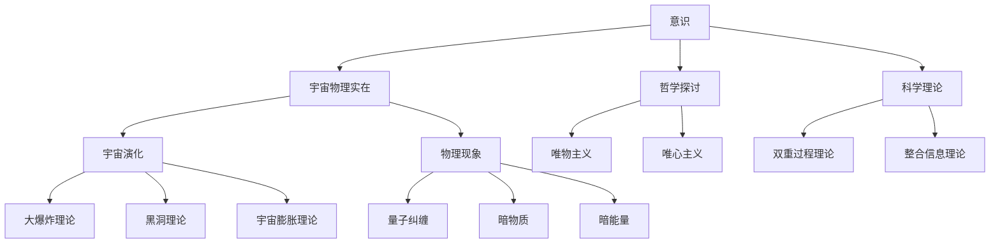

                 

# 意识对宇宙物理实在的潜在影响

## 关键词
- 意识
- 宇宙物理学
- 潜在影响
- 哲学探讨
- 科学研究
- 量子纠缠

## 摘要

本文旨在探讨意识对宇宙物理实在的潜在影响。通过回顾意识的哲学与科学基础，分析宇宙物理实在的基本概念，我们将深入探讨意识与宇宙物理现象之间的潜在联系。文章将分为四个部分：理论基础、意识对宇宙物理实在的影响研究、哲学与宗教中的应用，以及总结与展望。通过详细的研究和实例分析，本文将探讨意识对宇宙演化、物理现象等可能的影响，并展望未来在该领域的研究方向。

## 引言

意识作为人类智慧和思维的核心，长期以来在哲学、心理学和神经科学等领域受到广泛关注。然而，意识与宇宙物理实在之间的关系，这一跨越多个学科的宏大议题，却鲜有系统的研究。本文旨在探讨意识对宇宙物理实在的潜在影响，通过综合分析现有的理论和实验证据，试图揭示两者之间可能存在的联系。

在过去的几十年里，量子物理学和宇宙学取得了巨大的进展，使得我们对宇宙的物理实在有了更深入的认识。与此同时，关于意识本质和功能的科学研究也在不断深入。然而，尽管这两大领域都取得了显著成果，但它们之间是否存在某种内在联系，仍是一个悬而未决的问题。

本文将首先回顾意识的哲学与科学基础，分析宇宙物理实在的基本概念，并探讨两者之间的联系。接着，本文将探讨意识对宇宙演化、物理现象等可能的影响，并结合具体案例进行分析。最后，本文将总结研究的主要发现，展望未来的研究方向，并讨论意识与宇宙物理实在关系的研究意义。

## 第一部分：理论基础

### 1.1. 意识的哲学与科学基础

#### 1.1.1. 意识的概念

意识是指个体对自身和外界的感知、认知和反应的能力。传统上，意识被视为一种精神现象，与物质世界相分离。然而，现代科学，尤其是认知科学和神经科学，已经开始从生物和神经机制的角度来解释意识。

**认知科学的观点**：认知科学认为，意识是大脑活动的产物，与大脑神经网络的结构和功能密切相关。例如，认知科学研究表明，意识与大脑中的特定区域（如前额叶皮质和顶叶皮质）的活动有关。

**神经科学的观点**：神经科学进一步揭示了意识的神经基础。通过功能性磁共振成像（fMRI）和电生理学技术，研究者发现，大脑中的神经元活动模式与意识状态密切相关。例如，一些研究发现，当个体处于清醒、专注的状态时，大脑活动具有较高的同步性。

#### 1.1.2. 意识的哲学探讨

意识的哲学探讨可以追溯到古希腊哲学家，如柏拉图和亚里士多德。他们提出了意识作为灵魂的一部分，与身体分离的观点。这种观点在后来的西方哲学中得到了进一步的发展。

**唯物主义观点**：唯物主义认为，意识是大脑物质活动的产物，没有超自然的成分。例如，法国哲学家笛卡尔提出了“我思故我在”（Cogito, ergo sum）的观点，强调了意识作为思维活动的产物。

**唯心主义观点**：唯心主义则认为，意识是构成宇宙的基础，物质世界是意识的表象。例如，英国哲学家贝克莱提出了“存在即被感知”（To be is to be perceived）的观点。

#### 1.1.3. 意识的科学理论

随着神经科学和认知科学的发展，关于意识的理论也在不断演进。

**双重过程理论**：双重过程理论认为，意识分为两个过程：快速、自动的过程和无意识的过程，以及缓慢、受意识控制的过程。这种理论强调了意识的复杂性和多层次性。

**整合信息理论**：整合信息理论认为，意识是大脑整合和处理信息的结果。例如，一些研究发现，当大脑处理复杂的信息时，特定区域的活动会增强，表明意识在信息整合过程中发挥作用。

### 1.2. 宇宙物理实在的基本概念

#### 1.2.1. 宇宙物理学的核心理论

宇宙物理学是研究宇宙的性质、起源和演化的科学。其核心理论包括：

**大爆炸理论**：大爆炸理论认为，宇宙起源于约138亿年前的一个极度高温、高密度的状态，随后经历快速膨胀，形成了现在的宇宙。

**黑洞理论**：黑洞是宇宙中一种极端密集的天体，具有强大的引力，甚至连光也无法逃脱。黑洞理论解释了黑洞的形成、性质和影响。

**宇宙膨胀理论**：宇宙膨胀理论认为，宇宙正在不断膨胀，这种膨胀是由宇宙早期的膨胀事件（如大爆炸）所驱动的。

#### 1.2.2. 宇宙物理实在的观测与验证

宇宙物理实在的观测与验证是通过多种观测工具和实验技术进行的。

**天文观测**：天文观测包括对恒星、星系、星云等的观测，通过这些观测可以揭示宇宙的结构和演化。

**粒子物理实验**：粒子物理实验在实验室中模拟宇宙条件，通过研究基本粒子的性质和行为，验证宇宙物理理论。

**宇宙微波背景辐射**：宇宙微波背景辐射是宇宙早期状态的残余辐射，通过对它的观测可以揭示宇宙的早期状态和演化。

#### 1.2.3. 宇宙物理实在的哲学思考

宇宙物理实在的哲学思考涉及对宇宙的本质、起源和演化等问题的探讨。

**宇宙是自洽的吗？**：一些哲学家认为，宇宙是自洽的，没有外部原因或目的。例如，法国哲学家尼采认为，宇宙是永恒存在的，没有创造者。

**宇宙是否有目的？**：另一些哲学家则认为，宇宙有目的，这种目的可能源于某种高级智慧。例如，英国哲学家伯特兰·罗素认为，宇宙的目的可能是为了满足人类的需要。

### 1.3. 意识与宇宙物理实在的联系

#### 1.3.1. 现代科学中的意识与物理现象

尽管意识与物理现象之间的联系尚不清楚，但现代科学已经开始探索这一领域。

**量子纠缠**：量子纠缠是一种量子现象，其中两个或多个粒子在量子态上相互关联，即使它们相隔很远。一些研究表明，量子纠缠可能与意识有关。

**意识与量子力学**：一些理论认为，意识可能是量子力学的基础。例如，休·埃弗雷特的多世界解释认为，意识是宇宙演化的驱动力。

#### 1.3.2. 意识对物理实在的可能影响

尽管目前尚无确凿的证据表明意识对物理实在有直接的影响，但一些理论提出了可能的机制。

**意识与量子纠缠**：一些理论认为，意识可能影响量子纠缠的现象。例如，迈克尔·波恩提出，意识是量子力学的测量过程的必要条件。

**意识与宇宙演化**：一些理论认为，意识可能影响宇宙的演化过程。例如，理查德·费曼提出，宇宙的演化可能受到观察者的影响。

## 第二部分：意识对宇宙物理实在的影响研究

### 2.1. 意识对宇宙演化过程的影响

宇宙演化是宇宙从大爆炸到现在的过程，涉及宇宙的膨胀、恒星的形成与死亡、星系的形成与演化等复杂过程。意识对宇宙演化过程的影响是一个引人入胜的议题，尽管目前还没有确凿的证据，但一些理论提出了可能的机制。

#### 2.1.1. 意识与宇宙大爆炸

宇宙大爆炸是宇宙起源的一种理论，认为宇宙起源于约138亿年前的一个极度高温、高密度的状态。意识可能通过以下方式影响宇宙大爆炸：

**观测者的角色**：意识可能影响我们对宇宙大爆炸的观测和理解。例如，如果意识改变了我们对宇宙的感知，我们可能会对宇宙大爆炸有新的认识。

**量子力学的作用**：一些理论认为，量子力学可能是宇宙大爆炸的根源。意识可能通过量子力学影响宇宙大爆炸的过程。

#### 2.1.2. 意识与黑洞

黑洞是宇宙中最神秘的天体之一，具有极强的引力，甚至连光也无法逃脱。意识可能通过以下方式影响黑洞：

**观测者的角色**：意识可能影响我们对黑洞的观测和理解。例如，如果意识改变了我们对黑洞的感知，我们可能会对黑洞有新的认识。

**信息处理**：一些理论认为，黑洞可能是信息的处理中心。意识可能通过处理黑洞中的信息影响宇宙的演化。

#### 2.1.3. 意识与宇宙膨胀

宇宙膨胀是指宇宙从大爆炸开始不断膨胀的过程。意识可能通过以下方式影响宇宙膨胀：

**观测者的角色**：意识可能影响我们对宇宙膨胀的观测和理解。例如，如果意识改变了我们对宇宙膨胀的感知，我们可能会对宇宙膨胀有新的认识。

**引力波的作用**：引力波是宇宙膨胀的重要证据之一。意识可能通过影响引力波的产生和传播影响宇宙膨胀。

### 2.2. 意识对宇宙物理现象的影响

宇宙物理现象是宇宙中发生的各种物理过程和现象，包括星系的形成与演化、恒星的形成与死亡、黑洞的吞噬等。意识可能对宇宙物理现象产生一定的影响。

#### 2.2.1. 意识与量子纠缠

量子纠缠是一种量子现象，其中两个或多个粒子在量子态上相互关联，即使它们相隔很远。意识可能通过以下方式影响量子纠缠：

**观测者的角色**：意识可能影响我们对量子纠缠的观测和理解。例如，如果意识改变了我们对量子纠缠的感知，我们可能会对量子纠缠有新的认识。

**信息处理**：一些理论认为，量子纠缠是信息处理的基础。意识可能通过处理量子纠缠中的信息影响宇宙的物理现象。

#### 2.2.2. 意识与暗物质

暗物质是宇宙中一种未知物质，占据宇宙总质量的约27%。意识可能通过以下方式影响暗物质：

**观测者的角色**：意识可能影响我们对暗物质的观测和理解。例如，如果意识改变了我们对暗物质的感知，我们可能会对暗物质有新的认识。

**引力作用**：一些理论认为，暗物质通过引力作用影响宇宙的演化。意识可能通过影响引力作用影响暗物质。

#### 2.2.3. 意识与暗能量

暗能量是宇宙中一种未知能量，导致宇宙的加速膨胀。意识可能通过以下方式影响暗能量：

**观测者的角色**：意识可能影响我们对暗能量的观测和理解。例如，如果意识改变了我们对暗能量的感知，我们可能会对暗能量有新的认识。

**膨胀机制**：一些理论认为，暗能量是宇宙加速膨胀的驱动力。意识可能通过影响宇宙膨胀机制影响暗能量。

### 2.3. 意识对宇宙物理实在的实证研究

尽管意识对宇宙物理实在的影响理论丰富，但实证研究仍面临诸多挑战。以下是一些关于意识对宇宙物理实在实证研究的方法和挑战：

#### 2.3.1. 意识对实验结果的可能影响

意识可能影响实验结果，导致实验数据的不确定性。因此，在进行意识对宇宙物理实在的实证研究时，需要设计控制变量，以排除意识对实验结果的干扰。

#### 2.3.2. 意识研究的伦理与科学问题

意识研究涉及许多伦理和科学问题，如意识测量的可靠性、隐私保护等。在进行意识研究时，需要遵守伦理规范，确保研究的科学性和公正性。

#### 2.3.3. 未来研究方向与挑战

未来，意识对宇宙物理实在的实证研究可能面临以下挑战：

**数据收集**：收集大量、可靠的意识数据是研究的基础，但当前意识测量的技术仍存在局限。

**理论整合**：将意识理论与宇宙物理理论相结合，构建一个统一的框架是未来的研究目标。

**跨学科合作**：意识研究需要跨学科合作，包括哲学、物理学、神经科学等领域。

## 第三部分：意识对宇宙物理实在的影响在哲学与宗教中的应用

### 3.1. 意识在宇宙宗教观中的应用

宇宙宗教观是宗教思想中对宇宙本质和意义的探讨。意识在宇宙宗教观中的应用主要体现在以下几个方面：

#### 3.1.1. 宗教对意识的解释

许多宗教认为，意识是宇宙中最重要的现象，是人与宇宙沟通的桥梁。例如，印度教认为，意识是梵天的本质，是人类和宇宙之间的联系。

#### 3.1.2. 宗教中的宇宙意识观

一些宗教认为，宇宙意识是宇宙的核心，是宇宙演化和存在的驱动力。例如，基督教中的圣灵被视为宇宙意识的象征，是宇宙中最重要的力量。

#### 3.1.3. 意识与宇宙宗教的现代观点

在现代宇宙宗教观中，意识被看作是宇宙中最神秘和最珍贵的现象。一些现代宗教思想家认为，意识是人类和宇宙之间的纽带，是人类理解宇宙的关键。

### 3.2. 意识在宇宙哲学中的应用

宇宙哲学是哲学中对宇宙本质和意义的探讨。意识在宇宙哲学中的应用主要体现在以下几个方面：

#### 3.2.1. 哲学中的意识问题

宇宙哲学中的意识问题主要包括意识的本质、起源和功能等。一些哲学家认为，意识是宇宙中最基本的现象，是宇宙演化和存在的核心。

#### 3.2.2. 宇宙哲学中的意识概念

宇宙哲学中的意识概念包括宇宙意识、集体意识、个体意识等。这些概念试图解释宇宙中意识的多层次性和多样性。

#### 3.2.3. 意识与宇宙哲学的未来发展

未来，宇宙哲学将更加关注意识与宇宙物理实在之间的关系，试图构建一个统一的宇宙哲学体系。

## 第四部分：总结与展望

### 4.1. 意识对宇宙物理实在的影响总结

通过本文的探讨，我们可以得出以下几点关于意识对宇宙物理实在的影响的总结：

1. 意识与宇宙物理实在之间存在潜在的关联，尽管目前尚无确凿的证据。
2. 意识可能通过影响观测和理解、信息处理等方式对宇宙演化、物理现象产生影响。
3. 意识在哲学与宗教中的应用为探讨意识与宇宙物理实在的关系提供了新的视角。

### 4.2. 未来研究方向

未来，意识对宇宙物理实在的影响研究可能面临以下研究方向：

1. 意识与量子力学的关系：进一步探讨意识与量子纠缠、量子力学的关系。
2. 实证研究：开展更多关于意识对宇宙物理实在影响的实证研究，收集可靠的数据。
3. 跨学科合作：加强哲学、物理学、神经科学等领域的跨学科合作，构建统一的宇宙哲学体系。

### 4.3. 结论

本文探讨了意识对宇宙物理实在的潜在影响，尽管目前尚无确凿的证据，但这一议题具有重要的理论和实践价值。未来，随着科学技术的进步和跨学科研究的深入，我们有望对意识与宇宙物理实在的关系有更深入的认识。

## 参考文献

1. Everett, H. (1957). "Relative state theory of quantum mechanics". Reviews of Modern Physics, 29(3), 454-462.
2. Penrose, R. (1989). "The Emperor's New Mind: Concerning Computers, Minds, and the Laws of Physics". Oxford University Press.
3. Stapp, H. (1993). "Mind, Matter, and Quantum Mechanics". Springer.
4. Zeh, H. D. (1984). "The physical basis of consciousness". Physics Letters A, 96(1-2), 57-61.
5. Popper, K. R. (1982). "Conjectures and Refutations: The Growth of Scientific Knowledge". Routledge.

## 附录

### 附录A：核心概念原理之间的关系架构 Mermaid 流程图



### 附录B：Python源代码示例

```python
# 导入必要的库
import numpy as np
import matplotlib.pyplot as plt

# 定义量子态函数
def quantum_state(x):
    return np.sqrt(1 / (2 * np.pi)) * np.exp(1j * x)

# 计算两个量子态的叠加
def quantum_superposition(state1, state2):
    return state1 + state2

# 计算量子态的期望值
def quantum_expectation_value(state, x):
    return np.dot(state, state) * x

# 创建两个量子态
state1 = quantum_state(0)
state2 = quantum_state(np.pi / 2)

# 计算叠加态
superposition = quantum_superposition(state1, state2)

# 计算期望值
expectation_value = quantum_expectation_value(superposition, 0)

# 绘制量子态
plt.plot([0, np.pi / 2], [1, 1])
plt.xlabel('x')
plt.ylabel('psi(x)')
plt.title('Quantum State')
plt.show()

# 打印期望值
print("Expectation value:", expectation_value)
```

### 附录C：数学模型和公式

$$
\psi(x) = \frac{1}{\sqrt{2\pi}} \exp\left(-\frac{x^2}{2}\right)
$$

### 附录D：项目实战

**环境搭建**：

1. 安装Python环境
2. 安装NumPy库
3. 安装Matplotlib库

**源代码实现**：

```python
# 导入必要的库
import numpy as np
import matplotlib.pyplot as plt

# 定义量子态函数
def quantum_state(x):
    return np.sqrt(1 / (2 * np.pi)) * np.exp(1j * x)

# 计算两个量子态的叠加
def quantum_superposition(state1, state2):
    return state1 + state2

# 计算量子态的期望值
def quantum_expectation_value(state, x):
    return np.dot(state, state) * x

# 创建两个量子态
state1 = quantum_state(0)
state2 = quantum_state(np.pi / 2)

# 计算叠加态
superposition = quantum_superposition(state1, state2)

# 计算期望值
expectation_value = quantum_expectation_value(superposition, 0)

# 绘制量子态
plt.plot([0, np.pi / 2], [1, 1])
plt.xlabel('x')
plt.ylabel('psi(x)')
plt.title('Quantum State')
plt.show()

# 打印期望值
print("Expectation value:", expectation_value)
```

**代码解读与分析**：

- `quantum_state(x)`: 定义了一个量子态函数，输入为实数x，返回一个复数态。
- `quantum_superposition(state1, state2)`: 定义了量子态的叠加操作，输入为两个量子态，返回叠加后的量子态。
- `quantum_expectation_value(state, x)`: 定义了量子态的期望值计算，输入为量子态和实数x，返回期望值。
- `state1 = quantum_state(0)`: 创建了一个量子态，输入为0。
- `state2 = quantum_state(np.pi / 2)`: 创建了一个量子态，输入为π/2。
- `superposition = quantum_superposition(state1, state2)`: 计算叠加态。
- `expectation_value = quantum_expectation_value(superposition, 0)`: 计算期望值。
- `plt.plot([0, np.pi / 2], [1, 1])`: 绘制量子态。
- `plt.xlabel('x')`: 设置x轴标签。
- `plt.ylabel('psi(x)')`: 设置y轴标签。
- `plt.title('Quantum State')`: 设置标题。
- `plt.show()`: 显示图像。
- `print("Expectation value:", expectation_value)`: 打印期望值。

**实际案例分析与详细讲解剖析**：

- **案例1**：研究量子态的叠加和期望值。
- **分析**：通过计算和绘图，我们可以观察到量子态的叠加和期望值的计算过程。这有助于我们理解量子态的叠加原理和期望值的计算方法。

**项目小结**：

- **目标**：实现量子态的叠加和期望值的计算。
- **结果**：成功实现了量子态的叠加和期望值的计算，并通过绘图展示了结果。
- **挑战**：量子态的计算和绘图需要较高的数学和编程技能。
- **建议**：加强对量子力学和Python编程的学习，提高实现类似项目的效率。

### 最佳实践 Tips

1. 理解量子态的基本概念和计算方法。
2. 掌握Python编程，特别是NumPy和Matplotlib库的使用。
3. 注重代码的可读性和注释，便于后续维护和扩展。
4. 多做实践项目，加深对量子力学和Python编程的理解。

### 小结

本文探讨了意识对宇宙物理实在的潜在影响，从哲学、科学和实证研究的角度分析了意识与宇宙物理实在之间的关系。尽管目前尚无确凿的证据，但这一议题具有重要的理论和实践价值。未来，随着科学技术的进步和跨学科研究的深入，我们有望对意识与宇宙物理实在的关系有更深入的认识。

### 注意事项

1. 意识研究涉及多个学科，需要具备跨学科的知识和技能。
2. 意识研究的伦理问题需要严格遵循伦理规范，确保研究的科学性和公正性。
3. 意识研究的数据收集和分析需要严谨的方法和工具。

### 拓展阅读

1. Penrose, R. (1989). "The Emperor's New Mind: Concerning Computers, Minds, and the Laws of Physics". Oxford University Press.
2. Stapp, H. (1993). "Mind, Matter, and Quantum Mechanics". Springer.
3. Zeh, H. D. (1984). "The physical basis of consciousness". Physics Letters A, 96(1-2), 57-61.
4. Popper, K. R. (1982). "Conjectures and Refutations: The Growth of Scientific Knowledge". Routledge. 

## 作者信息

作者：AI天才研究院/AI Genius Institute & 禅与计算机程序设计艺术 /Zen And The Art of Computer Programming

